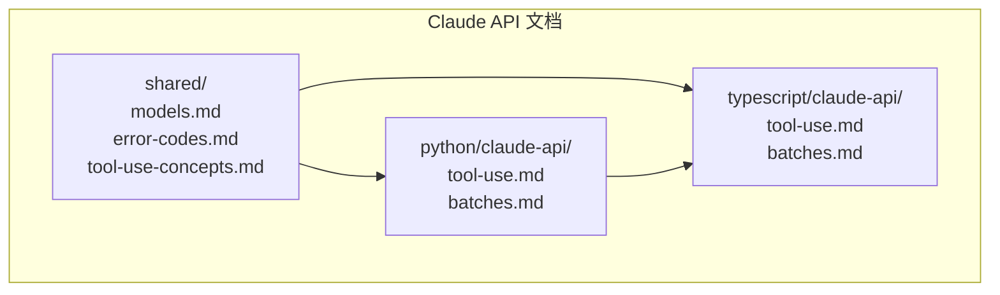
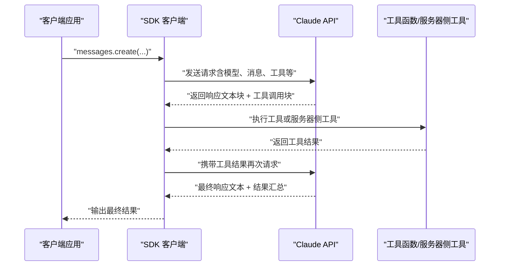
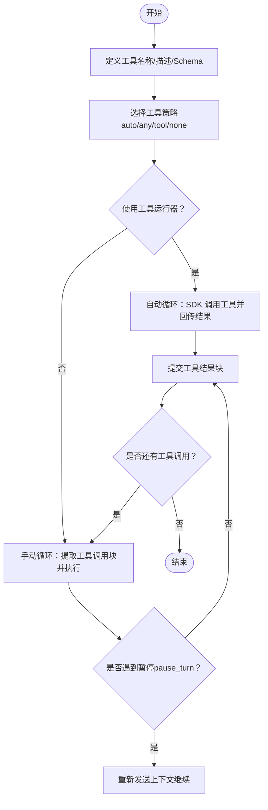
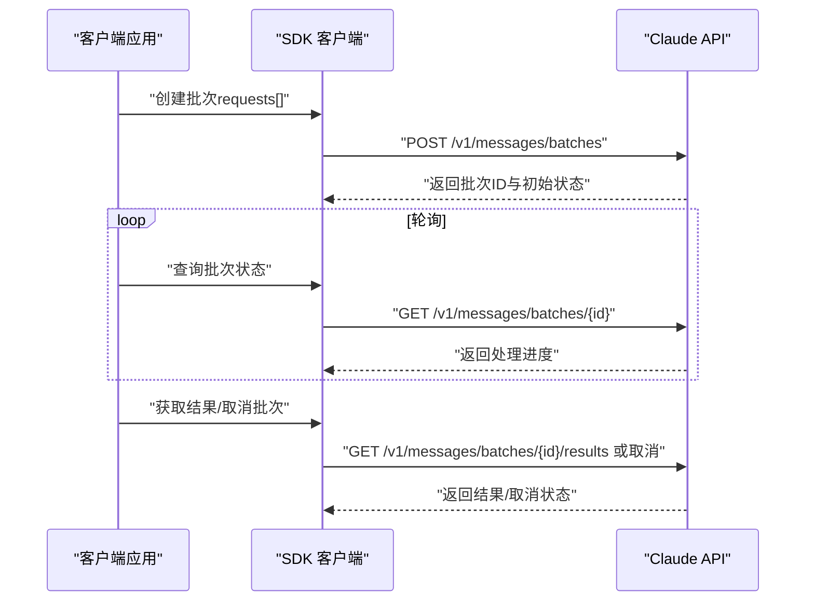
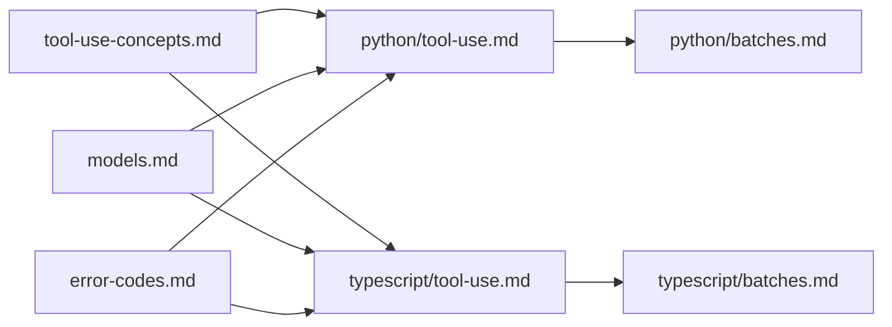

# API 参考文档

<cite>
**本文引用的文件**
- [skills/spec/agent-skills-spec.md](file://skills/spec/agent-skills-spec.md)
- [skills/skills/claude-api/shared/models.md](file://skills/skills/claude-api/shared/models.md)
- [skills/skills/claude-api/shared/error-codes.md](file://skills/skills/claude-api/shared/error-codes.md)
- [skills/skills/claude-api/shared/tool-use-concepts.md](file://skills/skills/claude-api/shared/tool-use-concepts.md)
- [skills/skills/claude-api/python/claude-api/tool-use.md](file://skills/skills/claude-api/python/claude-api/tool-use.md)
- [skills/skills/claude-api/typescript/claude-api/tool-use.md](file://skills/skills/claude-api/typescript/claude-api/tool-use.md)
- [skills/skills/claude-api/python/claude-api/batches.md](file://skills/skills/claude-api/python/claude-api/batches.md)
- [skills/skills/claude-api/typescript/claude-api/batches.md](file://skills/skills/claude-api/typescript/claude-api/batches.md)
</cite>

## 目录
1. [简介](#简介)
2. [项目结构](#项目结构)
3. [核心组件](#核心组件)
4. [架构总览](#架构总览)
5. [详细组件分析](#详细组件分析)
6. [依赖关系分析](#依赖关系分析)
7. [性能考量](#性能考量)
8. [故障排查指南](#故障排查指南)
9. [结论](#结论)
10. [附录](#附录)

## 简介
本文件为 Claude 技能系统（Agent Skills）的 API 参考文档，覆盖以下内容：
- Claude Messages API 的接口规范与使用要点
- 工具调用（Tool Use）的参数格式、返回结构与错误处理策略
- 批量消息（Batches）API 的异步处理流程
- 错误码参考与重试建议
- 安全注意事项、速率限制与版本信息
- 常见用例、客户端实现指南与性能优化技巧
- 已弃用功能与迁移建议（基于模型生命周期）

## 项目结构
该仓库以“技能”为中心组织，Claude API 相关文档主要集中在 skills/skills/claude-api 下，包含：
- 共享概念：模型清单、错误码、工具使用概念
- 多语言 SDK 示例：Python、TypeScript
- 批量消息 API 示例

图表来源
- [skills/skills/claude-api/shared/models.md:1-69](file://skills/skills/claude-api/shared/models.md#L1-L69)
- [skills/skills/claude-api/shared/error-codes.md:1-206](file://skills/skills/claude-api/shared/error-codes.md#L1-L206)
- [skills/skills/claude-api/shared/tool-use-concepts.md:1-306](file://skills/skills/claude-api/shared/tool-use-concepts.md#L1-L306)
- [skills/skills/claude-api/python/claude-api/tool-use.md:1-588](file://skills/skills/claude-api/python/claude-api/tool-use.md#L1-L588)
- [skills/skills/claude-api/typescript/claude-api/tool-use.md:1-478](file://skills/skills/claude-api/typescript/claude-api/tool-use.md#L1-L478)
- [skills/skills/claude-api/python/claude-api/batches.md:1-183](file://skills/skills/claude-api/python/claude-api/batches.md#L1-L183)
- [skills/skills/claude-api/typescript/claude-api/batches.md:1-107](file://skills/skills/claude-api/typescript/claude-api/batches.md#L1-L107)

章节来源
- [skills/spec/agent-skills-spec.md:1-4](file://skills/spec/agent-skills-spec.md#L1-L4)

## 核心组件
- 模型目录与别名：提供当前可用模型、历史模型与已停用模型的映射，确保请求中使用精确的模型 ID 或别名。
- 错误码参考：涵盖 400/401/403/404/413/429/500/529 等错误类型、常见原因与修复建议。
- 工具使用概念：定义工具定义结构、工具选择策略、手动循环与自动工具运行器（Tool Runner）的工作方式。
- 批量消息 API：支持异步批量处理，降低 50% 成本，提供创建、轮询、取消与结果提取流程。

章节来源
- [skills/skills/claude-api/shared/models.md:1-69](file://skills/skills/claude-api/shared/models.md#L1-L69)
- [skills/skills/claude-api/shared/error-codes.md:1-206](file://skills/skills/claude-api/shared/error-codes.md#L1-L206)
- [skills/skills/claude-api/shared/tool-use-concepts.md:1-306](file://skills/skills/claude-api/shared/tool-use-concepts.md#L1-L306)
- [skills/skills/claude-api/python/claude-api/batches.md:1-183](file://skills/skills/claude-api/python/claude-api/batches.md#L1-L183)
- [skills/skills/claude-api/typescript/claude-api/batches.md:1-107](file://skills/skills/claude-api/typescript/claude-api/batches.md#L1-L107)

## 架构总览
下图展示 Claude Messages API 在工具使用与批量处理场景中的典型交互：

图表来源
- [skills/skills/claude-api/shared/tool-use-concepts.md:60-84](file://skills/skills/claude-api/shared/tool-use-concepts.md#L60-L84)
- [skills/skills/claude-api/python/claude-api/tool-use.md:130-184](file://skills/skills/claude-api/python/claude-api/tool-use.md#L130-L184)
- [skills/skills/claude-api/typescript/claude-api/tool-use.md:51-99](file://skills/skills/claude-api/typescript/claude-api/tool-use.md#L51-L99)

## 详细组件分析

### Messages API 接口规范
- 身份验证
  - 使用请求头携带 API Key；错误码参考中明确 401/403 的常见原因与修复建议。
- 请求参数
  - 必填字段与校验规则详见错误码文档中的 400 类错误说明。
  - 模型 ID 必须使用精确值或别名，避免拼写错误导致 404。
- 响应结构
  - 响应内容由文本块与工具块交错组成；工具调用需在后续请求中以工具结果块回传。
- 版本与能力
  - 某些工具（如动态过滤的网络搜索/抓取）与结构化输出仅在特定模型上可用，详见模型与工具概念文档。

章节来源
- [skills/skills/claude-api/shared/error-codes.md:20-47](file://skills/skills/claude-api/shared/error-codes.md#L20-L47)
- [skills/skills/claude-api/shared/models.md:1-69](file://skills/skills/claude-api/shared/models.md#L1-L69)
- [skills/skills/claude-api/shared/tool-use-concepts.md:252-291](file://skills/skills/claude-api/shared/tool-use-concepts.md#L252-L291)

### 工具使用（Tool Use）
- 工具定义结构
  - 需要名称、描述与输入 JSON Schema；属性描述、枚举与必填项有助于模型正确调用。
- 工具选择策略
  - 支持 auto/any/tool/none；可禁用并行工具调用以保证顺序。
- 自动工具运行器（推荐）
  - Python/TypeScript 提供工具运行器，自动处理循环、调用工具与回传结果。
- 手动循环
  - 当需要细粒度控制时，循环直到 stop_reason 为 end_turn；服务器侧工具可能因迭代上限暂停，需按文档提示重新发送上下文继续。
- 错误处理
  - 工具失败时返回错误块，模型通常会尝试替代方案或请求澄清。
- 服务器侧工具
  - 代码执行、网络搜索/抓取、程序化工具调用、工具搜索等，无需客户端执行，直接声明工具即可。
- 结构化输出
  - 通过 JSON Schema 限制输出格式，提高解析可靠性；注意不支持的约束与兼容性限制。

图表来源
- [skills/skills/claude-api/shared/tool-use-concepts.md:45-84](file://skills/skills/claude-api/shared/tool-use-concepts.md#L45-L84)
- [skills/skills/claude-api/python/claude-api/tool-use.md:5-50](file://skills/skills/claude-api/python/claude-api/tool-use.md#L5-L50)
- [skills/skills/claude-api/typescript/claude-api/tool-use.md:5-49](file://skills/skills/claude-api/typescript/claude-api/tool-use.md#L5-L49)

章节来源
- [skills/skills/claude-api/shared/tool-use-concepts.md:1-306](file://skills/skills/claude-api/shared/tool-use-concepts.md#L1-L306)
- [skills/skills/claude-api/python/claude-api/tool-use.md:1-588](file://skills/skills/claude-api/python/claude-api/tool-use.md#L1-L588)
- [skills/skills/claude-api/typescript/claude-api/tool-use.md:1-478](file://skills/skills/claude-api/typescript/claude-api/tool-use.md#L1-L478)

### 批量消息（Batches）
- 功能特性
  - 异步处理、50% 成本折扣、支持所有 Messages API 能力（视觉、工具、缓存等）。
- 流程
  - 创建批次 -> 轮询状态 -> 取消或获取结果 -> 过期与重试策略。
- 并发与配额
  - 单批次上限与最大耗时限制，结果保留周期有限。

图表来源
- [skills/skills/claude-api/python/claude-api/batches.md:15-98](file://skills/skills/claude-api/python/claude-api/batches.md#L15-L98)
- [skills/skills/claude-api/typescript/claude-api/batches.md:15-106](file://skills/skills/claude-api/typescript/claude-api/batches.md#L15-L106)

章节来源
- [skills/skills/claude-api/python/claude-api/batches.md:1-183](file://skills/skills/claude-api/python/claude-api/batches.md#L1-L183)
- [skills/skills/claude-api/typescript/claude-api/batches.md:1-107](file://skills/skills/claude-api/typescript/claude-api/batches.md#L1-L107)

### 文件上传与代码执行（Files API 与容器复用）
- 文件上传
  - 通过 beta 文件 API 上传文件，随后在消息中以容器上传块传递给代码执行工具。
- 生成文件下载
  - 从工具结果中提取文件元数据与内容，注意安全命名与路径校验。
- 容器复用
  - 通过容器 ID 在多次请求间复用执行环境，提升效率。

章节来源
- [skills/skills/claude-api/python/claude-api/tool-use.md:283-383](file://skills/skills/claude-api/python/claude-api/tool-use.md#L283-L383)
- [skills/skills/claude-api/typescript/claude-api/tool-use.md:217-346](file://skills/skills/claude-api/typescript/claude-api/tool-use.md#L217-L346)

## 依赖关系分析
- 概念到实现
  - shared/tool-use-concepts.md 定义工具使用范式，Python/TypeScript 的 tool-use.md 提供具体 SDK 实现与最佳实践。
  - shared/models.md 与 shared/error-codes.md 为 API 行为与错误处理提供权威依据。
- 语言 SDK 的一致性
  - Python 与 TypeScript 的工具使用与批量 API 示例在语义与流程上保持一致，便于跨语言迁移。

图表来源
- [skills/skills/claude-api/shared/tool-use-concepts.md:1-306](file://skills/skills/claude-api/shared/tool-use-concepts.md#L1-L306)
- [skills/skills/claude-api/shared/models.md:1-69](file://skills/skills/claude-api/shared/models.md#L1-L69)
- [skills/skills/claude-api/shared/error-codes.md:1-206](file://skills/skills/claude-api/shared/error-codes.md#L1-L206)
- [skills/skills/claude-api/python/claude-api/tool-use.md:1-588](file://skills/skills/claude-api/python/claude-api/tool-use.md#L1-L588)
- [skills/skills/claude-api/typescript/claude-api/tool-use.md:1-478](file://skills/skills/claude-api/typescript/claude-api/tool-use.md#L1-L478)
- [skills/skills/claude-api/python/claude-api/batches.md:1-183](file://skills/skills/claude-api/python/claude-api/batches.md#L1-L183)
- [skills/skills/claude-api/typescript/claude-api/batches.md:1-107](file://skills/skills/claude-api/typescript/claude-api/batches.md#L1-L107)

## 性能考量
- 优先使用工具运行器（Tool Runner），减少手写循环的开销与出错概率。
- 合理设置 max_tokens，避免超限导致 413；对长对话启用系统级共享内容与缓存以降低重复成本。
- 使用批量 API（Batches）进行大规模任务，获得 50% 成本折扣与更好的吞吐。
- 对于代码执行与文件操作，利用容器复用与最小化文件传输，缩短端到端延迟。
- 结构化输出配合严格工具 Schema，可减少无效往返与重试。

## 故障排查指南
- 400 无效请求
  - 检查模型 ID、参数类型与消息交替；修正后重试。
- 401 未授权
  - 确认 API Key 设置正确且未泄露；使用环境变量管理密钥。
- 403 禁止访问
  - 校验权限与组织限制；必要时申请访问特定模型或功能。
- 404 未找到
  - 使用精确模型 ID 或别名；避免已弃用 ID。
- 413 请求过大
  - 缩短输入、压缩图片或拆分文档。
- 429 速率限制
  - SDK 默认指数退避重试；根据头部信息（如 retry-after、配额剩余）调整节奏。
- 500/529 服务端问题
  - 指数退避重试；关注官方状态页面。
- 常见错误与修复对照表
  - 包括 budget_tokens 与 max_tokens 关系、首条消息角色、连续相同角色消息、API Key 泄露风险等。

章节来源
- [skills/skills/claude-api/shared/error-codes.md:19-206](file://skills/skills/claude-api/shared/error-codes.md#L19-L206)

## 结论
本参考文档梳理了 Claude 技能系统的核心 API 使用方式：从模型选择、工具定义与调用，到批量处理与错误处理策略。建议优先采用工具运行器与批量 API，结合模型与工具概念文档，构建稳定高效的智能体工作流。同时，严格遵循错误码与安全建议，确保生产环境的可靠性与合规性。

## 附录

### 模型与别名速查
- 当前推荐模型与别名、描述与上下文/输出窗口限制、以及 1M 上下文窗口的 beta 头部使用方式。
- 用户口语化描述到模型 ID 的映射，帮助自动解析用户意图。

章节来源
- [skills/skills/claude-api/shared/models.md:48-69](file://skills/skills/claude-api/shared/models.md#L48-L69)

### 工具使用最佳实践
- 清晰命名与描述、枚举参数、必要参数标记、并行工具调用控制、错误块 is_error 标记与信息丰富性。
- 服务器侧工具（代码执行、网络搜索/抓取）与结构化输出的组合使用建议。

章节来源
- [skills/skills/claude-api/shared/tool-use-concepts.md:35-57](file://skills/skills/claude-api/shared/tool-use-concepts.md#L35-L57)
- [skills/skills/claude-api/shared/tool-use-concepts.md:252-291](file://skills/skills/claude-api/shared/tool-use-concepts.md#L252-L291)

### 安全与合规
- 不在内存工具中存储敏感信息；多用户系统中实施访问控制与隐私保护。
- 文件下载时使用安全命名与路径校验，防止路径穿越攻击。
- 使用环境变量管理 API Key，避免硬编码。

章节来源
- [skills/skills/claude-api/shared/tool-use-concepts.md:244-245](file://skills/skills/claude-api/shared/tool-use-concepts.md#L244-L245)
- [skills/skills/claude-api/python/claude-api/tool-use.md:335-359](file://skills/skills/claude-api/python/claude-api/tool-use.md#L335-L359)
- [skills/skills/claude-api/typescript/claude-api/tool-use.md:280-313](file://skills/skills/claude-api/typescript/claude-api/tool-use.md#L280-L313)

### 版本与迁移
- 已弃用与停用模型列表，以及建议的替代方案（如 haiku 3.x 建议迁移到 haiku 4.5）。
- 结构化输出与工具 Schema 的兼容性与限制，避免在不支持的模型上使用。

章节来源
- [skills/skills/claude-api/shared/models.md:29-47](file://skills/skills/claude-api/shared/models.md#L29-L47)
- [skills/skills/claude-api/shared/tool-use-concepts.md:252-291](file://skills/skills/claude-api/shared/tool-use-concepts.md#L252-L291)