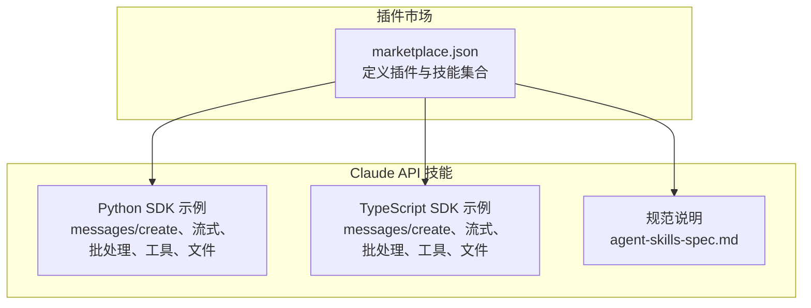
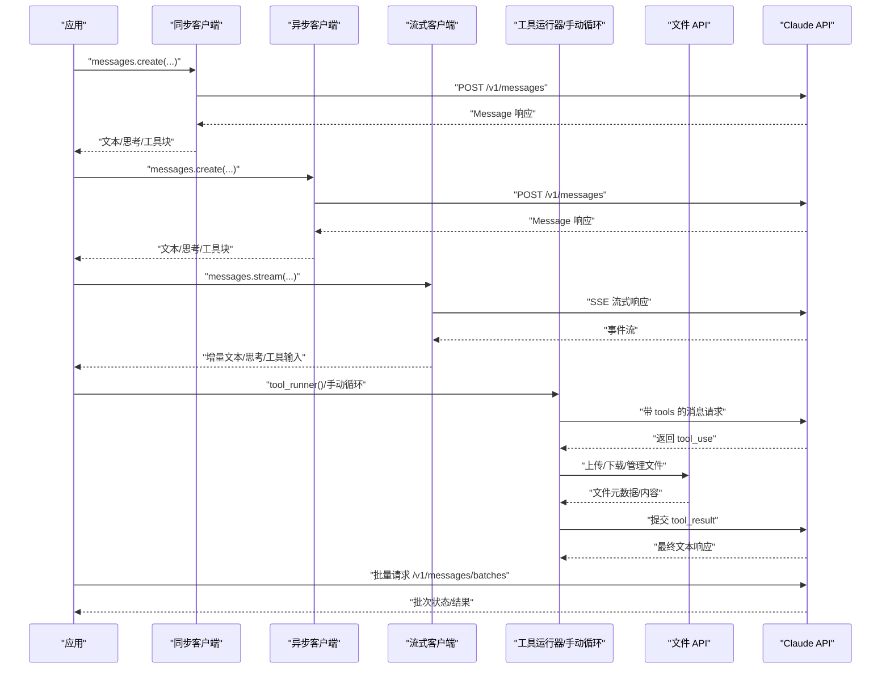
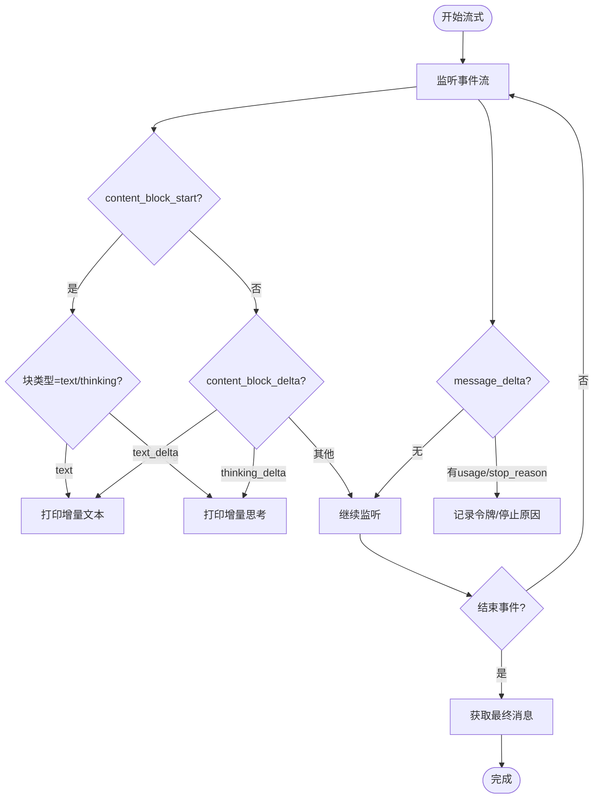
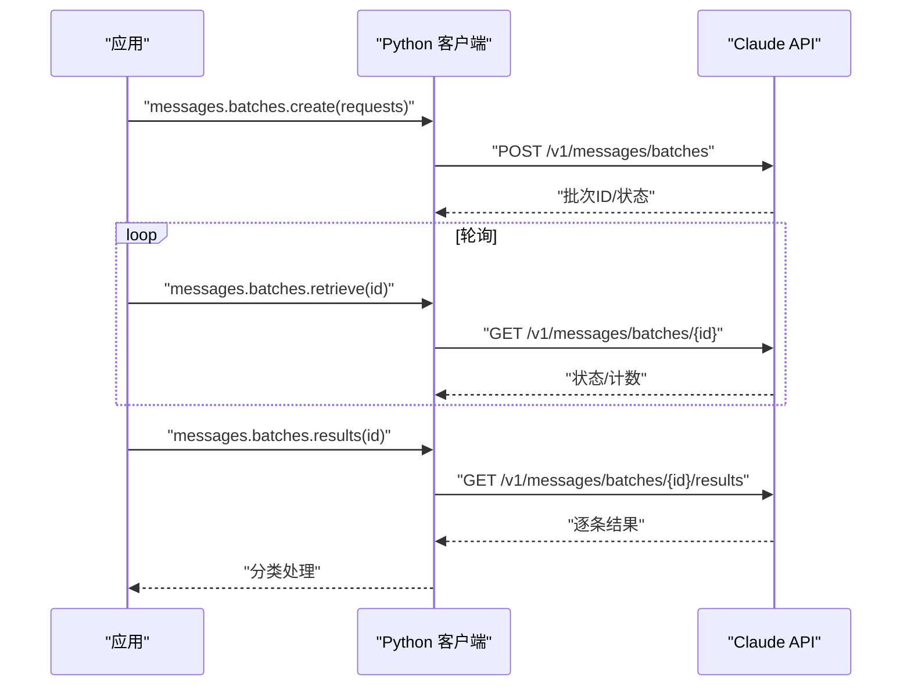
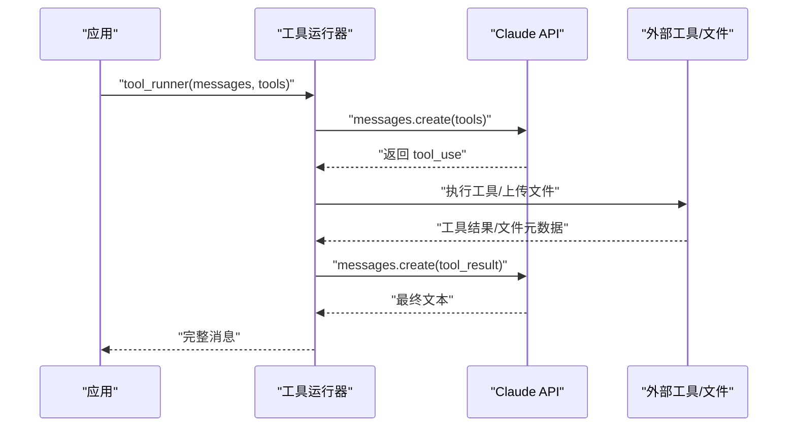
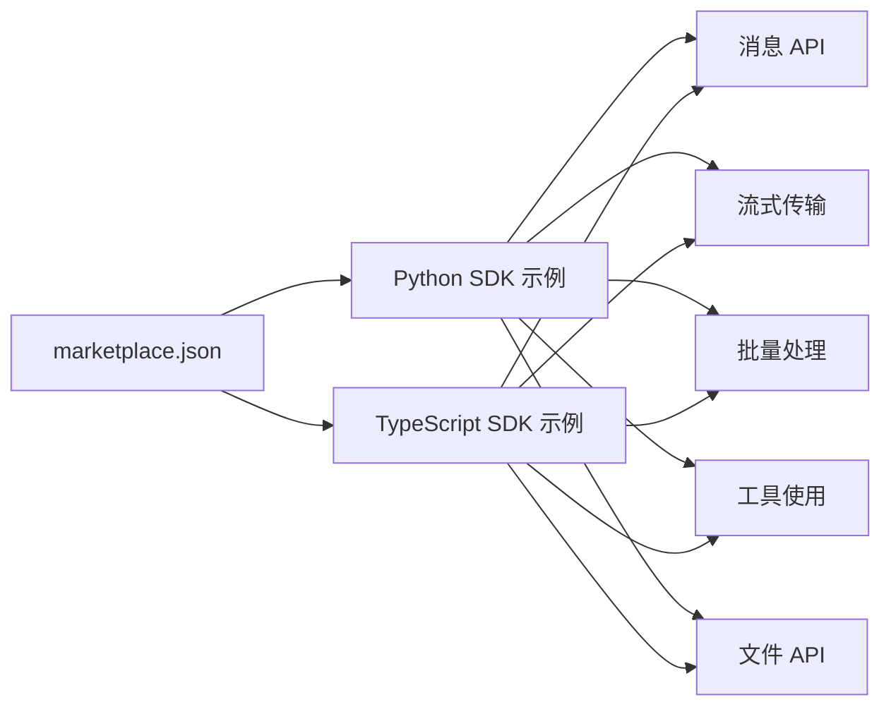

# API 调用示例

<cite>
**本文引用的文件**
- [marketplace.json](file://skills/.claude-plugin/marketplace.json)
- [agent-skills-spec.md](file://skills/spec/agent-skills-spec.md)
- [README.md（Python）](file://skills/skills/claude-api/python/claude-api/README.md)
- [batches.md（Python）](file://skills/skills/claude-api/python/claude-api/batches.md)
- [tool-use.md（Python）](file://skills/skills/claude-api/python/claude-api/tool-use.md)
- [streaming.md（Python）](file://skills/skills/claude-api/python/claude-api/streaming.md)
- [files-api.md（Python）](file://skills/skills/claude-api/python/claude-api/files-api.md)
- [README.md（TypeScript）](file://skills/skills/claude-api/typescript/claude-api/README.md)
- [batches.md（TypeScript）](file://skills/skills/claude-api/typescript/claude-api/batches.md)
- [tool-use.md（TypeScript）](file://skills/skills/claude-api/typescript/claude-api/tool-use.md)
- [streaming.md（TypeScript）](file://skills/skills/claude-api/typescript/claude-api/streaming.md)
- [files-api.md（TypeScript）](file://skills/skills/claude-api/typescript/claude-api/files-api.md)
</cite>

## 目录
1. [简介](#简介)
2. [项目结构](#项目结构)
3. [核心组件](#核心组件)
4. [架构总览](#架构总览)
5. [详细组件分析](#详细组件分析)
6. [依赖关系分析](#依赖关系分析)
7. [性能考量](#性能考量)
8. [故障排查指南](#故障排查指南)
9. [结论](#结论)
10. [附录](#附录)

## 简介
本文件面向希望在 Claude 技能系统中进行 API 调用的开发者，提供多语言（Python、TypeScript）的完整调用示例与最佳实践，覆盖同步/异步调用、流式传输、批量处理、工具使用、文件上传与下载、结构化输出、错误处理、性能优化与并发策略等主题。所有示例均基于仓库中的官方技能文档，确保可复现性与一致性。

## 项目结构
该仓库以“技能”为中心组织内容，Claude API 的多语言示例集中在 skills/skills/claude-api 下，分别提供 Python 与 TypeScript 的 SDK 使用说明、批处理、工具使用、流式传输与文件 API 等专题文档。插件市场清单文件展示了技能集合的组织方式与分组。

图表来源
- [marketplace.json:11-53](file://skills/.claude-plugin/marketplace.json#L11-L53)
- [README.md（Python）:1-405](file://skills/skills/claude-api/python/claude-api/README.md#L1-L405)
- [README.md（TypeScript）:1-314](file://skills/skills/claude-api/typescript/claude-api/README.md#L1-L314)
- [agent-skills-spec.md:1-4](file://skills/spec/agent-skills-spec.md#L1-L4)

章节来源
- [marketplace.json:1-56](file://skills/.claude-plugin/marketplace.json#L1-L56)
- [agent-skills-spec.md:1-4](file://skills/spec/agent-skills-spec.md#L1-L4)

## 核心组件
- 客户端初始化：支持默认环境变量与显式 API Key 初始化，Python 提供同步与异步客户端；TypeScript 提供同步客户端。
- 基础消息请求：发送用户消息并接收文本响应。
- 系统提示与上下文：通过 system 字段注入角色与上下文，结合缓存控制提升成本效益。
- 视觉能力：支持图片 URL 与 Base64 输入。
- 扩展思考：Opus/Sonnet 4.6 推荐自适应思考，旧模型使用预算令牌配置。
- 错误处理：区分鉴权、权限、速率限制、网络与服务端错误，建议使用 SDK 类型化异常。
- 多轮对话：保持会话历史，遵循交替规则与首条必须为用户消息。
- 停止原因：end_turn、max_tokens、stop_sequence、tool_use、pause_turn、refusal。
- 成本优化：提示缓存、模型选择、令牌计数预估。
- 重试机制：SDK 默认指数退避重试 429 与 5xx；可自定义扩展。

章节来源
- [README.md（Python）:9-207](file://skills/skills/claude-api/python/claude-api/README.md#L9-L207)
- [README.md（TypeScript）:9-201](file://skills/skills/claude-api/typescript/claude-api/README.md#L9-L201)

## 架构总览
下图展示从应用到 Claude API 的典型调用链路，涵盖同步、异步、流式、工具使用与文件 API 的关键节点。

图表来源
- [README.md（Python）:26-207](file://skills/skills/claude-api/python/claude-api/README.md#L26-L207)
- [streaming.md（Python）:5-141](file://skills/skills/claude-api/python/claude-api/streaming.md#L5-L141)
- [tool-use.md（Python）:9-183](file://skills/skills/claude-api/python/claude-api/tool-use.md#L9-L183)
- [files-api.md（Python）:17-162](file://skills/skills/claude-api/python/claude-api/files-api.md#L17-L162)
- [batches.md（Python）:15-88](file://skills/skills/claude-api/python/claude-api/batches.md#L15-L88)
- [README.md（TypeScript）:23-201](file://skills/skills/claude-api/typescript/claude-api/README.md#L23-L201)
- [streaming.md（TypeScript）:5-154](file://skills/skills/claude-api/typescript/claude-api/streaming.md#L5-L154)
- [tool-use.md（TypeScript）:11-158](file://skills/skills/claude-api/typescript/claude-api/tool-use.md#L11-L158)
- [files-api.md（TypeScript）:17-98](file://skills/skills/claude-api/typescript/claude-api/files-api.md#L17-L98)
- [batches.md（TypeScript）:15-96](file://skills/skills/claude-api/typescript/claude-api/batches.md#L15-L96)

## 详细组件分析

### 同步与异步调用（Python）
- 同步：使用同步客户端创建消息，适合简单脚本与非并发场景。
- 异步：使用异步客户端，适合高并发或事件驱动应用。
- 关键点：错误处理使用类型化异常；多轮对话需维护完整历史；停止原因用于判断后续行为。

章节来源
- [README.md（Python）:9-207](file://skills/skills/claude-api/python/claude-api/README.md#L9-L207)

### 同步与异步调用（TypeScript）
- 同步：使用 SDK 客户端创建消息，类型安全，推荐使用 SDK 类型。
- 错误处理：使用 SDK 的类型化异常类，避免字符串匹配。
- 多轮对话：使用 SDK 类型数组管理消息，确保交替与首条规则。

章节来源
- [README.md（TypeScript）:9-201](file://skills/skills/claude-api/typescript/claude-api/README.md#L9-L201)

### 流式传输（Python）
- 快速开始：使用上下文管理器与文本流迭代输出。
- 事件处理：content_block_start/delta/stop 与 message_delta/message_stop。
- 工具使用：工具运行器返回完整消息；如需逐令牌流式且含工具，使用手动循环 + 流式接口。
- 最佳实践：刷新输出、跟踪令牌用量、使用超时、默认使用获取最终消息以获得完整响应。

图表来源
- [streaming.md（Python）:35-92](file://skills/skills/claude-api/python/claude-api/streaming.md#L35-L92)

章节来源
- [streaming.md（Python）:1-163](file://skills/skills/claude-api/python/claude-api/streaming.md#L1-L163)

### 流式传输（TypeScript）
- 快速开始：遍历事件流，按事件类型输出文本或思考增量。
- 工具运行器流式：外层迭代消息，内层迭代事件，支持工具输入增量。
- 最佳实践：使用 finalMessage 获取完整消息对象；使用 on("text") 简化增量文本处理。

章节来源
- [streaming.md（TypeScript）:5-154](file://skills/skills/claude-api/typescript/claude-api/streaming.md#L5-L154)

### 批量处理（Python）
- 创建批次：准备多个请求，包含 custom_id 与参数。
- 轮询完成：根据 processing_status 判断进度。
- 检索结果：按 succeeded/errored/canceled/expired 分支处理。
- 取消批次：支持取消进行中的批次。
- 成本优化：共享 system 并启用缓存控制，降低重复上下文成本。

图表来源
- [batches.md（Python）:15-88](file://skills/skills/claude-api/python/claude-api/batches.md#L15-L88)

章节来源
- [batches.md（Python）:1-183](file://skills/skills/claude-api/python/claude-api/batches.md#L1-L183)

### 批量处理（TypeScript）
- 创建批次：传入 requests 数组，包含 custom_id 与 params。
- 轮询与结果：使用异步迭代器遍历结果，按类型分支处理。
- 取消批次：支持取消进行中的批次。

章节来源
- [batches.md（TypeScript）:15-106](file://skills/skills/claude-api/typescript/claude-api/batches.md#L15-L106)

### 工具使用（Python）
- 工具运行器：装饰器定义工具函数，自动处理 agentic 循环与工具调用。
- 手动循环：自行提取 tool_use 块，执行工具，回传 tool_result，直至 end_turn 或 pause_turn。
- 结构化输出：messages.parse 配合 Pydantic 模型解析 JSON 输出。
- 严格工具：通过 strict 与 input_schema 确保输入校验。
- 代码执行：使用 code_execution 工具，支持容器复用与生成文件下载。
- 内存工具：使用 memory 工具或 SDK 辅助类实现偏好记忆。

图表来源
- [tool-use.md（Python）:9-183](file://skills/skills/claude-api/python/claude-api/tool-use.md#L9-L183)

章节来源
- [tool-use.md（Python）:1-588](file://skills/skills/claude-api/python/claude-api/tool-use.md#L1-L588)

### 工具使用（TypeScript）
- 工具运行器：使用 betaZodTool 定义工具，自动处理 agentic 循环。
- 手动循环：结合流式接口 finalMessage，实现逐令牌流式与工具调用。
- 结构化输出：messages.parse 配合 zodOutputFormat 解析 JSON。
- 严格工具：通过 strict 与 input_schema 确保输入校验。
- 代码执行：使用 code_execution 工具，支持容器复用与生成文件下载。
- 内存工具：使用 betaMemoryTool 与处理器接口实现偏好记忆。

章节来源
- [tool-use.md（TypeScript）:1-478](file://skills/skills/claude-api/typescript/claude-api/tool-use.md#L1-L478)

### 文件 API（Python）
- 上传：使用 beta.files.upload，返回 file_id。
- 使用：在消息内容中以 document/image 块引用 file_id。
- 管理：列出、查询元数据、删除、下载（仅限代码执行生成的文件）。
- 全流程示例：上传一次，多次提问，最后清理。

章节来源
- [files-api.md（Python）:1-163](file://skills/skills/claude-api/python/claude-api/files-api.md#L1-L163)

### 文件 API（TypeScript）
- 上传：使用 toFile 包装流，上传后返回 file_id。
- 使用：在消息内容中以 document/image 块引用 file_id。
- 管理：列出、删除、下载（返回 ArrayBuffer，写入本地文件）。

章节来源
- [files-api.md（TypeScript）:1-99](file://skills/skills/claude-api/typescript/claude-api/files-api.md#L1-L99)

### 错误处理与重试（Python）
- 类型化异常：BadRequest、Authentication、PermissionDenied、NotFound、RateLimit、APIStatus、APIConnection。
- 自定义重试：指数退避，区分客户端错误与服务端错误，设置最大重试次数与延迟上限。

章节来源
- [README.md（Python）:182-207](file://skills/skills/claude-api/python/claude-api/README.md#L182-L207)
- [README.md（Python）:369-404](file://skills/skills/claude-api/python/claude-api/README.md#L369-L404)

### 错误处理与重试（TypeScript）
- 类型化异常：使用 SDK 的具体异常类（如 BadRequestError、RateLimitError、APIError），避免字符串匹配。
- 建议：在应用层统一捕获并记录，必要时进行指数退避重试。

章节来源
- [README.md（TypeScript）:179-201](file://skills/skills/claude-api/typescript/claude-api/README.md#L179-L201)

## 依赖关系分析
- 插件市场清单定义了技能集合与分组，便于在 Claude 生态中加载与使用。
- Claude API 技能文档作为 SDK 使用指南，覆盖消息、流式、批处理、工具与文件等核心能力。
- 不同语言 SDK 在功能上保持一致，差异主要体现在类型系统、异步模型与事件处理细节。

图表来源
- [marketplace.json:11-53](file://skills/.claude-plugin/marketplace.json#L11-L53)
- [README.md（Python）:1-405](file://skills/skills/claude-api/python/claude-api/README.md#L1-L405)
- [README.md（TypeScript）:1-314](file://skills/skills/claude-api/typescript/claude-api/README.md#L1-L314)

章节来源
- [marketplace.json:1-56](file://skills/.claude-plugin/marketplace.json#L1-L56)

## 性能考量
- 成本优化
  - 提示缓存：对大段重复上下文使用缓存控制，显著降低重复成本。
  - 模型选择：默认 Opus，生产优先 Sonnet，极简任务使用 Haiku。
  - 令牌计数：在请求前估算输入成本，合理设置 max_tokens。
- 批量处理：使用批处理 API 以 50% 成本处理大量请求，注意批次大小与超时。
- 流式传输：在长文本生成中减少等待时间，结合 finalMessage 获取完整统计。
- 并发与重试：异步 SDK 支持高并发；SDK 默认指数退避重试 429/5xx，自定义逻辑仅在需要时扩展。

章节来源
- [README.md（Python）:311-366](file://skills/skills/claude-api/python/claude-api/README.md#L311-L366)
- [batches.md（Python）:3-11](file://skills/skills/claude-api/python/claude-api/batches.md#L3-L11)
- [streaming.md（Python）:156-163](file://skills/skills/claude-api/python/claude-api/streaming.md#L156-L163)
- [README.md（Python）:369-404](file://skills/skills/claude-api/python/claude-api/README.md#L369-L404)

## 故障排查指南
- 常见错误与处理
  - 鉴权失败：检查 API Key 是否正确与有效。
  - 权限不足：确认 API Key 对应模型与功能的访问权限。
  - 速率限制：遵循 SDK 默认重试或自定义指数退避策略。
  - 网络错误：检查本地网络与代理设置。
  - 服务器错误：区分 5xx 与 4xx，仅在 5xx 时重试。
- 工具调用
  - 工具输入校验失败：检查 strict 与 input_schema。
  - 工具执行异常：在工具内部返回错误信息并标记 is_error。
- 流式传输
  - 中断与部分响应：在中断后可能丢失尾部增量，需在上层做容错。
  - 事件类型：确保正确处理 content_block_start/delta/stop 与 message_delta/stop。
- 文件操作
  - 下载限制：仅可下载由代码执行生成的文件；注意文件名安全与路径遍历防护。

章节来源
- [README.md（Python）:182-207](file://skills/skills/claude-api/python/claude-api/README.md#L182-L207)
- [tool-use.md（Python）:256-265](file://skills/skills/claude-api/python/claude-api/tool-use.md#L256-L265)
- [streaming.md（Python）:124-141](file://skills/skills/claude-api/python/claude-api/streaming.md#L124-L141)
- [files-api.md（Python）:108-115](file://skills/skills/claude-api/python/claude-api/files-api.md#L108-L115)

## 结论
本文件基于仓库中的 Claude API 技能文档，系统梳理了多语言调用示例与最佳实践，覆盖同步/异步、流式、批量、工具与文件等核心能力。建议在实际项目中结合成本优化策略与错误处理方案，采用 SDK 类型化异常与指数退避重试，确保稳定性与可维护性。

## 附录
- 规范参考：Agent Skills 规范位于外部链接，可在相应页面查看最新规范。
- 插件市场：marketplace.json 展示了技能集合的组织方式，便于在 Claude 生态中加载与使用。

章节来源
- [agent-skills-spec.md:1-4](file://skills/spec/agent-skills-spec.md#L1-L4)
- [marketplace.json:11-53](file://skills/.claude-plugin/marketplace.json#L11-L53)