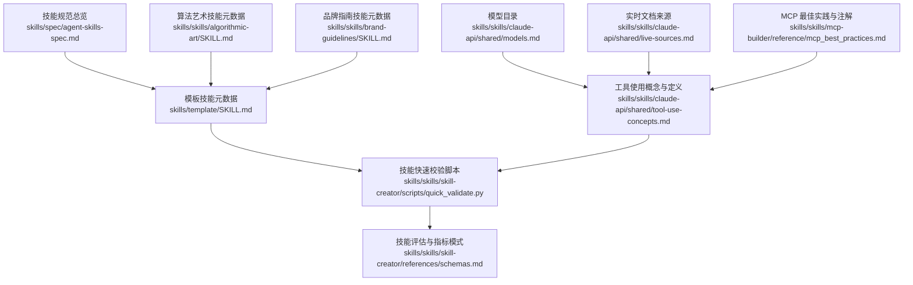
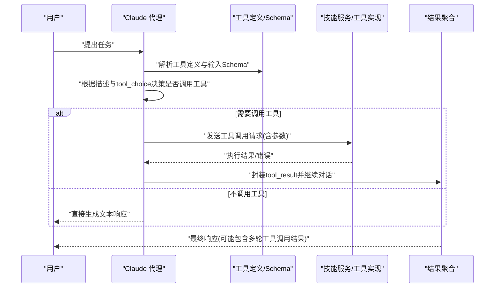
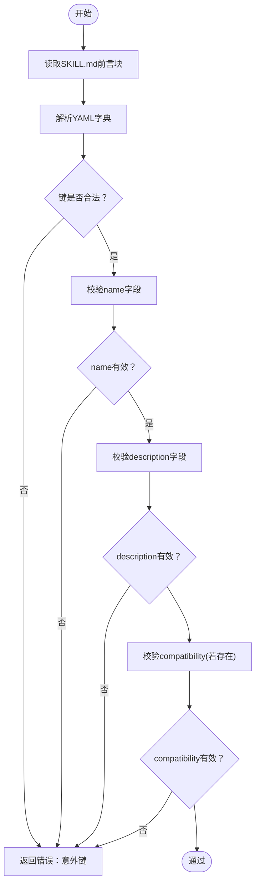
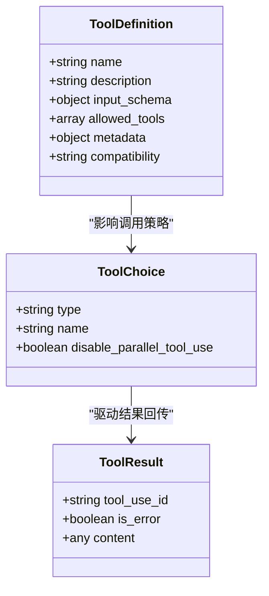
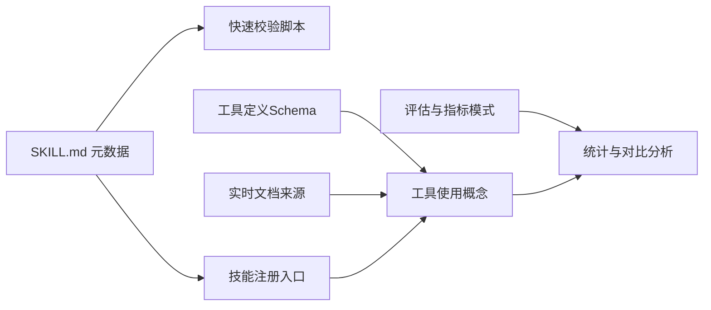

# 技能接口规范

<cite>
**本文引用的文件**
- [技能规范总览](file://skills/spec/agent-skills-spec.md)
- [模板技能元数据](file://skills/template/SKILL.md)
- [工具使用概念与定义](file://skills/skills/claude-api/shared/tool-use-concepts.md)
- [模型目录](file://skills/skills/claude-api/shared/models.md)
- [实时文档来源](file://skills/skills/claude-api/shared/live-sources.md)
- [技能快速校验脚本](file://skills/skills/skill-creator/scripts/quick_validate.py)
- [技能评估与指标模式](file://skills/skills/skill-creator/references/schemas.md)
- [算法艺术技能元数据](file://skills/skills/algorithmic-art/SKILL.md)
- [品牌指南技能元数据](file://skills/skills/brand-guidelines/SKILL.md)
- [MCP 最佳实践与注解](file://skills/skills/mcp-builder/reference/mcp_best_practices.md)
</cite>

## 目录
1. [引言](#引言)
2. [项目结构](#项目结构)
3. [核心组件](#核心组件)
4. [架构总览](#架构总览)
5. [详细组件分析](#详细组件分析)
6. [依赖关系分析](#依赖关系分析)
7. [性能考量](#性能考量)
8. [故障排查指南](#故障排查指南)
9. [结论](#结论)
10. [附录](#附录)

## 引言
本规范面向在 Claude 平台上实现与集成“技能”的开发者，定义统一的技能接口标准、元数据结构、输入输出约定、调用协议、注册与动态加载机制、接口版本控制策略以及错误处理与安全建议。内容基于仓库中现有的技能元数据、工具使用概念、模型与实时文档来源、以及技能评估与指标模式等资料进行归纳总结，帮助实现者以一致的方式构建可复用、可验证、可演进的技能。

## 项目结构
仓库采用按功能域分层的组织方式：
- skills/spec：技能规范与模板
- skills/skills：各类技能实现与文档
- skills/skills/claude-api/shared：与 Claude API 工具使用、模型、实时文档相关的共享知识
- skills/skills/skill-creator：技能创建与评估相关工具与模式
- .skills：示例技能目录（如 mcp-builder）

下图展示与技能接口规范直接相关的文件与模块关系：

**图表来源**
- [技能规范总览:1-4](file://skills/spec/agent-skills-spec.md#L1-L4)
- [模板技能元数据:1-7](file://skills/template/SKILL.md#L1-L7)
- [工具使用概念与定义:1-306](file://skills/skills/claude-api/shared/tool-use-concepts.md#L1-L306)
- [模型目录:1-69](file://skills/skills/claude-api/shared/models.md#L1-L69)
- [实时文档来源:1-122](file://skills/skills/claude-api/shared/live-sources.md#L1-L122)
- [技能快速校验脚本:1-103](file://skills/skills/skill-creator/scripts/quick_validate.py#L1-L103)
- [技能评估与指标模式:1-431](file://skills/skills/skill-creator/references/schemas.md#L1-L431)
- [算法艺术技能元数据:1-405](file://skills/skills/algorithmic-art/SKILL.md#L1-L405)
- [品牌指南技能元数据:1-74](file://skills/skills/brand-guidelines/SKILL.md#L1-L74)
- [MCP 最佳实践与注解:181-230](file://skills/skills/mcp-builder/reference/mcp_best_practices.md#L181-L230)

**章节来源**
- [技能规范总览:1-4](file://skills/spec/agent-skills-spec.md#L1-L4)
- [模板技能元数据:1-7](file://skills/template/SKILL.md#L1-L7)
- [工具使用概念与定义:1-306](file://skills/skills/claude-api/shared/tool-use-concepts.md#L1-L306)
- [模型目录:1-69](file://skills/skills/claude-api/shared/models.md#L1-L69)
- [实时文档来源:1-122](file://skills/skills/claude-api/shared/live-sources.md#L1-L122)
- [技能快速校验脚本:1-103](file://skills/skills/skill-creator/scripts/quick_validate.py#L1-L103)
- [技能评估与指标模式:1-431](file://skills/skills/skill-creator/references/schemas.md#L1-L431)
- [算法艺术技能元数据:1-405](file://skills/skills/algorithmic-art/SKILL.md#L1-L405)
- [品牌指南技能元数据:1-74](file://skills/skills/brand-guidelines/SKILL.md#L1-L74)
- [MCP 最佳实践与注解:181-230](file://skills/skills/mcp-builder/reference/mcp_best_practices.md#L181-L230)

## 核心组件
- 元数据与注册
  - 每个技能通过 SKILL.md 的 YAML 前言块声明元数据，包含 name、description、license 等字段；支持可选的 compatibility、allowed-tools、metadata 等扩展键。
  - 快速校验脚本对元数据进行命名规范、长度限制、字符集与结构校验，确保注册入口的一致性与可验证性。
- 工具定义与调用
  - 用户自定义工具需提供名称、描述与 JSON Schema 输入定义；支持 tool_choice 控制策略与并行工具调用限制。
  - 服务器侧工具（如代码执行、网络搜索）由平台托管运行，客户端仅需声明工具类型与名称。
- 输出与结果
  - 工具调用结果需以 tool_result 形式回传，包含匹配的 tool_use_id；错误时设置 is_error 并提供可操作信息。
- 版本与兼容性
  - 元数据中的 compatibility 字段用于标注兼容范围或版本提示；结合评估与指标模式进行回归与对比评测。
- 安全与质量
  - 工具运行存在副作用时应进行输入校验与二次确认；错误处理遵循标准 JSON-RPC 错误码与可解释性原则。

**章节来源**
- [模板技能元数据:1-7](file://skills/template/SKILL.md#L1-L7)
- [技能快速校验脚本:41-94](file://skills/skills/skill-creator/scripts/quick_validate.py#L41-L94)
- [工具使用概念与定义:7-42](file://skills/skills/claude-api/shared/tool-use-concepts.md#L7-L42)
- [工具使用概念与定义:45-56](file://skills/skills/claude-api/shared/tool-use-concepts.md#L45-L56)
- [工具使用概念与定义:87-98](file://skills/skills/claude-api/shared/tool-use-concepts.md#L87-L98)
- [工具使用概念与定义:101-158](file://skills/skills/claude-api/shared/tool-use-concepts.md#L101-L158)
- [工具使用概念与定义:161-189](file://skills/skills/claude-api/shared/tool-use-concepts.md#L161-L189)
- [MCP 最佳实践与注解:181-230](file://skills/skills/mcp-builder/reference/mcp_best_practices.md#L181-L230)

## 架构总览
下图展示从用户请求到技能执行与结果返回的关键交互路径，涵盖工具定义、选择、执行与结果回传的闭环。

**图表来源**
- [工具使用概念与定义:45-56](file://skills/skills/claude-api/shared/tool-use-concepts.md#L45-L56)
- [工具使用概念与定义:87-98](file://skills/skills/claude-api/shared/tool-use-concepts.md#L87-L98)
- [工具使用概念与定义:101-158](file://skills/skills/claude-api/shared/tool-use-concepts.md#L101-L158)

## 详细组件分析

### 组件A：技能元数据与注册
- 元数据字段
  - name：技能唯一标识，采用 kebab-case，长度不超过 64；必须存在且为字符串。
  - description：技能用途与触发时机的简述，不含尖括号，长度不超过 1024。
  - license：许可证说明，指向完整许可文件。
  - allowed-tools：可选，声明允许使用的工具集合。
  - metadata：可选，嵌套对象，承载扩展属性。
  - compatibility：可选，字符串，用于标注兼容范围或版本提示，最大长度 500。
- 注册与校验
  - 通过 SKILL.md 前言块声明；快速校验脚本负责结构、命名、长度与字符集检查。
  - 示例参考：算法艺术与品牌指南技能元数据文件。

**图表来源**
- [技能快速校验脚本:41-94](file://skills/skills/skill-creator/scripts/quick_validate.py#L41-L94)

**章节来源**
- [模板技能元数据:1-7](file://skills/template/SKILL.md#L1-L7)
- [技能快速校验脚本:41-94](file://skills/skills/skill-creator/scripts/quick_validate.py#L41-L94)
- [算法艺术技能元数据:1-5](file://skills/skills/algorithmic-art/SKILL.md#L1-L5)
- [品牌指南技能元数据:1-5](file://skills/skills/brand-guidelines/SKILL.md#L1-L5)

### 组件B：工具定义与调用协议
- 工具定义结构
  - 必填：name、description
  - 必填：input_schema（JSON Schema），包含 properties、required 等
  - 最佳实践：清晰命名、详尽描述、枚举值、合理 required
- 调用选择策略
  - auto：默认，由 Claude 决定
  - any：至少一次工具调用
  - tool：指定工具
  - none：禁止工具
  - 可附加 disable_parallel_tool_use 控制并行
- 结果回传
  - 每次工具调用需在 tool_result 中回传，包含 tool_use_id
  - 失败时设置 is_error 并给出可操作信息
- 服务器侧工具
  - 代码执行、网络搜索/抓取等由平台托管运行，声明工具类型与名称即可

**图表来源**
- [工具使用概念与定义:7-42](file://skills/skills/claude-api/shared/tool-use-concepts.md#L7-L42)
- [工具使用概念与定义:45-56](file://skills/skills/claude-api/shared/tool-use-concepts.md#L45-L56)
- [工具使用概念与定义:87-98](file://skills/skills/claude-api/shared/tool-use-concepts.md#L87-L98)
- [工具使用概念与定义:101-158](file://skills/skills/claude-api/shared/tool-use-concepts.md#L101-L158)

**章节来源**
- [工具使用概念与定义:7-42](file://skills/skills/claude-api/shared/tool-use-concepts.md#L7-L42)
- [工具使用概念与定义:45-56](file://skills/skills/claude-api/shared/tool-use-concepts.md#L45-L56)
- [工具使用概念与定义:87-98](file://skills/skills/claude-api/shared/tool-use-concepts.md#L87-L98)
- [工具使用概念与定义:101-158](file://skills/skills/claude-api/shared/tool-use-concepts.md#L101-L158)

### 组件C：输出格式与结构化输出
- 结构化输出
  - 通过 JSON Schema 约束输出格式，保证可解析性
  - 支持 JSON 输出与严格工具参数校验
  - 注意不支持递归、数值/字符串约束与复杂数组约束
- 重要提示
  - 首次请求可能有编译延迟；拒绝或超令牌限制可能导致输出不完整
  - 不与引用、消息预填充同时使用

**章节来源**
- [工具使用概念与定义:252-291](file://skills/skills/claude-api/shared/tool-use-concepts.md#L252-L291)

### 组件D：模型与版本控制
- 模型选择
  - 使用官方提供的精确模型 ID；优先使用别名
  - 当用户以名称提问时，依据映射表解析为具体模型 ID
- 版本控制
  - 元数据 compatibility 字段可用于标注兼容范围
  - 评估与指标模式提供统计摘要，便于对比不同配置的性能差异

**章节来源**
- [模型目录:48-69](file://skills/skills/claude-api/shared/models.md#L48-L69)
- [技能评估与指标模式:219-306](file://skills/skills/skill-creator/references/schemas.md#L219-L306)

### 组件E：动态加载与接口版本
- 动态加载
  - 服务器侧工具无需客户端实现，仅需声明工具类型与名称
  - 客户端侧工具（如内存工具）由实现方提供存储后端
- 接口版本
  - 工具类型版本（如 web_search_20260209、web_fetch_20260209）用于区分能力与行为
  - MCP 工具可通过注解提供只读、破坏性、幂等等提示，辅助客户端理解行为

**章节来源**
- [工具使用概念与定义:161-189](file://skills/skills/claude-api/shared/tool-use-concepts.md#L161-L189)
- [MCP 最佳实践与注解:190-201](file://skills/skills/mcp-builder/reference/mcp_best_practices.md#L190-L201)

## 依赖关系分析
- 元数据依赖
  - SKILL.md 前言块决定技能注册入口与可见性
  - 快速校验脚本依赖 YAML 解析与正则表达式进行结构与格式校验
- 工具定义依赖
  - 工具使用概念文档提供 JSON Schema 与调用策略规范
  - 实时文档来源提供最新 API 文档链接，便于获取动态信息
- 评估与指标依赖
  - 评估与指标模式定义了评测、计数、时间与对比分析的数据结构

**图表来源**
- [技能快速校验脚本:1-103](file://skills/skills/skill-creator/scripts/quick_validate.py#L1-L103)
- [工具使用概念与定义:1-306](file://skills/skills/claude-api/shared/tool-use-concepts.md#L1-L306)
- [实时文档来源:1-122](file://skills/skills/claude-api/shared/live-sources.md#L1-L122)
- [技能评估与指标模式:1-431](file://skills/skills/skill-creator/references/schemas.md#L1-L431)

**章节来源**
- [技能快速校验脚本:1-103](file://skills/skills/skill-creator/scripts/quick_validate.py#L1-L103)
- [工具使用概念与定义:1-306](file://skills/skills/claude-api/shared/tool-use-concepts.md#L1-L306)
- [实时文档来源:1-122](file://skills/skills/claude-api/shared/live-sources.md#L1-L122)
- [技能评估与指标模式:1-431](file://skills/skills/skill-creator/references/schemas.md#L1-L431)

## 性能考量
- 工具数量与选择
  - 工具过多会增加模型负担，建议聚焦于高价值工具集
  - 合理使用 tool_choice，避免不必要的多次工具调用
- 结构化输出
  - 首次使用新 Schema 存在编译成本，后续可利用缓存降低延迟
- 服务器侧工具
  - 代码执行与网络工具在平台沙箱内运行，注意容器复用与资源清理

**章节来源**
- [工具使用概念与定义:294-301](file://skills/skills/claude-api/shared/tool-use-concepts.md#L294-L301)
- [工具使用概念与定义:144-147](file://skills/skills/claude-api/shared/tool-use-concepts.md#L144-L147)

## 故障排查指南
- 常见问题
  - 工具未被调用：检查工具描述是否足够明确，或调整 tool_choice 为 any/tool
  - 结果未回传：确认 tool_result 是否包含匹配的 tool_use_id，错误时设置 is_error
  - 模型 ID 错误：使用官方模型目录中的精确 ID 或别名
  - 结构化输出失败：检查 Schema 是否包含不支持的约束
- 安全建议
  - 对具有副作用的工具进行输入校验与二次确认
  - 错误处理遵循标准 JSON-RPC 错误码，提供可操作的错误信息
  - MCP 工具注解仅为提示，不应作为安全决策依据

**章节来源**
- [工具使用概念与定义:87-98](file://skills/skills/claude-api/shared/tool-use-concepts.md#L87-L98)
- [工具使用概念与定义:252-291](file://skills/skills/claude-api/shared/tool-use-concepts.md#L252-L291)
- [MCP 最佳实践与注解:205-227](file://skills/skills/mcp-builder/reference/mcp_best_practices.md#L205-L227)

## 结论
本规范以仓库现有资料为基础，建立了技能元数据、工具定义、调用协议、版本控制与评估指标的统一框架。通过严格的元数据校验、清晰的工具 Schema 与调用策略、以及结构化输出与评估模式，能够帮助实现者构建高质量、可维护、可验证的 Claude 技能。建议在实际开发中结合实时文档来源与评估模式持续迭代优化。

## 附录
- 接口定义示例（路径）
  - 工具定义示例：[工具使用概念与定义:13-32](file://skills/skills/claude-api/shared/tool-use-concepts.md#L13-L32)
  - 服务器侧工具示例：[工具使用概念与定义:117-122](file://skills/skills/claude-api/shared/tool-use-concepts.md#L117-L122)
  - 网络搜索/抓取工具示例：[工具使用概念与定义:167-172](file://skills/skills/claude-api/shared/tool-use-concepts.md#L167-L172)
- 元数据示例（路径）
  - 模板元数据：[模板技能元数据:1-7](file://skills/template/SKILL.md#L1-L7)
  - 算法艺术元数据：[算法艺术技能元数据:1-5](file://skills/skills/algorithmic-art/SKILL.md#L1-L5)
  - 品牌指南元数据：[品牌指南技能元数据:1-5](file://skills/skills/brand-guidelines/SKILL.md#L1-L5)
- 评估与指标模式（路径）
  - 评测与统计：[技能评估与指标模式:219-306](file://skills/skills/skill-creator/references/schemas.md#L219-L306)