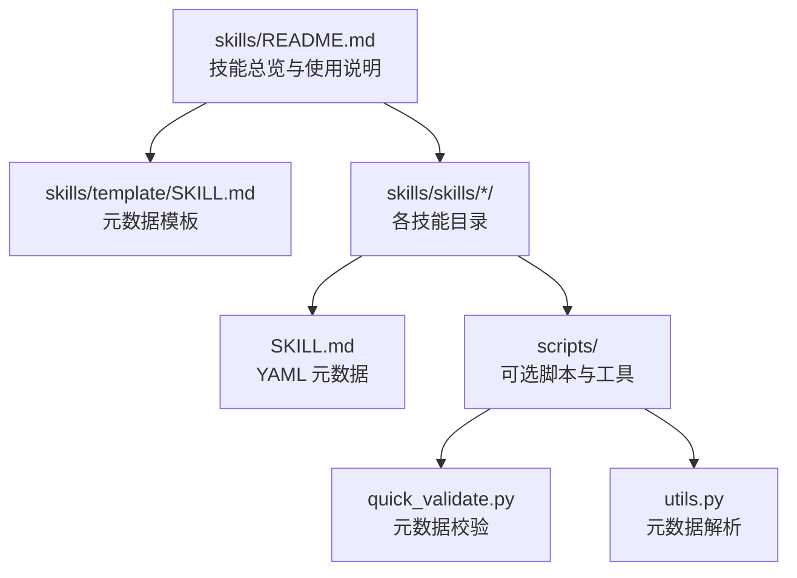
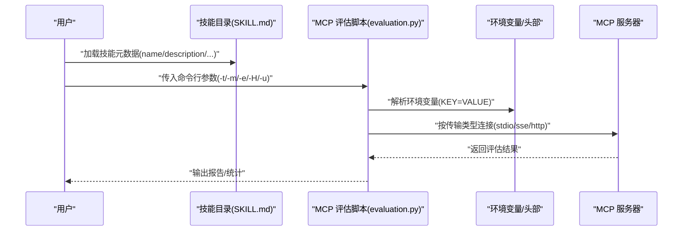
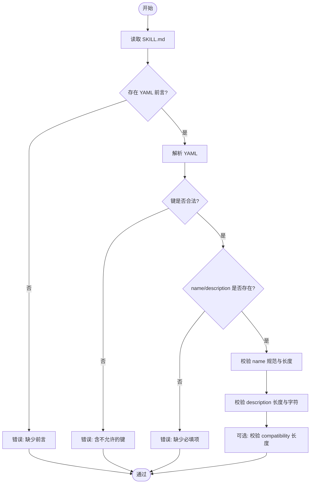
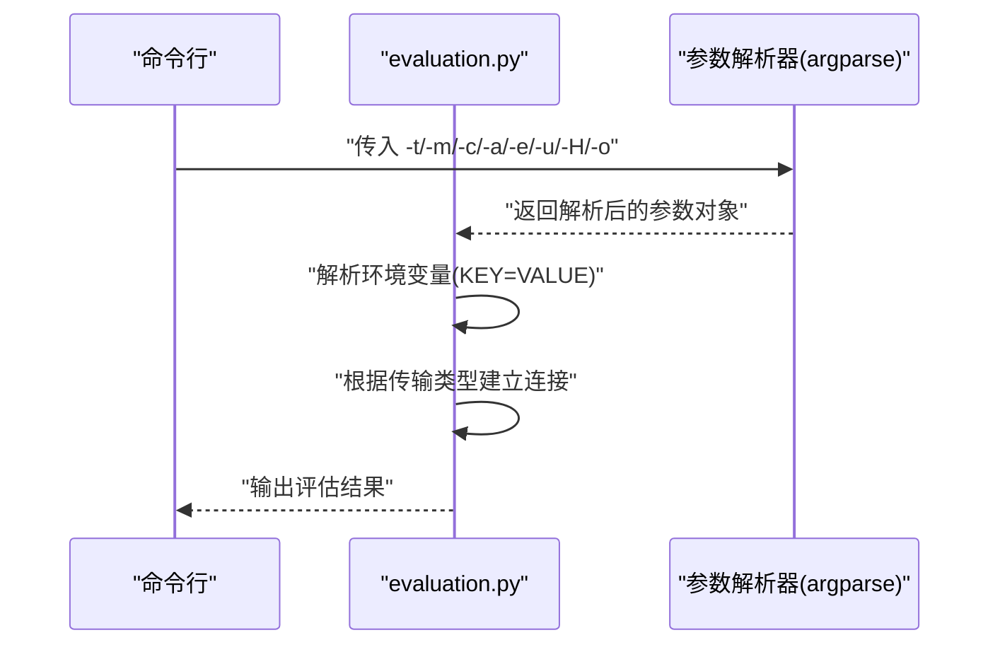
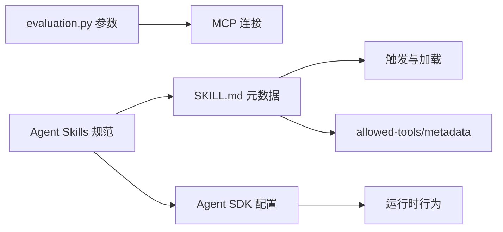

# 配置参数参考

<cite>
**本文引用的文件**
- [skills/README.md](file://skills/README.md)
- [skills/template/SKILL.md](file://skills/template/SKILL.md)
- [skills/skills/skill-creator/scripts/quick_validate.py](file://skills/skills/skill-creator/scripts/quick_validate.py)
- [skills/skills/skill-creator/scripts/utils.py](file://skills/skills/skill-creator/scripts/utils.py)
- [skills/skills/mcp-builder/scripts/evaluation.py](file://skills/skills/mcp-builder/scripts/evaluation.py)
- [skills/skills/mcp-builder/reference/node_mcp_server.md](file://skills/skills/mcp-builder/reference/node_mcp_server.md)
- [skills/skills/claude-api/python/agent-sdk/README.md](file://skills/skills/claude-api/python/agent-sdk/README.md)
- [skills/skills/claude-api/typescript/agent-sdk/README.md](file://skills/skills/claude-api/typescript/agent-sdk/README.md)
- [skills/skills/algorithmic-art/SKILL.md](file://skills/skills/algorithmic-art/SKILL.md)
- [skills/skills/canvas-design/SKILL.md](file://skills/skills/canvas-design/SKILL.md)
- [skills/skills/brand-guidelines/SKILL.md](file://skills/skills/brand-guidelines/SKILL.md)
- [skills/spec/agent-skills-spec.md](file://skills/spec/agent-skills-spec.md)
</cite>

## 目录
1. [简介](#简介)
2. [项目结构](#项目结构)
3. [核心组件](#核心组件)
4. [架构总览](#架构总览)
5. [详细组件分析](#详细组件分析)
6. [依赖分析](#依赖分析)
7. [性能考虑](#性能考虑)
8. [故障排查指南](#故障排查指南)
9. [结论](#结论)
10. [附录](#附录)

## 简介
本参考文档面向 Claude 技能系统（Agent Skills）的配置参数与元数据规范，覆盖以下方面：
- 技能通用元数据：name、description、license、allowed-tools、metadata、compatibility 等
- 命令行参数与运行时参数：如 MCP 评估脚本中的传输方式、模型选择、环境变量等
- 环境变量与工具连接：MCP 服务器运行所需的环境变量与传输层配置
- 参数优先级与配置来源：前端 YAML 元数据、SDK 设置源、CLI/环境变量等
- 验证规则与参数组合限制：名称/描述长度、字符集、字段存在性与互斥关系
- 配置示例与最佳实践：从模板到实际技能与 MCP 服务器的落地建议

## 项目结构
该仓库以“技能”为中心组织内容，每个技能是一个独立目录，包含 SKILL.md 元数据与可选资源。根目录下的 skills/README.md 提供了整体说明与使用入口；template/SKILL.md 提供最小化元数据模板；技能创建器脚本提供校验与解析能力。

图表来源
- [skills/README.md:1-95](file://skills/README.md#L1-L95)
- [skills/template/SKILL.md:1-7](file://skills/template/SKILL.md#L1-L7)

章节来源
- [skills/README.md:1-95](file://skills/README.md#L1-L95)
- [skills/template/SKILL.md:1-7](file://skills/template/SKILL.md#L1-L7)

## 核心组件
- 技能元数据（SKILL.md）
  - 必填字段：name、description
  - 可选字段：license、allowed-tools、metadata、compatibility
  - 字段约束：名称与描述长度、字符集、嵌套结构合法性等
- MCP 评估与运行参数
  - 传输类型：stdio、sse、http
  - 模型选择：默认模型与自定义模型
  - 环境变量：KEY=VALUE 形式注入
  - 远程连接：URL 与 HTTP 头部
- Agent SDK 配置（Python/TypeScript）
  - 工作目录、工具集合与权限模式
  - MCP 服务器连接、钩子、系统提示词
  - 最大轮次、预算、输出格式、思维控制、Beta 功能开关、设置来源、会话环境变量

章节来源
- [skills/skills/skill-creator/scripts/quick_validate.py:42-94](file://skills/skills/skill-creator/scripts/quick_validate.py#L42-L94)
- [skills/skills/mcp-builder/scripts/evaluation.py:306-359](file://skills/skills/mcp-builder/scripts/evaluation.py#L306-L359)
- [skills/skills/claude-api/python/agent-sdk/README.md:179-198](file://skills/skills/claude-api/python/agent-sdk/README.md#L179-L198)
- [skills/skills/claude-api/typescript/agent-sdk/README.md:152-171](file://skills/skills/claude-api/typescript/agent-sdk/README.md#L152-L171)

## 架构总览
下图展示“元数据驱动 + 命令行/SDK 驱动”的配置流：前端 YAML 元数据作为技能声明，MCP 评估脚本通过命令行参数与环境变量驱动远程或本地 MCP 服务器，Agent SDK 将这些配置映射到运行时行为。

图表来源
- [skills/skills/mcp-builder/scripts/evaluation.py:306-359](file://skills/skills/mcp-builder/scripts/evaluation.py#L306-L359)
- [skills/skills/mcp-builder/reference/node_mcp_server.md:744-756](file://skills/skills/mcp-builder/reference/node_mcp_server.md#L744-L756)

## 详细组件分析

### 组件一：技能元数据（SKILL.md）
- 字段与类型
  - name: string（必填）
  - description: string（必填）
  - license: string（可选）
  - allowed-tools: list（可选）
  - metadata: dict（可选）
  - compatibility: string（可选）
- 约束与验证
  - 名称命名规范：小写、连字符、数字，最大长度 64
  - 描述长度上限 1024，不得包含尖括号
  - compatibility 长度上限 500
  - 仅允许上述键，metadata 内部键不计入顶层校验
- 解析与生成
  - 解析工具：从 SKILL.md 中提取 name/description 并支持多行字符串
  - 校验工具：快速校验脚本对元数据进行完整性与格式检查

图表来源
- [skills/skills/skill-creator/scripts/quick_validate.py:12-94](file://skills/skills/skill-creator/scripts/quick_validate.py#L12-L94)
- [skills/skills/skill-creator/scripts/utils.py:7-47](file://skills/skills/skill-creator/scripts/utils.py#L7-L47)

章节来源
- [skills/skills/skill-creator/scripts/quick_validate.py:42-94](file://skills/skills/skill-creator/scripts/quick_validate.py#L42-L94)
- [skills/skills/skill-creator/scripts/utils.py:7-47](file://skills/skills/skill-creator/scripts/utils.py#L7-L47)
- [skills/template/SKILL.md:1-7](file://skills/template/SKILL.md#L1-L7)

### 组件二：MCP 评估脚本参数（evaluation.py）
- 传输类型（-t/--transport）
  - 取值：stdio、sse、http
  - 默认：stdio
- 模型（-m/--model）
  - 默认模型：由脚本内默认值指定
- stdio 选项（-c/-a/-e）
  - -c: 启动命令
  - -a: 命令参数列表
  - -e: 环境变量列表（KEY=VALUE）
- 远程选项（-u/-H）
  - -u: 服务器 URL
  - -H: HTTP 头部（Key: Value）
- 输出（-o）
  - 输出评估报告路径

图表来源
- [skills/skills/mcp-builder/scripts/evaluation.py:306-359](file://skills/skills/mcp-builder/scripts/evaluation.py#L306-L359)

章节来源
- [skills/skills/mcp-builder/scripts/evaluation.py:306-359](file://skills/skills/mcp-builder/scripts/evaluation.py#L306-L359)

### 组件三：MCP 服务器运行时参数（示例：node_mcp_server.md）
- 环境变量
  - API 密钥：用于访问外部服务（示例中要求）
  - 传输选择：通过环境变量选择 stdio 或 http
- 传输层
  - stdio：本地进程通信
  - http：Streamable HTTP，支持 JSON 响应
- 运行模式
  - 若未设置必要环境变量，直接退出并报错

章节来源
- [skills/skills/mcp-builder/reference/node_mcp_server.md:707-756](file://skills/skills/mcp-builder/reference/node_mcp_server.md#L707-L756)

### 组件四：Agent SDK 配置（Python/TypeScript）
- 关键配置项（摘要）
  - cwd: string（工作目录）
  - allowedTools/tools/disallowedTools: list/object（工具集合与限制）
  - permissionMode/allowDangerouslySkipPermissions: string/bool（权限提示策略）
  - mcpServers/hooks/systemPrompt: dict/object/string（MCP 连接、钩子、系统提示词）
  - maxTurns/maxBudgetUsd/model: number/string/string（回合数、预算、模型）
  - agents/outputFormat/thinking/betas/settingSources/env: object/string/...（子代理、输出格式、思维控制、Beta 功能、设置来源、环境变量）
- 说明
  - settingSources 支持加载项目级设置（例如 CLAUDE.md 文件），默认为空表示不加载
  - env 用于在会话期间注入环境变量

章节来源
- [skills/skills/claude-api/python/agent-sdk/README.md:179-198](file://skills/skills/claude-api/python/agent-sdk/README.md#L179-L198)
- [skills/skills/claude-api/typescript/agent-sdk/README.md:152-171](file://skills/skills/claude-api/typescript/agent-sdk/README.md#L152-L171)

### 组件五：技能专用配置示例
- algorithmic-art
  - 使用 p5.js 与模板生成交互式艺术产物，强调“哲学先行、参数可控、可复现种子”
  - 要求遵循模板结构与品牌风格，参数通过 UI 实时调整
- canvas-design
  - 强调“视觉表达、空间沟通、极简文本”，最终输出 PDF/PNG
  - 对字体、颜色、排版有明确建议与回退策略
- brand-guidelines
  - 提供品牌色板、字体清单与应用规则，确保跨平台一致性

章节来源
- [skills/skills/algorithmic-art/SKILL.md:101-337](file://skills/skills/algorithmic-art/SKILL.md#L101-L337)
- [skills/skills/canvas-design/SKILL.md:100-116](file://skills/skills/canvas-design/SKILL.md#L100-L116)
- [skills/skills/brand-guidelines/SKILL.md:15-74](file://skills/skills/brand-guidelines/SKILL.md#L15-L74)

## 依赖分析
- 元数据依赖
  - SKILL.md 的 name/description 是触发与加载的基础
  - allowed-tools 与 metadata 可影响工具可用性与上下文注入
- 运行时依赖
  - MCP 评估脚本依赖命令行参数与环境变量
  - Agent SDK 依赖 settingSources/env 等配置决定行为
- 外部依赖
  - MCP 协议规范与 SDK 文档（通过 WebFetch 加载）

图表来源
- [skills/skills/skill-creator/scripts/quick_validate.py:42-94](file://skills/skills/skill-creator/scripts/quick_validate.py#L42-L94)
- [skills/skills/mcp-builder/scripts/evaluation.py:306-359](file://skills/skills/mcp-builder/scripts/evaluation.py#L306-L359)
- [skills/spec/agent-skills-spec.md:1-4](file://skills/spec/agent-skills-spec.md#L1-L4)

章节来源
- [skills/skills/skill-creator/scripts/quick_validate.py:42-94](file://skills/skills/skill-creator/scripts/quick_validate.py#L42-L94)
- [skills/skills/mcp-builder/scripts/evaluation.py:306-359](file://skills/skills/mcp-builder/scripts/evaluation.py#L306-L359)
- [skills/spec/agent-skills-spec.md:1-4](file://skills/spec/agent-skills-spec.md#L1-L4)

## 性能考虑
- 元数据校验前置：在 CI 或本地开发阶段尽早发现非法键与格式问题，减少运行时失败
- MCP 评估脚本
  - 选择合适的传输类型：本地 stdio 适合调试，远程 http/sse 适合集成测试
  - 控制模型与预算：避免不必要的高成本推理
- Agent SDK
  - 合理设置 maxTurns 与 maxBudgetUsd，防止长对话导致资源浪费
  - 使用 mcpServers 与 hooks 精准注入外部能力，避免无关工具带来的上下文膨胀

## 故障排查指南
- 元数据相关
  - 错误：缺少 YAML 前言或格式不正确
  - 错误：包含不允许的键
  - 错误：name/description 缺失或不符合规范（长度、字符集）
  - 建议：使用 quick_validate.py 进行快速校验；使用 utils.py 解析确认字段提取无误
- MCP 评估脚本
  - 错误：评估文件不存在
  - 警告：环境变量格式不正确（非 KEY=VALUE）会被忽略
  - 建议：检查 -e 列表格式；确认 -t 与 -u/-H 组合正确
- MCP 服务器
  - 错误：缺少必需环境变量（如 API 密钥）
  - 建议：在启动前设置必要环境变量；确认 TRANSPORT 选择与运行方式一致

章节来源
- [skills/skills/skill-creator/scripts/quick_validate.py:12-94](file://skills/skills/skill-creator/scripts/quick_validate.py#L12-L94)
- [skills/skills/mcp-builder/scripts/evaluation.py:290-302](file://skills/skills/mcp-builder/scripts/evaluation.py#L290-L302)
- [skills/skills/mcp-builder/reference/node_mcp_server.md:707-756](file://skills/skills/mcp-builder/reference/node_mcp_server.md#L707-L756)

## 结论
- 技能配置以 SKILL.md 元数据为核心，必须满足名称与描述的严格规范
- 命令行与 SDK 配置共同决定运行时行为，需结合传输类型、模型、工具集合与环境变量进行合理组合
- 通过内置校验脚本与示例模板，可以快速构建高质量技能与 MCP 服务器
- 建议在开发流程中引入自动化校验与评估，确保配置一致性与稳定性

## 附录

### A. 参数优先级与配置来源
- 元数据优先级
  - name/description 为最低优先级的“声明性”配置，必须满足基础约束
  - allowed-tools 与 metadata 属于“能力声明”，影响工具可用性
- 命令行与 SDK 优先级
  - 命令行参数通常覆盖默认值（如模型、传输类型、环境变量）
  - Agent SDK 的 settingSources/env 可叠加在会话级别，影响运行时行为
- 环境变量
  - KEY=VALUE 形式注入，注意格式校验与作用域（会话/进程）

章节来源
- [skills/skills/mcp-builder/scripts/evaluation.py:323-344](file://skills/skills/mcp-builder/scripts/evaluation.py#L323-L344)
- [skills/skills/claude-api/python/agent-sdk/README.md:179-198](file://skills/skills/claude-api/python/agent-sdk/README.md#L179-L198)
- [skills/skills/claude-api/typescript/agent-sdk/README.md:152-171](file://skills/skills/claude-api/typescript/agent-sdk/README.md#L152-L171)

### B. 配置文件格式与命令行映射
- SKILL.md
  - YAML 前言，键集合受限制且具语义
- evaluation.py 命令行
  - -t/--transport → 传输类型
  - -m/--model → 模型标识
  - -e/--env → 环境变量列表（KEY=VALUE）
  - -u/--url 与 -H/--header → 远程连接参数
- Agent SDK
  - settingSources → 项目设置加载
  - env → 会话环境变量

章节来源
- [skills/skills/mcp-builder/scripts/evaluation.py:306-359](file://skills/skills/mcp-builder/scripts/evaluation.py#L306-L359)
- [skills/skills/claude-api/python/agent-sdk/README.md:179-198](file://skills/skills/claude-api/python/agent-sdk/README.md#L179-L198)
- [skills/skills/claude-api/typescript/agent-sdk/README.md:152-171](file://skills/skills/claude-api/typescript/agent-sdk/README.md#L152-L171)

### C. 配置验证规则与参数组合限制
- 元数据
  - name：小写、连字符、数字，最大长度 64，不可以连字符开头/结尾或包含连续连字符
  - description：最大长度 1024，不得包含 < 或 >
  - compatibility：最大长度 500（可选）
  - 键集合：仅允许 name/description/license/allowed-tools/metadata/compatibility
- 命令行
  - -e 列表中每项必须为 KEY=VALUE，否则警告并跳过
  - -t 与 -u/-H 组合需满足传输类型约束
- Agent SDK
  - permissionMode 与 allowDangerouslySkipPermissions 存在互斥/条件依赖关系（详见 SDK 文档）

章节来源
- [skills/skills/skill-creator/scripts/quick_validate.py:64-94](file://skills/skills/skill-creator/scripts/quick_validate.py#L64-L94)
- [skills/skills/mcp-builder/scripts/evaluation.py:290-302](file://skills/skills/mcp-builder/scripts/evaluation.py#L290-L302)
- [skills/skills/claude-api/python/agent-sdk/README.md:179-198](file://skills/skills/claude-api/python/agent-sdk/README.md#L179-L198)
- [skills/skills/claude-api/typescript/agent-sdk/README.md:152-171](file://skills/skills/claude-api/typescript/agent-sdk/README.md#L152-L171)

### D. 完整配置示例与最佳实践
- 示例一：最小化 SKILL.md
  - 使用 template/SKILL.md 作为起点，至少包含 name 与 description
- 示例二：MCP 评估脚本
  - 本地 stdio：-t stdio -c python -a my_server.py -e "KEY=VALUE"
  - 远程 http：-t http -u https://example.com/mcp -m MODEL_ID -H "Authorization: Bearer token"
- 示例三：Agent SDK
  - 在 settingSources 中启用项目设置加载，并通过 env 注入会话变量
- 最佳实践
  - 在 CI 中加入 quick_validate.py 校验
  - 为 MCP 服务器设置稳定默认环境变量与传输类型
  - 为复杂技能提供清晰的 metadata 与 allowed-tools 说明，便于上下文注入

章节来源
- [skills/template/SKILL.md:1-7](file://skills/template/SKILL.md#L1-L7)
- [skills/skills/mcp-builder/scripts/evaluation.py:306-359](file://skills/skills/mcp-builder/scripts/evaluation.py#L306-L359)
- [skills/skills/claude-api/python/agent-sdk/README.md:179-198](file://skills/skills/claude-api/python/agent-sdk/README.md#L179-L198)
- [skills/skills/claude-api/typescript/agent-sdk/README.md:152-171](file://skills/skills/claude-api/typescript/agent-sdk/README.md#L152-L171)