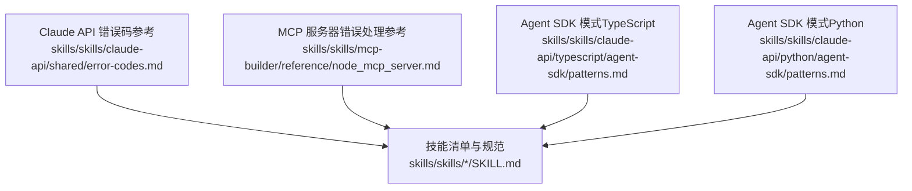
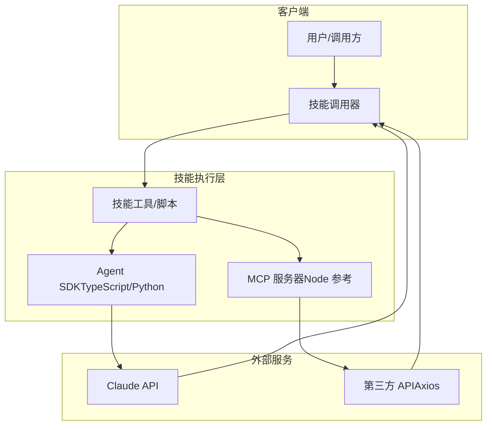
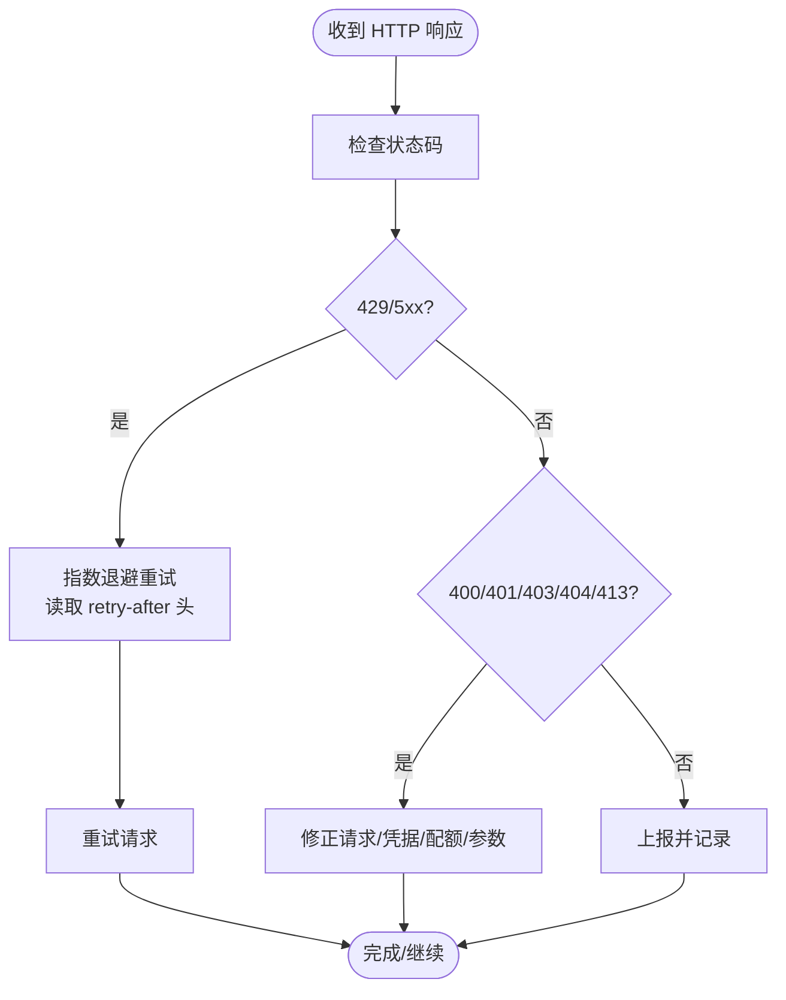
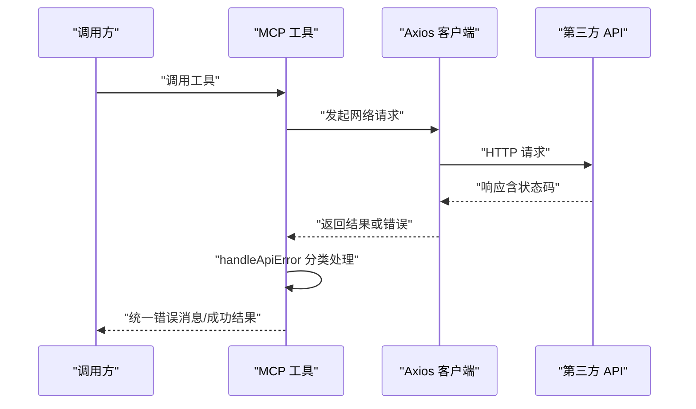
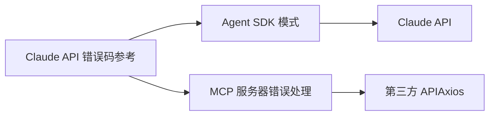

# 错误代码参考

<cite>
**本文引用的文件**
- [error-codes.md](file://skills/skills/claude-api/shared/error-codes.md)
- [node_mcp_server.md](file://skills/skills/mcp-builder/reference/node_mcp_server.md)
- [patterns.md](file://skills/skills/claude-api/typescript/agent-sdk/patterns.md)
- [patterns.md](file://skills/skills/claude-api/python/agent-sdk/patterns.md)
- [SKILL.md](file://skills/skills/algorithmic-art/SKILL.md)
- [SKILL.md](file://skills/skills/brand-guidelines/SKILL.md)
- [SKILL.md](file://skills/skills/canvas-design/SKILL.md)
- [SKILL.md](file://skills/skills/docx/SKILL.md)
- [SKILL.md](file://skills/skills/pdf/SKILL.md)
- [SKILL.md](file://skills/skills/pptx/SKILL.md)
- [SKILL.md](file://skills/skills/theme-factory/SKILL.md)
- [SKILL.md](file://skills/skills/web-artifacts-builder/SKILL.md)
- [SKILL.md](file://skills/skills/xlsx/SKILL.md)
- [SKILL.md](file://skills/skills/frontend-design/SKILL.md)
- [SKILL.md](file://skills/skills/internal-comms/SKILL.md)
- [SKILL.md](file://skills/skills/slack-gif-creator/SKILL.md)
- [SKILL.md](file://skills/skills/webapp-testing/SKILL.md)
- [SKILL.md](file://skills/skills/doc-coauthoring/SKILL.md)
- [SKILL.md](file://skills/skills/mcp-builder/SKILL.md)
- [SKILL.md](file://skills/skills/skill-creator/SKILL.md)
- [SKILL.md](file://skills/skills/claude-api/SKILL.md)
- [SKILL.md](file://skills/skills/algorithmic-art/templates/generator_template.js)
- [SKILL.md](file://skills/skills/algorithmic-art/templates/viewer.html)
- [SKILL.md](file://skills/skills/canvas-design/LICENSE.txt)
- [SKILL.md](file://skills/skills/claude-api/LICENSE.txt)
- [SKILL.md](file://skills/skills/docx/LICENSE.txt)
- [SKILL.md](file://skills/skills/pdf/LICENSE.txt)
- [SKILL.md](file://skills/skills/pptx/LICENSE.txt)
- [SKILL.md](file://skills/skills/theme-factory/LICENSE.txt)
- [SKILL.md](file://skills/skills/web-artifacts-builder/LICENSE.txt)
- [SKILL.md](file://skills/skills/xlsx/LICENSE.txt)
- [SKILL.md](file://skills/skills/frontend-design/LICENSE.txt)
- [SKILL.md](file://skills/skills/internal-comms/LICENSE.txt)
- [SKILL.md](file://skills/skills/slack-gif-creator/LICENSE.txt)
- [SKILL.md](file://skills/skills/webapp-testing/LICENSE.txt)
- [SKILL.md](file://skills/skills/doc-coauthoring/LICENSE.txt)
- [SKILL.md](file://skills/skills/mcp-builder/LICENSE.txt)
- [SKILL.md](file://skills/skills/skill-creator/LICENSE.txt)
</cite>

## 目录
1. [简介](#简介)
2. [项目结构](#项目结构)
3. [核心组件](#核心组件)
4. [架构总览](#架构总览)
5. [详细组件分析](#详细组件分析)
6. [依赖关系分析](#依赖关系分析)
7. [性能考虑](#性能考虑)
8. [故障排除指南](#故障排除指南)
9. [结论](#结论)
10. [附录](#附录)

## 简介
本参考文档面向 Claude 技能系统的使用者与开发者，系统性梳理技能调用、参数验证、资源访问、网络连接等常见错误类别，给出错误代码与消息、成因、解决方案、重试策略与调试方法。文档以仓库中已有的错误处理与最佳实践材料为基础，结合技能目录中的通用规范，帮助快速定位问题并恢复服务。

## 项目结构
本仓库围绕“技能”组织内容，每个技能通常包含：
- 技能说明与使用指引（SKILL.md）
- 许可证文件（LICENSE.txt）
- 语言示例与 SDK 使用模式（如 typescript/python/agent-sdk/patterns.md）
- 特定工具的参考实现或最佳实践（如 mcp-builder 的 Node MCP 服务器参考）

下图展示与“错误处理”相关的主要文件与模块：

图表来源
- [error-codes.md:1-206](file://skills/skills/claude-api/shared/error-codes.md#L1-L206)
- [node_mcp_server.md:408-756](file://skills/skills/mcp-builder/reference/node_mcp_server.md#L408-L756)
- [patterns.md](file://skills/skills/claude-api/typescript/agent-sdk/patterns.md)
- [patterns.md](file://skills/skills/claude-api/python/agent-sdk/patterns.md)
- [SKILL.md](file://skills/skills/algorithmic-art/SKILL.md)

章节来源
- [error-codes.md:1-206](file://skills/skills/claude-api/shared/error-codes.md#L1-L206)
- [node_mcp_server.md:408-756](file://skills/skills/mcp-builder/reference/node_mcp_server.md#L408-L756)

## 核心组件
- Claude API 错误码参考：系统化列出 HTTP 错误码、错误类型、是否可重试、常见成因与修复建议，并提供 SDK 类型化异常映射与重试示例。
- MCP 服务器错误处理参考：提供基于 Axios 的错误分类与统一错误消息输出模板，强调超时、权限、配额与资源不存在等典型场景。
- Agent SDK 模式：TypeScript 与 Python 的 SDK 使用模式文档，涵盖请求构建、参数校验、异常捕获与重试策略。
- 技能规范：各技能目录中的 SKILL.md 提供通用的使用说明、参数约定与注意事项，有助于避免参数验证类错误。

章节来源
- [error-codes.md:1-206](file://skills/skills/claude-api/shared/error-codes.md#L1-L206)
- [node_mcp_server.md:408-756](file://skills/skills/mcp-builder/reference/node_mcp_server.md#L408-L756)
- [patterns.md](file://skills/skills/claude-api/typescript/agent-sdk/patterns.md)
- [patterns.md](file://skills/skills/claude-api/python/agent-sdk/patterns.md)
- [SKILL.md](file://skills/skills/algorithmic-art/SKILL.md)

## 架构总览
下图展示“错误处理在技能系统中的位置与交互”，包括 API 调用、SDK 异常、MCP 传输层与客户端响应：

图表来源
- [error-codes.md:1-206](file://skills/skills/claude-api/shared/error-codes.md#L1-L206)
- [node_mcp_server.md:408-756](file://skills/skills/mcp-builder/reference/node_mcp_server.md#L408-L756)
- [patterns.md](file://skills/skills/claude-api/typescript/agent-sdk/patterns.md)
- [patterns.md](file://skills/skills/claude-api/python/agent-sdk/patterns.md)

## 详细组件分析

### 组件一：Claude API 错误码与重试策略
- 错误分类与特征
  - 400 无效请求：请求格式或参数不合法（如模型 ID、令牌数、消息数组格式错误）。
  - 401 鉴权失败：缺少或无效的 API Key。
  - 403 权限不足：API Key 缺少相应权限。
  - 404 资源不存在：端点或模型 ID 无效。
  - 413 请求过大：超出大小限制。
  - 429 速率限制：请求过于频繁。
  - 500/529 服务端错误：平台内部问题或过载。
- 可重试性
  - 429、500、529 通常可重试；400、401、403、404、413 一般不可重试或需修正后重试。
- 建议的修复与重试
  - 参数校验：确保模型 ID、令牌数、消息交替正确。
  - 速率控制：遵循返回头中的重试等待时间，采用指数退避重试。
  - 状态监控：关注平台状态页，判断是否为全局过载。
- SDK 异常映射
  - 不同语言 SDK 将 HTTP 码映射到具体异常类，应优先使用类型检查而非字符串匹配。

图表来源
- [error-codes.md:120-156](file://skills/skills/claude-api/shared/error-codes.md#L120-L156)

章节来源
- [error-codes.md:1-206](file://skills/skills/claude-api/shared/error-codes.md#L1-L206)

### 组件二：MCP 服务器错误处理与统一消息
- 错误分类
  - Axios 响应错误：按状态码分类（403、404、429 等），返回清晰可读的提示。
  - 连接超时：区分网络超时与服务端错误。
  - 其他异常：兜底错误消息，保留原始错误信息以便调试。
- 统一处理模式
  - 将 makeApiRequest 与 handleApiError 抽象为共享函数，便于复用与维护。
  - 在工具实现中集中处理错误，保证对外输出一致且可操作。

图表来源
- [node_mcp_server.md:408-756](file://skills/skills/mcp-builder/reference/node_mcp_server.md#L408-L756)

章节来源
- [node_mcp_server.md:408-756](file://skills/skills/mcp-builder/reference/node_mcp_server.md#L408-L756)

### 组件三：Agent SDK 模式与参数校验
- TypeScript/Python SDK 模式
  - 使用强类型输入模式（如 Zod）进行参数校验，减少运行期错误。
  - 捕获 SDK 抛出的类型化异常，优先使用类型判断而非字符串匹配。
  - 在工具实现中封装网络请求与错误处理，保持一致性。
- 与 Claude API 错误码的衔接
  - SDK 层面的异常映射与平台侧错误码保持一致，便于统一处理。

章节来源
- [patterns.md](file://skills/skills/claude-api/typescript/agent-sdk/patterns.md)
- [patterns.md](file://skills/skills/claude-api/python/agent-sdk/patterns.md)

### 组件四：技能规范与参数约定
- 各技能的 SKILL.md 中通常包含：
  - 输入参数列表与约束（长度、类型、必填项）。
  - 输出格式与大小限制（如字符上限）。
  - 使用示例与常见错误提示。
- 通过遵循规范，可有效降低参数验证与资源访问类错误的发生概率。

章节来源
- [SKILL.md](file://skills/skills/algorithmic-art/SKILL.md)
- [SKILL.md](file://skills/skills/brand-guidelines/SKILL.md)
- [SKILL.md](file://skills/skills/canvas-design/SKILL.md)
- [SKILL.md](file://skills/skills/docx/SKILL.md)
- [SKILL.md](file://skills/skills/pdf/SKILL.md)
- [SKILL.md](file://skills/skills/pptx/SKILL.md)
- [SKILL.md](file://skills/skills/theme-factory/SKILL.md)
- [SKILL.md](file://skills/skills/web-artifacts-builder/SKILL.md)
- [SKILL.md](file://skills/skills/xlsx/SKILL.md)
- [SKILL.md](file://skills/skills/frontend-design/SKILL.md)
- [SKILL.md](file://skills/skills/internal-comms/SKILL.md)
- [SKILL.md](file://skills/skills/slack-gif-creator/SKILL.md)
- [SKILL.md](file://skills/skills/webapp-testing/SKILL.md)
- [SKILL.md](file://skills/skills/doc-coauthoring/SKILL.md)
- [SKILL.md](file://skills/skills/mcp-builder/SKILL.md)
- [SKILL.md](file://skills/skills/skill-creator/SKILL.md)
- [SKILL.md](file://skills/skills/claude-api/SKILL.md)

## 依赖关系分析
- 组件耦合
  - 技能工具依赖 Agent SDK 或 MCP 服务器封装的网络与错误处理逻辑。
  - Claude API 错误码参考为 SDK 与 MCP 实现提供统一的错误语义与重试依据。
- 外部依赖
  - Claude API、第三方 HTTP 服务（Axios）。
- 潜在风险
  - 字符串匹配错误码易导致健壮性问题；应统一使用 SDK 类型化异常。
  - 忽视 retry-after 与配额头可能导致不必要的重试风暴。

图表来源
- [error-codes.md:1-206](file://skills/skills/claude-api/shared/error-codes.md#L1-L206)
- [node_mcp_server.md:408-756](file://skills/skills/mcp-builder/reference/node_mcp_server.md#L408-L756)
- [patterns.md](file://skills/skills/claude-api/typescript/agent-sdk/patterns.md)
- [patterns.md](file://skills/skills/claude-api/python/agent-sdk/patterns.md)

章节来源
- [error-codes.md:1-206](file://skills/skills/claude-api/shared/error-codes.md#L1-L206)
- [node_mcp_server.md:408-756](file://skills/skills/mcp-builder/reference/node_mcp_server.md#L408-L756)
- [patterns.md](file://skills/skills/claude-api/typescript/agent-sdk/patterns.md)
- [patterns.md](file://skills/skills/claude-api/python/agent-sdk/patterns.md)

## 性能考虑
- 指数退避重试：在 429/5xx 场景下采用带抖动的指数退避，避免雪崩效应。
- 请求合并与限流：对高频工具进行本地队列与并发控制。
- 超时设置：为网络请求设置合理超时，防止阻塞。
- 结果截断：对大体量输出进行字符上限检查与明确提示，避免客户端崩溃。

## 故障排除指南
- 步骤一：确认错误码与类型
  - 查看 Claude API 返回的状态码与 SDK 异常类型。
  - 区分“可重试”与“需修正”的错误。
- 步骤二：核对请求参数与配额
  - 检查模型 ID、令牌数、消息交替、必填字段是否满足规范。
  - 关注配额与速率限制，必要时降低并发或切换模型。
- 步骤三：检查网络与超时
  - 对于 MCP 工具，确认第三方 API 的可达性与超时配置。
  - 使用统一错误消息输出，便于前端展示与用户理解。
- 步骤四：记录与上报
  - 记录状态码、请求 ID、重试次数、时间戳与上下文参数。
  - 上报平台状态页与支持渠道，排查全局过载或服务异常。

章节来源
- [error-codes.md:120-156](file://skills/skills/claude-api/shared/error-codes.md#L120-L156)
- [node_mcp_server.md:408-756](file://skills/skills/mcp-builder/reference/node_mcp_server.md#L408-L756)

## 结论
通过统一的错误码参考、SDK 异常映射与 MCP 错误处理模板，结合技能规范中的参数约定，可以显著降低技能调用过程中的错误发生率，并提升问题定位与恢复效率。建议在实际工程中：
- 优先使用 SDK 类型化异常；
- 实施指数退避重试与超时控制；
- 统一错误消息输出与日志记录；
- 在工具实现中内置参数校验与配额检查。

## 附录
- 常见错误场景与解决步骤
  - 400 参数非法：检查模型 ID、令牌数、消息交替与必填字段。
  - 401 凭据泄露：使用环境变量管理密钥，避免硬编码。
  - 403 权限不足：确认 API Key 的权限范围与账户状态。
  - 404 资源不存在：核对端点与 ID 是否正确。
  - 413 请求过大：拆分请求或调整内容长度。
  - 429 速率限制：遵循 retry-after，降低并发或增加退避。
  - 500/529 服务端问题：指数退避重试，关注平台状态页。
- 调试信息收集
  - 记录请求 ID、状态码、重试次数、时间戳、入参摘要与错误消息。
  - 对网络错误记录超时与连接状态。
- 日志记录规范
  - 结构化日志，包含级别、时间、组件、错误码、消息与上下文键值。
  - 对敏感信息脱敏（如 API Key）。
- 重试机制建议
  - 初始延迟与最大重试次数配置；
  - 随机抖动避免“惊群效应”；
  - 对不同错误码采用差异化退避策略。

章节来源
- [error-codes.md:120-156](file://skills/skills/claude-api/shared/error-codes.md#L120-L156)
- [node_mcp_server.md:408-756](file://skills/skills/mcp-builder/reference/node_mcp_server.md#L408-L756)