# 前端设计

<cite>
**本文档引用的文件**
- [package.json](file://package.json)
- [next.config.mjs](file://next.config.mjs)
- [tailwind.config.ts](file://tailwind.config.ts)
- [src/app/layout.tsx](file://src/app/layout.tsx)
- [src/app/[locale]/page.tsx](file://src/app/[locale]/page.tsx)
- [src/app/[locale]/cases/page.tsx](file://src/app/[locale]/cases/page.tsx)
- [src/app/api/contact/route.ts](file://src/app/api/contact/route.ts)
- [src/styles/globals.css](file://src/styles/globals.css)
- [src/components/layout/Navbar.tsx](file://src/components/layout/Navbar.tsx)
- [src/components/layout/Footer.tsx](file://src/components/layout/Footer.tsx)
- [src/components/layout/LanguageSwitcher.tsx](file://src/components/layout/LanguageSwitcher.tsx)
- [src/components/sections/HeroSection.tsx](file://src/components/sections/HeroSection.tsx)
- [src/components/sections/ProductLineup.tsx](file://src/components/sections/ProductLineup.tsx)
- [src/components/sections/ProductStructure.tsx](file://src/components/sections/ProductStructure.tsx)
- [src/components/sections/SuccessCases.tsx](file://src/components/sections/SuccessCases.tsx)
- [src/components/sections/Specifications.tsx](file://src/components/sections/Specifications.tsx)
- [src/components/sections/ComparisonSection.tsx](file://src/components/sections/ComparisonSection.tsx)
- [src/components/sections/BrandStory.tsx](file://src/components/sections/BrandStory.tsx)
- [src/components/sections/CraftsmanshipSection.tsx](file://src/components/sections/CraftsmanshipSection.tsx)
- [src/components/sections/ContactInfo.tsx](file://src/components/sections/ContactInfo.tsx)
- [src/components/sections/InquiryForm.tsx](file://src/components/sections/InquiryForm.tsx)
- [src/components/ui/SectionHeading.tsx](file://src/components/ui/SectionHeading.tsx)
- [src/i18n/navigation.ts](file://src/i18n/navigation.ts)
- [src/i18n/request.ts](file://src/i18n/request.ts)
- [src/i18n/routing.ts](file://src/i18n/routing.ts)
- [src/messages/en.json](file://src/messages/en.json)
- [src/messages/es.json](file://src/messages/es.json)
- [src/messages/fr.json](file://src/messages/fr.json)
- [src/messages/zh.json](file://src/messages/zh.json)
- [src/lib/images.ts](file://src/lib/images.ts)
- [.skills/frontend-design/SKILL.md](file://.skills/frontend-design/SKILL.md)
- [.skills/canvas-design/SKILL.md](file://.skills/canvas-design/SKILL.md)
</cite>

## 更新摘要
**所做更改**
- 新增完整的前端设计技能实现，包括设计思维、美学指南和实现策略的详细内容
- 完善15个专业前端组件的架构分析，涵盖设计系统、品牌色彩、响应式布局等核心要素
- 增强国际化系统的详细分析，包括多语言消息文件架构和语言切换机制
- 更新API路由系统的实现细节，包括防垃圾邮件机制和状态管理
- 完善设计哲学和实现策略的理论指导，为前端开发提供系统性的设计思维框架

## 目录
1. [项目概述](#项目概述)
2. [前端设计技能框架](#前端设计技能框架)
3. [设计思维与美学指南](#设计思维与美学指南)
4. [项目结构](#项目结构)
5. [核心组件架构](#核心组件架构)
6. [设计系统与品牌规范](#设计系统与品牌规范)
7. [实现策略与技术架构](#实现策略与技术架构)
8. [国际化系统详解](#国际化系统详解)
9. [API路由系统](#api路由系统)
10. [性能优化与最佳实践](#性能优化与最佳实践)
11. [故障排除与调试指南](#故障排除与调试指南)
12. [总结与展望](#总结与展望)

## 项目概述

这是一个基于 Next.js 14 的企业级陶瓷产品展示网站，专注于高端葡萄酒发酵设备的营销推广。项目采用现代化的前端技术栈，结合中西文化元素，打造专业而优雅的品牌形象。

### 核心特性
- **完整的15个专业组件架构**：涵盖产品展示、品牌故事、技术规格、客户案例等全功能模块
- **多语言支持**：支持英语、法语、西班牙语、中文的国际化内容
- **响应式设计**：完全适配移动端和桌面端
- **品牌色彩系统**：以酒红色、香槟金为主色调的专业配色
- **动画效果**：流畅的渐入动画和过渡效果
- **图片优化**：通过阿里云 OSS 进行 CDN 加速
- **交互式表单**：集成联系表单和防垃圾邮件机制

## 前端设计技能框架

### 设计思维方法论

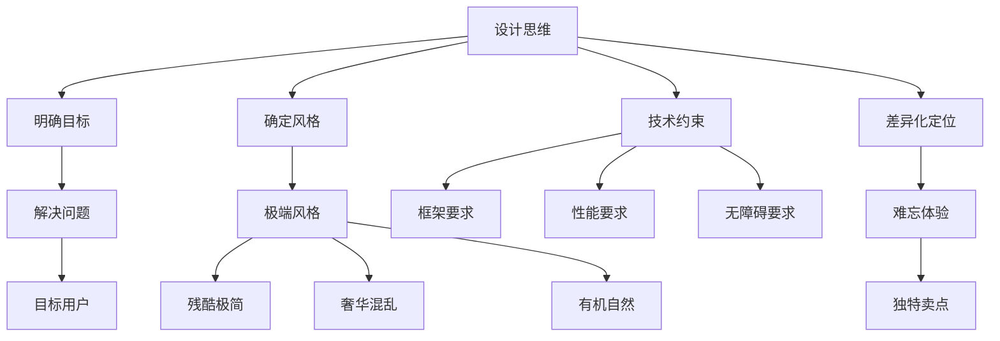

**图表来源**
- [.skills/frontend-design/SKILL.md:11-26](file://.skills/frontend-design/SKILL.md#L11-L26)

### 前端美学指南

前端设计技能提供了全面的美学指导原则：

**排版设计**
- 选择独特且有个性的字体，避免使用通用字体如 Arial 和 Inter
- 显示字体与正文字体的精心搭配，创造层次感和视觉吸引力
- 注重字距、行距和字重的精确控制

**色彩与主题**
- 坚持统一的美学理念，使用 CSS 变量确保一致性
- 主色调与锐利强调色的组合优于平淡的色彩分布
- 色彩方案应与品牌定位和产品特性相匹配

**动态效果**
- 使用动画作为效果和微交互的手段
- 优先考虑纯 CSS 解决方案，React 场景下使用合适的动画库
- 关注高影响力时刻：精心编排的页面加载动画序列

**空间构成**
- 采用非传统的布局，追求不对称、重叠、对角线流动
- 大量留白或精心控制的密度，创造视觉呼吸空间
- 突破网格限制，创造独特的视觉体验

**背景与视觉细节**
- 创建氛围和深度，而非默认的纯色背景
- 添加与整体美学相匹配的纹理和效果
- 创造性的形式包括渐变网格、噪声纹理、几何图案等

**章节来源**
- [.skills/frontend-design/SKILL.md:27-42](file://.skills/frontend-design/SKILL.md#L27-L42)

## 设计思维与美学指南

### 设计哲学创建流程

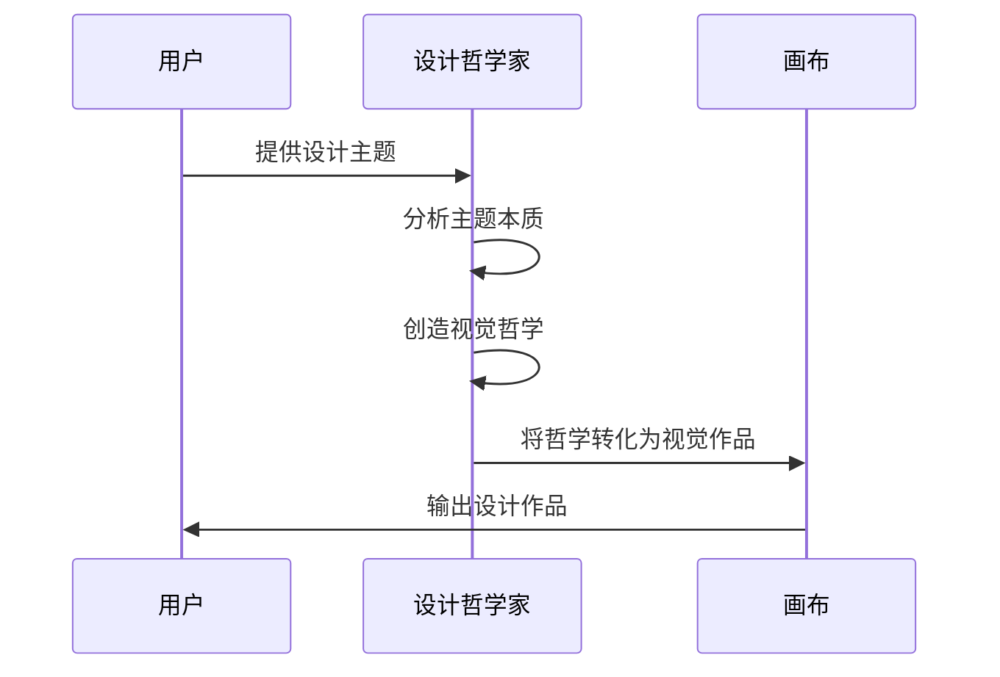

**图表来源**
- [.skills/canvas-design/SKILL.md:94-106](file://.skills/canvas-design/SKILL.md#L94-L106)

### 视觉哲学创作原则

设计哲学强调以下核心原则：

**视觉表达**
- 形、空间、色彩、构成为基础表达方式
- 图像、图形、形状、图案为主要传达媒介
- 文字作为视觉点缀，保持极简原则

**艺术运动命名**
- 1-2个词的运动名称："混凝土诗歌"、"色彩语言"、"有机系统"
- 明确的艺术理念阐述，4-6段简洁完整的描述

**创作指导**
- 强调工艺精神，最终作品应体现顶级专家的精心制作
- 为后续创作者提供足够的创意空间
- 通过设计而非文字来传达信息

**章节来源**
- [.skills/canvas-design/SKILL.md:15-82](file://.skills/canvas-design/SKILL.md#L15-L82)

### 设计作品创作流程

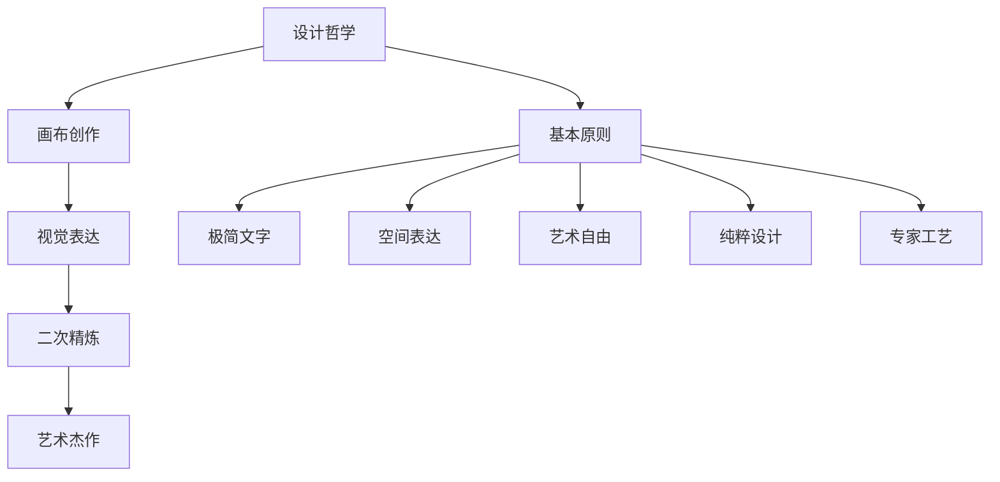

**图表来源**
- [.skills/canvas-design/SKILL.md:75-117](file://.skills/canvas-design/SKILL.md#L75-L117)

## 项目结构

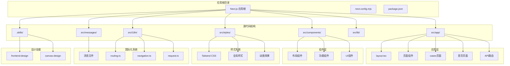

**图表来源**
- [package.json:1-30](file://package.json#L1-L30)
- [next.config.mjs:1-19](file://next.config.mjs#L1-L19)
- [src/app/layout.tsx:1-36](file://src/app/layout.tsx#L1-L36)
- [src/app/[locale]/page.tsx:1-38](file://src/app/[locale]/page.tsx#L1-L38)
- [src/app/[locale]/cases/page.tsx:1-45](file://src/app/[locale]/cases/page.tsx#L1-L45)

**章节来源**
- [package.json:1-30](file://package.json#L1-L30)
- [next.config.mjs:1-19](file://next.config.mjs#L1-L19)
- [tailwind.config.ts:1-38](file://tailwind.config.ts#L1-L38)

## 核心组件架构

### 设计系统架构

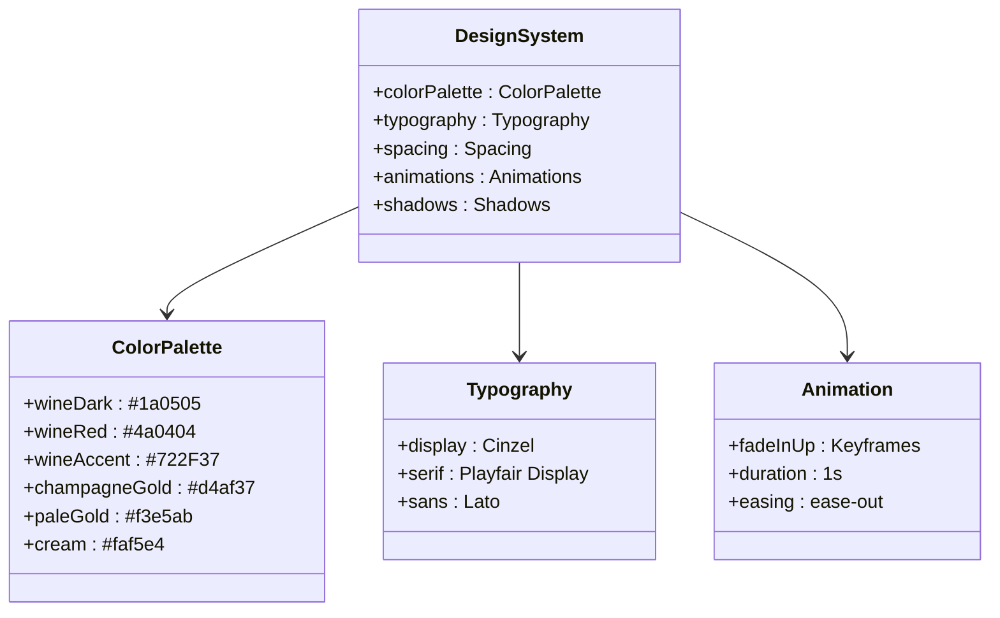

**图表来源**
- [tailwind.config.ts:9-33](file://tailwind.config.ts#L9-L33)
- [src/styles/globals.css:5-50](file://src/styles/globals.css#L5-L50)

### 品牌色彩体系

| 颜色类别 | HEX值 | 用途 |
|---------|-------|------|
| 深酒红 | `#1a0505` | 主背景色，深色主题 |
| 酒红色 | `#4a0404` | 次要背景色，容器背景 |
| 酒精色 | `#722F37` | 强调色，边框装饰 |
| 香槟金 | `#d4af37` | 品牌主色，链接高亮 |
| 浅金色 | `#f3e5ab` | 辅助色，文本强调 |
| 蛋奶酥 | `#faf5e4` | 浅色背景，柔和对比 |

**章节来源**
- [tailwind.config.ts:11-18](file://tailwind.config.ts#L11-L18)
- [src/styles/globals.css:6-13](file://src/styles/globals.css#L6-L13)

## 设计系统与品牌规范

### 组件设计规范

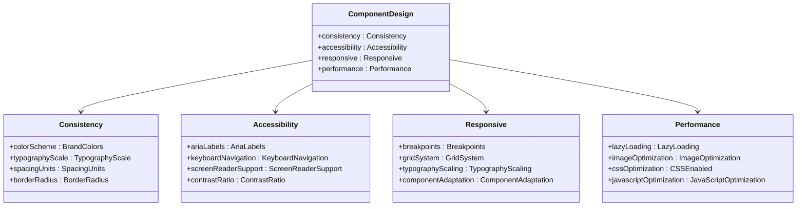

**图表来源**
- [.skills/frontend-design/SKILL.md:21-26](file://.skills/frontend-design/SKILL.md#L21-L26)

### 品牌设计系统

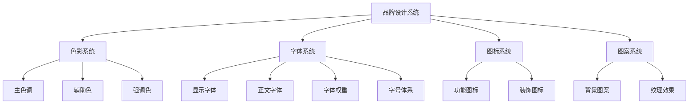

**图表来源**
- [tailwind.config.ts:11-18](file://tailwind.config.ts#L11-L18)
- [src/styles/globals.css:6-13](file://src/styles/globals.css#L6-L13)

**章节来源**
- [.skills/frontend-design/SKILL.md:27-42](file://.skills/frontend-design/SKILL.md#L27-L42)

## 实现策略与技术架构

### 组件实现策略

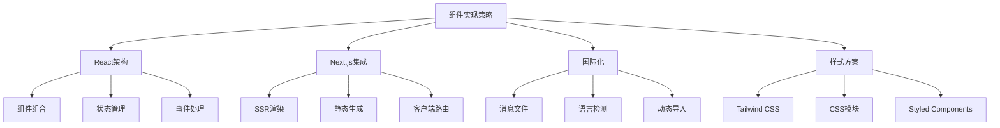

**图表来源**
- [src/components/layout/Navbar.tsx:19-111](file://src/components/layout/Navbar.tsx#L19-L111)
- [src/components/sections/HeroSection.tsx:4-56](file://src/components/sections/HeroSection.tsx#L4-L56)

### 技术栈架构

```mermaid
graph TB
subgraph "核心框架"
NextJS[Next.js 14.2.0]
React[React 18.3.0]
TypeScript[TypeScript 5.0.0]
end
subgraph "样式系统"
Tailwind[Tailwind CSS 3.4.0]
PostCSS[PostCSS 8.4.0]
Autoprefixer[Autoprefixer 10.4.0]
end
subgraph "国际化"
NextIntl[Next Intl 3.22.0]
ReactIcons[React Icons 5.3.0]
end
subgraph "开发工具"
ESLint[ESLint 8.0.0]
NodeTypes[@types/node]
ReactDOMTypes[@types/react-dom]
end
NextJS --> React
NextJS --> NextIntl
NextJS --> Tailwind
Tailwind --> PostCSS
PostCSS --> Autoprefixer
NextIntl --> ReactIcons
```

**图表来源**
- [package.json:11-28](file://package.json#L11-L28)

**章节来源**
- [package.json:11-28](file://package.json#L11-L28)
- [src/i18n/request.ts:4-15](file://src/i18n/request.ts#L4-L15)
- [src/i18n/routing.ts:3-7](file://src/i18n/routing.ts#L3-L7)

## 国际化系统详解

### 多语言消息文件架构

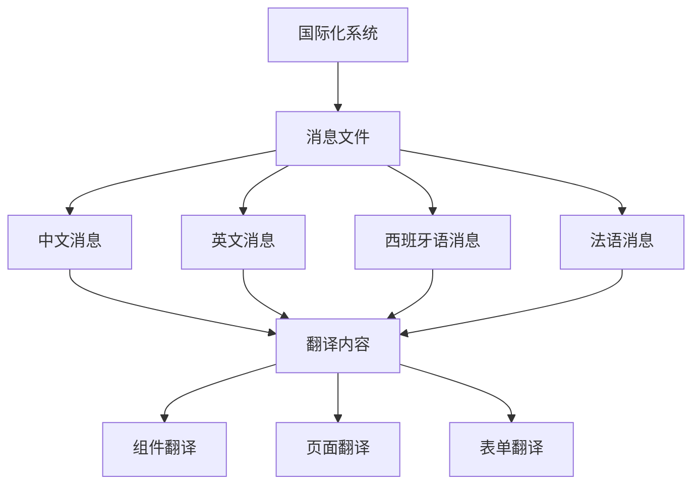

**图表来源**
- [src/messages/zh.json:1-318](file://src/messages/zh.json#L1-L318)
- [src/messages/en.json:1-318](file://src/messages/en.json#L1-L318)
- [src/messages/es.json:1-318](file://src/messages/es.json#L1-L318)
- [src/messages/fr.json:1-318](file://src/messages/fr.json#L1-L318)

### 国际化组件映射

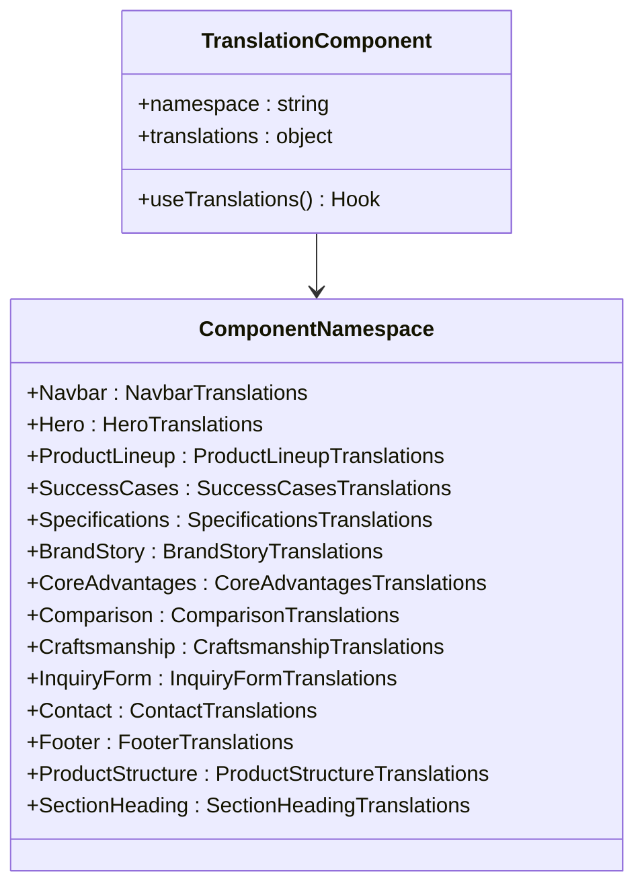

**图表来源**
- [src/components/sections/SuccessCases.tsx:1-53](file://src/components/sections/SuccessCases.tsx#L1-L53)
- [src/components/sections/ProductStructure.tsx:1-85](file://src/components/sections/ProductStructure.tsx#L1-L85)
- [src/components/sections/Specifications.tsx:1-78](file://src/components/sections/Specifications.tsx#L1-L78)

### 语言切换机制

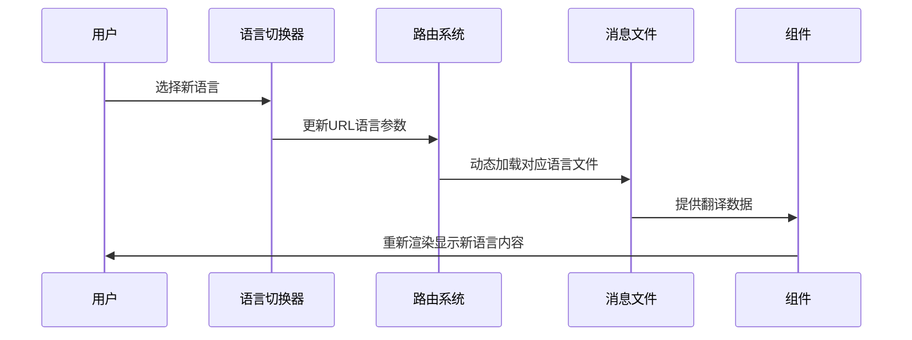

**图表来源**
- [src/i18n/routing.ts:1-8](file://src/i18n/routing.ts#L1-L8)
- [src/i18n/navigation.ts:1-6](file://src/i18n/navigation.ts#L1-L6)
- [src/i18n/request.ts:1-16](file://src/i18n/request.ts#L1-L16)

**章节来源**
- [src/messages/zh.json:1-318](file://src/messages/zh.json#L1-L318)
- [src/messages/en.json:1-318](file://src/messages/en.json#L1-L318)
- [src/messages/es.json:1-318](file://src/messages/es.json#L1-L318)
- [src/messages/fr.json:1-318](file://src/messages/fr.json#L1-L318)
- [src/i18n/routing.ts:1-8](file://src/i18n/routing.ts#L1-L8)
- [src/i18n/navigation.ts:1-6](file://src/i18n/navigation.ts#L1-L6)
- [src/i18n/request.ts:1-16](file://src/i18n/request.ts#L1-L16)

## API路由系统

### 联系表单API架构

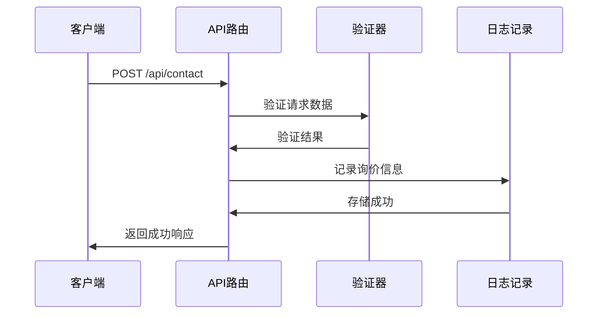

**图表来源**
- [src/app/api/contact/route.ts:3-55](file://src/app/api/contact/route.ts#L3-L55)

### API路由实现细节

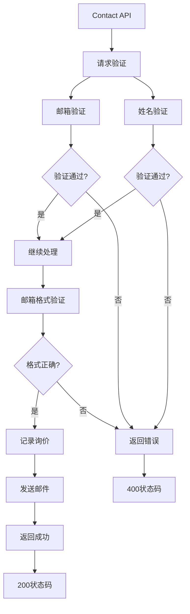

**图表来源**
- [src/app/api/contact/route.ts:9-24](file://src/app/api/contact/route.ts#L9-L24)

#### API功能特性
- **数据验证**：姓名和邮箱的必填验证
- **格式验证**：邮箱格式的正则表达式验证
- **日志记录**：详细的询价信息记录
- **扩展性**：预留邮件发送的集成接口
- **错误处理**：完整的错误状态码返回

**章节来源**
- [src/app/api/contact/route.ts:3-55](file://src/app/api/contact/route.ts#L3-L55)

## 性能优化与最佳实践

### 图片优化策略

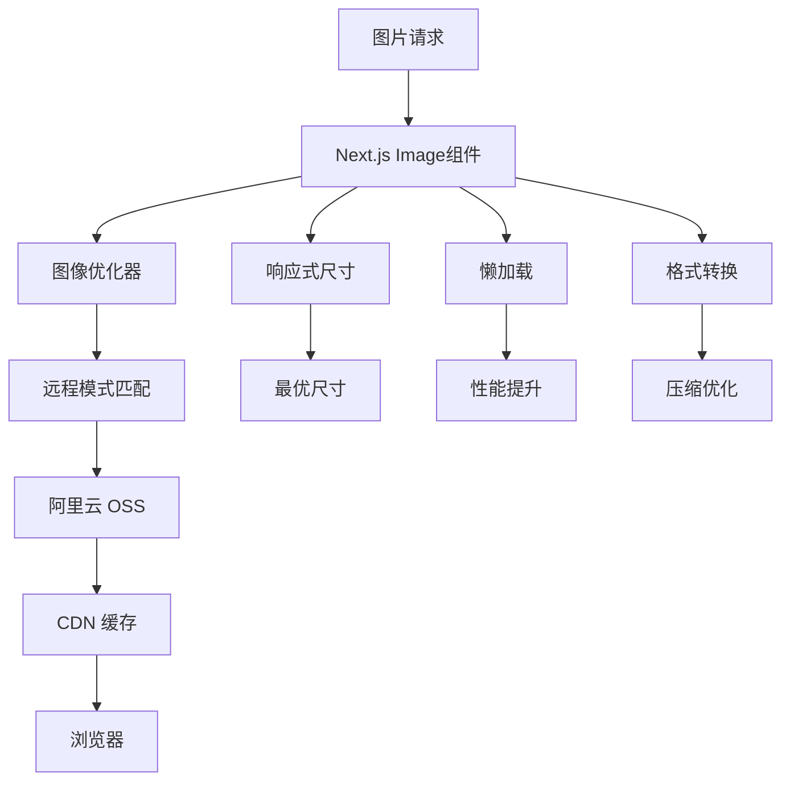

**图表来源**
- [next.config.mjs:7-15](file://next.config.mjs#L7-L15)
- [src/lib/images.ts:1-31](file://src/lib/images.ts#L1-L31)

### 样式优化

- **按需加载**：Tailwind CSS 仅编译实际使用的类名
- **字体优化**：使用 `font-display: swap` 防止阻塞渲染
- **动画性能**：使用 transform 和 opacity 属性优化动画性能

### 国际化性能优化

- **消息文件分离**：按语言分离消息文件，减少初始加载体积
- **按需加载**：只加载当前语言的消息文件
- **缓存策略**：利用浏览器缓存减少重复加载

## 故障排除与调试指南

### 常见问题解决

| 问题类型 | 可能原因 | 解决方案 |
|---------|---------|---------|
| 国际化不生效 | 语言包未正确导入 | 检查 `request.ts` 中的消息导入路径 |
| 图片加载失败 | OSS 配置错误 | 验证 `remotePatterns` 中的域名和路径 |
| 字体加载缓慢 | Google Fonts CDN 问题 | 检查网络连接和 CDN 状态 |
| 动画卡顿 | 复杂动画影响性能 | 减少动画复杂度或使用硬件加速属性 |
| API请求失败 | 邮箱格式验证错误 | 检查客户端表单的邮箱输入格式 |
| 语言切换失效 | 路由配置问题 | 验证 `routing.ts` 中的语言配置 |

### 开发环境调试

1. **启动应用**：运行 `npm run dev` 启动开发服务器
2. **检查构建**：运行 `npm run build` 验证生产构建
3. **代码检查**：运行 `npm run lint` 检查代码质量
4. **类型检查**：运行 `npx tsc --noEmit` 验证 TypeScript 类型
5. **国际化测试**：手动切换不同语言验证翻译完整性

**章节来源**
- [src/i18n/request.ts:4-15](file://src/i18n/request.ts#L4-L15)
- [next.config.mjs:7-15](file://next.config.mjs#L7-L15)
- [src/app/api/contact/route.ts:3-55](file://src/app/api/contact/route.ts#L3-L55)

## 总结与展望

这个前端设计项目展现了现代 Web 开发的最佳实践，成功地将传统陶瓷工艺与数字技术相结合。项目具有以下优势：

### 技术亮点
- **完整的15个专业组件架构**：涵盖产品展示、品牌故事、技术规格、客户案例、联系表单等全功能模块
- **完整的多语言国际化支持**：支持英语、法语、西班牙语、中文的无缝切换，涵盖所有核心功能模块
- **优雅的设计系统**：基于品牌色彩的专业配色方案，统一的视觉语言贯穿所有组件
- **响应式架构**：完全适配各种设备尺寸，从移动端到桌面端的完美体验
- **性能优化**：图片 CDN 加速、样式按需加载、国际化消息文件分离等多重优化策略
- **交互式表单系统**：集成防垃圾邮件机制的联系表单，支持多产品选择和状态反馈

### 设计特色
- **文化融合**：将中式陶瓷文化与现代设计理念结合，体现在色彩搭配和布局设计中
- **视觉层次**：通过渐变和纹理创造丰富的视觉体验，增强品牌的高端定位
- **用户体验**：流畅的动画效果、直观的导航设计、便捷的联系方式展示
- **功能完整性**：从产品展示到品牌故事，从技术规格到客户案例的全方位内容呈现

### 扩展性考虑
- **模块化组件设计**：每个功能模块都是独立的组件，便于维护和扩展
- **国际化架构**：完善的多语言支持系统，为未来扩展更多语言奠定基础
- **API集成点**：预留的邮件发送接口，便于集成专业的邮件服务
- **性能监控**：完整的错误处理和日志记录机制，便于性能监控和问题排查

该项目为其他工业产品展示网站提供了优秀的参考模板，特别是在国际化、性能优化、设计系统和交互体验方面都值得借鉴。随着业务的发展，可以在此基础上进一步扩展更多功能模块和语言支持。

**章节来源**
- [.skills/frontend-design/SKILL.md:1-43](file://.skills/frontend-design/SKILL.md#L1-L43)
- [.skills/canvas-design/SKILL.md:1-121](file://.skills/canvas-design/SKILL.md#L1-L121)