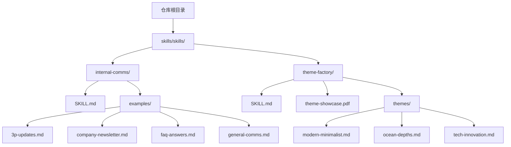
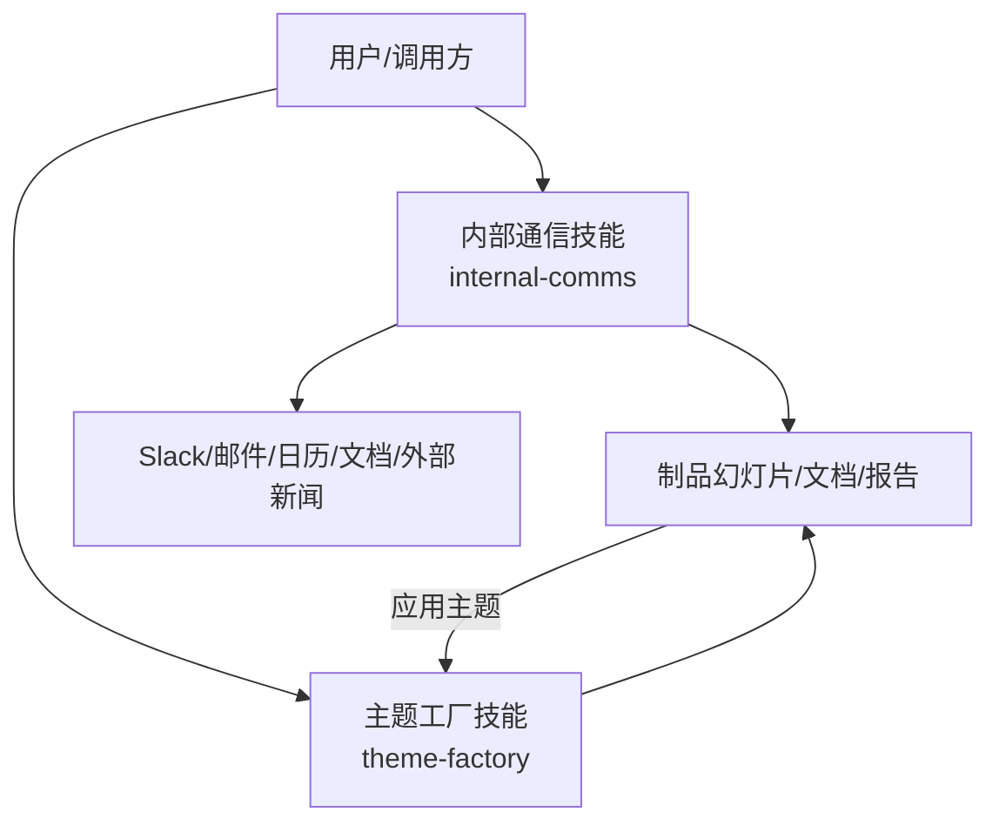
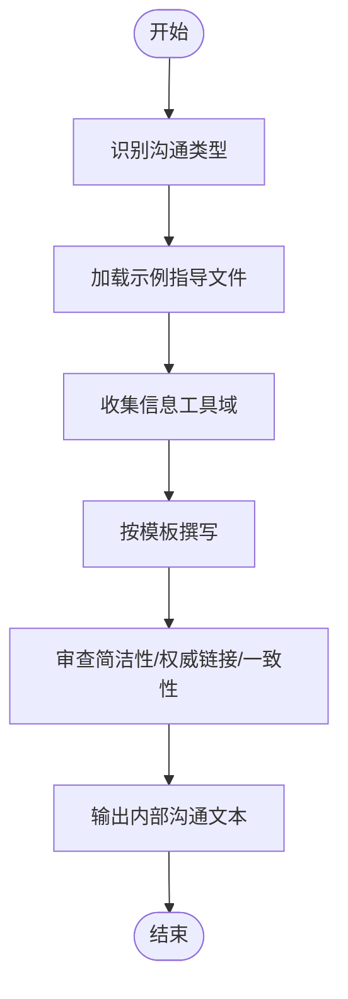
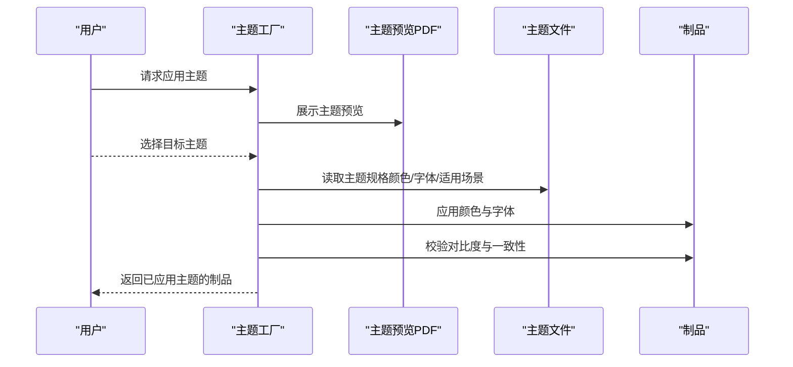
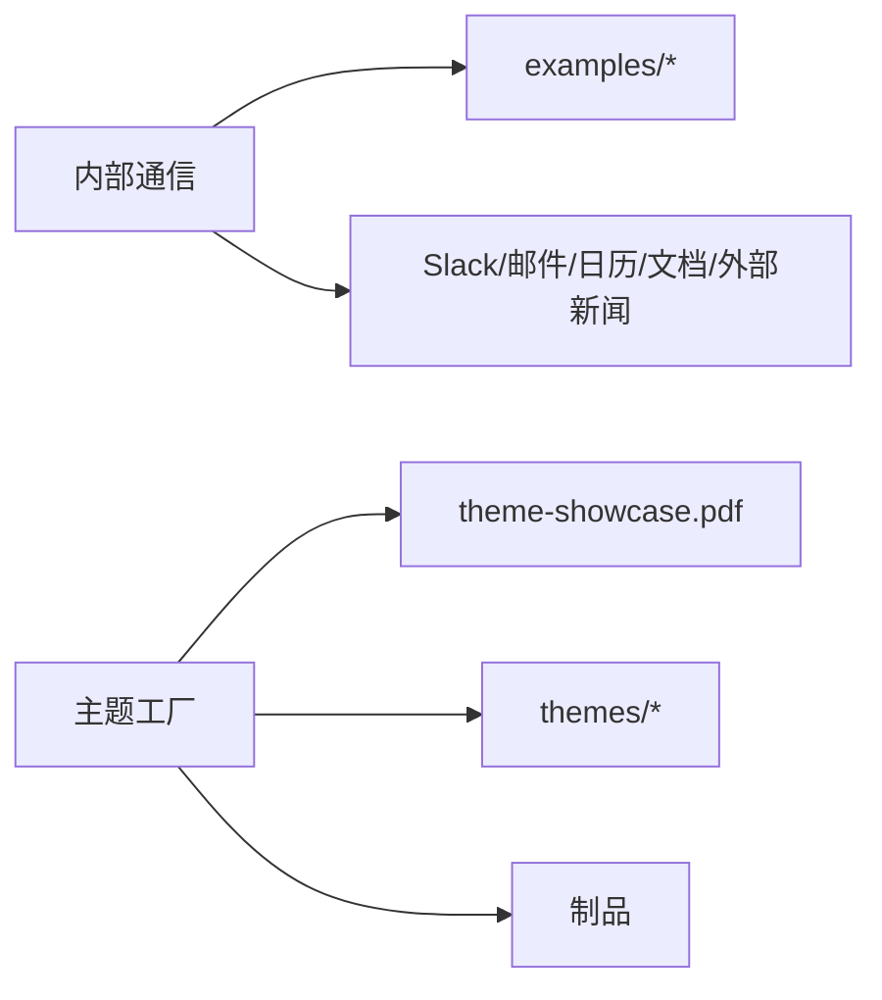

# 企业与沟通技能

<cite>
**本文引用的文件**
- [internal-comms/SKILL.md](file://skills/skills/internal-comms/SKILL.md)
- [internal-comms/examples/3p-updates.md](file://skills/skills/internal-comms/examples/3p-updates.md)
- [internal-comms/examples/company-newsletter.md](file://skills/skills/internal-comms/examples/company-newsletter.md)
- [internal-comms/examples/faq-answers.md](file://skills/skills/internal-comms/examples/faq-answers.md)
- [internal-comms/examples/general-comms.md](file://skills/skills/internal-comms/examples/general-comms.md)
- [theme-factory/SKILL.md](file://skills/skills/theme-factory/SKILL.md)
- [theme-factory/themes/modern-minimalist.md](file://skills/skills/theme-factory/themes/modern-minimalist.md)
- [theme-factory/themes/ocean-depths.md](file://skills/skills/theme-factory/themes/ocean-depths.md)
- [theme-factory/themes/tech-innovation.md](file://skills/skills/theme-factory/themes/tech-innovation.md)
</cite>

## 目录
1. [简介](#简介)
2. [项目结构](#项目结构)
3. [核心组件](#核心组件)
4. [架构总览](#架构总览)
5. [详细组件分析](#详细组件分析)
6. [依赖分析](#依赖分析)
7. [性能考虑](#性能考虑)
8. [故障排查指南](#故障排查指南)
9. [结论](#结论)
10. [附录](#附录)

## 简介
本文件面向“企业与沟通技能”的实现与使用，聚焦两个核心能力：
- 内部通信（internal-comms）：提供多种企业内部沟通场景的写作模板与流程规范，覆盖 3P 更新、公司通讯、FAQ 回答、通用沟通等。
- 主题工厂（theme-factory）：提供可复用的专业主题集合，用于统一幻灯片、文档、报告等企业制品的视觉风格，支持展示、选择、应用与自定义。

目标是帮助初学者快速上手，同时为有经验的开发者提供清晰的调用关系、接口约定、领域模型与最佳实践。

## 项目结构
该仓库采用按功能域划分的目录组织方式，内部通信与主题工厂分别位于 skills/skills/ 下的独立子目录中，并通过各自的 SKILL.md 文档说明用途、使用方法与可用资源。

图表来源
- [internal-comms/SKILL.md:1-33](file://skills/skills/internal-comms/SKILL.md#L1-L33)
- [internal-comms/examples/3p-updates.md:1-47](file://skills/skills/internal-comms/examples/3p-updates.md#L1-L47)
- [internal-comms/examples/company-newsletter.md:1-66](file://skills/skills/internal-comms/examples/company-newsletter.md#L1-L66)
- [internal-comms/examples/faq-answers.md:1-30](file://skills/skills/internal-comms/examples/faq-answers.md#L1-L30)
- [internal-comms/examples/general-comms.md:1-16](file://skills/skills/internal-comms/examples/general-comms.md#L1-L16)
- [theme-factory/SKILL.md:1-60](file://skills/skills/theme-factory/SKILL.md#L1-L60)
- [theme-factory/themes/modern-minimalist.md:1-20](file://skills/skills/theme-factory/themes/modern-minimalist.md#L1-L20)
- [theme-factory/themes/ocean-depths.md:1-20](file://skills/skills/theme-factory/themes/ocean-depths.md#L1-L20)
- [theme-factory/themes/tech-innovation.md:1-20](file://skills/skills/theme-factory/themes/tech-innovation.md#L1-L20)

章节来源
- [internal-comms/SKILL.md:1-33](file://skills/skills/internal-comms/SKILL.md#L1-L33)
- [theme-factory/SKILL.md:1-60](file://skills/skills/theme-factory/SKILL.md#L1-L60)

## 核心组件
- 内部通信（internal-comms）
  - 适用场景：3P 更新、公司通讯、FAQ 回答、状态报告、领导更新、项目更新、事件报告等。
  - 使用流程：识别沟通类型 → 从 examples/ 加载对应指导文件 → 按照格式、语气与内容收集要求执行。
  - 关键输入：请求中的沟通类型、目标受众、目的、语气、格式要求；可选工具访问权限（Slack、邮件、日历、文档、外部新闻）。
  - 关键输出：符合模板的内部沟通文本，包含链接、要点与优先级。
- 主题工厂（theme-factory）
  - 目的：为幻灯片、文档、报告等制品提供一致且专业的视觉风格。
  - 使用流程：展示主题预览 → 获取用户选择 → 应用颜色与字体到制品 → 自定义主题（如需）。
  - 可用主题：海洋深潜、日落大道、森林树冠、现代极简、金色时刻、北极薄霜、沙漠玫瑰、科技革新、植物花园、午夜银河。
  - 主题规格：每主题包含配色方案（十六进制）、标题与正文字体、适用场景建议。

章节来源
- [internal-comms/SKILL.md:7-29](file://skills/skills/internal-comms/SKILL.md#L7-L29)
- [internal-comms/examples/3p-updates.md:1-47](file://skills/skills/internal-comms/examples/3p-updates.md#L1-L47)
- [internal-comms/examples/company-newsletter.md:1-66](file://skills/skills/internal-comms/examples/company-newsletter.md#L1-L66)
- [internal-comms/examples/faq-answers.md:1-30](file://skills/skills/internal-comms/examples/faq-answers.md#L1-L30)
- [internal-comms/examples/general-comms.md:1-16](file://skills/skills/internal-comms/examples/general-comms.md#L1-L16)
- [theme-factory/SKILL.md:8-60](file://skills/skills/theme-factory/SKILL.md#L8-L60)

## 架构总览
内部通信与主题工厂在技能层面相互解耦，但共同服务于企业沟通与视觉一致性需求。内部通信负责“说什么”和“如何写”，主题工厂负责“如何呈现”。二者通过制品（如幻灯片、文档、通讯稿）衔接。

图表来源
- [internal-comms/SKILL.md:17-29](file://skills/skills/internal-comms/SKILL.md#L17-L29)
- [theme-factory/SKILL.md:19-60](file://skills/skills/theme-factory/SKILL.md#L19-L60)

## 详细组件分析

### 内部通信（internal-comms）组件分析
- 组件职责
  - 场景识别与模板加载：根据请求类型选择 examples/ 中的指导文件。
  - 写作流程编排：明确工具使用、分段优先级、避免重复与粒度过细。
  - 输出质量控制：强调简洁、主动语态、首句重要信息、匹配公司风格。
- 接口与调用关系
  - 输入：请求上下文（沟通类型、受众、目的、语气、格式要求），工具访问权限。
  - 处理：读取对应示例文件，按步骤收集信息、撰写、审查。
  - 输出：结构化内部沟通文本。
- 领域模型
  - 沟通类型：3P 更新、公司通讯、FAQ 回答、通用沟通。
  - 工具域：Slack、邮件、日历、文档、外部新闻。
  - 质量维度：简洁性、可消费性、一致性、权威链接。
- 使用模式
  - 3P 更新：严格格式（进度/计划/问题三段式），数据驱动，时间窗口明确。
  - 公司通讯：分段组织（公告、优先进展、领导更新、社交动态），强调公司级影响。
  - FAQ 回答：汇总高频问题，给出摘要化答案，注明来源。
  - 通用沟通：先确认受众、目的、语气与格式要求，再遵循通用原则。

图表来源
- [internal-comms/SKILL.md:17-29](file://skills/skills/internal-comms/SKILL.md#L17-L29)
- [internal-comms/examples/3p-updates.md:30-47](file://skills/skills/internal-comms/examples/3p-updates.md#L30-L47)
- [internal-comms/examples/company-newsletter.md:20-35](file://skills/skills/internal-comms/examples/company-newsletter.md#L20-L35)
- [internal-comms/examples/faq-answers.md:10-22](file://skills/skills/internal-comms/examples/faq-answers.md#L10-L22)
- [internal-comms/examples/general-comms.md:5-16](file://skills/skills/internal-comms/examples/general-comms.md#L5-L16)

章节来源
- [internal-comms/SKILL.md:7-29](file://skills/skills/internal-comms/SKILL.md#L7-L29)
- [internal-comms/examples/3p-updates.md:1-47](file://skills/skills/internal-comms/examples/3p-updates.md#L1-L47)
- [internal-comms/examples/company-newsletter.md:1-66](file://skills/skills/internal-comms/examples/company-newsletter.md#L1-L66)
- [internal-comms/examples/faq-answers.md:1-30](file://skills/skills/internal-comms/examples/faq-answers.md#L1-L30)
- [internal-comms/examples/general-comms.md:1-16](file://skills/skills/internal-comms/examples/general-comms.md#L1-L16)

### 主题工厂（theme-factory）组件分析
- 组件职责
  - 主题展示与选择：通过主题预览文件让用户直观比较。
  - 主题应用：读取选定主题的颜色与字体规范，应用于制品。
  - 自定义扩展：当现有主题不满足时，基于输入生成新主题并验证后应用。
- 接口与调用关系
  - 输入：主题预览文件、用户选择的主题名称、制品对象。
  - 处理：读取主题文件（颜色、字体、适用场景），校验对比度与可读性，统一应用。
  - 输出：应用主题后的制品。
- 领域模型
  - 主题实体：名称、配色方案（含十六进制）、字体对（标题/正文）、适用场景。
  - 制品实体：可被主题化的演示文稿、文档或报告。
- 使用模式
  - 展示与选择：先展示主题预览，再等待明确选择。
  - 应用与校验：读取主题规格，确保对比度与一致性，跨页面保持视觉统一。
  - 自定义主题：描述风格定位，生成主题并评审后再应用。

图表来源
- [theme-factory/SKILL.md:19-60](file://skills/skills/theme-factory/SKILL.md#L19-L60)
- [theme-factory/themes/modern-minimalist.md:1-20](file://skills/skills/theme-factory/themes/modern-minimalist.md#L1-L20)
- [theme-factory/themes/ocean-depths.md:1-20](file://skills/skills/theme-factory/themes/ocean-depths.md#L1-L20)
- [theme-factory/themes/tech-innovation.md:1-20](file://skills/skills/theme-factory/themes/tech-innovation.md#L1-L20)

章节来源
- [theme-factory/SKILL.md:8-60](file://skills/skills/theme-factory/SKILL.md#L8-L60)
- [theme-factory/themes/modern-minimalist.md:1-20](file://skills/skills/theme-factory/themes/modern-minimalist.md#L1-L20)
- [theme-factory/themes/ocean-depths.md:1-20](file://skills/skills/theme-factory/themes/ocean-depths.md#L1-L20)
- [theme-factory/themes/tech-innovation.md:1-20](file://skills/skills/theme-factory/themes/tech-innovation.md#L1-L20)

## 依赖分析
- 内部通信依赖
  - 工具域：Slack、邮件、日历、文档、外部新闻。这些工具的可用性直接影响信息收集与输出质量。
  - 示例文件：examples/ 下的各类指导文件作为模板与约束。
- 主题工厂依赖
  - 主题预览：theme-showcase.pdf 用于用户选择。
  - 主题文件：themes/ 下的各主题规格文件。
  - 制品：需要可应用颜色与字体的对象（如幻灯片、文档）。

图表来源
- [internal-comms/SKILL.md:17-29](file://skills/skills/internal-comms/SKILL.md#L17-L29)
- [theme-factory/SKILL.md:19-60](file://skills/skills/theme-factory/SKILL.md#L19-L60)

章节来源
- [internal-comms/SKILL.md:17-29](file://skills/skills/internal-comms/SKILL.md#L17-L29)
- [theme-factory/SKILL.md:19-60](file://skills/skills/theme-factory/SKILL.md#L19-L60)

## 性能考虑
- 信息收集阶段
  - 优先使用高置信度来源（大量反应/回复、官方发布渠道）以减少无效工作。
  - 明确时间窗口（如过去一周的进展、未来一周的计划）有助于缩小检索范围。
- 文本生成阶段
  - 严格遵循模板格式，减少反复修改与返工。
  - 在通用沟通场景中，先确认受众与语气，避免偏离目标。
- 视觉应用阶段
  - 应用主题前先进行对比度与可读性检查，避免后期大改。
  - 对于大型制品（多页幻灯片），建议分批应用并统一校验。

## 故障排查指南
- 内部通信
  - 无法确定沟通类型：提示用户提供更明确的场景或参考示例文件。
  - 缺少工具访问权限：引导用户提供关键信息（如链接、要点），以便按模板填充。
  - 输出冗长或缺乏重点：回退到模板的优先级清单（公司级影响、领导公告、里程碑、广泛影响、外部认可）进行精简。
- 主题工厂
  - 用户未选择主题：提示查看主题预览并明确选择。
  - 应用后对比度不足：检查主题配色是否适合背景，必要时调整或更换主题。
  - 自定义主题未获确认：要求用户提供风格描述与适用场景，生成后再次评审。

章节来源
- [internal-comms/SKILL.md:29-33](file://skills/skills/internal-comms/SKILL.md#L29-L33)
- [internal-comms/examples/3p-updates.md:27-28](file://skills/skills/internal-comms/examples/3p-updates.md#L27-L28)
- [internal-comms/examples/company-newsletter.md:31-35](file://skills/skills/internal-comms/examples/company-newsletter.md#L31-L35)
- [theme-factory/SKILL.md:58-60](file://skills/skills/theme-factory/SKILL.md#L58-L60)

## 结论
内部通信与主题工厂共同构成企业级沟通与视觉一致性的基础能力。前者通过标准化模板与工具域集成提升写作效率与质量，后者通过主题体系保障跨制品的视觉统一与专业感。二者结合可显著降低沟通成本、提升传播效果，并为后续自动化与规模化应用奠定基础。

## 附录
- 关键术语
  - 3P 更新：进度（Progress）、计划（Plans）、问题（Problems）的简要汇报形式。
  - 主题：一套完整的颜色与字体规范，用于统一制品的视觉风格。
- 常用主题示例
  - 现代极简：适用于科技、架构、可视化等场景。
  - 海洋深潜：适用于金融、咨询、信任型内容。
  - 科技创新：适用于初创、AI/ML、数字化转型等场景。

章节来源
- [theme-factory/SKILL.md:28-60](file://skills/skills/theme-factory/SKILL.md#L28-L60)
- [theme-factory/themes/modern-minimalist.md:17-20](file://skills/skills/theme-factory/themes/modern-minimalist.md#L17-L20)
- [theme-factory/themes/ocean-depths.md:17-20](file://skills/skills/theme-factory/themes/ocean-depths.md#L17-L20)
- [theme-factory/themes/tech-innovation.md:17-20](file://skills/skills/theme-factory/themes/tech-innovation.md#L17-L20)