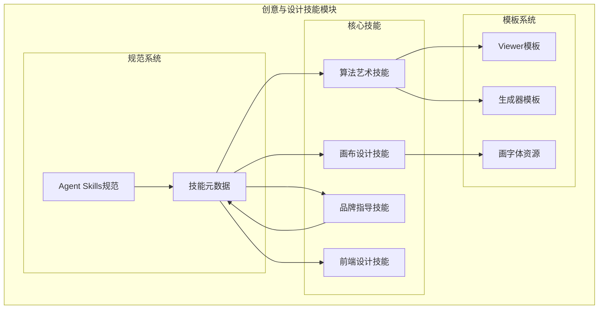
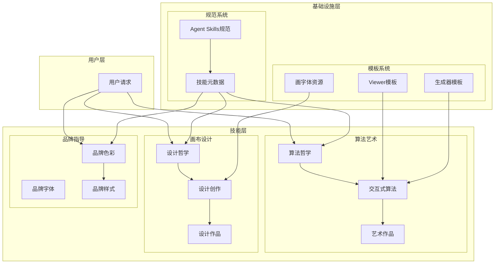
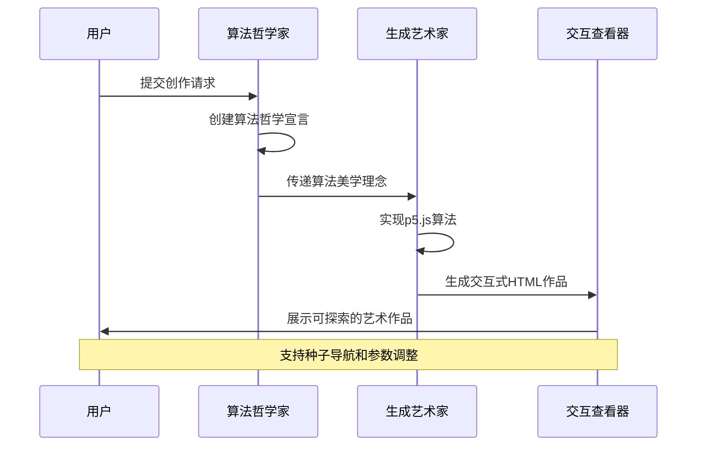
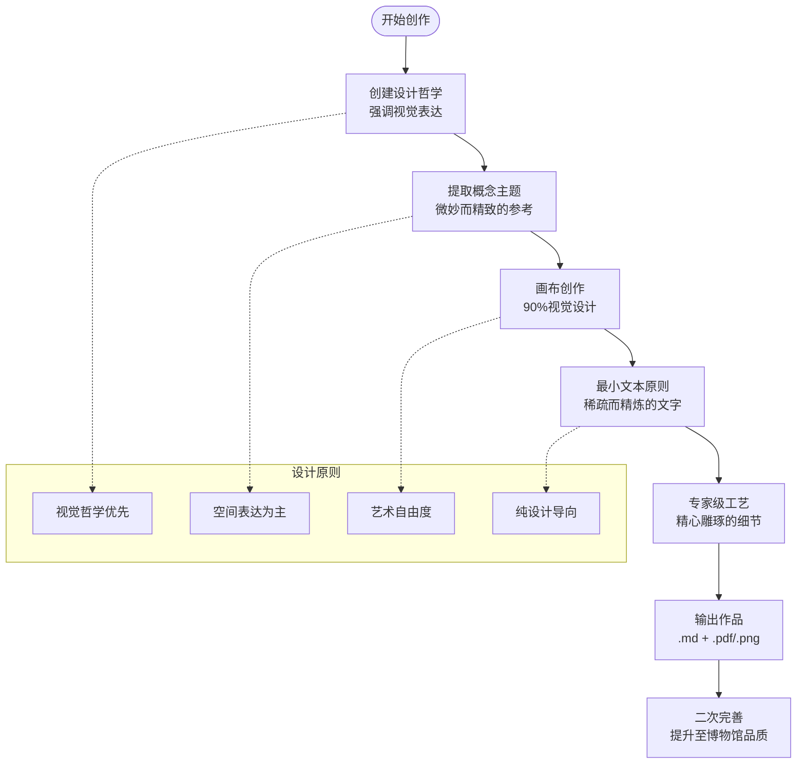
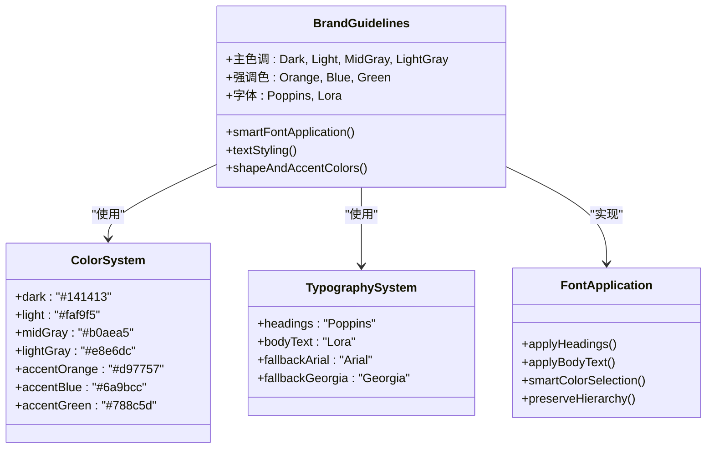
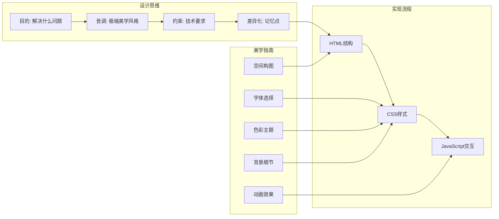
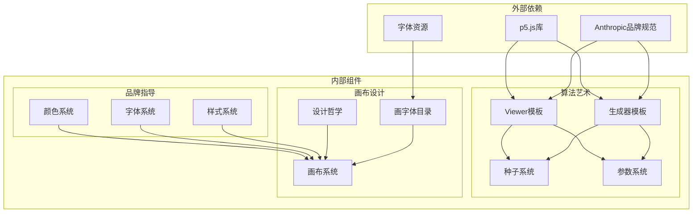

# 创意与设计技能

<cite>
**本文档中引用的文件**
- [skills/README.md](file://skills/README.md)
- [agent-skills-spec.md](file://skills/spec/agent-skills-spec.md)
- [canvas-design/SKILL.md](file://skills/skills/canvas-design/SKILL.md)
- [algorithmic-art/SKILL.md](file://skills/skills/algorithmic-art/SKILL.md)
- [brand-guidelines/SKILL.md](file://skills/skills/brand-guidelines/SKILL.md)
- [frontend-design/SKILL.md](file://skills/skills/frontend-design/SKILL.md)
- [viewer.html](file://skills/skills/algorithmic-art/templates/viewer.html)
- [generator_template.js](file://skills/skills/algorithmic-art/templates/generator_template.js)
</cite>

## 目录
1. [简介](#简介)
2. [项目结构](#项目结构)
3. [核心组件](#核心组件)
4. [架构概览](#架构概览)
5. [详细组件分析](#详细组件分析)
6. [依赖关系分析](#依赖关系分析)
7. [性能考虑](#性能考虑)
8. [故障排除指南](#故障排除指南)
9. [结论](#结论)

## 简介

创意与设计技能模块是Anthropic开发的一套专门用于增强Claude AI助手在创意设计领域能力的技能集合。该模块专注于三个核心设计领域：算法艺术、画布设计和品牌指导，旨在为用户提供从纯算法生成到视觉设计再到品牌规范的专业级创作体验。

这些技能通过标准化的流程和模板，确保用户能够获得高质量、可重复且具有专业水准的设计作品。每个技能都遵循严格的设计哲学，强调手工制作般的精致度和专家级的工艺水平。

## 项目结构

创意与设计技能模块采用模块化架构，每个技能都是独立的功能单元，但共享相同的设计理念和工作流程。

**图表来源**
- [skills/README.md:24-27](file://skills/README.md#L24-L27)
- [canvas-design/SKILL.md:1-130](file://skills/skills/canvas-design/SKILL.md#L1-L130)

**章节来源**
- [skills/README.md:12-27](file://skills/README.md#L12-L27)

## 核心组件

### 算法艺术技能 (Algorithmic Art)

算法艺术技能专注于使用p5.js创建基于计算的生成艺术作品。该技能强调算法哲学的重要性，要求用户先创建算法美学宣言，然后将其转化为交互式HTML5艺术作品。

**核心特性：**
- 基于种子的随机性确保可重现性
- 交互式参数控制系统
- 自包含的HTML5艺术作品
- 支持静态和动画两种输出格式

### 画布设计技能 (Canvas Design)

画布设计技能专注于创建视觉艺术作品，强调设计哲学的表达和空间美学。该技能要求用户先创建设计宣言，然后通过PDF或PNG格式的艺术作品来表达这些理念。

**核心特性：**
- 设计哲学驱动的创作流程
- 最小文本原则（90%视觉，10%必要文字）
- 专业的画布布局和排版
- 多页作品集支持

### 品牌指导技能 (Brand Guidelines)

品牌指导技能提供Anthropic官方的品牌识别系统，包括色彩方案、字体选择和视觉规范。该技能确保所有设计作品都符合公司的品牌标准。

**核心特性：**
- 官方品牌色彩系统
- 智能字体应用
- 形状和装饰元素的规范
- 跨平台一致性保证

**章节来源**
- [algorithmic-art/SKILL.md:1-405](file://skills/skills/algorithmic-art/SKILL.md#L1-L405)
- [canvas-design/SKILL.md:1-130](file://skills/skills/canvas-design/SKILL.md#L1-L130)
- [brand-guidelines/SKILL.md:1-74](file://skills/skills/brand-guidelines/SKILL.md#L1-L74)

## 架构概览

创意与设计技能模块采用分层架构，从通用规范到具体实现形成清晰的层次结构。

**图表来源**
- [algorithmic-art/SKILL.md:9-11](file://skills/skills/algorithmic-art/SKILL.md#L9-L11)
- [canvas-design/SKILL.md:9-11](file://skills/skills/canvas-design/SKILL.md#L9-L11)

## 详细组件分析

### 算法艺术技能架构

算法艺术技能采用"哲学-实现"的双阶段架构，确保每件作品都有明确的美学基础和可探索的参数空间。

**图表来源**
- [algorithmic-art/SKILL.md:361-382](file://skills/skills/algorithmic-art/SKILL.md#L361-L382)

#### 算法哲学创建流程

算法哲学创建过程强调计算美学的独特性，要求创作者思考算法如何表达内在理念。

**关键要素：**
- 计算过程和数学关系
- 随机性和噪声模式
- 粒子行为和场动力学
- 时间演进和系统状态
- 参数化变化和涌现复杂性

#### 交互式HTML作品生成

生成的HTML作品包含完整的交互界面，支持实时参数调整和种子导航。

**技术特性：**
- 自包含的单文件HTML结构
- p5.js CDN集成
- 响应式设计支持
- 种子控制功能
- 参数实时更新

**章节来源**
- [algorithmic-art/SKILL.md:15-86](file://skills/skills/algorithmic-art/SKILL.md#L15-L86)
- [algorithmic-art/SKILL.md:101-382](file://skills/skills/algorithmic-art/SKILL.md#L101-L382)

### 画布设计技能架构

画布设计技能采用"理念-表达"的创作流程，强调设计哲学对视觉表达的指导作用。

**图表来源**
- [canvas-design/SKILL.md:77-86](file://skills/skills/canvas-design/SKILL.md#L77-L86)

#### 设计哲学创建指南

设计哲学必须强调视觉表达、空间交流和艺术解读，避免冗余和重复。

**创作要点：**
- 强调手工制作感和专家级工艺
- 保持设计方向的具体性同时给予创造性空间
- 将最终作品描述为经过无数小时精心制作的艺术品
- 避免重复相同的设计原理和概念

#### 画布创作技术规范

画布创作要求作品达到博物馆或杂志的质量标准，注重细节的完美呈现。

**质量标准：**
- 使用重复图案和完美形状
- 采用系统观察的视觉语言
- 添加稀疏的临床字体和系统参考标记
- 使用有限的色彩搭配，确保整体协调
- 确保所有元素都有适当的呼吸空间和清晰分离

**章节来源**
- [canvas-design/SKILL.md:15-86](file://skills/skills/canvas-design/SKILL.md#L15-L86)
- [canvas-design/SKILL.md:100-130](file://skills/skills/canvas-design/SKILL.md#L100-L130)

### 品牌指导技能架构

品牌指导技能提供完整的品牌识别系统，确保所有设计作品都符合Anthropic的品牌标准。

**图表来源**
- [brand-guidelines/SKILL.md:17-74](file://skills/skills/brand-guidelines/SKILL.md#L17-L74)

#### 品牌色彩系统

品牌色彩系统提供精确的颜色值，确保跨平台的一致性表现。

**色彩规范：**
- 主色调：深色(#141413)、浅色(#faf9f5)、中灰色(#b0aea5)、浅灰色(#e8e6dc)
- 强调色：橙色(#d97757)、蓝色(#6a9bcc)、绿色(#788c5d)
- 颜色应用：通过python-pptx的RGBColor类实现精确匹配

#### 字体管理系统

字体管理确保在不同系统环境下都能获得最佳的显示效果。

**字体策略：**
- 标题字体：Poppins（支持Arial回退）
- 正文字体：Lora（支持Georgia回退）
- 智能颜色选择：根据背景自动选择合适的文字颜色
- 可读性保证：在各种系统上保持一致的阅读体验

**章节来源**
- [brand-guidelines/SKILL.md:15-74](file://skills/skills/brand-guidelines/SKILL.md#L15-L74)

### 前端设计技能架构

前端设计技能专注于创建具有高设计质量的生产级前端界面，避免常见的"AI风格"设计。

**图表来源**
- [frontend-design/SKILL.md:11-43](file://skills/skills/frontend-design/SKILL.md#L11-L43)

#### 前端美学指南

前端设计强调独特的字体选择、色彩主题和空间构图，避免使用常见的AI风格设计元素。

**设计原则：**
- 字体：选择独特且有个性的字体，避免使用Arial和Inter等通用字体
- 色彩：承诺统一的美学，使用CSS变量保持一致性
- 动画：使用CSS动画和微交互，注重高影响力的时刻
- 空间：采用非对称布局、重叠、对角线流动等创新构图
- 背景：创造氛围和深度，使用渐变网格、噪声纹理等创意效果

**章节来源**
- [frontend-design/SKILL.md:11-43](file://skills/skills/frontend-design/SKILL.md#L11-L43)

## 依赖关系分析

创意与设计技能模块内部存在复杂的依赖关系，形成了一个有机的设计生态系统。

**图表来源**
- [viewer.html:23](file://skills/skills/algorithmic-art/templates/viewer.html#L23)
- [generator_template.js:33](file://skills/skills/algorithmic-art/templates/generator_template.js#L33)

**章节来源**
- [viewer.html:1-599](file://skills/skills/algorithmic-art/templates/viewer.html#L1-L599)
- [generator_template.js:1-223](file://skills/skills/algorithmic-art/templates/generator_template.js#L1-L223)

## 性能考虑

创意与设计技能模块在性能优化方面采用了多项策略，确保用户能够获得流畅的创作体验。

### 算法艺术性能优化

算法艺术技能通过以下方式优化性能：
- 使用种子确保可重现性，避免不必要的重新计算
- 实现参数化系统，允许实时调整而不完全重建场景
- 优化p5.js渲染循环，减少不必要的DOM操作
- 提供静态和动画两种模式，根据需求选择最优执行方式

### 画布设计性能优化

画布设计技能的性能考虑包括：
- 限制字体数量，避免过多字体加载影响性能
- 优化图像处理流程，确保PDF和PNG输出的效率
- 实现响应式设计，适配不同设备的渲染需求
- 提供多页作品集的内存管理策略

### 品牌指导性能优化

品牌指导技能的性能优化措施：
- 使用预定义的颜色值，避免动态计算开销
- 智能字体应用，减少字体回退检查的频率
- 统一的样式系统，提高渲染效率
- 跨平台兼容性测试，确保在各种环境下的稳定表现

## 故障排除指南

### 算法艺术常见问题

**问题1：种子不生效**
- 检查是否正确调用了`randomSeed()`和`noiseSeed()`
- 确认种子值在正确的范围内
- 验证算法初始化顺序

**问题2：参数控制无响应**
- 检查HTML元素ID与JavaScript函数的对应关系
- 确认`updateParam()`函数的实现
- 验证参数范围设置是否合理

**问题3：性能问题**
- 减少粒子数量或简化算法逻辑
- 优化渲染循环，避免每帧重复计算
- 考虑使用静态模式而非动画模式

### 画布设计常见问题

**问题1：字体加载失败**
- 检查字体文件路径是否正确
- 确认字体文件格式支持情况
- 验证字体回退机制是否正常工作

**问题2：布局错乱**
- 检查CSS样式是否正确应用
- 确认响应式设计断点设置
- 验证画布边界和边距设置

**问题3：色彩不一致**
- 检查颜色值格式是否正确
- 确认色彩系统是否正确应用
- 验证跨浏览器兼容性

### 品牌指导常见问题

**问题1：颜色显示异常**
- 检查RGBColor类的使用方法
- 确认颜色值格式是否符合要求
- 验证色彩系统的兼容性

**问题2：字体显示问题**
- 检查字体文件是否正确安装
- 确认字体回退机制配置
- 验证字体加载状态

**问题3：样式不生效**
- 检查CSS优先级设置
- 确认样式应用时机
- 验证样式缓存机制

**章节来源**
- [algorithmic-art/SKILL.md:201-210](file://skills/skills/algorithmic-art/SKILL.md#L201-L210)
- [canvas-design/SKILL.md:108](file://skills/skills/canvas-design/SKILL.md#L108)
- [brand-guidelines/SKILL.md:62-74](file://skills/skills/brand-guidelines/SKILL.md#L62-L74)

## 结论

创意与设计技能模块代表了AI辅助创意设计领域的先进实践。通过算法艺术、画布设计和品牌指导三个核心技能的有机结合，该模块为用户提供了从纯算法生成到视觉设计再到品牌规范的完整创作解决方案。

该模块的成功在于其清晰的架构设计、标准化的工作流程和严格的质量控制。每个技能都强调手工制作般的精致度和专家级的工艺水平，确保用户能够获得专业级别的设计作品。

未来的发展方向包括：
- 扩展更多的设计风格和创作模式
- 增强AI辅助创作的能力
- 优化性能和用户体验
- 加强跨平台兼容性

通过持续的改进和创新，创意与设计技能模块将继续推动AI在创意设计领域的应用边界，为用户创造更加丰富和专业的设计体验。