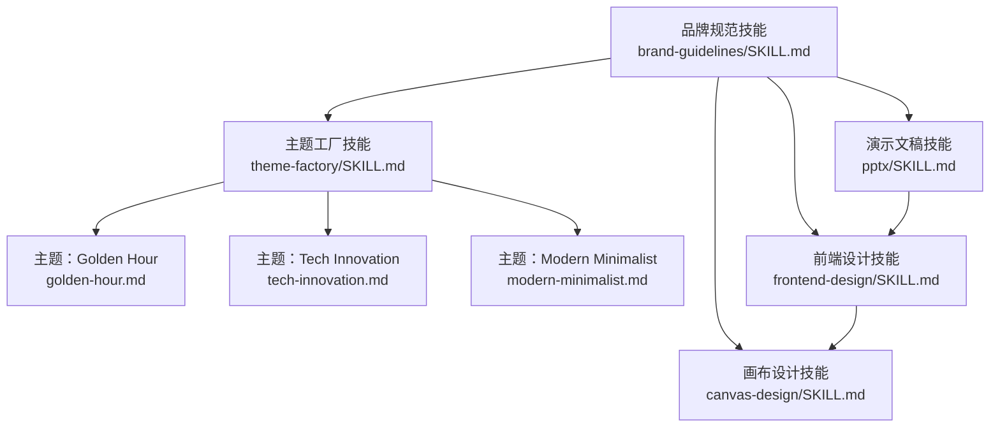
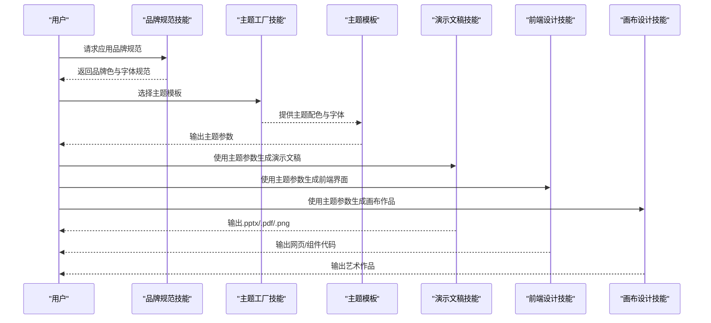
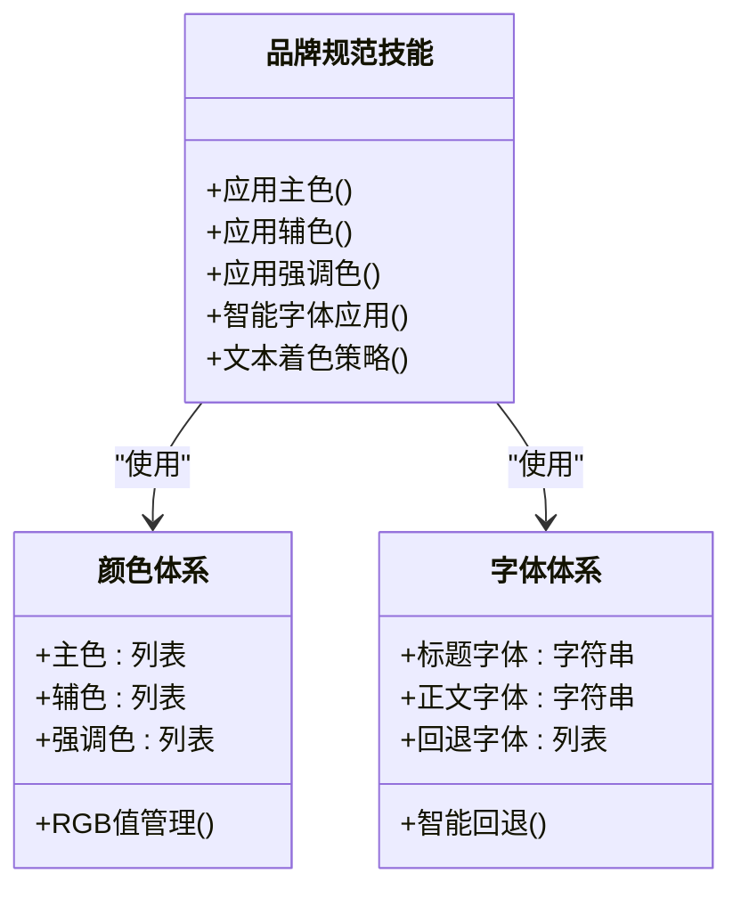
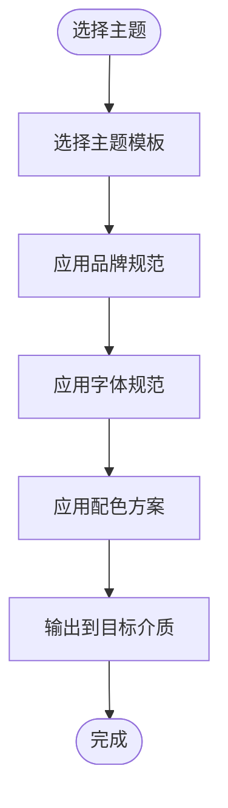
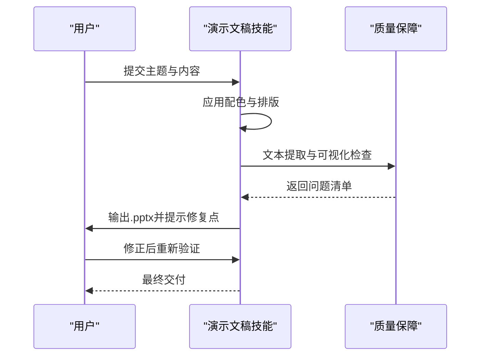
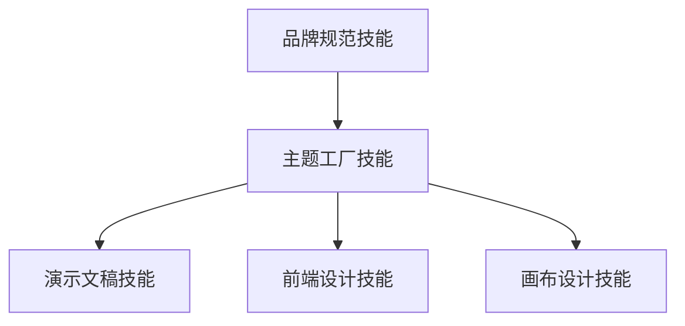

# 品牌指导技能

<cite>
**本文引用的文件**
- [brand-guidelines/SKILL.md](file://skills/skills/brand-guidelines/SKILL.md)
- [theme-factory/SKILL.md](file://skills/skills/theme-factory/SKILL.md)
- [theme-factory/themes/golden-hour.md](file://skills/skills/theme-factory/themes/golden-hour.md)
- [theme-factory/themes/tech-innovation.md](file://skills/skills/theme-factory/themes/tech-innovation.md)
- [theme-factory/themes/modern-minimalist.md](file://skills/skills/theme-factory/themes/modern-minimalist.md)
- [pptx/SKILL.md](file://skills/skills/pptx/SKILL.md)
- [frontend-design/SKILL.md](file://skills/skills/frontend-design/SKILL.md)
- [canvas-design/SKILL.md](file://skills/skills/canvas-design/SKILL.md)
</cite>

## 目录
1. [简介](#简介)
2. [项目结构](#项目结构)
3. [核心组件](#核心组件)
4. [架构总览](#架构总览)
5. [详细组件分析](#详细组件分析)
6. [依赖关系分析](#依赖关系分析)
7. [性能考量](#性能考量)
8. [故障排查指南](#故障排查指南)
9. [结论](#结论)
10. [附录](#附录)

## 简介
本技能文档围绕“品牌指导”主题，系统化阐述如何在各类设计与开发场景中应用品牌标准（颜色、字体与风格一致性），并提供从入门到专业的实践指南。文档以仓库中的品牌与设计相关技能为依据，结合主题工厂、演示文稿、前端与画布设计技能，给出可落地的实施细节、配置选项与使用模式，并通过图示展示关键流程与依赖关系。

## 项目结构
本仓库包含多个与“品牌与设计”相关的技能模块，其中与品牌指导最直接相关的是：
- 品牌规范技能：提供官方品牌色与字体规范，确保输出物具备统一的视觉语言
- 主题工厂技能：提供多种主题模板，便于快速套用品牌规范
- 演示文稿技能：提供幻灯片设计的配色、排版与内容组织建议
- 前端设计技能：强调视觉美学、字体与色彩的一致性
- 画布设计技能：强调“视觉哲学”与“极简文字”的表达方式

图表来源
- [brand-guidelines/SKILL.md:1-74](file://skills/skills/brand-guidelines/SKILL.md#L1-L74)
- [theme-factory/SKILL.md](file://skills/skills/theme-factory/SKILL.md)
- [theme-factory/themes/golden-hour.md:1-20](file://skills/skills/theme-factory/themes/golden-hour.md#L1-L20)
- [theme-factory/themes/tech-innovation.md:1-20](file://skills/skills/theme-factory/themes/tech-innovation.md#L1-L20)
- [theme-factory/themes/modern-minimalist.md:1-20](file://skills/skills/theme-factory/themes/modern-minimalist.md#L1-L20)
- [pptx/SKILL.md:1-190](file://skills/skills/pptx/SKILL.md#L1-L190)
- [frontend-design/SKILL.md:1-43](file://skills/skills/frontend-design/SKILL.md#L1-L43)
- [canvas-design/SKILL.md:1-121](file://skills/skills/canvas-design/SKILL.md#L1-L121)

章节来源
- [brand-guidelines/SKILL.md:1-74](file://skills/skills/brand-guidelines/SKILL.md#L1-L74)
- [theme-factory/SKILL.md](file://skills/skills/theme-factory/SKILL.md)
- [pptx/SKILL.md:1-190](file://skills/skills/pptx/SKILL.md#L1-L190)
- [frontend-design/SKILL.md:1-43](file://skills/skills/frontend-design/SKILL.md#L1-L43)
- [canvas-design/SKILL.md:1-121](file://skills/skills/canvas-design/SKILL.md#L1-L121)

## 核心组件
- 品牌规范技能：定义主色、辅色与字体规范，提供智能字体应用与文本着色策略，确保跨平台一致性
- 主题工厂：提供多种主题模板，每种主题包含明确的配色、字体与适用场景，便于快速套用
- 演示文稿技能：提供配色表、排版与内容组织建议，强调“主导色+1-2个辅助色+1个强调色”的结构
- 前端设计技能：强调字体、色彩、动效与空间构成的一致性，避免通用化“AI美学”
- 画布设计技能：强调“视觉哲学”与“极简文字”，通过设计宣言指导视觉表达

章节来源
- [brand-guidelines/SKILL.md:15-73](file://skills/skills/brand-guidelines/SKILL.md#L15-L73)
- [theme-factory/SKILL.md](file://skills/skills/theme-factory/SKILL.md)
- [pptx/SKILL.md:47-132](file://skills/skills/pptx/SKILL.md#L47-L132)
- [frontend-design/SKILL.md:27-42](file://skills/skills/frontend-design/SKILL.md#L27-L42)
- [canvas-design/SKILL.md:15-121](file://skills/skills/canvas-design/SKILL.md#L15-L121)

## 架构总览
品牌指导的实现由“品牌规范”作为基线，通过“主题工厂”进行风格化扩展，再在不同介质（演示文稿、前端、画布）中落地执行。下图展示了从品牌规范到具体输出的调用关系与数据流：

图表来源
- [brand-guidelines/SKILL.md:15-73](file://skills/skills/brand-guidelines/SKILL.md#L15-L73)
- [theme-factory/SKILL.md](file://skills/skills/theme-factory/SKILL.md)
- [pptx/SKILL.md:47-132](file://skills/skills/pptx/SKILL.md#L47-L132)
- [frontend-design/SKILL.md:27-42](file://skills/skills/frontend-design/SKILL.md#L27-L42)
- [canvas-design/SKILL.md:94-121](file://skills/skills/canvas-design/SKILL.md#L94-L121)

## 详细组件分析

### 组件A：品牌规范技能
- 角色定位：提供官方品牌色与字体规范，确保跨介质一致性
- 关键能力：
  - 颜色体系：主色、辅色与强调色的明确定义与应用策略
  - 字体体系：标题与正文的字体选择与回退策略
  - 智能应用：根据背景自动选择文字颜色，保持对比度与可读性
  - 形状与强调：非文本形状使用强调色循环，维持视觉活力
- 技术要点：
  - 使用RGB值精确匹配品牌色
  - 通过字体回退保证跨系统兼容
  - 通过循环强调色保持视觉节奏

图表来源
- [brand-guidelines/SKILL.md:17-73](file://skills/skills/brand-guidelines/SKILL.md#L17-L73)

章节来源
- [brand-guidelines/SKILL.md:15-73](file://skills/skills/brand-guidelines/SKILL.md#L15-L73)

### 组件B：主题工厂技能
- 角色定位：基于品牌规范提供风格化主题模板
- 关键能力：
  - 多主题模板：包含配色、字体与适用场景
  - 场景适配：针对不同业务场景提供主题建议
  - 快速套用：一键应用至演示文稿、前端或画布设计
- 典型主题参考：
  - Golden Hour：暖色调秋日氛围
  - Tech Innovation：高对比科技风
  - Modern Minimalist：现代极简灰阶风

图表来源
- [theme-factory/SKILL.md](file://skills/skills/theme-factory/SKILL.md)
- [theme-factory/themes/golden-hour.md:1-20](file://skills/skills/theme-factory/themes/golden-hour.md#L1-L20)
- [theme-factory/themes/tech-innovation.md:1-20](file://skills/skills/theme-factory/themes/tech-innovation.md#L1-L20)
- [theme-factory/themes/modern-minimalist.md:1-20](file://skills/skills/theme-factory/themes/modern-minimalist.md#L1-L20)

章节来源
- [theme-factory/SKILL.md](file://skills/skills/theme-factory/SKILL.md)
- [theme-factory/themes/golden-hour.md:1-20](file://skills/skills/theme-factory/themes/golden-hour.md#L1-L20)
- [theme-factory/themes/tech-innovation.md:1-20](file://skills/skills/theme-factory/themes/tech-innovation.md#L1-L20)
- [theme-factory/themes/modern-minimalist.md:1-20](file://skills/skills/theme-factory/themes/modern-minimalist.md#L1-L20)

### 组件C：演示文稿技能
- 角色定位：将品牌规范与主题应用于PPT制作
- 关键能力：
  - 配色建议：主导色、辅助色与强调色的比例与组合
  - 排版建议：标题、段落、注释的字号与对齐方式
  - 内容组织：每页必须有视觉元素，避免纯文字幻灯片
  - 质量保障：文本提取与可视化检查的验证流程
- 实施要点：
  - 幻灯片结构：标题+内容+结论的“三明治”结构
  - 视觉动机：每页围绕一个独特视觉元素重复强化
  - 避免误区：不默认蓝色、不混用随机间距、不省略文本框内边距等

图表来源
- [pptx/SKILL.md:47-171](file://skills/skills/pptx/SKILL.md#L47-L171)

章节来源
- [pptx/SKILL.md:47-171](file://skills/skills/pptx/SKILL.md#L47-L171)

### 组件D：前端设计技能
- 角色定位：将品牌规范转化为生产级前端界面
- 关键能力：
  - 字体选择：标题与正文的字体搭配与回退策略
  - 色彩与主题：使用CSS变量保持一致性，强调色突出重点
  - 动效与交互：页面加载的高影响力动效优先，避免分散注意力的小动作
  - 空间构成：打破常规布局，善用负空间与不对称
  - 背景与细节：通过渐变、纹理、阴影等营造层次感
- 实施要点：
  - 避免通用“AI美学”，追求上下文特定的个性表达
  - 根据美学方向匹配实现复杂度：极简需要精准的留白与细节，极繁需要精心编排的层次

章节来源
- [frontend-design/SKILL.md:27-42](file://skills/skills/frontend-design/SKILL.md#L27-L42)

### 组件E：画布设计技能
- 角色定位：通过“视觉哲学”指导创作，强调“极简文字”
- 关键能力：
  - 设计哲学：以形式、空间、色彩、构成为核心
  - 表达方式：90%视觉设计+10%必要文字，文字作为视觉元素
  - 创作流程：先生成设计宣言，再在画布上表达
  - 品质要求：追求“手工质感”，每个细节都经得起审视
- 实施要点：
  - 文本最小化：避免冗长说明，文字服务于画面
  - 边界控制：所有元素置于画布边界内，留足边距
  - 迭代优化：二次打磨，使作品达到“博物馆品质”

章节来源
- [canvas-design/SKILL.md:15-121](file://skills/skills/canvas-design/SKILL.md#L15-L121)

## 依赖关系分析
- 品牌规范技能是所有设计输出的“根”，主题工厂与各介质技能均依赖其提供的颜色与字体规范
- 主题工厂提供风格化的“主题模板”，降低重复劳动，提升一致性
- 各介质技能（PPT、前端、画布）在各自领域内落实品牌规范，形成“统一基线+风格扩展”的双层架构

图表来源
- [brand-guidelines/SKILL.md:15-73](file://skills/skills/brand-guidelines/SKILL.md#L15-L73)
- [theme-factory/SKILL.md](file://skills/skills/theme-factory/SKILL.md)
- [pptx/SKILL.md:47-132](file://skills/skills/pptx/SKILL.md#L47-L132)
- [frontend-design/SKILL.md:27-42](file://skills/skills/frontend-design/SKILL.md#L27-L42)
- [canvas-design/SKILL.md:94-121](file://skills/skills/canvas-design/SKILL.md#L94-L121)

章节来源
- [brand-guidelines/SKILL.md:15-73](file://skills/skills/brand-guidelines/SKILL.md#L15-L73)
- [theme-factory/SKILL.md](file://skills/skills/theme-factory/SKILL.md)
- [pptx/SKILL.md:47-132](file://skills/skills/pptx/SKILL.md#L47-L132)
- [frontend-design/SKILL.md:27-42](file://skills/skills/frontend-design/SKILL.md#L27-L42)
- [canvas-design/SKILL.md:94-121](file://skills/skills/canvas-design/SKILL.md#L94-L121)

## 性能考量
- 字体回退与缓存：优先使用系统已安装字体，减少运行时加载开销；必要时预装品牌字体以保证一致性
- 颜色与对比度：合理设置强调色与背景对比度，避免低对比导致的重绘与可读性问题
- 动效与渲染：前端动效应聚焦于高影响力时刻，避免过多微交互造成渲染压力
- 资源打包：在演示文稿与画布输出中，尽量减少不必要的视觉元素叠加，降低文件体积与渲染成本

## 故障排查指南
- 文本可读性差
  - 检查对比度是否符合品牌规范；必要时切换强调色或调整背景
  - 参考演示文稿技能中的字号与对齐建议
- 字体显示异常
  - 确认系统是否已安装品牌字体；若未安装，启用回退字体策略
- 配色不一致
  - 在主题工厂中选择对应主题；或直接使用品牌规范技能中的颜色值
- 内容组织混乱
  - 遵循演示文稿技能的“每页必须有视觉元素”原则；避免纯文字幻灯片

章节来源
- [pptx/SKILL.md:120-171](file://skills/skills/pptx/SKILL.md#L120-L171)
- [frontend-design/SKILL.md:27-42](file://skills/skills/frontend-design/SKILL.md#L27-L42)
- [brand-guidelines/SKILL.md:62-73](file://skills/skills/brand-guidelines/SKILL.md#L62-L73)

## 结论
通过“品牌规范技能”提供统一基线，“主题工厂技能”提供风格扩展，并在演示文稿、前端与画布等介质中落地执行，可以有效实现品牌一致性与高质量输出。建议在项目初期即引入品牌规范与主题模板，贯穿设计与开发全流程，持续迭代以提升团队的设计效率与交付质量。

## 附录
- 常见应用场景示例
  - 营销材料：使用主题工厂中的“Golden Hour”主题，配合品牌规范的暖色调与优雅字体，营造温馨与专业感
  - 演示文稿：遵循演示文稿技能的配色与排版建议，确保每页都有视觉元素，避免纯文字
  - 网站设计：采用前端设计技能的字体与色彩策略，结合品牌规范的颜色循环，打造统一且富有层次的界面
- 品牌一致性的重要性
  - 提升识别度与信任度
  - 降低认知负担，增强用户体验
  - 保证跨渠道、跨介质的一致表达