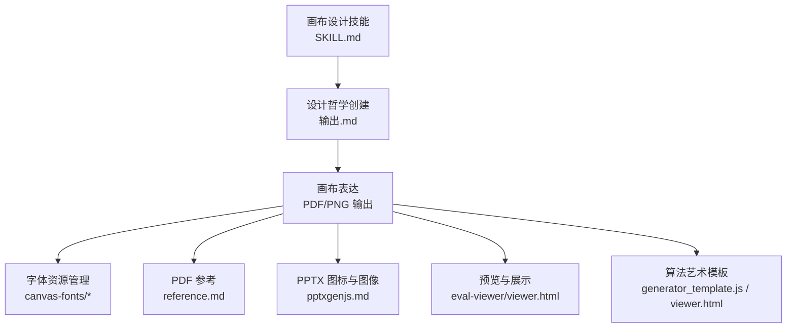
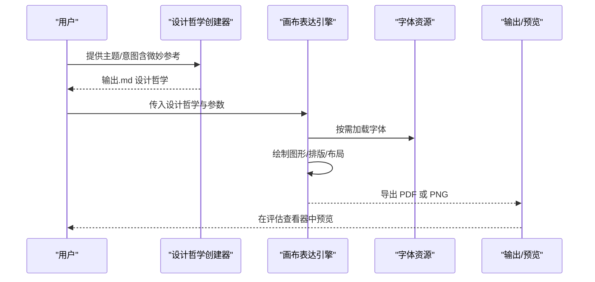
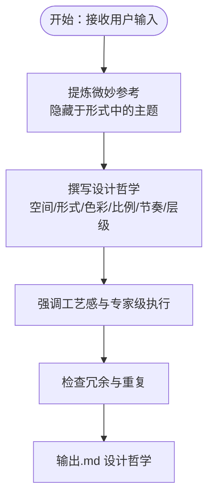
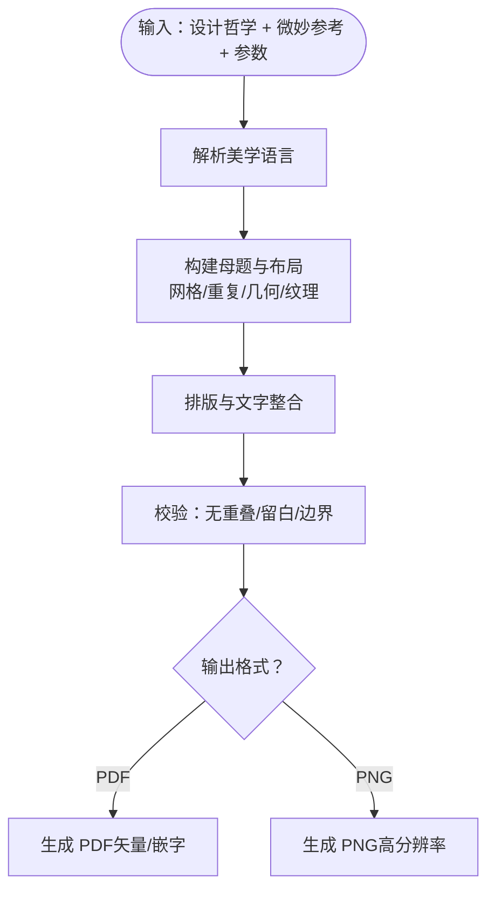
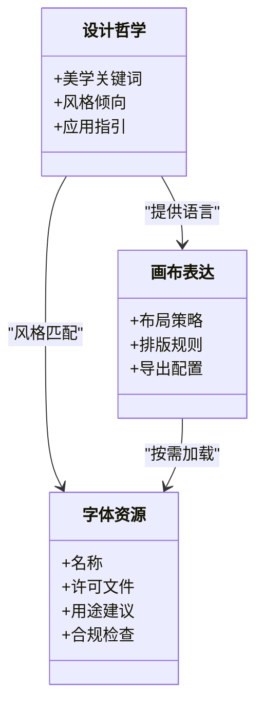
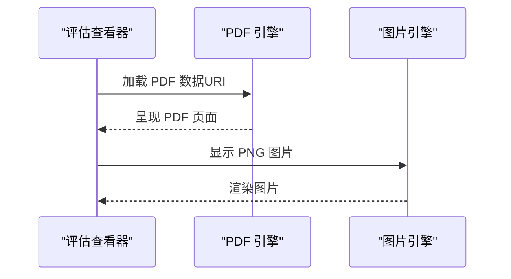
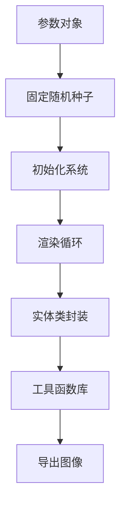
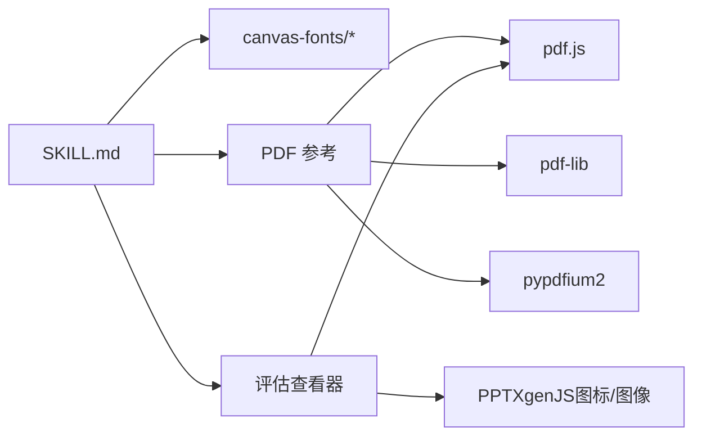

# 画布设计技能

<cite>
**本文引用的文件**
- [SKILL.md](file://skills/skills/canvas-design/SKILL.md)
- [LICENSE.txt](file://skills/skills/canvas-design/LICENSE.txt)
- [ArsenalSC-OFL.txt](file://skills/skills/canvas-design/canvas-fonts/ArsenalSC-OFL.txt)
- [BigShoulders-OFL.txt](file://skills/skills/canvas-design/canvas-fonts/BigShoulders-OFL.txt)
- [JetBrainsMono-OFL.txt](file://skills/skills/canvas-design/canvas-fonts/JetBrainsMono-OFL.txt)
- [reference.md](file://skills/skills/pdf/reference.md)
- [pptxgenjs.md](file://skills/skills/pptx/pptxgenjs.md)
- [viewer.html](file://skills/skills/skill-creator/eval-viewer/viewer.html)
- [generator_template.js](file://skills/skills/algorithmic-art/templates/generator_template.js)
- [viewer.html（算法艺术）](file://skills/skills/algorithmic-art/templates/viewer.html)
</cite>

## 目录
1. [简介](#简介)
2. [项目结构](#项目结构)
3. [核心组件](#核心组件)
4. [架构总览](#架构总览)
5. [详细组件分析](#详细组件分析)
6. [依赖分析](#依赖分析)
7. [性能考虑](#性能考虑)
8. [故障排查指南](#故障排查指南)
9. [结论](#结论)
10. [附录](#附录)

## 简介
本技能围绕“画布设计”展开，目标是通过“设计哲学”驱动的静态视觉生成，产出高质量的 PDF 或 PNG 艺术作品。其工作流分为两步：先生成可复用的“设计哲学”（以.md形式输出），再基于该哲学在画布上进行可视化表达，最终导出为单页或多页 PDF 或 PNG。技能强调“极简文字、空间表达、工艺感与专家级执行”，并提供字体资源管理与输出格式配置建议。

## 项目结构
- 技能说明与流程：位于 SKILL.md，定义了“设计哲学创建”和“画布表达”的步骤、原则与输出规范。
- 字体资源：位于 canvas-fonts 目录，包含多套开源字体的许可文本，用于合法嵌入与使用。
- 输出与渲染参考：PDF 参考文档提供 JS/Python 工具链示例；PPTX 指南提供图标生成与图像尺寸策略；评估查看器支持 PDF/PNG 预览。
- 算法艺术模板：提供参数化、可复现的 p5.js 结构，便于理解静态/动态生成的工程化方法。

图表来源
- [SKILL.md:1-130](file://skills/skills/canvas-design/SKILL.md#L1-L130)
- [reference.md:1-612](file://skills/skills/pdf/reference.md#L1-L612)
- [pptxgenjs.md:168-232](file://skills/skills/pptx/pptxgenjs.md#L168-L232)
- [viewer.html:952-991](file://skills/skills/skill-creator/eval-viewer/viewer.html#L952-L991)
- [generator_template.js:1-223](file://skills/skills/algorithmic-art/templates/generator_template.js#L1-L223)
- [viewer.html（算法艺术）:1-599](file://skills/skills/algorithmic-art/templates/viewer.html#L1-L599)

章节来源
- [SKILL.md:1-130](file://skills/skills/canvas-design/SKILL.md#L1-L130)

## 核心组件
- 设计哲学创建器
  - 任务：生成一个“视觉运动”的美学世界观，指导后续可视化表达。
  - 要点：强调空间、色彩、比例、节奏与视觉层级；避免冗余；突出“精心制作”的工艺感；最小化文字，让信息通过空间传达。
- 画布表达引擎
  - 任务：依据设计哲学，在单页或多页画布上进行可视化创作，输出 PDF 或 PNG。
  - 要点：极简文字、不同字体区分文本；确保不重叠、有留白、边界内；追求专家级执行与完美细节。
- 字体资源管理
  - 任务：从 canvas-fonts 中按需下载与嵌入字体，保证版权合规与一致性。
  - 要点：遵循各字体许可；优先使用与设计哲学匹配的字形风格；避免类型学冲突。
- 输出与预览
  - 任务：将作品导出为 PDF 或 PNG，并在评估查看器中预览。
  - 要点：PDF 使用标准字体或嵌入字体；PNG 作为高分辨率静态图；预览器支持 PDF 嵌入与图片显示。

章节来源
- [SKILL.md:15-130](file://skills/skills/canvas-design/SKILL.md#L15-L130)
- [LICENSE.txt:1-202](file://skills/skills/canvas-design/LICENSE.txt#L1-L202)

## 架构总览
下图展示了从“设计哲学”到“画布表达”再到“输出/预览”的端到端流程：

图表来源
- [SKILL.md:15-130](file://skills/skills/canvas-design/SKILL.md#L15-L130)
- [reference.md:80-139](file://skills/skills/pdf/reference.md#L80-L139)
- [viewer.html:952-991](file://skills/skills/skill-creator/eval-viewer/viewer.html#L952-L991)

## 详细组件分析

### 设计哲学创建器
- 设计原则
  - 视觉优先：通过空间、形式、色彩、构图传递信息。
  - 最小文字：仅保留必要信息，且必须融入视觉架构。
  - 工艺感：强调“精心制作”“专家级执行”，追求极致细节。
  - 自由度：为后续创作者留出 interpretive 空间，但保持方向性。
- 输出形态
  - 单个 .md 文件，包含若干段落，形成可复用的美学语言。
- 示例参考
  - “Concrete Poetry”“Chromatic Language”“Analog Meditation”“Organic Systems”“Geometric Silence”

图表来源
- [SKILL.md:33-85](file://skills/skills/canvas-design/SKILL.md#L33-L85)

章节来源
- [SKILL.md:15-85](file://skills/skills/canvas-design/SKILL.md#L15-L85)

### 画布表达引擎
- 输入
  - 设计哲学（.md）
  - 用户补充的“微妙参考”
  - 参数（如画布尺寸、颜色、字体、密度、重复模式等）
- 处理
  - 解析设计哲学，提取视觉语言关键词
  - 生成网格/重复图案/几何/纹理等母题
  - 文字作为视觉元素而非信息载体，控制排布与对比
  - 确保无重叠、留白充足、边界内
- 输出
  - PDF：适合矢量与嵌字；可嵌入字体或使用标准字体
  - PNG：适合高分辨率静态图；注意 DPI 与压缩

图表来源
- [SKILL.md:100-130](file://skills/skills/canvas-design/SKILL.md#L100-L130)
- [reference.md:80-139](file://skills/skills/pdf/reference.md#L80-L139)

章节来源
- [SKILL.md:100-130](file://skills/skills/canvas-design/SKILL.md#L100-L130)

### 字体资源管理
- 资源组织
  - 所有字体均附带 OFL 许可文本，便于审计与合规。
- 使用建议
  - 与设计哲学风格匹配：如极简/科技/有机/复古等
  - 文字与图形分离：文字作为视觉元素参与构图
  - 不同功能使用不同字体：标题、正文、标注、装饰
- 合规要点
  - 严格遵守各字体许可条款；避免商业用途限制
  - 嵌字时遵循许可要求（如保留声明）

图表来源
- [SKILL.md:108-112](file://skills/skills/canvas-design/SKILL.md#L108-L112)
- [ArsenalSC-OFL.txt:1-94](file://skills/skills/canvas-design/canvas-fonts/ArsenalSC-OFL.txt#L1-L94)
- [BigShoulders-OFL.txt](file://skills/skills/canvas-design/canvas-fonts/BigShoulders-OFL.txt)
- [JetBrainsMono-OFL.txt](file://skills/skills/canvas-design/canvas-fonts/JetBrainsMono-OFL.txt)

章节来源
- [SKILL.md:108-112](file://skills/skills/canvas-design/SKILL.md#L108-L112)
- [LICENSE.txt:1-202](file://skills/skills/canvas-design/LICENSE.txt#L1-L202)

### 输出与预览
- PDF 输出
  - 推荐使用 pdf-lib 创建/修改 PDF，支持嵌字与矢量绘制
  - 可参考复杂 PDF 生成示例与合并拆分操作
- PNG 输出
  - 作为高分辨率静态图，适合展示与传播
- 预览
  - 评估查看器支持 PDF 嵌入与图片显示，便于快速验证

图表来源
- [reference.md:80-139](file://skills/skills/pdf/reference.md#L80-L139)
- [viewer.html:952-991](file://skills/skills/skill-creator/eval-viewer/viewer.html#L952-L991)

章节来源
- [reference.md:80-139](file://skills/skills/pdf/reference.md#L80-L139)
- [viewer.html:952-991](file://skills/skills/skill-creator/eval-viewer/viewer.html#L952-L991)

### 算法艺术模板（面向技术细节）
- 参数化与可复现
  - 将所有可调参数集中管理，便于 UI 控件连接、重置与序列化
  - 使用固定种子确保可复现输出
- 生命周期与类结构
  - setup 初始化画布与系统；draw 控制静态/动画/交互式更新
  - 类封装实体状态与渲染逻辑
- 性能与工具函数
  - 预计算、简化昂贵运算、向量高效使用
  - 提供颜色映射、范围映射、缓动、边界包裹等实用函数
- 导出
  - 提供导出 PNG 的便捷函数

图表来源
- [generator_template.js:24-176](file://skills/skills/algorithmic-art/templates/generator_template.js#L24-L176)
- [viewer.html（算法艺术）:440-597](file://skills/skills/algorithmic-art/templates/viewer.html#L440-L597)

章节来源
- [generator_template.js:1-223](file://skills/skills/algorithmic-art/templates/generator_template.js#L1-L223)
- [viewer.html（算法艺术）:1-599](file://skills/skills/algorithmic-art/templates/viewer.html#L1-L599)

## 依赖分析
- 内部依赖
  - SKILL.md 定义流程与原则，是所有后续实现的契约
  - canvas-fonts 提供字体许可与可用字形
  - PDF 参考提供跨语言实现示例（JS/Python）
  - 评估查看器提供输出预览能力
- 外部依赖
  - PDF.js（浏览器渲染）、pdf-lib（JS PDF 操作）、pypdfium2（Python 渲染/提取）
  - PPTXgenJS（PowerPoint 图像与图标处理）

图表来源
- [SKILL.md:1-130](file://skills/skills/canvas-design/SKILL.md#L1-L130)
- [reference.md:1-612](file://skills/skills/pdf/reference.md#L1-L612)
- [viewer.html:952-991](file://skills/skills/skill-creator/eval-viewer/viewer.html#L952-L991)
- [pptxgenjs.md:168-232](file://skills/skills/pptx/pptxgenjs.md#L168-L232)

章节来源
- [reference.md:1-612](file://skills/skills/pdf/reference.md#L1-L612)
- [pptxgenjs.md:168-232](file://skills/skills/pptx/pptxgenjs.md#L168-L232)

## 性能考虑
- PDF 渲染与导出
  - 浏览器端使用 PDF.js 时，务必配置 Web Worker 并合理设置缩放
  - 大文档采用分页处理与流式写入，避免一次性加载
- 图像导出
  - PNG 分辨率与压缩权衡：展示优先选高 DPI，存储优先选合适压缩
  - 批量导出时分块处理，降低内存峰值
- 算法艺术
  - 固定种子确保可复现；预计算与向量优化；减少每帧昂贵操作

## 故障排查指南
- PDF 无法显示或乱码
  - 检查字体是否正确嵌入或使用标准字体
  - 确认页面尺寸与坐标系
- 预览空白或报错
  - 确认数据 URI 正确；PDF 使用 iframe 嵌入，图片使用 src
- 字体版权问题
  - 仅使用附带许可的字体；遵循许可条款中的使用与声明要求

章节来源
- [viewer.html:952-991](file://skills/skills/skill-creator/eval-viewer/viewer.html#L952-L991)
- [LICENSE.txt:1-202](file://skills/skills/canvas-design/LICENSE.txt#L1-L202)

## 结论
画布设计技能以“设计哲学”为核心，通过严谨的参数化与工程化流程，将抽象美学转化为可复现、可导出的 PDF/PNG 艺术作品。配合字体资源管理与输出预览机制，既能满足初学者的入门路径，也能为专业设计师提供可扩展的技术框架。

## 附录

### 设计原则速览
- 视觉哲学：空间、形式、色彩、比例、节奏、层级
- 最小文字：仅必要信息，融入视觉架构
- 工艺感：专家级执行、精心制作、极致细节
- 创作自由：为后续创作者留出 interpretive 空间
- 纯设计：做艺术作品，非装饰文档

章节来源
- [SKILL.md:77-85](file://skills/skills/canvas-design/SKILL.md#L77-L85)

### 字体选择与许可
- 选择策略
  - 与设计哲学风格匹配（极简/科技/有机/复古等）
  - 文字作为视觉元素参与构图，避免类型学冲突
- 许可审计
  - 仅使用附带许可的字体；遵循许可条款中的使用与声明要求

章节来源
- [SKILL.md:108-112](file://skills/skills/canvas-design/SKILL.md#L108-L112)
- [LICENSE.txt:1-202](file://skills/skills/canvas-design/LICENSE.txt#L1-L202)

### 输出格式与质量设置
- PDF
  - 推荐使用 pdf-lib 创建/修改；支持嵌字与矢量绘制
  - 注意页面尺寸、坐标系与字体嵌入
- PNG
  - 选择合适的分辨率与压缩；批量导出时分块处理
- 预览
  - PDF 使用 iframe 嵌入；PNG 使用 img 标签

章节来源
- [reference.md:80-139](file://skills/skills/pdf/reference.md#L80-L139)
- [viewer.html:952-991](file://skills/skills/skill-creator/eval-viewer/viewer.html#L952-L991)

### 常见设计场景示例（实践建议）
- 品牌视觉元素
  - 以“几何静默”为哲学：网格、正交、负空间、精确排版；字体选择克制、强调结构
- 海报设计
  - 以“有机系统”为哲学：圆润形态、自然配色、模块化排列；文字作为轻量点缀
- 图标生成
  - 参考 PPTXgenJS 的图标生成流程：SVG -> PNG；保持简洁与高对比度

章节来源
- [SKILL.md:53-75](file://skills/skills/canvas-design/SKILL.md#L53-L75)
- [pptxgenjs.md:200-232](file://skills/skills/pptx/pptxgenjs.md#L200-L232)