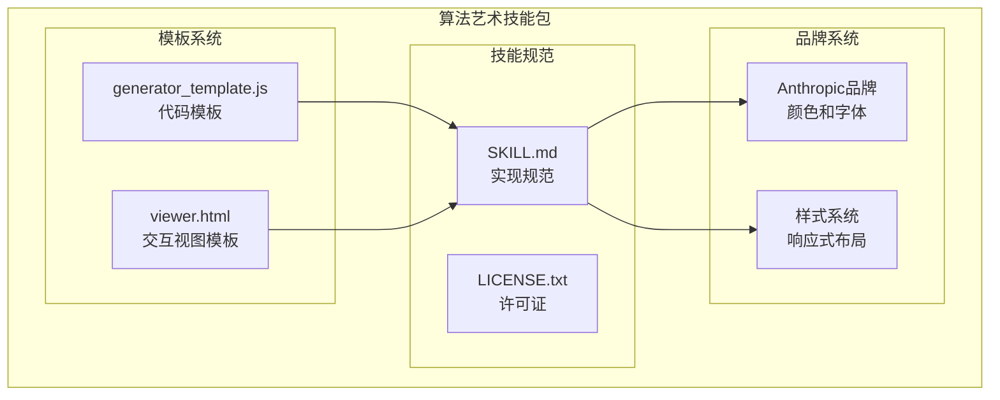
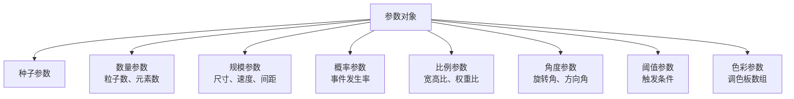
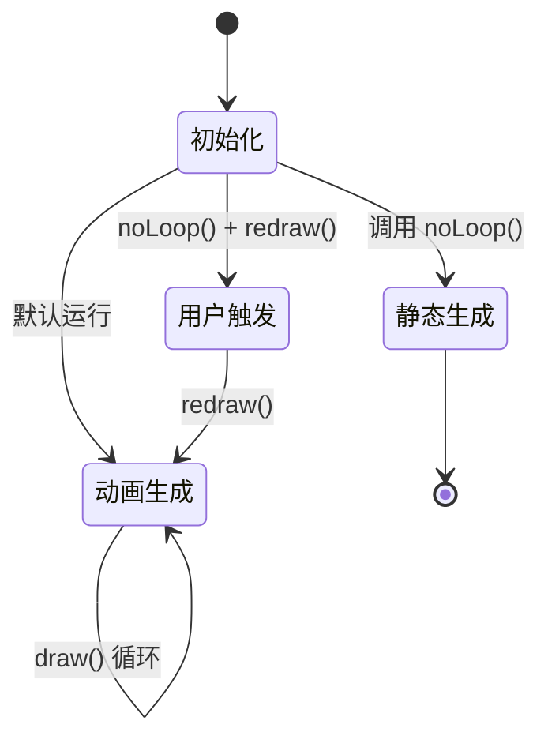
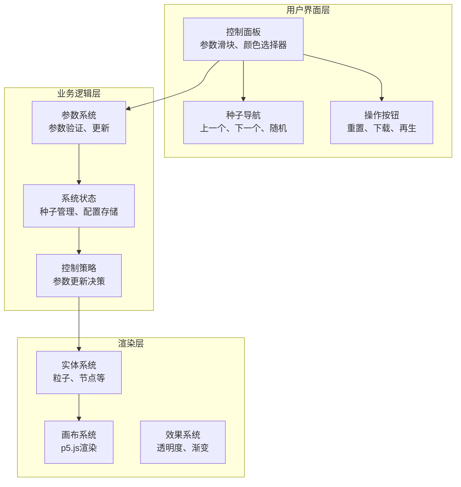
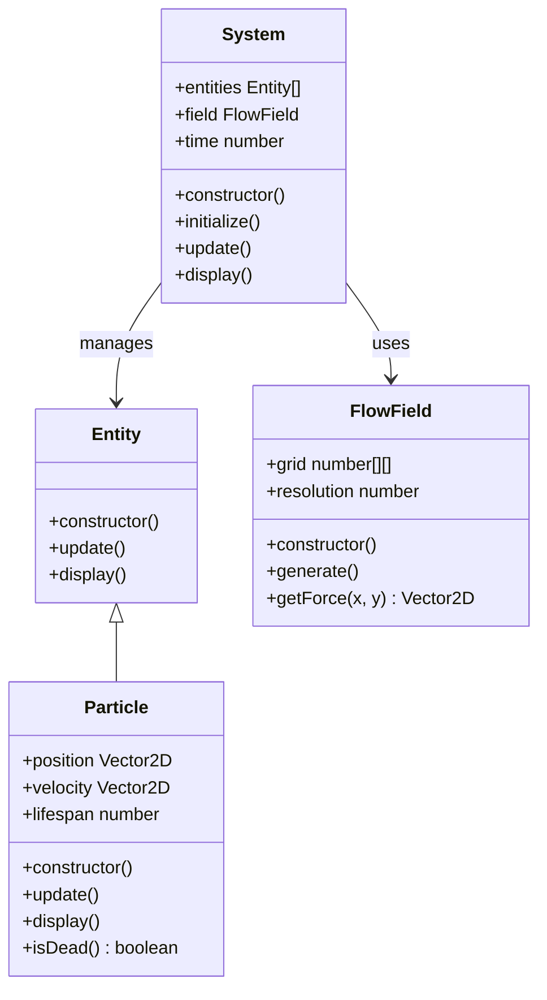
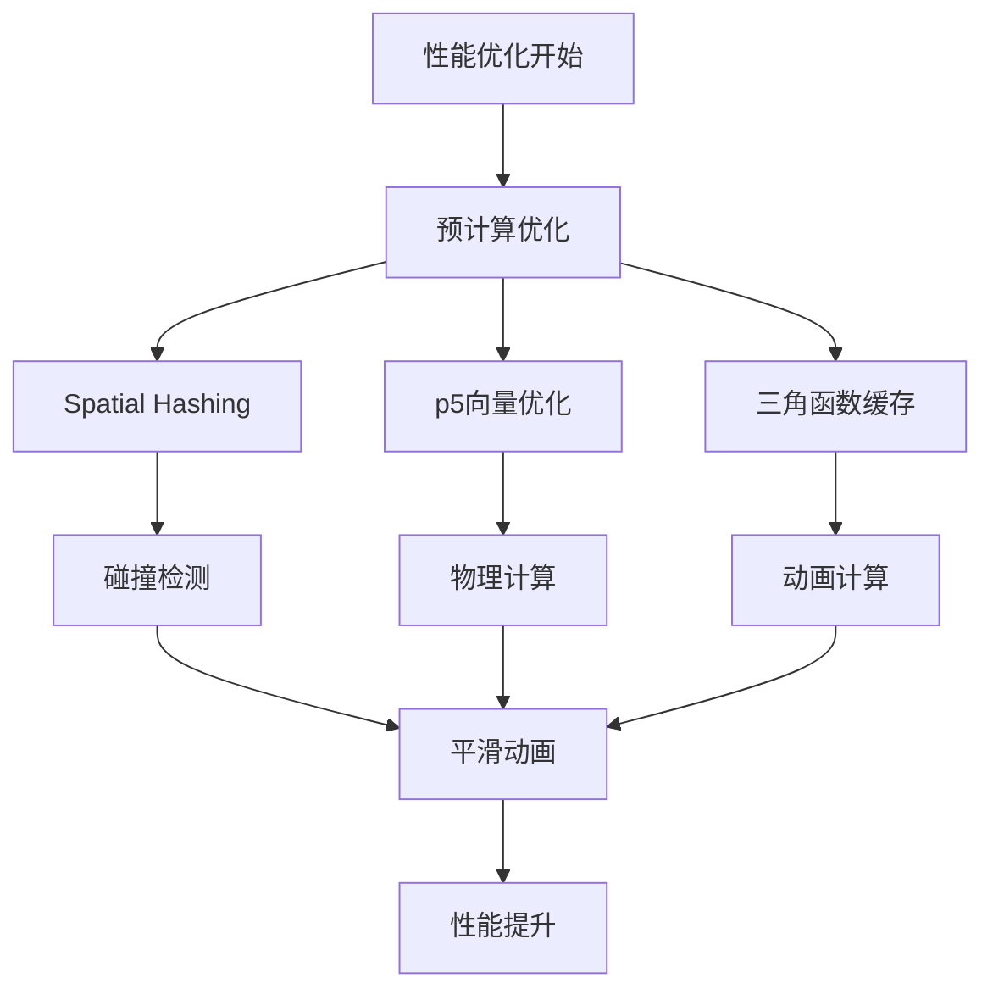
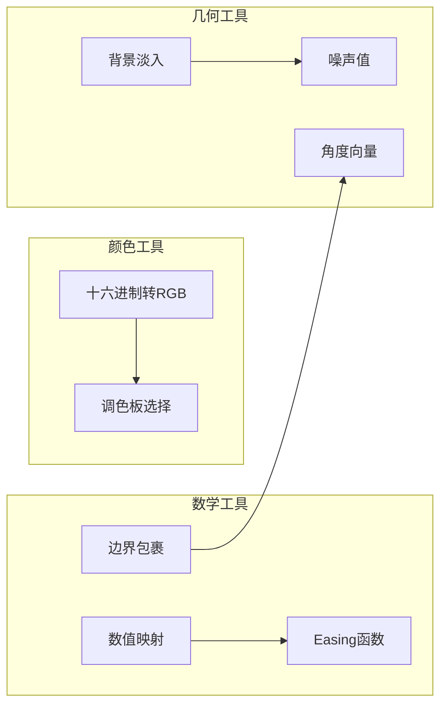
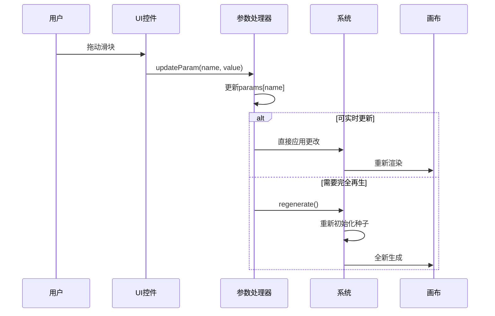
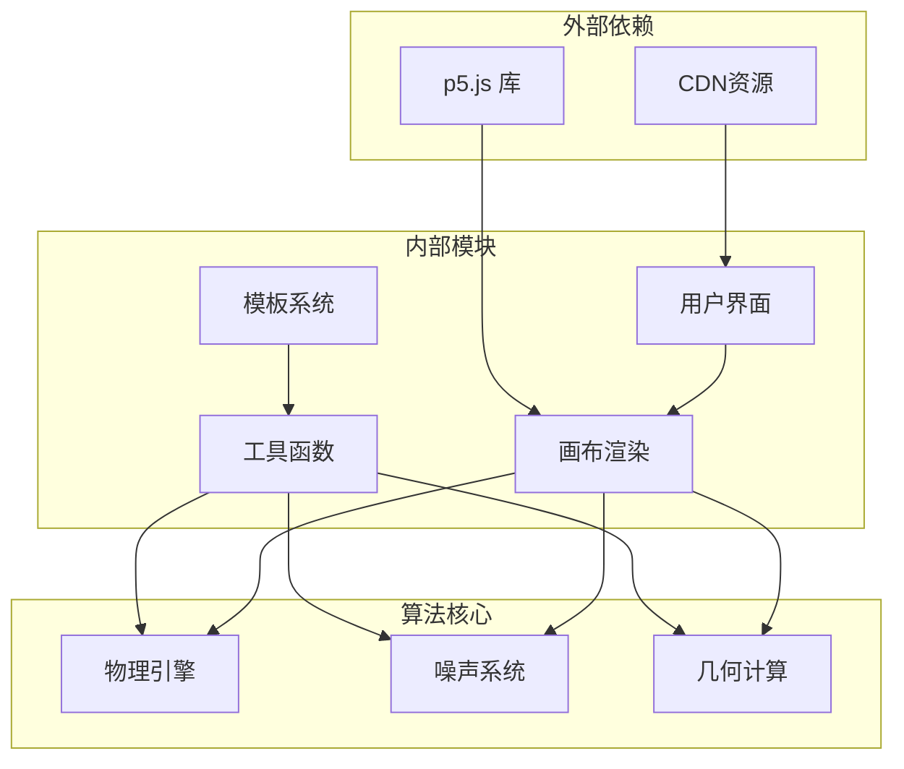
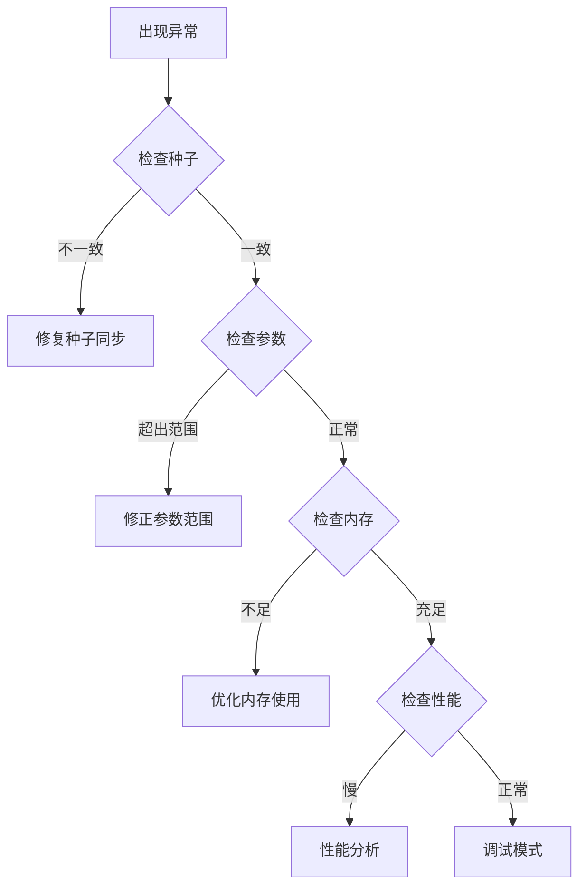

# p5.js 实现

<cite>
**本文档引用的文件**
- [generator_template.js](file://skills/skills/algorithmic-art/templates/generator_template.js)
- [viewer.html](file://skills/skills/algorithmic-art/templates/viewer.html)
- [SKILL.md](file://skills/skills/algorithmic-art/SKILL.md)
- [LICENSE.txt](file://skills/skills/algorithmic-art/LICENSE.txt)
</cite>

## 目录
1. [简介](#简介)
2. [项目结构](#项目结构)
3. [核心组件](#核心组件)
4. [架构概览](#架构概览)
5. [详细组件分析](#详细组件分析)
6. [依赖关系分析](#依赖关系分析)
7. [性能考虑](#性能考虑)
8. [故障排除指南](#故障排除指南)
9. [结论](#结论)

## 简介

本文件详细阐述了如何将算法哲学转化为具体的p5.js代码实现。该实现遵循Art Blocks风格的可重现性原则，通过种子随机性和参数化设计，创造出既美观又可控的生成式艺术作品。

p5.js作为一种强大的创意编程工具，为算法艺术家提供了从概念到视觉实现的完整路径。本文档不仅介绍了技术实现细节，更重要的是展示了如何将抽象的算法美学理念转化为具体的代码结构和交互体验。

## 项目结构

该项目采用模块化的技能包结构，专门为算法艺术创作而设计：

**图表来源**
- [SKILL.md:1-10](file://skills/skills/algorithmic-art/SKILL.md#L1-L10)
- [generator_template.js:1-20](file://skills/skills/algorithmic-art/templates/generator_template.js#L1-L20)
- [viewer.html:18-330](file://skills/skills/algorithmic-art/templates/viewer.html#L18-L330)

**章节来源**
- [SKILL.md:1-12](file://skills/skills/algorithmic-art/SKILL.md#L1-L12)
- [generator_template.js:15-50](file://skills/skills/algorithmic-art/templates/generator_template.js#L15-L50)
- [viewer.html:18-599](file://skills/skills/algorithmic-art/templates/viewer.html#L18-L599)

## 核心组件

### 参数组织系统

所有可调参数都集中在一个参数对象中，这种设计提供了以下优势：

- **统一管理**：便于连接UI控件、重置默认值、序列化保存配置
- **易于探索**：参数化设计支持快速实验和迭代
- **可重现性**：完整的参数状态确保相同种子产生相同结果

参数结构设计遵循"数量、规模、概率、比例、角度、阈值"等维度：

**图表来源**
- [generator_template.js:24-36](file://skills/skills/algorithmic-art/templates/generator_template.js#L24-L36)

### 种子随机性系统

可重现性是生成式艺术的核心要求。系统通过以下机制确保输出的一致性：

- **随机种子**：`randomSeed(seed)`确保所有随机数生成器使用相同的种子
- **噪声种子**：`noiseSeed(seed)`确保Perlin噪声场的确定性
- **初始化流程**：在setup阶段优先初始化种子系统

**章节来源**
- [generator_template.js:39-47](file://skills/skills/algorithmic-art/templates/generator_template.js#L39-L47)
- [viewer.html:475-479](file://skills/skills/algorithmic-art/templates/viewer.html#L475-L479)

### p5.js生命周期管理

标准的p5.js结构提供了三种执行模式：

**图表来源**
- [generator_template.js:53-84](file://skills/skills/algorithmic-art/templates/generator_template.js#L53-L84)

**章节来源**
- [generator_template.js:50-84](file://skills/skills/algorithmic-art/templates/generator_template.js#L50-L84)

## 架构概览

整个系统采用分层架构设计，确保职责分离和代码复用：

**图表来源**
- [viewer.html:332-438](file://skills/skills/algorithmic-art/templates/viewer.html#L332-L438)
- [SKILL.md:220-305](file://skills/skills/algorithmic-art/SKILL.md#L220-L305)

## 详细组件分析

### 类结构系统

当算法涉及多个实体时，使用面向对象的设计模式：

**图表来源**
- [generator_template.js:92-110](file://skills/skills/algorithmic-art/templates/generator_template.js#L92-L110)

**章节来源**
- [generator_template.js:87-110](file://skills/skills/algorithmic-art/templates/generator_template.js#L87-L110)

### 性能优化策略

针对大规模粒子系统的性能优化：

**图表来源**
- [generator_template.js:116-126](file://skills/skills/algorithmic-art/templates/generator_template.js#L116-L126)

**章节来源**
- [generator_template.js:113-126](file://skills/skills/algorithmic-art/templates/generator_template.js#L113-L126)

### 工具函数库

系统提供了一系列实用工具函数：

**图表来源**
- [generator_template.js:131-198](file://skills/skills/algorithmic-art/templates/generator_template.js#L131-L198)

**章节来源**
- [generator_template.js:128-198](file://skills/skills/algorithmic-art/templates/generator_template.js#L128-L198)

### 参数更新机制

动态参数更新系统支持实时调整：

**图表来源**
- [generator_template.js:165-176](file://skills/skills/algorithmic-art/templates/generator_template.js#L165-L176)

**章节来源**
- [generator_template.js:162-176](file://skills/skills/algorithmic-art/templates/generator_template.js#L162-L176)

## 依赖关系分析

系统采用松耦合的设计模式，确保各组件间的独立性：

**图表来源**
- [viewer.html:23-27](file://skills/skills/algorithmic-art/templates/viewer.html#L23-L27)
- [SKILL.md:386-405](file://skills/skills/algorithmic-art/SKILL.md#L386-L405)

**章节来源**
- [SKILL.md:386-405](file://skills/skills/algorithmic-art/SKILL.md#L386-L405)

## 性能考虑

### 帧率优化

为了达到流畅的60fps体验，系统采用了多项优化策略：

- **循环节流**：合理控制每帧处理的对象数量
- **计算简化**：避免昂贵的数学运算，使用近似算法
- **内存管理**：及时释放不再使用的对象和数组
- **渲染优化**：批量绘制减少状态切换开销

### 内存管理

对于大规模粒子系统，内存管理至关重要：

- **对象池**：重用粒子对象而非频繁创建销毁
- **数据压缩**：使用紧凑的数据结构存储位置和状态
- **垃圾回收**：定期清理无用引用避免内存泄漏
- **渐进加载**：分批生成和渲染大量元素

## 故障排除指南

### 常见问题诊断

### 调试技巧

- **参数可视化**：添加参数显示面板监控实时变化
- **性能监控**：集成帧率计数器和内存使用统计
- **断点调试**：在关键函数设置断点观察状态变化
- **日志记录**：记录重要事件和状态转换

**章节来源**
- [SKILL.md:201-210](file://skills/skills/algorithmic-art/SKILL.md#L201-L210)

## 结论

本p5.js实现系统成功地将算法哲学转化为可执行的代码结构，通过以下关键要素实现了高质量的生成式艺术创作：

### 技术成就

1. **可重现性保证**：通过种子随机性确保相同输入产生相同输出
2. **参数化设计**：灵活的参数系统支持深度探索和定制
3. **性能优化**：针对大规模场景的优化策略确保流畅运行
4. **交互友好**：直观的用户界面降低创作门槛

### 创作指导

根据不同算法哲学类型，推荐的实现策略：

- **有机涌现**：关注元素积累和相互作用，使用渐进式生成
- **数学美感**：强调几何关系和精确计算，追求对称性和比例
- **受控混沌**：在随机性中寻找秩序，通过阈值和约束控制变化

### 最佳实践

1. **保持代码整洁**：清晰的函数命名和注释
2. **注重用户体验**：直观的参数控制和即时反馈
3. **确保可扩展性**：模块化设计便于功能扩展
4. **重视性能表现**：平衡视觉效果和执行效率

该系统为算法艺术家提供了一个坚实的基础，使他们能够专注于创意表达而非技术实现细节，真正实现"算法即艺术"的理念。