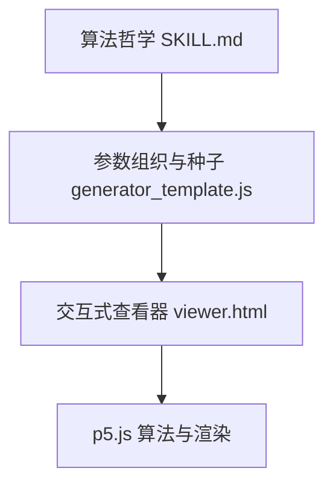
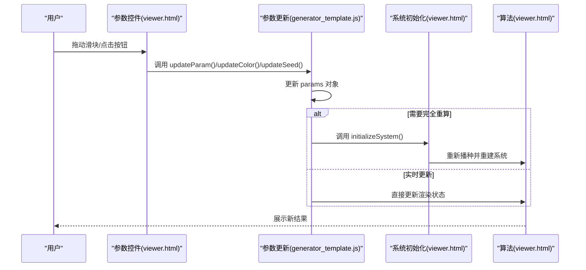
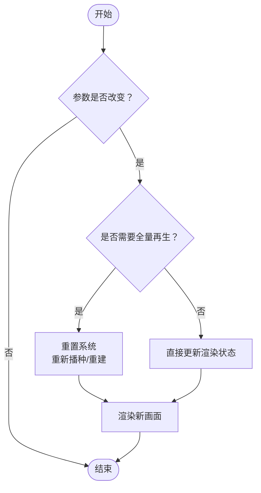
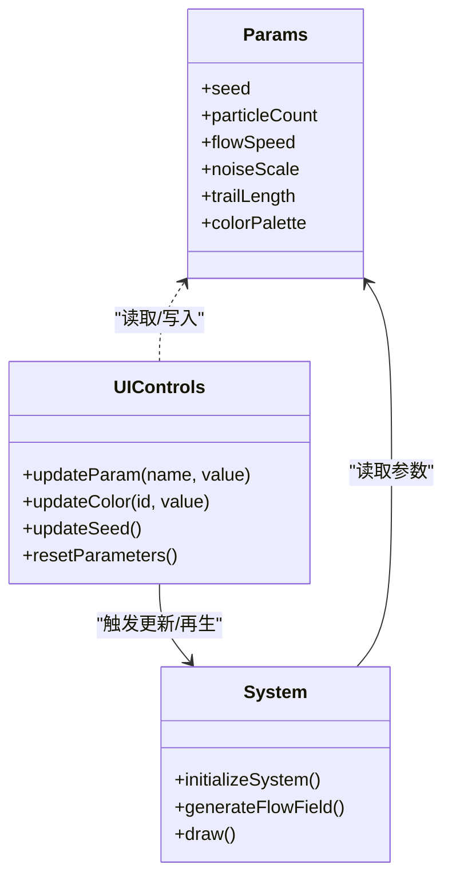
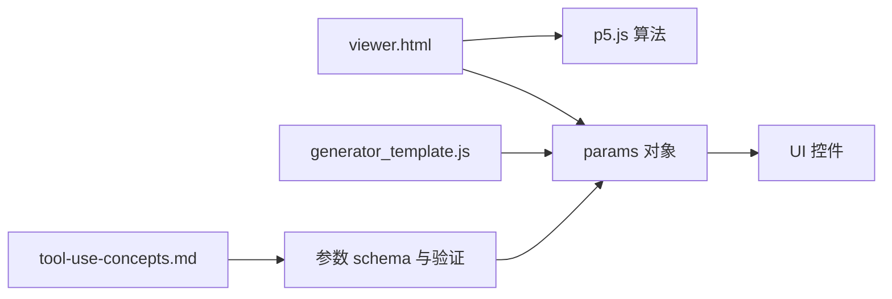

# 参数设计

<cite>
**本文引用的文件**
- [SKILL.md](file://skills/skills/algorithmic-art/SKILL.md)
- [generator_template.js](file://skills/skills/algorithmic-art/templates/generator_template.js)
- [viewer.html](file://skills/skills/algorithmic-art/templates/viewer.html)
- [tool-use-concepts.md](file://skills/skills/claude-api/shared/tool-use-concepts.md)
</cite>

## 目录
1. [引言](#引言)
2. [项目结构](#项目结构)
3. [核心组件](#核心组件)
4. [架构总览](#架构总览)
5. [详细组件分析](#详细组件分析)
6. [依赖关系分析](#依赖关系分析)
7. [性能考量](#性能考量)
8. [故障排查指南](#故障排查指南)
9. [结论](#结论)
10. [附录](#附录)

## 引言
本文件围绕“参数设计系统”进行系统化说明，目标是帮助开发者基于算法哲学构建可探索、可复现、稳定的参数体系。文档聚焦于五个核心维度：数量（quantities）、尺度（scales）、概率（probabilities）、比例（ratios）与角度（angles），并结合仓库中的交互式生成艺术模板，给出参数命名最佳实践、范围与步长设置原则、参数类型选择策略以及参数验证与约束机制的实现建议。这些原则既适用于 p5.js 生成艺术，也可迁移到其他算法与工具参数设计中。

## 项目结构
该仓库中与参数设计直接相关的核心资源位于 algorithmic-art 技能目录：
- SKILL.md：定义了参数组织、种子随机性、参数结构与 UI 控件的总体要求与范式
- templates/generator_template.js：展示了参数对象组织、种子初始化、常用工具函数与参数更新流程
- templates/viewer.html：提供了完整的前端 UI 结构与参数控件示例（滑块、颜色选择器、种子导航等）

图表来源
- [SKILL.md:143-159](file://skills/skills/algorithmic-art/SKILL.md#L143-L159)
- [generator_template.js:24-47](file://skills/skills/algorithmic-art/templates/generator_template.js#L24-L47)
- [viewer.html:440-599](file://skills/skills/algorithmic-art/templates/viewer.html#L440-L599)

章节来源
- [SKILL.md:1-405](file://skills/skills/algorithmic-art/SKILL.md#L1-L405)
- [generator_template.js:1-223](file://skills/skills/algorithmic-art/templates/generator_template.js#L1-L223)
- [viewer.html:1-599](file://skills/skills/algorithmic-art/templates/viewer.html#L1-L599)

## 核心组件
- 参数对象（params）：集中存放所有可调参数，便于 UI 绑定、重置与序列化
- 种子控制：固定随机性以保证可复现输出
- UI 控件：滑块（数值）、颜色选择器（调色板）、种子导航按钮、重置按钮
- 参数更新与再生：根据参数变化决定是否实时更新或需要重新初始化系统

章节来源
- [SKILL.md:143-159](file://skills/skills/algorithmic-art/SKILL.md#L143-L159)
- [generator_template.js:24-47](file://skills/skills/algorithmic-art/templates/generator_template.js#L24-L47)
- [viewer.html:445-591](file://skills/skills/algorithmic-art/templates/viewer.html#L445-L591)

## 架构总览
参数设计在前端与算法层之间形成闭环：前端通过控件更新 params，算法读取 params 并执行；当参数变化较大时触发系统重初始化；种子贯穿始终以保证可复现性。

图表来源
- [viewer.html:522-591](file://skills/skills/algorithmic-art/templates/viewer.html#L522-L591)
- [generator_template.js:165-176](file://skills/skills/algorithmic-art/templates/generator_template.js#L165-L176)

## 详细组件分析

### 参数维度与哲学映射
- 数量（quantities）：粒子数、网格单元数、采样点数等。应提供合理上下限与步长，避免过小导致无意义或过大导致性能问题。
- 尺度（scales）：尺寸、速度、间距、分辨率等。需考虑画布与算法复杂度的平衡。
- 概率（probabilities）：事件发生概率、阈值触发等。应限制在 [0,1] 区间，并提供直观步长。
- 比例（ratios）：不同组分的比例、衰减因子等。建议使用整数或简单分数，便于理解与调整。
- 角度（angles）：方向、旋转、相位等。通常以弧度或度数表示，注意周期性与对称性。

章节来源
- [SKILL.md:151-158](file://skills/skills/algorithmic-art/SKILL.md#L151-L158)

### 参数命名最佳实践
- 使用描述性语义：名称应直接反映参数的作用与影响（如 particleCount、flowSpeed、noiseScale）
- 避免缩写：除非约定俗成，否则尽量使用完整单词
- 保持一致性：同一类参数采用统一前缀或后缀（如 trailLength、trailOpacity）
- 与算法哲学一致：参数名应体现算法本质（如 fieldStrength、phaseShift）

章节来源
- [SKILL.md:147-159](file://skills/skills/algorithmic-art/SKILL.md#L147-L159)

### 参数范围与步长设置原则
- 最小值：保证算法有意义运行（如粒子数至少为 1）
- 最大值：考虑性能与内存上限（如粒子数不超过 50000）
- 默认值：从“中性”出发，兼顾视觉效果与性能（如噪声尺度 0.005）
- 步长：优先使用常见步进（0.1、0.01、1、10），使用户能快速定位到关键区间
- 参考示例（来自模板）：
  - 粒子数：min=1000, max=10000, step=500, default=5000
  - 流速：min=0.1, max=2.0, step=0.1, default=0.5
  - 噪声尺度：min=0.001, max=0.02, step=0.001, default=0.005
  - 尾迹长度：min=2, max=20, step=1, default=8

章节来源
- [viewer.html:354-389](file://skills/skills/algorithmic-art/templates/viewer.html#L354-L389)

### 参数类型选择策略
- 数值滑块：适合连续变量（如速度、尺度、尾迹长度）
- 颜色选择器：适合调色板颜色（如主色、辅色、强调色）
- 下拉菜单：适合离散枚举（如模式切换、采样策略）
- 布尔开关：适合二元行为（如启用/禁用某特效）
- 文本输入：适合种子、路径等字符串参数（注意校验与长度限制）

章节来源
- [viewer.html:391-421](file://skills/skills/algorithmic-art/templates/viewer.html#L391-L421)
- [tool-use-concepts.md:35-42](file://skills/skills/claude-api/shared/tool-use-concepts.md#L35-L42)

### 参数验证与约束机制
- 输入范围校验：在 UI 层与算法层双重校验，防止越界
- 类型校验：确保数值型参数为数字，颜色为合法十六进制
- 默认回退：非法输入时回退到默认值并提示
- 互斥与依赖：对存在互斥或依赖关系的参数进行联动校验
- 示例（来自模板）：
  - 种子输入：仅接受正整数，无效时回显当前种子
  - 重置功能：一键恢复默认参数与颜色

章节来源
- [viewer.html:538-548](file://skills/skills/algorithmic-art/templates/viewer.html#L538-L548)
- [viewer.html:568-591](file://skills/skills/algorithmic-art/templates/viewer.html#L568-L591)

### 参数更新与再生流程
- 实时更新：适合非结构性参数（如颜色、尾迹长度）
- 全量再生：适合结构性参数（如粒子数、网格分辨率）或种子变更
- 重置：保留默认参数副本，一键恢复

图表来源
- [generator_template.js:165-176](file://skills/skills/algorithmic-art/templates/generator_template.js#L165-L176)
- [viewer.html:522-591](file://skills/skills/algorithmic-art/templates/viewer.html#L522-L591)

### 类图：参数与控件关系

图表来源
- [viewer.html:445-591](file://skills/skills/algorithmic-art/templates/viewer.html#L445-L591)
- [generator_template.js:24-47](file://skills/skills/algorithmic-art/templates/generator_template.js#L24-L47)

## 依赖关系分析
- viewer.html 依赖 generator_template.js 的参数组织与工具函数
- viewer.html 内部包含 p5.js 与自定义算法，参数通过 params 对象驱动
- 工具使用概念文档（tool-use-concepts.md）提供了参数 schema 设计与验证的通用思路，可迁移至参数设计中

图表来源
- [viewer.html:440-599](file://skills/skills/algorithmic-art/templates/viewer.html#L440-L599)
- [generator_template.js:1-223](file://skills/skills/algorithmic-art/templates/generator_template.js#L1-L223)
- [tool-use-concepts.md:11-42](file://skills/skills/claude-api/shared/tool-use-concepts.md#L11-L42)

章节来源
- [viewer.html:1-599](file://skills/skills/algorithmic-art/templates/viewer.html#L1-L599)
- [generator_template.js:1-223](file://skills/skills/algorithmic-art/templates/generator_template.js#L1-L223)
- [tool-use-concepts.md:1-306](file://skills/skills/claude-api/shared/tool-use-concepts.md#L1-L306)

## 性能考量
- 参数规模与性能权衡：粒子数、网格分辨率等直接影响计算复杂度与内存占用
- 渐进式探索：先调整低开销参数（如尾迹长度），再调整高开销参数（如粒子数）
- 缓存与预计算：对重复计算的结果进行缓存，减少每帧开销
- 帧率与渲染：动画场景下保持稳定帧率，必要时降低参数或简化算法

## 故障排查指南
- 参数越界：检查 min/max 设置与步长，确保覆盖常用区间
- 颜色异常：确认颜色值格式正确（十六进制），并在非法时回退默认
- 种子无效：仅接受正整数，无效输入时回显当前种子并提示
- 重置不生效：确认 defaultParams 与 resetParameters 的同步逻辑

章节来源
- [viewer.html:538-548](file://skills/skills/algorithmic-art/templates/viewer.html#L538-L548)
- [viewer.html:568-591](file://skills/skills/algorithmic-art/templates/viewer.html#L568-L591)

## 结论
参数设计应以算法哲学为指导，围绕数量、尺度、概率、比例与角度五大维度展开，通过统一的参数对象、严谨的命名规范、合理的范围与步长、恰当的控件类型以及完善的验证与约束机制，实现可探索、可复现且稳定的参数体系。结合模板中的实践，可在 p5.js 生成艺术中高效落地参数设计系统，并推广到其他算法与工具参数设计场景。

## 附录
- 参考示例参数（来自模板）：
  - 粒子数：min=1000, max=10000, step=500, default=5000
  - 流速：min=0.1, max=2.0, step=0.1, default=0.5
  - 噪声尺度：min=0.001, max=0.02, step=0.001, default=0.005
  - 尾迹长度：min=2, max=20, step=1, default=8

章节来源
- [viewer.html:354-389](file://skills/skills/algorithmic-art/templates/viewer.html#L354-L389)