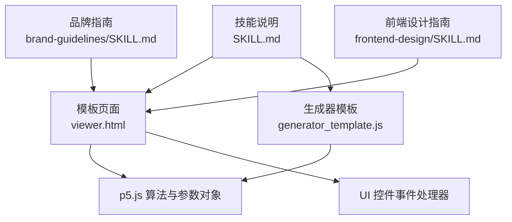
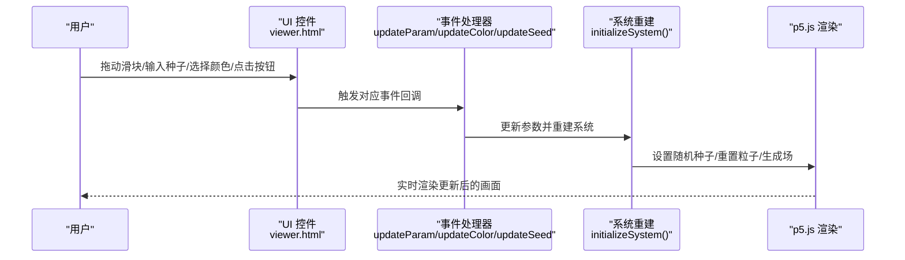
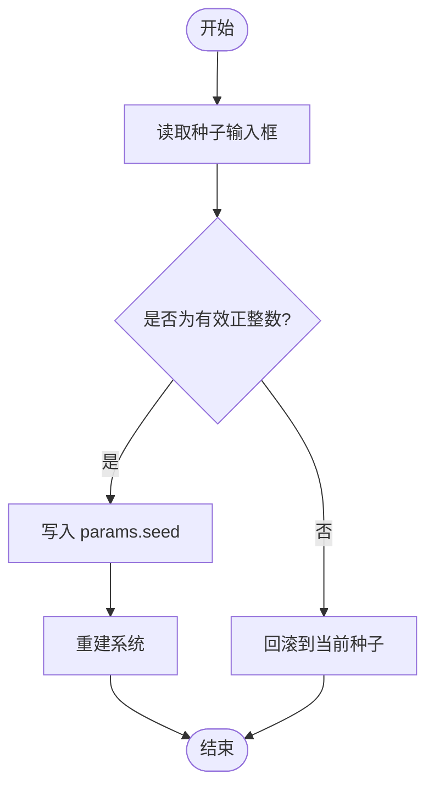
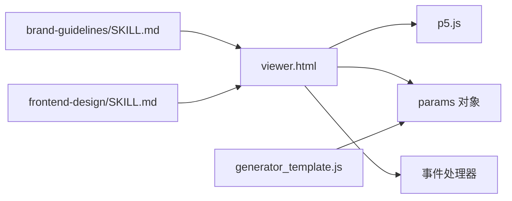

# 用户界面控制

<cite>
**本文引用的文件**
- [viewer.html](file://skills/skills/algorithmic-art/templates/viewer.html)
- [generator_template.js](file://skills/skills/algorithmic-art/templates/generator_template.js)
- [SKILL.md](file://skills/skills/algorithmic-art/SKILL.md)
- [brand-guidelines/SKILL.md](file://skills/skills/brand-guidelines/SKILL.md)
- [frontend-design/SKILL.md](file://skills/skills/frontend-design/SKILL.md)
</cite>

## 目录
1. [简介](#简介)
2. [项目结构](#项目结构)
3. [核心组件](#核心组件)
4. [架构总览](#架构总览)
5. [详细组件分析](#详细组件分析)
6. [依赖关系分析](#依赖关系分析)
7. [性能考量](#性能考量)
8. [故障排查指南](#故障排查指南)
9. [结论](#结论)
10. [附录](#附录)

## 简介
本文件面向“用户界面控制系统”的开发需求，围绕基于模板文件构建交互式参数控制界面展开，重点覆盖以下方面：
- 固定的UI元素结构：种子控制区域、参数控制区域、颜色控制区域、操作按钮区域
- 参数控件实现：滑块、输入框、颜色选择器、按钮的创建与事件处理
- 实时更新机制：参数变化时算法即时响应
- 品牌一致性：遵循Anthropic品牌风格（色彩、字体、布局）
- 用户体验优化：易用性、反馈机制、错误处理
- 种子导航：显示、切换、跳转与批量生成

该系统以HTML模板为基础，内嵌p5.js算法与UI控制逻辑，形成自包含的单页交互式产物，便于在Claude或浏览器中直接运行。

## 项目结构
本技能的核心由三部分组成：
- 模板页面：固定布局与样式，定义种子导航、参数、颜色与动作区
- 生成器模板：p5.js最佳实践与参数组织原则
- 技能说明文档：使用模板的规范、固定/可变部分、实现要求

图表来源
- [viewer.html:18-599](file://skills/skills/algorithmic-art/templates/viewer.html#L18-L599)
- [generator_template.js:1-223](file://skills/skills/algorithmic-art/templates/generator_template.js#L1-L223)
- [SKILL.md:1-405](file://skills/skills/algorithmic-art/SKILL.md#L1-L405)
- [brand-guidelines/SKILL.md:1-67](file://skills/skills/brand-guidelines/SKILL.md#L1-L67)
- [frontend-design/SKILL.md:1-43](file://skills/skills/frontend-design/SKILL.md#L1-L43)

章节来源
- [SKILL.md:101-128](file://skills/skills/algorithmic-art/SKILL.md#L101-L128)
- [viewer.html:18-599](file://skills/skills/algorithmic-art/templates/viewer.html#L18-L599)

## 核心组件
- 参数对象与初始化
  - 在模板中定义参数对象，包含种子、数值参数、颜色调色板等
  - 初始化函数负责设置随机种子，保证可重现性
- UI 控件与事件
  - 种子控制：数字输入、上一个/下一个、随机、跳转
  - 参数控制：滑块（范围输入）+ 数值显示
  - 颜色控制：颜色选择器 + 十六进制值显示
  - 动作按钮：重置、下载等
- 系统重建与渲染
  - 当参数变化时，通过重建系统（重新播种、重置粒子/场）实现即时更新
  - 渲染层与更新层分离，避免重复计算

章节来源
- [viewer.html:445-452](file://skills/skills/algorithmic-art/templates/viewer.html#L445-L452)
- [viewer.html:475-497](file://skills/skills/algorithmic-art/templates/viewer.html#L475-L497)
- [generator_template.js:24-47](file://skills/skills/algorithmic-art/templates/generator_template.js#L24-L47)

## 架构总览
下图展示从用户交互到算法更新的端到端流程：

图表来源
- [viewer.html:521-566](file://skills/skills/algorithmic-art/templates/viewer.html#L521-L566)
- [viewer.html:475-497](file://skills/skills/algorithmic-art/templates/viewer.html#L475-L497)
- [generator_template.js:43-47](file://skills/skills/algorithmic-art/templates/generator_template.js#L43-L47)

## 详细组件分析

### 固定UI结构与职责
- 种子控制区域
  - 显示当前种子、输入框用于跳转、Prev/Next/Random/Regenerate等按钮
  - 负责可重现性与探索体验
- 参数控制区域
  - 滑块控件 + 数值显示，支持步进与范围约束
  - 支持多参数并行调整
- 颜色控制区域
  - 颜色选择器 + 十六进制值显示，便于快速调色
- 操作按钮区域
  - 重置默认参数、下载图片等

章节来源
- [viewer.html:339-429](file://skills/skills/algorithmic-art/templates/viewer.html#L339-L429)

### 参数控件实现与事件处理
- 滑块与数值显示
  - 使用范围输入控件绑定 oninput 事件，实时更新参数与数值标签
  - 数值显示随滑块同步变化，提供即时反馈
- 颜色选择器
  - 使用颜色输入控件绑定 onchange 事件，更新调色板并触发重建
- 输入框与按钮
  - 种子输入框绑定 onchange；Prev/Next/Random/Reset/Regenerate 绑定点击事件
  - 所有事件最终调用重建函数以应用新参数

章节来源
- [viewer.html:354-389](file://skills/skills/algorithmic-art/templates/viewer.html#L354-L389)
- [viewer.html:395-421](file://skills/skills/algorithmic-art/templates/viewer.html#L395-L421)
- [viewer.html:521-566](file://skills/skills/algorithmic-art/templates/viewer.html#L521-L566)

### 实时更新机制
- 参数变更路径
  - updateParam/updateColor 接收控件值，更新 params 对象
  - initializeSystem 调用随机种子设置与系统重建
  - p5.js 重新执行渲染循环，呈现新结果
- 性能与一致性
  - 通过固定种子确保相同参数产生一致输出
  - 将昂贵计算放在重建阶段，避免每帧重复

章节来源
- [viewer.html:521-528](file://skills/skills/algorithmic-art/templates/viewer.html#L521-L528)
- [viewer.html:475-497](file://skills/skills/algorithmic-art/templates/viewer.html#L475-L497)
- [generator_template.js:165-176](file://skills/skills/algorithmic-art/templates/generator_template.js#L165-L176)

### 种子导航功能实现
- 显示与校验
  - 输入框显示当前种子；若输入非法则回滚到当前值
- 切换与跳转
  - 上一个/下一个按钮递增/递减种子
  - 随机按钮生成 1-999999 的随机种子
  - 跳转输入框允许直接输入目标种子
- 批量生成
  - 可扩展为“生成100个变体”功能，按种子序列批量导出

图表来源
- [viewer.html:538-548](file://skills/skills/algorithmic-art/templates/viewer.html#L538-L548)

章节来源
- [viewer.html:538-566](file://skills/skills/algorithmic-art/templates/viewer.html#L538-L566)

### 品牌风格与样式最佳实践
- 色彩体系
  - 主色：深灰、浅灰、米白
  - 强调色：橙、蓝、绿
- 字体体系
  - 标题：Poppins
  - 正文：Lora
- 布局与阴影
  - 侧边栏固定宽度，主画布自适应
  - 半透明背景与模糊滤镜增强层次感
  - 按钮悬停/激活状态提供微交互反馈
- 响应式设计
  - 移动端堆叠布局，侧边栏宽度自适应

章节来源
- [brand-guidelines/SKILL.md:17-67](file://skills/skills/brand-guidelines/SKILL.md#L17-L67)
- [viewer.html:27-329](file://skills/skills/algorithmic-art/templates/viewer.html#L27-L329)

### 用户体验优化策略
- 易用性
  - 滑块与数值显示联动，避免用户记忆数值
  - 颜色选择器即时预览，十六进制值便于复制
  - 重置按钮一键恢复默认，降低试错成本
- 反馈机制
  - 加载提示与无动画过渡，避免闪烁
  - 按钮状态变化与阴影位移，强化交互感知
- 错误处理
  - 种子输入非法时自动回滚，避免崩溃
  - 参数范围外时限制边界，保证系统稳定

章节来源
- [viewer.html:538-548](file://skills/skills/algorithmic-art/templates/viewer.html#L538-L548)
- [viewer.html:568-591](file://skills/skills/algorithmic-art/templates/viewer.html#L568-L591)

## 依赖关系分析
- 模板依赖
  - viewer.html 依赖 p5.js CDN 提供的渲染能力
  - 内部脚本依赖 params 对象与事件处理器
- 生成器模板依赖
  - generator_template.js 提供参数组织、种子初始化、工具函数等通用模式
- 品牌与前端设计
  - brand-guidelines/SKILL.md 提供色彩与字体规范
  - frontend-design/SKILL.md 提供设计美学指导

图表来源
- [viewer.html:23-24](file://skills/skills/algorithmic-art/templates/viewer.html#L23-L24)
- [generator_template.js:24-47](file://skills/skills/algorithmic-art/templates/generator_template.js#L24-L47)
- [brand-guidelines/SKILL.md:17-67](file://skills/skills/brand-guidelines/SKILL.md#L17-L67)
- [frontend-design/SKILL.md:27-43](file://skills/skills/frontend-design/SKILL.md#L27-L43)

章节来源
- [SKILL.md:227-257](file://skills/skills/algorithmic-art/SKILL.md#L227-L257)
- [viewer.html:23-24](file://skills/skills/algorithmic-art/templates/viewer.html#L23-L24)

## 性能考量
- 参数更新粒度
  - 对于可实时更新的参数（如颜色），可在不重建系统的情况下刷新渲染
  - 对于影响初始状态的参数（如粒子数量、噪声尺度），采用重建方式保证一致性
- 渲染优化
  - 合理设置画布尺寸与帧率，避免过度计算
  - 使用透明背景叠加实现轨迹效果，减少全屏重绘
- 种子与随机性
  - 仅在重建阶段设置随机种子，避免频繁播种带来的抖动

章节来源
- [generator_template.js:165-176](file://skills/skills/algorithmic-art/templates/generator_template.js#L165-L176)
- [viewer.html:475-497](file://skills/skills/algorithmic-art/templates/viewer.html#L475-L497)

## 故障排查指南
- 种子无效
  - 现象：输入非法种子后画面未更新
  - 处理：检查输入合法性判断与回滚逻辑
- 参数未生效
  - 现象：拖动滑块后画面不变
  - 处理：确认事件回调是否正确更新 params，并触发重建
- 颜色不更新
  - 现象：颜色选择器更改后未反映到算法
  - 处理：检查颜色更新回调与调色板索引映射
- 响应式异常
  - 现象：移动端布局错乱
  - 处理：核对媒体查询与容器布局属性

章节来源
- [viewer.html:538-548](file://skills/skills/algorithmic-art/templates/viewer.html#L538-L548)
- [viewer.html:521-528](file://skills/skills/algorithmic-art/templates/viewer.html#L521-L528)
- [viewer.html:315-328](file://skills/skills/algorithmic-art/templates/viewer.html#L315-L328)

## 结论
本UI控制系统以模板化方式实现了固定结构与高度可定制的参数控制，结合p5.js渲染引擎，提供了从种子导航到参数调节的完整交互闭环。通过严格的参数组织、事件驱动的实时更新与品牌一致的视觉设计，既保证了算法探索的灵活性，也确保了用户体验的流畅性与专业感。建议在实际实现中：
- 明确哪些参数适合实时更新，哪些需要重建
- 为复杂算法预留增量更新路径，平衡性能与一致性
- 严格遵循品牌指南，确保风格统一
- 为移动端提供更精细的交互细节与加载提示

## 附录
- 使用模板的步骤与要求
  - 必须以模板页面为起点，保留固定结构与品牌样式
  - 替换算法与参数定义，按需增删控件
  - 保持事件处理器与重建流程一致
- 参考实现位置
  - 参数对象与默认值：[viewer.html:445-452](file://skills/skills/algorithmic-art/templates/viewer.html#L445-L452)
  - 系统重建与随机种子：[viewer.html:475-497](file://skills/skills/algorithmic-art/templates/viewer.html#L475-L497)
  - 事件处理器与种子导航：[viewer.html:521-566](file://skills/skills/algorithmic-art/templates/viewer.html#L521-L566)
  - 通用参数更新与重建模式：[generator_template.js:165-176](file://skills/skills/algorithmic-art/templates/generator_template.js#L165-L176)