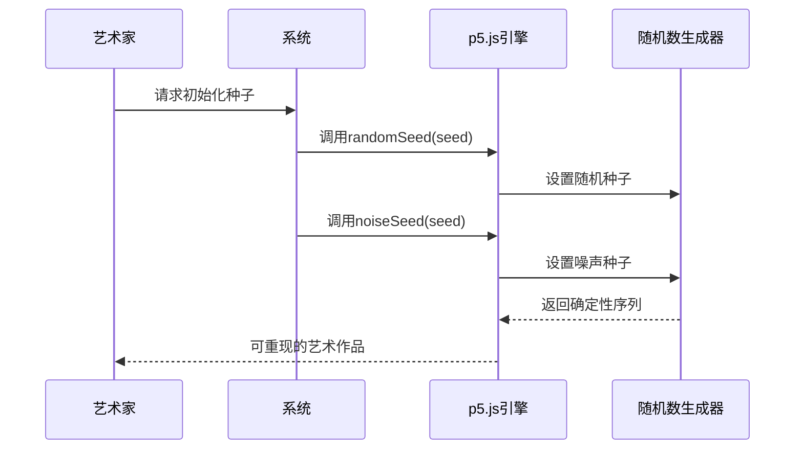
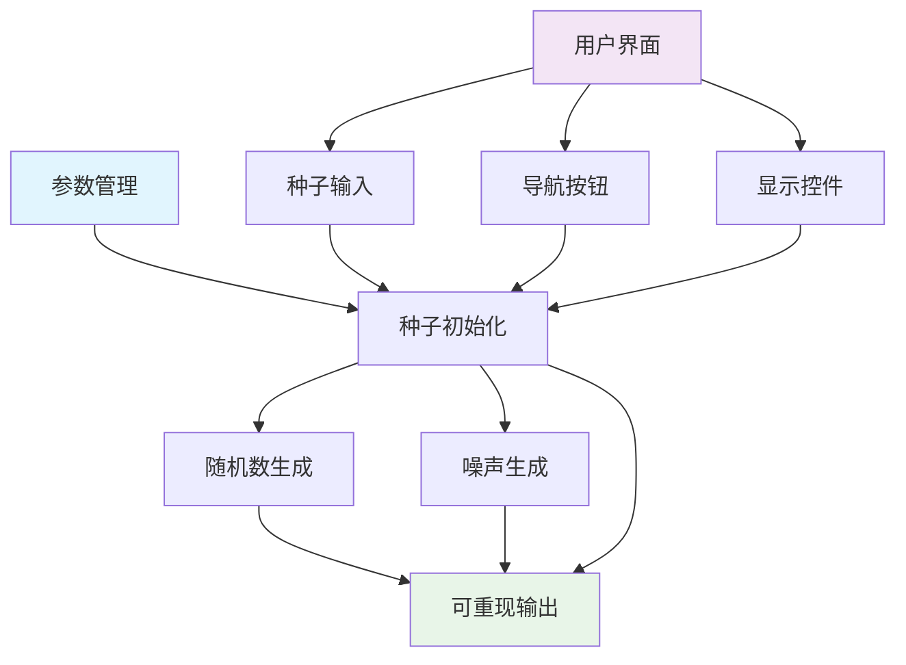
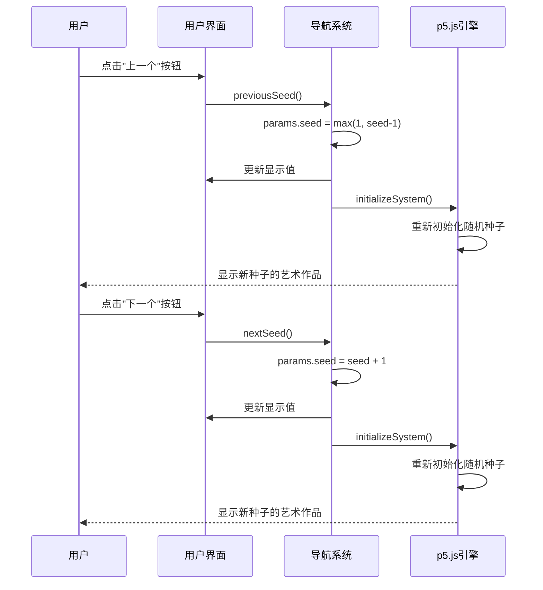
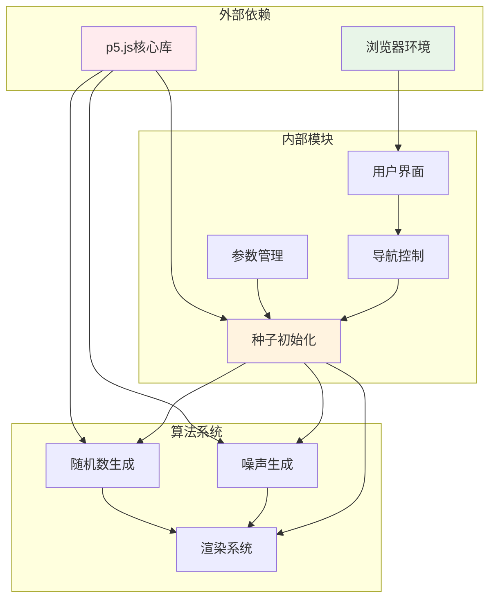

# 种子管理系统

<cite>
**本文档引用的文件**
- [generator_template.js](file://skills/skills/algorithmic-art/templates/generator_template.js)
- [viewer.html](file://skills/skills/algorithmic-art/templates/viewer.html)
- [SKILL.md](file://skills/skills/algorithmic-art/SKILL.md)
- [README.md](file://skills/README.md)
</cite>

## 目录
1. [简介](#简介)
2. [项目结构](#项目结构)
3. [核心组件](#核心组件)
4. [架构概览](#架构概览)
5. [详细组件分析](#详细组件分析)
6. [依赖关系分析](#依赖关系分析)
7. [性能考虑](#性能考虑)
8. [故障排除指南](#故障排除指南)
9. [结论](#结论)

## 简介

种子管理系统是算法艺术创作中的关键基础设施，它确保了p5.js生成式艺术作品的可重现性和一致性。该系统通过实现可预测的随机数生成，使艺术家能够精确控制和重复他们的创意过程。

本系统的核心价值在于：
- **可重现性**：相同的种子总是产生相同的艺术作品
- **版本控制**：通过种子编号进行作品管理和比较
- **交互探索**：提供种子导航功能，支持艺术家探索不同的创意变体
- **算法艺术完整性**：确保生成式艺术的数学严谨性和美学一致性

## 项目结构

种子管理系统由三个主要组件构成：

```mermaid
graph TB
subgraph "算法艺术技能"
A[templates/] --> B[generator_template.js]
A --> C[viewer.html]
D[SKILL.md] --> E[系统文档]
end
subgraph "核心功能模块"
F[种子初始化] --> G[randomSeed()]
F --> H[noiseSeed()]
I[种子导航] --> J[上一个种子]
I --> K[下一个种子]
I --> L[随机种子]
I --> M[指定种子输入]
end
B --> F
C --> I
C --> F
```

**图表来源**
- [generator_template.js:43-47](file://skills/skills/algorithmic-art/templates/generator_template.js#L43-L47)
- [viewer.html:538-566](file://skills/skills/algorithmic-art/templates/viewer.html#L538-L566)

**章节来源**
- [README.md:12-27](file://skills/README.md#L12-L27)
- [SKILL.md:1-405](file://skills/skills/algorithmic-art/SKILL.md#L1-L405)

## 核心组件

### 随机种子初始化系统

系统的核心是`initializeSeed()`函数，它负责设置p5.js的随机数生成器：



**图表来源**
- [generator_template.js:43-47](file://skills/skills/algorithmic-art/templates/generator_template.js#L43-L47)
- [viewer.html:475-479](file://skills/skills/algorithmic-art/templates/viewer.html#L475-L479)

### 种子导航界面

系统提供了完整的种子导航功能，包括：

- **数字输入控件**：允许直接输入种子值
- **上一个/下一个按钮**：顺序浏览相邻种子
- **随机按钮**：生成新的随机种子
- **显示功能**：实时更新当前种子状态

**章节来源**
- [generator_template.js:24-36](file://skills/skills/algorithmic-art/templates/generator_template.js#L24-L36)
- [viewer.html:342-347](file://skills/skills/algorithmic-art/templates/viewer.html#L342-L347)

## 架构概览

种子管理系统采用分层架构设计，确保了功能的模块化和可维护性：



**图表来源**
- [generator_template.js:165-176](file://skills/skills/algorithmic-art/templates/generator_template.js#L165-L176)
- [viewer.html:534-566](file://skills/skills/algorithmic-art/templates/viewer.html#L534-L566)

## 详细组件分析

### 种子初始化机制

#### 核心初始化函数

系统使用`initializeSeed()`函数作为统一的种子设置入口点：

```mermaid
flowchart TD
A[调用initializeSeed(seed)] --> B{验证种子参数}
B --> |有效| C[randomSeed(seed)]
B --> |有效| D[noiseSeed(seed)]
B --> |无效| E[返回错误]
C --> F[设置全局随机种子]
D --> G[设置噪声种子]
F --> H[所有后续随机调用确定性]
G --> H
H --> I[生成可重现的艺术作品]
```

**图表来源**
- [generator_template.js:43-47](file://skills/skills/algorithmic-art/templates/generator_template.js#L43-L47)

#### 参数组织结构

系统采用集中化的参数管理模式：

| 参数类别 | 示例 | 用途 |
|---------|------|------|
| 基础参数 | seed, particleCount | 控制艺术作品的基本属性 |
| 物理参数 | flowSpeed, noiseScale | 定义动态行为的物理特性 |
| 视觉参数 | trailLength, colorPalette | 调整视觉表现效果 |
| 性能参数 | scl, resolution | 优化渲染性能 |

**章节来源**
- [generator_template.js:24-36](file://skills/skills/algorithmic-art/templates/generator_template.js#L24-L36)
- [viewer.html:445-452](file://skills/skills/algorithmic-art/templates/viewer.html#L445-L452)

### 种子导航功能实现

#### 上一个/下一个种子导航

系统实现了连续的种子浏览功能：



**图表来源**
- [viewer.html:550-560](file://skills/skills/algorithmic-art/templates/viewer.html#L550-L560)

#### 随机种子生成功能

系统提供了智能的随机种子选择机制：

```mermaid
flowchart TD
A[用户点击"随机"按钮] --> B[生成随机种子]
B --> C[计算范围: 1 到 999999]
C --> D[Math.floor(Math.random() * 999999) + 1]
D --> E[更新params.seed]
E --> F[更新UI显示]
F --> G[initializeSystem()重新初始化]
G --> H[生成新的随机艺术作品]
```

**图表来源**
- [viewer.html:562-566](file://skills/skills/algorithmic-art/templates/viewer.html#L562-L566)

#### 指定种子输入功能

系统支持精确的种子控制：

```mermaid
flowchart TD
A[用户输入种子值] --> B[解析输入值]
B --> C{验证有效性}
C --> |有效且>0| D[更新params.seed]
C --> |无效或<=0| E[恢复原值]
D --> F[initializeSystem()重新初始化]
F --> G[生成对应种子的艺术作品]
E --> H[更新UI显示原值]
```

**图表来源**
- [viewer.html:538-548](file://skills/skills/algorithmic-art/templates/viewer.html#L538-L548)

**章节来源**
- [viewer.html:534-566](file://skills/skills/algorithmic-art/templates/viewer.html#L534-L566)

### 种子值选择策略

#### 固定种子策略

固定种子是最简单直接的方法，适用于需要严格控制的场景：

- **适用场景**：演示、教学、固定风格的艺术作品
- **种子值选择**：12345、999999等易于记忆的数值
- **优势**：完全可预测，便于调试和分享

#### 哈希种子策略

基于用户输入或其他数据生成的种子：

```mermaid
flowchart TD
A[获取输入数据] --> B[应用哈希算法]
B --> C[转换为整数种子]
C --> D[规范化范围]
D --> E[应用到randomSeed()和noiseSeed()]
E --> F[生成确定性输出]
```

#### 用户输入种子策略

允许用户直接控制种子值：

- **输入验证**：确保种子为正整数
- **范围限制**：通常建议1-999999范围
- **实时预览**：输入时即时显示效果

**章节来源**
- [SKILL.md:135-141](file://skills/skills/algorithmic-art/SKILL.md#L135-L141)
- [viewer.html:538-548](file://skills/skills/algorithmic-art/templates/viewer.html#L538-L548)

### 种子在算法艺术中的重要性

#### 版本控制和比较

种子系统为算法艺术提供了强大的版本管理能力：

- **作品标识**：每个种子对应唯一的作品版本
- **比较基准**：相同种子可在不同时间点复现
- **迭代跟踪**：通过种子序列追踪创意演进

#### 艺术创作流程集成


#### 复杂度管理

种子系统帮助管理算法艺术的复杂性：

- **状态简化**：通过单一参数控制整个系统状态
- **调试便利**：快速定位问题和重现bug
- **分享传播**：通过种子实现作品的精确分享

**章节来源**
- [SKILL.md:209](file://skills/skills/algorithmic-art/SKILL.md#L209)
- [SKILL.md:349-355](file://skills/skills/algorithmic-art/SKILL.md#L349-L355)

## 依赖关系分析

种子管理系统与其他组件的依赖关系如下：



**图表来源**
- [generator_template.js:43-47](file://skills/skills/algorithmic-art/templates/generator_template.js#L43-L47)
- [viewer.html:23](file://skills/skills/algorithmic-art/templates/viewer.html#L23)

### 组件耦合度分析

系统采用了低耦合的设计原则：

- **种子初始化**与**渲染系统**松耦合
- **用户界面**与**算法逻辑**分离
- **参数管理**独立于具体算法实现

这种设计使得系统具有良好的可扩展性和可维护性。

**章节来源**
- [generator_template.js:165-176](file://skills/skills/algorithmic-art/templates/generator_template.js#L165-L176)
- [viewer.html:534-566](file://skills/skills/algorithmic-art/templates/viewer.html#L534-L566)

## 性能考虑

### 种子初始化性能

种子初始化操作具有以下性能特征：

- **时间复杂度**：O(1) - 常数时间操作
- **空间复杂度**：O(1) - 不占用额外内存
- **执行时机**：仅在种子变更时执行

### 内存管理

系统在内存使用方面表现出色：

- **无持久状态**：种子切换不累积内存
- **垃圾回收友好**：旧对象可被及时回收
- **资源释放**：每次重新初始化都会清理旧状态

### 渲染性能优化

通过种子控制实现的性能优化策略：

- **确定性渲染**：避免不必要的重绘
- **缓存利用**：相同种子的结果可被缓存
- **增量更新**：仅在参数变化时重新计算

## 故障排除指南

### 常见问题及解决方案

#### 种子值无效

**问题症状**：输入负数或零导致系统异常

**解决方法**：
1. 验证输入值是否为正整数
2. 提供默认种子值
3. 实施输入范围检查

#### 种子导航失效

**问题症状**：上一个/下一个按钮无响应

**解决方法**：
1. 检查参数边界条件
2. 验证种子值更新逻辑
3. 确认重新初始化调用

#### 随机性不一致

**问题症状**：相同种子产生不同结果

**解决方法**：
1. 确认randomSeed()和noiseSeed()都已调用
2. 检查全局变量污染
3. 验证算法中的随机调用位置

**章节来源**
- [viewer.html:538-548](file://skills/skills/algorithmic-art/templates/viewer.html#L538-L548)
- [viewer.html:550-560](file://skills/skills/algorithmic-art/templates/viewer.html#L550-L560)

### 调试技巧

#### 种子追踪

```javascript
// 在关键位置添加日志
console.log("Current seed:", params.seed);
console.log("Random value:", random(1));
console.log("Noise value:", noise(0.1, 0.1));
```

#### 状态检查

```javascript
// 验证种子状态
function debugSeedState() {
    console.log("Seed:", params.seed);
    console.log("Particles:", particles.length);
    console.log("Frame count:", frameCount);
}
```

## 结论

种子管理系统为p5.js算法艺术创作提供了完整而强大的基础设施。通过实现可重现的随机性生成和直观的种子导航功能，该系统显著提升了算法艺术的创作效率和作品质量。

### 主要成就

1. **技术完整性**：实现了完整的种子管理生命周期
2. **用户体验**：提供了直观易用的种子导航界面
3. **性能优化**：保持了高效的执行性能
4. **可扩展性**：设计支持未来功能扩展

### 应用价值

该系统不仅适用于算法艺术创作，还可推广到其他需要可重现随机性的应用场景，如数据可视化、游戏开发、科学模拟等领域。

通过标准化的种子管理实践，开发者可以专注于创意表达，而不必担心随机性控制的技术细节。这为算法艺术的发展奠定了坚实的基础。