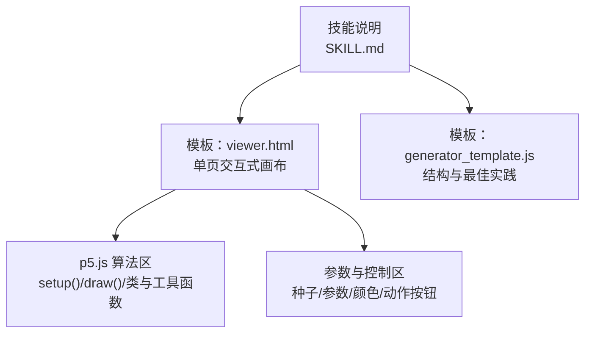
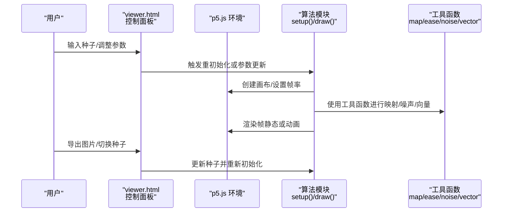
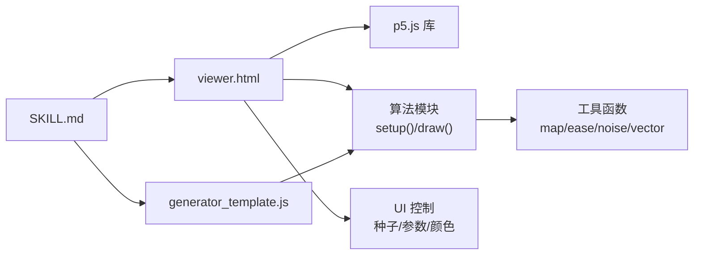

# 算法实现

<cite>
**本文引用的文件**
- [SKILL.md](file://skills/skills/algorithmic-art/SKILL.md)
- [generator_template.js](file://skills/skills/algorithmic-art/templates/generator_template.js)
- [viewer.html](file://skills/skills/algorithmic-art/templates/viewer.html)
</cite>

## 目录
1. [引言](#引言)
2. [项目结构](#项目结构)
3. [核心组件](#核心组件)
4. [架构总览](#架构总览)
5. [详细组件分析](#详细组件分析)
6. [依赖关系分析](#依赖关系分析)
7. [性能考量](#性能考量)
8. [故障排查指南](#故障排查指南)
9. [结论](#结论)
10. [附录](#附录)

## 引言
本文件面向“算法实现”目标，系统化阐述如何将算法哲学转化为可交互、可探索、可复现的 p5.js 生成式艺术实现。文档聚焦三类算法设计范式：
- 有机涌现（organism emergence）
- 数学美感（mathematical beauty）
- 受控混沌（controlled chaos）

并围绕 p5.js 的标准生命周期（setup/draw）组织实现，给出参数化结构、性能平衡策略、调试与优化方法，以及模块化与组合复用的工程实践建议。

## 项目结构
本仓库中与算法实现直接相关的核心资源位于 algorithmic-art 技能模板目录，包含：
- 模板：viewer.html（单页自包含的交互式画布与控制面板）
- 模板：generator_template.js（p5.js 最佳实践与结构指引）
- 技能说明：SKILL.md（算法哲学、技术要求、输出规范）

图表来源
- [SKILL.md: 101-220:101-220](file://skills/skills/algorithmic-art/SKILL.md#L101-L220)
- [viewer.html: 440-599:440-599](file://skills/skills/algorithmic-art/templates/viewer.html#L440-L599)
- [generator_template.js: 15-84:15-84](file://skills/skills/algorithmic-art/templates/generator_template.js#L15-L84)

章节来源
- [SKILL.md: 101-220:101-220](file://skills/skills/algorithmic-art/SKILL.md#L101-L220)
- [viewer.html: 440-599:440-599](file://skills/skills/algorithmic-art/templates/viewer.html#L440-L599)
- [generator_template.js: 15-84:15-84](file://skills/skills/algorithmic-art/templates/generator_template.js#L15-L84)

## 核心组件
- 参数对象 params：集中管理所有可调参数，便于 UI 绑定、重置与序列化。
- 种子系统：通过随机数与噪声种子确保可复现性。
- p5.js 生命周期：setup 初始化系统；draw 周期性更新与渲染。
- 类与实体：当系统包含多主体（如粒子、节点）时使用类封装状态与行为。
- 工具函数：颜色映射、范围映射、缓动、向量构造、透明背景等。
- UI 控制：种子导航、参数滑块、颜色选择器、重置与导出。

章节来源
- [SKILL.md: 133-220:133-220](file://skills/skills/algorithmic-art/SKILL.md#L133-L220)
- [generator_template.js: 24-47:24-47](file://skills/skills/algorithmic-art/templates/generator_template.js#L24-L47)
- [generator_template.js: 53-84:53-84](file://skills/skills/algorithmic-art/templates/generator_template.js#L53-L84)
- [generator_template.js: 92-110:92-110](file://skills/skills/algorithmic-art/templates/generator_template.js#L92-L110)
- [generator_template.js: 128-197:128-197](file://skills/skills/algorithmic-art/templates/generator_template.js#L128-L197)
- [viewer.html: 440-599:440-599](file://skills/skills/algorithmic-art/templates/viewer.html#L440-L599)

## 架构总览
下图展示从“算法哲学”到“可交互 HTML 产物”的端到端流程，以及 viewer.html 中的职责划分与数据流。

图表来源
- [viewer.html: 440-599:440-599](file://skills/skills/algorithmic-art/templates/viewer.html#L440-L599)
- [generator_template.js: 128-197:128-197](file://skills/skills/algorithmic-art/templates/generator_template.js#L128-L197)

## 详细组件分析

### 组件一：参数与种子系统
- 设计原则
  - 所有可调参数集中在 params 对象，便于 UI 绑定与重置。
  - 随机性与噪声均基于种子，保证相同输入产生一致输出。
- 关键点
  - 种子初始化顺序：先设置种子，再生成随机几何或噪声场。
  - 默认参数 defaultParams 用于一键恢复。
- 实现要点
  - 在 setup 中调用初始化种子与系统重建。
  - 在 UI 回调中区分实时更新与需全量重建的参数。

章节来源
- [generator_template.js: 24-47:24-47](file://skills/skills/algorithmic-art/templates/generator_template.js#L24-L47)
- [viewer.html: 534-591:534-591](file://skills/skills/algorithmic-art/templates/viewer.html#L534-L591)

### 组件二：p5.js 生命周期与渲染管线
- setup
  - 创建画布并挂载到容器。
  - 初始化系统（重建粒子/网格/场）。
  - 切换加载态。
- draw
  - 动画模式：每帧更新系统状态并绘制。
  - 静态模式：一次性生成后停止。
  - 用户触发：参数变化后触发重绘或全量重建。
- 性能建议
  - 限制每帧计算量，必要时降低元素数量或简化计算。
  - 使用透明背景叠加以实现轨迹/拖尾效果。

章节来源
- [viewer.html: 465-473:465-473](file://skills/skills/algorithmic-art/templates/viewer.html#L465-L473)
- [viewer.html: 503-505:503-505](file://skills/skills/algorithmic-art/templates/viewer.html#L503-L505)
- [generator_template.js: 53-84:53-84](file://skills/skills/algorithmic-art/templates/generator_template.js#L53-L84)

### 组件三：类与实体（以粒子系统为例）
- 类设计
  - 构造函数：初始化位置、速度、生命周期等。
  - update：物理/行为更新（如受力、边界处理）。
  - display：渲染逻辑，分离于更新逻辑。
- 复杂度控制
  - 合理的实体数量与更新频率。
  - 必要时采用空间索引或简化碰撞检测。

章节来源
- [generator_template.js: 92-110:92-110](file://skills/skills/algorithmic-art/templates/generator_template.js#L92-L110)
- [viewer.html: 511-516:511-516](file://skills/skills/algorithmic-art/templates/viewer.html#L511-L516)

### 组件四：工具函数与通用模式
- 颜色与映射
  - 颜色映射、范围映射、缓动函数。
- 噪声与向量
  - 使用噪声函数引入有机变化；向量构造统一角度与幅度。
- 背景与导出
  - 透明背景叠加实现轨迹；导出当前帧为 PNG。

章节来源
- [generator_template.js: 131-197:131-197](file://skills/skills/algorithmic-art/templates/generator_template.js#L131-L197)

### 组件五：UI 控制与交互
- 种子导航：显示、上一个、下一个、随机、跳转。
- 参数控制：滑块绑定到 params，实时更新值显示。
- 颜色控制：颜色选择器与值显示联动。
- 行为：重置、导出、按需重建系统。

章节来源
- [viewer.html: 340-429:340-429](file://skills/skills/algorithmic-art/templates/viewer.html#L340-L429)
- [viewer.html: 522-591:522-591](file://skills/skills/algorithmic-art/templates/viewer.html#L522-L591)

### 组件六：算法类型设计范式

#### 有机涌现（organism emergence）
- 设计要点
  - 元素随时间累积与增长，遵循自然规则的随机过程。
  - 反馈回路与相互作用驱动形态演化。
- 实现建议
  - 使用噪声场作为驱动力，结合局部规则（如邻域密度阈值）决定增殖/迁移。
  - 以粒子系统或细胞自动机为载体，强调密度与速度对色彩/亮度的影响。

章节来源
- [SKILL.md: 169-172:169-172](file://skills/skills/algorithmic-art/SKILL.md#L169-L172)

#### 数学美感（mathematical beauty）
- 设计要点
  - 几何关系与比例、三角函数与谐波、精确计算产生的意外图案。
- 实现建议
  - 基于周期性函数与黄金比例/斐波那契关系构建结构。
  - 将相位差与频率比映射到色彩与尺寸，形成和谐的视觉层次。

章节来源
- [SKILL.md: 174-177:174-177](file://skills/skills/algorithmic-art/SKILL.md#L174-L177)

#### 受控混沌（controlled chaos）
- 设计要点
  - 在严格边界内的随机扰动；分岔与相变；从混乱中浮现秩序。
- 实现建议
  - 使用噪声与概率阈值控制行为切换；在系统中引入阈值/相位变量触发模式转换。

章节来源
- [SKILL.md: 179-182:179-182](file://skills/skills/algorithmic-art/SKILL.md#L179-L182)

### 组件七：算法复杂度平衡策略
- 平衡原则
  - 在保持视觉吸引力的同时避免过度计算导致的性能问题。
- 策略清单
  - 控制实体数量与更新频率；优先使用高效的数据结构（如网格/四叉树）。
  - 缓解昂贵运算：减少每帧 sqrt/trig 次数；预计算常量；使用 p5 向量的就地操作。
  - 分帧渲染：将大任务拆分为多帧，避免卡顿。
  - 透明背景叠加：通过 alpha 累积实现轨迹，而非每帧重绘全部像素。

章节来源
- [generator_template.js: 116-125:116-125](file://skills/skills/algorithmic-art/templates/generator_template.js#L116-L125)
- [generator_template.js: 182-187:182-187](file://skills/skills/algorithmic-art/templates/generator_template.js#L182-L187)

### 组件八：调试与优化方法
- 性能监控
  - 使用浏览器开发者工具的性能面板观察帧耗时与 GC 抖动。
- 内存管理
  - 及时释放不再使用的对象与数组；避免在每帧创建临时对象。
- 渲染优化
  - 合理使用透明背景叠加；减少不必要的重绘；批量绘制同类型元素。
- 参数化与可视化
  - 为关键中间变量提供可视化开关（如显示网格/向量场），辅助定位瓶颈。

章节来源
- [SKILL.md: 205-209:205-209](file://skills/skills/algorithmic-art/SKILL.md#L205-L209)
- [generator_template.js: 116-125:116-125](file://skills/skills/algorithmic-art/templates/generator_template.js#L116-L125)

### 组件九：算法模块化与组合复用
- 模块化
  - 将不同子系统（噪声场、粒子系统、颜色映射）封装为独立模块，通过 params 注入。
- 组合
  - 通过组合多个子系统（如噪声场驱动粒子，密度映射颜色）形成复合效果。
- 复用
  - 提供默认参数与 UI 控件模板，便于快速替换算法核心而保留一致的交互体验。

章节来源
- [SKILL.md: 211-220:211-220](file://skills/skills/algorithmic-art/SKILL.md#L211-L220)
- [viewer.html: 350-429:350-429](file://skills/skills/algorithmic-art/templates/viewer.html#L350-L429)

## 依赖关系分析
- viewer.html 依赖 p5.js CDN，并内嵌完整算法与 UI。
- generator_template.js 提供结构与工具函数，作为算法实现的参考骨架。
- SKILL.md 定义了算法哲学、技术要求与输出规范，指导参数设计与实现风格。

图表来源
- [viewer.html: 23, 440-599](file://skills/skills/algorithmic-art/templates/viewer.html#L23,L440-L599)
- [generator_template.js: 128-197:128-197](file://skills/skills/algorithmic-art/templates/generator_template.js#L128-L197)
- [SKILL.md: 133-220:133-220](file://skills/skills/algorithmic-art/SKILL.md#L133-L220)

章节来源
- [viewer.html: 23, 440-599](file://skills/skills/algorithmic-art/templates/viewer.html#L23,L440-L599)
- [generator_template.js: 128-197:128-197](file://skills/skills/algorithmic-art/templates/generator_template.js#L128-L197)
- [SKILL.md: 133-220:133-220](file://skills/skills/algorithmic-art/SKILL.md#L133-L220)

## 性能考量
- 目标：在 60fps 下流畅运行，同时维持视觉丰富度。
- 方法：
  - 限制实体数量与更新频率；使用高效数据结构。
  - 预计算与缓存常用值；减少每帧昂贵运算。
  - 分帧渲染大型任务；利用透明背景叠加实现轨迹。
  - 通过参数控制渲染细节（如采样分辨率、衰减步长）。

章节来源
- [generator_template.js: 116-125:116-125](file://skills/skills/algorithmic-art/templates/generator_template.js#L116-L125)
- [SKILL.md: 208](file://skills/skills/algorithmic-art/SKILL.md#L208)

## 故障排查指南
- 画面卡顿
  - 检查实体数量与每帧更新复杂度；考虑降采样或简化计算。
- 颜色不一致
  - 确认种子初始化顺序正确；检查颜色映射与参数范围。
- 参数无效
  - 确认 UI 回调已更新 params 并触发重建或重绘。
- 导出异常
  - 确认导出函数可用且画布已渲染完成。

章节来源
- [viewer.html: 522-591:522-591](file://skills/skills/algorithmic-art/templates/viewer.html#L522-L591)
- [generator_template.js: 203-205:203-205](file://skills/skills/algorithmic-art/templates/generator_template.js#L203-L205)

## 结论
通过将算法哲学（有机涌现/数学美感/受控混沌）与 p5.js 的生命周期、参数化结构、工具函数和交互 UI 紧密结合，可以构建既富有表现力又具备工程可行性的生成式艺术。遵循可复现、性能友好与模块化原则，能够持续迭代出高质量的算法实现，并支持灵活的参数探索与组合复用。

## 附录
- 输出格式：单页自包含 HTML，内含 p5.js、算法、参数控制与 UI。
- 推荐流程：先确定算法哲学，再依据模板填充算法与参数，最后完善 UI 控件与导出功能。

章节来源
- [SKILL.md: 211-220:211-220](file://skills/skills/algorithmic-art/SKILL.md#L211-L220)
- [viewer.html: 275-300:275-300](file://skills/skills/algorithmic-art/templates/viewer.html#L275-L300)