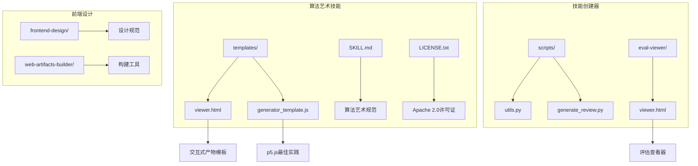
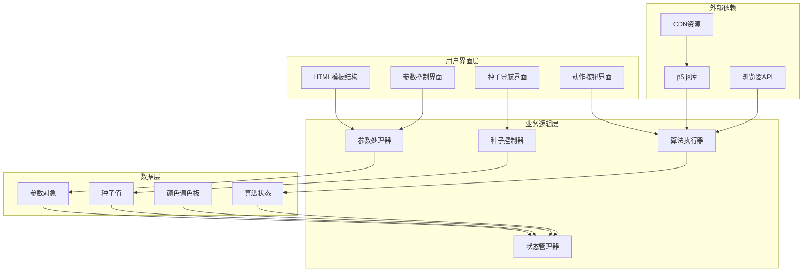
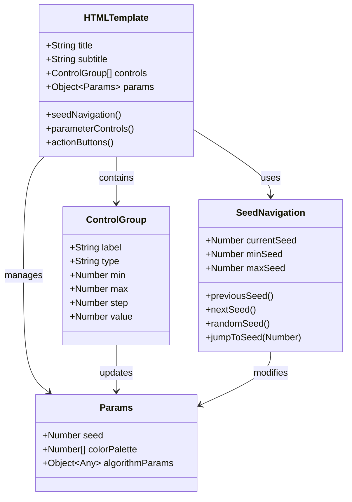
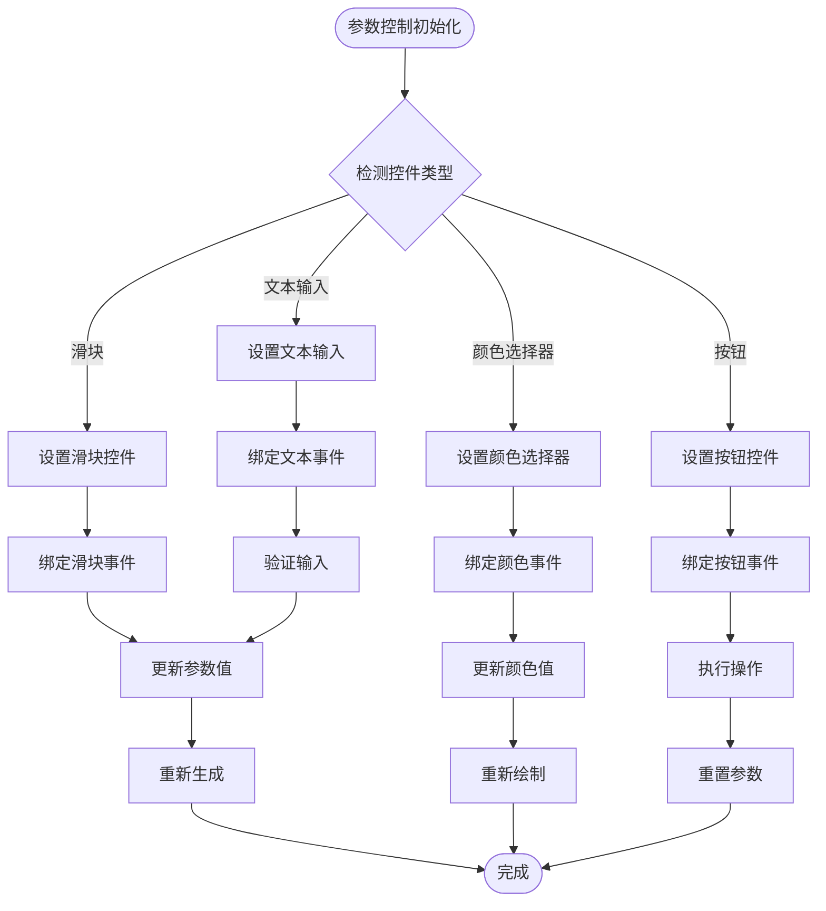
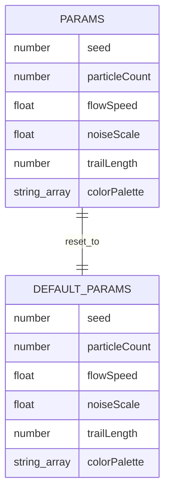
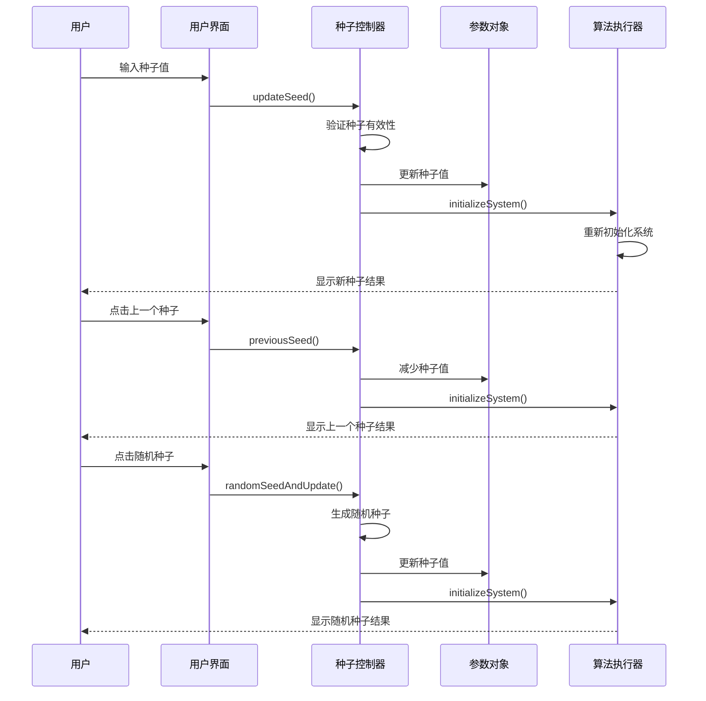
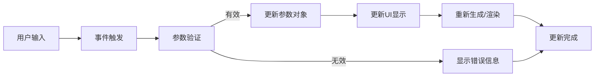

# 交互式产物创建

<cite>
**本文档引用的文件**
- [viewer.html](file://skills/skills/algorithmic-art/templates/viewer.html)
- [generator_template.js](file://skills/skills/algorithmic-art/templates/generator_template.js)
- [SKILL.md](file://skills/skills/algorithmic-art/SKILL.md)
- [utils.py](file://skills/skills/skill-creator/scripts/utils.py)
- [viewer.html](file://skills/skills/skill-creator/eval-viewer/viewer.html)
</cite>

## 目录
1. [简介](#简介)
2. [项目结构](#项目结构)
3. [核心组件](#核心组件)
4. [架构概览](#架构概览)
5. [详细组件分析](#详细组件分析)
6. [参数控制系统实现指南](#参数控制系统实现指南)
7. [种子导航功能实现](#种子导航功能实现)
8. [单一产物结构要求](#单一产物结构要求)
9. [模板使用原则](#模板使用原则)
10. [最佳实践](#最佳实践)
11. [故障排除指南](#故障排除指南)
12. [结论](#结论)

## 简介

本项目专注于创建交互式HTML产物，特别是基于p5.js的算法艺术生成器。该系统提供了一个完整的框架，允许用户通过参数控制界面实时探索和定制算法艺术作品。系统的核心是严格遵循的模板结构，确保所有交互式产物都具有统一的用户体验和一致的功能特性。

交互式产物创建功能的核心目标是：
- 基于模板创建完整的交互式HTML产物
- 实现参数控制系统，支持滑块、颜色选择器等控件
- 提供种子导航功能，支持前后切换、随机生成和指定种子跳转
- 确保单一产物结构，所有内容内联嵌入，不依赖外部文件
- 维护Anthropic品牌元素和设计规范

## 项目结构

该项目采用模块化组织方式，主要包含以下关键目录和文件：



**图表来源**
- [viewer.html:1-599](file://skills/skills/algorithmic-art/templates/viewer.html#L1-L599)
- [SKILL.md:1-405](file://skills/skills/algorithmic-art/SKILL.md#L1-L405)

**章节来源**
- [SKILL.md:1-405](file://skills/skills/algorithmic-art/SKILL.md#L1-L405)
- [viewer.html:1-599](file://skills/skills/algorithmic-art/templates/viewer.html#L1-L599)

## 核心组件

### 模板引擎组件

模板系统提供了完整的HTML结构基础，包括：
- 固定的布局结构（头部、侧边栏、主内容区域）
- Anthropic品牌元素（颜色方案、字体、渐变背景）
- 种子导航控制区
- 参数控制界面
- 动作按钮区域

### 参数控制系统

系统内置了灵活的参数控制系统，支持多种控件类型：
- 数值滑块（range inputs）用于连续参数调整
- 颜色选择器（color inputs）用于调色板控制
- 文本输入框用于种子值输入
- 按钮控件用于操作执行

### 种子管理系统

种子导航功能提供了完整的种子管理能力：
- 当前种子显示
- 前一个/下一个种子导航
- 随机种子生成功能
- 指定种子跳转
- 种子范围验证和边界处理

**章节来源**
- [viewer.html:108-596](file://skills/skills/algorithmic-art/templates/viewer.html#L108-L596)
- [generator_template.js:15-223](file://skills/skills/algorithmic-art/templates/generator_template.js#L15-L223)

## 架构概览

交互式产物创建系统采用分层架构设计，确保各组件职责清晰且高度解耦：



**图表来源**
- [viewer.html:440-597](file://skills/skills/algorithmic-art/templates/viewer.html#L440-L597)
- [generator_template.js:165-176](file://skills/skills/algorithmic-art/templates/generator_template.js#L165-L176)

## 详细组件分析

### HTML模板结构分析

模板文件提供了完整的HTML骨架，必须严格遵循以确保一致性：

#### 固定部分（必须保持不变）
- **布局结构**：容器、侧边栏、主画布区域的完整结构
- **Anthropic品牌**：颜色变量、字体设置、渐变背景
- **种子控制区**：包含种子输入、导航按钮、随机按钮
- **动作按钮区**：重置、下载等操作按钮
- **响应式设计**：移动端适配样式

#### 可变部分（需要自定义）
- **标题和副标题**：艺术作品的名称和描述
- **参数控制**：根据具体算法需求定制的参数界面
- **颜色选择器**：根据艺术风格需要添加或移除
- **p5.js算法实现**：核心算法逻辑



**图表来源**
- [viewer.html:334-430](file://skills/skills/algorithmic-art/templates/viewer.html#L334-L430)
- [viewer.html:445-452](file://skills/skills/algorithmic-art/templates/viewer.html#L445-L452)

**章节来源**
- [viewer.html:1-599](file://skills/skills/algorithmic-art/templates/viewer.html#L1-L599)

### 参数控制系统实现

参数控制系统是交互式产物的核心功能，提供了实时参数调整能力：

#### 控件类型和实现模式



**图表来源**
- [viewer.html:522-528](file://skills/skills/algorithmic-art/templates/viewer.html#L522-L528)
- [viewer.html:568-591](file://skills/skills/algorithmic-art/templates/viewer.html#L568-L591)

#### 参数对象结构

参数系统采用集中管理模式，所有可调参数都存储在一个对象中：



**图表来源**
- [viewer.html:445-452](file://skills/skills/algorithmic-art/templates/viewer.html#L445-L452)

**章节来源**
- [viewer.html:350-429](file://skills/skills/algorithmic-art/templates/viewer.html#L350-L429)
- [generator_template.js:165-176](file://skills/skills/algorithmic-art/templates/generator_template.js#L165-L176)

### 种子导航功能实现

种子导航系统提供了完整的种子管理功能，确保算法输出的可重现性和探索性：

#### 种子控制流程



**图表来源**
- [viewer.html:538-566](file://skills/skills/algorithmic-art/templates/viewer.html#L538-L566)

#### 种子验证和边界处理

种子系统实现了完善的验证机制：
- 种子值范围验证（必须为正整数）
- 边界条件处理（最小值1，防止负数）
- 输入格式验证（数字格式检查）
- 错误恢复机制（无效输入时恢复显示）

**章节来源**
- [viewer.html:534-566](file://skills/skills/algorithmic-art/templates/viewer.html#L534-L566)

## 参数控制系统实现指南

### 滑块控件创建步骤

#### 1. HTML结构定义
在参数控制区域添加滑块控件的基本结构：

```html
<div class="control-group">
    <label>参数名称</label>
    <div class="slider-container">
        <input type="range" 
               id="参数ID" 
               min="最小值" 
               max="最大值" 
               step="步长" 
               value="默认值" 
               oninput="updateParam('参数ID', this.value)">
        <span class="value-display" id="参数ID-value">默认值</span>
    </div>
</div>
```

#### 2. JavaScript事件处理
实现参数更新函数，确保实时响应：

```javascript
function updateParam(paramName, value) {
    // 更新参数值
    params[paramName] = parseFloat(value);
    
    // 更新显示值
    document.getElementById(paramName + '-value').textContent = value;
    
    // 触发重新生成（根据参数重要性决定）
    if (shouldRegenerateOnUpdate(paramName)) {
        initializeSystem();
    } else {
        // 或者只更新渲染
        redraw();
    }
}

function shouldRegenerateOnUpdate(paramName) {
    // 定义哪些参数变化需要完全重新生成
    const regenerateParams = ['particleCount', 'seed'];
    return regenerateParams.includes(paramName);
}
```

#### 3. 参数验证和约束
实现参数范围验证和约束处理：

```javascript
function validateParameter(paramName, value) {
    const paramConfig = {
        particleCount: { min: 100, max: 10000 },
        flowSpeed: { min: 0.1, max: 2.0 },
        noiseScale: { min: 0.001, max: 0.02 }
    };
    
    const config = paramConfig[paramName];
    if (!config) return true;
    
    const numValue = parseFloat(value);
    return numValue >= config.min && numValue <= config.max;
}
```

### 颜色选择器实现指南

#### 颜色控件结构
```html
<div class="color-group">
    <label>颜色名称</label>
    <div class="color-picker-container">
        <input type="color" 
               id="colorId" 
               value="#十六进制颜色值" 
               onchange="updateColor('colorId', this.value)">
        <span class="color-value" id="colorId-value">#十六进制值</span>
    </div>
</div>
```

#### 颜色处理函数
```javascript
function updateColor(colorId, value) {
    // 更新颜色值
    const colorIndex = parseInt(colorId.charAt(colorId.length - 1)) - 1;
    params.colorPalette[colorIndex] = value;
    
    // 更新显示值
    document.getElementById(colorId + '-value').textContent = value;
    
    // 重新渲染
    redraw();
}

function hexToRgb(hex) {
    const result = /^#?([a-f\d]{2})([a-f\d]{2})([a-f\d]{2})$/i.exec(hex);
    return result ? {
        r: parseInt(result[1], 16),
        g: parseInt(result[2], 16),
        b: parseInt(result[3], 16)
    } : null;
}
```

### 实时更新机制

#### 事件驱动更新
系统采用事件驱动的方式实现实时更新：



**图表来源**
- [viewer.html:522-528](file://skills/skills/algorithmic-art/templates/viewer.html#L522-L528)

**章节来源**
- [viewer.html:350-429](file://skills/skills/algorithmic-art/templates/viewer.html#L350-L429)
- [generator_template.js:165-176](file://skills/skills/algorithmic-art/templates/generator_template.js#L165-L176)

## 种子导航功能实现

### 种子控制函数详解

#### 种子显示和同步
```javascript
function updateSeedDisplay() {
    document.getElementById('seed-input').value = params.seed;
}

function updateSeed() {
    const input = document.getElementById('seed-input');
    const newSeed = parseInt(input.value);
    
    if (newSeed && newSeed > 0) {
        params.seed = newSeed;
        initializeSystem();
    } else {
        // 无效输入时恢复显示
        updateSeedDisplay();
    }
}
```

#### 种子导航操作
```javascript
function previousSeed() {
    params.seed = Math.max(1, params.seed - 1);
    updateSeedDisplay();
    initializeSystem();
}

function nextSeed() {
    params.seed = params.seed + 1;
    updateSeedDisplay();
    initializeSystem();
}

function randomSeedAndUpdate() {
    params.seed = Math.floor(Math.random() * 999999) + 1;
    updateSeedDisplay();
    initializeSystem();
}
```

### 种子管理最佳实践

#### 种子范围验证
```javascript
function validateSeedRange(seed) {
    const MIN_SEED = 1;
    const MAX_SEED = 999999;
    
    return Math.max(MIN_SEED, Math.min(MAX_SEED, parseInt(seed)));
}
```

#### 种子历史追踪
```javascript
class SeedHistory {
    constructor(maxSize = 100) {
        this.history = [];
        this.maxSize = maxSize;
    }
    
    add(seed) {
        this.history.push(seed);
        if (this.history.length > this.maxSize) {
            this.history.shift();
        }
    }
    
    getPrevious() {
        return this.history.length > 1 ? 
            this.history[this.history.length - 2] : null;
    }
    
    getCurrent() {
        return this.history.length > 0 ? 
            this.history[this.history.length - 1] : null;
    }
}
```

**章节来源**
- [viewer.html:534-566](file://skills/skills/algorithmic-art/templates/viewer.html#L534-L566)

## 单一产物结构要求

### 内联嵌入原则

单一产物结构要求所有内容都必须内联嵌入，不得依赖外部文件：

#### 必须内联的内容
- **HTML结构**：完整的DOM结构，包括所有必要的标签和属性
- **CSS样式**：所有样式规则，包括响应式设计和品牌元素
- **JavaScript代码**：完整的算法实现和交互逻辑
- **p5.js库**：通过CDN引入的p5.js库文件

#### 外部依赖限制
- **CDN资源**：只能使用受信任的CDN服务（如cdnjs.cloudflare.com）
- **本地文件**：不允许包含任何本地文件引用
- **动态加载**：不允许在运行时动态加载外部资源

### HTML结构规范

#### 基础模板结构
```html
<!DOCTYPE html>
<html>
<head>
    <meta charset="UTF-8">
    <meta name="viewport" content="width=device-width, initial-scale=1.0">
    <title>交互式艺术作品</title>
    <script src="https://cdnjs.cloudflare.com/ajax/libs/p5.js/1.7.0/p5.min.js"></script>
    <style>
        /* 所有CSS样式内联在此 */
    </style>
</head>
<body>
    <!-- 完整的HTML结构 -->
    <script>
        // 所有JavaScript代码内联在此
    </script>
</body>
</html>
```

#### 性能优化考虑
- **压缩资源**：内联CSS和JavaScript应进行适当的压缩
- **缓存策略**：利用浏览器缓存机制提高加载速度
- **加载优先级**：确保关键资源优先加载

**章节来源**
- [SKILL.md:274-302](file://skills/skills/algorithmic-art/SKILL.md#L274-L302)

## 模板使用原则

### 严格遵循模板要求

模板使用是交互式产物创建的核心原则，必须严格遵守：

#### 必须保持不变的部分
- **整体结构**：头部、侧边栏、主内容区域的布局
- **Anthropic品牌**：颜色方案、字体选择、渐变背景
- **种子控制**：种子显示、导航按钮、随机按钮的完整功能
- **动作按钮**：重置、下载等操作按钮的实现
- **响应式设计**：移动端适配的样式和行为

#### 可以创意修改的部分
- **算法实现**：p5.js核心算法的具体实现
- **参数定义**：根据艺术需求定制的参数对象
- **UI控件**：参数控制界面的具体设计
- **视觉效果**：颜色搭配和视觉呈现

### 模板使用流程

#### 第一步：模板阅读和理解
1. 仔细阅读模板文件中的注释说明
2. 理解固定部分和可变部分的划分
3. 分析现有参数和控件的实现方式
4. 确定自己的艺术理念和参数需求

#### 第二步：参数系统设计
1. 基于算法理念设计参数对象
2. 确定需要的参数数量和类型
3. 设计参数的合理范围和步长
4. 考虑参数之间的相互影响

#### 第三步：算法实现
1. 实现p5.js核心算法逻辑
2. 确保算法与参数系统的兼容性
3. 优化算法性能和渲染效率
4. 实现种子控制的可重现性

#### 第四步：UI集成
1. 将参数映射到对应的UI控件
2. 实现参数更新的事件处理
3. 确保UI控件与算法的实时同步
4. 测试所有交互功能的正确性

**章节来源**
- [SKILL.md:105-127](file://skills/skills/algorithmic-art/SKILL.md#L105-L127)
- [SKILL.md:227-257](file://skills/skills/algorithmic-art/SKILL.md#L227-L257)

## 最佳实践

### 算法设计原则

#### 可重现性保证
- 使用种子控制确保相同输入产生相同输出
- 避免使用不可预测的随机源
- 在算法开始时设置随机种子

#### 性能优化策略
- 预计算静态值，减少重复计算
- 使用高效的数据结构和算法
- 限制不必要的DOM操作
- 优化渲染循环的性能

#### 用户体验设计
- 提供直观的参数控制界面
- 实现实时预览和即时反馈
- 确保操作的流畅性和响应性
- 提供清晰的状态指示和错误提示

### 代码组织规范

#### 模块化设计
- 将相关功能组织在独立的函数中
- 使用类来封装复杂的数据结构
- 实现清晰的接口和抽象层
- 避免全局变量的滥用

#### 错误处理机制
- 实现输入验证和边界检查
- 提供友好的错误提示信息
- 实现优雅的降级处理
- 记录调试信息便于问题排查

### 资源管理策略

#### 内存管理
- 及时释放不再使用的对象
- 避免内存泄漏和资源浪费
- 合理使用数组和对象的生命周期
- 监控内存使用情况

#### 渲染优化
- 使用requestAnimationFrame优化动画
- 实现适当的帧率控制
- 减少不必要的重绘和回流
- 优化图形渲染性能

## 故障排除指南

### 常见问题诊断

#### 参数更新不生效
**症状**：更改参数后画面没有变化
**可能原因**：
- 参数更新函数未正确实现
- UI控件与参数对象不同步
- 缺少重新生成或重绘的调用

**解决方案**：
1. 检查updateParam函数的实现
2. 确认参数对象的引用关系
3. 添加initializeSystem()或redraw()调用

#### 种子导航异常
**症状**：种子切换功能失效或显示错误
**可能原因**：
- 种子值验证逻辑错误
- 边界条件处理不当
- UI显示更新失败

**解决方案**：
1. 检查种子值的范围验证
2. 实现边界条件的正确处理
3. 确保updateSeedDisplay()正常工作

#### 性能问题
**症状**：页面响应缓慢或卡顿
**可能原因**：
- 算法复杂度过高
- DOM操作过于频繁
- 渲染循环效率低下

**解决方案**：
1. 优化算法实现，减少计算量
2. 批量处理DOM操作
3. 实现帧率控制和节流机制

### 调试技巧

#### 开发工具使用
- 利用浏览器开发者工具监控性能
- 使用console.log进行调试输出
- 实现断点调试定位问题
- 监控内存使用情况

#### 日志记录策略
```javascript
function debugLog(message, ...args) {
    if (DEBUG_MODE) {
        console.log(`[DEBUG] ${message}`, ...args);
    }
}

function performanceMonitor(operation, callback) {
    const startTime = performance.now();
    const result = callback();
    const endTime = performance.now();
    
    if (DEBUG_MODE) {
        console.log(`[PERFORMANCE] ${operation}: ${endTime - startTime}ms`);
    }
    
    return result;
}
```

**章节来源**
- [viewer.html:522-591](file://skills/skills/algorithmic-art/templates/viewer.html#L522-L591)
- [generator_template.js:113-126](file://skills/skills/algorithmic-art/templates/generator_template.js#L113-L126)

## 结论

交互式产物创建功能为算法艺术创作提供了一个强大而灵活的平台。通过严格遵循模板规范，开发者可以快速创建高质量的交互式HTML产物，实现参数化艺术创作和实时探索体验。

该系统的核心优势在于：
- **一致性保障**：严格的模板要求确保所有产物具有统一的用户体验
- **灵活性设计**：可变部分允许充分表达个人艺术理念
- **完整功能**：内置参数控制系统和种子导航功能
- **性能优化**：针对p5.js环境进行了专门的性能优化
- **易用性**：简洁的API和清晰的实现模式

通过深入理解和应用本文档提供的指导原则和最佳实践，开发者可以创建出既符合规范又富有创意的交互式艺术作品，为用户提供丰富而深入的艺术探索体验。