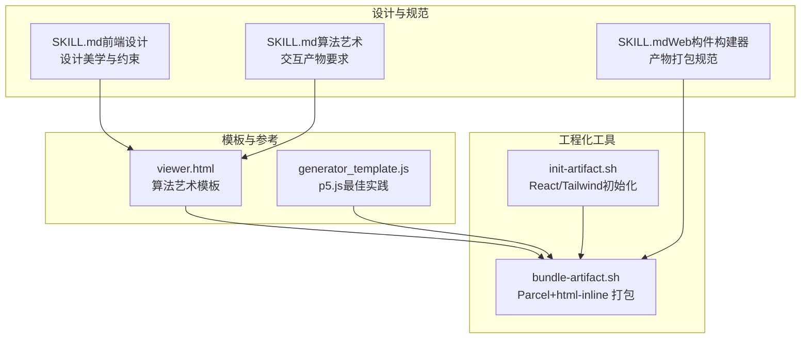
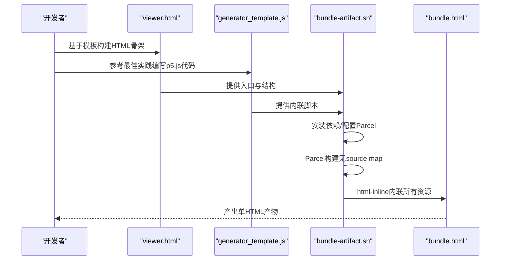
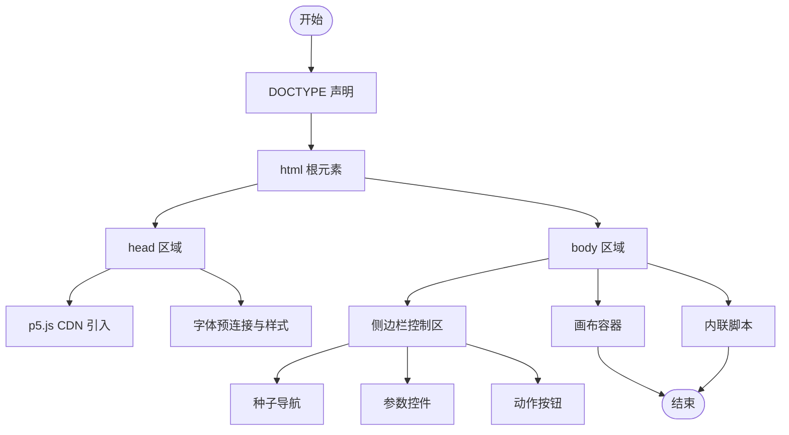
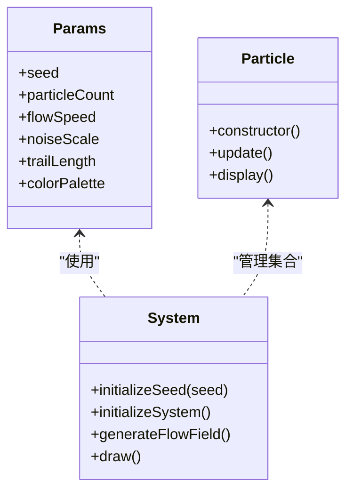
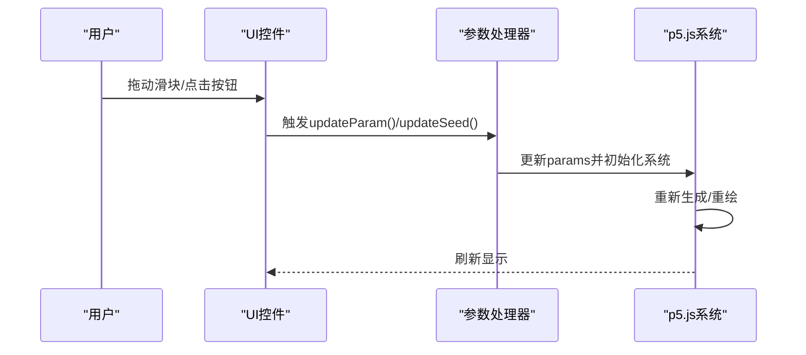
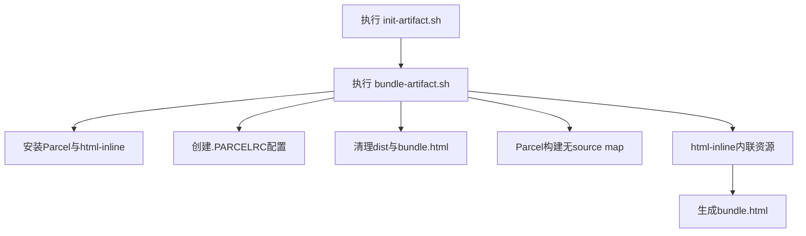
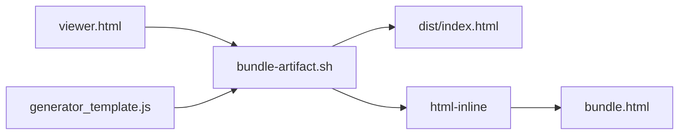

# 单一产物结构

<cite>
**本文引用的文件**
- [viewer.html](file://skills/skills/algorithmic-art/templates/viewer.html)
- [generator_template.js](file://skills/skills/algorithmic-art/templates/generator_template.js)
- [SKILL.md（算法艺术）](file://skills/skills/algorithmic-art/SKILL.md)
- [SKILL.md（Web构件构建器）](file://skills/skills/web-artifacts-builder/SKILL.md)
- [bundle-artifact.sh](file://skills/skills/web-artifacts-builder/scripts/bundle-artifact.sh)
- [init-artifact.sh](file://skills/skills/web-artifacts-builder/scripts/init-artifact.sh)
- [SKILL.md（前端设计）](file://skills/skills/frontend-design/SKILL.md)
</cite>

## 目录
1. [引言](#引言)
2. [项目结构](#项目结构)
3. [核心组件](#核心组件)
4. [架构总览](#架构总览)
5. [详细组件分析](#详细组件分析)
6. [依赖关系分析](#依赖关系分析)
7. [性能考量](#性能考量)
8. [故障排查指南](#故障排查指南)
9. [结论](#结论)
10. [附录](#附录)

## 引言
本文件面向“单一产物结构”的目标，系统阐述如何构建一个完全自包含的HTML产物文件。该产物需满足以下关键要求：
- 文档结构：严格遵循HTML标准结构（DOCTYPE、html根元素、head与body组织）
- 资源内联：p5.js库通过CDN引入、CSS样式内联、JavaScript代码内联；不允许任何外部依赖
- 产物形态：单文件HTML，可直接在Claude或任意浏览器中打开运行
- 工程化：提供从模板到打包的完整流程，确保可复用与可维护

## 项目结构
围绕“单一产物结构”，本仓库提供了成熟的模板与工具链：
- 模板层：算法艺术模板viewer.html，提供完整的HTML骨架、Anthropic品牌风格、参数控制区与画布容器
- 代码层：generator_template.js，给出p5.js最佳实践与结构范式
- 构建层：web-artifacts-builder脚本bundle-artifact.sh，将React应用打包为单HTML文件
- 初始化层：init-artifact.sh，生成React+Tailwind+shadcn/ui工程，便于复杂产物的开发
- 设计层：frontend-design技能，指导高设计质量的前端界面实现

**图表来源**
- [viewer.html:1-599](file://skills/skills/algorithmic-art/templates/viewer.html#L1-L599)
- [generator_template.js:1-223](file://skills/skills/algorithmic-art/templates/generator_template.js#L1-L223)
- [bundle-artifact.sh:1-54](file://skills/skills/web-artifacts-builder/scripts/bundle-artifact.sh#L1-L54)
- [init-artifact.sh:1-323](file://skills/skills/web-artifacts-builder/scripts/init-artifact.sh#L1-L323)
- [SKILL.md（前端设计）:1-43](file://skills/skills/frontend-design/SKILL.md#L1-L43)
- [SKILL.md（Web构件构建器）:1-74](file://skills/skills/web-artifacts-builder/SKILL.md#L1-L74)
- [SKILL.md（算法艺术）:1-405](file://skills/skills/algorithmic-art/SKILL.md#L1-L405)

**章节来源**
- [SKILL.md（Web构件构建器）:1-74](file://skills/skills/web-artifacts-builder/SKILL.md#L1-L74)
- [SKILL.md（算法艺术）:1-405](file://skills/skills/algorithmic-art/SKILL.md#L1-L405)
- [SKILL.md（前端设计）:1-43](file://skills/skills/frontend-design/SKILL.md#L1-L43)

## 核心组件
- HTML骨架与结构
  - DOCTYPE声明、html根元素、head与body的职责划分
  - head内含：p5.js CDN引入、字体预连接、内联样式
  - body内含：侧边栏控制区、主画布容器、内联脚本
- 内联资源规范
  - p5.js库通过CDN引入，确保可用性与稳定性
  - CSS样式全部内联，避免额外请求
  - JavaScript代码内联，不依赖外部模块或动态导入
- 参数化与交互
  - 固定的种子导航区（显示、上一、下一、随机、跳转）
  - 可变的参数区（滑块、颜色选择器等）
  - 动作区（重置、下载等）

**章节来源**
- [viewer.html:1-599](file://skills/skills/algorithmic-art/templates/viewer.html#L1-L599)
- [SKILL.md（算法艺术）:274-337](file://skills/skills/algorithmic-art/SKILL.md#L274-L337)

## 架构总览
下图展示了从模板到单HTML产物的关键流程：以viewer.html为基底，结合generator_template.js的结构原则，最终由bundle-artifact.sh完成内联与打包。

**图表来源**
- [viewer.html:1-599](file://skills/skills/algorithmic-art/templates/viewer.html#L1-L599)
- [generator_template.js:1-223](file://skills/skills/algorithmic-art/templates/generator_template.js#L1-L223)
- [bundle-artifact.sh:1-54](file://skills/skills/web-artifacts-builder/scripts/bundle-artifact.sh#L1-L54)

**章节来源**
- [bundle-artifact.sh:1-54](file://skills/skills/web-artifacts-builder/scripts/bundle-artifact.sh#L1-L54)
- [SKILL.md（Web构件构建器）:45-61](file://skills/skills/web-artifacts-builder/SKILL.md#L45-L61)

## 详细组件分析

### HTML骨架与结构
- 必备元素
  - DOCTYPE声明：确保浏览器以标准模式渲染
  - html根元素：lang属性明确语言
  - head区域：字符集、视口、标题、p5.js CDN、字体预连接、内联样式
  - body区域：布局容器、侧边栏、画布容器、内联脚本
- 组织原则
  - 固定部分（模板注释标记）保持不变：布局结构、品牌色系、种子导航、动作按钮
  - 可变部分（算法、参数、UI控件）按需替换
- 示例路径
  - 骨架结构参考：[viewer.html:1-599](file://skills/skills/algorithmic-art/templates/viewer.html#L1-L599)

**图表来源**
- [viewer.html:1-599](file://skills/skills/algorithmic-art/templates/viewer.html#L1-L599)

**章节来源**
- [viewer.html:18-330](file://skills/skills/algorithmic-art/templates/viewer.html#L18-L330)
- [SKILL.md（算法艺术）:227-257](file://skills/skills/algorithmic-art/SKILL.md#L227-L257)

### p5.js算法与参数体系
- 参数组织
  - 将所有可调参数集中在一个对象中，便于UI绑定、重置与序列化
  - 种子参数必须存在，保证可重现性
- 随机性与噪声
  - 使用固定种子初始化随机与噪声，确保相同输入产生一致输出
- 生命周期
  - setup：创建画布、初始化系统、设置循环策略
  - draw：根据需求选择静态生成或动画更新
- 类结构
  - 当系统包含多个实体时，使用类进行封装，分离更新与渲染逻辑
- 性能建议
  - 大规模元素时，尽量减少昂贵操作，合理使用向量与空间索引
  - 控制帧率与更新频率，必要时限制元素数量

**图表来源**
- [generator_template.js:24-110](file://skills/skills/algorithmic-art/templates/generator_template.js#L24-L110)
- [viewer.html:445-596](file://skills/skills/algorithmic-art/templates/viewer.html#L445-L596)

**章节来源**
- [generator_template.js:15-223](file://skills/skills/algorithmic-art/templates/generator_template.js#L15-L223)
- [SKILL.md（算法艺术）:133-210](file://skills/skills/algorithmic-art/SKILL.md#L133-L210)

### UI控制与交互
- 种子导航
  - 显示当前种子、上一、下一、随机、跳转至指定种子
  - 输入校验与回显
- 参数控件
  - 数值滑块、颜色选择器等，实时更新参数并触发重绘
- 动作区
  - 重置参数、导出图片等

**图表来源**
- [viewer.html:522-596](file://skills/skills/algorithmic-art/templates/viewer.html#L522-L596)

**章节来源**
- [viewer.html:340-429](file://skills/skills/algorithmic-art/templates/viewer.html#L340-L429)
- [SKILL.md（算法艺术）:267-337](file://skills/skills/algorithmic-art/SKILL.md#L267-L337)

### 构建与打包流程
- 初始化复杂产物（可选）
  - 使用init-artifact.sh创建React+Tailwind+shadcn/ui工程
  - 自动安装依赖、配置别名与主题变量
- 打包为单HTML
  - 使用bundle-artifact.sh安装Parcel与html-inline
  - 生成无source map的构建产物
  - 通过html-inline将所有资源内联进单个HTML文件
  - 输出bundle.html，文件大小会显示在终端

**图表来源**
- [init-artifact.sh:1-323](file://skills/skills/web-artifacts-builder/scripts/init-artifact.sh#L1-L323)
- [bundle-artifact.sh:1-54](file://skills/skills/web-artifacts-builder/scripts/bundle-artifact.sh#L1-L54)

**章节来源**
- [SKILL.md（Web构件构建器）:22-70](file://skills/skills/web-artifacts-builder/SKILL.md#L22-L70)
- [bundle-artifact.sh:19-54](file://skills/skills/web-artifacts-builder/scripts/bundle-artifact.sh#L19-L54)

## 依赖关系分析
- 模板与脚本的耦合
  - viewer.html作为骨架模板，被bundle-artifact.sh用于内联打包
  - generator_template.js提供代码结构参考，最终内联到HTML中
- 工具链依赖
  - Parcel负责构建与资源解析
  - html-inline负责将外部资源内联到HTML
  - .parcelrc启用路径别名解析，提升开发体验
- 设计约束
  - 前端设计技能强调避免通用AI美学，追求独特视觉表达
  - 算法艺术技能强调交互产物的自包含性与可重现性

**图表来源**
- [viewer.html:1-599](file://skills/skills/algorithmic-art/templates/viewer.html#L1-L599)
- [generator_template.js:1-223](file://skills/skills/algorithmic-art/templates/generator_template.js#L1-L223)
- [bundle-artifact.sh:1-54](file://skills/skills/web-artifacts-builder/scripts/bundle-artifact.sh#L1-L54)

**章节来源**
- [SKILL.md（前端设计）:27-43](file://skills/skills/frontend-design/SKILL.md#L27-L43)
- [SKILL.md（算法艺术）:211-225](file://skills/skills/algorithmic-art/SKILL.md#L211-L225)

## 性能考量
- 渲染性能
  - 控制粒子/元素数量，避免过高的计算复杂度
  - 合理使用p5.js内置函数与向量运算，减少不必要的开销
  - 对于动画场景，关注帧率与绘制开销，必要时降低刷新频率
- 资源体积
  - 仅内联必要样式与脚本，避免冗余
  - 通过html-inline统一内联，减少HTTP请求数
- 加载速度
  - p5.js通过CDN引入，确保缓存与就近访问
  - 避免额外字体或第三方资源，保持单文件自包含
- 可靠性
  - 种子固定保证可重现，便于调试与对比
  - UI控件即时反馈，提升交互体验

[本节为通用性能建议，无需特定文件引用]

## 故障排查指南
- 构建失败
  - 确认项目根目录存在package.json与index.html
  - 检查Node版本是否满足要求（脚本会检测并提示）
- 打包异常
  - 确认已安装pnpm，脚本会自动安装Parcel与html-inline
  - 检查.PARCELRC配置是否正确生成
- 运行问题
  - 在浏览器中打开bundle.html，确认控制台无错误
  - 若p5.js未加载，检查CDN链接可用性
- 交互无效
  - 确认内联脚本中的函数名与事件绑定一致
  - 检查参数对象与UI控件的id匹配

**章节来源**
- [bundle-artifact.sh:6-17](file://skills/skills/web-artifacts-builder/scripts/bundle-artifact.sh#L6-L17)
- [SKILL.md（Web构件构建器）:66-70](file://skills/skills/web-artifacts-builder/SKILL.md#L66-L70)

## 结论
通过模板化的HTML骨架、内联化的资源组织与工程化的打包流程，可以稳定地产出完全自包含的HTML产物。该产物具备：
- 标准且清晰的文档结构
- 内聚的样式与脚本
- 可交互的参数控制与种子导航
- 可复用的构建与验证流程

这些特性共同确保产物在Claude或任意浏览器中即开即用，并满足高性能与可维护性的要求。

[本节为总结性内容，无需特定文件引用]

## 附录

### 完整HTML骨架结构要点（路径指引）
- 文档声明与根元素
  - [viewer.html:1-2](file://skills/skills/algorithmic-art/templates/viewer.html#L1-L2)
  - [viewer.html:18-19](file://skills/skills/algorithmic-art/templates/viewer.html#L18-L19)
- head部分
  - 字符集与视口：[viewer.html:20-22](file://skills/skills/algorithmic-art/templates/viewer.html#L20-L22)
  - p5.js CDN引入：[viewer.html](file://skills/skills/algorithmic-art/templates/viewer.html#L23)
  - 字体预连接与样式：[viewer.html:24-26](file://skills/skills/algorithmic-art/templates/viewer.html#L24-L26)、[viewer.html:27-329](file://skills/skills/algorithmic-art/templates/viewer.html#L27-L329)
- body部分
  - 布局容器与侧边栏：[viewer.html:331-438](file://skills/skills/algorithmic-art/templates/viewer.html#L331-L438)
  - 画布容器与加载提示：[viewer.html:432-437](file://skills/skills/algorithmic-art/templates/viewer.html#L432-L437)
  - 内联脚本与参数对象：[viewer.html:440-596](file://skills/skills/algorithmic-art/templates/viewer.html#L440-L596)

### 内联资源清单（路径指引）
- p5.js库（CDN）：[viewer.html](file://skills/skills/algorithmic-art/templates/viewer.html#L23)
- 内联样式（Anthropic品牌风格）：[viewer.html:27-329](file://skills/skills/algorithmic-art/templates/viewer.html#L27-L329)
- 内联JavaScript（参数、算法、UI处理）：[viewer.html:440-596](file://skills/skills/algorithmic-art/templates/viewer.html#L440-L596)

### 交互控件清单（路径指引）
- 种子导航（显示、上一、下一、随机、跳转）：[viewer.html:340-348](file://skills/skills/algorithmic-art/templates/viewer.html#L340-L348)
- 参数控件（滑块、数值显示）：[viewer.html:350-389](file://skills/skills/algorithmic-art/templates/viewer.html#L350-L389)
- 颜色控件（可选）：[viewer.html:391-421](file://skills/skills/algorithmic-art/templates/viewer.html#L391-L421)
- 动作按钮（重置）：[viewer.html:423-429](file://skills/skills/algorithmic-art/templates/viewer.html#L423-L429)

### 打包与验证步骤（路径指引）
- 初始化复杂产物（可选）：[init-artifact.sh:58-80](file://skills/skills/web-artifacts-builder/scripts/init-artifact.sh#L58-L80)
- 打包为单HTML：[bundle-artifact.sh:40-54](file://skills/skills/web-artifacts-builder/scripts/bundle-artifact.sh#L40-L54)
- 产物规范与要求：[SKILL.md（Web构件构建器）:45-61](file://skills/skills/web-artifacts-builder/SKILL.md#L45-L61)
- 交互产物要求与模板使用：[SKILL.md（算法艺术）:221-337](file://skills/skills/algorithmic-art/SKILL.md#L221-L337)