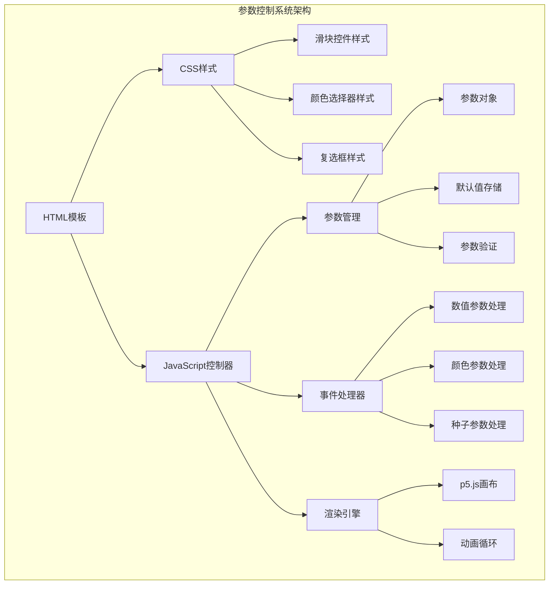
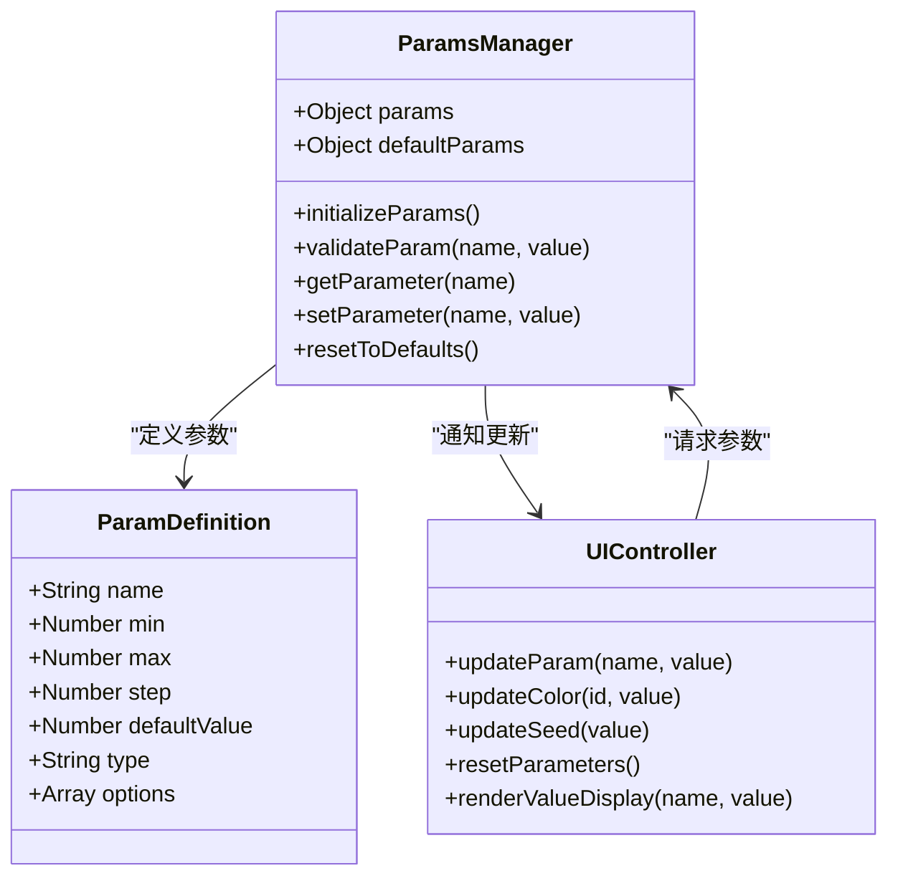
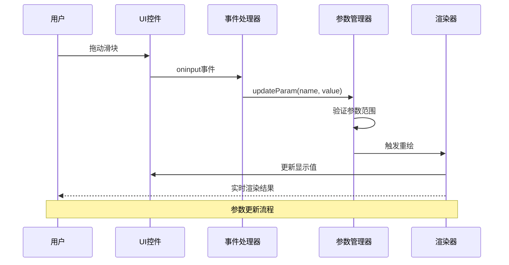
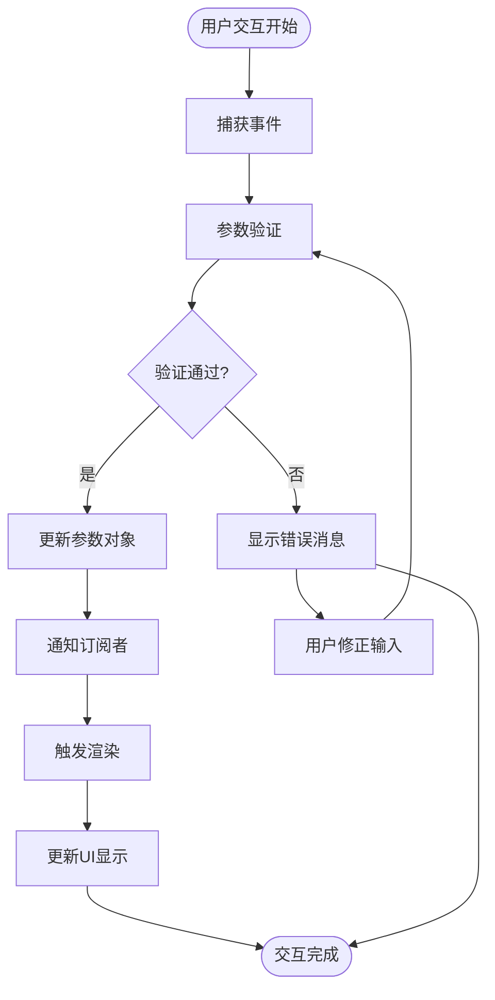
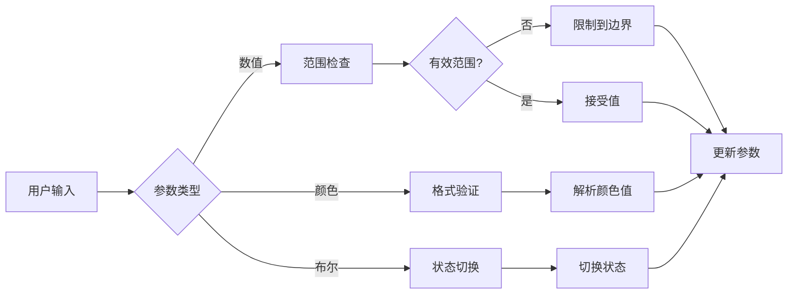
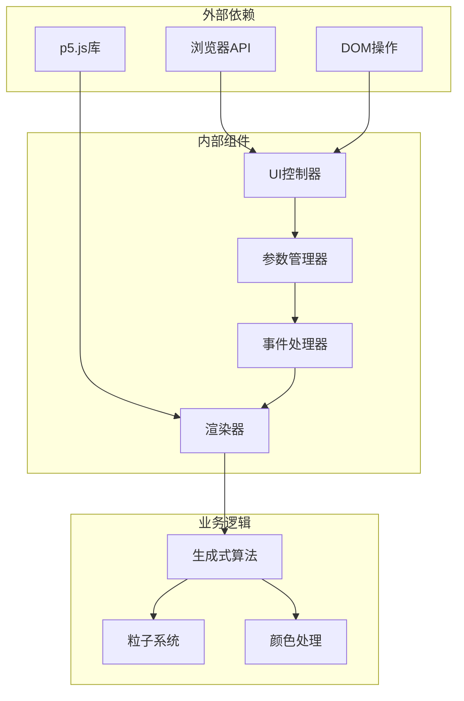

# 参数控制系统

<cite>
**本文档引用的文件**
- [viewer.html](file://skills/skills/algorithmic-art/templates/viewer.html)
- [generator_template.js](file://skills/skills/algorithmic-art/templates/generator_template.js)
- [eval_review.html](file://skills/skills/skill-creator/assets/eval_review.html)
</cite>

## 目录
1. [简介](#简介)
2. [项目结构](#项目结构)
3. [核心组件](#核心组件)
4. [架构概览](#架构概览)
5. [详细组件分析](#详细组件分析)
6. [依赖关系分析](#依赖关系分析)
7. [性能考虑](#性能考虑)
8. [故障排除指南](#故障排除指南)
9. [结论](#结论)

## 简介

参数控制系统是生成式艺术应用的核心组件，它允许用户通过直观的界面实时调整算法参数，从而探索不同的视觉效果和行为模式。本系统基于p5.js框架构建，提供了完整的参数控制解决方案，包括数值参数、颜色参数和布尔参数的管理。

该系统采用模块化设计，将参数定义、UI控制、事件处理和渲染逻辑分离，确保了代码的可维护性和扩展性。通过标准化的参数命名约定和统一的更新机制，开发者可以轻松地为任何生成式算法添加交互式控制功能。

## 项目结构

参数控制系统主要由以下三个核心部分组成：

**图表来源**
- [viewer.html:1-599](file://skills/skills/algorithmic-art/templates/viewer.html#L1-L599)
- [generator_template.js:1-223](file://skills/skills/algorithmic-art/templates/generator_template.js#L1-L223)

**章节来源**
- [viewer.html:1-599](file://skills/skills/algorithmic-art/templates/viewer.html#L1-L599)
- [generator_template.js:1-223](file://skills/skills/algorithmic-art/templates/generator_template.js#L1-L223)

## 核心组件

### 参数管理器

参数管理系统是整个控制的核心，负责存储和管理所有可调节的参数。它采用单一数据源原则，确保UI状态与算法状态保持同步。

**图表来源**
- [viewer.html:445-454](file://skills/skills/algorithmic-art/templates/viewer.html#L445-L454)
- [viewer.html:522-528](file://skills/skills/algorithmic-art/templates/viewer.html#L522-L528)

### 控制界面组件

系统提供了三种主要的参数控制类型，每种都有专门的UI组件和处理逻辑：

#### 数值参数控件（滑块）
- **控件类型**: HTML range input
- **适用场景**: 流速、数量、比例等连续数值
- **特点**: 支持最小值、最大值、步长设置
- **实时反馈**: oninput事件提供即时响应

#### 颜色参数控件（颜色选择器）
- **控件类型**: HTML color input
- **适用场景**: 主色调、辅助色、强调色
- **特点**: 即时颜色预览和十六进制值显示
- **格式支持**: RGB、HSL、十六进制等多种格式

#### 布尔参数控件（复选框）
- **控件类型**: HTML checkbox
- **适用场景**: 开关状态、启用/禁用选项
- **特点**: 状态切换动画和视觉反馈
- **布局**: 自定义toggle样式

**章节来源**
- [viewer.html:140-232](file://skills/skills/algorithmic-art/templates/viewer.html#L140-L232)
- [viewer.html:355-421](file://skills/skills/algorithmic-art/templates/viewer.html#L355-L421)

## 架构概览

参数控制系统采用分层架构设计，确保各组件职责清晰、耦合度低：

**图表来源**
- [viewer.html:358](file://skills/skills/algorithmic-art/templates/viewer.html#L358)
- [viewer.html:522](file://skills/skills/algorithmic-art/templates/viewer.html#L522)

### 数据流架构

系统采用单向数据流模式，确保状态变更的可预测性和可追踪性：

**图表来源**
- [viewer.html:538-548](file://skills/skills/algorithmic-art/templates/viewer.html#L538-L548)
- [viewer.html:522-528](file://skills/skills/algorithmic-art/templates/viewer.html#L522-L528)

## 详细组件分析

### 参数定义与初始化

参数系统采用集中式定义方式，所有可调节参数都存储在一个统一的对象中：

#### 参数对象结构
- **种子参数**: 用于控制随机数生成的确定性
- **数值参数**: 包含范围、步长和默认值
- **颜色参数**: 存储颜色调色板数组
- **布尔参数**: 控制开关状态的标志位

#### 默认值管理
系统自动创建默认参数快照，用于一键重置功能：
- 深拷贝原始参数配置
- 存储在独立的defaultParams对象中
- 支持完全还原到初始状态

**章节来源**
- [viewer.html:445-454](file://skills/skills/algorithmic-art/templates/viewer.html#L445-L454)
- [viewer.html:568-591](file://skills/skills/algorithmic-art/templates/viewer.html#L568-L591)

### 事件处理机制

系统实现了完整的事件处理链路，确保用户交互能够及时反映到算法执行中：

#### 实时参数更新
- **滑块控件**: 使用oninput事件实现实时更新
- **颜色控件**: 使用onchange事件在选择后更新
- **文本输入**: 使用onchange事件在失焦时更新

#### 参数验证流程

**图表来源**
- [viewer.html:522-528](file://skills/skills/algorithmic-art/templates/viewer.html#L522-L528)
- [viewer.html:538-548](file://skills/skills/algorithmic-art/templates/viewer.html#L538-L548)

**章节来源**
- [viewer.html:358](file://skills/skills/algorithmic-art/templates/viewer.html#L358)
- [viewer.html:399](file://skills/skills/algorithmic-art/templates/viewer.html#L399)

### UI状态管理

系统提供了完整的UI状态管理机制，确保用户界面与参数状态保持同步：

#### 实时显示更新
- **数值显示**: 动态更新对应的value-display元素
- **颜色预览**: 实时显示当前选择的颜色值
- **种子显示**: 同步更新种子输入框的值

#### 状态一致性保证
- 所有参数更新都通过统一的接口进行
- UI元素的值与参数对象保持双向同步
- 错误状态下的回滚机制

**章节来源**
- [viewer.html:572-589](file://skills/skills/algorithmic-art/templates/viewer.html#L572-L589)
- [viewer.html:534-536](file://skills/skills/algorithmic-art/templates/viewer.html#L534-L536)

### 种子控制系统

种子控制是生成式艺术的重要特性，确保相同的参数配置产生相同的结果：

#### 种子管理机制
- **唯一性**: 每个种子对应唯一的随机序列
- **导航功能**: 提供上一个、下一个、随机种子等功能
- **手动输入**: 允许用户直接输入种子值

#### 确定性渲染
- 在每次渲染前重新播种随机数生成器
- 确保噪声函数也使用相同的种子
- 保证粒子系统等复杂算法的一致性

**章节来源**
- [viewer.html:538-566](file://skills/skills/algorithmic-art/templates/viewer.html#L538-L566)
- [viewer.html:477-478](file://skills/skills/algorithmic-art/templates/viewer.html#L477-L478)

## 依赖关系分析

参数控制系统与其他组件的依赖关系如下：

**图表来源**
- [viewer.html:23](file://skills/skills/algorithmic-art/templates/viewer.html#L23)
- [viewer.html:465-505](file://skills/skills/algorithmic-art/templates/viewer.html#L465-L505)

### 组件耦合度分析

系统采用了松耦合的设计原则：
- **参数管理器**与**UI控制器**通过事件通信
- **渲染器**不直接依赖具体的UI实现
- **算法逻辑**与**用户界面**完全分离

这种设计使得系统具有良好的可测试性和可维护性。

**章节来源**
- [viewer.html:445-599](file://skills/skills/algorithmic-art/templates/viewer.html#L445-L599)

## 性能考虑

### 实时更新优化

为了确保流畅的用户体验，系统采用了多种性能优化策略：

#### 事件节流
- 滑块拖动使用oninput事件，避免频繁的DOM操作
- 颜色选择使用onchange事件，减少不必要的重绘
- 种子更改使用防抖机制，避免过度计算

#### 渲染优化
- 只更新发生变化的参数对应的UI元素
- 使用requestAnimationFrame进行平滑动画
- 避免在渲染过程中进行昂贵的计算

#### 内存管理
- 合理使用闭包和事件监听器
- 及时清理不再使用的DOM引用
- 避免内存泄漏

### 大规模参数处理

对于包含大量参数的复杂系统，建议采用以下策略：

#### 分组管理
- 将相关参数组织在逻辑分组中
- 支持参数的折叠和展开
- 提供参数搜索和过滤功能

#### 懒加载机制
- 只在需要时初始化复杂的参数控件
- 延迟加载高成本的可视化组件
- 使用虚拟滚动处理大量列表项

## 故障排除指南

### 常见问题及解决方案

#### 参数更新不生效
**症状**: 修改参数后界面没有变化
**可能原因**:
- 事件处理器未正确绑定
- 参数名称不匹配
- DOM元素ID错误

**解决步骤**:
1. 检查HTML中控件的id属性
2. 验证JavaScript函数名是否正确
3. 确认参数对象中存在对应键值

#### 数值范围错误
**症状**: 输入超出范围的数值时出现异常
**解决方法**:
- 在参数定义中设置合理的min/max值
- 添加输入验证和边界检查
- 提供可视化的范围指示器

#### 颜色格式问题
**症状**: 颜色选择器无法正常工作
**解决步骤**:
1. 确认浏览器支持HTML5 color input
2. 检查CSS样式是否覆盖了原生样式
3. 验证颜色值格式的有效性

#### 性能问题
**症状**: 参数更新响应缓慢
**优化建议**:
- 减少不必要的DOM操作
- 使用事件委托处理多个控件
- 实现参数更新的批量处理

**章节来源**
- [viewer.html:522-591](file://skills/skills/algorithmic-art/templates/viewer.html#L522-L591)

### 调试技巧

#### 参数监控
- 使用浏览器开发者工具观察参数对象的变化
- 设置断点跟踪参数更新流程
- 记录参数更新的时间戳和频率

#### UI状态检查
- 验证所有UI元素与参数对象的同步状态
- 检查事件监听器的注册和移除
- 确认CSS样式类的正确应用

#### 性能分析
- 使用性能面板分析渲染时间
- 监控内存使用情况
- 识别潜在的性能瓶颈

## 结论

参数控制系统为生成式艺术应用提供了强大而灵活的交互能力。通过精心设计的架构和实现，系统实现了参数管理、UI控制和渲染逻辑的完美结合。

### 设计优势

1. **模块化设计**: 清晰的组件分离确保了代码的可维护性
2. **实时响应**: 优化的事件处理机制提供了流畅的用户体验
3. **类型安全**: 完善的参数验证机制防止了无效输入
4. **可扩展性**: 标准化的接口设计便于添加新的参数类型

### 最佳实践总结

1. **参数命名**: 使用描述性的参数名称，遵循统一的命名约定
2. **范围定义**: 为每个参数设置合理的默认值和边界范围
3. **UI设计**: 提供直观的控件类型和清晰的状态反馈
4. **性能优化**: 实现高效的事件处理和渲染机制
5. **错误处理**: 建立完善的错误检测和恢复机制

该参数控制系统不仅适用于生成式艺术，还可以扩展到其他需要参数调节的应用场景，为用户提供直观而强大的交互体验。