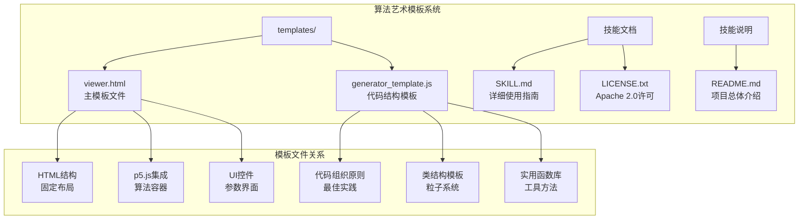
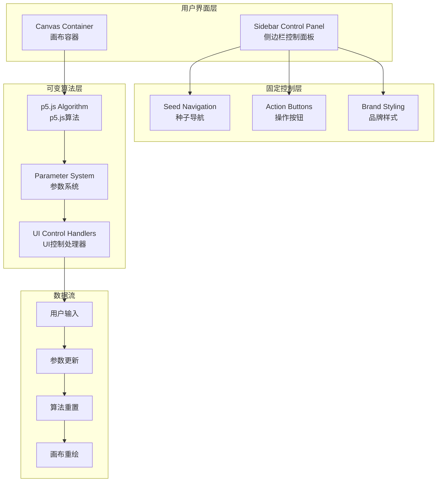
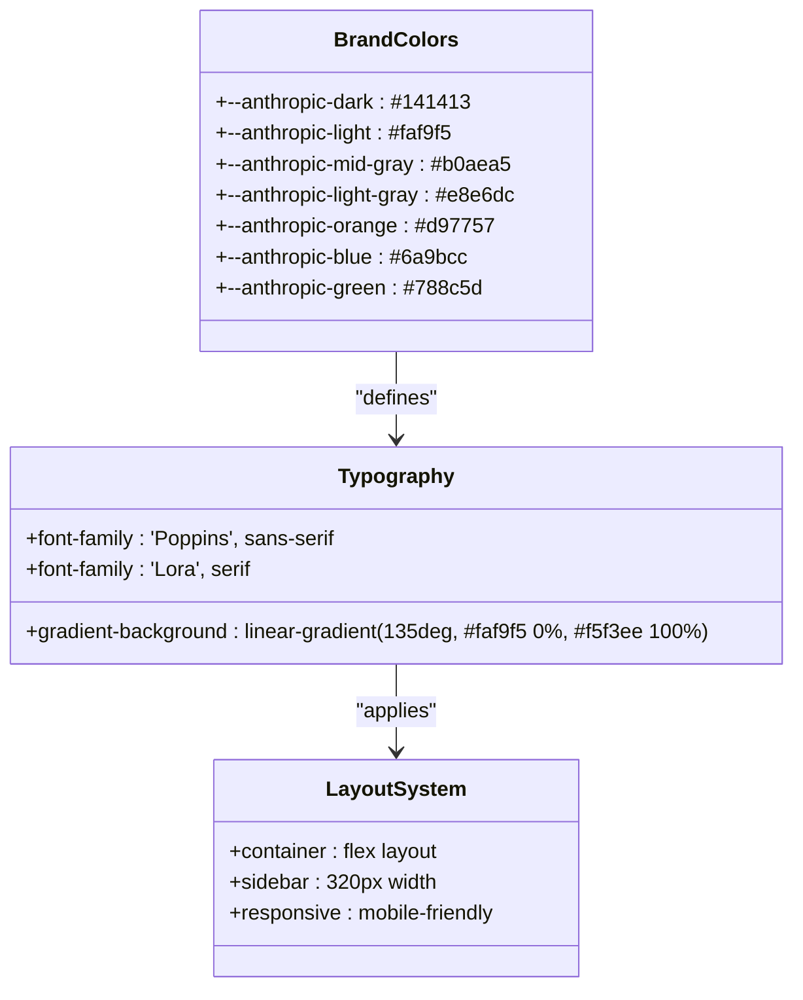
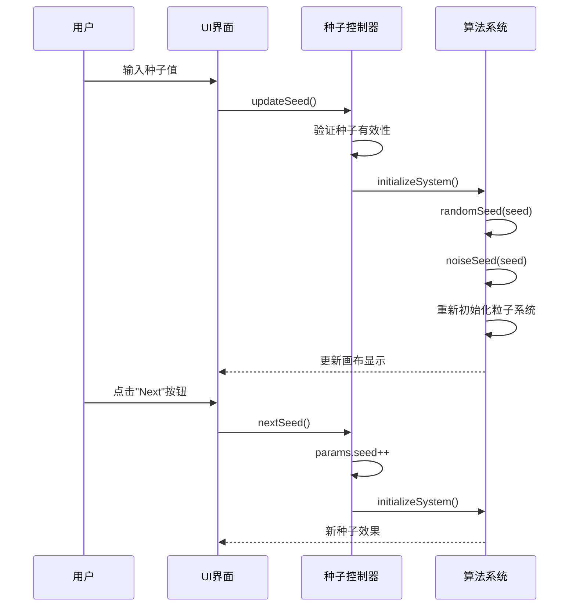
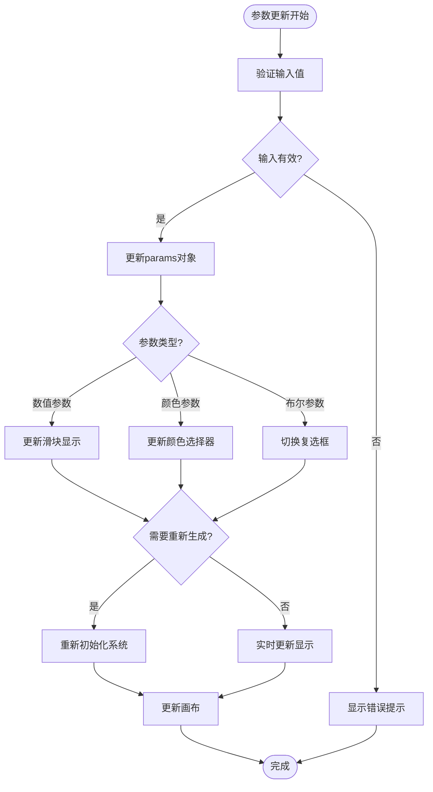

# 模板使用指南

<cite>
**本文档引用的文件**
- [viewer.html](file://skills/skills/algorithmic-art/templates/viewer.html)
- [generator_template.js](file://skills/skills/algorithmic-art/templates/generator_template.js)
- [SKILL.md](file://skills/skills/algorithmic-art/SKILL.md)
- [LICENSE.txt](file://skills/skills/algorithmic-art/LICENSE.txt)
- [README.md](file://skills/README.md)
</cite>

## 目录
1. [简介](#简介)
2. [项目结构概览](#项目结构概览)
3. [模板核心组件](#模板核心组件)
4. [架构总览](#架构总览)
5. [详细组件分析](#详细组件分析)
6. [固定部分详解](#固定部分详解)
7. [可变部分详解](#可变部分详解)
8. [模板复制与修改步骤](#模板复制与修改步骤)
9. [注释标记与占位符说明](#注释标记与占位符说明)
10. [常见错误与避免方法](#常见错误与避免方法)
11. [最佳实践建议](#最佳实践建议)
12. [故障排除指南](#故障排除指南)
13. [总结](#总结)

## 简介

本指南面向所有需要使用viewer.html模板创建交互式算法艺术作品的开发者。该模板是Anthropic算法艺术技能的核心基础，提供了完整的UI框架和p5.js集成环境。模板采用"固定部分+可变部分"的设计理念：固定部分确保用户体验的一致性和品牌一致性，可变部分则允许每个艺术作品展现独特的创意表达。

模板基于p5.js构建，支持实时参数调整、种子控制导航、颜色选择器等功能，能够创建从静态艺术到动态动画的完整交互体验。所有内容都内嵌在单个HTML文件中，无需外部依赖即可直接运行。

## 项目结构概览

算法艺术技能位于`skills/skills/algorithmic-art/`目录下，包含以下关键文件：



**图表来源**
- [viewer.html:1-599](file://skills/skills/algorithmic-art/templates/viewer.html#L1-L599)
- [generator_template.js:1-223](file://skills/skills/algorithmic-art/templates/generator_template.js#L1-L223)
- [SKILL.md:1-405](file://skills/skills/algorithmic-art/SKILL.md#L1-L405)

**章节来源**
- [SKILL.md:105-128](file://skills/skills/algorithmic-art/SKILL.md#L105-L128)
- [SKILL.md:221-258](file://skills/skills/algorithmic-art/SKILL.md#L221-L258)

## 模板核心组件

### 固定部分（必须保持不变）

模板的固定部分确保了统一的品牌体验和一致的用户界面：

1. **布局结构**：完整的三栏布局设计，包含侧边栏控制面板和主画布区域
2. **Anthropic品牌元素**：特定的颜色方案、字体选择和视觉风格
3. **种子控制系统**：完整的种子导航功能，包括前后切换、随机生成和跳转输入
4. **操作按钮**：标准化的操作界面，确保功能一致性

### 可变部分（需要定制）

可变部分允许每个艺术作品展现独特性：

1. **p5.js算法实现**：完全自定义的生成式算法
2. **参数对象定义**：根据艺术需求定制的参数集合
3. **参数控制界面**：匹配算法参数的UI控件
4. **颜色调色板**：可选的颜色控制功能

**章节来源**
- [viewer.html:3-17](file://skills/skills/algorithmic-art/templates/viewer.html#L3-L17)
- [SKILL.md:227-257](file://skills/skills/algorithmic-art/SKILL.md#L227-L257)

## 架构总览

模板采用分层架构设计，清晰分离了不同职责：



**图表来源**
- [viewer.html:332-438](file://skills/skills/algorithmic-art/templates/viewer.html#L332-L438)
- [viewer.html:440-597](file://skills/skills/algorithmic-art/templates/viewer.html#L440-L597)

## 详细组件分析

### 品牌样式系统

模板实现了完整的Anthropic品牌视觉系统：



**图表来源**
- [viewer.html:27-329](file://skills/skills/algorithmic-art/templates/viewer.html#L27-L329)

### 种子控制系统

种子控制是算法艺术的核心功能，提供了完整的可重现性机制：



**图表来源**
- [viewer.html:534-591](file://skills/skills/algorithmic-art/templates/viewer.html#L534-L591)

### 参数控制系统

参数控制系统提供了灵活的实时调整能力：



**图表来源**
- [viewer.html:522-528](file://skills/skills/algorithmic-art/templates/viewer.html#L522-L528)
- [viewer.html:568-591](file://skills/skills/algorithmic-art/templates/viewer.html#L568-L591)

**章节来源**
- [viewer.html:108-281](file://skills/skills/algorithmic-art/templates/viewer.html#L108-L281)
- [viewer.html:445-597](file://skills/skills/algorithmic-art/templates/viewer.html#L445-L597)

## 固定部分详解

### 布局结构

固定布局确保了跨设备的一致体验：

1. **容器系统**：使用flex布局实现响应式设计
2. **侧边栏宽度**：固定320px宽度，确保控制面板的可用性
3. **画布区域**：自适应宽度，支持最大1000px限制
4. **移动端适配**：小屏幕设备自动切换为垂直布局

### Anthropic品牌元素

品牌元素严格遵循Anthropic的设计规范：

1. **色彩系统**：使用官方品牌色彩，包括深灰、浅灰、橙色、蓝色、绿色
2. **字体系统**：Poppins用于标题和正文，Lora用于强调文本
3. **渐变背景**：使用135度角的柔和渐变
4. **阴影效果**：统一的卡片阴影和投影效果

### 种子控制功能

种子控制是算法艺术的核心特性：

1. **种子显示**：实时显示当前种子值
2. **导航按钮**：前一个、后一个、随机生成、跳转到指定种子
3. **输入验证**：确保种子值的有效性
4. **重新初始化**：每次种子变化时重新生成艺术

### 操作按钮

标准操作界面确保功能一致性：

1. **重置按钮**：恢复所有参数到默认值
2. **下载按钮**：保存当前艺术作品为PNG格式
3. **注册按钮**：用于特定功能的扩展

**章节来源**
- [viewer.html:52-328](file://skills/skills/algorithmic-art/templates/viewer.html#L52-L328)
- [viewer.html:339-429](file://skills/skills/algorithmic-art/templates/viewer.html#L339-L429)

## 可变部分详解

### p5.js算法实现

可变算法部分需要根据具体的艺术概念进行实现：

1. **参数组织**：将所有可调参数集中在一个对象中
2. **种子管理**：使用`randomSeed()`和`noiseSeed()`确保可重现性
3. **生命周期管理**：合理使用`setup()`和`draw()`函数
4. **类结构设计**：对于复杂系统，使用面向对象设计

### 参数对象定义

参数对象应该反映艺术作品的本质特征：

1. **种子参数**：始终包含，确保可重现性
2. **数量参数**：如粒子数量、形状数量等
3. **比例参数**：如大小比例、速度比例等
4. **阈值参数**：如触发条件、边界值等

### 参数控制界面

UI控件需要与算法参数精确对应：

1. **滑块控件**：用于连续数值范围的参数
2. **颜色选择器**：用于调色板和颜色相关参数
3. **输入框**：用于整数或特殊格式的参数
4. **复选框**：用于布尔类型的开关参数

**章节来源**
- [generator_template.js:15-176](file://skills/skills/algorithmic-art/templates/generator_template.js#L15-L176)
- [viewer.html:445-516](file://skills/skills/algorithmic-art/templates/viewer.html#L445-L516)

## 模板复制与修改步骤

### 步骤一：准备阶段

1. **备份原始模板**：在开始任何修改之前，先保存一份原始模板的副本
2. **理解整体结构**：仔细阅读模板文件，理解各个部分的作用
3. **确定艺术概念**：明确要实现的艺术风格和技术要求

### 步骤二：识别需要替换的区域

根据模板中的注释标记，识别需要修改的部分：

```mermaid
flowchart LR
A[开始复制流程] --> B{查找注释标记}
B --> C["查找"固定部分"标记]
B --> D["查找"可变部分"标记]
C --> E["保留这些区域"]
D --> F["替换这些区域"]
E --> G[固定区域：保持不变]
F --> H[可变区域：需要定制]
G --> I[完成固定部分处理]
H --> J[开始可变部分定制]
J --> K[完成最终检查]
K --> L[发布成品]
```

**图表来源**
- [viewer.html:3-17](file://skills/skills/algorithmic-art/templates/viewer.html#L3-L17)

### 步骤三：保持模板完整性

在修改过程中，必须严格遵守以下规则：

1. **布局结构**：不要改变HTML的整体结构和类名
2. **品牌元素**：不要修改CSS变量和颜色值
3. **JavaScript函数**：不要删除或重命名现有函数
4. **事件绑定**：不要移除现有的事件监听器

### 步骤四：避免常见模板使用错误

#### 错误类型一：破坏固定部分
- ❌ 删除或修改种子控制功能
- ❌ 改变侧边栏的结构布局
- ❌ 更换品牌颜色或字体

#### 错误类型二：参数不匹配
- ❌ 添加UI控件但没有对应的参数
- ❌ 修改参数名称但忘记更新UI
- ❌ 忘记在reset功能中重置新参数

#### 错误类型三：算法实现问题
- ❌ 忘记使用种子进行随机化
- ❌ 没有实现参数更新逻辑
- ❌ 算法性能不佳影响用户体验

**章节来源**
- [SKILL.md:105-127](file://skills/skills/algorithmic-art/SKILL.md#L105-L127)
- [SKILL.md:227-257](file://skills/skills/algorithmic-art/SKILL.md#L227-L257)

## 注释标记与占位符说明

模板使用了详细的注释标记来指导开发者：

### 主要注释标记

| 注释标记 | 作用 | 使用位置 |
|---------|------|----------|
| `<!-- WHAT TO KEEP: -->` | 标识必须保持不变的部分 | 文件开头 |
| `<!-- WHAT TO CREATIVELY EDIT: -->` | 标识可以自由修改的部分 | 文件开头 |
| `<!-- Headers (CUSTOMIZE THIS FOR YOUR ART) -->` | 标题区域的修改提示 | 侧边栏顶部 |
| `<!-- Particle Count -->` | 参数控件的修改提示 | 参数控制区域 |

### 占位符说明

模板中包含多个占位符，需要根据具体艺术作品进行替换：

1. **标题占位符**：`<h1>TITLE - EDIT</h1>`
2. **副标题占位符**：`<div class="subtitle">SUBHEADER - EDIT</div>`
3. **算法实现占位符**：
   - `// fill this in` 在`generateFlowField()`函数中
   - `// fill this in` 在`draw()`函数中
   - `// fill this in` 在`Particle`类构造函数中

### 更新标记

模板还包含了更新标记，用于标识需要修改的代码段：

```javascript
// ═══════════════════════════════════════════════════════════════════════
// GENERATIVE ART PARAMETERS - CUSTOMIZE FOR YOUR ALGORITHM
// ═══════════════════════════════════════════════════════════════════════
```

这些标记清楚地指示了参数定义区域，需要根据具体算法进行定制。

**章节来源**
- [viewer.html:2-17](file://skills/skills/algorithmic-art/templates/viewer.html#L2-L17)
- [viewer.html:445-516](file://skills/skills/algorithmic-art/templates/viewer.html#L445-L516)

## 常见错误与避免方法

### 错误一：种子控制功能失效

**问题表现**：
- 种子导航按钮无响应
- 种子值无法正确更新
- 艺术效果不随种子变化

**解决方法**：
1. 确保`updateSeed()`函数正确实现
2. 验证`initializeSystem()`函数被正确调用
3. 检查`randomSeed()`和`noiseSeed()`的调用顺序

### 错误二：参数控件不工作

**问题表现**：
- 滑块无法拖动
- 数值显示不更新
- 参数变化不反映在画布上

**解决方法**：
1. 确保每个参数都有对应的HTML控件
2. 验证`updateParam()`函数的实现
3. 检查参数更新后的重绘逻辑

### 错误三：性能问题

**问题表现**：
- 页面加载缓慢
- 动画帧率低
- 浏览器卡顿

**解决方法**：
1. 优化算法复杂度
2. 减少不必要的计算
3. 使用适当的粒子数量
4. 实现必要的性能优化

### 错误四：品牌元素被意外修改

**问题表现**：
- 颜色方案改变
- 字体样式异常
- 布局错乱

**解决方法**：
1. 严格遵循品牌规范
2. 不要修改CSS变量
3. 保持布局结构不变

**章节来源**
- [viewer.html:534-591](file://skills/skills/algorithmic-art/templates/viewer.html#L534-L591)
- [SKILL.md:201-210](file://skills/skills/algorithmic-art/SKILL.md#L201-L210)

## 最佳实践建议

### 代码组织最佳实践

1. **参数集中管理**：将所有可调参数放在单一对象中
2. **函数职责分离**：每个函数只负责单一功能
3. **错误处理完善**：为关键操作添加适当的错误处理
4. **性能监控**：定期检查算法性能，必要时进行优化

### 用户体验最佳实践

1. **响应式设计**：确保在各种设备上都能正常工作
2. **加载状态**：提供适当的加载指示器
3. **实时反馈**：参数变化应立即反映在画布上
4. **无障碍访问**：考虑不同用户的需求

### 开发流程最佳实践

1. **版本控制**：使用Git跟踪所有修改
2. **测试策略**：在不同种子值下测试算法稳定性
3. **文档记录**：为算法参数添加详细的说明
4. **性能基准**：建立性能基准线，监控改进效果

**章节来源**
- [generator_template.js:15-176](file://skills/skills/algorithmic-art/templates/generator_template.js#L15-L176)
- [SKILL.md:201-210](file://skills/skills/algorithmic-art/SKILL.md#L201-L210)

## 故障排除指南

### 常见问题诊断

#### 问题：页面空白或加载失败

**可能原因**：
- p5.js CDN连接失败
- JavaScript语法错误
- HTML结构损坏

**解决步骤**：
1. 打开浏览器开发者工具
2. 检查网络面板中的CDN资源加载
3. 查看控制台中的JavaScript错误
4. 验证HTML结构的完整性

#### 问题：种子控制功能异常

**可能原因**：
- 种子值验证逻辑错误
- 初始化函数调用时机不当
- 事件监听器绑定失败

**解决步骤**：
1. 检查`updateSeed()`函数的输入验证
2. 确认`initializeSystem()`在适当时候被调用
3. 验证DOM元素的选择器是否正确

#### 问题：参数更新不生效

**可能原因**：
- 参数对象未正确更新
- UI控件与参数不匹配
- 重绘逻辑缺失

**解决步骤**：
1. 在浏览器调试器中检查参数对象状态
2. 验证HTML控件的id属性与JavaScript代码一致
3. 确保实现了适当的重绘或重新初始化逻辑

### 性能优化建议

#### 优化策略

1. **算法复杂度优化**：
   - 使用空间索引减少碰撞检测
   - 实现对象池减少内存分配
   - 采用近似算法提高计算效率

2. **渲染性能优化**：
   - 合并绘制调用
   - 使用离屏渲染缓存静态元素
   - 实现视口裁剪减少绘制

3. **内存管理优化**：
   - 及时清理不再使用的对象
   - 避免内存泄漏
   - 合理使用垃圾回收

### 调试技巧

#### 开发者工具使用

1. **断点调试**：在关键函数设置断点，逐步执行
2. **变量监视**：观察关键变量的变化过程
3. **性能分析**：使用浏览器性能面板分析瓶颈
4. **网络监控**：检查外部资源加载情况

#### 日志输出

1. **关键节点日志**：在重要算法节点添加日志输出
2. **参数状态日志**：记录参数变化的详细信息
3. **性能指标**：记录帧率和内存使用情况

**章节来源**
- [viewer.html:534-591](file://skills/skills/algorithmic-art/templates/viewer.html#L534-L591)
- [generator_template.js:113-126](file://skills/skills/algorithmic-art/templates/generator_template.js#L113-L126)

## 总结

viewer.html模板为算法艺术创作提供了一个强大而灵活的基础平台。通过严格区分固定部分和可变部分，开发者可以在保持一致用户体验的同时，充分发挥创意表达的空间。

### 关键要点回顾

1. **固定部分的重要性**：确保品牌一致性、用户体验稳定性和功能完整性
2. **可变部分的灵活性**：允许每个艺术作品展现独特的创意和技术特色
3. **种子控制的核心价值**：提供算法艺术的可重现性和探索能力
4. **参数系统的优雅设计**：实现直观的实时调整和深度定制

### 未来发展方向

随着算法艺术技术的不断发展，模板系统也在持续演进：

1. **增强的可视化工具**：提供更丰富的参数可视化和交互方式
2. **性能优化**：支持更大规模的算法和更复杂的艺术效果
3. **协作功能**：支持多人协作创作和版本管理
4. **导出功能**：提供多种格式的高质量导出选项

通过遵循本指南的建议和最佳实践，开发者可以充分利用模板的优势，创造出既美观又功能强大的算法艺术作品。记住，模板只是起点，真正的价值在于如何运用它来表达独特的艺术理念和技术洞察。