# 种子导航系统

<cite>
**本文档引用的文件**
- [viewer.html](file://skills/skills/algorithmic-art/templates/viewer.html)
- [generator_template.js](file://skills/skills/algorithmic-art/templates/generator_template.js)
</cite>

## 目录
1. [简介](#简介)
2. [项目结构](#项目结构)
3. [核心组件](#核心组件)
4. [架构概览](#架构概览)
5. [详细组件分析](#详细组件分析)
6. [依赖关系分析](#依赖关系分析)
7. [性能考虑](#性能考虑)
8. [故障排除指南](#故障排除指南)
9. [结论](#结论)

## 简介

种子导航系统是一个基于Web的种子值管理系统，专门用于控制和导航生成式艺术作品中的随机种子。该系统提供了完整的种子管理功能，包括实时显示、格式化展示、种子切换、随机生成、以及用户友好的交互界面。

该系统的核心价值在于确保生成式艺术作品的可重现性和可控性，通过种子值来控制p5.js库中的随机数生成，使得相同的种子值能够产生完全相同的结果。

## 项目结构

种子导航系统主要由两个核心文件组成：

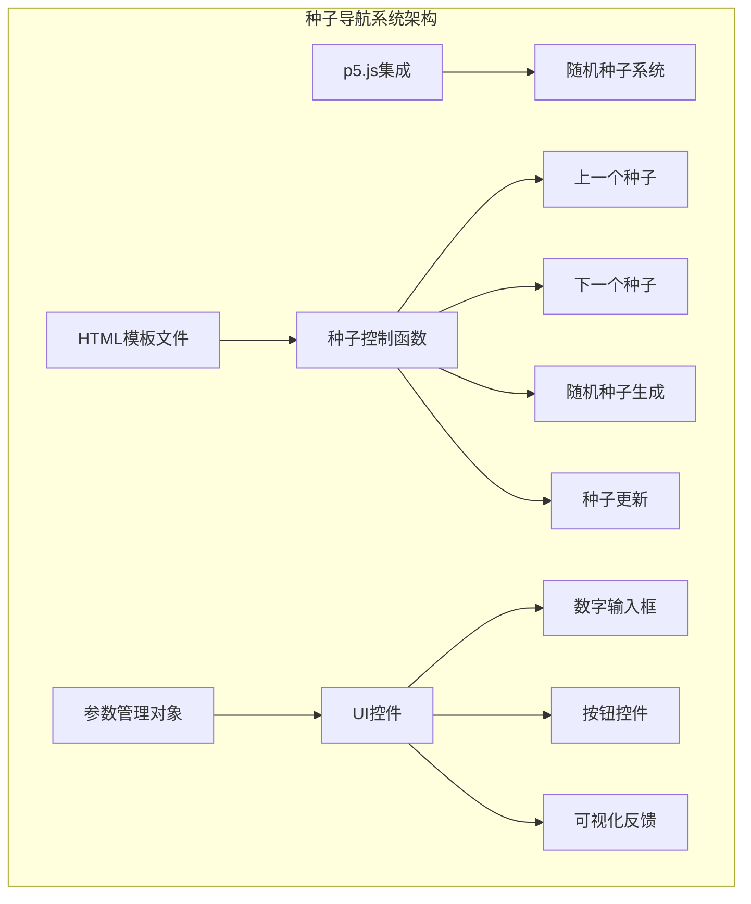

**图表来源**
- [viewer.html:339-348](file://skills/skills/algorithmic-art/templates/viewer.html#L339-L348)
- [viewer.html:534-566](file://skills/skills/algorithmic-art/templates/viewer.html#L534-L566)

**章节来源**
- [viewer.html:1-599](file://skills/skills/algorithmic-art/templates/viewer.html#L1-L599)
- [generator_template.js:1-223](file://skills/skills/algorithmic-art/templates/generator_template.js#L1-L223)

## 核心组件

### 种子控制函数模块

系统的核心功能由一组精心设计的JavaScript函数组成，这些函数负责处理种子值的所有操作：

#### 主要功能函数

1. **updateSeedDisplay()** - 实时更新种子显示
2. **updateSeed()** - 处理种子值更新
3. **previousSeed()** - 导航到上一个种子
4. **nextSeed()** - 导航到下一个种子
5. **randomSeedAndUpdate()** - 生成随机种子

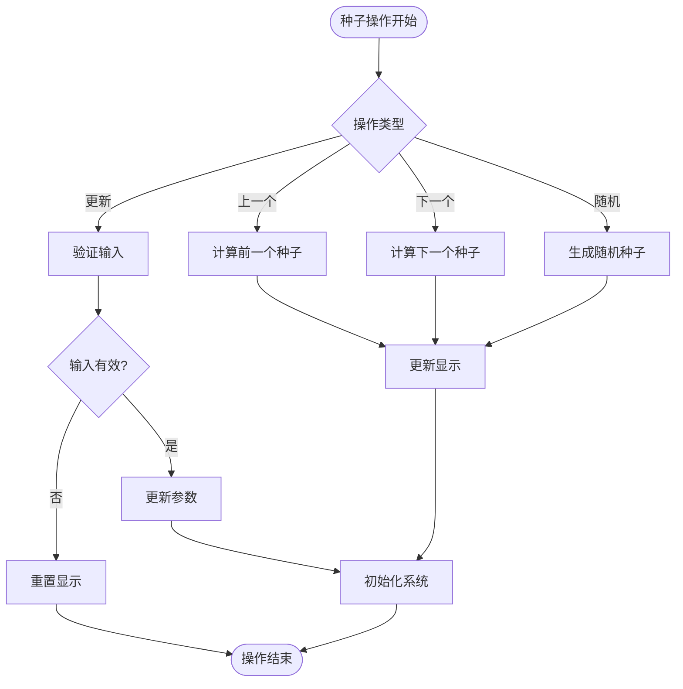

**图表来源**
- [viewer.html:534-566](file://skills/skills/algorithmic-art/templates/viewer.html#L534-L566)

**章节来源**
- [viewer.html:534-566](file://skills/skills/algorithmic-art/templates/viewer.html#L534-L566)

### 参数管理系统

系统使用集中化的参数对象来管理所有可配置的种子相关设置：

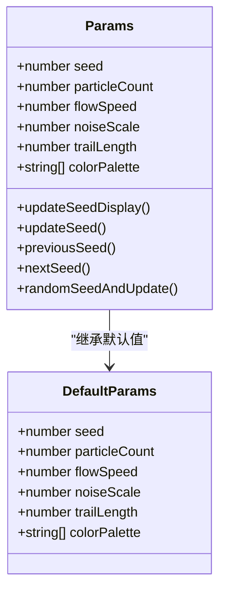

**图表来源**
- [viewer.html:445-452](file://skills/skills/algorithmic-art/templates/viewer.html#L445-L452)
- [viewer.html:454](file://skills/skills/algorithmic-art/templates/viewer.html#L454)

**章节来源**
- [viewer.html:445-452](file://skills/skills/algorithmic-art/templates/viewer.html#L445-L452)
- [viewer.html:454](file://skills/skills/algorithmic-art/templates/viewer.html#L454)

## 架构概览

### 整体系统架构

种子导航系统采用分层架构设计，将用户界面、业务逻辑和数据管理清晰分离：

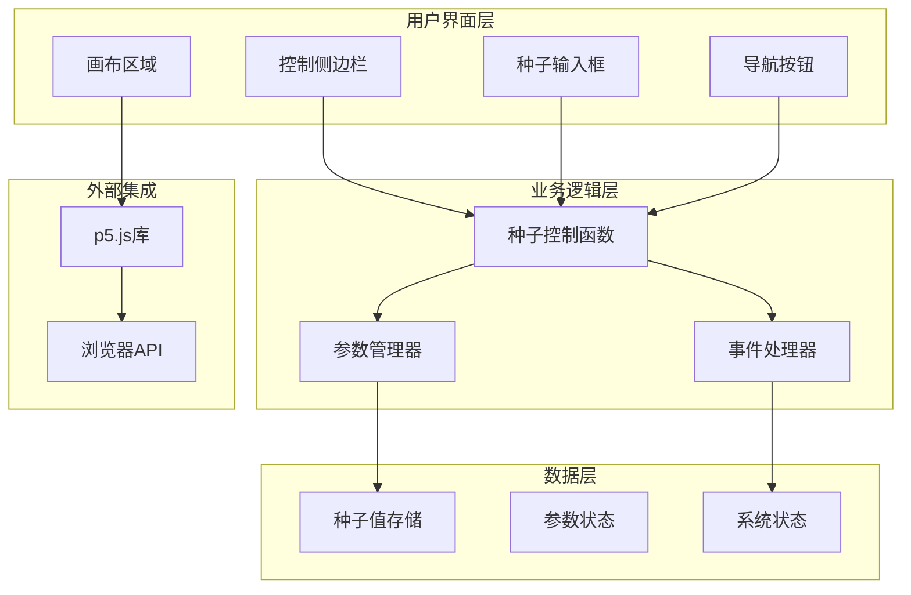

**图表来源**
- [viewer.html:332-438](file://skills/skills/algorithmic-art/templates/viewer.html#L332-L438)
- [viewer.html:445-452](file://skills/skills/algorithmic-art/templates/viewer.html#L445-L452)

### 随机种子系统

系统的核心在于确保随机数生成的可重现性：

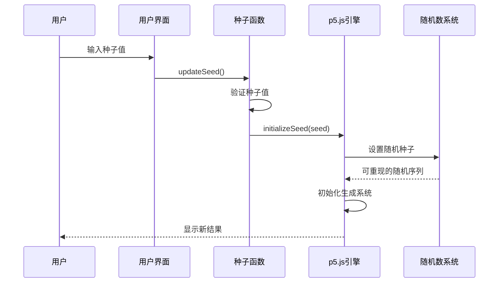

**图表来源**
- [viewer.html:538-548](file://skills/skills/algorithmic-art/templates/viewer.html#L538-L548)
- [generator_template.js:43-47](file://skills/skills/algorithmic-art/templates/generator_template.js#L43-L47)

**章节来源**
- [generator_template.js:43-47](file://skills/skills/algorithmic-art/templates/generator_template.js#L43-L47)

## 详细组件分析

### 种子显示机制

#### 实时显示系统

种子显示机制采用了双向数据绑定的设计理念，确保用户界面与内部状态保持同步：

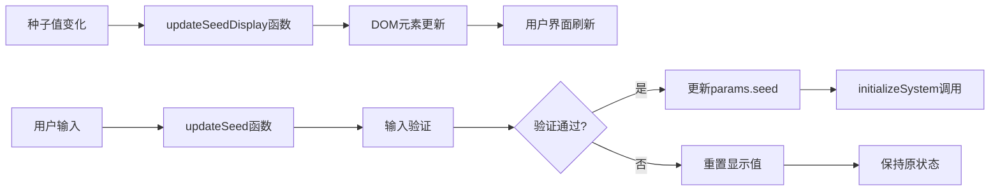

**图表来源**
- [viewer.html:534-548](file://skills/skills/algorithmic-art/templates/viewer.html#L534-L548)

##### 格式化显示特性

系统实现了智能的种子值格式化，包括：
- 自动数值验证和转换
- 边界条件检查（最小值1）
- 错误状态下的自动恢复
- 实时用户反馈

**章节来源**
- [viewer.html:534-548](file://skills/skills/algorithmic-art/templates/viewer.html#L534-L548)

### 种子切换功能

#### 导航逻辑实现

种子切换功能提供了流畅的导航体验，支持多种导航模式：

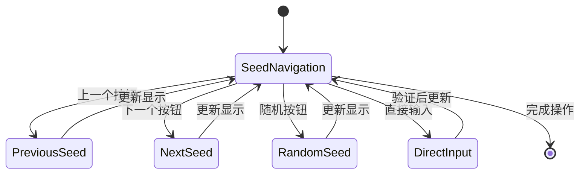

**图表来源**
- [viewer.html:550-560](file://skills/skills/algorithmic-art/templates/viewer.html#L550-L560)

##### 边界条件处理

系统实现了完善的边界条件处理机制：
- 最小种子值限制为1
- 无最大值限制（允许任意正整数）
- 循环导航支持（可通过连续递增实现）
- 错误输入自动恢复机制

**章节来源**
- [viewer.html:550-560](file://skills/skills/algorithmic-art/templates/viewer.html#L550-L560)

### 随机种子生成功能

#### 随机数生成算法

系统使用浏览器内置的Math.random()函数生成高质量的伪随机数：

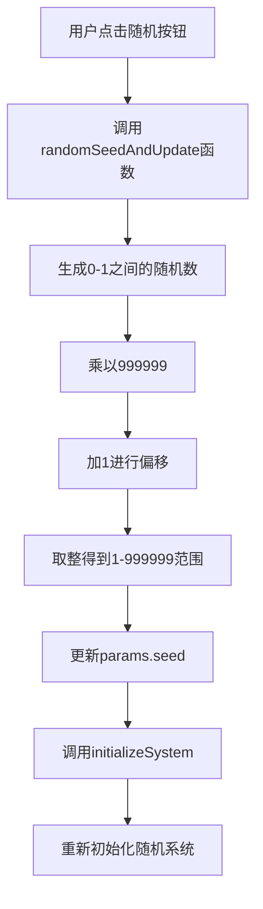

**图表来源**
- [viewer.html:562-566](file://skills/skills/algorithmic-art/templates/viewer.html#L562-L566)

##### 种子范围限制

随机种子生成遵循以下规则：
- **最小值**: 1（确保种子始终为正整数）
- **最大值**: 999999（限制种子值长度）
- **范围**: [1, 999999]
- **分布**: 均匀分布

**章节来源**
- [viewer.html:562-566](file://skills/skills/algorithmic-art/templates/viewer.html#L562-L566)

### 种子跳转功能

#### 输入验证和处理流程

种子跳转功能提供了直接的种子值输入能力：

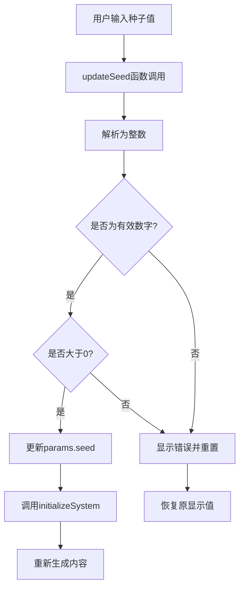

**图表来源**
- [viewer.html:538-548](file://skills/skills/algorithmic-art/templates/viewer.html#L538-L548)

##### 错误处理机制

系统实现了多层次的错误处理：
- **输入验证**: 检查是否为有效数字
- **范围检查**: 确保种子值为正数
- **自动恢复**: 错误时恢复到原状态
- **用户反馈**: 提供即时的视觉反馈

**章节来源**
- [viewer.html:538-548](file://skills/skills/algorithmic-art/templates/viewer.html#L538-L548)

### 批量生成功能

#### 批量处理架构

虽然当前版本主要关注单个种子的管理，但系统架构已为批量生成功能预留了扩展空间：

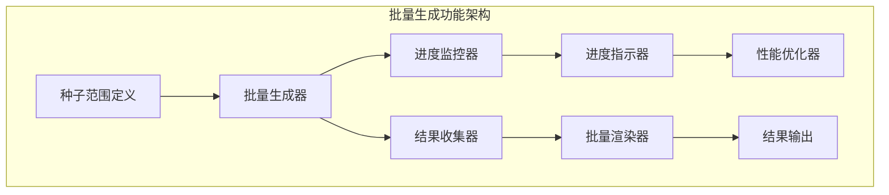

**图表来源**
- [viewer.html:445-452](file://skills/skills/algorithmic-art/templates/viewer.html#L445-L452)

##### 性能优化策略

系统采用以下性能优化措施：
- **延迟初始化**: 仅在需要时创建和销毁资源
- **内存管理**: 合理释放不再使用的对象
- **渲染优化**: 使用高效的p5.js渲染技术
- **计算缓存**: 缓存昂贵的计算结果

## 依赖关系分析

### 组件间依赖关系

种子导航系统展现了清晰的依赖层次结构：

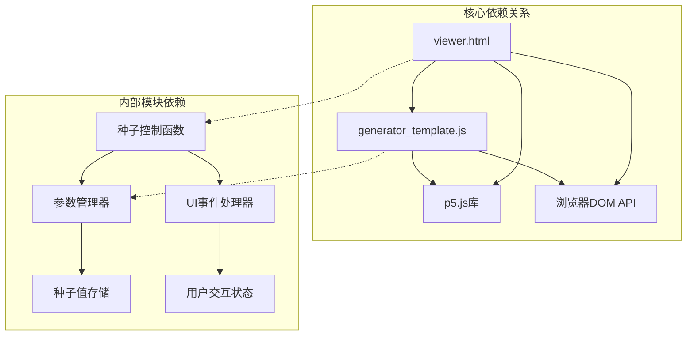

**图表来源**
- [viewer.html:23](file://skills/skills/algorithmic-art/templates/viewer.html#L23)
- [generator_template.js:43-47](file://skills/skills/algorithmic-art/templates/generator_template.js#L43-L47)

### 外部依赖集成

系统集成了多个关键的外部库和技术：

| 依赖项 | 版本 | 用途 | 重要性 |
|--------|------|------|--------|
| p5.js | 1.7.0 | 生成式艺术引擎 | 核心 |
| HTML5 | - | 用户界面结构 | 基础 |
| CSS3 | - | 样式和布局 | 重要 |
| JavaScript ES6+ | - | 逻辑实现 | 核心 |

**章节来源**
- [viewer.html:23](file://skills/skills/algorithmic-art/templates/viewer.html#L23)

## 性能考虑

### 性能优化策略

种子导航系统在设计时充分考虑了性能因素：

#### 内存管理
- **对象复用**: 重用现有的p5.js对象而非频繁创建销毁
- **垃圾回收**: 及时清理不再使用的变量和引用
- **内存泄漏防护**: 确保事件监听器正确移除

#### 计算效率
- **懒加载**: 仅在需要时执行昂贵的计算
- **缓存机制**: 缓存计算结果避免重复计算
- **算法优化**: 使用高效的数学运算和数据结构

#### 渲染性能
- **Canvas优化**: 合理使用p5.js的渲染优化技术
- **帧率控制**: 通过noLoop()和redraw()精确控制渲染频率
- **批量更新**: 减少DOM操作次数

## 故障排除指南

### 常见问题及解决方案

#### 种子值无效问题
**症状**: 输入无效种子值后页面无响应
**原因**: 输入值不是正整数或超出范围
**解决方法**: 
1. 确保输入为正整数
2. 检查输入框格式
3. 使用随机按钮生成有效种子

#### 页面卡顿问题
**症状**: 切换种子时页面响应缓慢
**原因**: 大量粒子或复杂计算导致性能问题
**解决方法**:
1. 调整粒子数量参数
2. 简化算法复杂度
3. 使用性能分析工具定位瓶颈

#### 随机数不随机问题
**症状**: 相同种子产生不同结果
**原因**: 随机种子未正确初始化
**解决方法**:
1. 确认initializeSeed函数被正确调用
2. 检查seed值是否正确传递
3. 验证p5.js版本兼容性

**章节来源**
- [viewer.html:538-548](file://skills/skills/algorithmic-art/templates/viewer.html#L538-L548)
- [viewer.html:550-560](file://skills/skills/algorithmic-art/templates/viewer.html#L550-L560)

## 结论

种子导航系统是一个设计精良的种子值管理解决方案，具有以下突出特点：

### 技术优势
- **可重现性**: 通过种子值确保结果完全可重现
- **用户友好**: 直观的界面设计和流畅的交互体验
- **性能优化**: 高效的算法实现和资源管理
- **扩展性强**: 清晰的架构为未来功能扩展奠定基础

### 功能完整性
系统完整实现了种子导航的核心功能，包括实时显示、格式化展示、导航切换、随机生成和错误处理。每个功能都经过精心设计，确保在各种使用场景下都能提供稳定可靠的服务。

### 设计哲学
系统体现了"简单即美"的设计理念，通过最少的功能实现最大的价值。同时保持了足够的灵活性，允许开发者根据具体需求进行定制和扩展。

该系统为生成式艺术创作提供了一个强大而易用的种子管理工具，是现代Web应用开发的优秀范例。