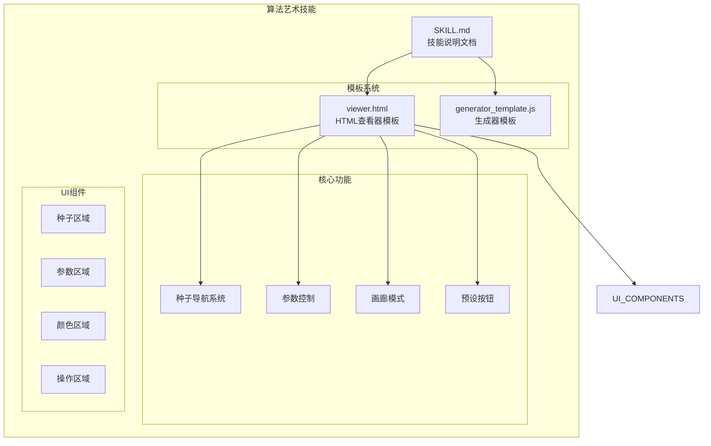
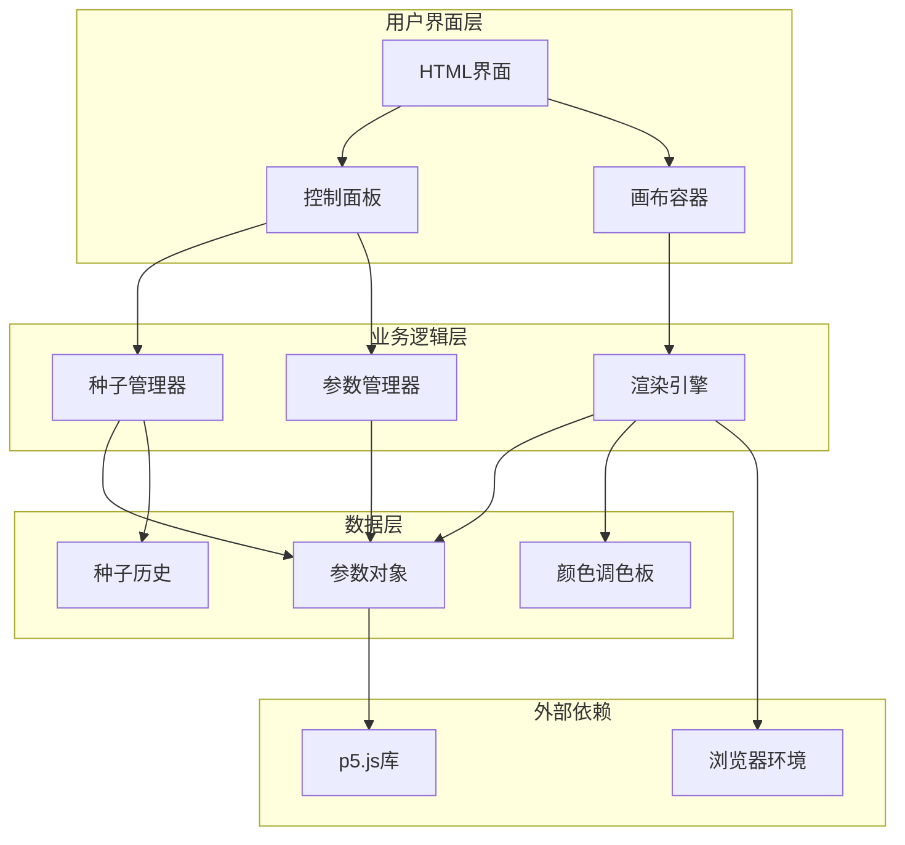
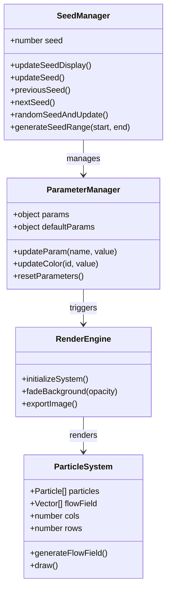
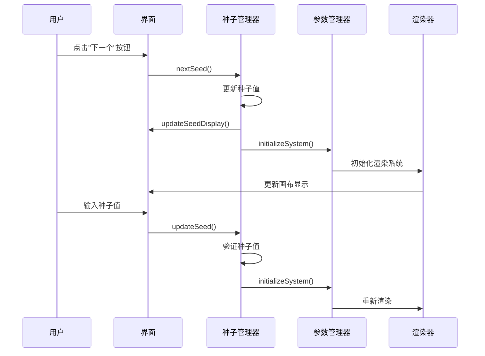
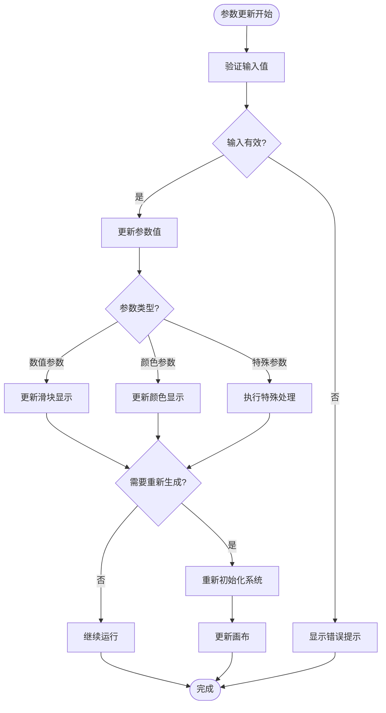
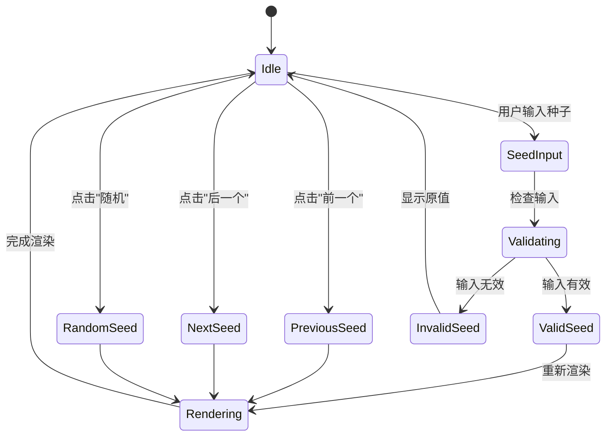

# 产物探索与变体

<cite>
**本文档引用的文件**
- [SKILL.md](file://skills/skills/algorithmic-art/SKILL.md)
- [viewer.html](file://skills/skills/algorithmic-art/templates/viewer.html)
- [generator_template.js](file://skills/skills/algorithmic-art/templates/generator_template.js)
</cite>

## 目录
1. [简介](#简介)
2. [项目结构](#项目结构)
3. [核心组件](#核心组件)
4. [架构概览](#架构概览)
5. [详细组件分析](#详细组件分析)
6. [种子导航系统](#种子导航系统)
7. [变体探索功能](#变体探索功能)
8. [高级功能实现](#高级功能实现)
9. [创作理念](#创作理念)
10. [性能考虑](#性能考虑)
11. [故障排除指南](#故障排除指南)
12. [结论](#结论)

## 简介

产物探索与变体功能是算法艺术技能的核心组成部分，它允许用户通过种子导航系统探索算法的不同变体和潜在可能性。该系统基于"从同一块版上印制一系列版画"的理念，其中算法保持一致，但每个种子揭示其潜力的不同方面。

这种交互式探索的优势在于用户可以自主发现最喜欢的变体，通过探索种子空间来发现算法的丰富性。系统提供了完整的种子导航功能，包括前一个/后一个按钮、随机按钮、跳转到特定种子的输入框等基础功能，以及高级的变体展示功能，如预设种子按钮和画廊模式。

## 项目结构

算法艺术技能采用模块化设计，包含以下关键组件：

**图表来源**
- [SKILL.md:1-405](file://skills/skills/algorithmic-art/SKILL.md#L1-L405)
- [viewer.html:1-599](file://skills/skills/algorithmic-art/templates/viewer.html#L1-L599)

**章节来源**
- [SKILL.md:1-405](file://skills/skills/algorithmic-art/SKILL.md#L1-L405)
- [viewer.html:1-599](file://skills/skills/algorithmic-art/templates/viewer.html#L1-L599)

## 核心组件

算法艺术技能的核心组件围绕种子导航系统构建，确保用户能够无缝探索算法的不同变体：

### 种子导航系统
- **前一个/后一个按钮**：提供连续的种子浏览体验
- **随机按钮**：一键生成随机种子变体
- **跳转输入框**：允许精确指定种子值
- **显示当前种子**：实时显示当前激活的种子

### 参数控制系统
- **滑块控件**：用于调整数值参数（粒子数量、速度、比例等）
- **颜色选择器**：可选的颜色调色板控制
- **实时更新**：参数变化时即时反映在视觉效果中

### 高级探索功能
- **预设种子按钮**：固定展示特定的种子变体
- **画廊模式**：并排显示多个种子的缩略图
- **批量生成**：支持生成100个连续变体的能力

**章节来源**
- [SKILL.md:267-356](file://skills/skills/algorithmic-art/SKILL.md#L267-L356)
- [viewer.html:339-599](file://skills/skills/algorithmic-art/templates/viewer.html#L339-L599)

## 架构概览

算法艺术技能采用分层架构设计，确保功能模块的清晰分离和高度可扩展性：

**图表来源**
- [viewer.html:440-599](file://skills/skills/algorithmic-art/templates/viewer.html#L440-L599)
- [generator_template.js:1-223](file://skills/skills/algorithmic-art/templates/generator_template.js#L1-L223)

## 详细组件分析

### 种子管理系统

种子管理系统是整个探索功能的核心，负责维护种子状态和提供导航功能：

**图表来源**
- [viewer.html:534-599](file://skills/skills/algorithmic-art/templates/viewer.html#L534-L599)
- [viewer.html:445-517](file://skills/skills/algorithmic-art/templates/viewer.html#L445-L517)

#### 种子导航流程

**图表来源**
- [viewer.html:550-566](file://skills/skills/algorithmic-art/templates/viewer.html#L550-L566)
- [viewer.html:538-548](file://skills/skills/algorithmic-art/templates/viewer.html#L538-L548)

**章节来源**
- [viewer.html:534-599](file://skills/skills/algorithmic-art/templates/viewer.html#L534-L599)

### 参数控制系统

参数控制系统提供灵活的算法调优能力，支持实时参数调整和重置功能：

**图表来源**
- [viewer.html:522-528](file://skills/skills/algorithmic-art/templates/viewer.html#L522-L528)
- [viewer.html:568-591](file://skills/skills/algorithmic-art/templates/viewer.html#L568-L591)

**章节来源**
- [viewer.html:522-591](file://skills/skills/algorithmic-art/templates/viewer.html#L522-L591)

## 种子导航系统

种子导航系统是产物探索功能的基础，提供了完整的种子空间探索能力：

### 默认种子探索功能

系统内置了标准的种子导航控件，确保用户能够轻松探索算法变体：

#### 前一个/后一个按钮
- **前一个按钮**：将种子值减1，显示前一个变体
- **后一个按钮**：将种子值加1，显示下一个变体
- **边界处理**：防止种子值小于1

#### 随机按钮
- **功能**：生成1-999999范围内的随机种子
- **用户体验**：一键探索新的创意方向
- **可重复性**：随机种子同样具有确定性结果

#### 跳转到特定种子
- **输入框**：允许用户直接输入目标种子值
- **验证机制**：确保输入为有效的正整数
- **即时应用**：输入完成后立即应用新种子

**章节来源**
- [SKILL.md:267-273](file://skills/skills/algorithmic-art/SKILL.md#L267-L273)
- [viewer.html:342-347](file://skills/skills/algorithmic-art/templates/viewer.html#L342-L347)

### 种子导航实现细节

**图表来源**
- [viewer.html:538-566](file://skills/skills/algorithmic-art/templates/viewer.html#L538-L566)

**章节来源**
- [viewer.html:538-566](file://skills/skills/algorithmic-art/templates/viewer.html#L538-L566)

## 变体探索功能

变体探索功能提供了更高级的种子空间探索能力，允许用户快速比较和选择最喜欢的变体。

### 预设种子按钮

预设种子按钮功能允许开发者预先定义一组精选的种子变体，为用户提供即开即用的探索路径：

#### 设计原则
- **精选策略**：选择最具代表性的种子变体
- **多样性保证**：覆盖算法的不同表现风格
- **用户友好**：提供清晰的标签和描述

#### 实现方式
- **按钮布局**：在种子区域添加预设按钮组
- **标签设计**：使用"变体X: 种子Y"格式命名
- **即时切换**：点击按钮立即应用对应种子

### 批量变体生成

系统支持生成连续的种子变体集，便于系统性探索：

#### 生成策略
- **范围定义**：支持1-100的种子范围
- **批量处理**：一次性生成多个变体
- **进度指示**：显示生成进度和状态

#### 应用场景
- **算法评估**：比较不同种子的效果
- **作品集创建**：生成系列化的艺术作品
- **教学演示**：展示算法的多样性和潜力

**章节来源**
- [SKILL.md:349-353](file://skills/skills/algorithmic-art/SKILL.md#L349-L353)

## 高级功能实现

高级功能实现了更复杂的变体探索和展示能力，为用户提供丰富的交互体验。

### 画廊模式

画廊模式是变体探索的高级形式，允许用户同时查看多个种子的缩略图：

#### 技术实现
- **缩略图生成**：为每个种子生成小尺寸预览
- **网格布局**：使用CSS Grid实现响应式布局
- **交互控制**：支持点击缩略图快速切换种子

#### 用户体验
- **并行比较**：同时对比多个变体
- **快速筛选**：通过视觉扫描快速找到偏好
- **移动端适配**：响应式设计适应不同设备

### 缩略图系统

缩略图系统是画廊模式的核心组件，负责高效生成和管理变体预览：

#### 性能优化
- **降采样技术**：使用较小分辨率生成缩略图
- **缓存机制**：缓存已生成的缩略图
- **懒加载**：按需生成和显示缩略图

#### 视觉设计
- **统一尺寸**：保持缩略图的一致性
- **边框标识**：突出显示当前激活的变体
- **工具提示**：显示种子信息和变体描述

**章节来源**
- [SKILL.md:351-352](file://skills/skills/algorithmic-art/SKILL.md#L351-L352)

## 创作理念

产物探索与变体功能的设计理念源于对算法艺术本质的深刻理解：

### 算法一致性与变体多样性

创作理念的核心是"从同一块版上印制一系列版画"的概念：

#### 算法保持一致
- **数学基础**：相同的算法公式和计算规则
- **随机种子**：使用不同的种子值驱动随机性
- **参数约束**：在固定范围内探索可能性

#### 种子揭示潜力
- **不同面向**：每个种子展现算法的不同侧面
- **意外发现**：随机性带来不可预测的美
- **创作过程**：强调算法执行过程而非静态结果

### 交互式探索的优势

交互式探索相比传统静态展示具有独特优势：

#### 自主发现
- **个人偏好**：用户根据自己的审美选择变体
- **深度探索**：可以深入挖掘算法的细微差别
- **学习过程**：通过探索理解算法的工作原理

#### 创意启发
- **灵感碰撞**：不同变体之间的对比激发新想法
- **参数直觉**：通过交互建立对参数的直观理解
- **创作工具**：为后续创作提供参考和灵感

### 设计哲学

系统的整体设计体现了以下哲学思想：

#### 过程优于结果
- **动态体验**：强调算法执行过程的美感
- **实时反馈**：参数变化即时反映在视觉效果中
- **探索价值**：重视发现过程而非最终产物

#### 可访问性与专业性平衡
- **易用界面**：为普通用户提供友好的探索体验
- **专业工具**：为艺术家和研究者提供深度控制
- **渐进式复杂度**：从简单功能逐步引入高级特性

**章节来源**
- [SKILL.md:355](file://skills/skills/algorithmic-art/SKILL.md#L355)

## 性能考虑

在实现产物探索与变体功能时，性能优化是关键考虑因素：

### 渲染性能优化

#### 缩略图生成
- **分辨率控制**：使用较低分辨率生成缩略图
- **缓存策略**：避免重复生成相同种子的缩略图
- **异步处理**：后台生成缩略图不阻塞主线程

#### 实时渲染
- **增量更新**：只更新发生变化的部分
- **帧率控制**：保持稳定的动画帧率
- **内存管理**：及时释放不再使用的资源

### 内存管理

#### 参数对象优化
- **对象池**：复用参数对象减少内存分配
- **垃圾回收**：定期清理不再使用的变量
- **数据压缩**：存储紧凑的数据结构

#### 缓存策略
- **种子缓存**：缓存已生成的种子结果
- **图像缓存**：缓存缩略图和预览图像
- **计算缓存**：缓存昂贵的计算结果

### 用户体验优化

#### 加载状态
- **进度指示**：显示长操作的进度
- **占位符**：提供临时视觉反馈
- **超时处理**：处理长时间操作的异常情况

#### 响应性
- **事件节流**：限制频繁触发的事件处理
- **防抖机制**：避免重复的参数更新
- **异步渲染**：将耗时操作移至后台线程

## 故障排除指南

### 常见问题及解决方案

#### 种子导航失效
**问题症状**：前一个/后一个按钮无响应
**可能原因**：
- JavaScript错误阻止了函数执行
- DOM元素未正确加载
- 参数对象损坏

**解决步骤**：
1. 检查浏览器控制台是否有JavaScript错误
2. 验证HTML元素ID是否正确
3. 确认参数对象的完整性
4. 重新加载页面或刷新浏览器

#### 参数更新不生效
**问题症状**：调整滑块后画面没有变化
**可能原因**：
- updateParam函数未正确实现
- 参数值超出有效范围
- 渲染器未检测到参数变化

**解决步骤**：
1. 检查updateParam函数的实现
2. 验证参数的最小值和最大值设置
3. 确认渲染器正确读取参数值
4. 添加console.log调试信息

#### 缩略图显示异常
**问题症状**：画廊模式下缩略图不显示或显示错误
**可能原因**：
- 缩略图生成函数未实现
- Canvas绘制错误
- CSS样式冲突

**解决步骤**：
1. 实现缩略图生成函数
2. 检查Canvas上下文的使用
3. 验证CSS样式类的应用
4. 测试不同分辨率下的显示效果

### 调试技巧

#### 开发者工具使用
- **控制台日志**：使用console.log跟踪函数执行
- **断点调试**：在关键函数处设置断点
- **网络监控**：检查资源加载状态
- **性能分析**：使用性能面板分析渲染时间

#### 错误预防
- **输入验证**：始终验证用户输入的有效性
- **边界检查**：确保数组索引和数值范围安全
- **异常处理**：为异步操作添加错误处理
- **资源清理**：及时清理定时器和事件监听器

**章节来源**
- [viewer.html:534-599](file://skills/skills/algorithmic-art/templates/viewer.html#L534-L599)

## 结论

产物探索与变体功能为算法艺术创作提供了强大的探索工具，通过种子导航系统实现了从单一算法到多样化变体的无缝转换。该系统不仅满足了基本的种子浏览需求，还提供了高级的变体展示功能，如预设种子按钮和画廊模式。

### 核心价值

系统的核心价值体现在以下几个方面：

#### 创造性探索
- 提供了无限的创意探索空间
- 支持从不同角度理解算法潜力
- 激发用户的创作灵感和直觉

#### 用户体验优化
- 简洁直观的界面设计
- 即时的反馈机制
- 平滑的交互过渡

#### 技术实现先进
- 基于Web标准的技术栈
- 良好的性能和兼容性
- 可扩展的架构设计

### 发展前景

随着技术的发展，产物探索与变体功能还有很大的改进空间：

#### 技术演进
- 更智能的种子推荐算法
- 增强现实(AR)中的变体探索
- 机器学习辅助的变体选择

#### 功能扩展
- 多维参数探索界面
- 社区化的变体分享平台
- 个性化变体收藏和管理

该系统为算法艺术创作提供了一个坚实的基础，通过种子导航和变体探索，用户可以深入理解算法的本质，发现创意的无限可能。