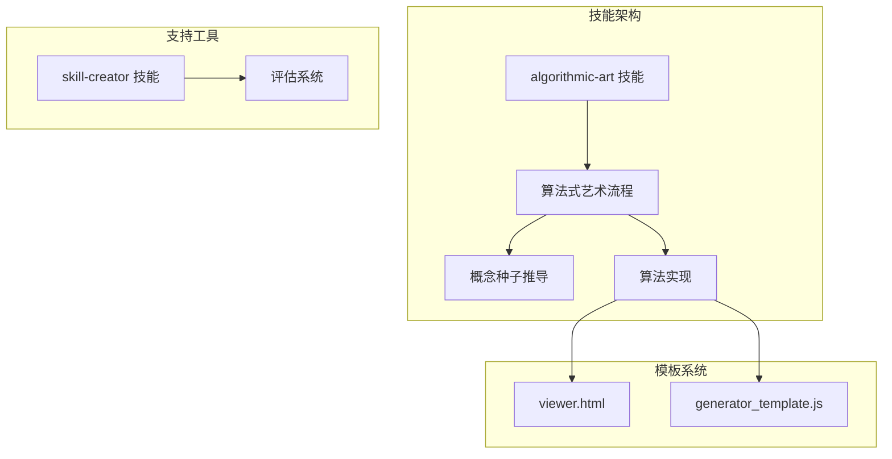
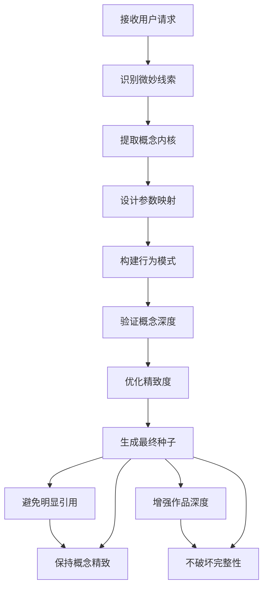
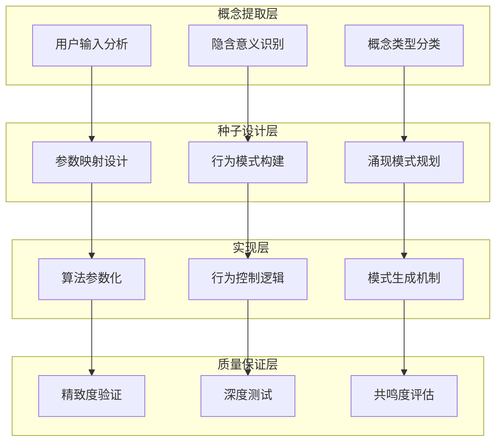
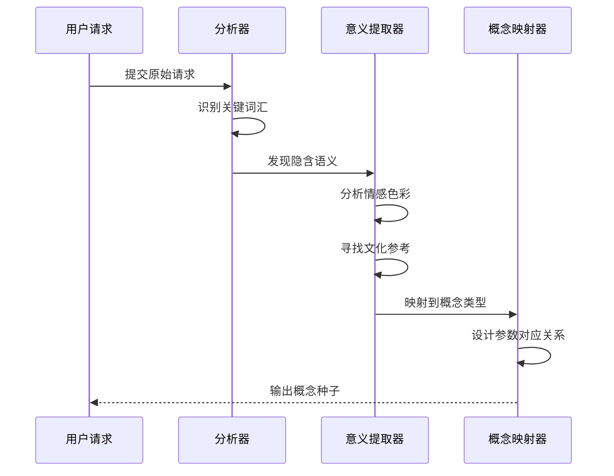
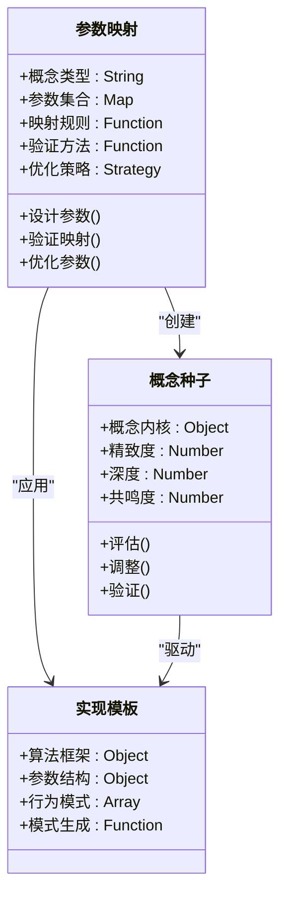
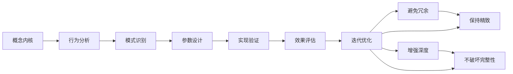
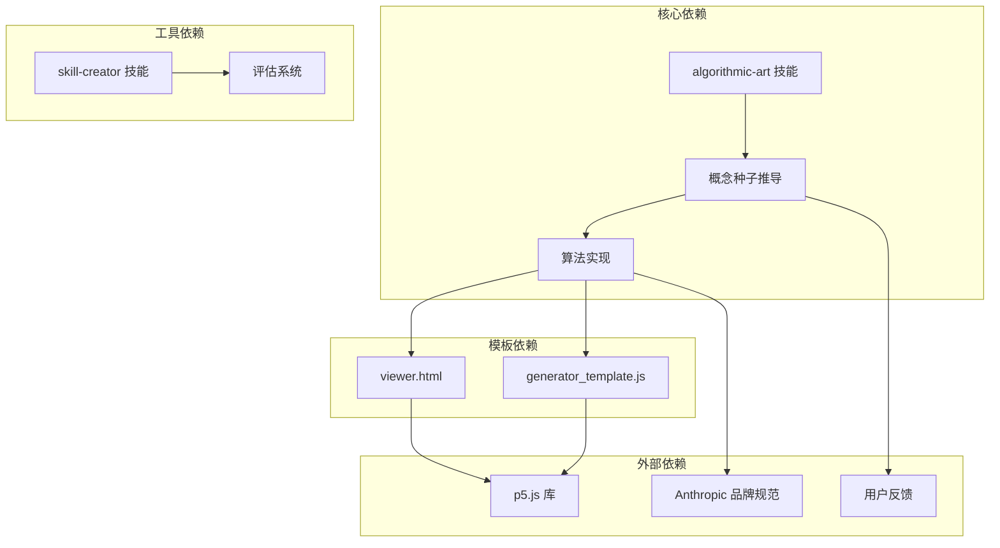

# 概念种子推导

<cite>
**本文档引用的文件**
- [algorithmic-art/SKILL.md](file://skills/skills/algorithmic-art/SKILL.md)
- [viewer.html](file://skills/skills/algorithmic-art/templates/viewer.html)
- [generator_template.js](file://skills/skills/algorithmic-art/templates/generator_template.js)
- [skill-creator/SKILL.md](file://skills/skills/skill-creator/SKILL.md)
</cite>

## 目录
1. [简介](#简介)
2. [项目结构](#项目结构)
3. [核心组件](#核心组件)
4. [架构概览](#架构概览)
5. [详细组件分析](#详细组件分析)
6. [依赖关系分析](#依赖关系分析)
7. [性能考虑](#性能考虑)
8. [故障排除指南](#故障排除指南)
9. [结论](#结论)

## 简介

概念种子推导是算法式艺术创作流程中的关键环节，它要求从用户请求中提取微妙的概念线索作为算法的核心DNA。这一过程不仅仅是简单的字面翻译，而是要在算法内部嵌入精致、有深度的隐喻和参考，使得熟悉该主题的人能够产生直觉共鸣，同时让其他人也能感受到生成作品的美感。

概念种子应该具备以下特征：
- **微妙性**：不直接宣告，而是通过参数、行为和涌现模式间接体现
- **精致性**：经过精心设计，避免过于明显的引用
- **深度性**：能够增强作品的层次感而不破坏其完整性
- **普适性**：既能让专家识别，也能让普通观众感受到美感

## 项目结构

该项目采用技能（Skill）架构组织，每个技能都是一个独立的功能模块。概念种子推导功能位于算法式艺术技能中，该技能包含完整的创作流程：

**图表来源**
- [algorithmic-art/SKILL.md:1-405](file://skills/skills/algorithmic-art/SKILL.md#L1-L405)
- [viewer.html:1-599](file://skills/skills/algorithmic-art/templates/viewer.html#L1-L599)

**章节来源**
- [algorithmic-art/SKILL.md:1-405](file://skills/skills/algorithmic-art/SKILL.md#L1-L405)

## 核心组件

### 概念种子定义与重要性

概念种子是算法式艺术创作的灵魂，它定义了作品的内在精神和美学方向。根据技能文档，概念种子具有以下核心特征：

**定义**：概念是一个"微妙、小众的引用，嵌入在算法本身之中——不总是字面意思，总是精致的"。

**重要性**：
- 为算法提供"安静的概念DNA"，渗透到参数、行为和涌现模式中
- 让熟悉主题的人产生直觉共鸣
- 让其他人体验到精美的生成作品
- 通过算法和谐的方式引用其他作品或概念

### 推导过程指导原则

概念种子推导遵循严格的指导原则：

**图表来源**
- [algorithmic-art/SKILL.md:90-131](file://skills/skills/algorithmic-art/SKILL.md#L90-L131)

**章节来源**
- [algorithmic-art/SKILL.md:90-131](file://skills/skills/algorithmic-art/SKILL.md#L90-L131)

## 架构概览

概念种子推导系统采用分层架构，确保概念的微妙性和精致性：

**图表来源**
- [algorithmic-art/SKILL.md:15-85](file://skills/skills/algorithmic-art/SKILL.md#L15-L85)

## 详细组件分析

### 用户输入分析组件

用户输入分析是概念种子推导的第一步，需要从看似简单的请求中发现深层含义：

#### 隐含意义识别策略

**图表来源**
- [algorithmic-art/SKILL.md:23-31](file://skills/skills/algorithmic-art/SKILL.md#L23-L31)

#### 概念类型分类系统

系统支持多种概念类型，每种都有特定的实现模式：

| 概念类型 | 特征描述 | 实现要点 |
|---------|---------|---------|
| 有机湍流 | 混沌受自然法则约束 | 流场+噪声函数+粒子追踪 |
| 量子谐波 | 离散实体的波状干涉 | 相位值+正弦波+干涉模式 |
| 递归低语 | 跨尺度的自相似性 | 递归结构+黄金比例+噪声扰动 |
| 场动力学 | 不可见力的可视化 | 向量场+粒子轨迹+力平衡 |

**章节来源**
- [algorithmic-art/SKILL.md:54-76](file://skills/skills/algorithmic-art/SKILL.md#L54-L76)

### 参数映射设计组件

参数映射是概念种子实现的核心技术，需要将抽象概念转化为具体的算法参数：

#### 参数设计原则

**图表来源**
- [algorithmic-art/SKILL.md:143-159](file://skills/skills/algorithmic-art/SKILL.md#L143-L159)

#### 参数优化策略

参数优化采用渐进式方法，确保概念的精致度：

1. **初始映射**：建立基本的参数-概念对应关系
2. **精致调整**：微调参数值以增强概念表现力
3. **深度验证**：测试概念在不同参数下的表现
4. **共鸣优化**：调整参数使作品对目标受众产生共鸣

**章节来源**
- [algorithmic-art/SKILL.md:143-159](file://skills/skills/algorithmic-art/SKILL.md#L143-L159)

### 行为模式构建组件

行为模式是概念种子在算法中的具体体现，通过参数控制实现：

#### 行为模式设计流程

**图表来源**
- [algorithmic-art/SKILL.md:163-184](file://skills/skills/algorithmic-art/SKILL.md#L163-L184)

#### 模式生成机制

系统支持多种模式生成机制：

| 生成机制 | 应用场景 | 实现方式 |
|---------|---------|---------|
| 流程场生成 | 有机流动 | 噪声函数+向量场 |
| 粒子系统 | 动态交互 | 随机过程+物理模拟 |
| 几何变换 | 形状演化 | 数学函数+变换矩阵 |
| 干涉图案 | 波动现象 | 正弦波+相位差 |

**章节来源**
- [algorithmic-art/SKILL.md:169-182](file://skills/skills/algorithmic-art/SKILL.md#L169-L182)

## 依赖关系分析

概念种子推导系统与其他组件存在密切的依赖关系：

**图表来源**
- [algorithmic-art/SKILL.md:386-405](file://skills/skills/algorithmic-art/SKILL.md#L386-L405)

**章节来源**
- [algorithmic-art/SKILL.md:386-405](file://skills/skills/algorithmic-art/SKILL.md#L386-L405)

## 性能考虑

概念种子推导的性能优化主要体现在以下几个方面：

### 算法效率优化

1. **参数映射优化**：使用高效的映射算法减少计算开销
2. **行为模式缓存**：缓存常用的行为模式以提高响应速度
3. **精致度评估**：采用渐进式评估减少不必要的计算

### 内存管理

1. **概念存储**：优化概念数据结构减少内存占用
2. **参数管理**：动态分配参数空间避免内存泄漏
3. **结果缓存**：合理缓存中间结果提高整体性能

### 扩展性设计

系统设计支持水平扩展，可以处理复杂的概念种子推导任务：

- **模块化架构**：各组件独立可替换
- **插件机制**：支持新的概念类型扩展
- **并行处理**：多概念并行推导提高效率

## 故障排除指南

### 常见问题及解决方案

#### 概念过于明显的问题

**症状**：生成的作品直接暴露了概念来源
**解决方案**：
- 使用更微妙的参数映射
- 增加概念的抽象层次
- 通过多个参数共同体现单一概念

#### 概念不够深入的问题

**症状**：作品缺乏层次感和深度
**解决方案**：
- 增加参数间的耦合关系
- 设计多层次的行为模式
- 优化涌现模式的复杂度

#### 精致度不足的问题

**症状**：作品显得粗糙或不精致
**解决方案**：
- 细化参数的精度设置
- 增加参数的微调能力
- 优化算法的执行效率

### 质量评估标准

建立完善的质量评估体系：

1. **精致度评估**：检查概念的微妙程度
2. **深度测试**：验证概念的层次丰富性
3. **共鸣度评估**：测试目标受众的接受度
4. **完整性验证**：确保概念不破坏作品的整体性

**章节来源**
- [algorithmic-art/SKILL.md:47-51](file://skills/skills/algorithmic-art/SKILL.md#L47-L51)

## 结论

概念种子推导功能代表了算法式艺术创作的最高境界，它将抽象的概念转化为具体的算法实现。通过精心设计的概念种子，可以创造出既有深度又具美感的生成艺术作品。

成功的关键在于：
- **微妙性**：概念应该像爵士乐中的和声引用一样精致
- **深度性**：通过参数、行为和涌现模式体现概念的丰富层次
- **普适性**：既要让专家识别，也要让普通观众感受到美
- **精致性**：避免任何过于明显的引用，保持概念的含蓄和优雅

这一系统为算法式艺术创作提供了完整的理论基础和实践指导，是推动人工智能艺术发展的重要里程碑。