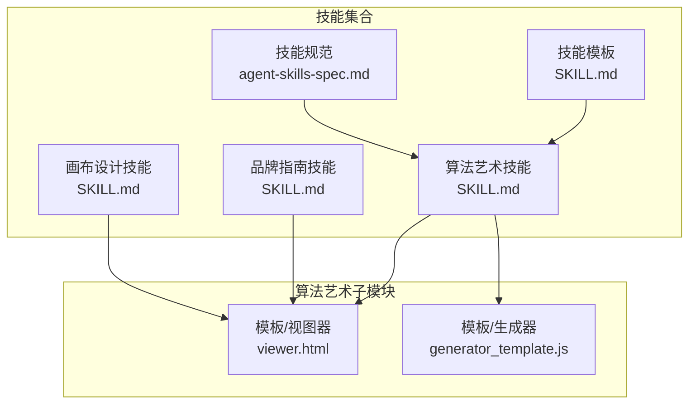
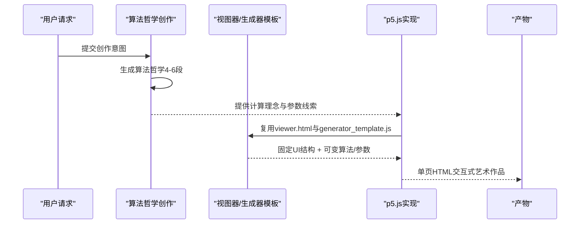
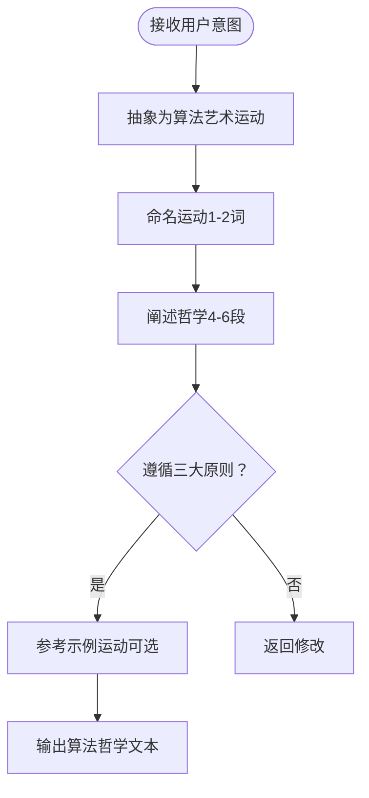
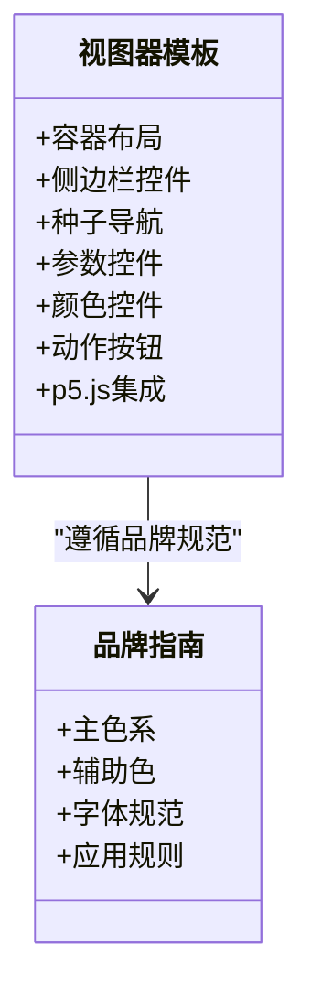
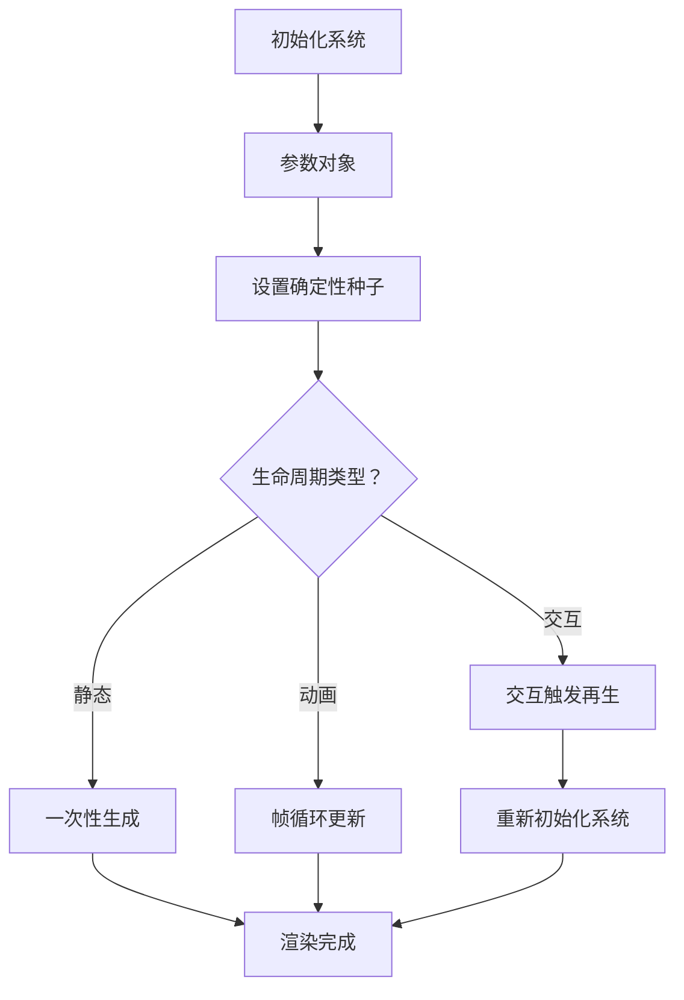
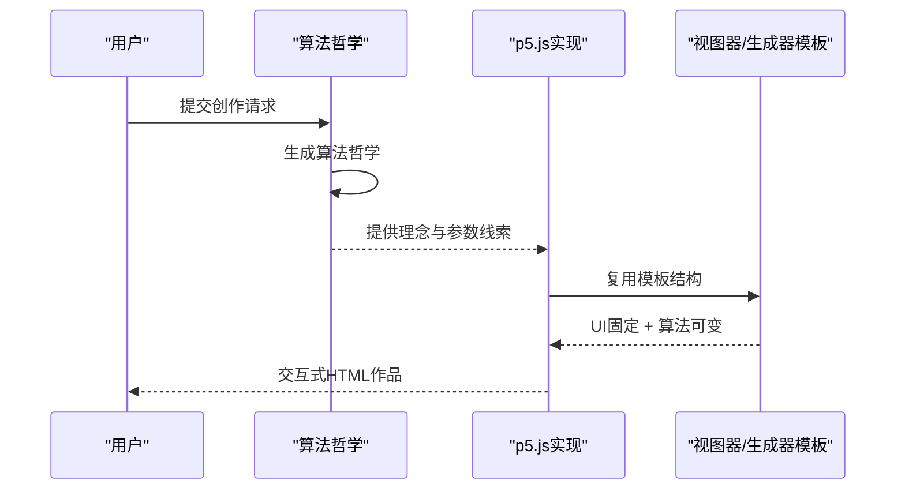
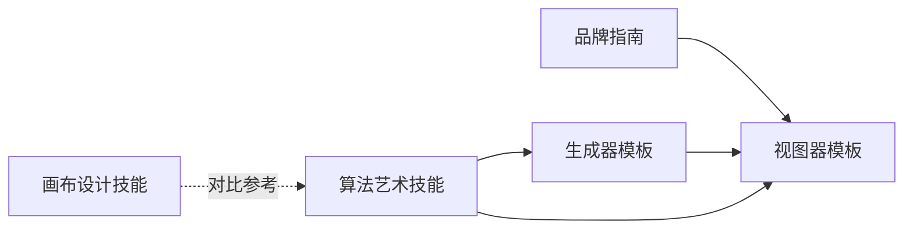

# 算法哲学创建

<cite>
**本文引用的文件**
- [算法艺术技能/SKILL.md](file://skills/skills/algorithmic-art/SKILL.md)
- [算法艺术模板/viewer.html](file://skills/skills/algorithmic-art/templates/viewer.html)
- [算法艺术模板/generator_template.js](file://skills/skills/algorithmic-art/templates/generator_template.js)
- [品牌指南/SKILL.md](file://skills/skills/brand-guidelines/SKILL.md)
- [画布设计/SKILL.md](file://skills/skills/canvas-design/SKILL.md)
- [技能模板/SKILL.md](file://skills/template/SKILL.md)
- [技能规范/agent-skills-spec.md](file://skills/spec/agent-skills-spec.md)
</cite>

## 目录
1. [引言](#引言)
2. [项目结构](#项目结构)
3. [核心组件](#核心组件)
4. [架构总览](#架构总览)
5. [详细组件分析](#详细组件分析)
6. [依赖关系分析](#依赖关系分析)
7. [性能考量](#性能考量)
8. [故障排除指南](#故障排除指南)
9. [结论](#结论)
10. [附录](#附录)

## 引言
本文件面向“算法哲学”的创建与实现，系统阐述如何将计算美学理念转化为可交互的艺术运动，并通过一致的工程化流程产出高质量的算法艺术作品。该体系包含两个阶段：第一阶段是“算法哲学创作”，第二阶段是“以p5.js实现表达”。前者强调计算过程、涌现行为、数学美感、种子随机性与参数化变化；后者强调可探索的参数控制、可复现的种子机制、以及遵循模板的工程化实现。

## 项目结构
该项目采用“技能（Skill）”组织方式，每个技能是一个自包含的模块，包含说明文档（SKILL.md）、模板与最佳实践资源。算法艺术技能位于 `skills/skills/algorithmic-art/`，内含哲学创作与实现两套模板与规范。

**图表来源**
- [算法艺术技能/SKILL.md:1-405](file://skills/skills/algorithmic-art/SKILL.md#L1-L405)
- [品牌指南/SKILL.md:1-74](file://skills/skills/brand-guidelines/SKILL.md#L1-L74)
- [画布设计/SKILL.md:1-130](file://skills/skills/canvas-design/SKILL.md#L1-L130)
- [技能模板/SKILL.md:1-7](file://skills/template/SKILL.md#L1-L7)
- [技能规范/agent-skills-spec.md:1-4](file://skills/spec/agent-skills-spec.md#L1-L4)

**章节来源**
- [算法艺术技能/SKILL.md:1-405](file://skills/skills/algorithmic-art/SKILL.md#L1-L405)
- [技能模板/SKILL.md:1-7](file://skills/template/SKILL.md#L1-L7)
- [技能规范/agent-skills-spec.md:1-4](file://skills/spec/agent-skills-spec.md#L1-L4)

## 核心组件
- 算法哲学创作（Algorithmic Philosophy Creation）
  - 目标：产出4-6段落的“算法哲学”文本，强调计算过程、涌现行为、数学美感、种子随机性与参数化变化。
  - 要点：避免冗余、强调工艺品质、留创作空间、强调“过程即产品”。

- 视图器模板（Interactive Viewer Template）
  - 基于HTML模板构建单页自包含的交互式艺术作品，内置种子导航、参数控制、颜色选择与操作按钮。
  - 遵循Anthropic品牌风格（字体、配色、布局），仅替换算法与参数部分。

- 生成器模板（Generator Template）
  - 提供p5.js最佳实践：参数组织、种子随机性、生命周期管理、类结构、性能优化、实用函数、导出能力等。

- 品牌指南与画布设计
  - 品牌指南：提供Anthropic官方色彩与字体规范，确保视觉一致性。
  - 画布设计：面向静态视觉艺术的哲学创作与实现流程，作为算法艺术的对比参考。

**章节来源**
- [算法艺术技能/SKILL.md:7-86](file://skills/skills/algorithmic-art/SKILL.md#L7-L86)
- [算法艺术模板/viewer.html:1-599](file://skills/skills/algorithmic-art/templates/viewer.html#L1-L599)
- [算法艺术模板/generator_template.js:1-223](file://skills/skills/algorithmic-art/templates/generator_template.js#L1-L223)
- [品牌指南/SKILL.md:1-74](file://skills/skills/brand-guidelines/SKILL.md#L1-L74)
- [画布设计/SKILL.md:1-130](file://skills/skills/canvas-design/SKILL.md#L1-L130)

## 架构总览
算法哲学的创建与实现遵循“先理念、后实现”的双阶段架构。第一阶段产出哲学文本，第二阶段以p5.js在模板基础上实现并提供交互探索。

**图表来源**
- [算法艺术技能/SKILL.md:34-86](file://skills/skills/algorithmic-art/SKILL.md#L34-L86)
- [算法艺术模板/viewer.html:1-599](file://skills/skills/algorithmic-art/templates/viewer.html#L1-L599)
- [算法艺术模板/generator_template.js:1-223](file://skills/skills/algorithmic-art/templates/generator_template.js#L1-L223)

## 详细组件分析

### 组件A：算法哲学创作（Algorithmic Philosophy Creation）
- 目标与范围
  - 创作对象：算法艺术运动的“计算美学宣言”，非静态图像或模板。
  - 关注点：计算过程、涌现行为、数学美感、种子随机性、参数化变化。
- 结构与要点
  - 运动命名：1-2个词，如“有机湍流”“量子谐波”“递归低语”等。
  - 哲学阐述：4-6段，从计算过程、噪声函数、粒子行为、时间演化、参数变化等维度展开。
  - 关键指导原则：
    - 避免冗余：每项算法要点只出现一次，除非深化。
    - 强调工艺品质：反复强调“精心打磨”“大师级实现”“深思熟虑的优化”。
    - 留创作空间：方向明确但不固化实现细节，给下一位实现者留有高阶诠释空间。
  - 示例运动解析
    - 有机湍流：层叠噪声驱动的流场，粒子跟随向量力，密度映射与速度/密度的颜色关联，平衡调参。
    - 量子谐波：网格初始化的相位振荡，近邻相位干涉产生明暗节点，简谐运动生成复杂共振图案。
    - 递归低语：分形递归或L系统，黄金比例约束与噪声扰动，线条权重随层级衰减。
    - 场动力学：由数学函数或噪声构造的矢量场，粒子沿场线流动，仅显示轨迹证据。
    - 随机结晶：随机圆堆积或Voronoi镶嵌，松弛算法达到平衡，颜色基于尺寸/邻接/中心距离。
- 输出规格
  - 文本长度：4-6段，语言诗意而严谨，融合计算与美学。
  - 内容结构：命名 + 哲学阐述 + 参数线索 + 工艺品质强调。

**图表来源**
- [算法艺术技能/SKILL.md:34-86](file://skills/skills/algorithmic-art/SKILL.md#L34-L86)

**章节来源**
- [算法艺术技能/SKILL.md:34-86](file://skills/skills/algorithmic-art/SKILL.md#L34-L86)

### 组件B：视图器模板（Interactive Viewer Template）
- 设计目标
  - 提供固定且一致的交互界面：种子导航、参数控制、颜色选择、动作按钮。
  - 保持Anthropic品牌风格：字体、配色、布局、渐变背景。
- 结构与职责
  - 固定部分（始终保留）：布局结构、品牌样式、种子区、动作区。
  - 可变部分（需替换）：p5.js算法、参数对象、参数控件、颜色控件。
- 关键要求
  - 单页自包含HTML，内嵌p5.js与全部逻辑。
  - 种子导航：显示、上一个、下一个、随机、跳转到指定种子。
  - 参数控件：滑块/输入框，实时更新，支持重置默认值。
  - 颜色控件：按需启用，支持调色板调整。
  - 下载导出：保存当前画布为PNG。

**图表来源**
- [算法艺术模板/viewer.html:1-599](file://skills/skills/algorithmic-art/templates/viewer.html#L1-L599)
- [品牌指南/SKILL.md:17-36](file://skills/skills/brand-guidelines/SKILL.md#L17-L36)

**章节来源**
- [算法艺术模板/viewer.html:1-599](file://skills/skills/algorithmic-art/templates/viewer.html#L1-L599)
- [品牌指南/SKILL.md:17-36](file://skills/skills/brand-guidelines/SKILL.md#L17-L36)

### 组件C：生成器模板（Generator Template）
- 参数组织
  - 将所有可调参数集中在一个对象中，便于UI绑定、重置与序列化。
- 种子随机性
  - 使用确定性种子（randomSeed、noiseSeed），保证可复现性。
- 生命周期与模式
  - 支持静态生成（一次性）、动画生成（持续帧循环）、用户触发再生（noLoop + 交互）。
- 类结构与性能
  - 对象化实体（如粒子、代理），分离更新与渲染逻辑；关注性能优化与平滑执行。
- 实用函数
  - 颜色工具、映射与缓动、边界处理、导出图像等。
- 导出与扩展
  - 提供导出图片能力，鼓励在此基础上扩展更多算法模式。

**图表来源**
- [算法艺术模板/generator_template.js:24-84](file://skills/skills/algorithmic-art/templates/generator_template.js#L24-L84)

**章节来源**
- [算法艺术模板/generator_template.js:1-223](file://skills/skills/algorithmic-art/templates/generator_template.js#L1-L223)

### 组件D：哲学创作步骤与关键要求
- 步骤
  1) 解读用户意图：识别潜在的“概念种子”（微妙、精致的引用，不喧宾夺主）。
  2) 生成算法哲学：4-6段，涵盖计算过程、噪声/场/粒子、时间演化、参数变化。
  3) 实现表达：在模板基础上实现p5.js算法，提供参数控制与种子导航。
  4) 质量把关：强调工艺品质、避免冗余、留创作空间。
- 关键要求
  - 避免冗余：同一概念只在一个层面出现，除非深化。
  - 强调工艺品质：反复强调“精心打磨”“大师级实现”“深思熟虑的优化”。
  - 留创作空间：方向明确但不固化实现细节，允许高阶诠释。
  - 输出格式：哲学文本（.md）、单页HTML交互式作品（自包含）。

**图表来源**
- [算法艺术技能/SKILL.md:90-100](file://skills/skills/algorithmic-art/SKILL.md#L90-L100)
- [算法艺术技能/SKILL.md:101-186](file://skills/skills/algorithmic-art/SKILL.md#L101-L186)

**章节来源**
- [算法艺术技能/SKILL.md:90-186](file://skills/skills/algorithmic-art/SKILL.md#L90-L186)

### 组件E：输出格式与质量标准
- 输出产物
  - 算法哲学文本：4-6段，命名清晰，阐述完整，强调工艺品质与参数线索。
  - 单页HTML交互式作品：内嵌p5.js、算法、参数控件、种子导航、动作按钮，自包含、可直接运行。
- 质量标准
  - 过程优先：强调“过程即产品”，每次运行都是独特的活体算法。
  - 参数化表达：通过数学关系、力与行为传达理念，而非静态构图。
  - 工艺品质：追求“精心打磨”“大师级实现”，参数调优与性能优化到位。
  - 品牌一致性：遵循Anthropic品牌风格（字体、配色、布局）。
  - 可探索性：提供丰富的参数与种子导航，支持实时调整与变体探索。

**章节来源**
- [算法艺术技能/SKILL.md:211-273](file://skills/skills/algorithmic-art/SKILL.md#L211-L273)
- [算法艺术技能/SKILL.md:338-356](file://skills/skills/algorithmic-art/SKILL.md#L338-L356)

## 依赖关系分析
- 技能间依赖
  - 算法艺术技能依赖品牌指南（视觉风格）与模板（实现框架）。
  - 画布设计技能提供静态视觉艺术的哲学与实现范式，可作为算法艺术的对比参考。
- 模板依赖
  - 视图器模板依赖p5.js CDN与Anthropic品牌样式。
  - 生成器模板提供p5.js最佳实践，指导参数组织、种子随机性与性能优化。

**图表来源**
- [算法艺术模板/viewer.html:1-599](file://skills/skills/algorithmic-art/templates/viewer.html#L1-L599)
- [算法艺术模板/generator_template.js:1-223](file://skills/skills/algorithmic-art/templates/generator_template.js#L1-L223)
- [品牌指南/SKILL.md:1-74](file://skills/skills/brand-guidelines/SKILL.md#L1-L74)
- [画布设计/SKILL.md:1-130](file://skills/skills/canvas-design/SKILL.md#L1-L130)

**章节来源**
- [算法艺术技能/SKILL.md:386-405](file://skills/skills/algorithmic-art/SKILL.md#L386-L405)
- [技能规范/agent-skills-spec.md:1-4](file://skills/spec/agent-skills-spec.md#L1-L4)

## 性能考量
- 执行效率
  - 控制元素数量与计算复杂度，必要时使用空间索引或简化运算。
  - 保持60fps流畅度，避免在draw中进行昂贵操作。
- 随机性与可复现
  - 使用确定性种子，确保相同种子产生相同结果。
- 交互响应
  - 参数控件实时更新，对昂贵操作采用延迟或节流策略。
- 导出与分享
  - 提供PNG导出能力，便于保存与分享。

[本节为通用性能建议，无需特定文件引用]

## 故障排除指南
- 视图器无法加载
  - 检查p5.js CDN是否可用，确认HTML为单页自包含结构。
- 种子导航无效
  - 确认种子控件事件绑定正确，updateSeed/previousSeed/nextSeed函数实现无误。
- 参数控件不生效
  - 检查updateParam与参数对象同步逻辑，确保重置按钮恢复默认值。
- 品牌样式异常
  - 确认Anthropic配色与字体变量未被覆盖，保持模板中的固定部分不变。

**章节来源**
- [算法艺术模板/viewer.html:530-599](file://skills/skills/algorithmic-art/templates/viewer.html#L530-L599)

## 结论
算法哲学创建体系以“理念先行、模板实现”为核心，通过严格的创作步骤与质量标准，确保产出既具计算美学深度，又具备交互探索价值。遵循“过程即产品”“参数化表达”“专家级工艺”等原则，结合视图器与生成器模板的最佳实践，可稳定地产出高质量的算法艺术作品。

[本节为总结性内容，无需特定文件引用]

## 附录

### 附录A：哲学创作清单
- 运动命名：简洁有力，1-2词
- 哲学阐述：4-6段，涵盖计算过程、噪声/场/粒子、时间演化、参数变化
- 关键原则：避免冗余、强调工艺品质、留创作空间
- 示例参考：有机湍流、量子谐波、递归低语、场动力学、随机结晶

**章节来源**
- [算法艺术技能/SKILL.md:34-86](file://skills/skills/algorithmic-art/SKILL.md#L34-L86)

### 附录B：实现模板使用清单
- 复用视图器模板，保留固定部分，替换算法与参数控件
- 使用生成器模板的最佳实践：参数组织、种子随机性、生命周期、类结构、性能优化
- 遵循Anthropic品牌风格：字体、配色、布局
- 输出单页HTML，内嵌p5.js与全部逻辑

**章节来源**
- [算法艺术模板/viewer.html:1-599](file://skills/skills/algorithmic-art/templates/viewer.html#L1-L599)
- [算法艺术模板/generator_template.js:1-223](file://skills/skills/algorithmic-art/templates/generator_template.js#L1-L223)
- [品牌指南/SKILL.md:17-36](file://skills/skills/brand-guidelines/SKILL.md#L17-L36)