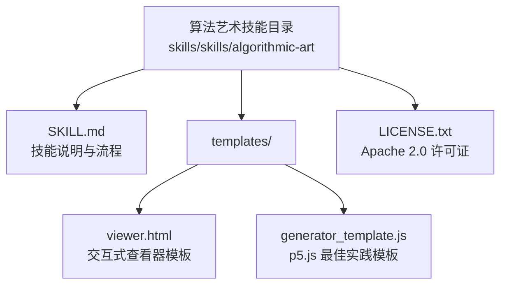
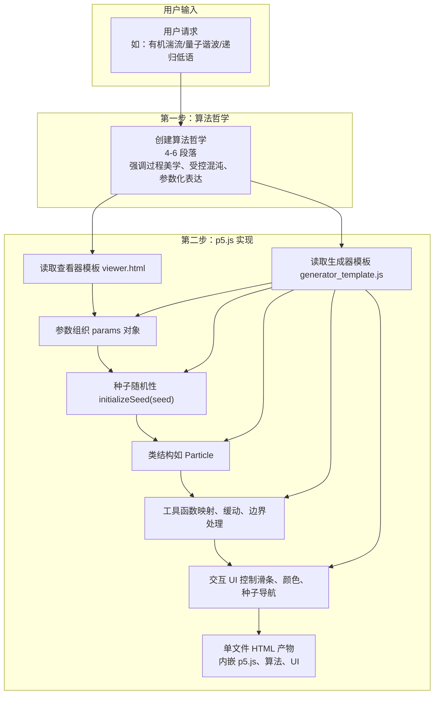
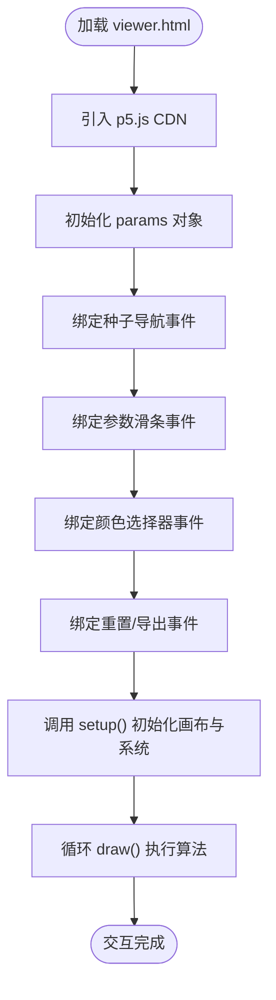
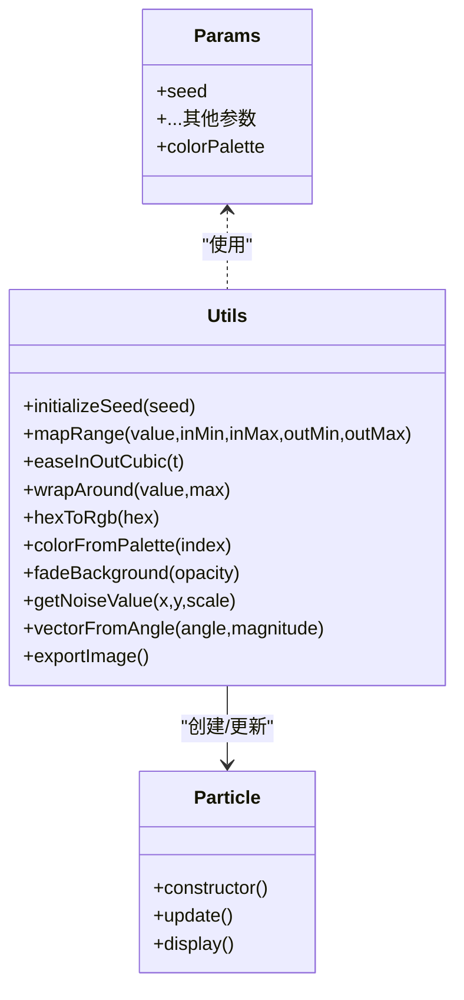
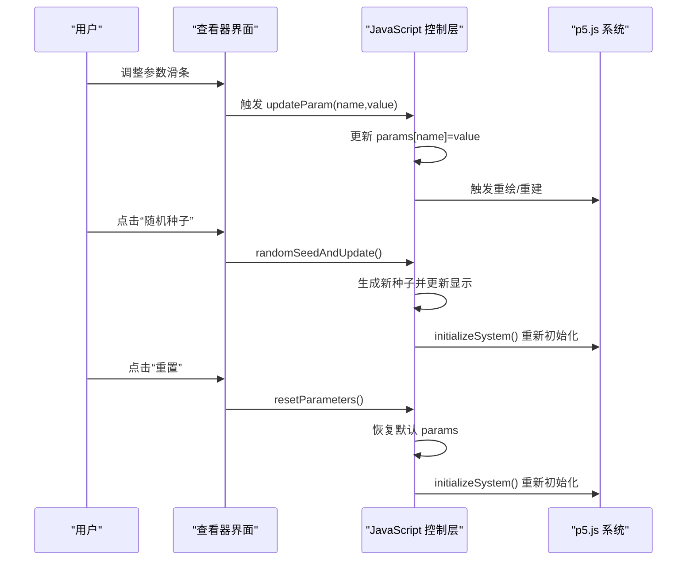
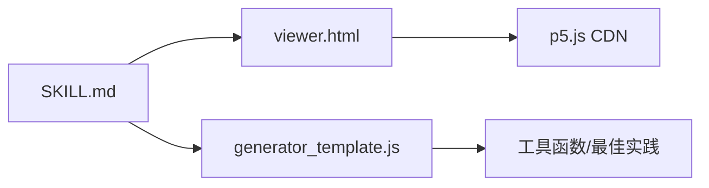

# 算法艺术技能

<cite>
**本文引用的文件**
- [算法艺术 SKILL.md](file://skills/skills/algorithmic-art/SKILL.md)
- [生成器模板 generator_template.js](file://skills/skills/algorithmic-art/templates/generator_template.js)
- [查看器模板 viewer.html](file://skills/skills/algorithmic-art/templates/viewer.html)
- [算法艺术许可证 LICENSE.txt](file://skills/skills/algorithmic-art/LICENSE.txt)
- [技能总览 README.md](file://skills/README.md)
- [代理技能规范 agent-skills-spec.md](file://skills/spec/agent-skills-spec.md)
- [品牌指南 SKILL.md](file://skills/skills/brand-guidelines/SKILL.md)
- [画布设计 SKILL.md](file://skills/skills/canvas-design/SKILL.md)
</cite>

## 目录
1. [简介](#简介)
2. [项目结构](#项目结构)
3. [核心组件](#核心组件)
4. [架构总览](#架构总览)
5. [详细组件分析](#详细组件分析)
6. [依赖关系分析](#依赖关系分析)
7. [性能考量](#性能考量)
8. [故障排查指南](#故障排查指南)
9. [结论](#结论)
10. [附录](#附录)

## 简介
本技能文档面向“算法艺术”创作流程，系统化阐述从“算法哲学”到“p5.js 实现”的完整方法论，以及“交互式参数探索机制”。它既提供面向初学者的概念性概述，也给出面向有经验开发者的实现细节与最佳实践。重点包括：
- 算法艺术的创作过程：哲学先行、参数驱动、可重现的种子随机性、实时交互探索
- p5.js 实现原理：参数组织、类结构、噪声与物理模拟、性能优化
- 交互式参数探索：种子导航、参数滑条、颜色选择器、一键重置与导出
- 常见艺术运动示例：有机湍流、量子谐波、递归低语、场动力学、随机晶化等
- 公共接口与返回值：HTML 单文件产物、参数对象、回调函数、种子控制 API
- 算法艺术与传统静态图像的区别：强调过程美学、动态演化、参数化表达

## 项目结构
该技能位于 skills/skills/algorithmic-art 目录下，包含以下关键文件：
- SKILL.md：技能说明与工作流
- templates/viewer.html：交互式查看器模板（固定布局与 UI 结构）
- templates/generator_template.js：p5.js 最佳实践模板（参数组织、类结构、工具函数）
- LICENSE.txt：Apache 2.0 许可证

图表来源
- [算法艺术 SKILL.md:1-405](file://skills/skills/algorithmic-art/SKILL.md#L1-L405)
- [查看器模板 viewer.html:1-599](file://skills/skills/algorithmic-art/templates/viewer.html#L1-L599)
- [生成器模板 generator_template.js:1-223](file://skills/skills/algorithmic-art/templates/generator_template.js#L1-L223)

章节来源
- [算法艺术 SKILL.md:1-405](file://skills/skills/algorithmic-art/SKILL.md#L1-L405)
- [技能总览 README.md:1-95](file://skills/README.md#L1-L95)

## 核心组件
- 算法哲学（Algorithmic Philosophy）：定义计算美学、涌现行为、数学美感、受控混沌等理念，指导后续代码实现
- 查看器模板（Viewer Template）：固定 UI 结构（种子区、参数区、颜色区、操作区），用于承载交互式 p5.js 演示
- 生成器模板（Generator Template）：提供参数组织、种子随机性、类结构、工具函数与性能建议
- 交互式参数探索：通过滑条、颜色选择器、种子导航、重置与导出按钮，实现实时探索与可重现输出

章节来源
- [算法艺术 SKILL.md:7-86](file://skills/skills/algorithmic-art/SKILL.md#L7-L86)
- [查看器模板 viewer.html:334-430](file://skills/skills/algorithmic-art/templates/viewer.html#L334-L430)
- [生成器模板 generator_template.js:15-223](file://skills/skills/algorithmic-art/templates/generator_template.js#L15-L223)

## 架构总览
算法艺术技能采用“两步走”架构：
1) 算法哲学创建：输出 .md 文件，阐述计算美学、噪声场、粒子系统、参数化变化等
2) 代码实现：基于模板构建单文件 HTML，内嵌 p5.js、算法、参数 UI 与种子控制

图表来源
- [算法艺术 SKILL.md:9-127](file://skills/skills/algorithmic-art/SKILL.md#L9-L127)
- [查看器模板 viewer.html:1-599](file://skills/skills/algorithmic-art/templates/viewer.html#L1-L599)
- [生成器模板 generator_template.js:1-223](file://skills/skills/algorithmic-art/templates/generator_template.js#L1-L223)

## 详细组件分析

### 组件 A：算法哲学（Algorithmic Philosophy）
- 目标：产出 4-6 段落的算法美学宣言，强调“过程优于结果”“参数化表达”“受控混沌”
- 关键要点：
  - 计算过程与数学关系
  - 噪声函数与随机模式
  - 粒子行为与场动力学
  - 时间演化与系统状态
  - 参数化变化与涌现复杂度
- 输出：.md 文件，作为后续代码实现的“算法蓝图”

章节来源
- [算法艺术 SKILL.md:15-86](file://skills/skills/algorithmic-art/SKILL.md#L15-L86)

### 组件 B：查看器模板（viewer.html）
- 固定结构（必须保持）：
  - 头部标题与副标题（可定制）
  - 种子区：显示当前种子、上一个/下一个、随机、跳转到指定种子
  - 参数区：滑条控件（数量、速度、尺度、阈值等）
  - 颜色区：颜色选择器（可选）
  - 操作区：重置、下载 PNG
- 可变部分（需替换）：
  - p5.js 算法（setup/draw/类/工具函数）
  - 参数对象 params
  - UI 控件与事件处理器

图表来源
- [查看器模板 viewer.html:334-599](file://skills/skills/algorithmic-art/templates/viewer.html#L334-L599)

章节来源
- [查看器模板 viewer.html:334-599](file://skills/skills/algorithmic-art/templates/viewer.html#L334-L599)

### 组件 C：生成器模板（generator_template.js）
- 参数组织：将所有可调参数集中在一个对象中，便于 UI 绑定、重置与序列化
- 种子随机性：统一使用 randomSeed(seed) 与 noiseSeed(seed)，确保可重现
- 生命周期：setup() 初始化系统；draw() 决定静态/动画/触发重绘
- 类结构：当存在多个实体（粒子、代理、节点）时使用类封装
- 性能考虑：预计算、空间哈希、限制昂贵运算、高效使用 p5 向量
- 工具函数：颜色、映射、缓动、边界处理
- 导出：保存当前画布为 PNG

图表来源
- [生成器模板 generator_template.js:15-223](file://skills/skills/algorithmic-art/templates/generator_template.js#L15-L223)

章节来源
- [生成器模板 generator_template.js:15-223](file://skills/skills/algorithmic-art/templates/generator_template.js#L15-L223)

### 组件 D：交互式参数探索机制
- 种子导航：支持 prev/next/random/jump/display，保证相同种子输出一致
- 参数控件：滑条、颜色选择器，实时更新并触发重绘或全量重建
- 动作按钮：重置恢复默认、下载 PNG
- UI 一致性：固定 Anthropic 品牌风格（字体、颜色、布局）

图表来源
- [查看器模板 viewer.html:520-599](file://skills/skills/algorithmic-art/templates/viewer.html#L520-L599)

章节来源
- [查看器模板 viewer.html:520-599](file://skills/skills/algorithmic-art/templates/viewer.html#L520-L599)

### 组件 E：常见艺术运动示例（概念性）
- 有机湍流：噪声场驱动的流体粒子，密度与速度决定色彩，追求自然律约束下的混沌平衡
- 量子谐波：网格初始化的粒子，相位随简谐波演化，近邻干涉产生共振图案
- 递归低语：分形递归结构，黄金比例约束，噪声打破对称，层级线宽递减
- 场动力学：由数学函数或噪声构造的向量场，粒子沿场线流动，轨迹呈现不可见力的可见证据
- 随机晶化：随机点集通过松弛算法演化，形成 Voronoi 或圆盘堆积的有机平铺

章节来源
- [算法艺术 SKILL.md:54-76](file://skills/skills/algorithmic-art/SKILL.md#L54-L76)

## 依赖关系分析
- 技能依赖关系
  - 算法艺术 SKILL.md 依赖查看器模板 viewer.html 与生成器模板 generator_template.js
  - 查看器模板 viewer.html 依赖 p5.js CDN
  - 生成器模板 generator_template.js 提供最佳实践与工具函数
- 外部依赖
  - p5.js（CDN 引入）
  - Anthropic 品牌资源（字体、颜色）

图表来源
- [算法艺术 SKILL.md:105-127](file://skills/skills/algorithmic-art/SKILL.md#L105-L127)
- [查看器模板 viewer.html:23-26](file://skills/skills/algorithmic-art/templates/viewer.html#L23-L26)
- [生成器模板 generator_template.js:1-13](file://skills/skills/algorithmic-art/templates/generator_template.js#L1-L13)

章节来源
- [算法艺术 SKILL.md:105-127](file://skills/skills/algorithmic-art/SKILL.md#L105-L127)
- [查看器模板 viewer.html:23-26](file://skills/skills/algorithmic-art/templates/viewer.html#L23-L26)
- [生成器模板 generator_template.js:1-13](file://skills/skills/algorithmic-art/templates/generator_template.js#L1-L13)

## 性能考量
- 参数化优先：将影响系统行为的关键属性（数量、尺度、概率、角度、阈值）放入 params，便于实时调整
- 种子随机性：始终使用 seeded randomness，确保可重现与一致性
- 渲染策略：使用透明背景叠加实现轨迹/衰减效果，避免频繁重绘
- 数学与物理：优先使用高效的映射、缓动与边界处理函数，减少昂贵运算
- 类结构：当实体数量较大时，使用类封装与批量更新，提升可维护性与可扩展性

章节来源
- [生成器模板 generator_template.js:112-177](file://skills/skills/algorithmic-art/templates/generator_template.js#L112-L177)
- [算法艺术 SKILL.md:201-210](file://skills/skills/algorithmic-art/SKILL.md#L201-L210)

## 故障排查指南
- 问题：种子切换后画面不更新
  - 排查：确认已调用 initializeSystem() 重新初始化系统，并更新种子显示
  - 参考：种子导航相关函数
- 问题：参数滑条无响应
  - 排查：检查 updateParam() 是否正确写入 params 并触发重绘/重建
  - 参考：参数控件与事件绑定
- 问题：颜色选择器无效
  - 排查：确认 updateColor() 正确更新 params.colorPalette 并刷新渲染
  - 参考：颜色区控件
- 问题：导出 PNG 名称异常
  - 排查：检查 exportImage() 的命名规则与 params.seed
  - 参考：导出函数

章节来源
- [查看器模板 viewer.html:530-599](file://skills/skills/algorithmic-art/templates/viewer.html#L530-L599)
- [生成器模板 generator_template.js:200-206](file://skills/skills/algorithmic-art/templates/generator_template.js#L200-L206)

## 结论
算法艺术技能通过“算法哲学—p5.js 实现—交互式探索”的闭环，将计算美学转化为可探索、可重现、可分享的动态作品。其关键在于：
- 哲学先行：以过程美学为核心，避免静态模板化
- 参数驱动：将系统可调属性集中管理，便于实时探索
- 可重现性：统一的种子随机性确保每次运行的一致性
- 交互体验：固定 UI 结构承载可变算法，提供流畅的探索路径
- 品牌一致性：遵循 Anthropic 品牌风格，确保观感统一

## 附录

### A. 公共接口与参数清单
- 参数对象 params
  - 必填：seed（整数）
  - 可选：颜色数组 colorPalette（字符串数组）
  - 其他：根据具体艺术运动定义（如粒子数量、噪声尺度、速度、轨迹长度等）
- 种子控制 API
  - updateSeed()：更新当前种子并重建系统
  - previousSeed()/nextSeed()：上下切换种子
  - randomSeedAndUpdate()：生成随机种子并重建系统
  - updateSeedDisplay()：同步 UI 显示
- 参数控制 API
  - updateParam(name, value)：更新单个参数并触发重绘/重建
  - resetParameters()：恢复默认参数并重建系统
- 颜色控制 API
  - updateColor(id, value)：更新颜色并刷新渲染
- 工具函数
  - initializeSeed(seed)：设置随机种子
  - mapRange()/easeInOutCubic()/wrapAround()：常用数学与缓动
  - hexToRgb()/colorFromPalette()：颜色工具
  - fadeBackground()/getNoiseValue()/vectorFromAngle()：渲染与物理工具
  - exportImage()：导出 PNG

章节来源
- [生成器模板 generator_template.js:15-223](file://skills/skills/algorithmic-art/templates/generator_template.js#L15-L223)
- [查看器模板 viewer.html:440-599](file://skills/skills/algorithmic-art/templates/viewer.html#L440-L599)

### B. 使用模式与最佳实践
- 创作流程
  - 解读用户意图，提炼“概念种子”
  - 生成算法哲学（4-6 段落）
  - 基于模板构建 HTML 产物，内嵌算法与 UI
- 设计原则
  - 过程优于结果：强调算法执行中的动态美
  - 参数化表达：通过数学关系与行为规则传达思想
  - 受控混沌：在严格边界内进行随机变化
  - 品牌一致性：保持 Anthropic 风格的 UI 与排版
- 输出产物
  - 单文件 HTML：内含 p5.js、算法、参数 UI、种子控制
  - 可选：PNG 导出

章节来源
- [算法艺术 SKILL.md:90-127](file://skills/skills/algorithmic-art/SKILL.md#L90-L127)
- [算法艺术 SKILL.md:211-218](file://skills/skills/algorithmic-art/SKILL.md#L211-L218)

### C. 与其他技能的关系
- 与品牌指南（brand-guidelines）：遵循 Anthropic 字体与配色体系
- 与画布设计（canvas-design）：算法艺术强调动态过程，而画布设计强调静态视觉表达
- 与代理技能规范（agent-skills-spec）：遵循技能标准与元数据格式

章节来源
- [品牌指南 SKILL.md:15-74](file://skills/skills/brand-guidelines/SKILL.md#L15-L74)
- [画布设计 SKILL.md:1-130](file://skills/skills/canvas-design/SKILL.md#L1-L130)
- [代理技能规范 agent-skills-spec.md:1-4](file://skills/spec/agent-skills-spec.md#L1-L4)