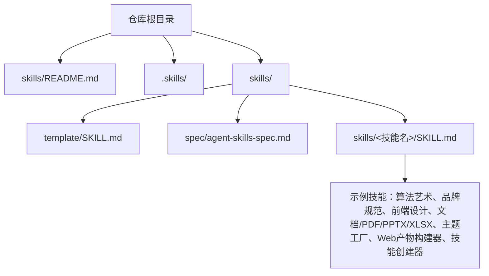
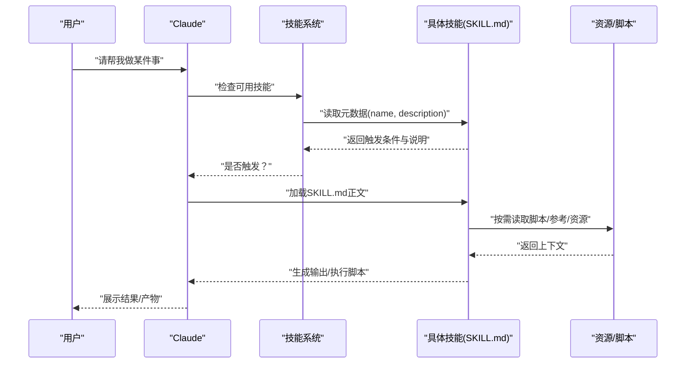
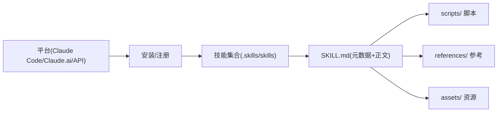

# 快速开始

<cite>
**本文引用的文件**
- [skills/README.md](file://skills/README.md)
- [skills/template/SKILL.md](file://skills/template/SKILL.md)
- [skills/spec/agent-skills-spec.md](file://skills/spec/agent-skills-spec.md)
- [skills/skills/algorithmic-art/SKILL.md](file://skills/skills/algorithmic-art/SKILL.md)
- [skills/skills/claude-api/SKILL.md](file://skills/skills/claude-api/SKILL.md)
- [skills/skills/brand-guidelines/SKILL.md](file://skills/skills/brand-guidelines/SKILL.md)
- [skills/skills/frontend-design/SKILL.md](file://skills/skills/frontend-design/SKILL.md)
- [skills/skills/docx/SKILL.md](file://skills/skills/docx/SKILL.md)
- [skills/skills/pdf/SKILL.md](file://skills/skills/pdf/SKILL.md)
- [skills/skills/pptx/SKILL.md](file://skills/skills/pptx/SKILL.md)
- [skills/skills/xlsx/SKILL.md](file://skills/skills/xlsx/SKILL.md)
- [skills/skills/theme-factory/SKILL.md](file://skills/skills/theme-factory/SKILL.md)
- [skills/skills/web-artifacts-builder/SKILL.md](file://skills/skills/web-artifacts-builder/SKILL.md)
- [skills/skills/skill-creator/SKILL.md](file://skills/skills/skill-creator/SKILL.md)
</cite>

## 目录
1. [简介](#简介)
2. [项目结构](#项目结构)
3. [核心组件](#核心组件)
4. [架构总览](#架构总览)
5. [详细组件分析](#详细组件分析)
6. [依赖关系分析](#依赖关系分析)
7. [性能考虑](#性能考虑)
8. [故障排查指南](#故障排查指南)
9. [结论](#结论)
10. [附录](#附录)

## 简介
本指南面向首次接触技能系统（Skills）的用户，帮助你在 Claude Code、Claude.ai 和 Claude API 上快速安装与使用技能，并从零开始创建你的第一个技能。内容涵盖：
- 安装与设置：如何在不同平台上注册与启用示例技能
- 基本使用方法：如何在对话中触发技能、查看输出
- 从零创建技能：SKILL.md 的编写要点、模板使用、资源组织
- 常见问题与最佳实践：触发条件、输出格式、工具链选择

## 项目结构
该仓库以“技能”为单位进行组织，每个技能是一个独立目录，包含说明文档 SKILL.md 以及可选的脚本、参考材料与资源文件。根目录下的 skills/README.md 提供了总体介绍与使用入口。

图表来源
- [skills/README.md:1-95](file://skills/README.md#L1-L95)
- [skills/template/SKILL.md:1-7](file://skills/template/SKILL.md#L1-L7)
- [skills/spec/agent-skills-spec.md:1-4](file://skills/spec/agent-skills-spec.md#L1-L4)

章节来源
- [skills/README.md:1-95](file://skills/README.md#L1-L95)

## 核心组件
- 技能元数据与说明：每个技能通过 SKILL.md 的 YAML frontmatter 提供 name 与 description，作为触发条件与用途说明的核心。
- 模板与规范：template/SKILL.md 提供最小可用模板；agent-skills-spec.md 指向官方规范地址。
- 示例技能：覆盖创意设计、开发技术、企业沟通、文档处理等场景，便于学习与复用。
- 平台适配：README 中提供了在 Claude Code、Claude.ai、Claude API 上的安装与使用指引。

章节来源
- [skills/template/SKILL.md:1-7](file://skills/template/SKILL.md#L1-L7)
- [skills/spec/agent-skills-spec.md:1-4](file://skills/spec/agent-skills-spec.md#L1-L4)
- [skills/README.md:61-88](file://skills/README.md#L61-L88)

## 架构总览
技能系统的核心是“意图识别 + 指令执行”。用户在对话中提出任务，Claude 基于已安装技能的描述判断是否需要调用特定技能；若触发，则加载该技能的上下文（元数据 + SKILL.md），按指令生成输出或执行脚本。

图表来源
- [skills/README.md:29-60](file://skills/README.md#L29-L60)
- [skills/skills/skill-creator/SKILL.md:62-98](file://skills/skills/skill-creator/SKILL.md#L62-L98)

## 详细组件分析

### 在 Claude Code 上安装与使用
- 注册插件市场：在 Claude Code 中运行命令将仓库注册为插件市场源。
- 浏览与安装：在“浏览并安装插件”中选择 anthropic-agent-skills，再选择示例技能集（如 document-skills 或 example-skills）进行安装。
- 使用方式：安装后直接在对话中提及技能即可触发；例如安装“document-skills”后，可要求 Claude 执行 PDF 技能提取表单字段等操作。

章节来源
- [skills/README.md:31-49](file://skills/README.md#L31-L49)

### 在 Claude.ai 上使用
- 已内置示例技能：付费计划默认可使用仓库中的示例技能。
- 自定义技能上传：按照使用指南上传自定义技能，随后在对话中触发。

章节来源
- [skills/README.md:51-56](file://skills/README.md#L51-L56)

### 在 Claude API 上使用
- 可通过 API 使用预置技能或上传自定义技能。
- API 文档与技能使用指南详见 README 中的链接。

章节来源
- [skills/README.md:57-60](file://skills/README.md#L57-L60)

### 从零创建你的第一个技能：SKILL.md 编写指南
- 基本结构：frontmatter 至少包含 name 与 description；正文包含指令、示例与指导原则。
- 触发策略：description 是主要触发机制，应明确“何时使用”和“做什么”，必要时可略显“强势”以避免低估触发。
- 内容组织：建议采用分层披露（metadata + SKILL.md 正文 + 按需资源），控制 SKILL.md 长度，复杂主题可按变体组织。
- 输出约定：对可验证输出（文件转换、数据抽取、代码生成）建议提供测试用例与断言；对主观输出（写作风格、设计）以定性评估为主。

章节来源
- [skills/README.md:61-88](file://skills/README.md#L61-L88)
- [skills/skills/skill-creator/SKILL.md:62-136](file://skills/skills/skill-creator/SKILL.md#L62-L136)

### 技能模板与最佳实践
- 使用模板：以 template/SKILL.md 为基础，替换 name 与 description，并补充正文内容。
- 资源组织：scripts/ 存放可执行脚本，references/ 放置参考文档，assets/ 放置模板、图标、字体等。
- 语言检测与多语言支持：对于 API 技能，根据项目文件自动推断语言并加载对应语言文档。

章节来源
- [skills/template/SKILL.md:1-7](file://skills/template/SKILL.md#L1-L7)
- [skills/skills/claude-api/SKILL.md:19-52](file://skills/skills/claude-api/SKILL.md#L19-L52)

### 示例技能一览与适用场景
- 算法艺术：基于 p5.js 的生成式艺术创作，强调“算法哲学”到“交互产物”的实现路径。
- 品牌规范：为各类产物应用 Anthropic 品牌色彩与字体，确保视觉一致性。
- 前端设计：生成高水准的网页界面与交互，避免“AI 愆俗”风格。
- 文档/PDF/PPTX/XLSX：覆盖 Word、PDF、PowerPoint、Excel 的读取、编辑、生成与格式化。
- 主题工厂：为演示文稿等产物应用或自定义主题。
- Web 产物构建器：使用现代前端技术栈构建复杂的 Claude HTML 产物。
- 技能创建器：辅助从零到一创建与迭代优化技能，含评测、基准与描述优化流程。

章节来源
- [skills/skills/algorithmic-art/SKILL.md:1-405](file://skills/skills/algorithmic-art/SKILL.md#L1-L405)
- [skills/skills/brand-guidelines/SKILL.md:1-74](file://skills/skills/brand-guidelines/SKILL.md#L1-L74)
- [skills/skills/frontend-design/SKILL.md:1-43](file://skills/skills/frontend-design/SKILL.md#L1-L43)
- [skills/skills/docx/SKILL.md:1-591](file://skills/skills/docx/SKILL.md#L1-L591)
- [skills/skills/pdf/SKILL.md:1-315](file://skills/skills/pdf/SKILL.md#L1-L315)
- [skills/skills/pptx/SKILL.md:1-233](file://skills/skills/pptx/SKILL.md#L1-L233)
- [skills/skills/xlsx/SKILL.md:1-292](file://skills/skills/xlsx/SKILL.md#L1-L292)
- [skills/skills/theme-factory/SKILL.md:1-60](file://skills/skills/theme-factory/SKILL.md#L1-L60)
- [skills/skills/web-artifacts-builder/SKILL.md:1-74](file://skills/skills/web-artifacts-builder/SKILL.md#L1-L74)
- [skills/skills/skill-creator/SKILL.md:1-486](file://skills/skills/skill-creator/SKILL.md#L1-L486)

## 依赖关系分析
- 技能与平台：技能本身不依赖平台，但平台（Claude Code、Claude.ai、API）决定了安装方式与可用能力。
- 技能与资源：技能可通过 scripts/ 引用本地脚本，通过 references/ 引用参考文档，通过 assets/ 引用静态资源。
- 多语言生态：API 技能根据项目文件类型自动选择语言文档，减少重复维护成本。

图表来源
- [skills/README.md:29-60](file://skills/README.md#L29-L60)
- [skills/skills/skill-creator/SKILL.md:73-109](file://skills/skills/skill-creator/SKILL.md#L73-L109)

章节来源
- [skills/README.md:29-60](file://skills/README.md#L29-L60)
- [skills/skills/skill-creator/SKILL.md:73-109](file://skills/skills/skill-creator/SKILL.md#L73-L109)

## 性能考虑
- 控制 SKILL.md 长度：保持正文在合理范围内，避免过长导致上下文膨胀。
- 按需加载资源：仅在触发时读取 references/ 与 scripts/，减少不必要的上下文。
- 输出体积：对于大文件或复杂产物，优先考虑打包为单一文件（如 HTML）以便传输与渲染。
- 触发频率：description 应精准匹配真实使用场景，避免过度触发或不足触发。

## 故障排查指南
- 触发不生效
  - 检查 description 是否准确描述“何时使用”和“做什么”。
  - 对于 API 技能，确认项目文件类型与语言检测逻辑是否正确。
- 输出不符合预期
  - 明确输出格式与验收标准，必要时提供测试用例与断言。
  - 对主观类输出（如写作、设计）以定性评估为主，避免强求量化指标。
- 资源缺失或路径错误
  - 确认 scripts/、references/、assets/ 的相对路径正确。
  - 在 Claude Code 中，注意工作区权限与可写路径。

章节来源
- [skills/skills/skill-creator/SKILL.md:163-290](file://skills/skills/skill-creator/SKILL.md#L163-L290)
- [skills/skills/claude-api/SKILL.md:19-52](file://skills/skills/claude-api/SKILL.md#L19-L52)

## 结论
通过本指南，你可以在不同平台上快速安装与使用技能，并掌握从零创建技能的方法。建议先从示例技能入手，理解 SKILL.md 的结构与触发机制，再结合自身需求逐步扩展与优化。遇到问题时，优先检查触发条件、输出约定与资源路径，必要时借助评测与基准工具进行迭代改进。

## 附录

### 从零创建第一个技能的步骤清单
- 准备阶段
  - 明确技能目标与触发条件（在 description 中清晰表达）
  - 选择合适的技术栈与输出形式
- 编写 SKILL.md
  - 使用 template/SKILL.md 作为起点
  - 补充正文：背景、步骤、示例、注意事项
- 组织资源
  - 将脚本放入 scripts/，参考文档放入 references/，静态资源放入 assets/
- 测试与迭代
  - 设计测试用例并运行评测
  - 根据反馈优化 description 与实现细节
- 分发与安装
  - 在 Claude Code 中注册插件市场并安装
  - 在 Claude.ai 中上传自定义技能
  - 在 Claude API 中上传技能并调用

章节来源
- [skills/README.md:61-88](file://skills/README.md#L61-L88)
- [skills/template/SKILL.md:1-7](file://skills/template/SKILL.md#L1-L7)
- [skills/skills/skill-creator/SKILL.md:62-136](file://skills/skills/skill-creator/SKILL.md#L62-L136)