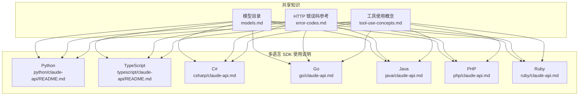
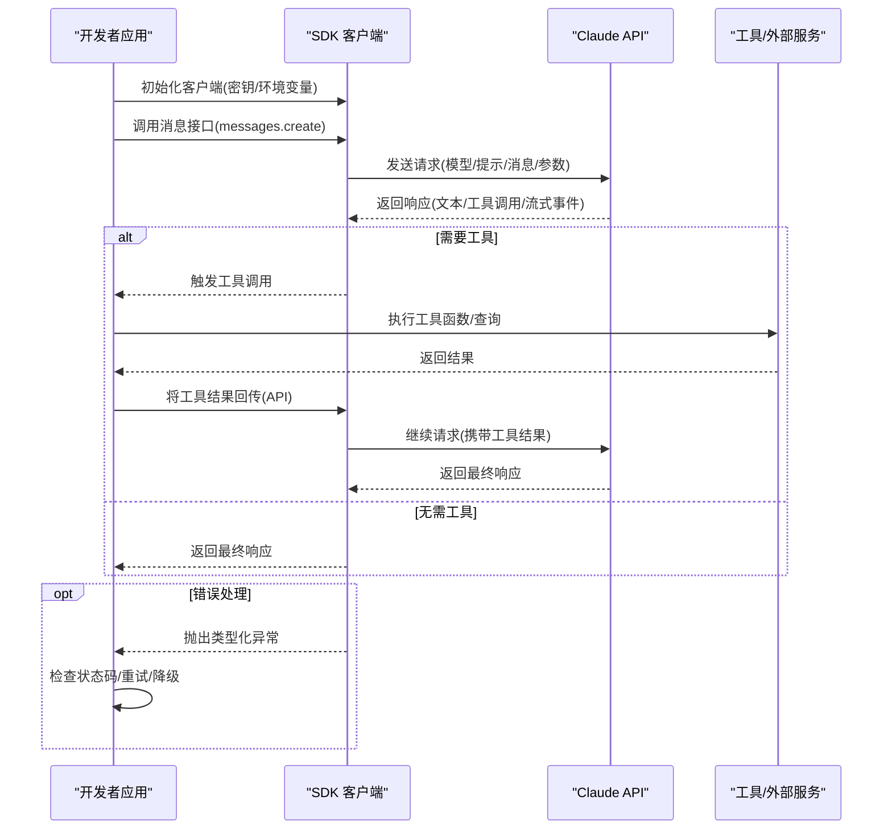
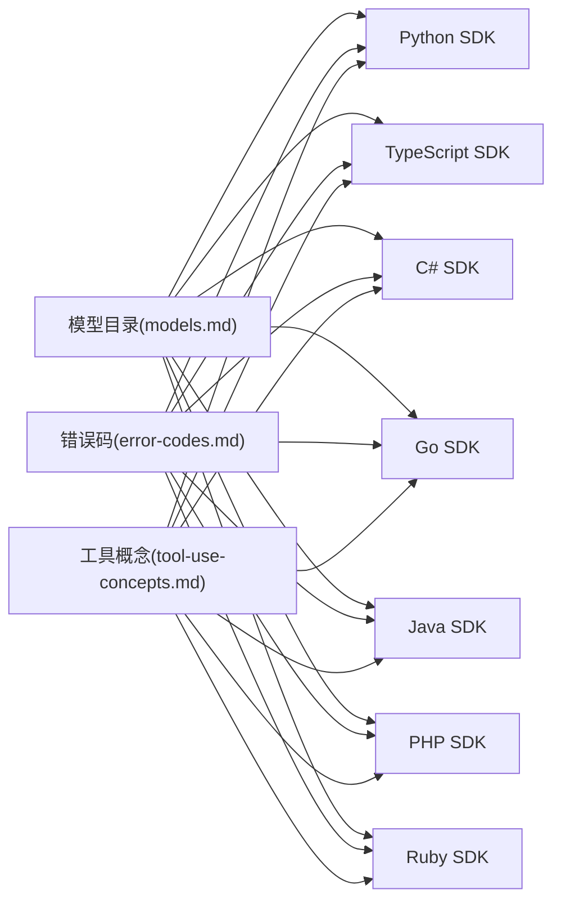

# API 基础使用

<cite>
**本文引用的文件**
- [models.md](file://skills/skills/claude-api/shared/models.md)
- [error-codes.md](file://skills/skills/claude-api/shared/error-codes.md)
- [tool-use-concepts.md](file://skills/skills/claude-api/shared/tool-use-concepts.md)
- [Python 使用说明](file://skills/skills/claude-api/python/claude-api/README.md)
- [TypeScript 使用说明](file://skills/skills/claude-api/typescript/claude-api/README.md)
- [C# 使用说明](file://skills/skills/claude-api/csharp/claude-api.md)
- [Go 使用说明](file://skills/skills/claude-api/go/claude-api.md)
- [Java 使用说明](file://skills/skills/claude-api/java/claude-api.md)
- [PHP 使用说明](file://skills/skills/claude-api/php/claude-api.md)
- [Ruby 使用说明](file://skills/skills/claude-api/ruby/claude-api.md)
</cite>

## 目录
1. [简介](#简介)
2. [项目结构](#项目结构)
3. [核心组件](#核心组件)
4. [架构总览](#架构总览)
5. [详细组件分析](#详细组件分析)
6. [依赖关系分析](#依赖关系分析)
7. [性能与成本优化](#性能与成本优化)
8. [故障排查指南](#故障排查指南)
9. [结论](#结论)
10. [附录](#附录)

## 简介
本文件面向首次使用 Claude API 的开发者，系统讲解 API 架构、模型选择策略、默认配置与基础调用模式，并覆盖 Python、TypeScript、Java、Go、C#、PHP、Ruby 七种主流语言的安装、认证与简单请求示例。同时，文档记录消息 API 的核心参数、响应格式与错误处理，提供单次调用、批量处理与文件上传的基础指南；解释思维模式配置、流式响应与上下文管理；并总结常见初始化问题与配置错误的解决方案。

## 项目结构
该仓库以“共享知识 + 多语言 SDK 使用说明”的方式组织 Claude API 基础使用内容：
- 共享知识：模型清单、错误码参考、工具使用概念
- 多语言 SDK：每种语言提供独立的 README 或使用说明，涵盖安装、认证、基础请求、流式、工具使用等主题

图表来源
- [models.md:1-69](file://skills/skills/claude-api/shared/models.md#L1-L69)
- [error-codes.md:1-206](file://skills/skills/claude-api/shared/error-codes.md#L1-L206)
- [tool-use-concepts.md:1-306](file://skills/skills/claude-api/shared/tool-use-concepts.md#L1-L306)
- [Python 使用说明:1-405](file://skills/skills/claude-api/python/claude-api/README.md#L1-L405)
- [TypeScript 使用说明:1-314](file://skills/skills/claude-api/typescript/claude-api/README.md#L1-L314)
- [C# 使用说明:1-71](file://skills/skills/claude-api/csharp/claude-api.md#L1-L71)
- [Go 使用说明:1-147](file://skills/skills/claude-api/go/claude-api.md#L1-L147)
- [Java 使用说明:1-129](file://skills/skills/claude-api/java/claude-api.md#L1-L129)
- [PHP 使用说明:1-89](file://skills/skills/claude-api/php/claude-api.md#L1-L89)
- [Ruby 使用说明:1-88](file://skills/skills/claude-api/ruby/claude-api.md#L1-L88)

章节来源
- [models.md:1-69](file://skills/skills/claude-api/shared/models.md#L1-L69)
- [error-codes.md:1-206](file://skills/skills/claude-api/shared/error-codes.md#L1-L206)
- [tool-use-concepts.md:1-306](file://skills/skills/claude-api/shared/tool-use-concepts.md#L1-L306)
- [Python 使用说明:1-405](file://skills/skills/claude-api/python/claude-api/README.md#L1-L405)
- [TypeScript 使用说明:1-314](file://skills/skills/claude-api/typescript/claude-api/README.md#L1-L314)
- [C# 使用说明:1-71](file://skills/skills/claude-api/csharp/claude-api.md#L1-L71)
- [Go 使用说明:1-147](file://skills/skills/claude-api/go/claude-api.md#L1-L147)
- [Java 使用说明:1-129](file://skills/skills/claude-api/java/claude-api.md#L1-L129)
- [PHP 使用说明:1-89](file://skills/skills/claude-api/php/claude-api.md#L1-L89)
- [Ruby 使用说明:1-88](file://skills/skills/claude-api/ruby/claude-api.md#L1-L88)

## 核心组件
- 模型目录与选择策略
  - 使用精确的模型 ID，优先采用别名（如 claude-opus-4-6、claude-sonnet-4-6、claude-haiku-4-5），避免拼写错误导致 404。
  - 新模型支持自适应思维（adaptive thinking），旧模型可使用扩展思维（extended thinking）但需满足预算令牌约束。
- 默认配置
  - 认证：通过环境变量 ANTHROPIC_API_KEY 初始化客户端；也可显式传入密钥。
  - 单次请求：指定 model、max_tokens、messages；可选 system 提示词。
  - 流式响应：按事件增量输出文本块，适合长输出与实时交互。
  - 工具使用：支持用户定义工具与服务器端工具（代码执行、网络检索等），并提供工具运行器或手动循环模式。
- 错误处理
  - 使用 SDK 的类型化异常类进行区分处理（如 400、401、403、404、429、5xx）。
  - 对于 429/5xx，SDK 默认自动重试（指数退避），可自定义最大重试次数。

章节来源
- [models.md:1-69](file://skills/skills/claude-api/shared/models.md#L1-L69)
- [error-codes.md:1-206](file://skills/skills/claude-api/shared/error-codes.md#L1-L206)
- [Python 使用说明:9-22](file://skills/skills/claude-api/python/claude-api/README.md#L9-L22)
- [TypeScript 使用说明:9-19](file://skills/skills/claude-api/typescript/claude-api/README.md#L9-L19)
- [C# 使用说明:11-23](file://skills/skills/claude-api/csharp/claude-api.md#L11-L23)
- [Go 使用说明:11-26](file://skills/skills/claude-api/go/claude-api.md#L11-L26)
- [Java 使用说明:23-36](file://skills/skills/claude-api/java/claude-api.md#L23-L36)
- [PHP 使用说明:11-18](file://skills/skills/claude-api/php/claude-api.md#L11-L18)
- [Ruby 使用说明:11-21](file://skills/skills/claude-api/ruby/claude-api.md#L11-L21)

## 架构总览
下图展示 Claude API 的通用调用流程：客户端初始化、发送消息请求、接收非流式或流式响应、处理工具调用与结果、错误处理与重试。

图表来源
- [Python 使用说明:26-37](file://skills/skills/claude-api/python/claude-api/README.md#L26-L37)
- [TypeScript 使用说明:23-32](file://skills/skills/claude-api/typescript/claude-api/README.md#L23-L32)
- [tool-use-concepts.md:60-84](file://skills/skills/claude-api/shared/tool-use-concepts.md#L60-L84)

## 详细组件分析

### 消息 API 参数与响应
- 核心参数
  - model：必须为有效模型 ID 或别名
  - max_tokens：输出上限，超过模型限制会触发 400
  - messages：必填，必须交替以 user/assistant 开头，且非空
  - system：可选系统提示词
  - cache_control：可选，用于提示词缓存（自动/手动）
  - thinking/output_config：可选，用于自适应思维与输出配置
  - tool_choice/tools：可选，控制工具使用策略与工具定义
- 响应字段
  - content：包含文本块与工具调用块
  - stop_reason：生成停止原因（如 end_turn、max_tokens、tool_use、pause_turn、refusal）
  - usage：输入/输出 token 数量（可通过计数接口预估）

章节来源
- [Python 使用说明:26-37](file://skills/skills/claude-api/python/claude-api/README.md#L26-L37)
- [TypeScript 使用说明:23-32](file://skills/skills/claude-api/typescript/claude-api/README.md#L23-L32)
- [tool-use-concepts.md:269-281](file://skills/skills/claude-api/shared/tool-use-concepts.md#L269-L281)

### 思维模式与输出配置
- 自适应思维（推荐）
  - 适用于 Opus/Sonnet 4.6，使用 adaptive thinking，不再需要 budget_tokens
  - 可配合 output_config.effort 控制生成质量
- 扩展思维（旧模型）
  - 需要 budget_tokens < max_tokens，且最小值为 1024
- 输出格式
  - 支持结构化输出（JSON Schema），确保可解析性与一致性

章节来源
- [Python 使用说明:157-179](file://skills/skills/claude-api/python/claude-api/README.md#L157-L179)
- [TypeScript 使用说明:151-176](file://skills/skills/claude-api/typescript/claude-api/README.md#L151-L176)
- [tool-use-concepts.md:252-291](file://skills/skills/claude-api/shared/tool-use-concepts.md#L252-L291)

### 流式响应
- 流式事件逐块返回文本增量，适合长输出与实时展示
- 各语言均提供流式迭代器/异步枚举器，按事件类型提取文本增量

章节来源
- [Python 使用说明:20-22](file://skills/skills/claude-api/python/claude-api/README.md#L20-L22)
- [TypeScript 使用说明:48-96](file://skills/skills/claude-api/typescript/claude-api/README.md#L48-L96)
- [C# 使用说明:44-64](file://skills/skills/claude-api/csharp/claude-api.md#L44-L64)
- [Go 使用说明:48-72](file://skills/skills/claude-api/go/claude-api.md#L48-L72)
- [Java 使用说明:61-79](file://skills/skills/claude-api/java/claude-api.md#L61-L79)
- [PHP 使用说明:68-82](file://skills/skills/claude-api/php/claude-api.md#L68-L82)
- [Ruby 使用说明:40-50](file://skills/skills/claude-api/ruby/claude-api.md#L40-L50)

### 上下文管理与长期对话
- API 是无状态的，每次请求需携带完整历史
- 长对话可使用压缩（compaction）在特定模型上自动压缩早期上下文，需保留并回传 compaction 块

章节来源
- [Python 使用说明:211-292](file://skills/skills/claude-api/python/claude-api/README.md#L211-L292)
- [TypeScript 使用说明:205-265](file://skills/skills/claude-api/typescript/claude-api/README.md#L205-L265)

### 文件上传与多模态
- 图像输入支持 URL 与 Base64 两种方式
- 支持多模态消息数组，结合文本与图像进行问答

章节来源
- [Python 使用说明:54-104](file://skills/skills/claude-api/python/claude-api/README.md#L54-L104)
- [TypeScript 使用说明:50-96](file://skills/skills/claude-api/typescript/claude-api/README.md#L50-L96)

### 工具使用（用户定义与服务器端）
- 用户定义工具
  - 通过 tools 数组提供 JSON Schema 定义，控制工具名称、描述与输入
  - 支持工具运行器（自动循环）与手动循环（细粒度控制）
- 服务器端工具
  - 代码执行、网络检索/抓取、程序化工具调用、工具搜索等
  - 动态过滤提升准确性，容器复用降低延迟
- 结构化输出
  - 通过 JSON Schema 约束输出，确保可解析性

章节来源
- [tool-use-concepts.md:5-33](file://skills/skills/claude-api/shared/tool-use-concepts.md#L5-L33)
- [tool-use-concepts.md:101-158](file://skills/skills/claude-api/shared/tool-use-concepts.md#L101-L158)
- [tool-use-concepts.md:161-190](file://skills/skills/claude-api/shared/tool-use-concepts.md#L161-L190)
- [tool-use-concepts.md:252-291](file://skills/skills/claude-api/shared/tool-use-concepts.md#L252-L291)
- [Go 使用说明:76-147](file://skills/skills/claude-api/go/claude-api.md#L76-L147)
- [Java 使用说明:83-129](file://skills/skills/claude-api/java/claude-api.md#L83-L129)
- [Ruby 使用说明:54-88](file://skills/skills/claude-api/ruby/claude-api.md#L54-L88)

### 多语言安装与认证配置
- Python
  - 安装：pip 安装官方 SDK
  - 认证：默认从环境变量读取，也可显式传入
  - 示例：基础消息请求、系统提示、图像输入、缓存控制、思维模式、流式、工具使用、错误处理
- TypeScript
  - 安装：npm 安装官方 SDK
  - 认证：默认从环境变量读取，也可显式传入
  - 示例：基础消息请求、系统提示、图像输入、缓存控制、思维模式、流式、工具使用、错误处理
- C#
  - 安装：dotnet 添加官方包
  - 认证：从环境变量读取 API Key
  - 示例：基础消息请求、流式、工具使用（手动循环）
- Go
  - 安装：go get 官方 SDK
  - 认证：默认从环境变量读取
  - 示例：基础消息请求、流式、工具运行器（Beta）、手动循环
- Java
  - 安装：Maven/Gradle 引入官方 SDK
  - 认证：从环境变量或 builder 显式传入
  - 示例：基础消息请求、流式、工具运行器（注解类，Beta）、手动循环
- PHP
  - 安装：composer 引入官方 SDK
  - 认证：从环境变量读取
  - 示例：基础消息请求、流式；另支持 Bedrock/Vertex/Foundry 客户端
- Ruby
  - 安装：gem 安装官方 SDK
  - 认证：默认从环境变量读取，也可显式传入
  - 示例：基础消息请求、流式；提供 Beta 工具运行器与手动循环

章节来源
- [Python 使用说明:3-22](file://skills/skills/claude-api/python/claude-api/README.md#L3-L22)
- [TypeScript 使用说明:3-19](file://skills/skills/claude-api/typescript/claude-api/README.md#L3-L19)
- [C# 使用说明:5-23](file://skills/skills/claude-api/csharp/claude-api.md#L5-L23)
- [Go 使用说明:5-26](file://skills/skills/claude-api/go/claude-api.md#L5-L26)
- [Java 使用说明:5-36](file://skills/skills/claude-api/java/claude-api.md#L5-L36)
- [PHP 使用说明:5-49](file://skills/skills/claude-api/php/claude-api.md#L5-L49)
- [Ruby 使用说明:5-21](file://skills/skills/claude-api/ruby/claude-api.md#L5-L21)

### 批量处理与文件 API（概述）
- 批量处理：通过批量 API 并行提交多个消息请求，提高吞吐量
- 文件 API：支持上传文件以增强多模态理解与检索能力
- 以上主题在各语言子目录中分别提供 README 与示例，建议按需查阅对应语言文档

章节来源
- [Python 使用说明](file://skills/skills/claude-api/python/claude-api/batches.md)
- [TypeScript 使用说明](file://skills/skills/claude-api/typescript/claude-api/batches.md)
- [Python 使用说明](file://skills/skills/claude-api/python/claude-api/files-api.md)
- [TypeScript 使用说明](file://skills/skills/claude-api/typescript/claude-api/files-api.md)

## 依赖关系分析
- 模型选择依赖共享模型目录，确保使用精确 ID 与别名
- 错误处理依赖共享错误码参考，统一映射到 SDK 类型化异常
- 工具使用依赖共享工具概念文档，规范工具定义与循环模式
- 各语言 SDK 作为客户端层，依赖上述共享知识与平台 API

图表来源
- [models.md:1-69](file://skills/skills/claude-api/shared/models.md#L1-L69)
- [error-codes.md:1-206](file://skills/skills/claude-api/shared/error-codes.md#L1-L206)
- [tool-use-concepts.md:1-306](file://skills/skills/claude-api/shared/tool-use-concepts.md#L1-L306)
- [Python 使用说明:1-405](file://skills/skills/claude-api/python/claude-api/README.md#L1-L405)
- [TypeScript 使用说明:1-314](file://skills/skills/claude-api/typescript/claude-api/README.md#L1-L314)
- [C# 使用说明:1-71](file://skills/skills/claude-api/csharp/claude-api.md#L1-L71)
- [Go 使用说明:1-147](file://skills/skills/claude-api/go/claude-api.md#L1-L147)
- [Java 使用说明:1-129](file://skills/skills/claude-api/java/claude-api.md#L1-L129)
- [PHP 使用说明:1-89](file://skills/skills/claude-api/php/claude-api.md#L1-L89)
- [Ruby 使用说明:1-88](file://skills/skills/claude-api/ruby/claude-api.md#L1-L88)

## 性能与成本优化
- 使用提示词缓存（Prompt Caching）
  - 自动缓存最后可缓存块，显著降低重复上下文成本
- 选择合适模型
  - Opus：最智能，适合复杂任务
  - Sonnet：速度与智能平衡，适合生产
  - Haiku：最快最便宜，适合简单任务
- 请求前估算 token 成本，合理设置 max_tokens
- 在高负载场景使用流式响应与指数退避重试

章节来源
- [Python 使用说明:108-153](file://skills/skills/claude-api/python/claude-api/README.md#L108-L153)
- [TypeScript 使用说明:100-147](file://skills/skills/claude-api/typescript/claude-api/README.md#L100-L147)
- [Python 使用说明:311-366](file://skills/skills/claude-api/python/claude-api/README.md#L311-L366)
- [TypeScript 使用说明:284-313](file://skills/skills/claude-api/typescript/claude-api/README.md#L284-L313)

## 故障排查指南
- 常见错误与修复
  - 400：请求格式或参数无效（如缺少 model/max_tokens/messages、角色不交替、消息为空）
  - 401：缺少或无效 API Key（检查环境变量）
  - 403：API Key 权限不足或访问受限
  - 404：端点或模型 ID 无效（使用精确 ID 或别名）
  - 413：请求过大（减少输入、压缩图片、拆分文档）
  - 429：超出速率限制（等待 retry-after 或降低速率）
  - 500/529：服务端错误或过载（指数退避重试）
- 类型化异常与最佳实践
  - 使用 SDK 的类型化异常类进行分支处理，避免字符串匹配
  - 从最具体到最不具体的顺序判断（如 RateLimitError 再到 APIError）

章节来源
- [error-codes.md:18-206](file://skills/skills/claude-api/shared/error-codes.md#L18-L206)
- [Python 使用说明:182-208](file://skills/skills/claude-api/python/claude-api/README.md#L182-L208)
- [TypeScript 使用说明:179-202](file://skills/skills/claude-api/typescript/claude-api/README.md#L179-L202)

## 结论
通过共享模型与错误码知识以及多语言 SDK 使用说明，开发者可以快速完成 Claude API 的基础集成：正确选择模型、配置认证、构造消息请求、处理流式与工具调用、并建立稳健的错误处理与重试机制。对于复杂场景（批量、文件、长期对话、思维模式），可进一步参考各语言文档中的专题说明。

## 附录

### 模型选择速查表
- 推荐模型
  - Opus 4.6：最智能，支持自适应思维，1M 上下文（beta）
  - Sonnet 4.6：速度与智能平衡，支持自适应思维，1M 上下文（beta）
  - Haiku 4.5：最快最便宜，适合简单任务
- 别名与 ID
  - 使用别名（如 claude-opus-4-6）以避免拼写错误
  - 仅使用共享目录中列出的确切 ID

章节来源
- [models.md:5-69](file://skills/skills/claude-api/shared/models.md#L5-L69)

### 常见初始化问题清单
- API Key 未设置或格式错误
  - 确保环境变量 ANTHROPIC_API_KEY 正确设置
- 模型 ID 不正确
  - 使用共享模型目录中的精确 ID 或别名
- 首条消息不是 user 角色
  - 确保消息数组以 user 开头并交替出现
- 超出速率限制
  - 使用 SDK 默认重试或实现指数退避
- 请求体过大
  - 减少上下文、压缩图片、拆分文档

章节来源
- [error-codes.md:50-83](file://skills/skills/claude-api/shared/error-codes.md#L50-L83)
- [error-codes.md:119-156](file://skills/skills/claude-api/shared/error-codes.md#L119-L156)
- [Python 使用说明:211-257](file://skills/skills/claude-api/python/claude-api/README.md#L211-L257)
- [TypeScript 使用说明:205-228](file://skills/skills/claude-api/typescript/claude-api/README.md#L205-L228)