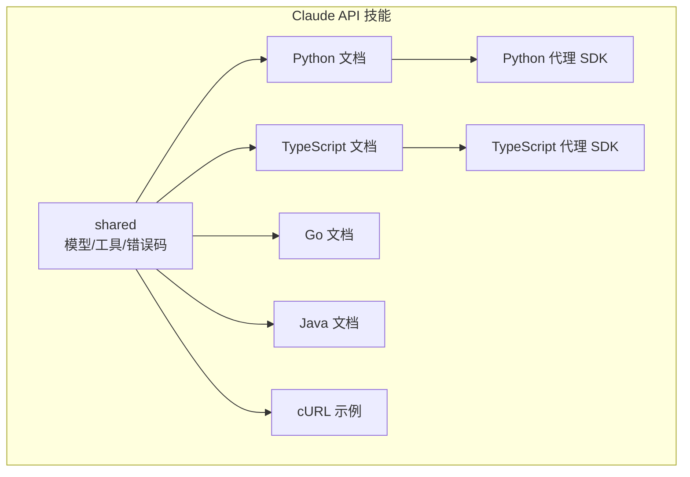
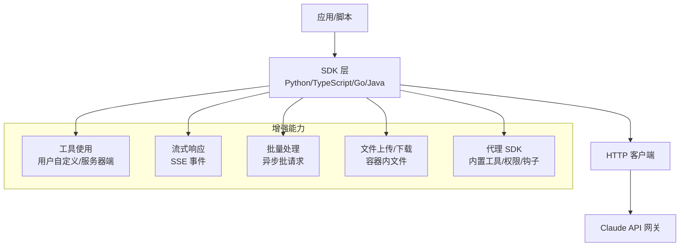
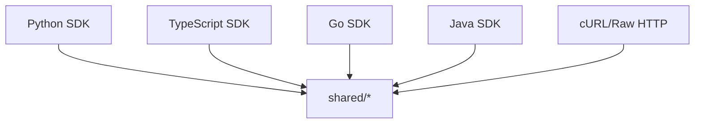

# Claude API 技能

<cite>
**本文引用的文件**
- [marketplace.json](file://skills/.claude-plugin/marketplace.json)
- [models.md](file://skills/skills/claude-api/shared/models.md)
- [tool-use-concepts.md](file://skills/skills/claude-api/shared/tool-use-concepts.md)
- [error-codes.md](file://skills/skills/claude-api/shared/error-codes.md)
- [python/README.md](file://skills/skills/claude-api/python/claude-api/README.md)
- [python/tool-use.md](file://skills/skills/claude-api/python/claude-api/tool-use.md)
- [python/streaming.md](file://skills/skills/claude-api/python/claude-api/streaming.md)
- [python/batches.md](file://skills/skills/claude-api/python/claude-api/batches.md)
- [typescript/README.md](file://skills/skills/claude-api/typescript/claude-api/README.md)
- [typescript/tool-use.md](file://skills/skills/claude-api/typescript/claude-api/tool-use.md)
- [typescript/streaming.md](file://skills/skills/claude-api/typescript/claude-api/streaming.md)
- [typescript/batches.md](file://skills/skills/claude-api/typescript/claude-api/batches.md)
- [curl/examples.md](file://skills/skills/claude-api/curl/examples.md)
- [go/claude-api.md](file://skills/skills/claude-api/go/claude-api.md)
- [java/claude-api.md](file://skills/skills/claude-api/java/claude-api.md)
- [python/agent-sdk/README.md](file://skills/skills/claude-api/python/agent-sdk/README.md)
- [typescript/agent-sdk/README.md](file://skills/skills/claude-api/typescript/agent-sdk/README.md)
</cite>

## 目录
1. [简介](#简介)
2. [项目结构](#项目结构)
3. [核心组件](#核心组件)
4. [架构总览](#架构总览)
5. [详细组件分析](#详细组件分析)
6. [依赖关系分析](#依赖关系分析)
7. [性能考量](#性能考量)
8. [故障排查指南](#故障排查指南)
9. [结论](#结论)
10. [附录](#附录)

## 简介
本技能文档系统化介绍 Claude API 的架构设计、模型选择策略、思维模式配置与工具使用概念，并结合仓库中多语言实现示例（Python、TypeScript、Java、Go、cURL），覆盖参数说明、响应格式、错误处理与最佳实践。同时对比代理 SDK 与直接 API 调用的差异，给出何时使用哪种方式的建议；并提供批量处理、文件上传、流式响应等高级功能的使用指南与常见问题的解决方案。

## 项目结构
该仓库以“技能”为组织单元，Claude API 技能位于 skills/skills/claude-api 下，按语言与主题拆分文档与示例：
- shared：通用概念与参考（模型目录、工具使用概念、错误码）
- 各语言子目录：各自语言的 Claude API 使用指南、工具使用、流式、批处理等
- curl：raw HTTP 示例，便于无官方 SDK 的场景
- agent-sdk：代理 SDK（Python、TypeScript），提供更高层的智能体能力与内置工具

图表来源
- [marketplace.json:45-53](file://skills/.claude-plugin/marketplace.json#L45-L53)
- [models.md:1-69](file://skills/skills/claude-api/shared/models.md#L1-L69)
- [tool-use-concepts.md:1-306](file://skills/skills/claude-api/shared/tool-use-concepts.md#L1-L306)
- [error-codes.md:1-206](file://skills/skills/claude-api/shared/error-codes.md#L1-L206)

章节来源
- [marketplace.json:45-53](file://skills/.claude-plugin/marketplace.json#L45-L53)

## 核心组件
- 模型目录与选择策略：提供当前/遗留/弃用/退休模型清单与别名映射，指导用户根据任务复杂度与成本选择合适模型。
- 工具使用概念：涵盖用户自定义工具、服务器端工具（代码执行、网络搜索/抓取）、程序化工具调用、工具搜索、内存工具、结构化输出等。
- 错误码参考：覆盖 400/401/403/404/413/429/500/529 等错误类型、常见原因与修复建议。
- 多语言 API 使用：Python、TypeScript、Go、Java 提供基础消息请求、视觉输入、提示缓存、扩展思考、错误处理、多轮对话、压缩（长对话）等。
- 流式与批处理：支持流式事件与 SSE，以及批量异步处理以降低成本。
- 代理 SDK：在 Python 与 TypeScript 中提供更高层的智能体接口，内置工具、权限控制、钩子、子智能体等。

章节来源
- [models.md:1-69](file://skills/skills/claude-api/shared/models.md#L1-L69)
- [tool-use-concepts.md:1-306](file://skills/skills/claude-api/shared/tool-use-concepts.md#L1-L306)
- [error-codes.md:1-206](file://skills/skills/claude-api/shared/error-codes.md#L1-L206)
- [python/README.md:1-405](file://skills/skills/claude-api/python/claude-api/README.md#L1-L405)
- [typescript/README.md:1-314](file://skills/skills/claude-api/typescript/claude-api/README.md#L1-L314)
- [go/claude-api.md:1-147](file://skills/skills/claude-api/go/claude-api.md#L1-L147)
- [java/claude-api.md:1-129](file://skills/skills/claude-api/java/claude-api.md#L1-L129)
- [python/agent-sdk/README.md:1-270](file://skills/skills/claude-api/python/agent-sdk/README.md#L1-L270)
- [typescript/agent-sdk/README.md:1-221](file://skills/skills/claude-api/typescript/agent-sdk/README.md#L1-L221)

## 架构总览
下图展示了 Claude API 的典型调用路径与可选增强能力（工具、流式、批处理、文件上传、代理 SDK）：

图表来源
- [python/README.md:9-22](file://skills/skills/claude-api/python/claude-api/README.md#L9-L22)
- [typescript/README.md:9-19](file://skills/skills/claude-api/typescript/claude-api/README.md#L9-L19)
- [go/claude-api.md:13-26](file://skills/skills/claude-api/go/claude-api.md#L13-L26)
- [java/claude-api.md:25-36](file://skills/skills/claude-api/java/claude-api.md#L25-L36)
- [python/tool-use.md:5-49](file://skills/skills/claude-api/python/claude-api/tool-use.md#L5-L49)
- [typescript/tool-use.md:5-48](file://skills/skills/claude-api/typescript/claude-api/tool-use.md#L5-L48)
- [python/streaming.md:3-26](file://skills/skills/claude-api/python/claude-api/streaming.md#L3-L26)
- [typescript/streaming.md:5-20](file://skills/skills/claude-api/typescript/claude-api/streaming.md#L5-L20)
- [python/batches.md:15-47](file://skills/skills/claude-api/python/claude-api/batches.md#L15-L47)
- [typescript/batches.md:15-49](file://skills/skills/claude-api/typescript/claude-api/batches.md#L15-L49)
- [python/agent-sdk/README.md:13-28](file://skills/skills/claude-api/python/agent-sdk/README.md#L13-L28)
- [typescript/agent-sdk/README.md:13-26](file://skills/skills/claude-api/typescript/agent-sdk/README.md#L13-L26)

## 详细组件分析

### 模型选择策略
- 推荐模型
  - Claude Opus 4.6：最智能，适合构建智能体与编码；支持自适应思考，最大输出 128K（大输出需配合流式）；可通过特定头启用 1M 上下文窗口。
  - Claude Sonnet 4.6：速度与智能平衡，同样支持自适应思考；1M 上下文窗口可通过特定头启用。
  - Claude Haiku 4.5：最快且最经济，适合简单任务。
- 遗留与弃用
  - 遗留模型仍可用，但建议迁移至推荐模型。
  - 弃用/退休模型将逐步停止服务，应尽快替换。
- 用户请求解析
  - 提供“用户口述”到模型 ID 的映射表，避免拼写错误导致 404。

章节来源
- [models.md:5-69](file://skills/skills/claude-api/shared/models.md#L5-L69)

### 思维模式配置（Extended Thinking）
- Opus/Sonnet 4.6：使用自适应思考（adaptive），不再需要预算令牌字段；可通过输出努力级别提升质量。
- 旧模型：使用启用型思考并设置预算令牌（必须小于 max_tokens，最小 1024）。
- 停止原因
  - end_turn：自然结束
  - max_tokens：达到上限
  - stop_sequence：命中自定义停止序列
  - tool_use：需要调用工具
  - pause_turn：暂停（服务器端工具迭代限制），需重发用户与助手内容继续
  - refusal：出于安全原因拒绝

章节来源
- [python/README.md:157-178](file://skills/skills/claude-api/python/claude-api/README.md#L157-L178)
- [typescript/README.md:151-175](file://skills/skills/claude-api/typescript/claude-api/README.md#L151-L175)
- [python/README.md:296-308](file://skills/skills/claude-api/python/claude-api/README.md#L296-L308)
- [typescript/README.md:269-281](file://skills/skills/claude-api/typescript/claude-api/README.md#L269-L281)

### 工具使用概念与实现
- 用户自定义工具
  - 结构：名称、描述、JSON Schema 输入；建议提供示例输入以降低参数错误率。
  - 工具选择：auto/any/tool/none；可禁用并行工具调用。
  - 执行循环：手动循环或使用 SDK 的工具运行器（推荐）。
- 服务器端工具
  - 代码执行：沙箱环境，预装数据科学库；支持上传文件、复用容器、下载生成文件。
  - 网络搜索/抓取：支持动态过滤以减少上下文占用；与代码执行同用时需注意环境隔离。
  - 程序化工具调用、工具搜索、计算机操作等。
- 内存工具：客户端工具，通过内存目录持久化信息，注意隐私与安全。
- 结构化输出：通过 JSON Schema 约束输出，支持严格工具参数校验；注意不兼容引用、数值约束等限制。

章节来源
- [tool-use-concepts.md:5-306](file://skills/skills/claude-api/shared/tool-use-concepts.md#L5-L306)
- [python/tool-use.md:5-49](file://skills/skills/claude-api/python/claude-api/tool-use.md#L5-L49)
- [typescript/tool-use.md:5-48](file://skills/skills/claude-api/typescript/claude-api/tool-use.md#L5-L48)
- [python/tool-use.md:283-405](file://skills/skills/claude-api/python/claude-api/tool-use.md#L283-L405)
- [typescript/tool-use.md:217-346](file://skills/skills/claude-api/typescript/claude-api/tool-use.md#L217-L346)
- [python/tool-use.md:408-458](file://skills/skills/claude-api/python/claude-api/tool-use.md#L408-L458)
- [typescript/tool-use.md:350-404](file://skills/skills/claude-api/typescript/claude-api/tool-use.md#L350-L404)
- [python/tool-use.md:460-588](file://skills/skills/claude-api/python/claude-api/tool-use.md#L460-L588)
- [typescript/tool-use.md:407-478](file://skills/skills/claude-api/typescript/claude-api/tool-use.md#L407-L478)

### 多语言实现要点

#### Python
- 客户端初始化、基础消息、系统提示、图像（Base64/URL）、提示缓存、扩展思考、错误处理、多轮对话、压缩（长对话）、停止原因、成本优化、指数回退重试。
- 工具使用：工具运行器（推荐）、MCP 转换辅助、手动循环、代码执行（含文件上传/下载/容器复用）、内存工具、结构化输出（Pydantic/Zod）。
- 流式：文本流、事件类型、最终消息获取、进度更新、错误处理。
- 批量：创建、轮询、结果检索、取消、与提示缓存结合。
- 代理 SDK：内置工具、权限系统、MCP 支持、钩子、子智能体、消息类型与最佳实践。

章节来源
- [python/README.md:9-405](file://skills/skills/claude-api/python/claude-api/README.md#L9-L405)
- [python/tool-use.md:1-588](file://skills/skills/claude-api/python/claude-api/tool-use.md#L1-L588)
- [python/streaming.md:1-163](file://skills/skills/claude-api/python/claude-api/streaming.md#L1-L163)
- [python/batches.md:1-183](file://skills/skills/claude-api/python/claude-api/batches.md#L1-L183)
- [python/agent-sdk/README.md:1-270](file://skills/skills/claude-api/python/agent-sdk/README.md#L1-L270)

#### TypeScript
- 客户端初始化、基础消息、系统提示、图像（Base64/URL）、提示缓存、扩展思考、错误处理、多轮对话、压缩（长对话）、停止原因、成本优化、令牌计数。
- 工具使用：工具运行器（推荐）、手动循环（含流式）、代码执行（含文件上传/下载/容器复用）、内存工具、结构化输出（Zod）。
- 流式：事件类型、最终消息获取、SSE 原始格式。
- 批量：创建、轮询、结果检索、取消。
- 代理 SDK：内置工具、权限系统、MCP 支持（含进程内工具）、钩子、子智能体、消息类型与最佳实践。

章节来源
- [typescript/README.md:1-314](file://skills/skills/claude-api/typescript/claude-api/README.md#L1-L314)
- [typescript/tool-use.md:1-478](file://skills/skills/claude-api/typescript/claude-api/tool-use.md#L1-L478)
- [typescript/streaming.md:1-179](file://skills/skills/claude-api/typescript/claude-api/streaming.md#L1-L179)
- [typescript/batches.md:1-107](file://skills/skills/claude-api/typescript/claude-api/batches.md#L1-L107)
- [typescript/agent-sdk/README.md:1-221](file://skills/skills/claude-api/typescript/agent-sdk/README.md#L1-L221)

#### Go
- 客户端初始化、基础消息、流式、工具使用（Beta：工具运行器，自动从结构体标签生成 JSON Schema）。
- 手动循环：遵循共享工具使用概念，定义 JSON Schema 工具并在响应中处理 tool_use 与 tool_result。

章节来源
- [go/claude-api.md:1-147](file://skills/skills/claude-api/go/claude-api.md#L1-L147)

#### Java
- 客户端初始化、基础消息、流式、工具使用（Beta：注解类 + 工具运行器；非 Beta：通过 JSON Schema 手动定义）。
- 手动循环：遵循共享工具使用概念。

章节来源
- [java/claude-api.md:1-129](file://skills/skills/claude-api/java/claude-api.md#L1-L129)

#### cURL/Raw HTTP
- 设置认证与版本头、基础消息、流式（SSE）、工具使用往返、扩展思考、必要头部列表。

章节来源
- [curl/examples.md:1-165](file://skills/skills/claude-api/curl/examples.md#L1-L165)

### 代理 SDK 与直接 API 调用
- 代理 SDK（Python/TypeScript）
  - 提供更高层抽象：内置工具（读写文件、编辑、Bash、搜索、子智能体等）、权限系统、钩子、MCP 集成、消息类型与生命周期管理。
  - 适合快速搭建具备安全与可观测性的智能体。
- 直接 API 调用
  - 更细粒度控制，适合定制化流程、特殊协议或无官方 SDK 场景。
  - 需自行实现工具循环、流式事件处理、批处理状态轮询、错误处理与重试策略。

章节来源
- [python/agent-sdk/README.md:1-270](file://skills/skills/claude-api/python/agent-sdk/README.md#L1-L270)
- [typescript/agent-sdk/README.md:1-221](file://skills/skills/claude-api/typescript/agent-sdk/README.md#L1-L221)
- [python/README.md:9-22](file://skills/skills/claude-api/python/claude-api/README.md#L9-L22)
- [typescript/README.md:9-19](file://skills/skills/claude-api/typescript/claude-api/README.md#L9-L19)

### 高级功能使用指南

#### 批量处理（Batches API）
- 特性：异步处理、50% 成本折扣、支持所有消息 API 功能（视觉、工具、缓存等）。
- 流程：创建批次、轮询状态、检索结果、取消、与提示缓存结合。
- 适用：大规模文本分类、摘要、问答等。

章节来源
- [python/batches.md:1-183](file://skills/skills/claude-api/python/claude-api/batches.md#L1-L183)
- [typescript/batches.md:1-107](file://skills/skills/claude-api/typescript/claude-api/batches.md#L1-L107)

#### 文件上传与代码执行
- 文件上传：通过 beta 文件 API 上传，再在代码执行中以容器上传块传递。
- 容器复用：保存容器 ID，在后续请求中复用以保持状态。
- 输出文件：下载生成文件并进行安全命名与路径校验。

章节来源
- [python/tool-use.md:312-383](file://skills/skills/claude-api/python/claude-api/tool-use.md#L312-L383)
- [typescript/tool-use.md:240-346](file://skills/skills/claude-api/typescript/claude-api/tool-use.md#L240-L346)

#### 流式响应（Streaming）
- 事件类型：message_start/content_block_start/delta/stop、message_delta/stop。
- 最佳实践：刷新输出、跟踪令牌用量、使用超时、默认使用获取最终消息以获得超时保护。
- 与工具：工具运行器当前返回完整消息；如需逐令牌流式，可在手动循环中使用流式 API 并在末尾获取完整消息。

章节来源
- [python/streaming.md:145-163](file://skills/skills/claude-api/python/claude-api/streaming.md#L145-L163)
- [typescript/streaming.md:135-155](file://skills/skills/claude-api/typescript/claude-api/streaming.md#L135-L155)

## 依赖关系分析

图表来源
- [python/README.md:1-405](file://skills/skills/claude-api/python/claude-api/README.md#L1-L405)
- [typescript/README.md:1-314](file://skills/skills/claude-api/typescript/claude-api/README.md#L1-L314)
- [go/claude-api.md:1-147](file://skills/skills/claude-api/go/claude-api.md#L1-L147)
- [java/claude-api.md:1-129](file://skills/skills/claude-api/java/claude-api.md#L1-L129)
- [curl/examples.md:1-165](file://skills/skills/claude-api/curl/examples.md#L1-L165)
- [models.md:1-69](file://skills/skills/claude-api/shared/models.md#L1-L69)
- [tool-use-concepts.md:1-306](file://skills/skills/claude-api/shared/tool-use-concepts.md#L1-L306)
- [error-codes.md:1-206](file://skills/skills/claude-api/shared/error-codes.md#L1-L206)

章节来源
- [python/README.md:1-405](file://skills/skills/claude-api/python/claude-api/README.md#L1-L405)
- [typescript/README.md:1-314](file://skills/skills/claude-api/typescript/claude-api/README.md#L1-L314)
- [go/claude-api.md:1-147](file://skills/skills/claude-api/go/claude-api.md#L1-L147)
- [java/claude-api.md:1-129](file://skills/skills/claude-api/java/claude-api.md#L1-L129)
- [curl/examples.md:1-165](file://skills/skills/claude-api/curl/examples.md#L1-L165)
- [models.md:1-69](file://skills/skills/claude-api/shared/models.md#L1-L69)
- [tool-use-concepts.md:1-306](file://skills/skills/claude-api/shared/tool-use-concepts.md#L1-L306)
- [error-codes.md:1-206](file://skills/skills/claude-api/shared/error-codes.md#L1-L206)

## 性能考量
- 成本优化
  - 提示缓存：对重复上下文自动/手动缓存，显著降低重复输入成本。
  - 模型选择：默认优先 Opus，高吞吐生产使用 Sonnet，简单任务使用 Haiku。
  - 令牌计数：请求前估算输入成本，合理设置 max_tokens。
  - 批量处理：异步批处理 50% 成本折扣。
- 长对话压缩（Opus 4.6 专用 beta）：当上下文接近 200K 时自动压缩早期上下文，需在后续请求中保留压缩块。
- 流式响应：降低首字节延迟，适合实时交互；注意事件处理与令牌用量统计。

章节来源
- [python/README.md:108-153](file://skills/skills/claude-api/python/claude-api/README.md#L108-L153)
- [typescript/README.md:100-147](file://skills/skills/claude-api/typescript/claude-api/README.md#L100-L147)
- [python/README.md:311-352](file://skills/skills/claude-api/python/claude-api/README.md#L311-L352)
- [python/batches.md:1-12](file://skills/skills/claude-api/python/claude-api/batches.md#L1-L12)
- [python/README.md:260-292](file://skills/skills/claude-api/python/claude-api/README.md#L260-L292)
- [typescript/README.md:231-265](file://skills/skills/claude-api/typescript/claude-api/README.md#L231-L265)

## 故障排查指南
- 常见错误与修复
  - 400：请求格式/参数无效；检查必填项、角色交替、消息非空。
  - 401：缺少或无效 API Key；确保环境变量正确。
  - 403：API Key 权限不足或访问受限；检查控制台权限与特性访问。
  - 404：端点或模型 ID 错误；使用精确模型 ID 或别名。
  - 413：请求过大；缩短历史、压缩图片或拆分文档。
  - 429/5xx：速率限制/服务过载；使用 SDK 默认指数回退重试或自定义策略。
- 错误码参考与类型化异常
  - 使用 SDK 类型化异常（如 BadRequestError、RateLimitError 等）进行分支处理，避免字符串匹配。
  - 关注重试等待时间与配额头信息。

章节来源
- [error-codes.md:1-206](file://skills/skills/claude-api/shared/error-codes.md#L1-L206)
- [python/README.md:182-208](file://skills/skills/claude-api/python/claude-api/README.md#L182-L208)
- [typescript/README.md:179-202](file://skills/skills/claude-api/typescript/claude-api/README.md#L179-L202)

## 结论
本技能文档基于仓库中的多语言实现与共享概念，系统阐述了 Claude API 的模型选择、思维模式、工具使用、流式与批量等关键能力，并提供了代理 SDK 与直接 API 的对比与使用建议。结合错误码参考与最佳实践，开发者可据此快速集成并稳定运行各类应用场景。

## 附录

### API 调用参数与响应概览（多语言）
- Python
  - 基础消息、系统提示、图像（Base64/URL）、提示缓存、扩展思考、多轮对话、压缩、停止原因、成本优化、流式事件、批量创建/轮询/结果、代理 SDK 查询与消息类型。
- TypeScript
  - 基础消息、系统提示、图像（Base64/URL）、提示缓存、扩展思考、多轮对话、压缩、停止原因、成本优化、流式事件、批量创建/轮询/结果、代理 SDK 查询与消息类型。
- Go
  - 基础消息、流式、工具运行器（Beta，自动 JSON Schema 生成）、手动循环。
- Java
  - 基础消息、流式、工具运行器（Beta，注解类）、手动循环。
- cURL
  - 认证与版本头、基础消息、流式（SSE）、工具使用往返、扩展思考、必要头部。

章节来源
- [python/README.md:26-405](file://skills/skills/claude-api/python/claude-api/README.md#L26-L405)
- [typescript/README.md:23-314](file://skills/skills/claude-api/typescript/claude-api/README.md#L23-L314)
- [go/claude-api.md:30-147](file://skills/skills/claude-api/go/claude-api.md#L30-L147)
- [java/claude-api.md:40-129](file://skills/skills/claude-api/java/claude-api.md#L40-L129)
- [curl/examples.md:13-165](file://skills/skills/claude-api/curl/examples.md#L13-L165)