# 代理 SDK

<cite>
**本文引用的文件**   
- [skills/skills/claude-api/typescript/agent-sdk/README.md](file://skills/skills/claude-api/typescript/agent-sdk/README.md)
- [skills/skills/claude-api/typescript/agent-sdk/patterns.md](file://skills/skills/claude-api/typescript/agent-sdk/patterns.md)
- [skills/skills/claude-api/python/agent-sdk/README.md](file://skills/skills/claude-api/python/agent-sdk/README.md)
- [skills/skills/claude-api/python/agent-sdk/patterns.md](file://skills/skills/claude-api/python/agent-sdk/patterns.md)
- [skills/skills/mcp-builder/SKILL.md](file://skills/skills/mcp-builder/SKILL.md)
- [skills/skills/mcp-builder/reference/mcp_best_practices.md](file://skills/skills/mcp-builder/reference/mcp_best_practices.md)
- [skills/skills/mcp-builder/reference/node_mcp_server.md](file://skills/skills/mcp-builder/reference/node_mcp_server.md)
- [skills/README.md](file://skills/README.md)
- [skills/spec/agent-skills-spec.md](file://skills/spec/agent-skills-spec.md)
</cite>

## 目录
1. [简介](#简介)
2. [项目结构](#项目结构)
3. [核心组件](#核心组件)
4. [架构总览](#架构总览)
5. [详细组件分析](#详细组件分析)
6. [依赖分析](#依赖分析)
7. [性能考虑](#性能考虑)
8. [故障排查指南](#故障排查指南)
9. [结论](#结论)
10. [附录](#附录)

## 简介
本文件面向“代理 SDK”的使用者与开发者，系统性阐述代理架构、内置工具、权限控制、MCP（模型上下文协议）集成、代理创建、工具开发、钩子使用、子代理模式、会话恢复与模式编排等主题，并给出安全特性、性能优化与调试技巧。同时说明 Agent SDK 与 Claude API 的关系及适用场景，帮助读者在合适的场景下选择 Agent SDK 而非直接使用 Claude API。

## 项目结构
该仓库包含多语言 Agent SDK 文档与示例，以及 MCP 构建指南与技能体系说明。与代理 SDK 直接相关的核心位置如下：
- TypeScript Agent SDK：安装、快速开始、内置工具、权限系统、MCP 集成、钩子、常用选项、子代理、消息类型、最佳实践
- Python Agent SDK：安装、快速开始、内置工具、主要接口、权限系统、MCP 集成、钩子、常用选项、消息类型、子代理、错误处理、最佳实践
- MCP 构建指南：MCP 协议概述、流程、最佳实践、Node/TypeScript 实现要点、测试与评估
- 技能体系：技能概念、使用方式、模板与规范链接

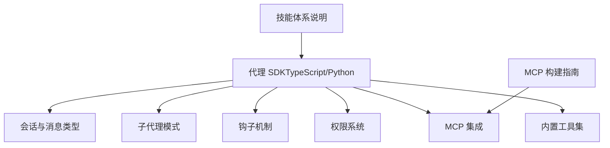

**章节来源**
- [skills/skills/claude-api/typescript/agent-sdk/README.md:1-221](file://skills/skills/claude-api/typescript/agent-sdk/README.md#L1-L221)
- [skills/skills/claude-api/python/agent-sdk/README.md:1-270](file://skills/skills/claude-api/python/agent-sdk/README.md#L1-L270)
- [skills/skills/mcp-builder/SKILL.md:1-237](file://skills/skills/mcp-builder/SKILL.md#L1-L237)
- [skills/README.md:1-95](file://skills/README.md#L1-L95)

## 核心组件
- 内置工具：文件读写编辑、命令执行、文件搜索与内容检索、Web 搜索与抓取、用户提问、子代理调用等
- 权限系统：默认提示、仅计划、自动接受编辑、不提示、绕过权限（需显式允许）
- MCP 集成：通过外部 MCP 服务器扩展能力；支持进程内工具与外部分离式服务
- 钩子：PreToolUse、PostToolUse、PostToolUseFailure、Notification、UserPromptSubmit、SessionStart/End、Stop、SubagentStart/Stop、PreCompact、PermissionRequest、Setup、TeammateIdle、TaskCompleted、ConfigChange 等事件
- 子代理：在一次任务中动态派生并委派给子代理执行特定子任务
- 会话与消息：系统初始化消息携带会话 ID，支持会话恢复；输出消息包含结果或系统信息

**章节来源**
- [skills/skills/claude-api/typescript/agent-sdk/README.md:30-172](file://skills/skills/claude-api/typescript/agent-sdk/README.md#L30-L172)
- [skills/skills/claude-api/typescript/agent-sdk/README.md:140-221](file://skills/skills/claude-api/typescript/agent-sdk/README.md#L140-L221)
- [skills/skills/claude-api/python/agent-sdk/README.md:32-199](file://skills/skills/claude-api/python/agent-sdk/README.md#L32-L199)
- [skills/skills/claude-api/python/agent-sdk/README.md:202-241](file://skills/skills/claude-api/python/agent-sdk/README.md#L202-L241)

## 架构总览
代理 SDK 在本地运行时通过 CLI 与 Claude 后端交互，同时可连接 MCP 服务器以扩展工具能力。其核心流程包括：接收用户提示 → 解析与规划 → 工具调用（内置或 MCP）→ 输出结果或继续规划 → 会话状态管理（可恢复）。

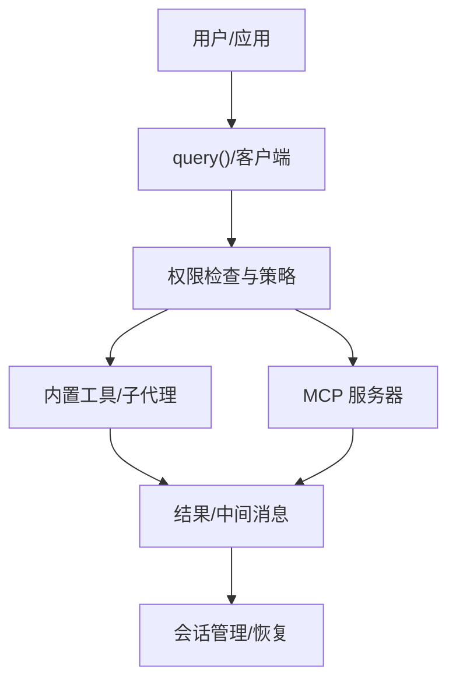

**图示来源**
- [skills/skills/claude-api/typescript/agent-sdk/README.md:144-172](file://skills/skills/claude-api/typescript/agent-sdk/README.md#L144-L172)
- [skills/skills/claude-api/python/agent-sdk/README.md:171-199](file://skills/skills/claude-api/python/agent-sdk/README.md#L171-L199)

## 详细组件分析

### 代理创建与生命周期
- TypeScript：query() 提供一次性查询；ClaudeSDKClient 提供完整生命周期控制（发送、接收、中断、资源清理）
- Python：query() 与 ClaudeSDKClient 同步语义；支持异步迭代消息流

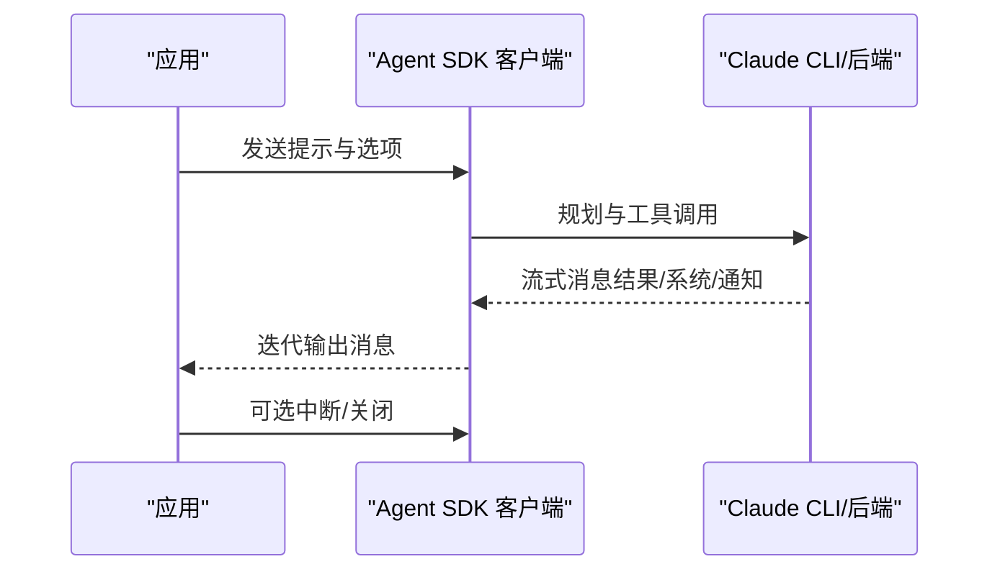

**章节来源**
- [skills/skills/claude-api/typescript/agent-sdk/README.md:49-94](file://skills/skills/claude-api/typescript/agent-sdk/README.md#L49-L94)
- [skills/skills/claude-api/python/agent-sdk/README.md:51-94](file://skills/skills/claude-api/python/agent-sdk/README.md#L51-L94)

### 内置工具与权限控制
- 工具清单：Read、Write、Edit、Bash、Glob、Grep、WebSearch、WebFetch、AskUserQuestion、Agent
- 权限模式：default（危险操作前提示）、plan（仅规划不执行）、acceptEdits（自动接受文件修改）、dontAsk（CI/CD 不提示）、bypassPermissions（绕过所有提示，需显式允许）

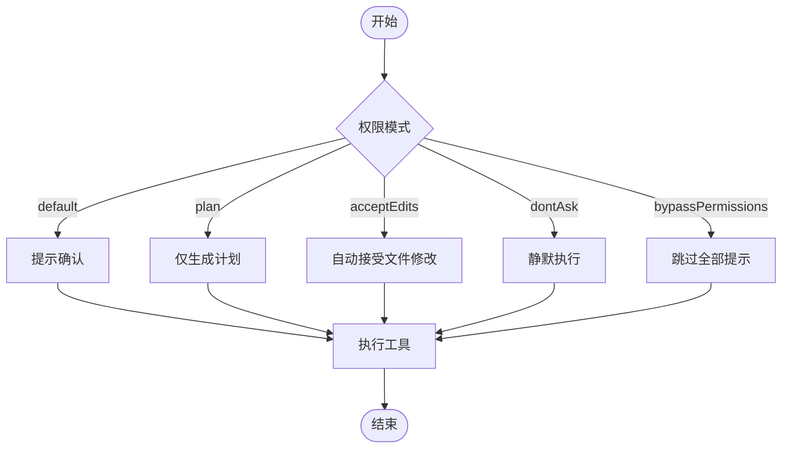

**章节来源**
- [skills/skills/claude-api/typescript/agent-sdk/README.md:30-67](file://skills/skills/claude-api/typescript/agent-sdk/README.md#L30-L67)
- [skills/skills/claude-api/python/agent-sdk/README.md:32-120](file://skills/skills/claude-api/python/agent-sdk/README.md#L32-L120)

### MCP 集成与自定义工具
- 外部 MCP 服务器：通过 mcpServers 指定命令行启动器或已部署服务
- 进程内工具：TypeScript 使用 tool()/createSdkMcpServer；Python 使用 @tool 与 create_sdk_mcp_server
- 最佳实践：命名清晰、输入/输出 Schema、只读/破坏性/幂等/开放世界注解、分页与传输选择、安全与错误处理

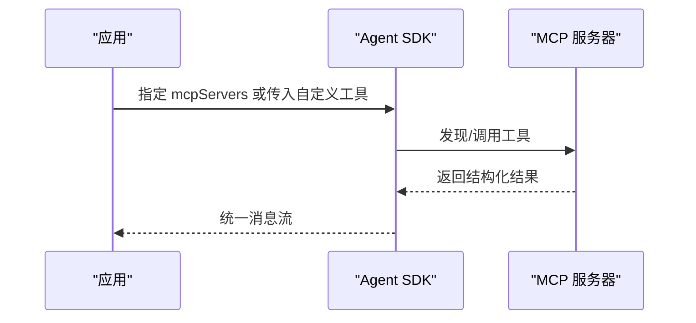

**章节来源**
- [skills/skills/claude-api/typescript/agent-sdk/README.md:71-107](file://skills/skills/claude-api/typescript/agent-sdk/README.md#L71-L107)
- [skills/skills/claude-api/python/agent-sdk/README.md:123-139](file://skills/skills/claude-api/python/agent-sdk/README.md#L123-L139)
- [skills/skills/mcp-builder/SKILL.md:15-77](file://skills/skills/mcp-builder/SKILL.md#L15-L77)
- [skills/skills/mcp-builder/reference/mcp_best_practices.md:152-202](file://skills/skills/mcp-builder/reference/mcp_best_practices.md#L152-L202)

### 钩子使用与审计
- 事件类型：PreToolUse、PostToolUse、PostToolUseFailure、Notification、UserPromptSubmit、SessionStart/End、Stop、SubagentStart/Stop、PreCompact、PermissionRequest、Setup、TeammateIdle、TaskCompleted、ConfigChange
- 典型用途：审计文件变更、日志记录、失败重试、通知与提醒

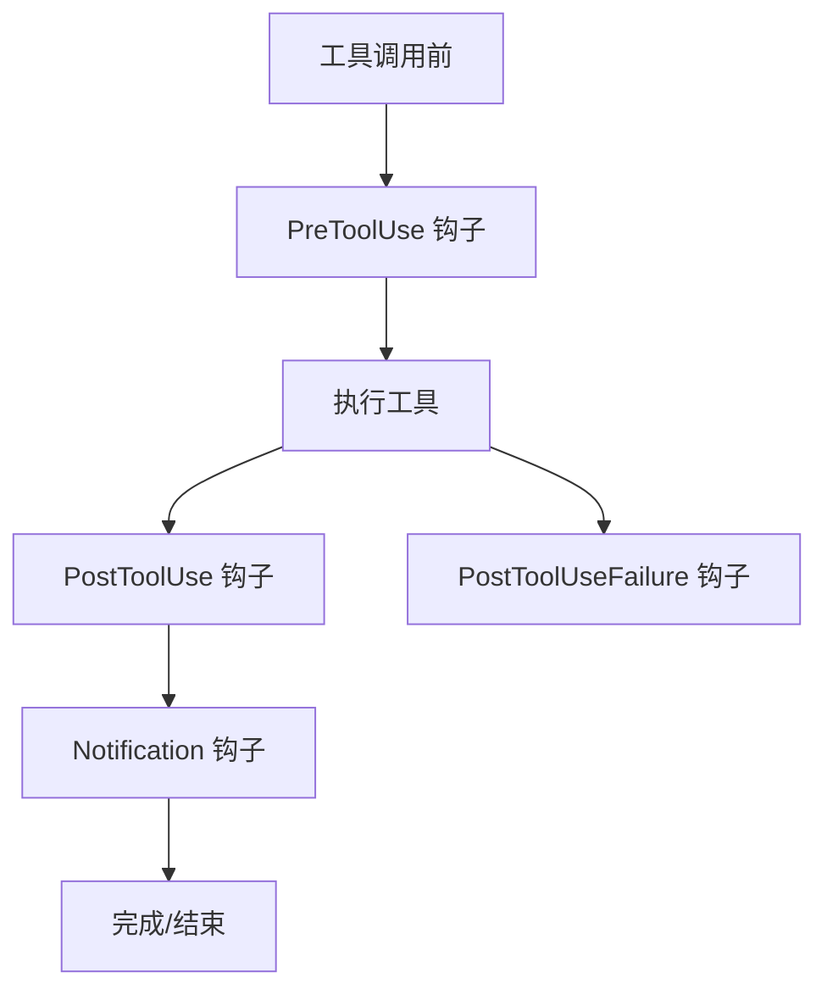

**章节来源**
- [skills/skills/claude-api/typescript/agent-sdk/README.md:111-141](file://skills/skills/claude-api/typescript/agent-sdk/README.md#L111-L141)
- [skills/skills/claude-api/python/agent-sdk/README.md:142-168](file://skills/skills/claude-api/python/agent-sdk/README.md#L142-L168)

### 子代理模式
- 在 options.agents 中定义子代理，使用 Agent 工具触发子代理执行
- 典型场景：代码审查、数据提取、报告生成等专业化子任务

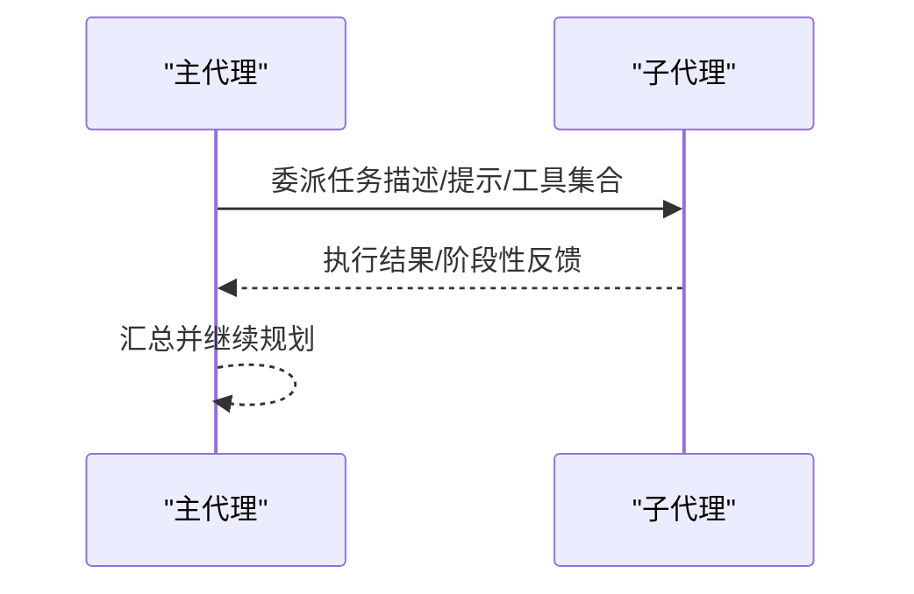

**章节来源**
- [skills/skills/claude-api/typescript/agent-sdk/README.md:175-194](file://skills/skills/claude-api/typescript/agent-sdk/README.md#L175-L194)
- [skills/skills/claude-api/python/agent-sdk/README.md:219-241](file://skills/skills/claude-api/python/agent-sdk/README.md#L219-L241)

### 会话恢复与模式编排
- 通过系统初始化消息中的 session_id 捕获并用于后续查询的 resume 参数，实现上下文延续
- 模式编排：结合子代理、钩子、权限模式与 MCP 工具，形成复杂工作流

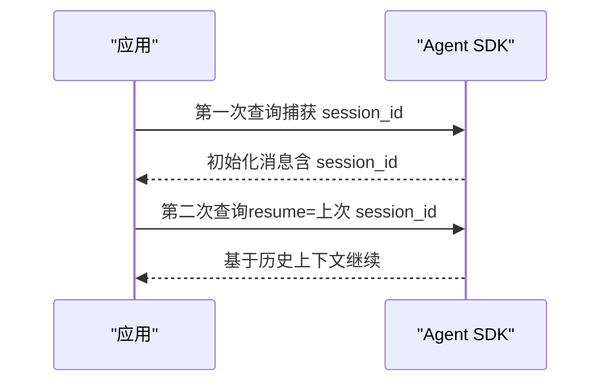

**章节来源**
- [skills/skills/claude-api/typescript/agent-sdk/patterns.md:103-128](file://skills/skills/claude-api/typescript/agent-sdk/patterns.md#L103-L128)
- [skills/skills/claude-api/python/agent-sdk/patterns.md:266-293](file://skills/skills/claude-api/python/agent-sdk/patterns.md#L266-L293)

### 自定义工具开发（Python/TypeScript）
- TypeScript：使用 tool() 定义工具，createSdkMcpServer 创建本地 MCP 服务器，注入到 query/options.mcpServers
- Python：使用 @tool 装饰器注册工具，create_sdk_mcp_server 创建服务器，配合 ClaudeSDKClient 使用

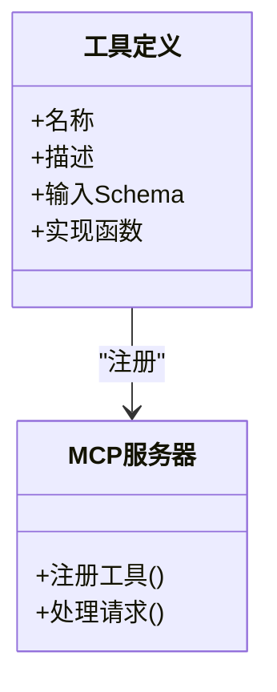

**章节来源**
- [skills/skills/claude-api/typescript/agent-sdk/README.md:86-107](file://skills/skills/claude-api/typescript/agent-sdk/README.md#L86-L107)
- [skills/skills/claude-api/python/agent-sdk/patterns.md:25-58](file://skills/skills/claude-api/python/agent-sdk/patterns.md#L25-L58)

### 消息类型与输出格式
- 结果消息：包含最终结果文本
- 系统消息：包含初始化、会话元信息（如 session_id）
- 输出格式：支持结构化输出 schema 与思维控制参数

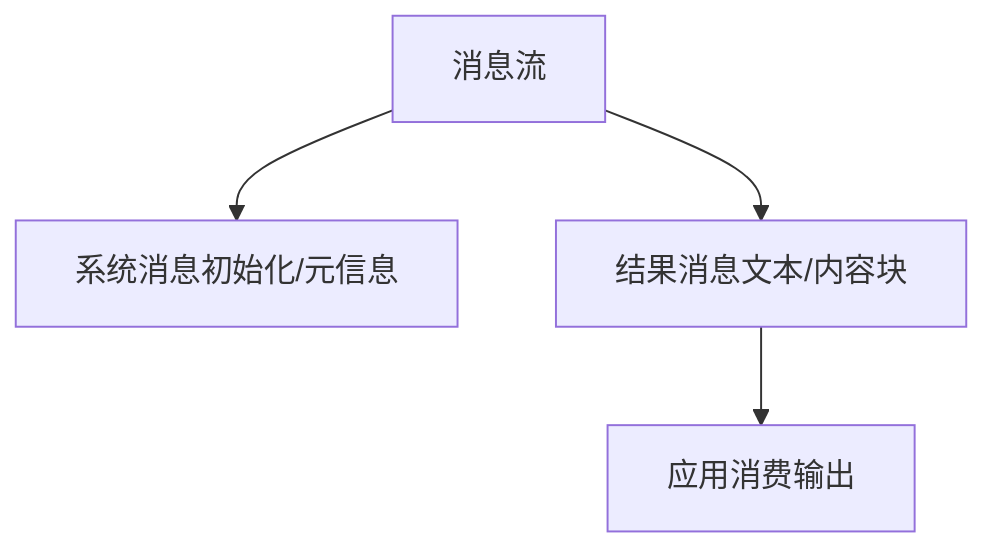

**章节来源**
- [skills/skills/claude-api/typescript/agent-sdk/README.md:197-211](file://skills/skills/claude-api/typescript/agent-sdk/README.md#L197-L211)
- [skills/skills/claude-api/python/agent-sdk/README.md:202-216](file://skills/skills/claude-api/python/agent-sdk/README.md#L202-L216)

## 依赖分析
- 语言生态：TypeScript 与 Python 双 SDK，API 语义一致，便于跨团队协作
- MCP 生态：通过 MCP 协议扩展外部能力，降低耦合度
- 技能体系：与技能标准（agentskills.io）保持一致，便于复用与迁移

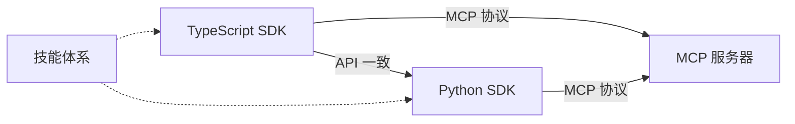

**章节来源**
- [skills/spec/agent-skills-spec.md:1-4](file://skills/spec/agent-skills-spec.md#L1-L4)
- [skills/README.md:1-95](file://skills/README.md#L1-L95)

## 性能考虑
- 合理设置 maxTurns 与 maxBudgetUsd，避免长尾任务与高成本调用
- 使用 allowedTools 与 disallowedTools 精准收束工具集，减少无效尝试
- 优先使用只读工具进行探索，再按需开启写/执行类工具
- 对 MCP 服务器采用分页与缓存策略，避免一次性加载大量数据
- 在 Python/TypeScript 中使用异步流式处理，降低内存峰值

## 故障排查指南
- CLI 相关错误：CLINotFoundError、CLIConnectionError、ProcessError
- 建议处理：捕获异常、打印诊断信息、回退策略（如切换权限模式、限制工具集）
- 日志与审计：利用钩子记录工具调用上下文，定位问题根因

**章节来源**
- [skills/skills/claude-api/python/agent-sdk/README.md:243-260](file://skills/skills/claude-api/python/agent-sdk/README.md#L243-L260)
- [skills/skills/claude-api/python/agent-sdk/patterns.md:230-262](file://skills/skills/claude-api/python/agent-sdk/patterns.md#L230-L262)

## 结论
- 当你需要“开箱即用”的代理能力、内置工具、权限与安全控制、MCP 扩展、钩子与子代理编排，且希望在本地/CI 场景下可控地执行任务时，优先选择 Agent SDK
- 当你只需要最简的文本补全/流式输出，不需要工具链与权限编排时，可直接使用 Claude API
- 通过 MCP，你可以将任意外部系统/服务以标准化工具形式接入代理，实现“以工具为中心”的智能体工作流

## 附录
- 快速开始与常用选项参考见各语言 SDK 文档
- MCP 开发与最佳实践参考 MCP 构建指南与最佳实践文档
- 技能体系与规范参考 skills/README.md 与 spec/agent-skills-spec.md

**章节来源**
- [skills/skills/claude-api/typescript/agent-sdk/README.md:13-26](file://skills/skills/claude-api/typescript/agent-sdk/README.md#L13-L26)
- [skills/skills/claude-api/python/agent-sdk/README.md:13-28](file://skills/skills/claude-api/python/agent-sdk/README.md#L13-L28)
- [skills/skills/mcp-builder/reference/node_mcp_server.md:526-756](file://skills/skills/mcp-builder/reference/node_mcp_server.md#L526-L756)
- [skills/README.md:61-95](file://skills/README.md#L61-L95)
- [skills/spec/agent-skills-spec.md:1-4](file://skills/spec/agent-skills-spec.md#L1-L4)