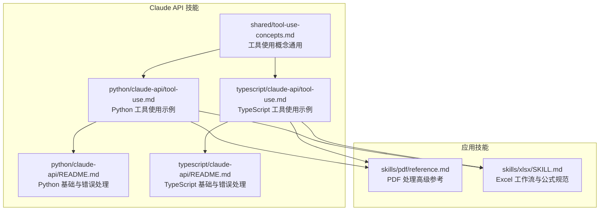
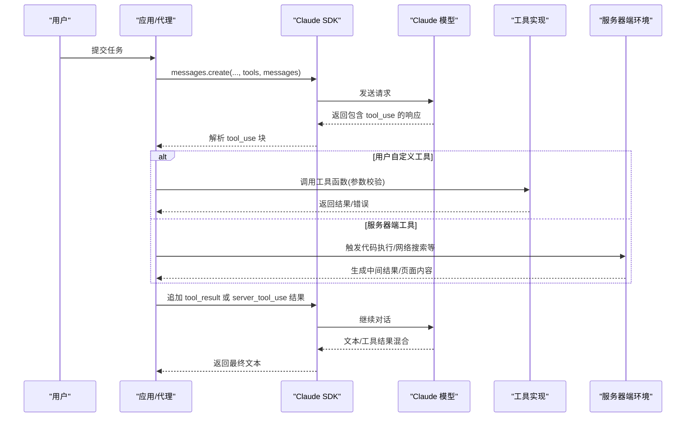
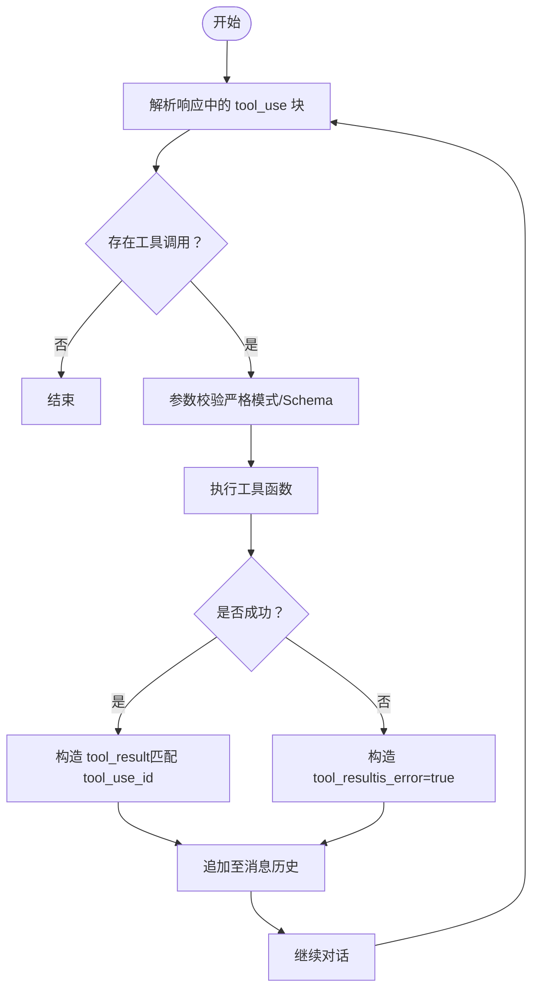
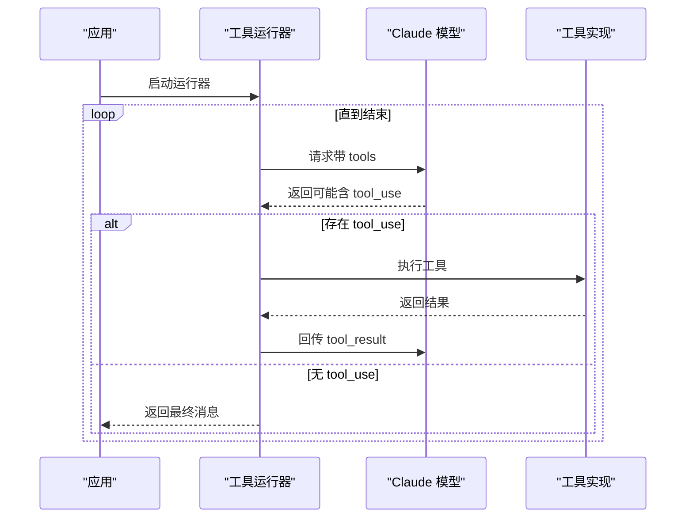
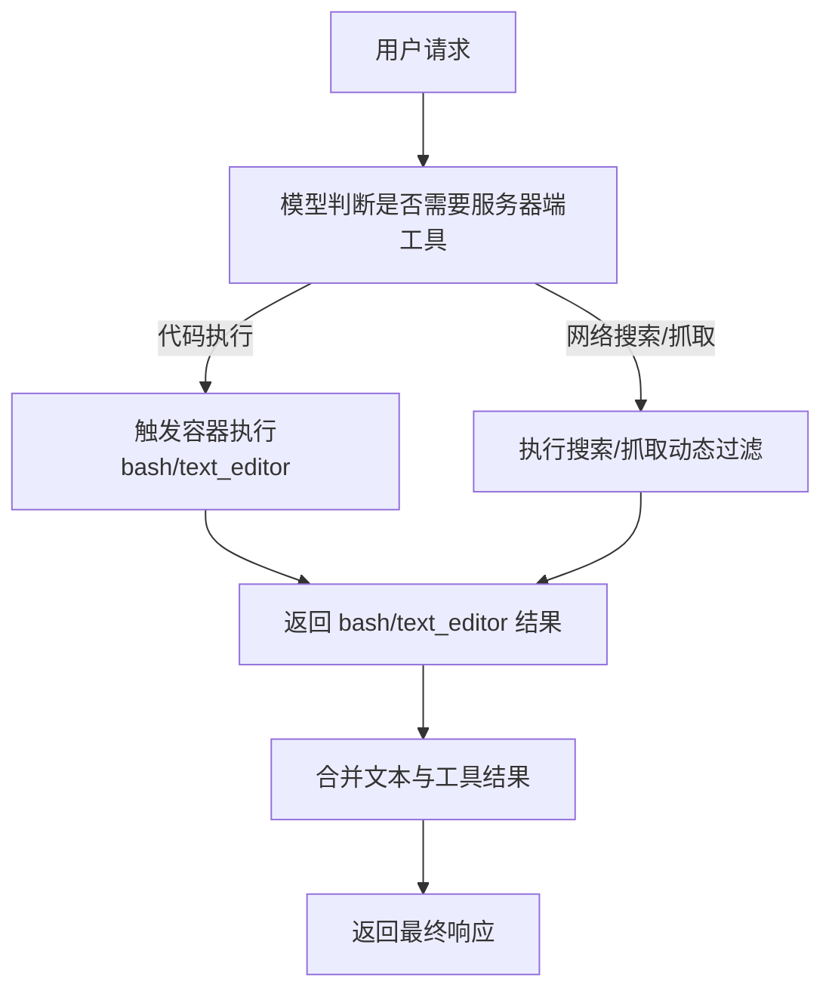
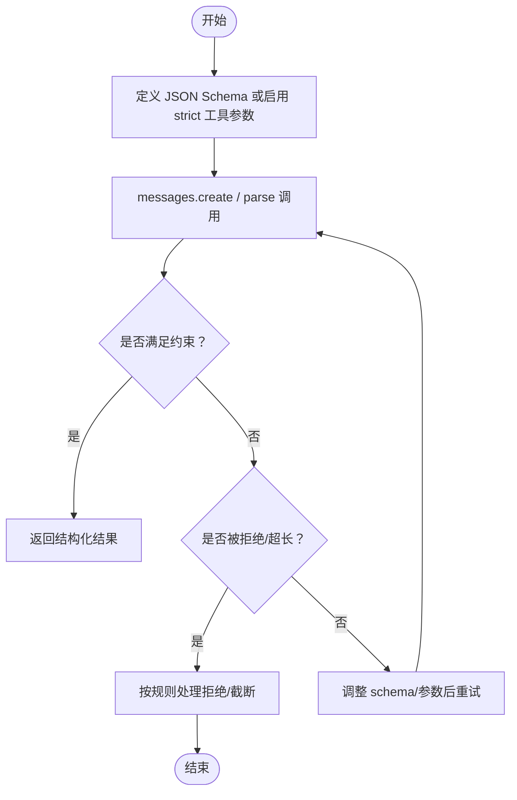
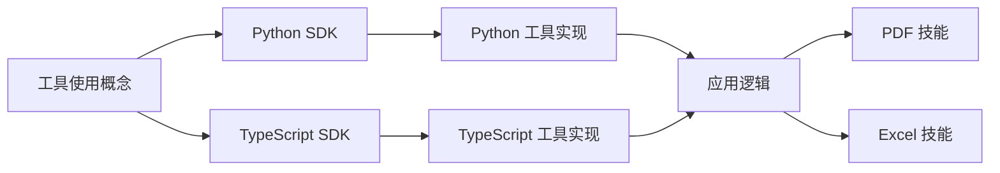

# 工具使用概念

<cite>
**本文引用的文件**
- [tool-use-concepts.md](file://skills/skills/claude-api/shared/tool-use-concepts.md)
- [tool-use.md（Python）](file://skills/skills/claude-api/python/claude-api/tool-use.md)
- [tool-use.md（TypeScript）](file://skills/skills/claude-api/typescript/claude-api/tool-use.md)
- [README.md（Python）](file://skills/skills/claude-api/python/claude-api/README.md)
- [README.md（TypeScript）](file://skills/skills/claude-api/typescript/claude-api/README.md)
- [reference.md（PDF）](file://skills/skills/pdf/reference.md)
- [SKILL.md（xlsx）](file://skills/skills/xlsx/SKILL.md)
</cite>

## 目录
1. [简介](#简介)
2. [项目结构](#项目结构)
3. [核心组件](#核心组件)
4. [架构总览](#架构总览)
5. [详细组件分析](#详细组件分析)
6. [依赖分析](#依赖分析)
7. [性能考量](#性能考量)
8. [故障排查指南](#故障排查指南)
9. [结论](#结论)
10. [附录](#附录)

## 简介
本文件系统性阐述“工具使用”的核心概念与工程实践，围绕以下主题展开：
- 函数调用与代码执行：用户自定义工具与服务器端工具的差异、适用场景与安全边界
- 内存管理与资源控制：容器复用、文件上传下载、路径安全与状态持久化
- 结构化输出：通过 JSON Schema 与严格工具参数约束，确保可解析与合规输出
- 循环控制：自动循环（工具运行器）与手动循环（手写 agentic loop）的实现要点与取舍
- 安全考虑与最佳实践：输入校验、错误处理、并发与资源配额、最小权限原则
- server-side tools 与 user-defined tools 的选择策略：何时用谁、如何组合

## 项目结构
该仓库以“技能（Skill）”为组织单元，其中与“工具使用”直接相关的内容集中在 Claude API 技能下的共享概念与多语言示例中，并辅以 PDF、Excel 等具体应用技能作为实际工作流参考。

图表来源
- [tool-use-concepts.md](file://skills/skills/claude-api/shared/tool-use-concepts.md)
- [tool-use.md（Python）](file://skills/skills/claude-api/python/claude-api/tool-use.md)
- [tool-use.md（TypeScript）](file://skills/skills/claude-api/typescript/claude-api/tool-use.md)
- [README.md（Python）](file://skills/skills/claude-api/python/claude-api/README.md)
- [README.md（TypeScript）](file://skills/skills/claude-api/typescript/claude-api/README.md)
- [reference.md（PDF）](file://skills/skills/pdf/reference.md)
- [SKILL.md（xlsx）](file://skills/skills/xlsx/SKILL.md)

章节来源
- [tool-use-concepts.md](file://skills/skills/claude-api/shared/tool-use-concepts.md)
- [tool-use.md（Python）](file://skills/skills/claude-api/python/claude-api/tool-use.md)
- [tool-use.md（TypeScript）](file://skills/skills/claude-api/typescript/claude-api/tool-use.md)
- [README.md（Python）](file://skills/skills/claude-api/python/claude-api/README.md)
- [README.md（TypeScript）](file://skills/skills/claude-api/typescript/claude-api/README.md)
- [reference.md（PDF）](file://skills/skills/pdf/reference.md)
- [SKILL.md（xlsx）](file://skills/skills/xlsx/SKILL.md)

## 核心组件
- 工具定义与参数验证
  - 用户自定义工具：需提供名称、描述与 JSON Schema 输入；建议使用枚举、必填字段与默认值，提升模型决策准确性
  - 严格工具使用（strict: true）：强制参数模式校验，避免无效输入进入后续流程
- 工具选择策略
  - 自动（auto）、任意（any）、指定（tool）、禁止（none），并支持禁用并行工具调用
- 工具结果处理
  - 捕获 tool_use 块，执行对应工具，返回 tool_result；失败时设置 is_error 并携带错误信息
  - 支持一次返回多个工具结果
- 循环控制
  - 自动循环（工具运行器）：SDK 自动处理请求-执行-回传-继续，适合大多数场景
  - 手动循环：细粒度控制日志、条件执行、人机审批；需正确维护消息历史与 tool_use_id
- 服务器端工具
  - 代码执行：沙箱容器、无网、预装库、文件上传/下载、容器复用、安全命名
  - 网络搜索/抓取：动态过滤减少上下文开销
  - 计算机使用：服务端或自托管两种形态
- 结构化输出
  - JSON 输出与严格工具参数结合，保证响应可解析且符合业务约束
- 应用技能参考
  - PDF：图像/文本提取、注释/表单处理、命令行工具链与库对比
  - Excel：公式优先、格式与颜色标准、公式重计算与错误检查

章节来源
- [tool-use-concepts.md](file://skills/skills/claude-api/shared/tool-use-concepts.md)
- [tool-use.md（Python）](file://skills/skills/claude-api/python/claude-api/tool-use.md)
- [tool-use.md（TypeScript）](file://skills/skills/claude-api/typescript/claude-api/tool-use.md)
- [reference.md（PDF）](file://skills/skills/pdf/reference.md)
- [SKILL.md（xlsx）](file://skills/skills/xlsx/SKILL.md)

## 架构总览
下图展示了从用户请求到工具执行与结果回传的整体流程，涵盖自动循环与手动循环两种模式，以及服务器端工具的特殊处理（如暂停/续传）。

图表来源
- [tool-use-concepts.md](file://skills/skills/claude-api/shared/tool-use-concepts.md)
- [tool-use.md（Python）](file://skills/skills/claude-api/python/claude-api/tool-use.md)
- [tool-use.md（TypeScript）](file://skills/skills/claude-api/typescript/claude-api/tool-use.md)

## 详细组件分析

### 用户自定义工具：定义、参数验证与结果处理
- 工具定义结构
  - 名称、描述、输入 JSON Schema（含属性描述、枚举、必填项）
  - 最佳实践：清晰命名、详尽描述、枚举限定、合理默认值
- 参数验证
  - 使用严格工具（strict: true）与 JSON Schema 限制数值/字符串约束
  - SDK 层自动移除不支持的约束并进行客户端校验
- 结果处理
  - 捕捉 tool_use 块，按 id 匹配 tool_result
  - 错误时设置 is_error 并给出可操作提示
  - 支持多工具并行调用，一次性回传所有结果

图表来源
- [tool-use-concepts.md](file://skills/skills/claude-api/shared/tool-use-concepts.md)
- [tool-use.md（Python）](file://skills/skills/claude-api/python/claude-api/tool-use.md)
- [tool-use.md（TypeScript）](file://skills/skills/claude-api/typescript/claude-api/tool-use.md)

章节来源
- [tool-use-concepts.md](file://skills/skills/claude-api/shared/tool-use-concepts.md)
- [tool-use.md（Python）](file://skills/skills/claude-api/python/claude-api/tool-use.md)
- [tool-use.md（TypeScript）](file://skills/skills/claude-api/typescript/claude-api/tool-use.md)

### 自动循环（工具运行器）与手动循环
- 自动循环（推荐）
  - Python/TypeScript SDK 提供工具运行器，自动检测工具调用、执行工具、回传结果、直至 end_turn
  - 优势：无需手写循环、类型安全、自动 schema 生成
- 手动循环
  - 需自行维护消息历史、处理 pause_turn、严格匹配 tool_use_id
  - 适用于需要自定义日志、条件执行、人机审批或流式迭代的场景

图表来源
- [tool-use-concepts.md](file://skills/skills/claude-api/shared/tool-use-concepts.md)
- [tool-use.md（Python）](file://skills/skills/claude-api/python/claude-api/tool-use.md)
- [tool-use.md（TypeScript）](file://skills/skills/claude-api/typescript/claude-api/tool-use.md)

章节来源
- [tool-use-concepts.md](file://skills/skills/claude-api/shared/tool-use-concepts.md)
- [tool-use.md（Python）](file://skills/skills/claude-api/python/claude-api/tool-use.md)
- [tool-use.md（TypeScript）](file://skills/skills/claude-api/typescript/claude-api/tool-use.md)

### 服务器端工具：代码执行、网络搜索/抓取与计算机使用
- 代码执行（沙箱）
  - 无网、隔离容器、预装库、文件上传/下载、容器复用、安全命名
  - 建议：使用 basename 防止路径穿越；复用 container_id 保持状态
- 网络搜索/抓取（动态过滤）
  - 新版本工具支持动态过滤，减少上下文占用；与独立代码执行工具同时出现时需谨慎
- 计算机使用
  - 服务端（Anthropic 托管）或自托管（客户端执行动作）

图表来源
- [tool-use-concepts.md](file://skills/skills/claude-api/shared/tool-use-concepts.md)

章节来源
- [tool-use-concepts.md](file://skills/skills/claude-api/shared/tool-use-concepts.md)

### 结构化输出：JSON Schema 与严格工具参数
- JSON 输出
  - 通过 output_config.format 控制响应格式；推荐使用 SDK 的 parse 方法自动校验
  - 支持基本类型、枚举、常量、联合、引用、日期时间等格式
  - 不支持递归、数值范围、字符串长度、复杂数组约束、additionalProperties 非 false
- 严格工具参数
  - 在工具定义中启用 strict，确保参数 schema 有效
  - 可与 JSON 输出配合，保证整体输出结构与参数均受控

图表来源
- [tool-use-concepts.md](file://skills/skills/claude-api/shared/tool-use-concepts.md)

章节来源
- [tool-use-concepts.md](file://skills/skills/claude-api/shared/tool-use-concepts.md)

### 应用技能参考：PDF 与 Excel
- PDF
  - 图像/文本提取、注释/表单处理、命令行工具链与库对比（pypdfium2、pdf-lib、pdfjs-dist、qpdf 等）
  - 性能优化：分页处理、低分辨率预览、内存管理、OCR 回退
- Excel
  - 公式优先、颜色与格式标准、公式重计算与错误检查
  - openpyxl 与 pandas 的选型与协作：数据处理用 pandas，复杂格式/公式用 openpyxl

章节来源
- [reference.md（PDF）](file://skills/skills/pdf/reference.md)
- [SKILL.md（xlsx）](file://skills/skills/xlsx/SKILL.md)

## 依赖分析
- 概念层依赖
  - 工具运行器依赖 SDK 对工具定义的解析与类型推导
  - 手动循环依赖对响应块的解析与消息历史维护
- 服务器端工具依赖
  - 代码执行依赖容器生命周期与文件系统
  - 网络搜索/抓取依赖外部网络与过滤逻辑
- 应用层依赖
  - PDF/Excel 技能依赖第三方库与命令行工具链

图表来源
- [tool-use-concepts.md](file://skills/skills/claude-api/shared/tool-use-concepts.md)
- [tool-use.md（Python）](file://skills/skills/claude-api/python/claude-api/tool-use.md)
- [tool-use.md（TypeScript）](file://skills/skills/claude-api/typescript/claude-api/tool-use.md)
- [reference.md（PDF）](file://skills/skills/pdf/reference.md)
- [SKILL.md（xlsx）](file://skills/skills/xlsx/SKILL.md)

章节来源
- [tool-use-concepts.md](file://skills/skills/claude-api/shared/tool-use-concepts.md)
- [tool-use.md（Python）](file://skills/skills/claude-api/python/claude-api/tool-use.md)
- [tool-use.md（TypeScript）](file://skills/skills/claude-api/typescript/claude-api/tool-use.md)
- [reference.md（PDF）](file://skills/skills/pdf/reference.md)
- [SKILL.md（xlsx）](file://skills/skills/xlsx/SKILL.md)

## 性能考量
- 服务器端工具
  - 代码执行容器复用可显著降低冷启动成本
  - 动态过滤减少上下文占用，提高 token 效率
- 结构化输出
  - 新 schema 首次编译有延迟，建议缓存复用
  - 避免与引用计数冲突的功能组合
- 应用技能
  - PDF：大文件分页处理、低分辨率预览、命令行工具优先
  - Excel：公式优先、批量重计算、错误快速定位

[本节为通用指导，无需特定文件引用]

## 故障排查指南
- 常见停止原因
  - end_turn：自然结束
  - max_tokens：达到最大 token 限制
  - tool_use：需要调用工具
  - pause_turn：服务器端工具迭代上限，需续传
  - refusal：出于安全原因拒绝
- 错误处理
  - 工具执行失败：返回 is_error=true 的 tool_result
  - SDK 异常：使用 typed exceptions（Python/TypeScript）
- 资源与安全
  - 服务器端工具：防止路径穿越、限制容器资源、最小权限原则
  - 结构化输出：注意 schema 不兼容与拒绝/截断行为

章节来源
- [tool-use-concepts.md](file://skills/skills/claude-api/shared/tool-use-concepts.md)
- [README.md（Python）](file://skills/skills/claude-api/python/claude-api/README.md)
- [README.md（TypeScript）](file://skills/skills/claude-api/typescript/claude-api/README.md)

## 结论
- 工具使用的核心在于“定义清晰、参数受控、结果可解析、循环可控”
- 自动循环（工具运行器）适合大多数场景，手动循环用于需要精细控制的高级用例
- 服务器端工具提供强大的执行与检索能力，但需重视安全与资源管理
- 结构化输出与严格工具参数共同保障输出质量与一致性
- 应用技能（PDF/Excel）为真实工作流提供了丰富的库与最佳实践参考

[本节为总结性内容，无需特定文件引用]

## 附录
- 编程语言示例路径
  - Python：工具运行器、手动循环、代码执行、内存工具、结构化输出
  - TypeScript：工具运行器、手动循环（含流式）、代码执行、内存工具、结构化输出
- 安全与最佳实践清单
  - 输入校验与错误处理
  - 文件命名与路径安全
  - 容器复用与资源配额
  - 严格工具参数与 JSON Schema 限制
  - 停止原因与续传策略

章节来源
- [tool-use.md（Python）](file://skills/skills/claude-api/python/claude-api/tool-use.md)
- [tool-use.md（TypeScript）](file://skills/skills/claude-api/typescript/claude-api/tool-use.md)
- [tool-use-concepts.md](file://skills/skills/claude-api/shared/tool-use-concepts.md)