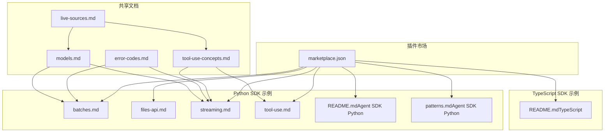
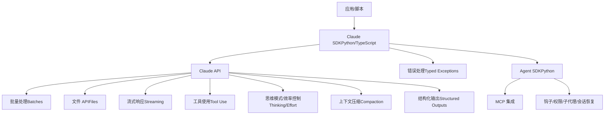
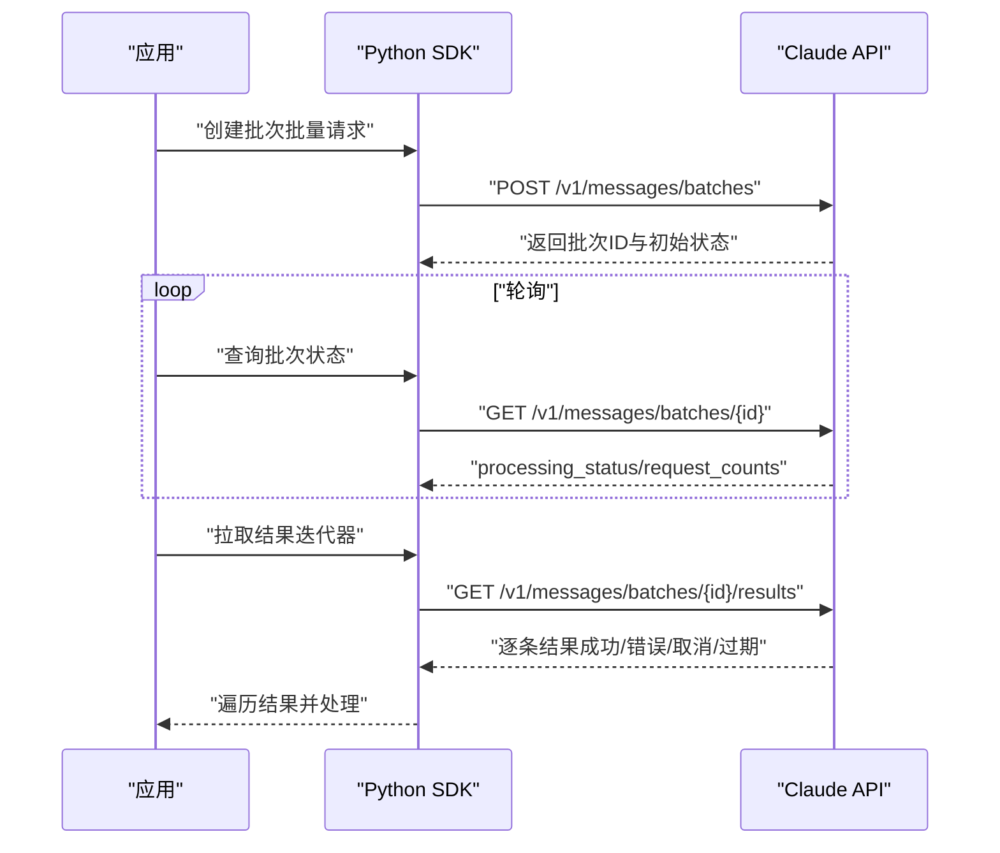
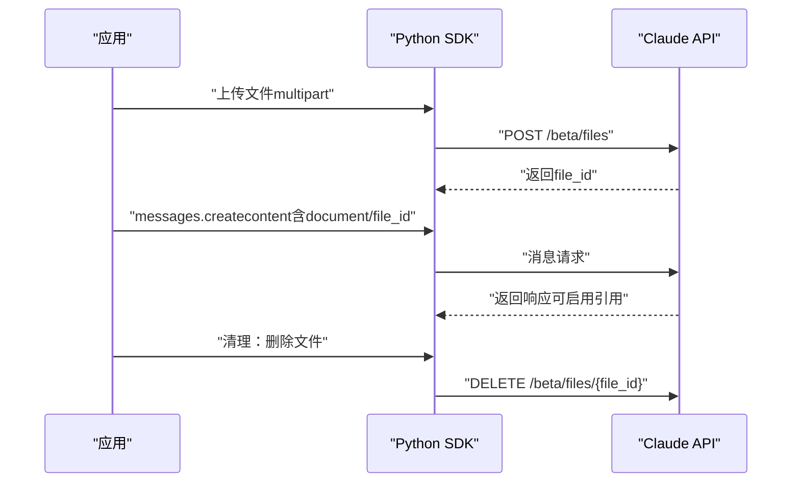
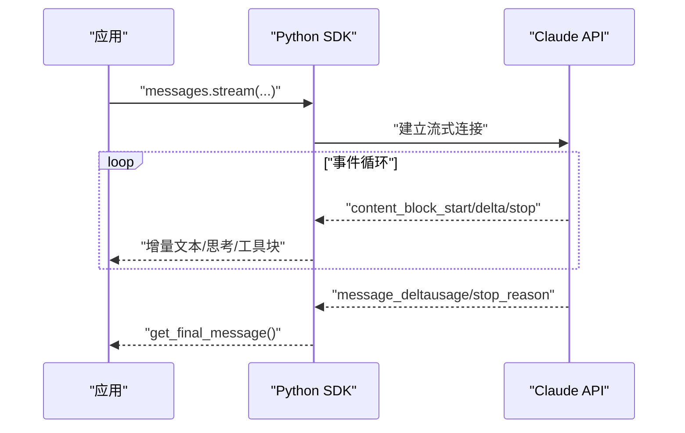
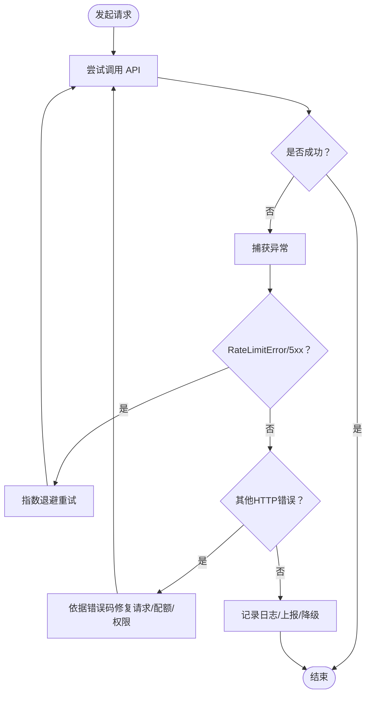
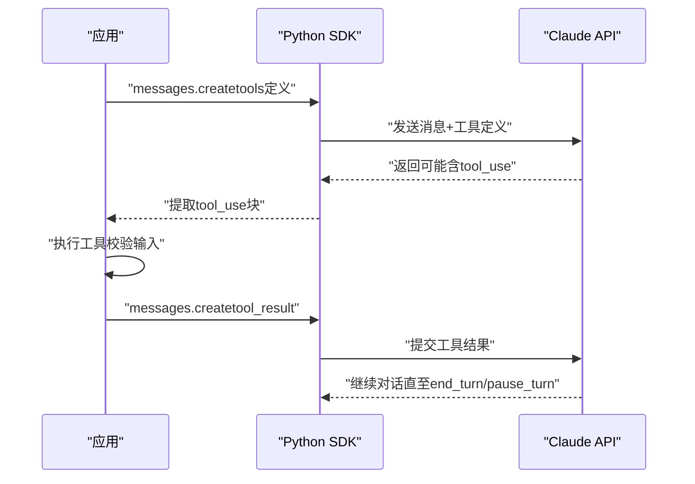
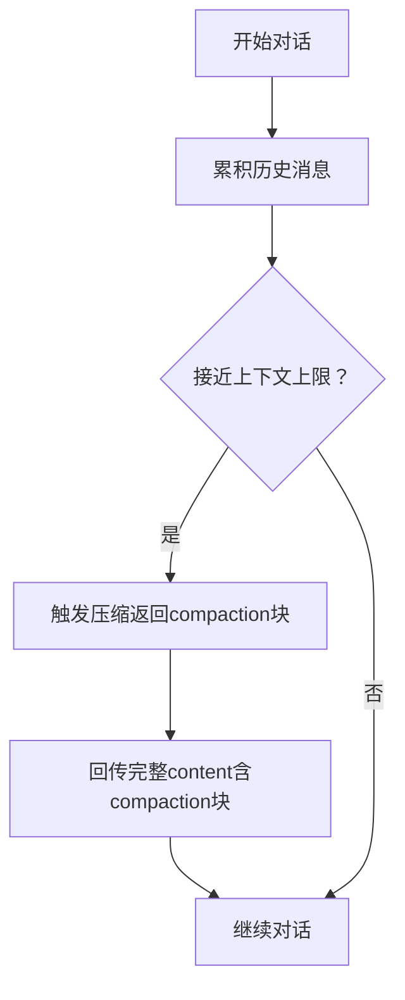
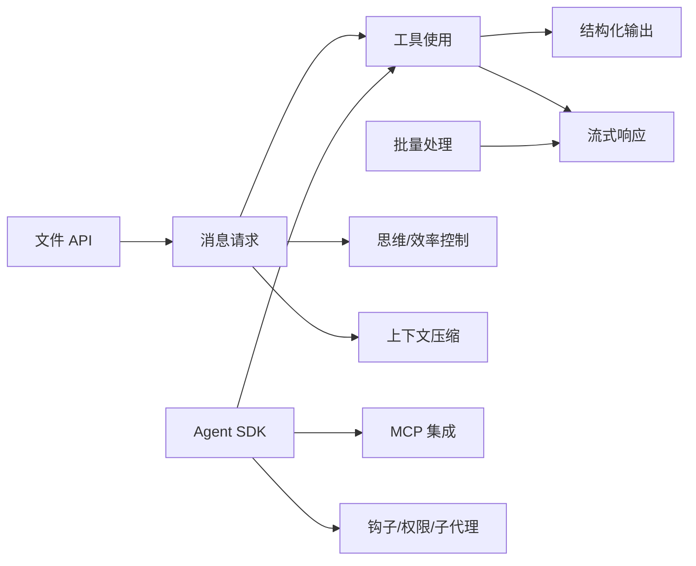

# 高级功能

<cite>
**本文引用的文件**
- [marketplace.json](file://skills/.claude-plugin/marketplace.json)
- [error-codes.md](file://skills/skills/claude-api/shared/error-codes.md)
- [tool-use-concepts.md](file://skills/skills/claude-api/shared/tool-use-concepts.md)
- [batches.md](file://skills/skills/claude-api/python/claude-api/batches.md)
- [files-api.md](file://skills/skills/claude-api/python/claude-api/files-api.md)
- [streaming.md](file://skills/skills/claude-api/python/claude-api/streaming.md)
- [tool-use.md](file://skills/skills/claude-api/python/claude-api/tool-use.md)
- [README.md（TypeScript）](file://skills/skills/claude-api/typescript/claude-api/README.md)
- [README.md（Agent SDK Python）](file://skills/skills/claude-api/python/agent-sdk/README.md)
- [patterns.md（Agent SDK Python）](file://skills/skills/claude-api/python/agent-sdk/patterns.md)
- [models.md](file://skills/skills/claude-api/shared/models.md)
- [live-sources.md](file://skills/skills/claude-api/shared/live-sources.md)
</cite>

## 目录
1. [简介](#简介)
2. [项目结构](#项目结构)
3. [核心组件](#核心组件)
4. [架构总览](#架构总览)
5. [详细组件分析](#详细组件分析)
6. [依赖关系分析](#依赖关系分析)
7. [性能考虑](#性能考虑)
8. [故障排除指南](#故障排除指南)
9. [结论](#结论)
10. [附录](#附录)

## 简介
本文件聚焦于高级功能与最佳实践，涵盖批量处理、文件 API、流式响应、错误处理、长运行对话、上下文压缩、思维模式配置与效率控制、性能优化、成本控制、可靠性保障、常见错误与故障排除、compaction 机制、server-side tools、structured outputs，以及 WebFetch 使用指南。内容基于仓库中的 Claude API 技能与工具文档，确保读者能够系统掌握这些能力并在生产中安全高效地使用。

## 项目结构
该仓库以“技能”为中心组织，包含 Claude API 的多语言示例、概念性文档、Agent SDK 使用指南与模型/文档来源清单。核心与高级功能主要分布在以下位置：
- 共享概念：工具使用、错误码、模型目录、实时文档源
- Python SDK 示例：批量、文件、流式、工具使用、Agent SDK
- TypeScript SDK 示例：消息请求、提示缓存、扩展思考、错误处理、长会话压缩
- 插件市场清单：聚合多个技能包，便于统一安装与管理

**图表来源**
- [marketplace.json:1-56](file://skills/.claude-plugin/marketplace.json#L1-L56)
- [error-codes.md:1-206](file://skills/skills/claude-api/shared/error-codes.md#L1-L206)
- [tool-use-concepts.md:1-306](file://skills/skills/claude-api/shared/tool-use-concepts.md#L1-L306)
- [batches.md:1-183](file://skills/skills/claude-api/python/claude-api/batches.md#L1-L183)
- [files-api.md:1-163](file://skills/skills/claude-api/python/claude-api/files-api.md#L1-L163)
- [streaming.md:1-163](file://skills/skills/claude-api/python/claude-api/streaming.md#L1-L163)
- [tool-use.md:1-588](file://skills/skills/claude-api/python/claude-api/tool-use.md#L1-L588)
- [README.md（Agent SDK Python）:1-270](file://skills/skills/claude-api/python/agent-sdk/README.md#L1-L270)
- [patterns.md（Agent SDK Python）:1-320](file://skills/skills/claude-api/python/agent-sdk/patterns.md#L1-L320)
- [README.md（TypeScript）:1-314](file://skills/skills/claude-api/typescript/claude-api/README.md#L1-L314)
- [models.md:1-69](file://skills/skills/claude-api/shared/models.md#L1-L69)
- [live-sources.md:1-122](file://skills/skills/claude-api/shared/live-sources.md#L1-L122)

**章节来源**
- [marketplace.json:1-56](file://skills/.claude-plugin/marketplace.json#L1-L56)

## 核心组件
- 批量处理（Batches API）
  - 异步处理消息请求，价格折扣，支持所有消息 API 特性（视觉、工具、缓存等），最大批大小与完成时间限制明确。
  - 参考：[batches.md:1-183](file://skills/skills/claude-api/python/claude-api/batches.md#L1-L183)

- 文件 API（Files API）
  - 上传、引用、列出、删除、下载文件；在消息中通过 file_id 引用，避免重复上传；免费操作，内容计费。
  - 参考：[files-api.md:1-163](file://skills/skills/claude-api/python/claude-api/files-api.md#L1-L163)

- 流式响应（Streaming）
  - 支持文本增量输出、思考块、工具调用；事件类型丰富，适合进度反馈与超时保护；可结合最终消息获取完整统计。
  - 参考：[streaming.md:1-163](file://skills/skills/claude-api/python/claude-api/streaming.md#L1-L163)

- 错误处理（Error Handling）
  - 统一的 HTTP 错误码与 SDK 类型化异常；建议使用 typed exceptions 而非字符串匹配；提供常见错误与修复建议。
  - 参考：[error-codes.md:1-206](file://skills/skills/claude-api/shared/error-codes.md#L1-L206)

- 工具使用（Tool Use）
  - 用户自定义工具与 server-side tools（代码执行、网页搜索/抓取、程序化工具调用、工具搜索、内存工具等）；支持结构化输出与严格工具参数校验。
  - 参考：[tool-use-concepts.md:1-306](file://skills/skills/claude-api/shared/tool-use-concepts.md#L1-L306)，[tool-use.md:1-588](file://skills/skills/claude-api/python/claude-api/tool-use.md#L1-L588)

- 长运行对话与上下文压缩（Compaction）
  - Opus 4.6 在对话接近 200K 上下文时自动触发压缩；需在后续请求中回传 compaction 块，保持会话连贯。
  - 参考：[README.md（TypeScript）:231-266](file://skills/skills/claude-api/typescript/claude-api/README.md#L231-L266)

- 思维模式与效率控制（Thinking/Effort）
  - Opus/Sonnet 4.6 推荐自适应思考；旧模型使用预算令牌；Effort 参数影响质量与成本；与结构化输出兼容。
  - 参考：[README.md（TypeScript）:151-176](file://skills/skills/claude-api/typescript/claude-api/README.md#L151-L176)

- 结构化输出（Structured Outputs）
  - 通过 output_config.format 或 strict 工具参数约束输出格式，保证可解析性；注意不兼容引用与消息预填。
  - 参考：[tool-use-concepts.md:252-292](file://skills/skills/claude-api/shared/tool-use-concepts.md#L252-L292)

- Agent SDK（Python）
  - 提供查询接口、客户端生命周期管理、权限系统、MCP 集成、钩子、子代理、会话恢复、错误处理与最佳实践。
  - 参考：[README.md（Agent SDK Python）:1-270](file://skills/skills/claude-api/python/agent-sdk/README.md#L1-L270)，[patterns.md（Agent SDK Python）:1-320](file://skills/skills/claude-api/python/agent-sdk/patterns.md#L1-L320)

**章节来源**
- [batches.md:1-183](file://skills/skills/claude-api/python/claude-api/batches.md#L1-L183)
- [files-api.md:1-163](file://skills/skills/claude-api/python/claude-api/files-api.md#L1-L163)
- [streaming.md:1-163](file://skills/skills/claude-api/python/claude-api/streaming.md#L1-L163)
- [error-codes.md:1-206](file://skills/skills/claude-api/shared/error-codes.md#L1-L206)
- [tool-use-concepts.md:1-306](file://skills/skills/claude-api/shared/tool-use-concepts.md#L1-L306)
- [tool-use.md:1-588](file://skills/skills/claude-api/python/claude-api/tool-use.md#L1-L588)
- [README.md（TypeScript）:151-266](file://skills/skills/claude-api/typescript/claude-api/README.md#L151-L266)
- [README.md（Agent SDK Python）:1-270](file://skills/skills/claude-api/python/agent-sdk/README.md#L1-L270)
- [patterns.md（Agent SDK Python）:1-320](file://skills/skills/claude-api/python/agent-sdk/patterns.md#L1-L320)

## 架构总览
下图展示高级功能在应用中的交互关系：客户端通过 SDK 发起请求，利用批量、文件、流式、工具与思维/效率控制；服务端返回结果或分段事件；错误码与异常类型化；Agent SDK 提供更高层的编排与安全控制。

**图表来源**
- [batches.md:1-183](file://skills/skills/claude-api/python/claude-api/batches.md#L1-L183)
- [files-api.md:1-163](file://skills/skills/claude-api/python/claude-api/files-api.md#L1-L163)
- [streaming.md:1-163](file://skills/skills/claude-api/python/claude-api/streaming.md#L1-L163)
- [tool-use-concepts.md:1-306](file://skills/skills/claude-api/shared/tool-use-concepts.md#L1-L306)
- [tool-use.md:1-588](file://skills/skills/claude-api/python/claude-api/tool-use.md#L1-L588)
- [README.md（TypeScript）:151-266](file://skills/skills/claude-api/typescript/claude-api/README.md#L151-L266)
- [error-codes.md:1-206](file://skills/skills/claude-api/shared/error-codes.md#L1-L206)
- [README.md（Agent SDK Python）:1-270](file://skills/skills/claude-api/python/agent-sdk/README.md#L1-L270)

## 详细组件分析

### 批量处理（Batches API）
- 关键特性
  - 异步批量消息请求，50% 成本折扣；支持最多 100,000 请求/256MB/批次；最大 24 小时处理期。
  - 支持提示缓存共享系统内容，降低重复成本。
- 典型流程
  - 准备请求列表 → 创建批次 → 轮询状态 → 拉取结果 → 取消/过期处理。
- 最佳实践
  - 合理拆分批次，避免超限；对失败项单独重试；使用自定义 ID 便于映射结果。

**图表来源**
- [batches.md:15-98](file://skills/skills/claude-api/python/claude-api/batches.md#L15-L98)

**章节来源**
- [batches.md:1-183](file://skills/skills/claude-api/python/claude-api/batches.md#L1-L183)

### 文件 API（Files API）
- 关键特性
  - 单次上传，多次复用；支持 PDF/图片/文本；引用 via file_id；免费操作，内容计费。
- 典型流程
  - 上传文件 → 在消息中引用 → 多轮问答 → 清理文件。
- 安全与合规
  - 下载仅限代码执行生成的文件；注意文件名规范化，防止路径穿越。

**图表来源**
- [files-api.md:17-116](file://skills/skills/claude-api/python/claude-api/files-api.md#L17-L116)

**章节来源**
- [files-api.md:1-163](file://skills/skills/claude-api/python/claude-api/files-api.md#L1-L163)

### 流式响应（Streaming）
- 关键特性
  - 文本增量、思考块、工具调用；事件类型丰富；可获取最终消息与用量统计。
- 典型流程
  - with stream(...) → 遍历事件 → 输出增量 → 获取最终消息。
- 最佳实践
  -  strea及时刷新；设置超时；在中断后可继续；结合结构化输出与工具使用。

**图表来源**
- [streaming.md:1-163](file://skills/skills/claude-api/python/claude-api/streaming.md#L1-L163)

**章节来源**
- [streaming.md:1-163](file://skills/skills/claude-api/python/claude-api/streaming.md#L1-L163)

### 错误处理（Typed Exceptions）
- 关键要点
  - 使用 SDK 的 typed exceptions（如 BadRequestError、RateLimitError 等）进行分支处理。
  - 429/5xx 默认指数退避重试；400/401/403/404/413 等有明确修复建议。
- 建议
  - 不要使用字符串匹配错误信息；按从最具体到最通用的顺序检查。

**图表来源**
- [error-codes.md:119-156](file://skills/skills/claude-api/shared/error-codes.md#L119-L156)

**章节来源**
- [error-codes.md:1-206](file://skills/skills/claude-api/shared/error-codes.md#L1-L206)

### 工具使用（Tool Use）
- 用户自定义工具
  - 定义名称、描述、JSON Schema 输入；选择何时调用（auto/any/tool/none）；可禁用并行工具调用。
- Server-side tools
  - 代码执行（沙箱容器）、网页搜索/抓取（动态过滤）、程序化工具调用、工具搜索、内存工具。
- 结构化输出与严格工具参数
  - output_config.format 与 strict: true；注意兼容性与 schema 限制。
- 最佳实践
  - 详尽描述与示例；输入校验；错误返回 is_error；限制工具数量；必要时手动循环。

**图表来源**
- [tool-use-concepts.md:101-220](file://skills/skills/claude-api/shared/tool-use-concepts.md#L101-L220)
- [tool-use.md:130-184](file://skills/skills/claude-api/python/claude-api/tool-use.md#L130-L184)

**章节来源**
- [tool-use-concepts.md:1-306](file://skills/skills/claude-api/shared/tool-use-concepts.md#L1-L306)
- [tool-use.md:1-588](file://skills/skills/claude-api/python/claude-api/tool-use.md#L1-L588)

### 长运行对话与上下文压缩（Compaction）
- 触发条件
  - 对话接近 200K 上下文窗口时自动触发压缩。
- 使用方式
  - 在请求中启用 compaction 并在后续请求中回传 compaction 块；不要只附加文本。
- 注意事项
  - 仅 Opus 4.6 的 beta 版本可用；需要 beta 头或相应参数。

**图表来源**
- [README.md（TypeScript）:231-266](file://skills/skills/claude-api/typescript/claude-api/README.md#L231-L266)

**章节来源**
- [README.md（TypeScript）:231-266](file://skills/skills/claude-api/typescript/claude-api/README.md#L231-L266)

### 思维模式配置与效率控制
- 自适应思考（推荐）
  - Opus/Sonnet 4.6 使用 adaptive thinking；Effort 控制质量与成本。
- 预算令牌（旧模型）
  - budget_tokens 必须小于 max_tokens；否则 400。
- 与结构化输出兼容
  - 注意 refusals 与 max_tokens 截断对 schema 匹配的影响。

**章节来源**
- [README.md（TypeScript）:151-176](file://skills/skills/claude-api/typescript/claude-api/README.md#L151-L176)
- [tool-use-concepts.md:252-292](file://skills/skills/claude-api/shared/tool-use-concepts.md#L252-L292)

### 结构化输出（Structured Outputs）
- JSON 输出
  - 使用 output_config.format 或 parse()；SDK 自动处理不支持的约束。
- 严格工具参数
  - strict: true 强制工具输入 schema。
- 限制与兼容性
  - 不支持递归、数值/字符串/数组复杂约束；与引用、消息预填不兼容；可与批量、流式、token 计数、扩展思考共用。

**章节来源**
- [tool-use-concepts.md:252-292](file://skills/skills/claude-api/shared/tool-use-concepts.md#L252-L292)
- [tool-use.md:460-588](file://skills/skills/claude-api/python/claude-api/tool-use.md#L460-L588)

### Agent SDK（Python）高级用法
- 查询与客户端
  - query() 一次性；ClaudeSDKClient 提供生命周期管理、中断、流式接收。
- 权限系统
  - default/plan/acceptEdits/dontAsk/bypassPermissions；谨慎使用 bypass。
- MCP 集成
  - 连接 Playwright、PostgreSQL 等 MCP 服务器；支持资源与提示转换。
- 钩子与子代理
  - PostToolUse 等钩子事件；子代理协作。
- 会话恢复与错误处理
  - 通过 SystemMessage.init 捕获 session_id；统一异常处理。

**章节来源**
- [README.md（Agent SDK Python）:1-270](file://skills/skills/claude-api/python/agent-sdk/README.md#L1-L270)
- [patterns.md（Agent SDK Python）:1-320](file://skills/skills/claude-api/python/agent-sdk/patterns.md#L1-L320)

## 依赖关系分析
- 组件耦合
  - 工具使用与流式响应可组合；批量处理与文件 API 可独立使用；思维/效率控制与结构化输出可叠加。
- 外部依赖
  - SDK（Python/TypeScript）；MCP 服务器；平台文档（WebFetch）。
- 风险点
  - 错误码未正确处理导致重试策略不当；compaction 块遗漏导致上下文丢失；工具并行调用过多造成 token 压力。

**图表来源**
- [tool-use-concepts.md:1-306](file://skills/skills/claude-api/shared/tool-use-concepts.md#L1-L306)
- [tool-use.md:1-588](file://skills/skills/claude-api/python/claude-api/tool-use.md#L1-L588)
- [streaming.md:1-163](file://skills/skills/claude-api/python/claude-api/streaming.md#L1-L163)
- [batches.md:1-183](file://skills/skills/claude-api/python/claude-api/batches.md#L1-L183)
- [files-api.md:1-163](file://skills/skills/claude-api/python/claude-api/files-api.md#L1-L163)
- [README.md（Agent SDK Python）:1-270](file://skills/skills/claude-api/python/agent-sdk/README.md#L1-L270)

## 性能考虑
- 成本优化
  - 提示缓存：对重复系统内容使用 cache_control；首次编译成本，后续复用。
  - 批量处理：50% 折扣；合理拆分批次。
  - 模型选择：Haiku 4.5 适合简单任务；Sonnet 4.6 在速度与智能间平衡；Opus 4.6 用于复杂推理。
- 性能指标
  - 使用 token 计数估算成本；监控 RPM/TPM/TPD；在流式场景下尽早获取用量。
- 传输与并发
  - 流式响应减少首字节延迟；批量处理提升吞吐；工具并行调用需谨慎控制。

**章节来源**
- [README.md（TypeScript）:284-314](file://skills/skills/claude-api/typescript/claude-api/README.md#L284-L314)
- [batches.md:1-183](file://skills/skills/claude-api/python/claude-api/batches.md#L1-L183)
- [models.md:1-69](file://skills/skills/claude-api/shared/models.md#L1-L69)

## 故障排除指南
- 常见错误码与修复
  - 400：请求格式/参数无效；检查模型 ID、max_tokens、消息交替。
  - 401：缺少/无效 API Key；检查环境变量。
  - 403：权限不足；确认密钥权限与访问范围。
  - 404：端点或模型 ID 错误；使用精确模型别名。
  - 413：请求过大；截断历史、压缩/缩小图片、拆分文档。
  - 429/500/529：速率限制/服务问题；指数退避重试。
- 实操建议
  - 使用 typed exceptions 分支处理；记录 retry-after 与配额头；对工具错误设置 is_error。
  - WebFetch 获取最新文档与示例，避免使用过期缓存。

**章节来源**
- [error-codes.md:1-206](file://skills/skills/claude-api/shared/error-codes.md#L1-L206)
- [live-sources.md:1-122](file://skills/skills/claude-api/shared/live-sources.md#L1-L122)

## 结论
通过批量处理、文件 API、流式响应、工具使用与思维/效率控制的组合，可在保证可靠性的同时显著提升吞吐与成本效益。配合上下文压缩、结构化输出与 Agent SDK 的权限与钩子体系，可构建更安全、可观测、可扩展的智能体应用。建议优先采用自适应思考与提示缓存，并在生产中严格使用 typed exceptions 与指数退避策略。

## 附录
- WebFetch 使用指南
  - 当用户需要“最新”信息或缓存内容可能过期时，使用 live-sources.md 中的 URL 获取当前文档与示例。
  - 常用主题：模型与定价、扩展思考、自适应思考、Effort、工具使用、流式、提示缓存、媒体与文件、API 操作、工具、高级特性等。
- 模型与别名
  - 使用 models.md 中的别名作为模型 ID，避免拼写错误与废弃 ID 导致的 404。
- 插件市场
  - marketplace.json 聚合了文档处理、示例技能与 Claude API 技能集合，便于统一安装与管理。

**章节来源**
- [live-sources.md:1-122](file://skills/skills/claude-api/shared/live-sources.md#L1-L122)
- [models.md:1-69](file://skills/skills/claude-api/shared/models.md#L1-L69)
- [marketplace.json:1-56](file://skills/.claude-plugin/marketplace.json#L1-L56)