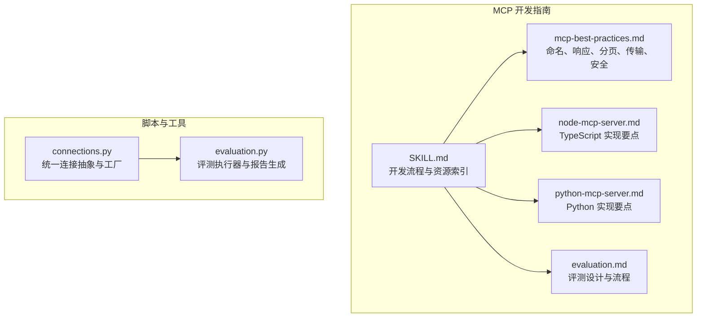
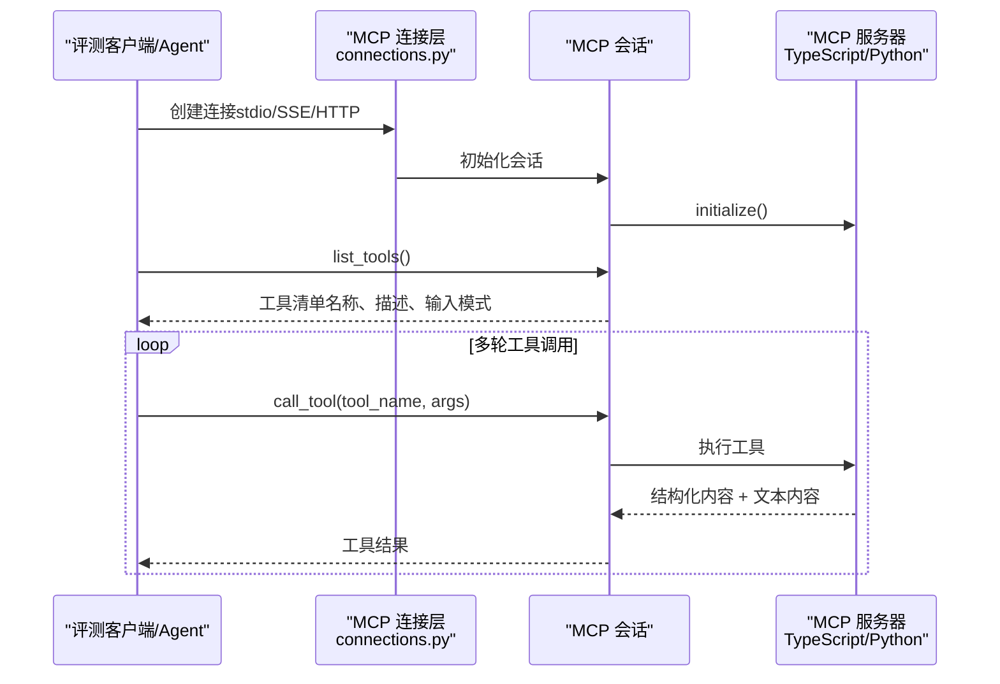
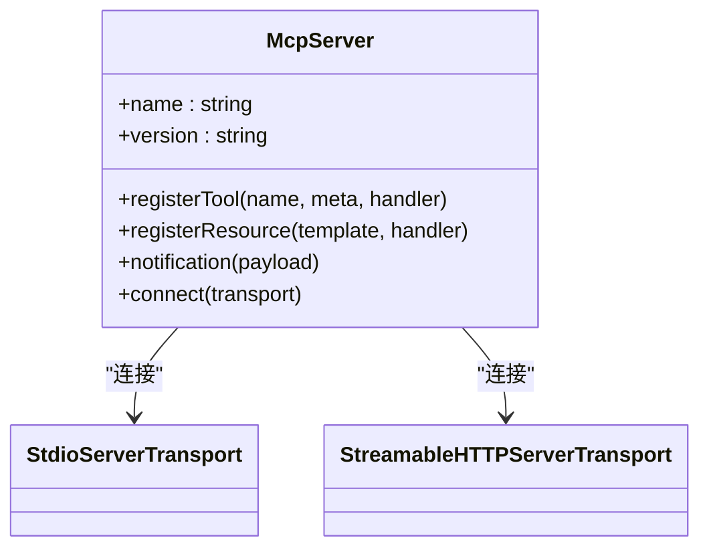
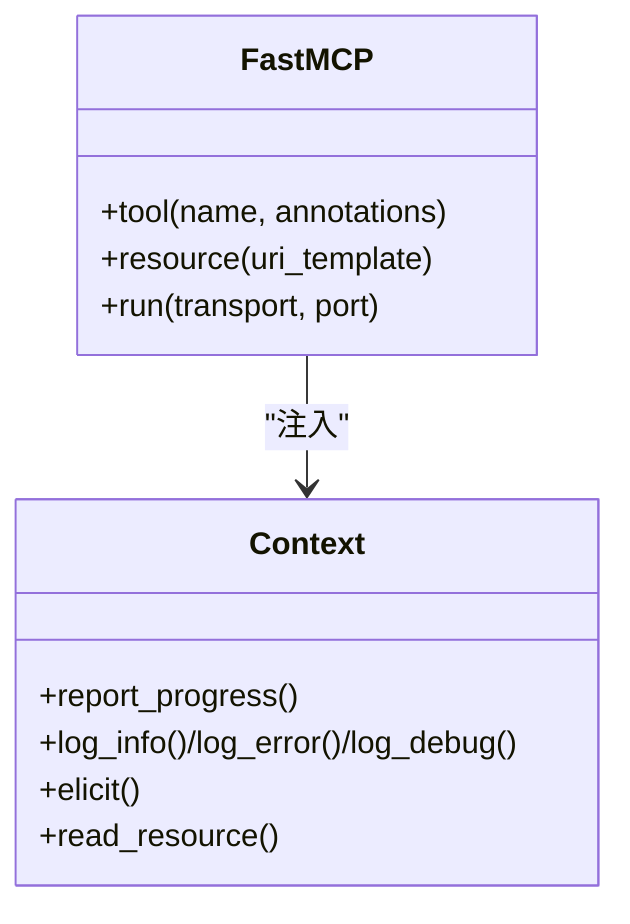
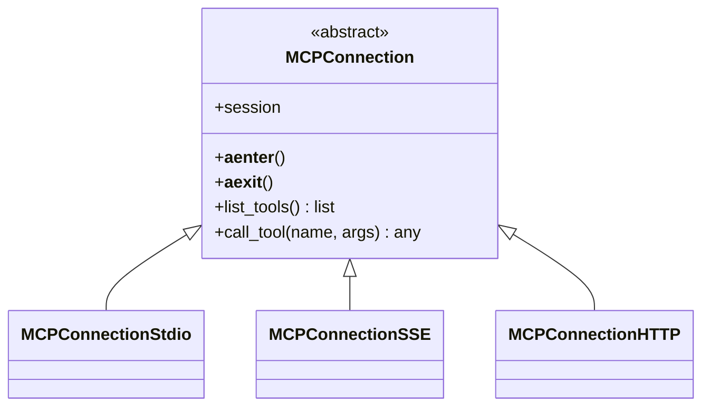
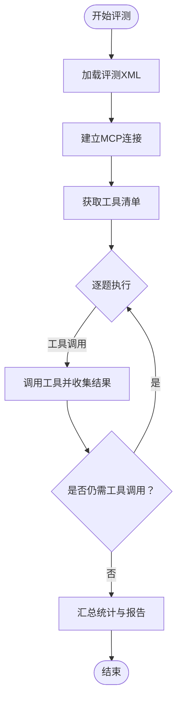
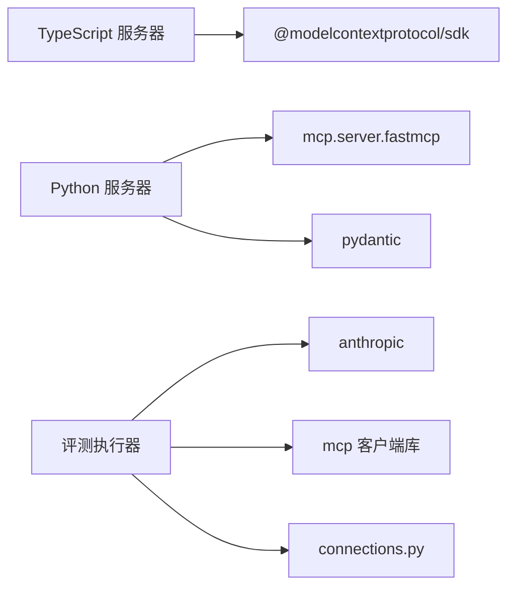

# MCP 协议基础

<cite>
**本文引用的文件**
- [mcp-best-practices.md](file://skills/skills/mcp-builder/reference/mcp_best_practices.md)
- [node-mcp-server.md](file://skills/skills/mcp-builder/reference/node_mcp_server.md)
- [python-mcp-server.md](file://skills/skills/mcp-builder/reference/python_mcp_server.md)
- [SKILL.md](file://skills/skills/mcp-builder/SKILL.md)
- [connections.py](file://skills/skills/mcp-builder/scripts/connections.py)
- [evaluation.py](file://skills/skills/mcp-builder/scripts/evaluation.py)
- [evaluation.md](file://skills/skills/mcp-builder/reference/evaluation.md)
</cite>

## 目录
1. [引言](#引言)
2. [项目结构](#项目结构)
3. [核心组件](#核心组件)
4. [架构总览](#架构总览)
5. [详细组件分析](#详细组件分析)
6. [依赖关系分析](#依赖关系分析)
7. [性能考量](#性能考量)
8. [故障排查指南](#故障排查指南)
9. [结论](#结论)
10. [附录](#附录)

## 引言
本文件系统化阐述 Model Context Protocol（MCP）的设计理念、通信机制与集成优势，结合仓库中的 TypeScript 与 Python 实现指南、最佳实践与评估脚本，给出协议规范、消息格式、连接建立与数据交换的实现细节，并总结工具命名约定、响应格式标准、分页最佳实践与传输选择策略等指导原则。目标是帮助读者在不同语言与运行环境中快速构建高质量的 MCP 服务器，使大模型能够通过工具与外部服务进行安全、高效、可扩展的交互。

## 项目结构
该仓库围绕“MCP 服务器开发”组织内容，包含：
- 指南与参考：TypeScript 与 Python 的 MCP 服务器实现指南、最佳实践、评估方法
- 脚本：用于连接不同传输方式（stdio、SSE、HTTP）的客户端封装与评测执行器
- 技能目录：通用的技能模板与示例，便于复用与扩展

图表来源
- [SKILL.md:1-237](file://skills/skills/mcp-builder/SKILL.md#L1-L237)
- [mcp-best-practices.md:1-250](file://skills/skills/mcp-builder/reference/mcp_best_practices.md#L1-L250)
- [node-mcp-server.md:1-970](file://skills/skills/mcp-builder/reference/node_mcp_server.md#L1-L970)
- [python-mcp-server.md:1-719](file://skills/skills/mcp-builder/reference/python_mcp_server.md#L1-L719)
- [evaluation.md:1-602](file://skills/skills/mcp-builder/reference/evaluation.md#L1-L602)
- [connections.py:1-152](file://skills/skills/mcp-builder/scripts/connections.py#L1-L152)
- [evaluation.py:1-374](file://skills/skills/mcp-builder/scripts/evaluation.py#L1-L374)

章节来源
- [SKILL.md:1-237](file://skills/skills/mcp-builder/SKILL.md#L1-L237)

## 核心组件
- 服务器端（MCP Server）
  - TypeScript：使用官方 SDK 的 McpServer，注册工具与资源，支持结构化输出与通知
  - Python：使用 FastMCP，装饰器式注册工具，自动从签名与文档生成描述与输入模式
- 客户端（MCP 客户端）
  - 统一抽象：MCPConnection 基类与子类（stdio、SSE、HTTP），封装会话初始化与工具调用
  - 评测执行器：基于 Anthropic 客户端与 MCP 工具，驱动多轮工具调用并生成报告
- 最佳实践与规范
  - 命名约定（服务器、工具）、响应格式（JSON/Markdown）、分页策略、传输选择、安全与错误处理

章节来源
- [node-mcp-server.md:50-120](file://skills/skills/mcp-builder/reference/node_mcp_server.md#L50-L120)
- [python-mcp-server.md:35-56](file://skills/skills/mcp-builder/reference/python_mcp_server.md#L35-L56)
- [mcp-best-practices.md:31-250](file://skills/skills/mcp-builder/reference/mcp_best_practices.md#L31-L250)
- [connections.py:13-152](file://skills/skills/mcp-builder/scripts/connections.py#L13-L152)
- [evaluation.py:86-152](file://skills/skills/mcp-builder/scripts/evaluation.py#L86-L152)

## 架构总览
下图展示 MCP 服务器与客户端之间的典型交互路径，涵盖连接建立、工具发现、工具调用与结果返回。

图表来源
- [connections.py:24-71](file://skills/skills/mcp-builder/scripts/connections.py#L24-L71)
- [evaluation.py:220-273](file://skills/skills/mcp-builder/scripts/evaluation.py#L220-L273)

## 详细组件分析

### 服务器端（TypeScript）
- 初始化与工具注册
  - 使用 McpServer 创建实例，注册工具时提供标题、描述、输入/输出模式与注解
  - 支持结构化内容与文本内容双通道返回，便于客户端解析与展示
- 输入验证与类型安全
  - 使用 Zod 对参数进行严格校验，确保运行时类型安全
- 错误处理与字符限制
  - 统一错误映射与可操作提示；对超长响应进行截断与提示
- 传输选择
  - stdio：本地/子进程场景
  - Streamable HTTP：远程服务，无状态 JSON，支持多客户端与通知

图表来源
- [node-mcp-server.md:20-46](file://skills/skills/mcp-builder/reference/node_mcp_server.md#L20-L46)
- [node-mcp-server.md:584-756](file://skills/skills/mcp-builder/reference/node_mcp_server.md#L584-L756)

章节来源
- [node-mcp-server.md:50-120](file://skills/skills/mcp-builder/reference/node_mcp_server.md#L50-L120)
- [node-mcp-server.md:276-407](file://skills/skills/mcp-builder/reference/node_mcp_server.md#L276-L407)
- [node-mcp-server.md:584-756](file://skills/skills/mcp-builder/reference/node_mcp_server.md#L584-L756)

### 服务器端（Python）
- 初始化与工具注册
  - 使用 FastMCP，装饰器注册工具，自动从函数签名与文档生成描述与输入模式
- 输入验证与类型约束
  - 使用 Pydantic v2 模型进行输入验证，含字段校验器与严格模式
- 错误处理与异步网络
  - 统一错误格式化，使用 httpx 异步客户端
- 传输选择
  - stdio（默认）与 Streamable HTTP

图表来源
- [python-mcp-server.md:35-56](file://skills/skills/mcp-builder/reference/python-mcp_server.md#L35-L56)
- [python-mcp-server.md:476-526](file://skills/skills/mcp-builder/reference/python_mcp_server.md#L476-L526)

章节来源
- [python-mcp-server.md:57-120](file://skills/skills/mcp-builder/reference/python_mcp_server.md#L57-L120)
- [python-mcp-server.md:207-226](file://skills/skills/mcp-builder/reference/python_mcp_server.md#L207-L226)
- [python-mcp-server.md:330-473](file://skills/skills/mcp-builder/reference/python_mcp_server.md#L330-L473)

### 客户端与连接层
- 统一抽象
  - MCPConnection 基类定义生命周期与工具发现/调用接口
  - 子类分别封装 stdio、SSE、HTTP 的上下文创建与会话初始化
- 工厂方法
  - create_connection 根据传输类型返回对应连接对象，支持参数校验与错误提示

图表来源
- [connections.py:13-152](file://skills/skills/mcp-builder/scripts/connections.py#L13-L152)

章节来源
- [connections.py:1-152](file://skills/skills/mcp-builder/scripts/connections.py#L1-L152)

### 评测执行器
- 评测流程
  - 解析 XML 评测任务，加载 MCP 工具清单，逐题驱动 Agent 使用工具完成任务
  - 记录工具调用次数与时延，生成统计与逐题摘要与反馈
- 输出格式
  - 评测报告包含准确率、平均耗时、平均工具调用数、每题摘要与反馈

图表来源
- [evaluation.py:220-273](file://skills/skills/mcp-builder/scripts/evaluation.py#L220-L273)
- [evaluation.md:174-243](file://skills/skills/mcp-builder/reference/evaluation.md#L174-L243)

章节来源
- [evaluation.py:1-374](file://skills/skills/mcp-builder/scripts/evaluation.py#L1-L374)
- [evaluation.md:1-602](file://skills/skills/mcp-builder/reference/evaluation.md#L1-L602)

## 依赖关系分析
- 语言与 SDK
  - TypeScript：@modelcontextprotocol/sdk（McpServer、传输模块、类型）
  - Python：mcp.server.fastmcp（FastMCP、装饰器注册）、pydantic（输入验证）
- 评测与运行时
  - anthropic（Claude 客户端）
  - mcp 客户端库（连接抽象与传输）
  - httpx（Python 异步 HTTP 客户端）

图表来源
- [node-mcp-server.md:50-63](file://skills/skills/mcp-builder/reference/node_mcp_server.md#L50-L63)
- [python-mcp-server.md:35-44](file://skills/skills/mcp-builder/reference/python_mcp_server.md#L35-L44)
- [evaluation.py:17-19](file://skills/skills/mcp-builder/scripts/evaluation.py#L17-L19)
- [connections.py:7-10](file://skills/skills/mcp-builder/scripts/connections.py#L7-L10)

章节来源
- [node-mcp-server.md:50-63](file://skills/skills/mcp-builder/reference/node_mcp_server.md#L50-L63)
- [python-mcp-server.md:35-44](file://skills/skills/mcp-builder/reference/python_mcp_server.md#L35-L44)
- [evaluation.py:17-19](file://skills/skills/mcp-builder/scripts/evaluation.py#L17-L19)
- [connections.py:7-10](file://skills/skills/mcp-builder/scripts/connections.py#L7-L10)

## 性能考量
- 传输选择
  - Streamable HTTP：适合远程、多客户端、无状态 JSON，便于横向扩展
  - stdio：适合本地/子进程、低复杂度场景
- 分页与字符限制
  - 严格遵守 limit 参数，返回 has_more、next_offset 等元数据
  - 控制单次响应字符上限，必要时截断并提示用户使用过滤或分页
- 并发与会话
  - HTTP 传输建议按请求创建新会话，避免请求 ID 冲突
- 工具设计
  - 将复杂逻辑拆分为原子工具，减少单次调用的数据量与计算量
  - 提供结构化内容与文本内容双通道，兼顾机器解析与人类可读性

章节来源
- [mcp-best-practices.md:108-150](file://skills/skills/mcp-builder/reference/mcp_best_practices.md#L108-L150)
- [node-mcp-server.md:382-406](file://skills/skills/mcp-builder/reference/node_mcp_server.md#L382-L406)
- [node-mcp-server.md:821-858](file://skills/skills/mcp-builder/reference/node_mcp_server.md#L821-L858)
- [python-mcp-server.md:182-205](file://skills/skills/mcp-builder/reference/python_mcp_server.md#L182-L205)

## 故障排查指南
- 连接问题
  - stdio：确认命令、参数与环境变量正确；服务器进程启动日志输出到 stderr
  - SSE/HTTP：检查 URL 可达性与认证头；确保服务器已启动
- 工具调用失败
  - 检查工具输入模式与必填参数；关注统一错误映射与可操作提示
  - 对于超时或限流，适当调整模型或增加重试策略
- 评测不通过
  - 依据 Agent 的摘要与反馈改进工具命名、描述与输入参数
  - 调整分页与过滤策略，确保返回数据聚焦且可验证

章节来源
- [evaluation.py:56-77](file://skills/skills/mcp-builder/scripts/evaluation.py#L56-L77)
- [evaluation.py:578-602](file://skills/skills/mcp-builder/scripts/evaluation.py#L578-L602)
- [mcp-best-practices.md:205-227](file://skills/skills/mcp-builder/reference/mcp_best_practices.md#L205-L227)

## 结论
MCP 协议通过标准化的工具与资源模型，使大模型能够以一致的方式访问外部服务。本仓库提供了跨语言的实现指南、最佳实践与评测工具，覆盖命名约定、响应格式、分页策略与传输选择等关键维度。遵循这些原则，可以构建出安全、高效、易用且可扩展的 MCP 服务器，显著提升 LLM 在真实任务中的表现。

## 附录

### 协议与消息规范（基于仓库内容提炼）
- 服务器命名
  - Python：{service}_mcp
  - TypeScript：{service}-mcp-server
- 工具命名
  - snake_case，带服务前缀，动词开头，避免冲突
- 响应格式
  - JSON：结构化数据，适合程序处理
  - Markdown：人类可读，包含标题、列表与格式化
- 分页
  - 始终尊重 limit；返回 has_more、next_offset/next_cursor、total_count
- 传输
  - Streamable HTTP：远程、多客户端、无状态 JSON
  - stdio：本地/子进程、简单部署
- 安全与错误
  - 统一 JSON-RPC 风格错误码；不暴露内部细节；提供可操作提示
  - DNS 重绑定保护（本地 HTTP 服务器）；OAuth 2.1 或 API Key 认证

章节来源
- [mcp-best-practices.md:31-250](file://skills/skills/mcp-builder/reference/mcp_best_practices.md#L31-L250)
- [node-mcp-server.md:50-120](file://skills/skills/mcp-builder/reference/node_mcp_server.md#L50-L120)
- [python-mcp-server.md:35-56](file://skills/skills/mcp-builder/reference/python_mcp_server.md#L35-L56)