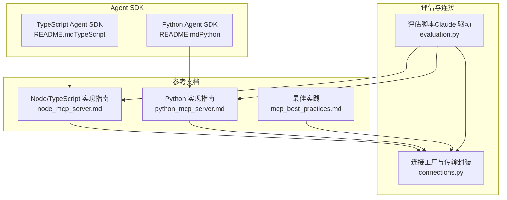
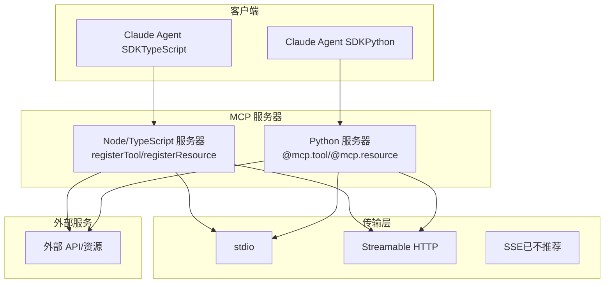
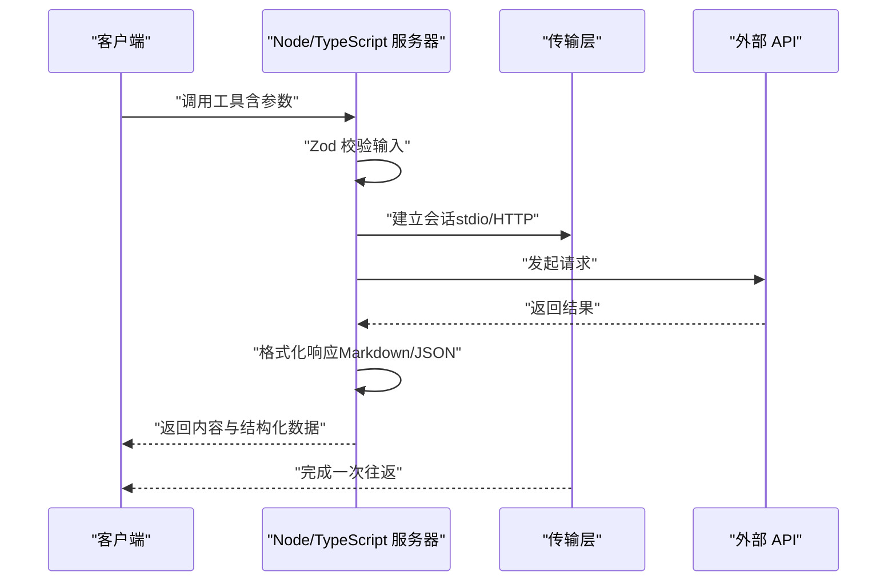
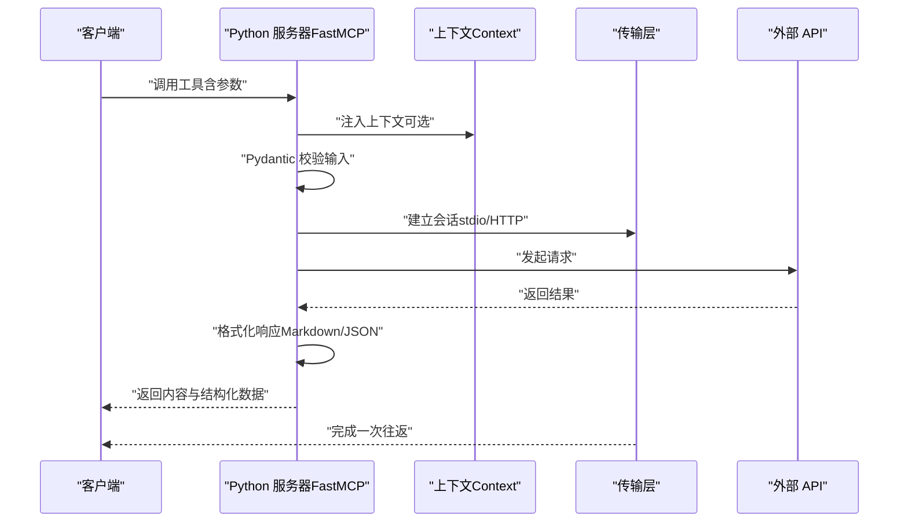
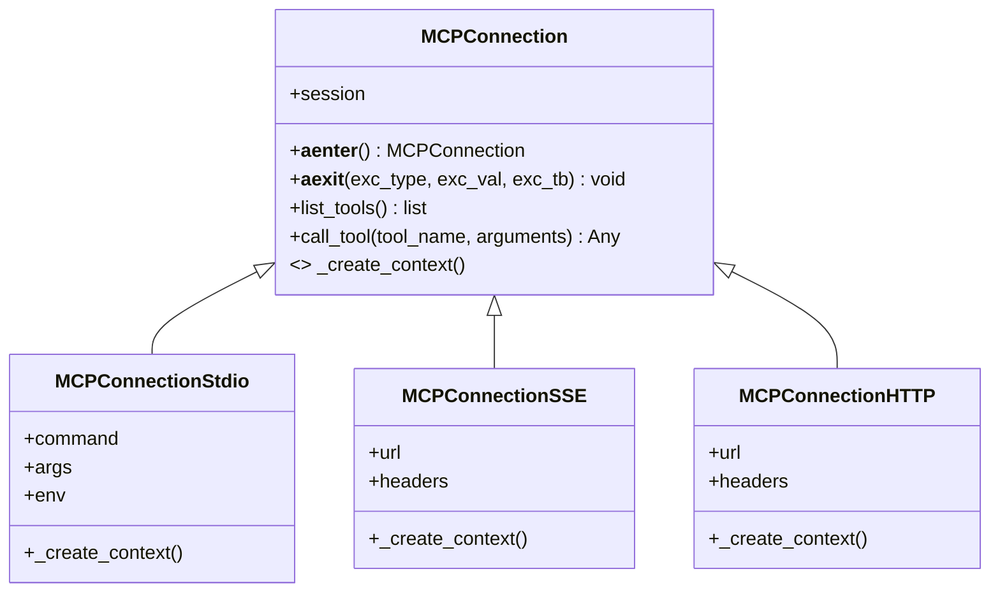
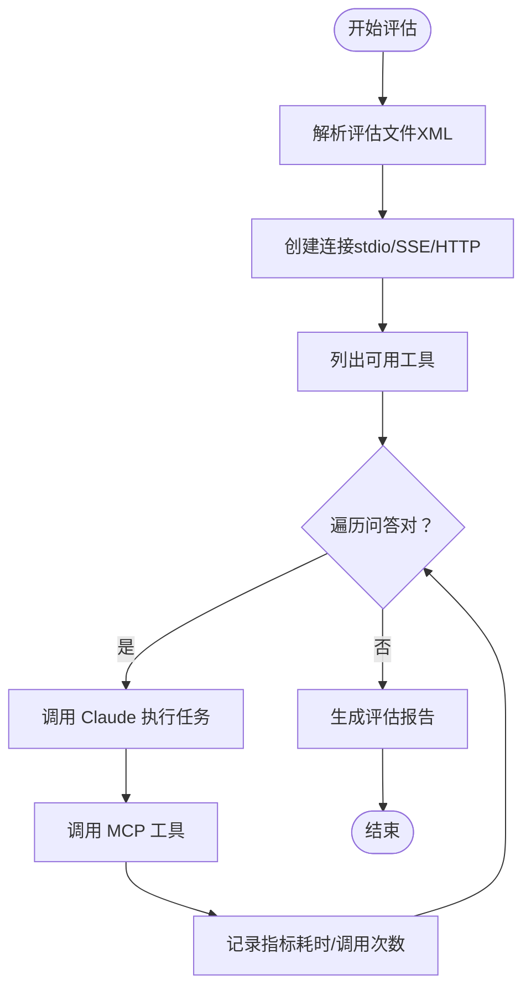
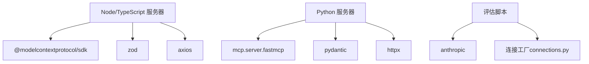

# MCP 服务器实现

<cite>
**本文档引用的文件**
- [node_mcp_server.md](file://skills/skills/mcp-builder/reference/node_mcp_server.md)
- [python_mcp_server.md](file://skills/skills/mcp-builder/reference/python_mcp_server.md)
- [mcp_best_practices.md](file://skills/skills/mcp-builder/reference/mcp_best_practices.md)
- [connections.py](file://skills/skills/mcp-builder/scripts/connections.py)
- [evaluation.py](file://skills/skills/mcp-builder/scripts/evaluation.py)
- [README.md（TypeScript Agent SDK）](file://skills/skills/claude-api/typescript/agent-sdk/README.md)
- [README.md（Python Agent SDK）](file://skills/skills/claude-api/python/agent-sdk/README.md)
</cite>

## 目录
1. [简介](#简介)
2. [项目结构](#项目结构)
3. [核心组件](#核心组件)
4. [架构总览](#架构总览)
5. [详细组件分析](#详细组件分析)
6. [依赖关系分析](#依赖关系分析)
7. [性能考虑](#性能考虑)
8. [故障排查指南](#故障排查指南)
9. [结论](#结论)
10. [附录](#附录)

## 简介
本文件面向希望在 Node.js 与 Python 环境中实现 MCP（Model Context Protocol）服务器的开发者，系统性阐述服务器的开发方法、架构设计与实现细节，覆盖连接管理、请求处理、响应格式与错误处理，并提供启动、配置管理与调试的实用指南。同时，结合 TypeScript 与 Python SDK 的使用方式，说明工具注册、输入输出模式与结构化内容处理的最佳实践。

## 项目结构
该仓库包含 MCP 服务器参考实现与评估工具，主要由以下部分组成：
- 参考文档：Node/TypeScript 与 Python 的 MCP 服务器实现指南，涵盖命名规范、项目结构、工具注册、输入验证、响应格式、分页、字符限制、错误处理、传输选择等。
- 脚本工具：用于连接不同传输（stdio/SSE/HTTP）的通用客户端封装，以及基于 Claude 的评估脚本，可对 MCP 服务器进行自动化评测。

**图表来源**
- [node_mcp_server.md](file://skills/skills/mcp-builder/reference/node_mcp_server.md)
- [python_mcp_server.md](file://skills/skills/mcp-builder/reference/python_mcp_server.md)
- [mcp_best_practices.md](file://skills/skills/mcp-builder/reference/mcp_best_practices.md)
- [connections.py](file://skills/skills/mcp-builder/scripts/connections.py)
- [evaluation.py](file://skills/skills/mcp-builder/scripts/evaluation.py)
- [README.md（TypeScript Agent SDK）](file://skills/skills/claude-api/typescript/agent-sdk/README.md)
- [README.md（Python Agent SDK）](file://skills/skills/claude-api/python/agent-sdk/README.md)

**章节来源**
- [node_mcp_server.md](file://skills/skills/mcp-builder/reference/node_mcp_server.md)
- [python_mcp_server.md](file://skills/skills/mcp-builder/reference/python_mcp_server.md)
- [mcp_best_practices.md](file://skills/skills/mcp-builder/reference/mcp_best_practices.md)
- [connections.py](file://skills/skills/mcp-builder/scripts/connections.py)
- [evaluation.py](file://skills/skills/mcp-builder/scripts/evaluation.py)
- [README.md（TypeScript Agent SDK）](file://skills/skills/claude-api/typescript/agent-sdk/README.md)
- [README.md（Python Agent SDK）](file://skills/skills/claude-api/python/agent-sdk/README.md)

## 核心组件
- 服务器初始化与工具注册
  - Node/TypeScript 使用官方 SDK 初始化服务器实例并注册工具；Python 使用 FastMCP 装饰器注册工具。
  - 工具需提供标题、描述、输入/输出模式与注解（只读、破坏性、幂等、开放世界）。
- 输入验证
  - Node/TypeScript 使用 Zod Schema；Python 使用 Pydantic 模型，二者均支持严格模式与字段约束。
- 响应格式
  - 支持 Markdown 与 JSON 两种格式，便于人类阅读与机器解析。
- 分页与字符限制
  - 提供分页元数据（总数、当前数量、偏移、是否还有更多、下一页偏移），并设置字符上限以避免超大响应。
- 错误处理
  - 统一的错误消息格式，区分网络错误、超时、权限与速率限制等场景。
- 传输层
  - 支持 stdio（本地）、Streamable HTTP（远程多客户端）与 SSE（已不推荐，优先使用 Streamable HTTP）。

**章节来源**
- [node_mcp_server.md](file://skills/skills/mcp-builder/reference/node_mcp_server.md)
- [python_mcp_server.md](file://skills/skills/mcp-builder/reference/python_mcp_server.md)
- [mcp_best_practices.md](file://skills/skills/mcp-builder/reference/mcp_best_practices.md)

## 架构总览
下图展示了 MCP 服务器在 Node/Python 环境中的典型运行架构，以及与客户端（如 Claude Agent SDK）的交互流程。

**图表来源**
- [node_mcp_server.md](file://skills/skills/mcp-builder/reference/node_mcp_server.md)
- [python_mcp_server.md](file://skills/skills/mcp-builder/reference/python_mcp_server.md)
- [README.md（TypeScript Agent SDK）](file://skills/skills/claude-api/typescript/agent-sdk/README.md)
- [README.md（Python Agent SDK）](file://skills/skills/claude-api/python/agent-sdk/README.md)

## 详细组件分析

### Node/TypeScript 服务器实现
- 服务器初始化与命名
  - 使用 SDK 创建服务器实例，名称遵循“{service}-mcp-server”格式，便于识别与组合使用。
- 工具注册与输入验证
  - 使用 registerTool 注册工具，提供标题、描述、输入/输出模式与注解；输入参数通过 Zod Schema 进行运行时校验。
- 响应格式与结构化内容
  - 返回内容支持文本块与结构化内容（structuredContent），便于客户端以人类可读或机器可解析形式消费。
- 分页与字符限制
  - 提供分页元数据与字符上限检查，必要时截断并提示用户使用过滤器或偏移量。
- 错误处理
  - 对网络异常、超时、权限与速率限制等进行统一格式化输出。
- 传输选择
  - 支持 stdio（本地）与 Streamable HTTP（远程），通过环境变量选择传输类型。

**图表来源**
- [node_mcp_server.md](file://skills/skills/mcp-builder/reference/node_mcp_server.md)

**章节来源**
- [node_mcp_server.md](file://skills/skills/mcp-builder/reference/node_mcp_server.md)

### Python 服务器实现
- 服务器初始化与命名
  - 使用 FastMCP 初始化服务器，名称遵循“{service}_mcp”，支持装饰器注册工具与资源。
- 工具与资源注册
  - 使用 @mcp.tool 注册工具，@mcp.resource 注册资源；支持上下文注入（Context）以实现进度报告、日志与用户交互。
- 输入验证与响应格式
  - 使用 Pydantic 模型进行输入验证；支持字符串、TypedDict、Pydantic 模型等多种返回类型，自动序列化。
- 分页与字符限制
  - 返回分页元数据；对大型响应进行字符限制与截断提示。
- 错误处理
  - 统一处理 HTTP 状态错误与超时，提供清晰的错误信息。
- 传输选择
  - 支持 stdio（默认）与 Streamable HTTP，可通过运行参数切换。

**图表来源**
- [python_mcp_server.md](file://skills/skills/mcp-builder/reference/python_mcp_server.md)

**章节来源**
- [python_mcp_server.md](file://skills/skills/mcp-builder/reference/python_mcp_server.md)

### 连接管理与传输封装
- 连接抽象
  - 抽象基类 MCPConnection 定义生命周期与工具列表/调用接口；具体实现包括 stdio、SSE 与 Streamable HTTP。
- 工厂函数
  - create_connection 根据传输类型创建对应连接对象，支持命令行参数与 HTTP 头部配置。
- 会话初始化
  - 通过 AsyncExitStack 管理异步资源，进入上下文后初始化 ClientSession 并执行 initialize。

**图表来源**
- [connections.py](file://skills/skills/mcp-builder/scripts/connections.py)

**章节来源**
- [connections.py](file://skills/skills/mcp-builder/scripts/connections.py)

### 评估与调试工具
- 评估脚本
  - 基于 Claude 的评估流程，加载 XML 中的问答对，自动调用 MCP 工具并统计准确率、平均耗时与工具调用次数。
- 连接工厂
  - 通过 create_connection 支持 stdio、SSE、HTTP 三种传输，便于在不同部署环境下进行端到端测试。
- 头部与环境变量解析
  - 支持从命令行传入 HTTP 头部与环境变量，适配鉴权与运行时配置。

**图表来源**
- [evaluation.py](file://skills/skills/mcp-builder/scripts/evaluation.py)
- [connections.py](file://skills/skills/mcp-builder/scripts/connections.py)

**章节来源**
- [evaluation.py](file://skills/skills/mcp-builder/scripts/evaluation.py)
- [connections.py](file://skills/skills/mcp-builder/scripts/connections.py)

### TypeScript 与 Python SDK 的使用要点
- TypeScript Agent SDK
  - 支持内置工具集合与 MCP 服务器集成；可通过 mcpServers 参数连接外部 MCP 服务器；支持权限模式与钩子扩展。
- Python Agent SDK
  - 提供 query 与 ClaudeSDKClient 两种接口；支持 MCP 服务器连接、权限控制、钩子与消息类型解析。

**章节来源**
- [README.md（TypeScript Agent SDK）](file://skills/skills/claude-api/typescript/agent-sdk/README.md)
- [README.md（Python Agent SDK）](file://skills/skills/claude-api/python/agent-sdk/README.md)

## 依赖关系分析
- Node/TypeScript 服务器依赖官方 SDK、Zod 与 HTTP 客户端库；构建产物为 dist/index.js。
- Python 服务器依赖 FastMCP、Pydantic 与异步 HTTP 客户端；通过装饰器与上下文实现高级能力。
- 评估脚本依赖 Claude SDK、连接工厂与 XML 解析库，形成端到端测试闭环。

**图表来源**
- [node_mcp_server.md](file://skills/skills/mcp-builder/reference/node_mcp_server.md)
- [python_mcp_server.md](file://skills/skills/mcp-builder/reference/python_mcp_server.md)
- [evaluation.py](file://skills/skills/mcp-builder/scripts/evaluation.py)
- [connections.py](file://skills/skills/mcp-builder/scripts/connections.py)

**章节来源**
- [node_mcp_server.md](file://skills/skills/mcp-builder/reference/node_mcp_server.md)
- [python_mcp_server.md](file://skills/skills/mcp-builder/reference/python_mcp_server.md)
- [evaluation.py](file://skills/skills/mcp-builder/scripts/evaluation.py)
- [connections.py](file://skills/skills/mcp-builder/scripts/connections.py)

## 性能考虑
- 传输选择
  - Streamable HTTP 更适合多客户端与远程部署；stdio 适合本地与单用户场景。
- 分页与字符限制
  - 合理设置分页大小与字符上限，避免一次性返回大量数据导致内存与带宽压力。
- 异步与超时
  - 使用 async/await 与合理超时时间，避免阻塞与资源泄漏。
- 缓存与复用
  - 对静态资源与配置采用资源注册（Resources）而非工具重复计算；对共享 API 客户端进行复用。

[本节为通用指导，无需特定文件引用]

## 故障排查指南
- 传输问题
  - 确认传输类型与端口配置；stdio 场景注意日志输出到标准错误而非标准输出。
- 认证与鉴权
  - 确保环境变量与头部正确传递；对无效密钥与权限不足给出明确提示。
- 输入验证失败
  - 检查 Zod/Pydantic 字段约束与错误消息；确保严格模式启用。
- 超时与限流
  - 区分网络超时与服务端限流，分别返回可操作的错误信息。
- 评估失败
  - 使用评估脚本定位工具调用耗时与错误堆栈，结合连接工厂参数调整传输与头部。

**章节来源**
- [mcp_best_practices.md](file://skills/skills/mcp-builder/reference/mcp_best_practices.md)
- [evaluation.py](file://skills/skills/mcp-builder/scripts/evaluation.py)
- [connections.py](file://skills/skills/mcp-builder/scripts/connections.py)

## 结论
通过参考文档与脚本工具，开发者可在 Node/TypeScript 与 Python 环境中快速搭建符合 MCP 规范的服务器。关键在于严格的输入验证、清晰的响应格式、合理的分页与字符限制、完善的错误处理与灵活的传输选择。借助评估脚本与 Agent SDK，可以持续验证与优化服务器的可用性与性能。

[本节为总结性内容，无需特定文件引用]

## 附录
- 命名规范
  - Node/TypeScript：{service}-mcp-server；Python：{service}_mcp。
- 工具命名
  - 使用 snake_case，包含服务前缀与动作导向，避免冲突。
- 传输选择建议
  - 本地/单用户：stdio；远程/多客户端：Streamable HTTP。

**章节来源**
- [mcp_best_practices.md](file://skills/skills/mcp-builder/reference/mcp_best_practices.md)