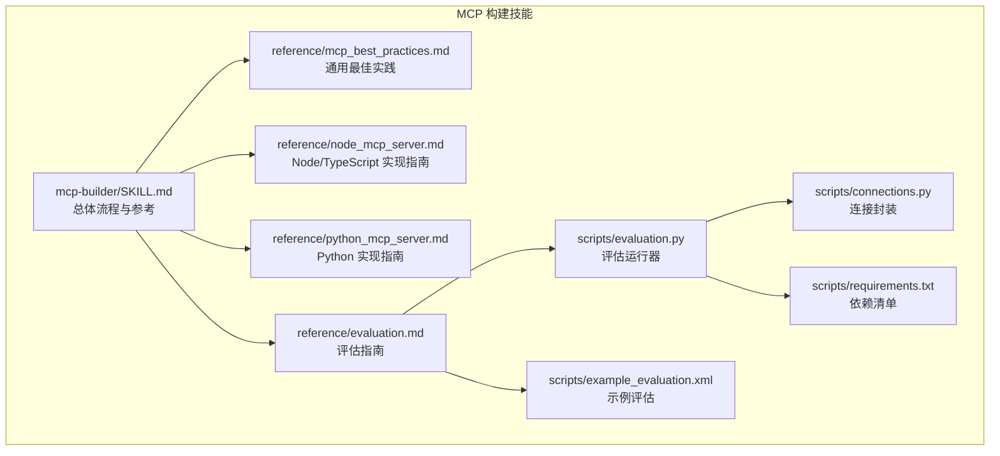
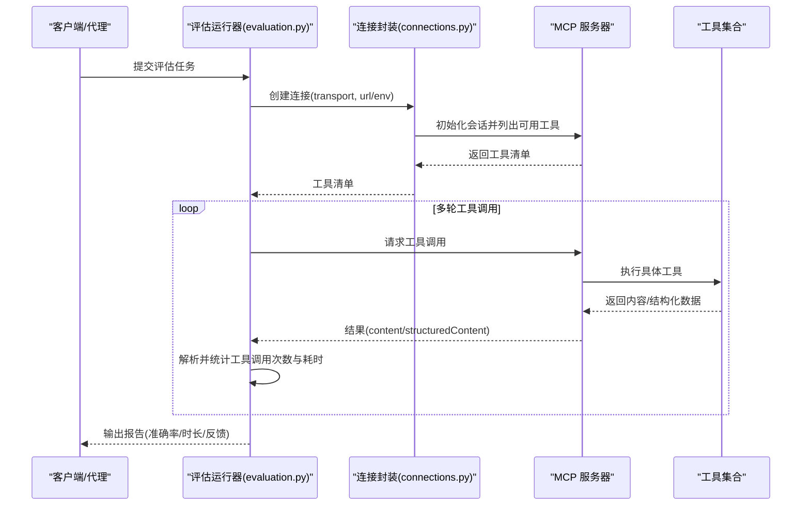
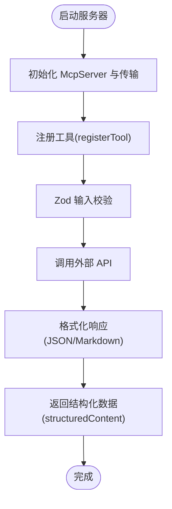
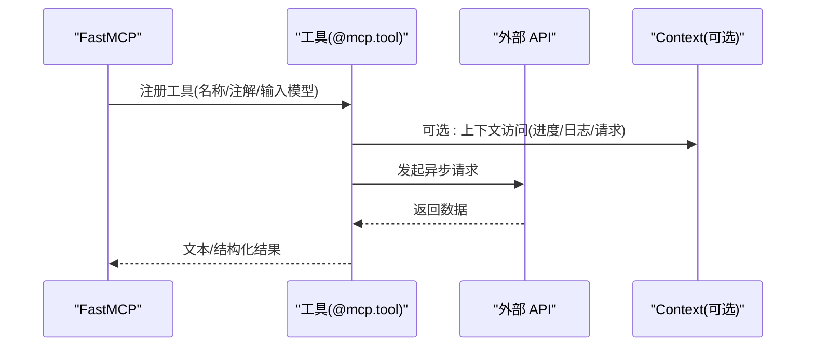
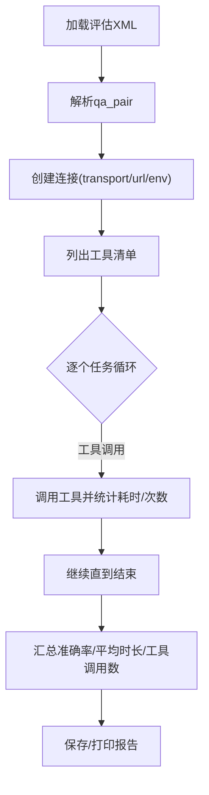
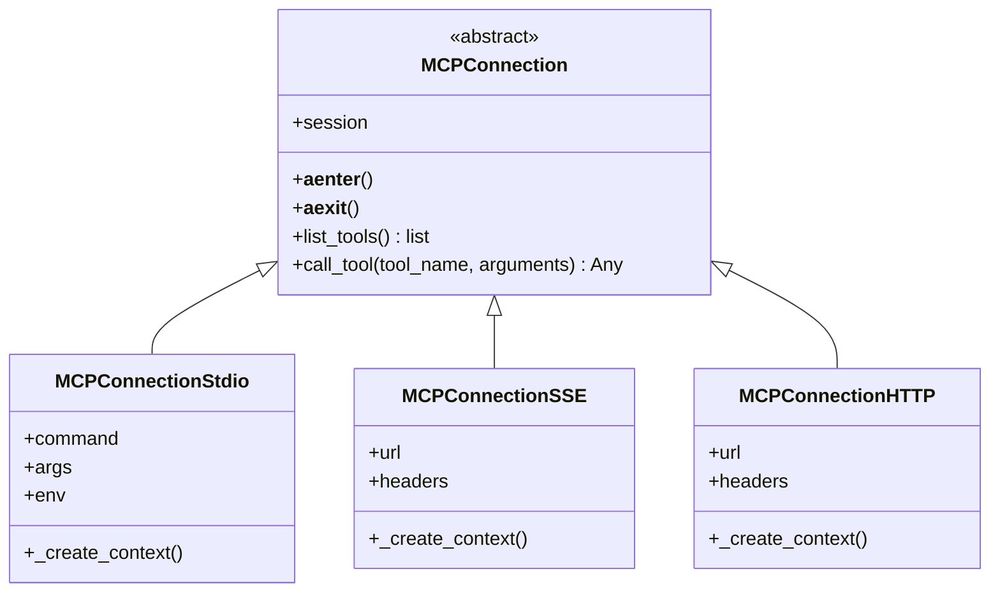
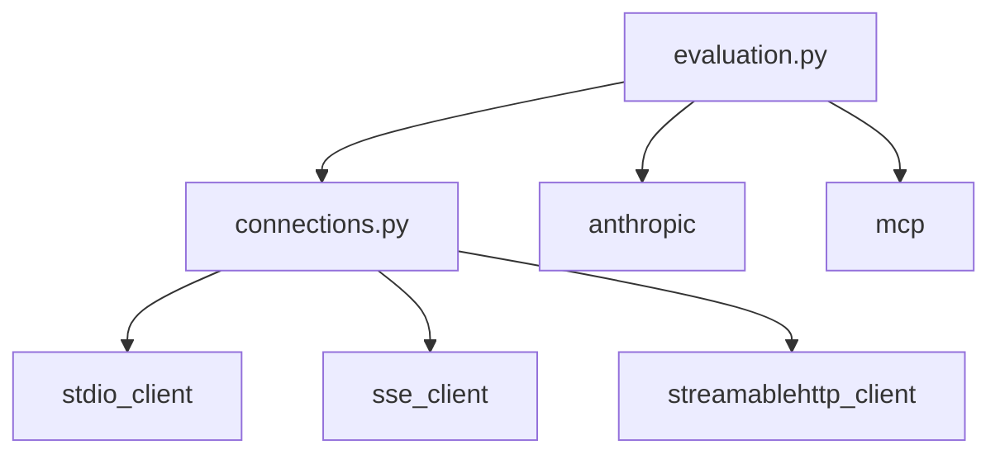

# MCP 服务器构建技能

<cite>
**本文引用的文件**
- [mcp-builder/SKILL.md](file://skills/skills/mcp-builder/SKILL.md)
- [mcp-best-practices.md](file://skills/skills/mcp-builder/reference/mcp_best_practices.md)
- [node_mcp_server.md](file://skills/skills/mcp-builder/reference/node_mcp_server.md)
- [python_mcp_server.md](file://skills/skills/mcp-builder/reference/python_mcp_server.md)
- [evaluation.md](file://skills/skills/mcp-builder/reference/evaluation.md)
- [connections.py](file://skills/skills/mcp-builder/scripts/connections.py)
- [evaluation.py](file://skills/skills/mcp-builder/scripts/evaluation.py)
- [example_evaluation.xml](file://skills/skills/mcp-builder/scripts/example_evaluation.xml)
- [requirements.txt](file://skills/skills/mcp-builder/scripts/requirements.txt)
</cite>

## 目录
1. [简介](#简介)
2. [项目结构](#项目结构)
3. [核心组件](#核心组件)
4. [架构总览](#架构总览)
5. [详细组件分析](#详细组件分析)
6. [依赖分析](#依赖分析)
7. [性能考量](#性能考量)
8. [故障排查指南](#故障排查指南)
9. [结论](#结论)
10. [附录](#附录)

## 简介
本技能旨在帮助开发者基于 MCP（Model Context Protocol）协议构建高质量的 MCP 服务器，使大模型能够通过精心设计的工具与外部服务进行交互。文档覆盖协议工作原理、服务器架构与集成模式，提供 Node/TypeScript 与 Python 的实现指南，涵盖连接管理、评估流程与最佳实践；并包含自定义 MCP 服务器开发、协议实现与性能优化的实际示例，以及安全、错误处理与调试技巧。

## 项目结构
该技能仓库中的 MCP 构建模块位于 skills/skills/mcp-builder 下，包含语言特定的参考文档、脚本与示例。核心结构如下：
- 参考文档：mcp-best_practices.md、node_mcp_server.md、python_mcp_server.md、evaluation.md
- 脚本：connections.py（通用连接封装）、evaluation.py（评估运行器）、example_evaluation.xml（示例评估）、requirements.txt（依赖）
- 技能说明：mcp-builder/SKILL.md（总体流程与参考）

图表来源
- [mcp-builder/SKILL.md:1-237](file://skills/skills/mcp-builder/SKILL.md#L1-L237)
- [mcp-best_practices.md:1-250](file://skills/skills/mcp-builder/reference/mcp_best_practices.md#L1-L250)
- [node_mcp_server.md:1-970](file://skills/skills/mcp-builder/reference/node_mcp_server.md#L1-L970)
- [python_mcp_server.md:1-719](file://skills/skills/mcp-builder/reference/python_mcp_server.md#L1-L719)
- [evaluation.md:1-602](file://skills/skills/mcp-builder/reference/evaluation.md#L1-L602)
- [connections.py:1-152](file://skills/skills/mcp-builder/scripts/connections.py#L1-L152)
- [evaluation.py:1-374](file://skills/skills/mcp-builder/scripts/evaluation.py#L1-L374)
- [example_evaluation.xml:1-23](file://skills/skills/mcp-builder/scripts/example_evaluation.xml#L1-L23)
- [requirements.txt:1-3](file://skills/skills/mcp-builder/scripts/requirements.txt#L1-L3)

章节来源
- [mcp-builder/SKILL.md:1-237](file://skills/skills/mcp-builder/SKILL.md#L1-L237)

## 核心组件
- 协议与最佳实践：统一命名、工具设计、响应格式、分页、传输选择、安全与错误处理等规范
- Node/TypeScript 实现：使用官方 TypeScript SDK，注册工具、资源与提示，支持 Zod 输入校验与结构化输出
- Python 实现：使用 FastMCP 框架，装饰器式工具注册、Pydantic 输入校验、上下文注入与资源暴露
- 评估体系：创建复杂、真实、稳定的问答对，验证工具链在多步骤任务中的有效性
- 连接与运行：抽象连接类与工厂，支持 stdio、SSE、Streamable HTTP 三种传输；评估脚本自动拉起或连接远程服务器

章节来源
- [mcp-best_practices.md:1-250](file://skills/skills/mcp-builder/reference/mcp_best_practices.md#L1-L250)
- [node_mcp_server.md:1-970](file://skills/skills/mcp-builder/reference/node_mcp_server.md#L1-L970)
- [python_mcp_server.md:1-719](file://skills/skills/mcp-builder/reference/python_mcp_server.md#L1-L719)
- [evaluation.md:1-602](file://skills/skills/mcp-builder/reference/evaluation.md#L1-L602)
- [connections.py:1-152](file://skills/skills/mcp-builder/scripts/connections.py#L1-L152)
- [evaluation.py:1-374](file://skills/skills/mcp-builder/scripts/evaluation.py#L1-L374)

## 架构总览
下图展示了 MCP 服务器从客户端到工具执行的整体交互流程，以及评估系统如何驱动工具调用与结果比对。

图表来源
- [evaluation.py:86-151](file://skills/skills/mcp-builder/scripts/evaluation.py#L86-L151)
- [connections.py:55-71](file://skills/skills/mcp-builder/scripts/connections.py#L55-L71)
- [evaluation.md:378-500](file://skills/skills/mcp-builder/reference/evaluation.md#L378-L500)

## 详细组件分析

### Node/TypeScript MCP 服务器实现
- SDK 使用与现代 API：推荐使用 registerTool/registerResource/registerPrompt 等现代方法，具备类型安全与自动 schema 处理
- 命名约定：服务名加后缀的命名模式，工具名采用 snake_case 并带服务前缀
- 输入校验：Zod schema 强约束，严格模式与枚举支持
- 响应格式：同时提供 Markdown 与 JSON，结构化数据通过 structuredContent 返回
- 分页与字符限制：提供分页元数据与可配置字符上限，避免超大响应
- 错误处理：Axios 错误映射与统一错误消息
- 传输选择：stdio 本地与 Streamable HTTP 远程两种方式
- 完整示例：包含工具注册、API 请求封装、错误处理与主函数

图表来源
- [node_mcp_server.md:20-756](file://skills/skills/mcp-builder/reference/node_mcp_server.md#L20-L756)

章节来源
- [node_mcp_server.md:1-970](file://skills/skills/mcp-builder/reference/node_mcp_server.md#L1-L970)

### Python FastMCP 服务器实现
- 框架特性：自动从签名与 docstring 生成描述与输入 schema，装饰器式工具注册
- 命名约定：服务名下划线格式，工具名 snake_case 带服务前缀
- 输入校验：Pydantic v2 模型，字段校验器与严格配置
- 响应格式：Markdown 与 JSON 二选一，支持结构化返回类型
- 上下文注入：Context 参数用于进度上报、日志与用户交互
- 资源注册：URI 模板暴露静态或半静态数据
- 生命周期管理：应用生命周期中持久化资源与清理
- 传输选项：stdio 本地与 Streamable HTTP 远程
- 完整示例：包含工具实现、错误处理、运行入口

图表来源
- [python_mcp_server.md:20-472](file://skills/skills/mcp-builder/reference/python_mcp_server.md#L20-L472)

章节来源
- [python_mcp_server.md:1-719](file://skills/skills/mcp-builder/reference/python_mcp_server.md#L1-L719)

### 评估系统与运行流程
- 评估目标：验证 LLM 是否能在仅使用 MCP 工具的情况下回答复杂、现实的问题
- 评估要求：10 个独立、只读、非破坏性、幂等且稳定的问题，每个问题可能需要数十次工具调用
- 输出格式：XML 文件，包含问题与答案
- 运行器：支持 stdio（自动拉起服务器）、SSE、HTTP 三种传输；解析工具清单、循环工具调用、统计指标并生成报告
- 示例：提供简单数学题示例评估文件，便于快速上手

图表来源
- [evaluation.py:220-272](file://skills/skills/mcp-builder/scripts/evaluation.py#L220-L272)
- [evaluation.md:174-243](file://skills/skills/mcp-builder/reference/evaluation.md#L174-L243)
- [example_evaluation.xml:1-23](file://skills/skills/mcp-builder/scripts/example_evaluation.xml#L1-L23)

章节来源
- [evaluation.py:1-374](file://skills/skills/mcp-builder/scripts/evaluation.py#L1-L374)
- [evaluation.md:1-602](file://skills/skills/mcp-builder/reference/evaluation.md#L1-L602)
- [example_evaluation.xml:1-23](file://skills/skills/mcp-builder/scripts/example_evaluation.xml#L1-L23)

### 连接管理与传输抽象
- 抽象基类：MCPConnection 封装会话初始化、上下文管理与工具调用
- 具体实现：stdio、SSE、Streamable HTTP 三类连接
- 工厂函数：根据 transport 类型创建对应连接实例
- 使用场景：评估脚本通过工厂创建连接，统一 list_tools 与 call_tool 接口

图表来源
- [connections.py:13-152](file://skills/skills/mcp-builder/scripts/connections.py#L13-L152)

章节来源
- [connections.py:1-152](file://skills/skills/mcp-builder/scripts/connections.py#L1-L152)

## 依赖分析
- 评估运行器依赖：anthropic（调用 Claude 模型）、mcp（MCP 客户端与传输）
- 运行器与连接：通过工厂函数按 transport 选择连接类型，统一工具列表与调用接口
- 传输对比：stdio 适合本地/单用户；Streamable HTTP 支持多客户端与远程部署；SSE 已被弃用，建议使用 Streamable HTTP

图表来源
- [evaluation.py:17-19](file://skills/skills/mcp-builder/scripts/evaluation.py#L17-L19)
- [requirements.txt:1-3](file://skills/skills/mcp-builder/scripts/requirements.txt#L1-L3)
- [connections.py:7-10](file://skills/skills/mcp-builder/scripts/connections.py#L7-L10)

章节来源
- [requirements.txt:1-3](file://skills/skills/mcp-builder/scripts/requirements.txt#L1-L3)
- [evaluation.py:1-374](file://skills/skills/mcp-builder/scripts/evaluation.py#L1-L374)
- [connections.py:1-152](file://skills/skills/mcp-builder/scripts/connections.py#L1-L152)

## 性能考量
- 传输选择：Streamable HTTP 更适合多客户端与远程部署；stdio 适合本地与命令行工具
- 分页与限流：尊重 limit 参数、返回 has_more/next_offset/total_count；默认 20-50 条
- 响应大小控制：设置字符上限，必要时截断并提示使用过滤参数
- 异步 I/O：统一使用 async/await，避免阻塞；合理超时与重试策略
- 工具设计：原子化操作、明确注解（只读/幂等/破坏性/开放世界），减少不必要的网络往返
- 评估指标：关注准确率、平均任务时长、平均工具调用次数与总调用数，持续优化工具与提示

## 故障排查指南
- 连接问题
  - stdio：检查命令与参数是否正确，确认环境变量已传入
  - SSE/HTTP：核对 URL 可达性与认证头，确保 API 密钥有效
- 准确率低
  - 检查工具描述与输入参数文档，确保清晰且可执行
  - 验证工具返回数据量与格式，避免过多或过少信息
  - 查看评估报告中的 agent 反馈，针对性改进工具
- 超时与大响应
  - 使用更强大模型或优化工具返回内容
  - 确保分页正确实现，避免一次性加载全部数据
  - 控制字符上限，必要时增加过滤条件
- 日志与调试
  - Node/TypeScript：使用结构化日志输出到标准错误
  - Python：避免向 stdout 写日志，使用日志模块或上下文上报

章节来源
- [evaluation.md:578-602](file://skills/skills/mcp-builder/reference/evaluation.md#L578-L602)
- [mcp-best_practices.md:152-250](file://skills/skills/mcp-builder/reference/mcp_best_practices.md#L152-L250)

## 结论
通过本技能提供的参考文档与脚本，开发者可以系统地构建符合 MCP 协议的服务器，实现高质量工具与资源，结合评估体系验证工具链在复杂任务中的有效性。遵循命名、输入校验、响应格式、分页与安全等最佳实践，配合合适的传输与性能优化策略，能够显著提升 MCP 服务器的可用性与稳定性。

## 附录
- 快速开始
  - 选择语言：TypeScript（推荐）或 Python
  - 参考指南：分别查看 Node/TypeScript 与 Python 的实现指南
  - 评估准备：创建 10 个独立、只读、非破坏性、幂等且稳定的问答对
  - 运行评估：使用评估脚本连接本地或远程服务器，生成报告并迭代优化
- 参考链接
  - MCP 协议与 SDK 文档可在技能说明中找到加载指引

章节来源
- [mcp-builder/SKILL.md:196-237](file://skills/skills/mcp-builder/SKILL.md#L196-L237)