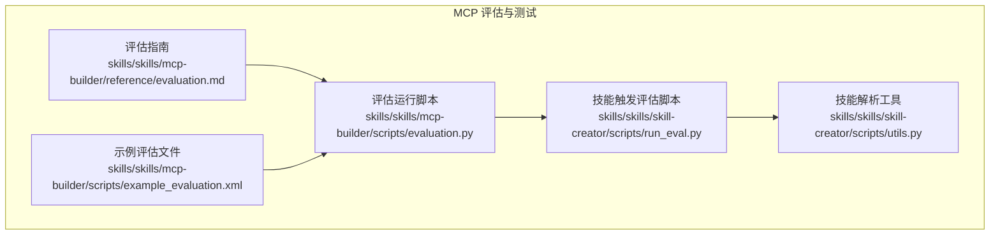
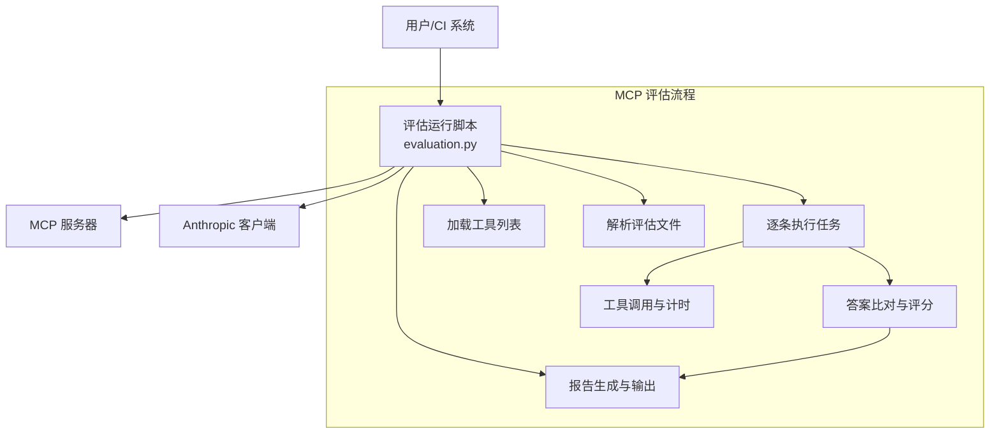
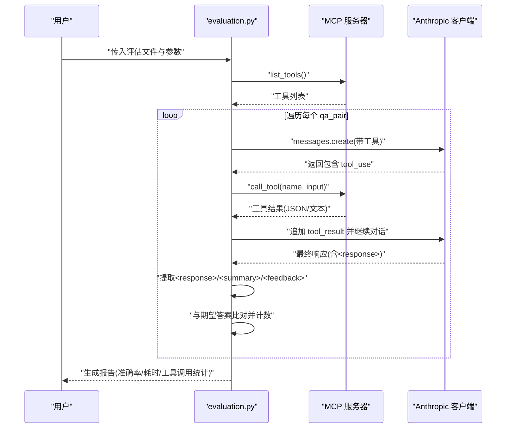
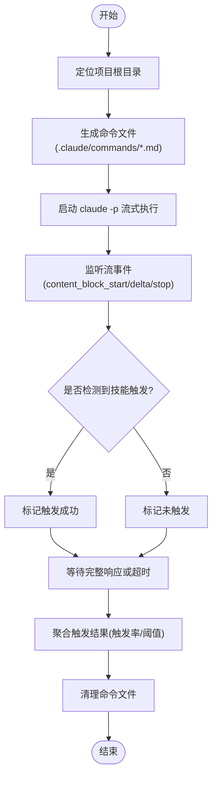
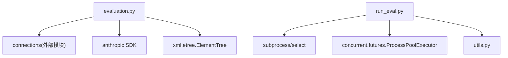

# MCP 评估与测试

<cite>
**本文引用的文件**
- [evaluation.md](file://skills/skills/mcp-builder/reference/evaluation.md)
- [evaluation.py](file://skills/skills/mcp-builder/scripts/evaluation.py)
- [example_evaluation.xml](file://skills/skills/mcp-builder/scripts/example_evaluation.xml)
- [run_eval.py](file://skills/skills/skill-creator/scripts/run_eval.py)
- [utils.py](file://skills/skills/skill-creator/scripts/utils.py)
</cite>

## 目录
1. [简介](#简介)
2. [项目结构](#项目结构)
3. [核心组件](#核心组件)
4. [架构总览](#架构总览)
5. [详细组件分析](#详细组件分析)
6. [依赖分析](#依赖分析)
7. [性能考虑](#性能考虑)
8. [故障排查指南](#故障排查指南)
9. [结论](#结论)
10. [附录](#附录)

## 简介
本文件面向 MCP（Model Context Protocol）服务器的评估与测试，系统性阐述评估流程、测试方法与质量保证机制。内容覆盖评估脚本编写、测试用例设计、性能基准测试、自动化与回归测试、集成测试最佳实践，并提供评估问题创建、答案验证、XML 格式规范以及评估运行脚本的使用方法。目标是帮助开发者以可重复、可度量的方式验证 MCP 服务器在真实复杂任务中的可用性与稳定性。

## 项目结构
围绕 MCP 评估与测试的相关模块主要分布在以下位置：
- mcp-builder/reference：评估指南与规范
- mcp-builder/scripts：评估运行脚本与示例
- skill-creator/scripts：技能触发评估脚本与工具

图表来源
- [evaluation.md](file://skills/skills/mcp-builder/reference/evaluation.md)
- [evaluation.py](file://skills/skills/mcp-builder/scripts/evaluation.py)
- [example_evaluation.xml](file://skills/skills/mcp-builder/scripts/example_evaluation.xml)
- [run_eval.py](file://skills/skills/skill-creator/scripts/run_eval.py)
- [utils.py](file://skills/skills/skill-creator/scripts/utils.py)

章节来源
- [evaluation.md](file://skills/skills/mcp-builder/reference/evaluation.md)
- [evaluation.py](file://skills/skills/mcp-builder/scripts/evaluation.py)
- [example_evaluation.xml](file://skills/skills/mcp-builder/scripts/example_evaluation.xml)
- [run_eval.py](file://skills/skills/skill-creator/scripts/run_eval.py)
- [utils.py](file://skills/skills/skill-creator/scripts/utils.py)

## 核心组件
- 评估指南与规范：定义评估目标、问题与答案要求、输出格式、验证流程与最佳实践。
- 评估运行脚本：基于 Anthropic 客户端与 MCP 连接，自动执行评估任务，统计准确率、平均耗时、工具调用次数等指标。
- 示例评估文件：提供标准 XML 结构示例，便于快速生成与校验。
- 技能触发评估脚本：用于验证技能描述是否能正确触发 Claude 的工具选择，支持并发与阈值判定。
- 技能解析工具：从 SKILL.md 中提取名称与描述，供触发评估使用。

章节来源
- [evaluation.md](file://skills/skills/mcp-builder/reference/evaluation.md)
- [evaluation.py](file://skills/skills/mcp-builder/scripts/evaluation.py)
- [example_evaluation.xml](file://skills/skills/mcp-builder/scripts/example_evaluation.xml)
- [run_eval.py](file://skills/skills/skill-creator/scripts/run_eval.py)
- [utils.py](file://skills/skills/skill-creator/scripts/utils.py)

## 架构总览
下图展示了 MCP 评估的整体架构：评估指南指导问题设计；评估运行脚本通过 MCP 连接器访问工具，使用 Claude 模型执行任务；最终生成报告并输出统计结果。

图表来源
- [evaluation.py](file://skills/skills/mcp-builder/scripts/evaluation.py)

章节来源
- [evaluation.py](file://skills/skills/mcp-builder/scripts/evaluation.py)

## 详细组件分析

### 组件一：评估指南与规范（evaluation.md）
- 目标与范围：强调评估重点在于“工具能力如何使 LLM 能仅凭 MCP 服务器回答真实复杂问题”，而非工具实现的完整性。
- 问题设计原则：独立、只读、非破坏性、幂等；现实、清晰、简洁、复杂；需要多跳推理、分页查询、历史数据与深层理解；避免关键词直搜。
- 答案设计原则：可直接字符串比对、人类可读、稳定不变、单一明确、多样化模态、避免复杂结构。
- 评估流程：文档检查、工具检查、理解迭代、只读内容检查、任务生成、输出 XML。
- 输出格式：XML 包含多个 <qa_pair>，每个包含 <question> 与 <answer>。
- 验证流程：逐条加载任务，使用 MCP 工具并行求解，标记写操作，收集正确答案并修正文件。
- 运行说明：支持 stdio、sse、http 三种传输方式；提供命令行参数与示例。

章节来源
- [evaluation.md](file://skills/skills/mcp-builder/reference/evaluation.md)

### 组件二：评估运行脚本（evaluation.py）
- 功能概述：解析评估 XML，加载 MCP 工具，调用 Anthropic 客户端，按需循环工具调用，抽取 
、<feedback>、<response>，进行答案比对与评分。
- 关键流程：
  - 解析评估文件：遍历 <qa_pair>，提取问题与期望答案。
  - 加载工具：通过连接器列出工具，作为 Claude 的工具集。
  - 代理循环：当返回 stop_reason 为 tool_use 时，调用 MCP 工具并追加工具结果到消息流，直至结束。
  - 结果统计：计算准确率、平均耗时、每任务平均工具调用数、总工具调用数。
  - 报告模板：包含摘要与逐任务详情（问题、期望答案、实际答案、正确性、耗时、工具调用明细、摘要与反馈）。
- 命令行选项：支持 stdio/sse/http 传输类型、模型选择、stdio 子进程命令与环境变量、sse/http 头部与 URL、输出文件。
- 错误处理：工具调用异常捕获并记录；解析标签失败时回退为 N/A；头与环境变量格式错误给出警告。

图表来源
- [evaluation.py](file://skills/skills/mcp-builder/scripts/evaluation.py)

章节来源
- [evaluation.py](file://skills/skills/mcp-builder/scripts/evaluation.py)

### 组件三：示例评估文件（example_evaluation.xml）
- 结构：根元素为 <evaluation>，包含多个 <qa_pair>，每个包含 <question> 与 <answer>。
- 用途：演示 XML 格式、问题与答案的组织方式，便于快速生成符合规范的评估文件。

章节来源
- [example_evaluation.xml](file://skills/skills/mcp-builder/scripts/example_evaluation.xml)

### 组件四：技能触发评估脚本（run_eval.py）
- 功能概述：针对技能描述触发效果进行评估，判断在一组查询中是否触发指定技能（Skill 或 Read），支持并发与阈值判定。
- 关键流程：
  - 查找项目根目录，确保命令文件放置在正确位置。
  - 为每个查询动态生成命令文件，描述技能内容。
  - 启动 claude -p 流式输出，监听 stream 事件以尽早检测触发。
  - 支持超时控制与进程清理。
  - 计算触发率并根据阈值判定通过与否。
- 并发与阈值：使用 ProcessPoolExecutor 并发执行；支持 runs-per-query 与 trigger-threshold。
- 输出：JSON 包含每个查询的触发率、期望触发情况、是否通过及汇总统计。

图表来源
- [run_eval.py](file://skills/skills/skill-creator/scripts/run_eval.py)

章节来源
- [run_eval.py](file://skills/skills/skill-creator/scripts/run_eval.py)

### 组件五：技能解析工具（utils.py）
- 功能概述：解析 SKILL.md 的 frontmatter，提取 name 与 description，支持 YAML 多行块语法。
- 使用场景：为触发评估脚本提供技能名称与描述，确保命令文件内容正确。

章节来源
- [utils.py](file://skills/skills/skill-creator/scripts/utils.py)

## 依赖分析
- 评估运行脚本依赖：
  - 连接器模块（由 connections 导出，负责 stdio/sse/http 三类传输）。
  - Anthropic SDK 用于消息创建与工具调用。
  - XML 解析与正则提取标签内容。
- 触发评估脚本依赖：
  - 子进程与流式输出解析，用于检测 Claude 的工具调用事件。
  - 并发执行器以提升吞吐。
- 两者共同点：
  - 均依赖标准库与第三方库（如 asyncio、json、re、argparse、traceback、xml.etree.ElementTree）。
  - 均提供命令行接口，便于 CI 集成。

图表来源
- [evaluation.py](file://skills/skills/mcp-builder/scripts/evaluation.py)
- [run_eval.py](file://skills/skills/skill-creator/scripts/run_eval.py)
- [utils.py](file://skills/skills/skill-creator/scripts/utils.py)

章节来源
- [evaluation.py](file://skills/skills/mcp-builder/scripts/evaluation.py)
- [run_eval.py](file://skills/skills/skill-creator/scripts/run_eval.py)
- [utils.py](file://skills/skills/skill-creator/scripts/utils.py)

## 性能考虑
- 工具调用优化
  - 控制单次工具返回规模，避免上下文溢出；优先使用分页与 limit 参数。
  - 在评估指南中建议限制每次工具调用返回数量，减少上下文压力。
- 模型与资源
  - 当任务复杂度高或工具返回大量数据时，选用更强大的模型可提升成功率。
- 并发与吞吐
  - 评估运行脚本按任务顺序串行执行；若需加速，可在 CI 层面并行拆分评估文件。
  - 触发评估脚本已内置并发执行器，可通过参数调整工作线程数。
- 报告与可观测性
  - 评估运行脚本输出每任务工具调用明细与耗时，便于定位慢工具与瓶颈。

章节来源
- [evaluation.md](file://skills/skills/mcp-builder/reference/evaluation.md)
- [evaluation.py](file://skills/skills/mcp-builder/scripts/evaluation.py)
- [run_eval.py](file://skills/skills/skill-creator/scripts/run_eval.py)

## 故障排查指南
- 连接问题
  - stdio：确认命令与参数正确，必要时设置环境变量。
  - sse/http：检查 URL 可达性与头部配置，确保认证信息正确。
- 准确率低
  - 查看每任务摘要与反馈，关注工具命名、输入参数文档、错误信息与返回数据量。
  - 优化工具描述与输入输出模式，减少歧义与过度返回。
- 超时与上下文不足
  - 降低单次工具返回量，增加分页与 limit。
  - 简化复杂问题或拆分为子任务。
- 触发评估不稳定
  - 提高 runs-per-query 与 num-workers，调整 trigger-threshold。
  - 确保 SKILL.md frontmatter 正确，命令文件生成路径有效。

章节来源
- [evaluation.md](file://skills/skills/mcp-builder/reference/evaluation.md)
- [evaluation.py](file://skills/skills/mcp-builder/scripts/evaluation.py)
- [run_eval.py](file://skills/skills/skill-creator/scripts/run_eval.py)

## 结论
本方案提供了从问题设计、XML 规范、自动化评估到触发验证的完整闭环。通过评估运行脚本与触发评估脚本的协同，既能衡量 MCP 服务器在复杂任务中的表现，也能验证技能描述的触发效果。建议在持续集成中定期运行评估，结合报告反馈持续改进工具设计与实现。

## 附录

### 评估问题创建与答案验证清单
- 问题独立且只读：不依赖其他问题答案，不进行写操作。
- 答案单一可验证：采用直接字符串比较，避免复杂结构。
- 稳定性：基于历史或封闭数据，避免“当前状态”类问题。
- 复杂度：需要多跳推理、分页与跨数据源合成。
- 多样化：答案覆盖不同概念与模态（用户、频道、消息、文件、数值、布尔等）。

章节来源
- [evaluation.md](file://skills/skills/mcp-builder/reference/evaluation.md)

### XML 格式规范与示例
- 结构：根元素为 <evaluation>，包含若干 <qa_pair>，每个包含 <question> 与 <answer>。
- 示例参考：示例评估文件展示了标准结构与问答组织方式。

章节来源
- [evaluation.md](file://skills/skills/mcp-builder/reference/evaluation.md)
- [example_evaluation.xml](file://skills/skills/mcp-builder/scripts/example_evaluation.xml)

### 评估运行脚本使用方法
- 安装依赖：安装 anthropic 与 mcp 相关包。
- 设置密钥：配置 API 密钥环境变量。
- 本地 stdio：由脚本自动启动 MCP 服务器进程。
- SSE/HTTP：先启动服务器，再通过 URL 与头部连接。
- 输出报告：支持保存到文件或打印到标准输出。

章节来源
- [evaluation.md](file://skills/skills/mcp-builder/reference/evaluation.md)
- [evaluation.py](file://skills/skills/mcp-builder/scripts/evaluation.py)

### 自动化测试与回归测试最佳实践
- 将评估脚本纳入 CI：按分支/PR 触发评估，记录报告并标注失败。
- 分层测试：先运行触发评估，再运行 MCP 评估，最后进行性能回归。
- 回归策略：固定评估集，对比准确率与工具调用趋势，发现回归及时告警。
- 并发与稳定性：在 CI 中限制并发度，避免资源争用导致误判。

章节来源
- [evaluation.py](file://skills/skills/mcp-builder/scripts/evaluation.py)
- [run_eval.py](file://skills/skills/skill-creator/scripts/run_eval.py)

### 集成测试建议
- 端到端：使用真实 MCP 服务器与真实数据源，覆盖关键业务路径。
- 场景覆盖：包含多跳、分页、时间窗口、多模态数据等典型场景。
- 监控与日志：记录每任务工具调用与耗时，便于事后分析。

章节来源
- [evaluation.md](file://skills/skills/mcp-builder/reference/evaluation.md)
- [evaluation.py](file://skills/skills/mcp-builder/scripts/evaluation.py)