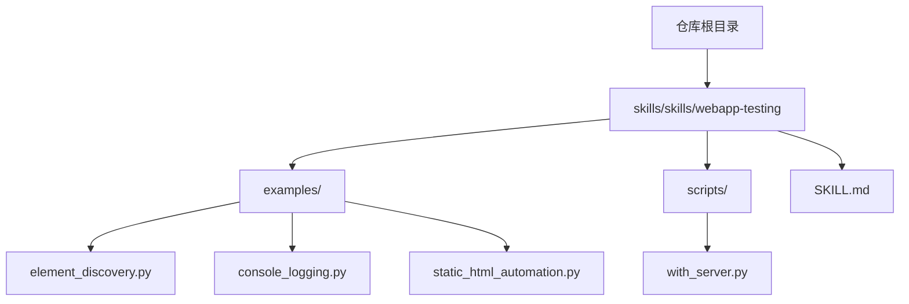
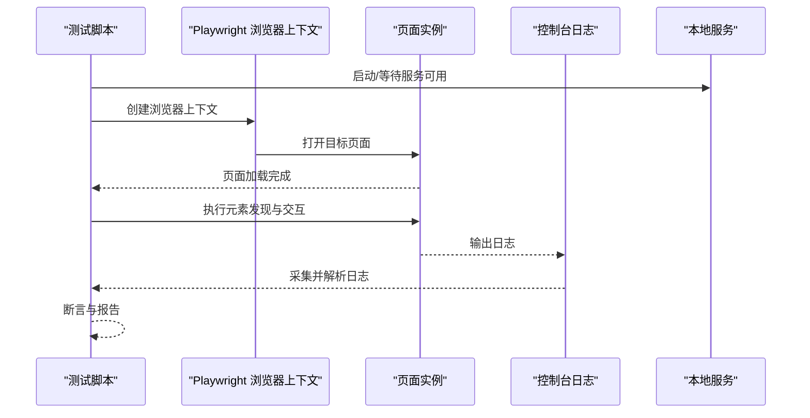
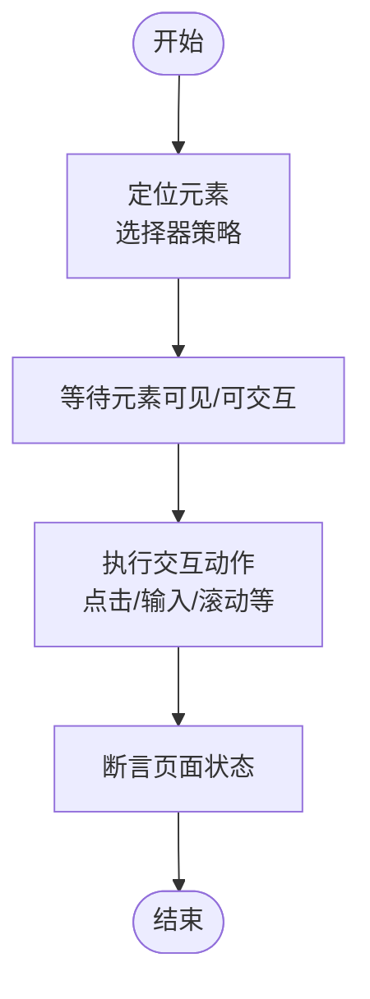
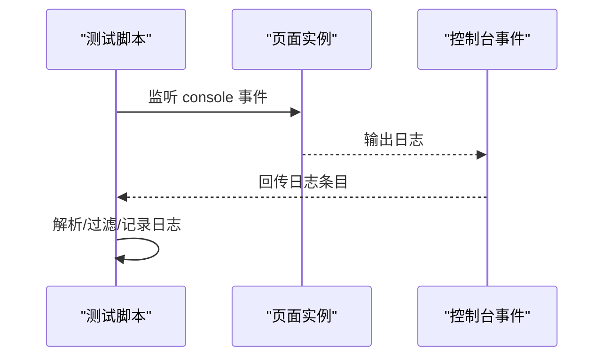
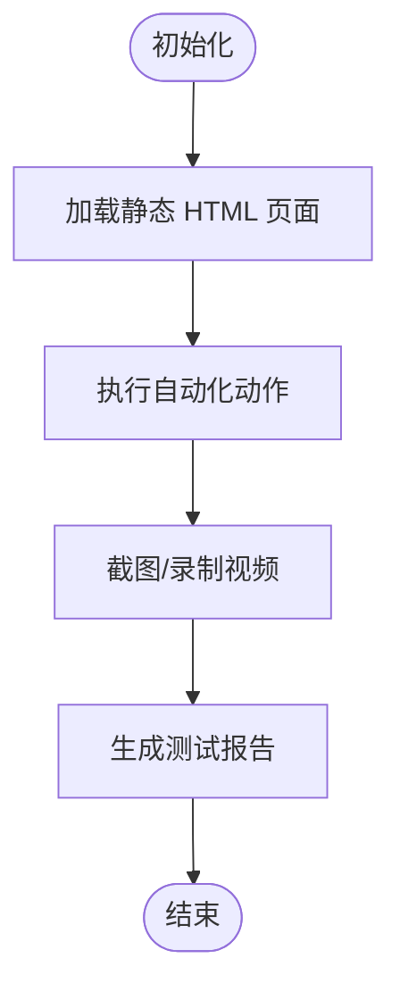
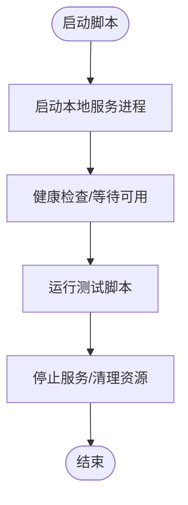
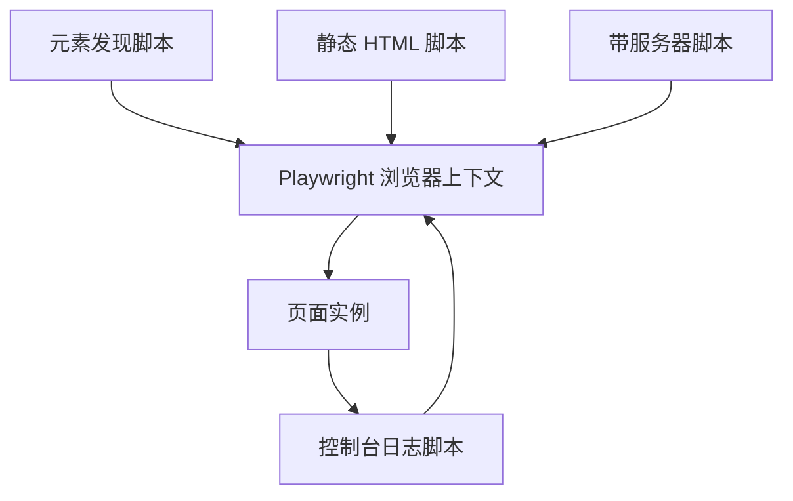

# Web 应用测试技能

<cite>
**本文引用的文件**
- [webapp-testing/SKILL.md](file://skills/skills/webapp-testing/SKILL.md)
- [element_discovery.py](file://skills/skills/webapp-testing/examples/element_discovery.py)
- [console_logging.py](file://skills/skills/webapp-testing/examples/console_logging.py)
- [static_html_automation.py](file://skills/skills/webapp-testing/examples/static_html_automation.py)
- [with_server.py](file://skills/skills/webapp-testing/scripts/with_server.py)
</cite>

## 目录
1. [引言](#引言)
2. [项目结构](#项目结构)
3. [核心组件](#核心组件)
4. [架构总览](#架构总览)
5. [详细组件分析](#详细组件分析)
6. [依赖关系分析](#依赖关系分析)
7. [性能考量](#性能考量)
8. [故障排查指南](#故障排查指南)
9. [结论](#结论)
10. [附录](#附录)

## 引言
本文件面向 Web 应用测试技能，系统性讲解如何在该代码库中开展自动化测试，重点覆盖以下主题：
- 使用 Playwright 进行自动化测试的策略与最佳实践
- 元素发现与页面交互
- 控制台日志采集与静态 HTML 自动化
- 测试环境搭建、脚本编写与调试技巧
- 测试覆盖率、性能监控与持续集成（CI）配置思路

该知识库中的“webapp-testing”技能模块提供了示例与脚本，可作为 Playwright 自动化测试的参考实现。

## 项目结构
与 Web 应用测试相关的核心位置位于 skills/skills/webapp-testing，包含以下关键目录与文件：
- examples：包含元素发现、控制台日志、静态 HTML 自动化等示例脚本
- scripts：包含带服务器运行的辅助脚本
- SKILL.md：技能说明文档，提供测试目标、范围与实施建议

图表来源
- [webapp-testing/SKILL.md](file://skills/skills/webapp-testing/SKILL.md)
- [element_discovery.py](file://skills/skills/webapp-testing/examples/element_discovery.py)
- [console_logging.py](file://skills/skills/webapp-testing/examples/console_logging.py)
- [static_html_automation.py](file://skills/skills/webapp-testing/examples/static_html_automation.py)
- [with_server.py](file://skills/skills/webapp-testing/scripts/with_server.py)

章节来源
- [webapp-testing/SKILL.md](file://skills/skills/webapp-testing/SKILL.md)

## 核心组件
- 元素发现与页面交互示例：演示如何通过 Playwright 定位页面元素、触发交互事件，并验证结果
- 控制台日志采集示例：展示如何捕获浏览器控制台输出，用于错误定位与行为验证
- 静态 HTML 自动化示例：演示对静态页面进行自动化操作与断言
- 带服务器运行脚本：提供本地或 CI 环境下启动服务以供测试访问的通用模式

章节来源
- [element_discovery.py](file://skills/skills/webapp-testing/examples/element_discovery.py)
- [console_logging.py](file://skills/skills/webapp-testing/examples/console_logging.py)
- [static_html_automation.py](file://skills/skills/webapp-testing/examples/static_html_automation.py)
- [with_server.py](file://skills/skills/webapp-testing/scripts/with_server.py)

## 架构总览
下图展示了从测试脚本到被测页面的典型调用链路，以及日志采集与服务启动的协作方式：

图表来源
- [with_server.py](file://skills/skills/webapp-testing/scripts/with_server.py)
- [element_discovery.py](file://skills/skills/webapp-testing/examples/element_discovery.py)
- [console_logging.py](file://skills/skills/webapp-testing/examples/console_logging.py)

## 详细组件分析

### 组件一：元素发现与页面交互
- 目标：通过 Playwright 定位页面元素并执行点击、输入、滚动等交互
- 关键点：
  - 使用稳定的选择器策略（如文本匹配、属性选择、可访问性标签）
  - 对动态内容采用等待策略，避免竞态条件
  - 将交互结果与断言结合，确保页面状态符合预期
- 参考实现位置：[element_discovery.py](file://skills/skills/webapp-testing/examples/element_discovery.py)

图表来源
- [element_discovery.py](file://skills/skills/webapp-testing/examples/element_discovery.py)

章节来源
- [element_discovery.py](file://skills/skills/webapp-testing/examples/element_discovery.py)

### 组件二：控制台日志记录
- 目标：采集并解析浏览器控制台输出，辅助定位错误与验证副作用
- 关键点：
  - 在页面上下文中监听 console 事件
  - 区分错误、警告与普通日志，按需过滤与归类
  - 将日志写入测试报告或标准输出，便于 CI 查看
- 参考实现位置：[console_logging.py](file://skills/skills/webapp-testing/examples/console_logging.py)

图表来源
- [console_logging.py](file://skills/skills/webapp-testing/examples/console_logging.py)

章节来源
- [console_logging.py](file://skills/skills/webapp-testing/examples/console_logging.py)

### 组件三：静态 HTML 自动化
- 目标：对静态 HTML 页面进行自动化，包括 DOM 操作、表单提交与结果断言
- 关键点：
  - 使用本地文件协议或简单 HTTP 服务托管静态页面
  - 通过 Playwright 加载页面并执行自动化流程
  - 结合控制台日志与截图/视频录制提升可观测性
- 参考实现位置：[static_html_automation.py](file://skills/skills/webapp-testing/examples/static_html_automation.py)

图表来源
- [static_html_automation.py](file://skills/skills/webapp-testing/examples/static_html_automation.py)

章节来源
- [static_html_automation.py](file://skills/skills/webapp-testing/examples/static_html_automation.py)

### 组件四：带服务器运行脚本
- 目标：在测试前启动本地服务，确保被测页面可访问；在测试后清理资源
- 关键点：
  - 提供服务可用性检测与超时处理
  - 支持多平台进程管理与信号处理
  - 与测试脚本解耦，便于复用与 CI 集成
- 参考实现位置：[with_server.py](file://skills/skills/webapp-testing/scripts/with_server.py)

图表来源
- [with_server.py](file://skills/skills/webapp-testing/scripts/with_server.py)

章节来源
- [with_server.py](file://skills/skills/webapp-testing/scripts/with_server.py)

## 依赖关系分析
- 测试脚本依赖 Playwright 的浏览器上下文与页面实例
- 控制台日志采集依赖页面的 console 事件监听
- 静态 HTML 自动化依赖本地或外部服务提供的页面资源
- 带服务器运行脚本为测试提供稳定的网络环境

图表来源
- [element_discovery.py](file://skills/skills/webapp-testing/examples/element_discovery.py)
- [console_logging.py](file://skills/skills/webapp-testing/examples/console_logging.py)
- [static_html_automation.py](file://skills/skills/webapp-testing/examples/static_html_automation.py)
- [with_server.py](file://skills/skills/webapp-testing/scripts/with_server.py)

章节来源
- [element_discovery.py](file://skills/skills/webapp-testing/examples/element_discovery.py)
- [console_logging.py](file://skills/skills/webapp-testing/examples/console_logging.py)
- [static_html_automation.py](file://skills/skills/webapp-testing/examples/static_html_automation.py)
- [with_server.py](file://skills/skills/webapp-testing/scripts/with_server.py)

## 性能考量
- 选择器优化：优先使用稳定且高效的定位策略，减少重试与回溯
- 并发与隔离：在 CI 中合理拆分测试套件，避免共享状态导致的性能抖动
- 截图与视频：仅在失败或需要诊断时启用，降低存储与传输成本
- 服务预热：在 CI 中缓存依赖与预热服务，缩短冷启动时间
- 日志采样：对高频日志进行采样或聚合，避免日志风暴影响性能

## 故障排查指南
- 元素未找到或交互失败
  - 检查选择器是否稳定，是否存在动态 ID 或随机类名
  - 增加显式等待，确保元素处于可交互状态
  - 使用控制台日志确认页面是否按预期渲染
- 页面加载超时
  - 检查网络代理与 DNS 设置
  - 在 CI 中增加超时阈值或重试机制
- 控制台异常
  - 分类收集错误与警告，优先处理错误
  - 将日志与页面截图关联，便于定位问题
- 服务不可用
  - 使用带服务器脚本进行健康检查与重试
  - 在 CI 中设置服务超时与自动重启策略

章节来源
- [element_discovery.py](file://skills/skills/webapp-testing/examples/element_discovery.py)
- [console_logging.py](file://skills/skills/webapp-testing/examples/console_logging.py)
- [with_server.py](file://skills/skills/webapp-testing/scripts/with_server.py)

## 结论
通过该代码库中的示例与脚本，可以构建一套基于 Playwright 的 Web 应用自动化测试体系，涵盖元素发现、页面交互、控制台日志采集与静态 HTML 自动化。配合带服务器运行脚本与合理的性能与故障排查策略，可在本地与 CI 环境中高效稳定地执行测试。

## 附录
- 测试环境搭建建议
  - 安装 Playwright 并添加所需浏览器驱动
  - 准备本地或远程服务端点，确保可访问性
  - 在 CI 中配置超时、重试与并发度
- 测试脚本编写要点
  - 明确断言边界与失败恢复策略
  - 将日志与截图/视频纳入报告
  - 使用稳定的选择器与等待策略
- 调试技巧
  - 开启可视化调试与慢动作回放
  - 使用控制台日志与网络面板定位问题
  - 在本地复现 CI 失败场景