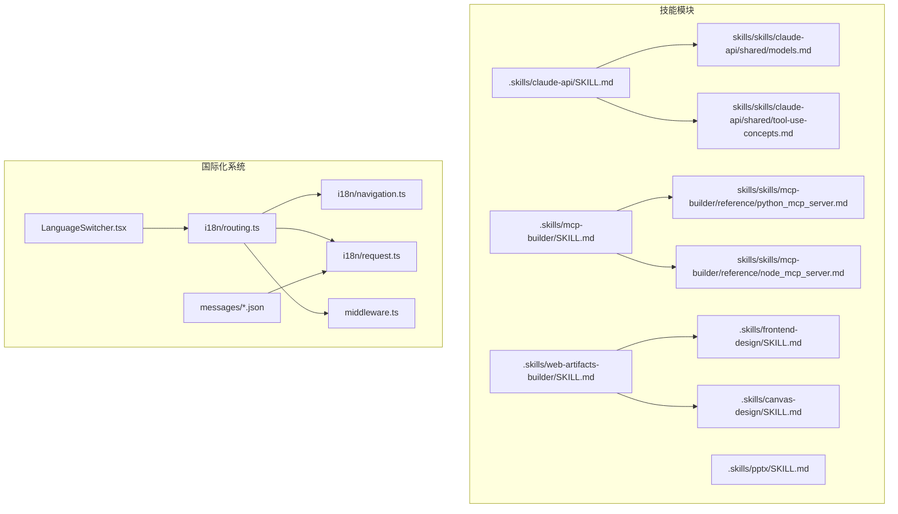
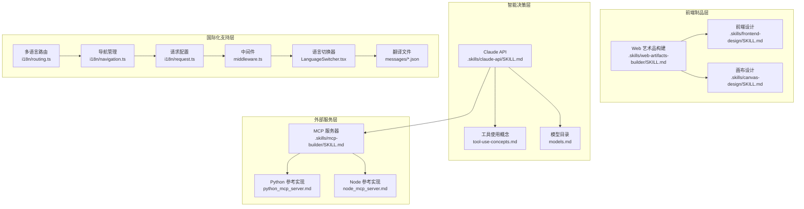
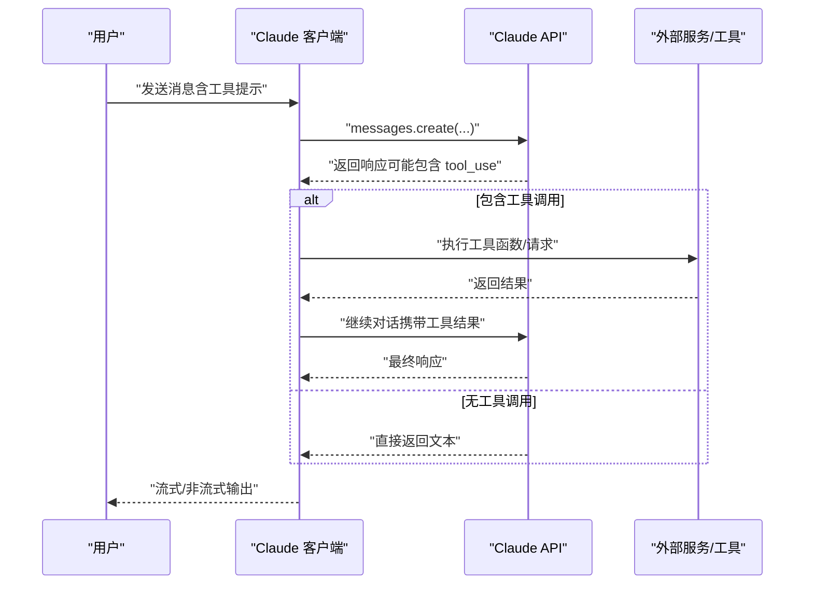
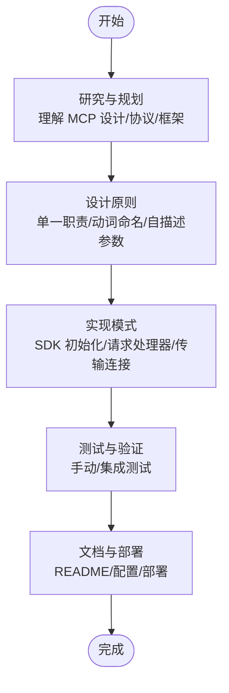
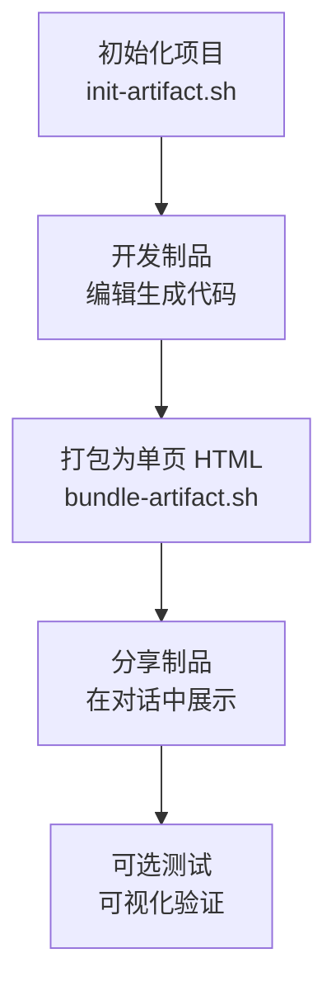
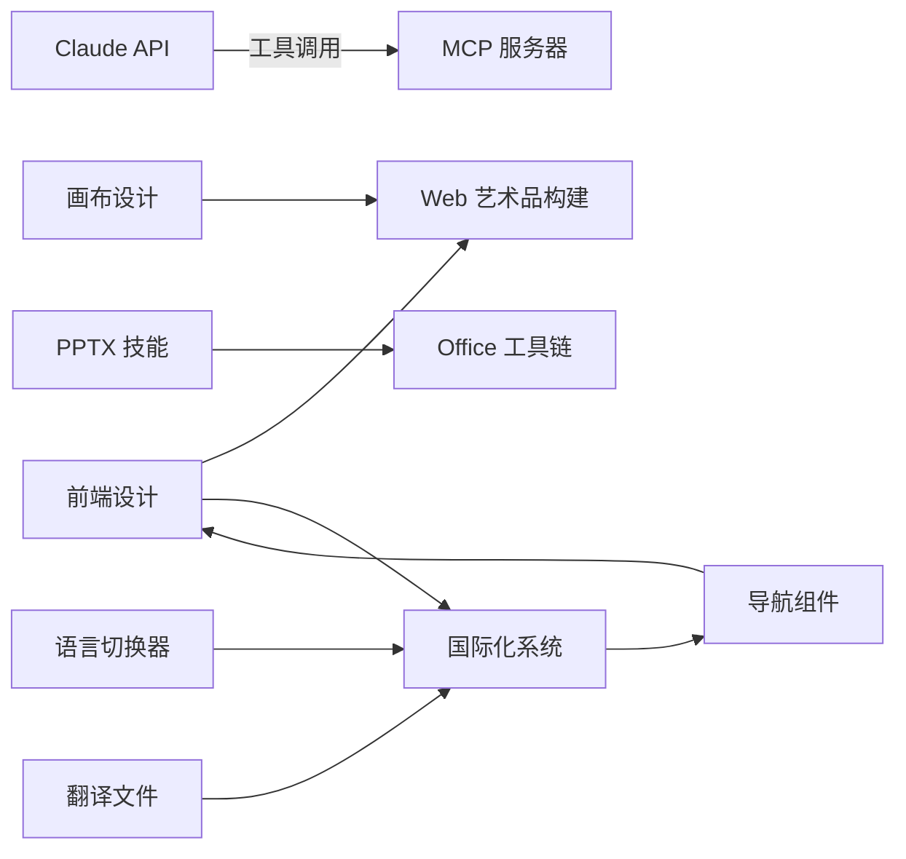

# 技术开发技能

<cite>
**本文引用的文件**
- [.skills/claude-api/SKILL.md](file://.skills/claude-api/SKILL.md)
- [skills/skills/claude-api/shared/models.md](file://skills/skills/claude-api/shared/models.md)
- [skills/skills/claude-api/shared/tool-use-concepts.md](file://skills/skills/claude-api/shared/tool-use-concepts.md)
- [.skills/mcp-builder/SKILL.md](file://.skills/mcp-builder/SKILL.md)
- [skills/skills/mcp-builder/reference/python_mcp_server.md](file://skills/skills/mcp-builder/reference/python_mcp_server.md)
- [skills/skills/mcp-builder/reference/node_mcp_server.md](file://skills/skills/mcp-builder/reference/node_mcp_server.md)
- [.skills/web-artifacts-builder/SKILL.md](file://.skills/web-artifacts-builder/SKILL.md)
- [.skills/frontend-design/SKILL.md](file://.skills/frontend-design/SKILL.md)
- [.skills/canvas-design/SKILL.md](file://.skills/canvas-design/SKILL.md)
- [.skills/pptx/SKILL.md](file://.skills/pptx/SKILL.md)
- [src/i18n/routing.ts](file://src/i18n/routing.ts)
- [src/i18n/navigation.ts](file://src/i18n/navigation.ts)
- [src/i18n/request.ts](file://src/i18n/request.ts)
- [src/middleware.ts](file://src/middleware.ts)
- [src/components/layout/LanguageSwitcher.tsx](file://src/components/layout/LanguageSwitcher.tsx)
- [src/app/[locale]/layout.tsx](file://src/app/[locale]/layout.tsx)
- [src/app/layout.tsx](file://src/app/layout.tsx)
- [src/components/layout/Navbar.tsx](file://src/components/layout/Navbar.tsx)
- [src/messages/en.json](file://src/messages/en.json)
- [src/messages/fr.json](file://src/messages/fr.json)
- [src/messages/es.json](file://src/messages/es.json)
</cite>

## 更新摘要
**所做更改**
- 新增前端设计技能的国际化支持章节
- 添加多语言路由配置和实现细节
- 记录语言切换器组件的技术实现
- 更新翻译文件结构和内容组织
- 增强前端设计技能与国际化系统的集成说明

## 目录
1. [引言](#引言)
2. [项目结构](#项目结构)
3. [核心组件](#核心组件)
4. [架构总览](#架构总览)
5. [详细组件分析](#详细组件分析)
6. [国际化支持系统](#国际化支持系统)
7. [依赖关系分析](#依赖关系分析)
8. [性能考量](#性能考量)
9. [故障排查指南](#故障排查指南)
10. [结论](#结论)
11. [附录](#附录)

## 引言
本文件面向"技术开发技能"模块，系统化梳理三类关键技术能力：Claude API 的应用与工具使用、MCP（Model Context Protocol）服务器的构建与部署、以及 Web 前端产物的生成与打包。**更新版本**特别增强了前端设计技能的国际化支持，包括多语言路由、语言切换器组件、以及英语、法语、西班牙语的完整翻译文件。文档以仓库中的技能说明与参考文档为依据，结合接口与流程图，帮助初学者快速上手，同时为有经验的开发者提供实现细节、最佳实践与排错建议。

## 项目结构
该仓库采用"技能即知识单元"的组织方式，每个技能由独立的 SKILL.md 文件定义触发条件、默认行为、语言检测策略、核心能力与参考资料；部分技能还包含语言特定的实现指南或参考实现。围绕本次目标涉及的关键技能如下：
- Claude API 技能：定义默认模型、消息 API、流式传输、工具使用、思维模式等
- MCP 构建技能：定义设计原则、实现模式、测试验证与部署要点
- Web 艺术品构建技能：前端工程初始化、打包成单页 HTML、样式与组件规范
- 前端设计与画布设计：前端美学与视觉风格指导、画布艺术创作流程
- PPTX 技能：读取/解析/编辑/创建/转换为图片等全流程
- **国际化支持系统**：多语言路由配置、语言切换器组件、翻译文件管理

**图表来源**
- [.skills/claude-api/SKILL.md:1-165](file://.skills/claude-api/SKILL.md#L1-L165)
- [skills/skills/claude-api/shared/models.md:1-69](file://skills/skills/claude-api/shared/models.md#L1-L69)
- [skills/skills/claude-api/shared/tool-use-concepts.md:1-306](file://skills/skills/claude-api/shared/tool-use-concepts.md#L1-L306)
- [.skills/mcp-builder/SKILL.md:1-209](file://.skills/mcp-builder/SKILL.md#L1-L209)
- [skills/skills/mcp-builder/reference/python_mcp_server.md](file://skills/skills/mcp-builder/reference/python_mcp_server.md)
- [skills/skills/mcp-builder/reference/node_mcp_server.md](file://skills/skills/mcp-builder/reference/node_mcp_server.md)
- [.skills/web-artifacts-builder/SKILL.md:1-75](file://.skills/web-artifacts-builder/SKILL.md#L1-L75)
- [.skills/frontend-design/SKILL.md:1-43](file://.skills/frontend-design/SKILL.md#L1-L43)
- [.skills/canvas-design/SKILL.md:1-121](file://.skills/canvas-design/SKILL.md#L1-L121)
- [.skills/pptx/SKILL.md:1-190](file://.skills/pptx/SKILL.md#L1-L190)
- [src/i18n/routing.ts:1-8](file://src/i18n/routing.ts#L1-L8)
- [src/i18n/navigation.ts:1-6](file://src/i18n/navigation.ts#L1-L6)
- [src/i18n/request.ts:1-16](file://src/i18n/request.ts#L1-L16)
- [src/middleware.ts:1-9](file://src/middleware.ts#L1-L9)
- [src/components/layout/LanguageSwitcher.tsx:1-41](file://src/components/layout/LanguageSwitcher.tsx#L1-L41)
- [src/messages/en.json:1-317](file://src/messages/en.json#L1-L317)
- [src/messages/fr.json:1-317](file://src/messages/fr.json#L1-L317)
- [src/messages/es.json:1-317](file://src/messages/es.json#L1-L317)

**章节来源**
- [.skills/claude-api/SKILL.md:1-165](file://.skills/claude-api/SKILL.md#L1-L165)
- [.skills/mcp-builder/SKILL.md:1-209](file://.skills/mcp-builder/SKILL.md#L1-L209)
- [.skills/web-artifacts-builder/SKILL.md:1-75](file://.skills/web-artifacts-builder/SKILL.md#L1-L75)
- [.skills/frontend-design/SKILL.md:1-43](file://.skills/frontend-design/SKILL.md#L1-L43)
- [.skills/canvas-design/SKILL.md:1-121](file://.skills/canvas-design/SKILL.md#L1-L121)
- [.skills/pptx/SKILL.md:1-190](file://.skills/pptx/SKILL.md#L1-L190)
- [src/i18n/routing.ts:1-8](file://src/i18n/routing.ts#L1-L8)
- [src/i18n/navigation.ts:1-6](file://src/i18n/navigation.ts#L1-L6)
- [src/i18n/request.ts:1-16](file://src/i18n/request.ts#L1-L16)
- [src/middleware.ts:1-9](file://src/middleware.ts#L1-L9)
- [src/components/layout/LanguageSwitcher.tsx:1-41](file://src/components/layout/LanguageSwitcher.tsx#L1-L41)
- [src/messages/en.json:1-317](file://src/messages/en.json#L1-L317)
- [src/messages/fr.json:1-317](file://src/messages/fr.json#L1-L317)
- [src/messages/es.json:1-317](file://src/messages/es.json#L1-L317)

## 核心组件
本节聚焦三大能力域的"组件"与"能力边界"，并给出与仓库文档对应的实现要点与接口约束。

- Claude API 组件
  - 默认模型与参数：默认使用 Claude Opus 4.6（别名），启用自适应思维模式，长输出默认开启流式传输
  - 消息 API：支持基础对话、流式响应、工具使用、思维模式扩展
  - 工具使用概念：用户自定义工具、工具选择策略、工具运行器与手动循环、服务端工具（代码执行、网络搜索/抓取）、结构化输出
  - 模型目录：提供可选模型别名与状态说明，避免拼写错误导致的 API 错误

- MCP 服务器组件
  - 设计原则：单一职责、动词命名、自描述参数、可操作错误信息、输入校验与鉴权限流
  - 实现模式：TypeScript SDK 示例（stdio/HTTP 传输），工具注册与请求处理
  - 测试与验证：手动测试、集成测试、错误路径覆盖
  - 部署与文档：README、工具示例、配置项、运维监控

- Web 艺术品构建组件
  - 工程初始化：脚本生成 React + TS + Vite + Tailwind + shadcn/ui 环境
  - 打包流程：Parcel + html-inline 将多文件应用打包为单 HTML，内联资源
  - 分享与可选测试：在对话中直接作为制品分享，必要时再进行可视化验证

- **国际化支持组件**
  - **多语言路由配置**：支持英语、法语、西班牙语、中文的路由定义与默认语言设置
  - **语言切换器**：客户端组件，提供直观的语言切换界面与状态管理
  - **翻译文件管理**：完整的 JSON 翻译文件，涵盖元数据、导航、产品信息等各个模块
  - **中间件集成**：全局中间件处理语言检测与路由匹配

**章节来源**
- [.skills/claude-api/SKILL.md:11-165](file://.skills/claude-api/SKILL.md#L11-L165)
- [skills/skills/claude-api/shared/models.md:1-69](file://skills/skills/claude-api/shared/models.md#L1-L69)
- [skills/skills/claude-api/shared/tool-use-concepts.md:1-306](file://skills/skills/claude-api/shared/tool-use-concepts.md#L1-L306)
- [.skills/mcp-builder/SKILL.md:1-209](file://.skills/mcp-builder/SKILL.md#L1-L209)
- [.skills/web-artifacts-builder/SKILL.md:1-75](file://.skills/web-artifacts-builder/SKILL.md#L1-L75)
- [src/i18n/routing.ts:1-8](file://src/i18n/routing.ts#L1-L8)
- [src/components/layout/LanguageSwitcher.tsx:1-41](file://src/components/layout/LanguageSwitcher.tsx#L1-L41)
- [src/messages/en.json:1-317](file://src/messages/en.json#L1-L317)

## 架构总览
下图展示三类技能在典型工作流中的交互关系与数据流向：前端制品构建用于承载 MCP 工具的可视化演示；Claude API 提供智能决策与工具调用；MCP 服务器作为外部服务的"工具面"，被 Claude 或前端制品通过协议访问。**更新版本**增加了国际化支持系统的架构展示。

**图表来源**
- [.skills/web-artifacts-builder/SKILL.md:1-75](file://.skills/web-artifacts-builder/SKILL.md#L1-L75)
- [.skills/frontend-design/SKILL.md:1-43](file://.skills/frontend-design/SKILL.md#L1-L43)
- [.skills/canvas-design/SKILL.md:1-121](file://.skills/canvas-design/SKILL.md#L1-L121)
- [.skills/claude-api/SKILL.md:1-165](file://.skills/claude-api/SKILL.md#L1-L165)
- [skills/skills/claude-api/shared/tool-use-concepts.md:1-306](file://skills/skills/claude-api/shared/tool-use-concepts.md#L1-L306)
- [skills/skills/claude-api/shared/models.md:1-69](file://skills/skills/claude-api/shared/models.md#L1-L69)
- [.skills/mcp-builder/SKILL.md:1-209](file://.skills/mcp-builder/SKILL.md#L1-L209)
- [skills/skills/mcp-builder/reference/python_mcp_server.md](file://skills/skills/mcp-builder/reference/python_mcp_server.md)
- [skills/skills/mcp-builder/reference/node_mcp_server.md](file://skills/skills/mcp-builder/reference/node_mcp_server.md)
- [src/i18n/routing.ts:1-8](file://src/i18n/routing.ts#L1-L8)
- [src/i18n/navigation.ts:1-6](file://src/i18n/navigation.ts#L1-L6)
- [src/i18n/request.ts:1-16](file://src/i18n/request.ts#L1-L16)
- [src/middleware.ts:1-9](file://src/middleware.ts#L1-L9)
- [src/components/layout/LanguageSwitcher.tsx:1-41](file://src/components/layout/LanguageSwitcher.tsx#L1-L41)
- [src/messages/en.json:1-317](file://src/messages/en.json#L1-L317)

## 详细组件分析

### Claude API：消息、流式传输与工具使用
- 触发条件与默认行为
  - 当代码导入 Anthropic SDK 或用户明确要求使用 Claude API/Agent SDK 时触发
  - 默认模型为 Claude Opus 4.6（别名），复杂任务默认启用自适应思维模式，长输入/输出默认流式传输
- 接口与参数
  - 消息 API：模型、最大输出令牌、消息数组
  - 流式传输：基于上下文管理器的文本流式迭代
  - 工具使用：工具列表（名称、描述、输入 JSON Schema），工具选择策略（自动/任意/指定/禁用）
  - 思维模式：启用/自适应模式与预算令牌
- 处理逻辑与最佳实践
  - 长输出优先使用流式传输，避免超时
  - 对复杂任务启用自适应思维模式
  - 正确处理工具循环：当出现暂停继续场景时，按协议重放消息并继续
  - 结构化输出：通过 JSON 输出格式与严格工具参数，确保可解析性
- 与其他组件的关系
  - 与 MCP 服务器配合：Claude 通过工具调用访问 MCP 提供的服务
  - 与前端制品结合：前端制品可演示 MCP 工具的可用性与交互效果

**图表来源**
- [.skills/claude-api/SKILL.md:67-146](file://.skills/claude-api/SKILL.md#L67-L146)
- [skills/skills/claude-api/shared/tool-use-concepts.md:60-84](file://skills/skills/claude-api/shared/tool-use-concepts.md#L60-L84)

**章节来源**
- [.skills/claude-api/SKILL.md:11-165](file://.skills/claude-api/SKILL.md#L11-L165)
- [skills/skills/claude-api/shared/models.md:1-69](file://skills/skills/claude-api/shared/models.md#L1-L69)
- [skills/skills/claude-api/shared/tool-use-concepts.md:1-306](file://skills/skills/claude-api/shared/tool-use-concepts.md#L1-L306)

### MCP 服务器：设计、实现与部署
- 设计原则
  - 工具单一职责、动词命名、参数自描述、错误可操作、输入校验与鉴权限流
- 实现模式（TypeScript SDK）
  - 服务器初始化、能力声明（工具）、请求处理器（列举工具、调用工具）、传输连接（stdio/HTTP）
  - 工具输入 JSON Schema 与示例
- 测试与验证
  - 手动测试：简单查询、复杂多步工作流、边界与错误场景
  - 集成测试：与真实 MCP 客户端对接、工具发现、错误路径
- 部署与文档
  - stdio：可执行分发、包管理器
  - HTTP：云平台部署、鉴权、监控日志
- 与前端制品的关系
  - 前端制品可作为 MCP 工具的可视化演示与交互入口

**图表来源**
- [.skills/mcp-builder/SKILL.md:17-201](file://.skills/mcp-builder/SKILL.md#L17-L201)
- [skills/skills/mcp-builder/reference/python_mcp_server.md](file://skills/skills/mcp-builder/reference/python_mcp_server.md)
- [skills/skills/mcp-builder/reference/node_mcp_server.md](file://skills/skills/mcp-builder/reference/node_mcp_server.md)

**章节来源**
- [.skills/mcp-builder/SKILL.md:1-209](file://.skills/mcp-builder/SKILL.md#L1-L209)

### Web 艺术品构建：前端工程与打包
- 快速开始
  - 使用初始化脚本创建 React + TS + Vite + Tailwind + shadcn/ui 工程
  - 开发完成后使用打包脚本生成单 HTML 文件，内联所有资源
- 设计与风格
  - 避免"AI 呆滞风"，强调独特字体、主题色彩、动画与空间构成
- 与前端设计/画布设计协作
  - 前端设计提供美学指导，画布设计产出静态视觉作品，Web 构建将其转化为可交互的前端制品

**图表来源**
- [.skills/web-artifacts-builder/SKILL.md:9-71](file://.skills/web-artifacts-builder/SKILL.md#L9-L71)
- [.skills/frontend-design/SKILL.md:11-43](file://.skills/frontend-design/SKILL.md#L11-L43)
- [.skills/canvas-design/SKILL.md:94-121](file://.skills/canvas-design/SKILL.md#L94-L121)

**章节来源**
- [.skills/web-artifacts-builder/SKILL.md:1-75](file://.skills/web-artifacts-builder/SKILL.md#L1-L75)

### 前端设计与画布设计：美学与创作流程
- 前端设计
  - 明确目的、音调、约束与差异化定位，产出生产级、可记忆、有风格的界面
  - 关注排版、色彩与主题、动效、空间构成与背景细节
- 画布设计
  - 先创建"视觉哲学"，再以哲学为指导表达为 PDF/PNG
  - 强调极简或极繁的明确方向，避免通用 AI 风格

**章节来源**
- [.skills/frontend-design/SKILL.md:1-43](file://.skills/frontend-design/SKILL.md#L1-L43)
- [.skills/canvas-design/SKILL.md:1-121](file://.skills/canvas-design/SKILL.md#L1-L121)

### PPTX 技能：读取、编辑、创建与质量保障
- 快速参考
  - 文本提取、缩略图概览、原始 XML 解包
  - 模板分析、解包-修改-清理-打包的编辑流程
  - 从零创建（参考相关文档）
- 设计要点
  - 主题色板、主次强调色、深浅对比、视觉动机一致性
  - 版式布局、数据呈现、排版字号、间距与避免常见错误
- 质量保障
  - 内容 QA（文本提取核验）、视觉 QA（转图片后检查重叠/截断/对比度/占位符）
  - 验证闭环：生成→转图片→检查→修复→复验

**章节来源**
- [.skills/pptx/SKILL.md:1-190](file://.skills/pptx/SKILL.md#L1-L190)

## 国际化支持系统

### 多语言路由配置
系统采用 next-intl 框架实现完整的国际化支持，支持英语（en）、法语（fr）、西班牙语（es）、中文（zh）四种语言。

- **路由定义**：通过 `defineRouting` 函数配置支持的语言列表和默认语言
- **语言前缀**：使用 `as-needed` 策略，根据语言自动添加或省略前缀
- **默认语言**：设置英语为默认语言，确保未指定语言时的兼容性

**章节来源**
- [src/i18n/routing.ts:1-8](file://src/i18n/routing.ts#L1-L8)

### 语言切换器组件
LanguageSwitcher.tsx 是一个客户端组件，提供直观的语言切换功能：

- **状态管理**：使用 `useLocale`、`useRouter`、`usePathname` 钩子管理语言状态
- **界面设计**：按钮式界面，当前语言高亮显示，其他语言悬停效果
- **本地化标签**：支持英文（EN）、法文（FR）、西班牙文（ES）、中文（中）标签
- **交互逻辑**：点击切换语言，保持当前路径不变

**章节来源**
- [src/components/layout/LanguageSwitcher.tsx:1-41](file://src/components/layout/LanguageSwitcher.tsx#L1-L41)

### 翻译文件管理
系统提供完整的多语言翻译文件，涵盖网站的所有文本内容：

- **文件结构**：每个语言对应一个 JSON 文件（en.json、fr.json、es.json）
- **内容组织**：按功能模块分类（Metadata、Navbar、Hero、ProductLineup 等）
- **元数据支持**：包含 SEO 元数据、页面标题、描述等
- **导航支持**：导航栏链接文本的本地化
- **产品信息**：产品规格、优势、价格等详细信息的多语言支持

**章节来源**
- [src/messages/en.json:1-317](file://src/messages/en.json#L1-L317)
- [src/messages/fr.json:1-317](file://src/messages/fr.json#L1-L317)
- [src/messages/es.json:1-317](file://src/messages/es.json#L1-L317)

### 中间件集成
middleware.ts 实现全局国际化中间件：

- **路由匹配**：匹配根路径、带语言前缀的路径、以及静态资源
- **语言检测**：自动检测请求语言，支持 API 路径和静态资源
- **性能优化**：排除不必要的路径，提高中间件执行效率

**章节来源**
- [src/middleware.ts:1-9](file://src/middleware.ts#L1-L9)

### 应用布局集成
国际化系统与应用布局深度集成：

- **客户端提供者**：NextIntlClientProvider 提供国际化上下文
- **服务端消息获取**：getMessages 获取当前语言的消息
- **元数据生成**：动态生成多语言元数据和 Open Graph 标签
- **静态参数生成**：为每种语言生成静态路由参数

**章节来源**
- [src/app/[locale]/layout.tsx:1-73](file://src/app/[locale]/layout.tsx#L1-L73)
- [src/app/layout.tsx:1-36](file://src/app/layout.tsx#L1-L36)
- [src/components/layout/Navbar.tsx:1-76](file://src/components/layout/Navbar.tsx#L1-L76)

## 依赖关系分析
- Claude API 与 MCP 服务器
  - Claude 通过工具调用访问 MCP 服务器提供的服务；MCP 服务器负责实现具体业务能力
- Web 艺术品构建与前端设计/画布设计
  - 前端设计提供风格与排版指导，画布设计提供静态视觉范式，Web 构建将二者整合为可交互制品
- PPTX 技能与 Office 生态
  - 依赖 Python 生态工具链（如标记提取、缩略图、LibreOffice、Poppler）进行内容读取与可视化验证
- **国际化系统与前端设计**
  - 前端设计技能与国际化系统协同工作，确保设计元素与多语言内容的完美结合
  - 语言切换器组件为前端设计提供动态语言支持
  - 翻译文件为前端设计提供本地化的文本内容

**图表来源**
- [.skills/claude-api/SKILL.md:1-165](file://.skills/claude-api/SKILL.md#L1-L165)
- [.skills/mcp-builder/SKILL.md:1-209](file://.skills/mcp-builder/SKILL.md#L1-L209)
- [.skills/web-artifacts-builder/SKILL.md:1-75](file://.skills/web-artifacts-builder/SKILL.md#L1-L75)
- [.skills/frontend-design/SKILL.md:1-43](file://.skills/frontend-design/SKILL.md#L1-L43)
- [.skills/canvas-design/SKILL.md:1-121](file://.skills/canvas-design/SKILL.md#L1-L121)
- [.skills/pptx/SKILL.md:1-190](file://.skills/pptx/SKILL.md#L1-L190)
- [src/i18n/routing.ts:1-8](file://src/i18n/routing.ts#L1-L8)
- [src/components/layout/LanguageSwitcher.tsx:1-41](file://src/components/layout/LanguageSwitcher.tsx#L1-L41)
- [src/messages/en.json:1-317](file://src/messages/en.json#L1-L317)

## 性能考量
- Claude API
  - 长输出优先流式传输，降低超时风险；合理设置最大输出令牌与思维预算
  - 工具循环中避免无限重试，设置最大续传次数
- MCP 服务器
  - 输入校验与鉴权限流，减少无效请求；工具命名与描述清晰，提升发现效率
- Web 艺术品构建
  - 打包前优化资源与依赖，避免冗余；内联策略与缓存策略平衡加载速度与体积
- PPTX
  - 大文件转图片时控制分辨率与数量，避免内存压力
- **国际化系统**
  - 翻译文件按需加载，避免一次性加载所有语言文件
  - 语言切换时保持路由状态，减少页面重新渲染
  - 中间件预过滤不需要国际化的路径，提高整体性能

## 故障排查指南
- Claude API
  - 模型 ID 不正确：使用模型目录中的别名，避免拼写错误
  - 工具循环卡住：检查是否正确回传工具结果并继续对话；遇到暂停继续场景按协议重放消息
  - 结构化输出不匹配：检查 JSON Schema 支持范围与首次编译延迟
- MCP 服务器
  - 工具未发现：确认工具注册与请求处理器已正确实现
  - 错误处理不当：提供可操作的错误信息与下一步建议
- Web 艺术品构建
  - 打包失败：检查入口 HTML 是否存在、路径别名配置是否正确
  - 制品不可交互：确认内联资源完整且无跨域问题
- PPTX
  - 文本缺失/占位符残留：使用文本提取工具核验；转图片后检查重叠与截断
- **国际化系统**
  - 语言切换无效：检查 LanguageSwitcher 组件的路由配置和事件处理
  - 翻译文本缺失：确认翻译文件中对应键值是否存在，检查文件编码
  - 路由匹配问题：检查 middleware 的匹配规则和语言前缀配置
  - SEO 元数据错误：验证 generateMetadata 函数中的语言检测逻辑

**章节来源**
- [skills/skills/claude-api/shared/models.md:48-69](file://skills/skills/claude-api/shared/models.md#L48-L69)
- [skills/skills/claude-api/shared/tool-use-concepts.md:66-84](file://skills/skills/claude-api/shared/tool-use-concepts.md#L66-L84)
- [.skills/mcp-builder/SKILL.md:154-168](file://.skills/mcp-builder/SKILL.md#L154-L168)
- [.skills/web-artifacts-builder/SKILL.md:45-71](file://.skills/web-artifacts-builder/SKILL.md#L45-L71)
- [.skills/pptx/SKILL.md:135-171](file://.skills/pptx/SKILL.md#L135-L171)
- [src/components/layout/LanguageSwitcher.tsx:19-21](file://src/components/layout/LanguageSwitcher.tsx#L19-L21)
- [src/i18n/request.ts:7-9](file://src/i18n/request.ts#L7-L9)
- [src/middleware.ts:6-8](file://src/middleware.ts#L6-L8)

## 结论
本技能模块围绕 Claude API、MCP 服务器与 Web 艺术品构建形成完整的"智能决策-外部服务-前端展示"闭环。**更新版本**特别增强了前端设计技能的国际化支持，通过多语言路由配置、语言切换器组件、翻译文件管理等系统化实现，为全球用户提供本地化的优质体验。通过遵循默认参数与最佳实践、严格的设计与实现原则、完善的测试与部署流程，可在不同语言与平台上高效交付高质量的 LLM 应用与工具服务。前端与设计技能则为最终制品提供优秀的用户体验与视觉表现，而国际化系统确保了全球化业务的顺利开展。

## 附录
- 参考资料
  - Claude API 技能与模型目录、工具使用概念
  - MCP 构建技能与参考实现
  - Web 艺术品构建与前端设计/画布设计
  - PPTX 技能与 Office 工具链
  - **国际化支持系统与前端设计技能**

**章节来源**
- [.skills/claude-api/SKILL.md:160-165](file://.skills/claude-api/SKILL.md#L160-L165)
- [skills/skills/claude-api/shared/models.md:1-69](file://skills/skills/claude-api/shared/models.md#L1-L69)
- [skills/skills/claude-api/shared/tool-use-concepts.md:293-306](file://skills/skills/claude-api/shared/tool-use-concepts.md#L293-L306)
- [.skills/mcp-builder/SKILL.md:204-209](file://.skills/mcp-builder/SKILL.md#L204-L209)
- [.skills/web-artifacts-builder/SKILL.md:72-75](file://.skills/web-artifacts-builder/SKILL.md#L72-L75)
- [.skills/frontend-design/SKILL.md:27-43](file://.skills/frontend-design/SKILL.md#L27-L43)
- [.skills/canvas-design/SKILL.md:75-121](file://.skills/canvas-design/SKILL.md#L75-L121)
- [.skills/pptx/SKILL.md:183-190](file://.skills/pptx/SKILL.md#L183-L190)
- [src/i18n/routing.ts:1-8](file://src/i18n/routing.ts#L1-L8)
- [src/components/layout/LanguageSwitcher.tsx:1-41](file://src/components/layout/LanguageSwitcher.tsx#L1-L41)
- [src/messages/en.json:1-317](file://src/messages/en.json#L1-L317)