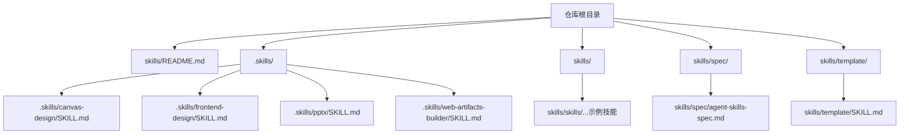
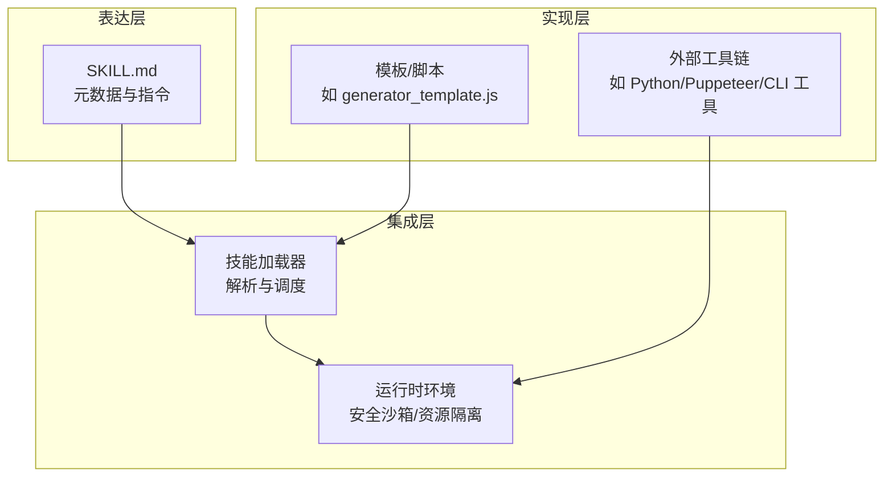
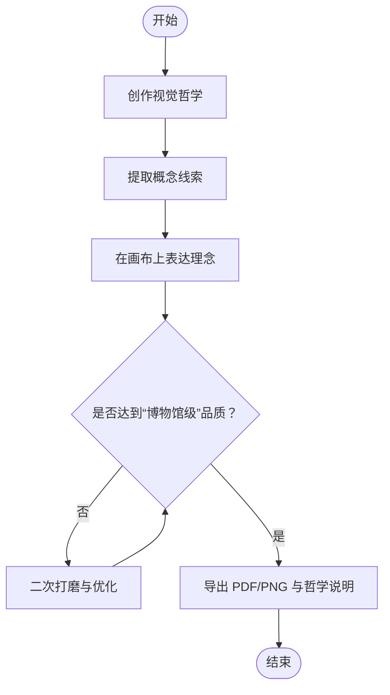
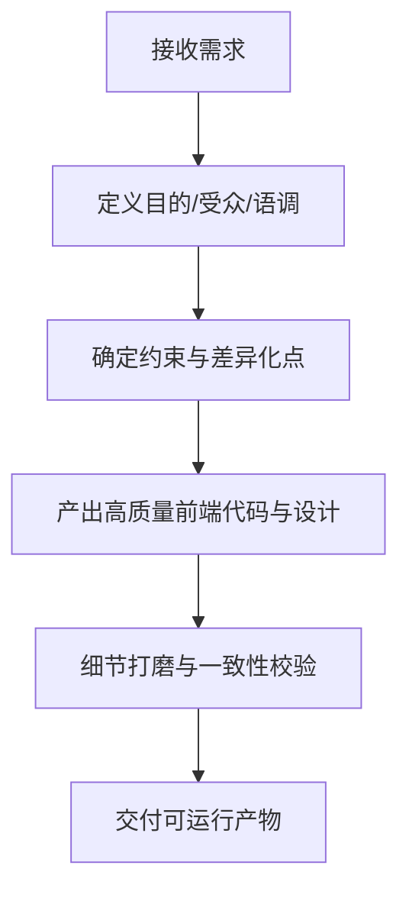
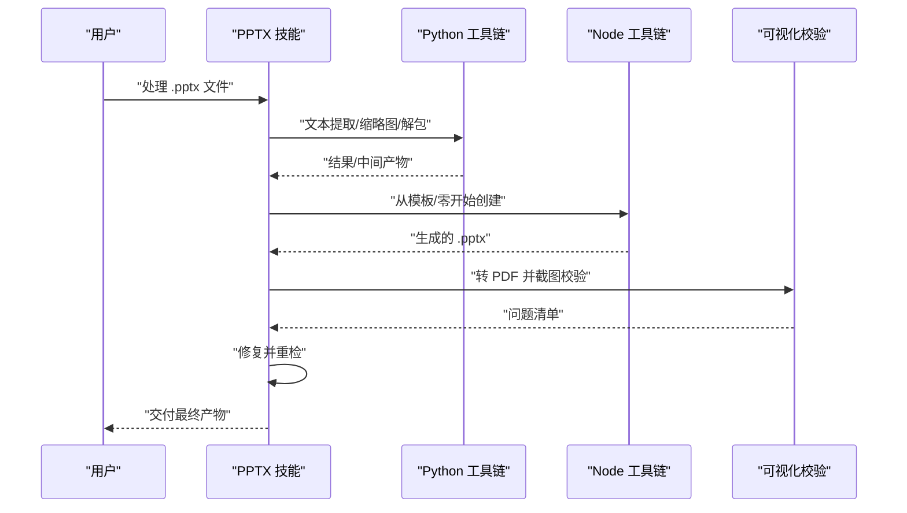
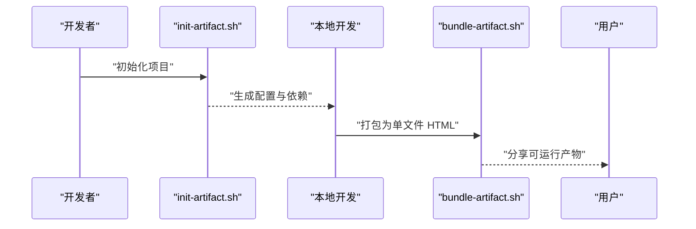
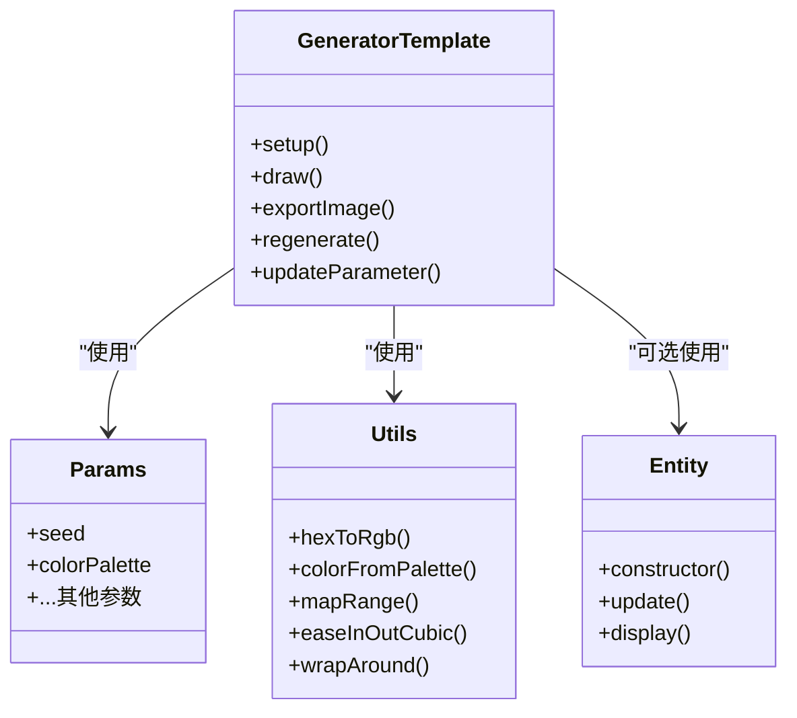
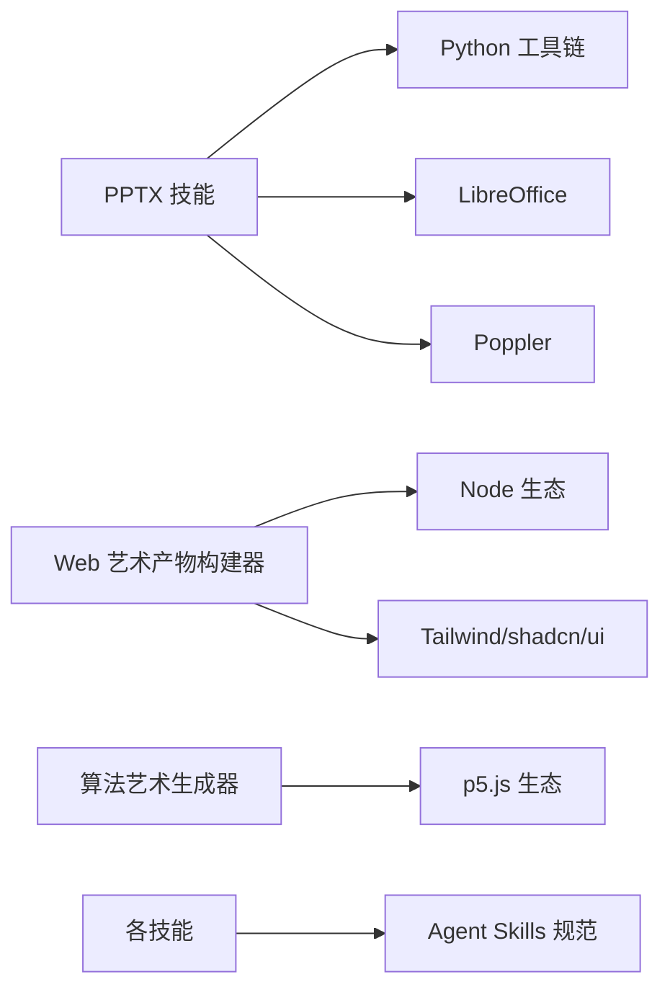

# 开发流程

<cite>
**本文引用的文件**
- [skills/README.md](file://skills/README.md)
- [.skills/canvas-design/SKILL.md](file://.skills/canvas-design/SKILL.md)
- [.skills/frontend-design/SKILL.md](file://.skills/frontend-design/SKILL.md)
- [.skills/pptx/SKILL.md](file://.skills/pptx/SKILL.md)
- [.skills/web-artifacts-builder/SKILL.md](file://.skills/web-artifacts-builder/SKILL.md)
- [skills/spec/agent-skills-spec.md](file://skills/spec/agent-skills-spec.md)
- [skills/template/SKILL.md](file://skills/template/SKILL.md)
- [skills/skills/algorithmic-art/templates/generator_template.js](file://skills/skills/algorithmic-art/templates/generator_template.js)
</cite>

## 目录
1. [引言](#引言)
2. [项目结构](#项目结构)
3. [核心组件](#核心组件)
4. [架构总览](#架构总览)
5. [详细组件分析](#详细组件分析)
6. [依赖分析](#依赖分析)
7. [性能考虑](#性能考虑)
8. [故障排查指南](#故障排查指南)
9. [结论](#结论)
10. [附录](#附录)

## 引言
本文件面向“技能开发流程”的系统化知识交付，覆盖从概念设计到实现完成的完整开发周期：需求分析、设计规划、编码实现、测试验证等阶段；解释技能架构的设计原则、模块化组织方式与跨技能集成方法；提供可操作的开发步骤、代码组织结构、文件命名规范、版本控制策略；并给出初学者循序渐进的学习路径与资深开发者的高效实践建议。

## 项目结构
该仓库以“技能”为中心进行模块化组织，每个技能是一个自包含的目录，内含描述性元数据文件（如 SKILL.md）与实现脚本/模板资源。顶层 README 提供使用入口与示例技能集合概览；.skills 与 skills/skills 下分别存放通用技能与示例技能，skills/spec 提供标准规范链接，skills/template 提供最小可用模板。

图表来源
- [skills/README.md:1-95](file://skills/README.md#L1-L95)
- [.skills/canvas-design/SKILL.md:1-121](file://.skills/canvas-design/SKILL.md#L1-L121)
- [.skills/frontend-design/SKILL.md:1-43](file://.skills/frontend-design/SKILL.md#L1-L43)
- [.skills/pptx/SKILL.md:1-190](file://.skills/pptx/SKILL.md#L1-L190)
- [.skills/web-artifacts-builder/SKILL.md:1-75](file://.skills/web-artifacts-builder/SKILL.md#L1-L75)
- [skills/spec/agent-skills-spec.md:1-4](file://skills/spec/agent-skills-spec.md#L1-L4)
- [skills/template/SKILL.md:1-7](file://skills/template/SKILL.md#L1-L7)

章节来源
- [skills/README.md:1-95](file://skills/README.md#L1-L95)

## 核心组件
- 技能元数据与说明：每个技能通过 SKILL.md 提供 YAML 前言与正文指令，定义名称、用途、示例与约束，作为 Claude 的行为边界与执行依据。
- 示例技能集：涵盖创意与设计、前端界面、演示文稿处理、Web 艺术产物构建、算法艺术生成等方向，体现不同任务域的实现模式与最佳实践。
- 规范与模板：skills/spec 指向官方 Agent Skills 规范；skills/template 提供最小可用模板，便于快速起步。

章节来源
- [skills/README.md:61-88](file://skills/README.md#L61-L88)
- [skills/spec/agent-skills-spec.md:1-4](file://skills/spec/agent-skills-spec.md#L1-L4)
- [skills/template/SKILL.md:1-7](file://skills/template/SKILL.md#L1-L7)

## 架构总览
技能体系采用“声明式指令 + 可选脚本/模板”的分层架构：
- 表达层：SKILL.md 中的 YAML 元数据与自然语言指令，明确技能目标、触发条件、输出格式与质量要求。
- 实现层：按需引入脚本、工具链或模板（如 p5.js 生成器模板），在受控环境中执行具体任务。
- 集成层：通过统一的技能接口与规范，支持在 Claude Code、Claude.ai、API 等多入口加载与调用。

图表来源
- [skills/skills/algorithmic-art/templates/generator_template.js:1-223](file://skills/skills/algorithmic-art/templates/generator_template.js#L1-L223)
- [skills/README.md:1-95](file://skills/README.md#L1-L95)

## 详细组件分析

### 组件一：画布设计技能（canvas-design）
- 设计理念：先产出“视觉哲学”，再将其转化为高视觉密度的单页 PDF 或 PNG 输出，强调极简文字与空间表达。
- 关键流程：
  1) 视觉哲学创作（宣言式描述，指导后续视觉表达）
  2) 概念线索提取（从用户输入中提炼微妙主题）
  3) 画布创作（单页/多页，严格版式与留白）
  4) 迭代优化（二次打磨，保持风格一致与极致工艺感）

图表来源
- [.skills/canvas-design/SKILL.md:9-121](file://.skills/canvas-design/SKILL.md#L9-L121)

章节来源
- [.skills/canvas-design/SKILL.md:1-121](file://.skills/canvas-design/SKILL.md#L1-L121)

### 组件二：前端设计技能（frontend-design）
- 设计思维：在编码前明确目的、语调、约束与差异化点，形成“大胆而有立场”的美学方向。
- 质量要求：避免“AI 呆板风”，追求可生产级别的界面，注重排版、配色、动效与空间构成。
- 执行要点：匹配实现复杂度与美学愿景，最大化细节与一致性。

图表来源
- [.skills/frontend-design/SKILL.md:1-43](file://.skills/frontend-design/SKILL.md#L1-L43)

章节来源
- [.skills/frontend-design/SKILL.md:1-43](file://.skills/frontend-design/SKILL.md#L1-L43)

### 组件三：PPTX 技能（pptx）
- 能力矩阵：读取/分析内容、编辑/修改、从零创建、模板复用、质量保障与转换输出。
- 工作流：分析模板 → 解包/编辑/打包 → 质量检查 → 可视化验证 → 导出图像或 PDF。
- 依赖与工具：Python 生态（markitdown、Pillow）、Node（pptxgenjs）、LibreOffice、Poppler。

图表来源
- [.skills/pptx/SKILL.md:1-190](file://.skills/pptx/SKILL.md#L1-L190)

章节来源
- [.skills/pptx/SKILL.md:1-190](file://.skills/pptx/SKILL.md#L1-L190)

### 组件四：Web 艺术产物构建器（web-artifacts-builder）
- 目标：基于现代前端技术栈（React/Tailwind/shadcn/ui）构建复杂 HTML 艺术产物。
- 流程：初始化项目 → 开发 → 打包为单文件 HTML → 展示给用户 → 可选测试。
- 技术栈：React 18 + TypeScript + Vite + Parcel（bundling）+ Tailwind CSS + shadcn/ui。

图表来源
- [.skills/web-artifacts-builder/SKILL.md:1-75](file://.skills/web-artifacts-builder/SKILL.md#L1-L75)

章节来源
- [.skills/web-artifacts-builder/SKILL.md:1-75](file://.skills/web-artifacts-builder/SKILL.md#L1-L75)

### 组件五：算法艺术生成器模板（algorithmic-art）
- 结构化最佳实践：参数集中管理、固定随机种子、生命周期组织、类结构、性能考量、工具函数、参数更新与常见模式。
- 适用场景：需要可重现、参数化、可交互的生成式艺术。

图表来源
- [skills/skills/algorithmic-art/templates/generator_template.js:1-223](file://skills/skills/algorithmic-art/templates/generator_template.js#L1-L223)

章节来源
- [skills/skills/algorithmic-art/templates/generator_template.js:1-223](file://skills/skills/algorithmic-art/templates/generator_template.js#L1-L223)

## 依赖分析
- 外部工具链依赖：不同技能对 Python、Node、LibreOffice、Poppler 等工具存在直接或间接依赖，应纳入环境准备与 CI/CD 管道。
- 语言与框架：前端技能偏向现代前端生态；算法艺术偏向 p5.js；文档类技能偏向 Office 生态工具。
- 规范一致性：所有技能遵循统一的 SKILL.md 元数据与指令格式，确保加载与执行的一致性。

图表来源
- [.skills/pptx/SKILL.md:183-190](file://.skills/pptx/SKILL.md#L183-L190)
- [.skills/web-artifacts-builder/SKILL.md:16-16](file://.skills/web-artifacts-builder/SKILL.md#L16-L16)
- [skills/spec/agent-skills-spec.md:1-4](file://skills/spec/agent-skills-spec.md#L1-L4)

章节来源
- [.skills/pptx/SKILL.md:183-190](file://.skills/pptx/SKILL.md#L183-L190)
- [.skills/web-artifacts-builder/SKILL.md:16-16](file://.skills/web-artifacts-builder/SKILL.md#L16-L16)
- [skills/spec/agent-skills-spec.md:1-4](file://skills/spec/agent-skills-spec.md#L1-L4)

## 性能考虑
- 生成式艺术：优先固定随机种子保证可重现；参数集中管理便于快速探索；合理拆分 update/display 逻辑；必要时预计算与缓存。
- 文档处理：批量任务建议流水线化，先做文本提取与结构分析，再进行可视化校验与导出，减少重复 IO。
- 前端产物：打包前移除 sourcemap 与冗余资源；按需引入组件库样式；在 CI 中进行体积与可访问性检查。

## 故障排查指南
- 内容完整性检查：使用文本提取工具核对输出内容，排除占位符残留与顺序错误。
- 视觉一致性检查：将输出转换为图像后进行人工巡检，关注元素重叠、溢出、间距不均、对比度不足等问题。
- 依赖缺失：确认 Python/Node/LibreOffice/Poppler 等工具已安装且版本满足技能要求。
- 可重现性问题：固定随机种子与参数快照，确保相同输入产生相同输出。

章节来源
- [.skills/pptx/SKILL.md:135-171](file://.skills/pptx/SKILL.md#L135-L171)

## 结论
本仓库提供了从创意到落地的技能开发范式：以 SKILL.md 明确目标与边界，结合模板与脚本实现具体功能，通过标准化流程与工具链保障质量与一致性。建议在团队内推广统一的模板与规范，持续沉淀跨技能的通用能力与最佳实践。

## 附录

### 开发步骤指导
- 需求分析：明确技能目标、触发条件、输出形态与质量门槛。
- 设计规划：选择合适的技术栈与工作流，制定验收标准与回退策略。
- 编码实现：遵循模板与规范，保持参数化与可重现性。
- 测试验证：自动化与人工巡检相结合，覆盖内容、布局与可访问性。
- 版本控制：以功能为单位提交，保留参数快照与变更日志，便于回溯与复现。

### 代码组织结构与命名规范
- 目录命名：使用小写与短横线分隔，清晰表达技能领域（如 canvas-design、frontend-design）。
- 元数据文件：统一使用 SKILL.md，包含 YAML 前言与自然语言指令。
- 资源文件：按功能分组（templates、scripts、assets），避免跨目录耦合。
- 脚本与工具：以可执行脚本形式提供，明确入参与输出约定。

### 版本控制策略
- 分支策略：主分支稳定发布，特性分支迭代；重要变更打标签。
- 提交规范：以“技能名/变更类型: 描述”格式，便于检索与审计。
- 依赖锁定：在 CI 中固定工具链版本，避免环境漂移。

### 开发环境搭建与调试技巧
- 环境准备：根据技能依赖安装 Python/Node/LibreOffice/Poppler 等工具。
- 调试建议：先做最小可行输出，逐步增加复杂度；使用参数快照与日志定位问题；在 CI 中模拟真实运行环境。