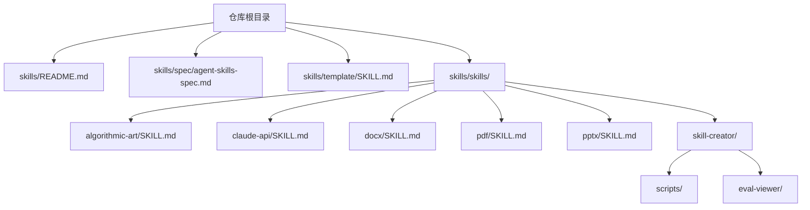
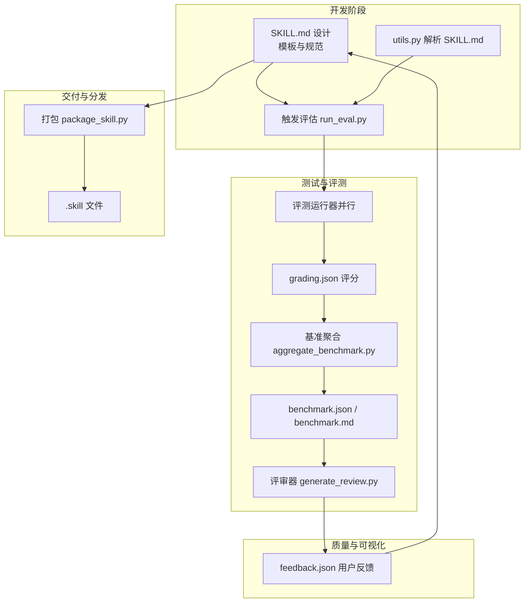
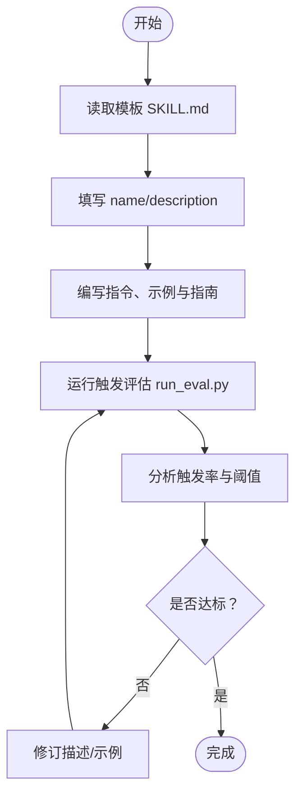
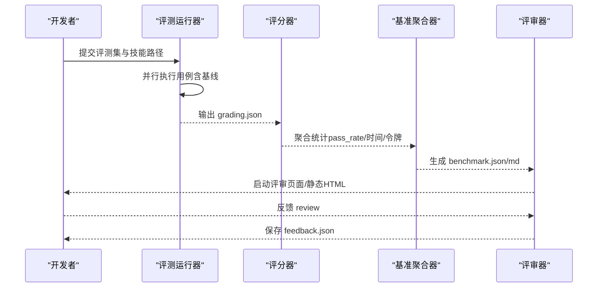
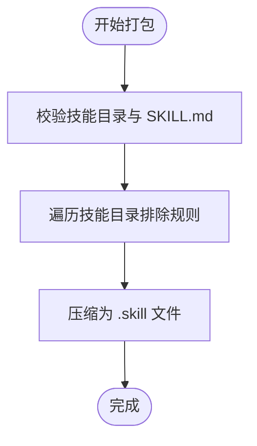
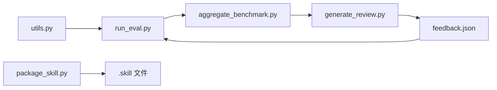

# 技能开发指南

<cite>
**本文档引用的文件**
- [skills/README.md](file://skills/README.md)
- [skills/spec/agent-skills-spec.md](file://skills/spec/agent-skills-spec.md)
- [skills/template/SKILL.md](file://skills/template/SKILL.md)
- [skills/skills/skill-creator/SKILL.md](file://skills/skills/skill-creator/SKILL.md)
- [skills/skills/skill-creator/scripts/package_skill.py](file://skills/skills/skill-creator/scripts/package_skill.py)
- [skills/skills/skill-creator/scripts/run_eval.py](file://skills/skills/skill-creator/scripts/run_eval.py)
- [skills/skills/skill-creator/scripts/aggregate_benchmark.py](file://skills/skills/skill-creator/scripts/aggregate_benchmark.py)
- [skills/skills/skill-creator/eval-viewer/generate_review.py](file://skills/skills/skill-creator/eval-viewer/generate_review.py)
- [skills/skills/skill-creator/scripts/utils.py](file://skills/skills/skill-creator/scripts/utils.py)
- [skills/skills/algorithmic-art/SKILL.md](file://skills/skills/algorithmic-art/SKILL.md)
- [skills/skills/claude-api/SKILL.md](file://skills/skills/claude-api/SKILL.md)
- [skills/skills/docx/SKILL.md](file://skills/skills/docx/SKILL.md)
- [skills/skills/pdf/SKILL.md](file://skills/skills/pdf/SKILL.md)
- [skills/skills/pptx/SKILL.md](file://skills/skills/pptx/SKILL.md)
</cite>

## 目录
1. [简介](#简介)
2. [项目结构](#项目结构)
3. [核心组件](#核心组件)
4. [架构总览](#架构总览)
5. [详细组件分析](#详细组件分析)
6. [依赖关系分析](#依赖关系分析)
7. [性能考虑](#性能考虑)
8. [故障排查指南](#故障排查指南)
9. [结论](#结论)
10. [附录](#附录)

## 简介
本指南面向希望基于 Anthropic 的 Agent Skills 标准进行技能开发与交付的工程师与产品团队。内容覆盖从“技能模板”到“开发最佳实践”、“测试与评测”、“部署与分发”的全流程，包含技能规范、配置参数清单、错误处理与性能优化建议，并提供从概念到实现的完整开发闭环（评估与质量保证）。既适合初学者循序渐进上手，也为有经验的开发者提供高级技巧与专家级使用方法。

## 项目结构
该仓库以“技能集合”为核心组织方式，每个技能是一个自包含的目录，包含描述文件 SKILL.md 以及可选的脚本、参考文档与资源。根目录下的 README 提供了总体说明与使用入口；spec 目录指向官方规范地址；template 目录提供最小可用模板。

图表来源
- [skills/README.md:1-95](file://skills/README.md#L1-L95)
- [skills/spec/agent-skills-spec.md:1-4](file://skills/spec/agent-skills-spec.md#L1-L4)
- [skills/template/SKILL.md:1-7](file://skills/template/SKILL.md#L1-L7)
- [skills/skills/algorithmic-art/SKILL.md:1-405](file://skills/skills/algorithmic-art/SKILL.md#L1-L405)
- [skills/skills/claude-api/SKILL.md:1-244](file://skills/skills/claude-api/SKILL.md#L1-L244)
- [skills/skills/docx/SKILL.md:1-591](file://skills/skills/docx/SKILL.md#L1-L591)
- [skills/skills/pdf/SKILL.md:1-315](file://skills/skills/pdf/SKILL.md#L1-L315)
- [skills/skills/pptx/SKILL.md:1-233](file://skills/skills/pptx/SKILL.md#L1-L233)

章节来源
- [skills/README.md:1-95](file://skills/README.md#L1-L95)
- [skills/spec/agent-skills-spec.md:1-4](file://skills/spec/agent-skills-spec.md#L1-L4)
- [skills/template/SKILL.md:1-7](file://skills/template/SKILL.md#L1-L7)

## 核心组件
- 技能模板：提供最小化 SKILL.md 模板，包含 name 与 description 前言字段，便于快速起步。
- 触发与描述优化：通过触发评估脚本对技能描述进行量化评估，迭代优化触发准确率。
- 测试与评测：提供评测运行器、基准聚合器与可视化评审器，形成“生成结果→评分→对比→反馈→改进”的闭环。
- 打包与分发：提供 .skill 文件打包工具，支持排除构建产物与敏感文件，便于在不同平台安装与分发。
- 示例技能：涵盖算法艺术、Claude API 使用、文档（docx）、PDF、PPTX 等典型场景，作为最佳实践参考。

章节来源
- [skills/template/SKILL.md:1-7](file://skills/template/SKILL.md#L1-L7)
- [skills/skills/skill-creator/SKILL.md:1-486](file://skills/skills/skill-creator/SKILL.md#L1-L486)
- [skills/skills/skill-creator/scripts/run_eval.py:1-311](file://skills/skills/skill-creator/scripts/run_eval.py#L1-L311)
- [skills/skills/skill-creator/scripts/aggregate_benchmark.py:1-402](file://skills/skills/skill-creator/scripts/aggregate_benchmark.py#L1-L402)
- [skills/skills/skill-creator/eval-viewer/generate_review.py:1-472](file://skills/skills/skill-creator/eval-viewer/generate_review.py#L1-L472)
- [skills/skills/skill-creator/scripts/package_skill.py:1-137](file://skills/skills/skill-creator/scripts/package_skill.py#L1-L137)

## 架构总览
下图展示了从“技能设计—开发—测试—评审—打包—分发”的端到端流程，以及各工具之间的协作关系。

图表来源
- [skills/skills/skill-creator/scripts/run_eval.py:1-311](file://skills/skills/skill-creator/scripts/run_eval.py#L1-L311)
- [skills/skills/skill-creator/scripts/utils.py:1-48](file://skills/skills/skill-creator/scripts/utils.py#L1-L48)
- [skills/skills/skill-creator/scripts/aggregate_benchmark.py:1-402](file://skills/skills/skill-creator/scripts/aggregate_benchmark.py#L1-L402)
- [skills/skills/skill-creator/eval-viewer/generate_review.py:1-472](file://skills/skills/skill-creator/eval-viewer/generate_review.py#L1-L472)
- [skills/skills/skill-creator/scripts/package_skill.py:1-137](file://skills/skills/skill-creator/scripts/package_skill.py#L1-L137)

## 详细组件分析

### 组件一：技能模板与规范
- 模板文件提供最小化 frontmatter（name、description）与指令区，确保新技能快速具备可触发性与可读性。
- 触发描述优化：通过 run_eval.py 对技能描述进行触发率评估，支持多查询并发、阈值判定与统计输出，帮助提升触发准确性。

图表来源
- [skills/template/SKILL.md:1-7](file://skills/template/SKILL.md#L1-L7)
- [skills/skills/skill-creator/scripts/run_eval.py:1-311](file://skills/skills/skill-creator/scripts/run_eval.py#L1-L311)

章节来源
- [skills/template/SKILL.md:1-7](file://skills/template/SKILL.md#L1-L7)
- [skills/skills/skill-creator/scripts/run_eval.py:1-311](file://skills/skills/skill-creator/scripts/run_eval.py#L1-L311)

### 组件二：评测与评审系统
- 评测运行器：支持并行执行多个评测用例，记录每次运行的 token 与耗时，产出 timing.json。
- 基准聚合器：汇总各配置（如 with_skill vs baseline）的 pass_rate、时间与 token 统计，计算均值、标准差与差异。
- 评审器：扫描工作空间，内嵌所有输出与评分，启动本地 HTTP 服务或生成静态页面，支持用户反馈收集与对比上次迭代。

图表来源
- [skills/skills/skill-creator/scripts/aggregate_benchmark.py:1-402](file://skills/skills/skill-creator/scripts/aggregate_benchmark.py#L1-L402)
- [skills/skills/skill-creator/eval-viewer/generate_review.py:1-472](file://skills/skills/skill-creator/eval-viewer/generate_review.py#L1-L472)

章节来源
- [skills/skills/skill-creator/scripts/aggregate_benchmark.py:1-402](file://skills/skills/skill-creator/scripts/aggregate_benchmark.py#L1-L402)
- [skills/skills/skill-creator/eval-viewer/generate_review.py:1-472](file://skills/skills/skill-creator/eval-viewer/generate_review.py#L1-L472)

### 组件三：打包与分发
- 打包器会校验 SKILL.md 存在性与有效性，自动排除缓存、构建产物与临时文件，生成 .skill 文件，便于在 Claude Code/插件市场或 API 中安装与使用。

图表来源
- [skills/skills/skill-creator/scripts/package_skill.py:1-137](file://skills/skills/skill-creator/scripts/package_skill.py#L1-L137)

章节来源
- [skills/skills/skill-creator/scripts/package_skill.py:1-137](file://skills/skills/skill-creator/scripts/package_skill.py#L1-L137)

### 组件四：示例技能参考
- 算法艺术：强调“过程优于产物”，提供哲学创作与 p5.js 实现的两阶段流程，包含模板与交互式查看器。
- Claude API：提供语言检测、表面选择决策树、模型与思考模式建议、错误处理与常见陷阱等。
- 文档（docx）：覆盖创建、编辑、验证、样式、表格、图片、页眉页脚、目录等关键点与注意事项。
- PDF：涵盖文本/表格提取、合并拆分、旋转、水印、OCR、表单填充、加密解密等常用操作。
- PPTX：提供读取、编辑、从零创建、设计要点、QA 流程与图像化验证方法。

章节来源
- [skills/skills/algorithmic-art/SKILL.md:1-405](file://skills/skills/algorithmic-art/SKILL.md#L1-L405)
- [skills/skills/claude-api/SKILL.md:1-244](file://skills/skills/claude-api/SKILL.md#L1-L244)
- [skills/skills/docx/SKILL.md:1-591](file://skills/skills/docx/SKILL.md#L1-L591)
- [skills/skills/pdf/SKILL.md:1-315](file://skills/skills/pdf/SKILL.md#L1-L315)
- [skills/skills/pptx/SKILL.md:1-233](file://skills/skills/pptx/SKILL.md#L1-L233)

## 依赖关系分析
- 工具链耦合：评测与评审依赖 utils.py 的 SKILL.md 解析能力；评审器依赖基准聚合器的统计结果；打包器依赖快速校验脚本。
- 外部依赖：示例技能涉及第三方库（如 docx、pypdf、pdfplumber、reportlab、pptxgenjs 等），需在目标环境中正确安装与配置。

图表来源
- [skills/skills/skill-creator/scripts/utils.py:1-48](file://skills/skills/skill-creator/scripts/utils.py#L1-L48)
- [skills/skills/skill-creator/scripts/run_eval.py:1-311](file://skills/skills/skill-creator/scripts/run_eval.py#L1-L311)
- [skills/skills/skill-creator/scripts/aggregate_benchmark.py:1-402](file://skills/skills/skill-creator/scripts/aggregate_benchmark.py#L1-L402)
- [skills/skills/skill-creator/eval-viewer/generate_review.py:1-472](file://skills/skills/skill-creator/eval-viewer/generate_review.py#L1-L472)
- [skills/skills/skill-creator/scripts/package_skill.py:1-137](file://skills/skills/skill-creator/scripts/package_skill.py#L1-L137)

章节来源
- [skills/skills/skill-creator/scripts/utils.py:1-48](file://skills/skills/skill-creator/scripts/utils.py#L1-L48)
- [skills/skills/skill-creator/scripts/run_eval.py:1-311](file://skills/skills/skill-creator/scripts/run_eval.py#L1-L311)
- [skills/skills/skill-creator/scripts/aggregate_benchmark.py:1-402](file://skills/skills/skill-creator/scripts/aggregate_benchmark.py#L1-L402)
- [skills/skills/skill-creator/eval-viewer/generate_review.py:1-472](file://skills/skills/skill-creator/eval-viewer/generate_review.py#L1-L472)
- [skills/skills/skill-creator/scripts/package_skill.py:1-137](file://skills/skills/skill-creator/scripts/package_skill.py#L1-L137)

## 性能考虑
- 触发评估：合理设置并发数与超时，避免过载；对长耗时任务启用流式输出与部分消息检测，缩短响应时间。
- 基准聚合：优先使用均值±标准差与差异指标，关注高方差评测项与时间/令牌权衡，识别不稳定因素。
- 评审器：在无显示环境使用静态输出模式，减少服务器开销；仅在需要时启动浏览器。
- 打包：严格排除无关文件，减小 .skill 包体积，提升加载速度。

## 故障排查指南
- 触发评估失败：检查命令文件写入权限、项目根目录探测逻辑与超时设置；确认描述中未包含非法字符。
- 评测运行异常：核对 grading.json 结构完整性与 timing.json 数据存在性；检查并行进程退出码与日志。
- 评审器无法访问：确认端口占用与静态输出模式；在无显示环境使用静态 HTML。
- 打包失败：确认 SKILL.md 存在且格式正确；检查排除规则是否误删必要资源。

章节来源
- [skills/skills/skill-creator/scripts/run_eval.py:1-311](file://skills/skills/skill-creator/scripts/run_eval.py#L1-L311)
- [skills/skills/skill-creator/scripts/aggregate_benchmark.py:1-402](file://skills/skills/skill-creator/scripts/aggregate_benchmark.py#L1-L402)
- [skills/skills/skill-creator/eval-viewer/generate_review.py:1-472](file://skills/skills/skill-creator/eval-viewer/generate_review.py#L1-L472)
- [skills/skills/skill-creator/scripts/package_skill.py:1-137](file://skills/skills/skill-creator/scripts/package_skill.py#L1-L137)

## 结论
通过模板化设计、自动化触发评估、系统化评测与评审、以及标准化打包与分发，本指南提供了从概念到落地的一体化技能开发方法论。建议团队在实践中坚持“先设计、再开发、后评测”的闭环流程，持续迭代描述与实现，确保技能在真实场景中的稳定性与可维护性。

## 附录

### 技能规范与配置参数清单
- 必填字段（SKILL.md 前言）
  - name：技能唯一标识（小写、连字符）
  - description：触发条件与功能说明（应包含何时触发的具体上下文）
- 可选字段（示例技能中常见）
  - license：许可证信息
  - compatibility：所需工具/依赖（较少见）
- 指令区建议
  - 指令、示例、指南三段式结构
  - 输出格式定义与示例
  - 边界条件与常见陷阱提示

章节来源
- [skills/template/SKILL.md:1-7](file://skills/template/SKILL.md#L1-L7)
- [skills/skills/algorithmic-art/SKILL.md:1-405](file://skills/skills/algorithmic-art/SKILL.md#L1-L405)
- [skills/skills/claude-api/SKILL.md:1-244](file://skills/skills/claude-api/SKILL.md#L1-L244)
- [skills/skills/docx/SKILL.md:1-591](file://skills/skills/docx/SKILL.md#L1-L591)
- [skills/skills/pdf/SKILL.md:1-315](file://skills/skills/pdf/SKILL.md#L1-L315)
- [skills/skills/pptx/SKILL.md:1-233](file://skills/skills/pptx/SKILL.md#L1-L233)

### 开发最佳实践
- 先“意图捕获”，再“草稿写作”，最后“测试与迭代”
- 保持指令简洁明确，避免过度约束；留出实现空间
- 将复杂参考文档按领域分层组织，减少一次性上下文负担
- 在评测中加入主观与客观双重指标，结合用户反馈持续优化

章节来源
- [skills/skills/skill-creator/SKILL.md:1-486](file://skills/skills/skill-creator/SKILL.md#L1-L486)

### 测试与调试方法
- 触发评估：run_eval.py 支持并发、阈值与多次运行取平均，输出 JSON 便于集成
- 基准聚合：aggregate_benchmark.py 自动解析 grading.json/timing.json，生成统计与对比
- 评审器：generate_review.py 支持动态刷新与静态导出，便于离线审阅
- 打包：package_skill.py 自动排除构建产物，生成 .skill 文件

章节来源
- [skills/skills/skill-creator/scripts/run_eval.py:1-311](file://skills/skills/skill-creator/scripts/run_eval.py#L1-L311)
- [skills/skills/skill-creator/scripts/aggregate_benchmark.py:1-402](file://skills/skills/skill-creator/scripts/aggregate_benchmark.py#L1-L402)
- [skills/skills/skill-creator/eval-viewer/generate_review.py:1-472](file://skills/skills/skill-creator/eval-viewer/generate_review.py#L1-L472)
- [skills/skills/skill-creator/scripts/package_skill.py:1-137](file://skills/skills/skill-creator/scripts/package_skill.py#L1-L137)

### 部署与分发策略
- 插件市场：在 Claude Code 中注册插件市场并安装技能集合
- API 安装：通过 Claude API 上传自定义技能
- 分发格式：.skill 文件，包含技能元数据与资源，便于跨平台复用

章节来源
- [skills/README.md:29-60](file://skills/README.md#L29-L60)