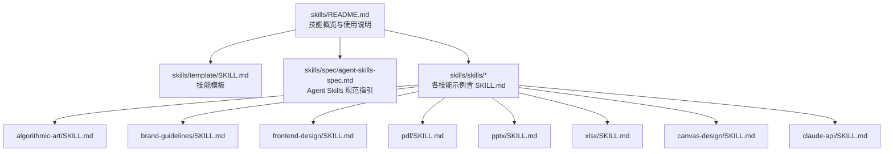
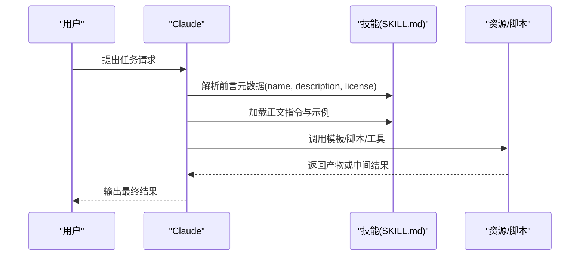
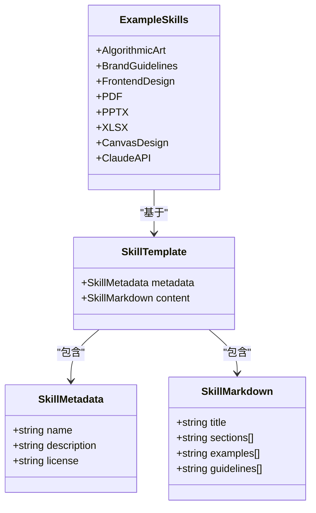
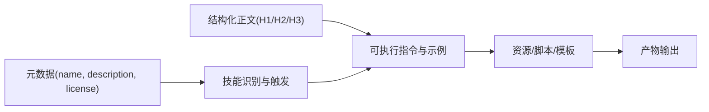

# 技能模板使用

<cite>
**本文引用的文件**
- [skills/README.md](file://skills/README.md)
- [skills/template/SKILL.md](file://skills/template/SKILL.md)
- [skills/spec/agent-skills-spec.md](file://skills/spec/agent-skills-spec.md)
- [skills/skills/algorithmic-art/SKILL.md](file://skills/skills/algorithmic-art/SKILL.md)
- [skills/skills/brand-guidelines/SKILL.md](file://skills/skills/brand-guidelines/SKILL.md)
- [skills/skills/frontend-design/SKILL.md](file://skills/skills/frontend-design/SKILL.md)
- [skills/skills/pdf/SKILL.md](file://skills/skills/pdf/SKILL.md)
- [skills/skills/pptx/SKILL.md](file://skills/skills/pptx/SKILL.md)
- [skills/skills/xlsx/SKILL.md](file://skills/skills/xlsx/SKILL.md)
- [skills/skills/canvas-design/SKILL.md](file://skills/skills/canvas-design/SKILL.md)
- [skills/skills/claude-api/SKILL.md](file://skills/skills/claude-api/SKILL.md)
</cite>

## 目录
1. [简介](#简介)
2. [项目结构](#项目结构)
3. [核心组件](#核心组件)
4. [架构总览](#架构总览)
5. [详细组件分析](#详细组件分析)
6. [依赖关系分析](#依赖关系分析)
7. [性能与可维护性建议](#性能与可维护性建议)
8. [故障排查指南](#故障排查指南)
9. [结论](#结论)
10. [附录：模板与最佳实践](#附录模板与最佳实践)

## 简介
本文件面向初学者与进阶用户，系统讲解“技能模板”的使用方法，重点围绕 SKILL.md 的结构、配置项、元数据规范、Markdown 写法与内容组织方式，并结合仓库中的多个真实技能示例，给出模板、范式与最佳实践，帮助你快速上手并高质量地创建可复用的技能。

## 项目结构
该仓库以“技能”为单位进行组织，每个技能位于独立目录中，包含：
- 指令与说明：SKILL.md（含 YAML 前言元数据）
- 资源与脚本：如模板、示例、工具脚本等
- 许可证与第三方声明：LICENSE.txt、THIRD_PARTY_NOTICES.md 等

图表来源
- [skills/README.md:1-95](file://skills/README.md#L1-L95)
- [skills/template/SKILL.md:1-7](file://skills/template/SKILL.md#L1-L7)
- [skills/spec/agent-skills-spec.md:1-4](file://skills/spec/agent-skills-spec.md#L1-L4)

章节来源
- [skills/README.md:12-27](file://skills/README.md#L12-L27)

## 核心组件
- 技能元数据（YAML 前言）
  - 必需字段：name、description
  - 可选字段：license 等
- Markdown 主体
  - 结构化标题层级、分节、列表、表格、代码块
  - 示例与指南分节，便于 Claude 理解触发条件与执行步骤
- 示例技能参考
  - 多个真实 SKILL.md 展示不同领域的写法与风格

章节来源
- [skills/README.md:84-87](file://skills/README.md#L84-L87)
- [skills/template/SKILL.md:1-7](file://skills/template/SKILL.md#L1-L7)

## 架构总览
技能在运行时由 Claude 动态加载，SKILL.md 的前言元数据决定技能识别与触发，正文内容提供具体操作流程与约束。下图展示从“用户请求”到“技能执行”的典型路径。

图表来源
- [skills/README.md:61-87](file://skills/README.md#L61-L87)
- [skills/template/SKILL.md:1-7](file://skills/template/SKILL.md#L1-L7)

## 详细组件分析

### 1) 元数据与触发条件
- 必需字段
  - name：技能唯一标识（小写、连字符）
  - description：技能做什么、何时使用
- 可选字段
  - license：许可证信息（指向 LICENSE.txt）
- 触发条件示例
  - 在 Claude API 技能中，明确列出触发关键词与不触发场景
  - 在文档类技能中，强调对特定文件类型（.pdf/.pptx/.xlsx）的处理

章节来源
- [skills/README.md:84-87](file://skills/README.md#L84-L87)
- [skills/skills/claude-api/SKILL.md:1-5](file://skills/skills/claude-api/SKILL.md#L1-L5)
- [skills/skills/pdf/SKILL.md:1-5](file://skills/skills/pdf/SKILL.md#L1-L5)
- [skills/skills/pptx/SKILL.md:1-5](file://skills/skills/pptx/SKILL.md#L1-L5)
- [skills/skills/xlsx/SKILL.md:1-5](file://skills/skills/xlsx/SKILL.md#L1-L5)

### 2) 正文结构与写作规范
- 标题层级
  - 使用 H1-H3 清晰划分模块（如“概述”“设计思考”“技术细节”）
- 分节与要点
  - 将“触发条件”“工作流”“注意事项”“示例”“最佳实践”等分节呈现
- 列表与表格
  - 使用有序/无序列表、表格整理规则与对照
- 代码块
  - 仅用于展示最小可运行片段或命令，避免冗长
- 关键提示
  - 明确“不要做什么”与“应该怎么做”，减少歧义

章节来源
- [skills/skills/frontend-design/SKILL.md:11-43](file://skills/skills/frontend-design/SKILL.md#L11-L43)
- [skills/skills/pdf/SKILL.md:7-315](file://skills/skills/pdf/SKILL.md#L7-L315)
- [skills/skills/pptx/SKILL.md:7-233](file://skills/skills/pptx/SKILL.md#L7-L233)
- [skills/skills/xlsx/SKILL.md:6-292](file://skills/skills/xlsx/SKILL.md#L6-L292)
- [skills/skills/algorithmic-art/SKILL.md:15-405](file://skills/skills/algorithmic-art/SKILL.md#L15-L405)

### 3) 示例技能解析

#### 3.1 算法艺术（algorithmic-art）
- 结构亮点
  - 分两步：哲学创作 → 代码实现
  - 强调“过程优于产物”“参数驱动表达”
  - 给出模板与实现要求（HTML 模板、参数控件、种子导航）
- 写作技巧
  - 用“宣言式”语言阐述算法美学
  - 通过“示例哲学”示范输出质量与深度
- 实践要点
  - 固定 UI 结构，可变算法与参数
  - 保持品牌一致性（Anthropic 风格）

章节来源
- [skills/skills/algorithmic-art/SKILL.md:15-405](file://skills/skills/algorithmic-art/SKILL.md#L15-L405)

#### 3.2 品牌风格（brand-guidelines）
- 结构亮点
  - 明确品牌色值、字体、应用规则
  - 提供“智能字体应用”“颜色应用”等技术细节
- 写作技巧
  - 将“视觉规范”转化为“可执行的样式应用”
- 实践要点
  - 保证跨平台可读性与一致性

章节来源
- [skills/skills/brand-guidelines/SKILL.md:7-74](file://skills/skills/brand-guidelines/SKILL.md#L7-L74)

#### 3.3 前端设计（frontend-design）
- 结构亮点
  - 设计思维前置：目的、语调、约束、差异化
  - 美学指南：排版、色彩、动效、空间构成、背景细节
- 写作技巧
  - 用“极端风格”引导创意方向
  - 强调“意图性”而非“强度”
- 实践要点
  - 匹配实现复杂度与美学愿景

章节来源
- [skills/skills/frontend-design/SKILL.md:11-43](file://skills/skills/frontend-design/SKILL.md#L11-L43)

#### 3.4 PDF 处理（pdf）
- 结构亮点
  - 快速开始、常用库、命令行工具、常见任务
  - 表格抽取、报告生成、水印、加密、OCR 等
- 写作技巧
  - 以“任务-工具-示例”的模式组织
- 实践要点
  - 注意 Unicode 下标/上标的兼容问题

章节来源
- [skills/skills/pdf/SKILL.md:7-315](file://skills/skills/pdf/SKILL.md#L7-L315)

#### 3.5 PPTX 编辑（pptx）
- 结构亮点
  - 快速参考、读取/分析、编辑流程、从零创建
  - 设计建议：配色、布局、排版、间距、避免误区
  - QA 流程：内容校验、视觉校验、验证循环
- 写作技巧
  - 将“设计原则”转化为“可检查清单”
- 实践要点
  - 使用子代理进行新鲜视角的视觉审查

章节来源
- [skills/skills/pptx/SKILL.md:7-233](file://skills/skills/pptx/SKILL.md#L7-L233)

#### 3.6 XLSX 建模（xlsx）
- 结构亮点
  - 专业字体、零公式错误、保留既有模板
  - 财务建模颜色编码、数字格式标准、公式构建规则
  - 工作流：选择工具 → 创建/加载 → 修改 → 保存 → 重算 → 验证
- 写作技巧
  - 将“规范”转化为“可执行清单”
- 实践要点
  - 始终使用公式而非硬编码数值，确保动态更新

章节来源
- [skills/skills/xlsx/SKILL.md:6-292](file://skills/skills/xlsx/SKILL.md#L6-L292)

#### 3.7 画布设计（canvas-design）
- 结构亮点
  - 两步法：设计哲学 → 可视化表达
  - “极简文字”“空间传达”“专家级工艺感”
- 写作技巧
  - 用“宣言式”语言定义视觉世界观
- 实践要点
  - 文字作为视觉元素，避免冗长段落

章节来源
- [skills/skills/canvas-design/SKILL.md:15-130](file://skills/skills/canvas-design/SKILL.md#L15-L130)

#### 3.8 Claude API（claude-api）
- 结构亮点
  - 默认设置、语言检测、表面选择决策树、架构说明
  - 思维与努力参数、压缩机制、阅读指南、常见陷阱
- 写作技巧
  - 将“技术规范”转化为“可执行的默认策略”
- 实践要点
  - 严格遵循模型 ID 与参数命名，避免过时参数

章节来源
- [skills/skills/claude-api/SKILL.md:1-244](file://skills/skills/claude-api/SKILL.md#L1-L244)

### 4) 类图：技能元数据与正文的关系

图表来源
- [skills/template/SKILL.md:1-7](file://skills/template/SKILL.md#L1-L7)
- [skills/skills/algorithmic-art/SKILL.md:1-405](file://skills/skills/algorithmic-art/SKILL.md#L1-L405)
- [skills/skills/brand-guidelines/SKILL.md:1-74](file://skills/skills/brand-guidelines/SKILL.md#L1-L74)
- [skills/skills/frontend-design/SKILL.md:1-43](file://skills/skills/frontend-design/SKILL.md#L1-L43)
- [skills/skills/pdf/SKILL.md:1-315](file://skills/skills/pdf/SKILL.md#L1-L315)
- [skills/skills/pptx/SKILL.md:1-233](file://skills/skills/pptx/SKILL.md#L1-L233)
- [skills/skills/xlsx/SKILL.md:1-292](file://skills/skills/xlsx/SKILL.md#L1-L292)
- [skills/skills/canvas-design/SKILL.md:1-130](file://skills/skills/canvas-design/SKILL.md#L1-L130)
- [skills/skills/claude-api/SKILL.md:1-244](file://skills/skills/claude-api/SKILL.md#L1-L244)

## 依赖关系分析
- 元数据依赖
  - name 与 description 是触发与识别的关键
  - license 指向许可证文件，确保合规
- 正文依赖
  - 结构化的标题与分节提升可读性与可执行性
  - 示例与清单降低理解成本
- 示例技能之间的相互借鉴
  - PDF/PPTX/XLSX 的“常见任务/快速参考/工作流”模式可互相迁移
  - Claude API 的“默认设置/决策树/常见陷阱”模式适用于复杂技能

图表来源
- [skills/README.md:84-87](file://skills/README.md#L84-L87)
- [skills/template/SKILL.md:1-7](file://skills/template/SKILL.md#L1-L7)

章节来源
- [skills/README.md:84-87](file://skills/README.md#L84-L87)

## 性能与可维护性建议
- 保持元数据简洁准确：name 与 description 应直接反映技能职责与触发场景
- 正文采用“最小可运行片段”：仅展示必要代码/命令，避免冗长
- 使用清单与表格：将规则可视化，便于核查与维护
- 保持一致性：同一领域的技能采用相似的结构与术语
- 版本与变更追踪：在正文中记录重要变更与注意事项

## 故障排查指南
- 触发不当
  - 检查 description 是否覆盖了典型触发场景
  - 参考 Claude API 技能中的“不触发场景”示例
- 执行偏差
  - 对照示例与清单，逐条核对
  - 参考 PPTX 的“QA 流程”与“验证循环”
- 输出质量问题
  - 参考前端设计的“意图性”与“极简文字”原则
  - 参考画布设计的“专家级工艺感”要求
- 技术细节错误
  - 参考 PDF 的“Unicode 下标/上标注意事项”
  - 参考 XLSX 的“公式必须动态、零错误”原则
  - 参考 Claude API 的“禁用旧参数/严格模型 ID”原则

章节来源
- [skills/skills/claude-api/SKILL.md:233-244](file://skills/skills/claude-api/SKILL.md#L233-L244)
- [skills/skills/pptx/SKILL.md:141-204](file://skills/skills/pptx/SKILL.md#L141-L204)
- [skills/skills/pdf/SKILL.md:169-187](file://skills/skills/pdf/SKILL.md#L169-L187)
- [skills/skills/xlsx/SKILL.md:99-131](file://skills/skills/xlsx/SKILL.md#L99-L131)
- [skills/skills/frontend-design/SKILL.md:36-43](file://skills/skills/frontend-design/SKILL.md#L36-L43)
- [skills/skills/canvas-design/SKILL.md:104-116](file://skills/skills/canvas-design/SKILL.md#L104-L116)

## 结论
SKILL.md 的价值在于“可识别的元数据 + 可执行的正文”。通过模板与真实示例的学习，你可以快速掌握如何编写清晰、严谨、可复用的技能。建议从“最小可用”开始，逐步完善触发条件、工作流与质量保障，形成团队内一致的技能开发规范。

## 附录：模板与最佳实践

### A. 模板与最小结构
- 使用模板作为起点，至少包含：
  - YAML 前言：name、description（可选 license）
  - 标题与分节：概述、触发条件、工作流、示例、注意事项
  - 最小可运行片段（代码/命令）
- 参考路径
  - [skills/template/SKILL.md:1-7](file://skills/template/SKILL.md#L1-L7)
  - [skills/README.md:61-87](file://skills/README.md#L61-L87)

### B. 描述性文本与使用场景
- 描述要具体、可触发：说明“做什么”“何时用”“避免什么”
- 参考示例
  - [skills/skills/claude-api/SKILL.md:1-5](file://skills/skills/claude-api/SKILL.md#L1-L5)
  - [skills/skills/pdf/SKILL.md:1-5](file://skills/skills/pdf/SKILL.md#L1-L5)

### C. 内容组织与结构化
- 使用标题层级与分节，将“触发条件/工作流/示例/清单/注意事项”分门别类
- 参考示例
  - [skills/skills/pdf/SKILL.md:7-315](file://skills/skills/pdf/SKILL.md#L7-L315)
  - [skills/skills/pptx/SKILL.md:7-233](file://skills/skills/pptx/SKILL.md#L7-L233)
  - [skills/skills/xlsx/SKILL.md:6-292](file://skills/skills/xlsx/SKILL.md#L6-L292)

### D. 与其他技能的区别说明
- 在描述中明确“与哪些技能不同”“为什么选择这个技能”
- 参考 Claude API 技能中的“表面选择决策树”思路

### E. 完整模板示例与最佳实践
- 参考以下技能的正文结构与写法，按领域迁移：
  - 算法艺术：两步法、模板与实现要求
    - [skills/skills/algorithmic-art/SKILL.md:15-405](file://skills/skills/algorithmic-art/SKILL.md#L15-L405)
  - 品牌风格：颜色与字体规范
    - [skills/skills/brand-guidelines/SKILL.md:7-74](file://skills/skills/brand-guidelines/SKILL.md#L7-L74)
  - 前端设计：设计思维与美学指南
    - [skills/skills/frontend-design/SKILL.md:11-43](file://skills/skills/frontend-design/SKILL.md#L11-L43)
  - PDF：任务-工具-示例
    - [skills/skills/pdf/SKILL.md:7-315](file://skills/skills/pdf/SKILL.md#L7-L315)
  - PPTX：设计建议与 QA 流程
    - [skills/skills/pptx/SKILL.md:7-233](file://skills/skills/pptx/SKILL.md#L7-L233)
  - XLSX：规范与工作流
    - [skills/skills/xlsx/SKILL.md:6-292](file://skills/skills/xlsx/SKILL.md#L6-L292)
  - 画布设计：哲学到可视化的两步法
    - [skills/skills/canvas-design/SKILL.md:15-130](file://skills/skills/canvas-design/SKILL.md#L15-L130)
  - Claude API：默认设置、决策树、常见陷阱
    - [skills/skills/claude-api/SKILL.md:1-244](file://skills/skills/claude-api/SKILL.md#L1-L244)