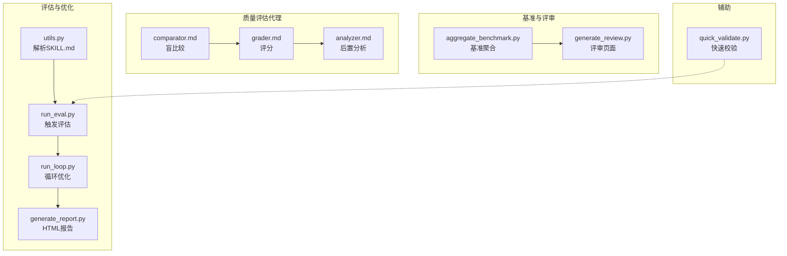
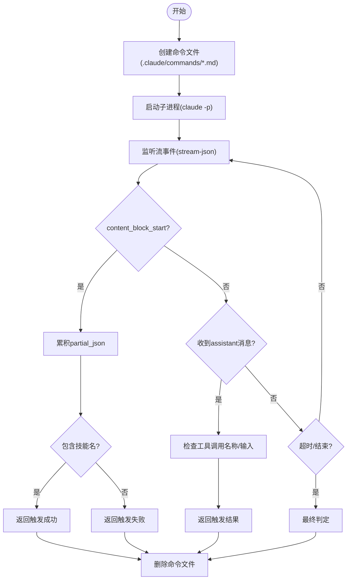
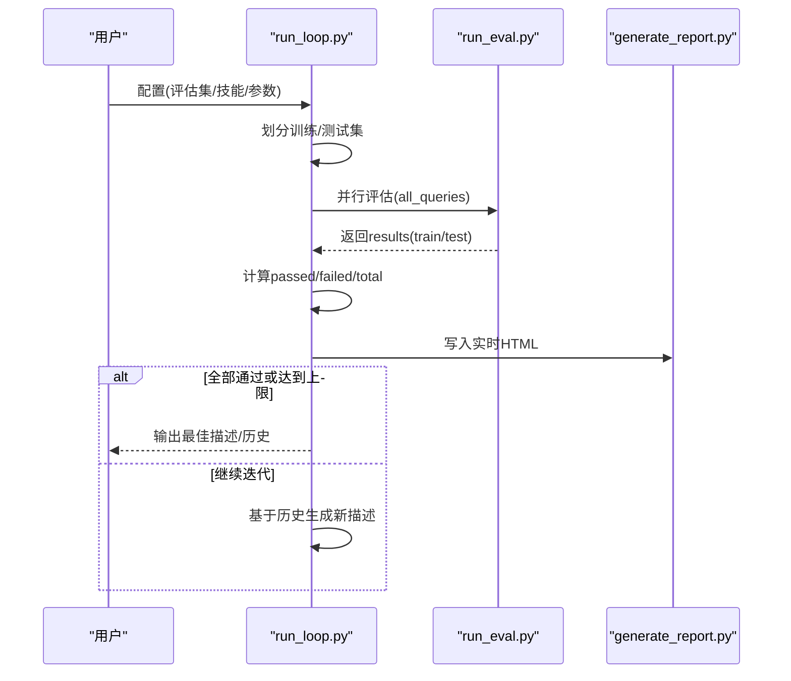
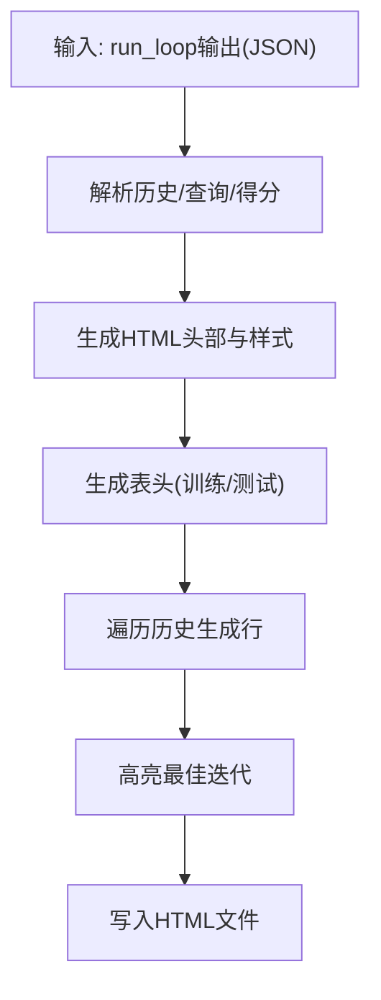
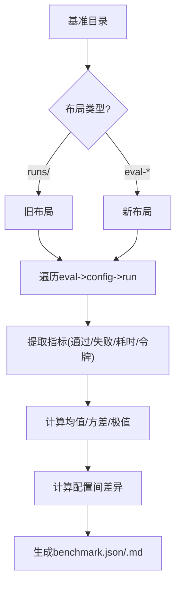
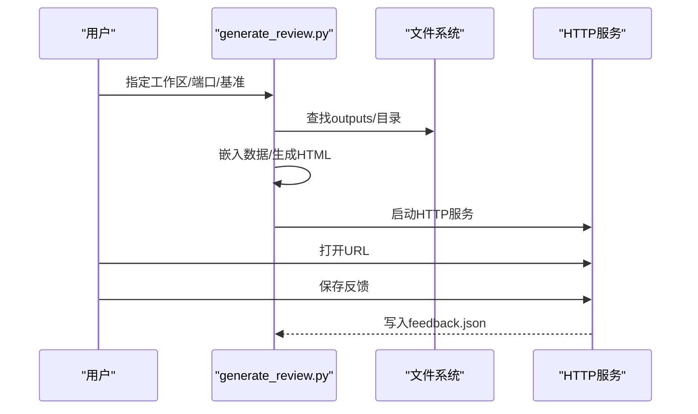
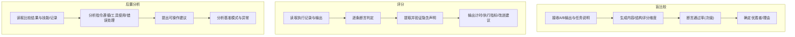
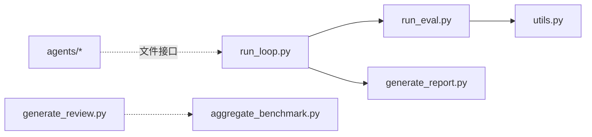

# 测试与评估

<cite>
**本文引用的文件**
- [run_eval.py](file://skills/skills/skill-creator/scripts/run_eval.py)
- [run_loop.py](file://skills/skills/skill-creator/scripts/run_loop.py)
- [generate_report.py](file://skills/skills/skill-creator/scripts/generate_report.py)
- [aggregate_benchmark.py](file://skills/skills/skill-creator/scripts/aggregate_benchmark.py)
- [generate_review.py](file://skills/skills/skill-creator/eval-viewer/generate_review.py)
- [utils.py](file://skills/skills/skill-creator/scripts/utils.py)
- [quick_validate.py](file://skills/skills/skill-creator/scripts/quick_validate.py)
- [comparator.md](file://skills/skills/skill-creator/agents/comparator.md)
- [grader.md](file://skills/skills/skill-creator/agents/grader.md)
- [analyzer.md](file://skills/skills/skill-creator/agents/analyzer.md)
</cite>

## 目录
1. [引言](#引言)
2. [项目结构](#项目结构)
3. [核心组件](#核心组件)
4. [架构总览](#架构总览)
5. [详细组件分析](#详细组件分析)
6. [依赖分析](#依赖分析)
7. [性能考虑](#性能考虑)
8. [故障排查指南](#故障排查指南)
9. [结论](#结论)
10. [附录](#附录)

## 引言
本文件面向“技能测试与评估”主题，系统化阐述仓库中技能描述优化、触发评估、自动化评测、基准聚合与评审展示的完整工作流。内容覆盖评估框架原理、测试用例设计方法、自动化评估流程使用、评估指标选择与性能基准建立、质量度量方法、测试脚本编写与数据准备、结果分析技巧、手动与自动结合、边界条件处理、常见问题诊断、评估报告生成与解读、持续改进策略及与其他技能的对比分析，帮助开发者构建高质量的质量保证体系。

## 项目结构
该仓库围绕“技能（Skill）”的描述优化与执行效果评估，提供了从触发评估、描述迭代优化、到报告生成与评审展示的一体化工具链。关键目录与文件如下：
- 触发评估与描述优化：scripts/run_eval.py、scripts/run_loop.py、scripts/utils.py、scripts/generate_report.py
- 基准聚合与报告：scripts/aggregate_benchmark.py、eval-viewer/generate_review.py
- 质量评估代理：agents/comparator.md、agents/grader.md、agents/analyzer.md
- 快速校验：scripts/quick_validate.py



图表来源
- [run_eval.py:1-311](file://skills/skills/skill-creator/scripts/run_eval.py#L1-L311)
- [run_loop.py:1-329](file://skills/skills/skill-creator/scripts/run_loop.py#L1-L329)
- [generate_report.py:1-327](file://skills/skills/skill-creator/scripts/generate_report.py#L1-L327)
- [aggregate_benchmark.py:1-402](file://skills/skills/skill-creator/scripts/aggregate_benchmark.py#L1-L402)
- [generate_review.py:1-472](file://skills/skills/skill-creator/eval-viewer/generate_review.py#L1-L472)
- [utils.py:1-48](file://skills/skills/skill-creator/scripts/utils.py#L1-L48)
- [comparator.md:1-203](file://skills/skills/skill-creator/agents/comparator.md#L1-L203)
- [grader.md:1-224](file://skills/skills/skill-creator/agents/grader.md#L1-L224)
- [analyzer.md:1-275](file://skills/skills/skill-creator/agents/analyzer.md#L1-L275)
- [quick_validate.py:1-103](file://skills/skills/skill-creator/scripts/quick_validate.py#L1-L103)

章节来源
- [run_eval.py:1-311](file://skills/skills/skill-creator/scripts/run_eval.py#L1-L311)
- [run_loop.py:1-329](file://skills/skills/skill-creator/scripts/run_loop.py#L1-L329)
- [generate_report.py:1-327](file://skills/skills/skill-creator/scripts/generate_report.py#L1-L327)
- [aggregate_benchmark.py:1-402](file://skills/skills/skill-creator/scripts/aggregate_benchmark.py#L1-L402)
- [generate_review.py:1-472](file://skills/skills/skill-creator/eval-viewer/generate_review.py#L1-L472)
- [utils.py:1-48](file://skills/skills/skill-creator/scripts/utils.py#L1-L48)
- [comparator.md:1-203](file://skills/skills/skill-creator/agents/comparator.md#L1-L203)
- [grader.md:1-224](file://skills/skills/skill-creator/agents/grader.md#L1-L224)
- [analyzer.md:1-275](file://skills/skills/skill-creator/agents/analyzer.md#L1-L275)
- [quick_validate.py:1-103](file://skills/skills/skill-creator/scripts/quick_validate.py#L1-L103)

## 核心组件
- 触发评估器：读取技能描述与查询集，通过模拟 Claude 的“技能触发”行为，统计触发率并判定是否达标。
- 描述优化循环：在训练/保留集上评估当前描述，基于历史与训练反馈生成新描述，直至收敛或达到最大迭代。
- 报告生成器：将优化历史转为可读的 HTML 报表，支持自动刷新与最终版输出。
- 基准聚合器：从多次运行结果汇总统计，计算均值、标准差、最小/最大，并给出配置间差异。
- 评审查看器：扫描工作区输出，生成自包含的评审页面，支持本地服务、反馈保存与前后迭代对比。
- 评估代理：盲比较两个输出、评分期望满足度、后置分析以提取改进点；用于对比不同技能实现或不同版本。
- 快速校验：对 SKILL.md 进行基础格式与字段校验，确保描述规范性。

章节来源
- [run_eval.py:1-311](file://skills/skills/skill-creator/scripts/run_eval.py#L1-L311)
- [run_loop.py:1-329](file://skills/skills/skill-creator/scripts/run_loop.py#L1-L329)
- [generate_report.py:1-327](file://skills/skills/skill-creator/scripts/generate_report.py#L1-L327)
- [aggregate_benchmark.py:1-402](file://skills/skills/skill-creator/scripts/aggregate_benchmark.py#L1-L402)
- [generate_review.py:1-472](file://skills/skills/skill-creator/eval-viewer/generate_review.py#L1-L472)
- [comparator.md:1-203](file://skills/skills/skill-creator/agents/comparator.md#L1-L203)
- [grader.md:1-224](file://skills/skills/skill-creator/agents/grader.md#L1-L224)
- [analyzer.md:1-275](file://skills/skills/skill-creator/agents/analyzer.md#L1-L275)
- [quick_validate.py:1-103](file://skills/skills/skill-creator/scripts/quick_validate.py#L1-L103)

## 架构总览
整体流程从“描述优化循环”开始，内部调用“触发评估器”进行并行评估，随后根据训练集表现生成新描述；同时，可选地生成 HTML 报告与评审页面，用于可视化与人工复核；对于多轮运行，可用“基准聚合器”产出统计摘要与 Markdown 报告。

```mermaid
sequenceDiagram
participant Dev as "开发者"
participant Loop as "run_loop.py"
participant Eval as "run_eval.py"
participant Utils as "utils.py"
participant Report as "generate_report.py"
Dev->>Loop : 提供评估集/技能路径/参数
Loop->>Utils : 解析SKILL.md
Loop->>Eval : 并行评估(训练+测试)
Eval-->>Loop : 返回各查询触发结果
Loop->>Loop : 计算训练/测试分数
Loop->>Report : 写入实时HTML报告
Loop-->>Dev : 输出最佳描述/历史记录
```

图表来源
- [run_loop.py:47-242](file://skills/skills/skill-creator/scripts/run_loop.py#L47-L242)
- [run_eval.py:184-256](file://skills/skills/skill-creator/scripts/run_eval.py#L184-L256)
- [utils.py:7-47](file://skills/skills/skill-creator/scripts/utils.py#L7-L47)
- [generate_report.py:16-301](file://skills/skills/skill-creator/scripts/generate_report.py#L16-L301)

## 详细组件分析

### 组件A：触发评估器（run_eval）
- 功能要点
  - 将技能描述写入临时命令文件，使其出现在 Claude 的可用技能列表中。
  - 使用流式事件检测尽早判断是否触发（content_block_start），否则等待完整助手消息。
  - 支持超时控制、重试次数、阈值判定与并行执行。
- 关键流程
  - 创建命令文件
  - 启动子进程执行 claude -p
  - 逐行解析流事件，识别工具调用名称与输入 JSON 片段
  - 判定触发成功与否并清理资源



图表来源
- [run_eval.py:35-182](file://skills/skills/skill-creator/scripts/run_eval.py#L35-L182)

章节来源
- [run_eval.py:1-311](file://skills/skills/skill-creator/scripts/run_eval.py#L1-L311)

### 组件B：描述优化循环（run_loop）
- 功能要点
  - 将评估集按正负样本分层随机划分训练/测试集，防止过拟合。
  - 在每次迭代中并行评估全部查询，拆分回训练/测试结果，记录历史。
  - 基于训练集结果与历史信息生成新描述，直到全通过或达到最大迭代。
  - 可输出实时 HTML 报告并在完成后生成最终报告。
- 关键流程
  - 数据划分
  - 批量评估
  - 结果拆分与统计
  - 历史记录与报告更新
  - 描述改进与收敛判断



图表来源
- [run_loop.py:24-241](file://skills/skills/skill-creator/scripts/run_loop.py#L24-L241)
- [run_eval.py:184-256](file://skills/skills/skill-creator/scripts/run_eval.py#L184-L256)
- [generate_report.py:16-301](file://skills/skills/skill-creator/scripts/generate_report.py#L16-L301)

章节来源
- [run_loop.py:1-329](file://skills/skills/skill-creator/scripts/run_loop.py#L1-L329)

### 组件C：报告生成器（generate_report）
- 功能要点
  - 从 run_loop 输出生成 HTML 报表，区分训练/测试列，标注极性与正确率。
  - 支持自动刷新（开发阶段）与最终版输出。
  - 按得分区间着色，高亮最佳迭代。
- 关键流程
  - 解析历史与查询集合
  - 生成表格与样式
  - 写入 HTML 文件



图表来源
- [generate_report.py:16-301](file://skills/skills/skill-creator/scripts/generate_report.py#L16-L301)

章节来源
- [generate_report.py:1-327](file://skills/skills/skill-creator/scripts/generate_report.py#L1-L327)

### 组件D：基准聚合器（aggregate_benchmark）
- 功能要点
  - 从基准目录加载多次运行的 grading.json，提取 pass 率、耗时、令牌数等指标。
  - 计算每项指标的均值、标准差、最小/最大，并给出两配置间的差异。
  - 生成 benchmark.json 与 benchmark.md，便于横向对比。
- 关键流程
  - 探测运行布局（新旧两种）
  - 加载 grading.json 并抽取指标
  - 聚合计法统计与差异计算
  - 生成 JSON/Md 报告



图表来源
- [aggregate_benchmark.py:67-278](file://skills/skills/skill-creator/scripts/aggregate_benchmark.py#L67-L278)

章节来源
- [aggregate_benchmark.py:1-402](file://skills/skills/skill-creator/scripts/aggregate_benchmark.py#L1-L402)

### 组件E：评审查看器（generate_review）
- 功能要点
  - 扫描工作区中的 outputs/ 子目录，嵌入输出与评分数据，生成自包含 HTML 页面。
  - 支持本地 HTTP 服务器，自动刷新；可保存/加载反馈。
  - 可选关联 benchmark.json，提供对比视图。
- 关键流程
  - 递归发现 runs
  - 嵌入输出与评分
  - 生成/服务 HTML



图表来源
- [generate_review.py:60-282](file://skills/skills/skill-creator/eval-viewer/generate_review.py#L60-L282)

章节来源
- [generate_review.py:1-472](file://skills/skills/skill-creator/eval-viewer/generate_review.py#L1-L472)

### 组件F：评估代理（comparator/grader/analyzer）
- 盲比较（comparator）：不看出处，仅依据输出质量与任务完成度打分，优先内容与结构维度，其次断言通过率。
- 评分（grader）：基于期望与执行记录、输出文件进行逐条判定，提取并验证隐含声明，输出计时与执行指标。
- 后置分析（analyzer）：在盲比较确定优胜者后，深入分析技能与执行记录，提炼改进点；也可分析基准结果，发现跨评估模式与异常。



图表来源
- [comparator.md:1-203](file://skills/skills/skill-creator/agents/comparator.md#L1-L203)
- [grader.md:1-224](file://skills/skills/skill-creator/agents/grader.md#L1-L224)
- [analyzer.md:1-275](file://skills/skills/skill-creator/agents/analyzer.md#L1-L275)

章节来源
- [comparator.md:1-203](file://skills/skills/skill-creator/agents/comparator.md#L1-L203)
- [grader.md:1-224](file://skills/skills/skill-creator/agents/grader.md#L1-L224)
- [analyzer.md:1-275](file://skills/skills/skill-creator/agents/analyzer.md#L1-L275)

### 组件G：快速校验（quick_validate）
- 对 SKILL.md 进行基础校验：存在性、YAML 头部、必需字段、命名与描述长度限制、兼容性字段约束等。
- 便于在评估前快速发现问题，减少无效迭代。

章节来源
- [quick_validate.py:1-103](file://skills/skills/skill-creator/scripts/quick_validate.py#L1-L103)

## 依赖分析
- 组件内聚与耦合
  - run_loop 依赖 run_eval 与 generate_report，形成“评估-记录”的闭环。
  - run_eval 依赖 utils 解析 SKILL.md，依赖系统命令执行与流解析。
  - generate_review 依赖基准数据（可选）与工作区扫描，独立性强。
  - aggregate_benchmark 与评审页面解耦，分别面向统计与可视化。
  - 评估代理（comparator/grader/analyzer）作为外部工具，与脚本工具链通过文件接口交互。
- 外部依赖
  - Claude CLI（claude -p）用于触发评估。
  - Python 标准库（HTTPServer、JSON、正则、子进程等）。



图表来源
- [run_loop.py:1-329](file://skills/skills/skill-creator/scripts/run_loop.py#L1-L329)
- [run_eval.py:1-311](file://skills/skills/skill-creator/scripts/run_eval.py#L1-L311)
- [generate_report.py:1-327](file://skills/skills/skill-creator/scripts/generate_report.py#L1-L327)
- [utils.py:1-48](file://skills/skills/skill-creator/scripts/utils.py#L1-L48)
- [generate_review.py:1-472](file://skills/skills/skill-creator/eval-viewer/generate_review.py#L1-L472)
- [aggregate_benchmark.py:1-402](file://skills/skills/skill-creator/scripts/aggregate_benchmark.py#L1-L402)

章节来源
- [run_loop.py:1-329](file://skills/skills/skill-creator/scripts/run_loop.py#L1-L329)
- [run_eval.py:1-311](file://skills/skills/skill-creator/scripts/run_eval.py#L1-L311)
- [generate_report.py:1-327](file://skills/skills/skill-creator/scripts/generate_report.py#L1-L327)
- [utils.py:1-48](file://skills/skills/skill-creator/scripts/utils.py#L1-L48)
- [generate_review.py:1-472](file://skills/skills/skill-creator/eval-viewer/generate_review.py#L1-L472)
- [aggregate_benchmark.py:1-402](file://skills/skills/skill-creator/scripts/aggregate_benchmark.py#L1-L402)

## 性能考虑
- 并行度与吞吐
  - run_eval 支持多进程池并发执行查询，num_workers 控制并行度；合理设置可显著缩短评估时间。
- 超时与稳定性
  - timeout 控制单查询超时；runs-per-query 控制重试次数，平衡稳定性与成本。
- 触发检测效率
  - 通过流事件提前判断触发，避免等待完整响应，提升交互体验。
- 基准统计
  - aggregate_benchmark 提供均值/标准差/极值，有助于识别异常与波动，指导参数调优。

## 故障排查指南
- 触发评估失败
  - 检查命令文件是否正确写入与清理；确认 claude -p 可用且模型参数正确。
  - 若流事件未命中，检查技能名与输入 JSON 片段匹配逻辑。
- 报告无法刷新
  - 确认实时 HTML 是否启用自动刷新；浏览器缓存可能影响显示。
- 基准聚合缺失指标
  - 确认 grading.json 字段完整性；若 timing.json 存在，需与 grading.json 协同。
- 评审页面空白
  - 检查工作区是否存在 outputs/ 目录；确认权限与路径正确。
- 评估代理结果偏差
  - 盲比较要求严格“不看出处”，评分需以证据为准；后置分析应聚焦可验证事实。

章节来源
- [run_eval.py:184-256](file://skills/skills/skill-creator/scripts/run_eval.py#L184-L256)
- [generate_report.py:16-301](file://skills/skills/skill-creator/scripts/generate_report.py#L16-L301)
- [aggregate_benchmark.py:119-173](file://skills/skills/skill-creator/scripts/aggregate_benchmark.py#L119-L173)
- [generate_review.py:60-146](file://skills/skills/skill-creator/eval-viewer/generate_review.py#L60-L146)
- [comparator.md:194-203](file://skills/skills/skill-creator/agents/comparator.md#L194-L203)
- [grader.md:85-100](file://skills/skills/skill-creator/agents/grader.md#L85-L100)

## 结论
本仓库提供了一套完整的技能测试与评估工具链：从描述优化、触发评估、到报告与评审展示，再到基准聚合与对比分析。通过并行评估、自动刷新报告、盲比较与评分、后置分析等机制，能够系统化地提升技能质量与一致性。建议在实际使用中结合手动复核与自动化流程，持续迭代优化。

## 附录

### 评估指标与质量度量
- 触发评估
  - 触发率、阈值、通过/失败计数、重试次数
- 基准统计
  - 通过率均值/标准差/最小/最大；耗时/令牌/工具调用次数；配置间差异
- 评分与比较
  - 内容/结构维度评分；断言通过率；总体评分；隐含声明验证
- 基准分析
  - 断言一致性模式、跨评估稳定性、资源使用波动、异常运行识别

章节来源
- [run_eval.py:227-256](file://skills/skills/skill-creator/scripts/run_eval.py#L227-L256)
- [aggregate_benchmark.py:45-64](file://skills/skills/skill-creator/scripts/aggregate_benchmark.py#L45-L64)
- [grader.md:106-224](file://skills/skills/skill-creator/agents/grader.md#L106-L224)
- [comparator.md:37-86](file://skills/skills/skill-creator/agents/comparator.md#L37-L86)
- [analyzer.md:187-275](file://skills/skills/skill-creator/agents/analyzer.md#L187-L275)

### 测试用例设计方法
- 分层抽样：按 should_trigger 划分训练/测试，保持正负比例一致。
- 边界与反例：加入模糊/歧义/极端场景，检验鲁棒性。
- 多轮重试：通过 runs-per-query 提升统计可靠性。
- 期望断言：明确、可验证、不可被表面合规欺骗。

章节来源
- [run_loop.py:24-44](file://skills/skills/skill-creator/scripts/run_loop.py#L24-L44)
- [grader.md:68-80](file://skills/skills/skill-creator/agents/grader.md#L68-L80)

### 自动化评估流程使用
- 准备评估集 JSON（包含 query 与 should_trigger）。
- 指定技能目录与参数（并行度、超时、阈值、迭代次数、保留比例）。
- 运行 run_loop，观察实时报告，结束后生成最终报告与结果 JSON。
- 如需基准对比，运行 aggregate_benchmark 生成统计摘要。

章节来源
- [run_loop.py:244-329](file://skills/skills/skill-creator/scripts/run_loop.py#L244-L329)
- [aggregate_benchmark.py:338-402](file://skills/skills/skill-creator/scripts/aggregate_benchmark.py#L338-L402)

### 评估数据准备与结果分析
- 数据准备
  - SKILL.md 格式与字段校验：使用 quick_validate。
  - 评估集设计：覆盖典型/边缘/反例场景。
- 结果分析
  - 报告：关注最佳迭代、训练/测试差异、错误分布。
  - 基准：关注均值与方差、异常运行、资源消耗趋势。
  - 评审：结合执行记录与输出文件，定位具体问题。

章节来源
- [quick_validate.py:12-94](file://skills/skills/skill-creator/scripts/quick_validate.py#L12-L94)
- [generate_report.py:16-301](file://skills/skills/skill-creator/scripts/generate_report.py#L16-L301)
- [aggregate_benchmark.py:227-278](file://skills/skills/skill-creator/scripts/aggregate_benchmark.py#L227-L278)
- [generate_review.py:250-282](file://skills/skills/skill-creator/eval-viewer/generate_review.py#L250-L282)

### 手动测试与自动测试结合
- 自动：大规模并行评估、阈值判定、统计汇总。
- 手动：盲比较与评分、后置分析、评审页面复核、期望断言优化。
- 建议：先自动筛选，再人工深度评审关键案例。

章节来源
- [comparator.md:1-203](file://skills/skills/skill-creator/agents/comparator.md#L1-L203)
- [grader.md:1-224](file://skills/skills/skill-creator/agents/grader.md#L1-L224)
- [analyzer.md:1-275](file://skills/skills/skill-creator/agents/analyzer.md#L1-L275)
- [generate_review.py:387-472](file://skills/skills/skill-creator/eval-viewer/generate_review.py#L387-L472)

### 边界条件与常见问题
- 触发判定边界：流事件与完整消息的双重保障。
- 超时与重试：根据任务复杂度调整 timeout 与 runs-per-query。
- 报告与评审：注意自动刷新与静态导出的区别；确保 outputs/ 存在且可读。
- 基准一致性：统一运行环境与模型配置，避免外部变量干扰。

章节来源
- [run_eval.py:93-178](file://skills/skills/skill-creator/scripts/run_eval.py#L93-L178)
- [generate_report.py:32-33](file://skills/skills/skill-creator/scripts/generate_report.py#L32-L33)
- [generate_review.py:60-83](file://skills/skills/skill-creator/eval-viewer/generate_review.py#L60-L83)
- [aggregate_benchmark.py:67-83](file://skills/skills/skill-creator/scripts/aggregate_benchmark.py#L67-L83)

### 评估报告生成与解读
- HTML 报告：训练/测试列、极性标注、得分等级、最佳迭代高亮。
- 基准报告：通过率、耗时、令牌的统计摘要与差异。
- 评审页面：输出嵌入、反馈保存、前后迭代对比。

章节来源
- [generate_report.py:16-301](file://skills/skills/skill-creator/scripts/generate_report.py#L16-L301)
- [aggregate_benchmark.py:281-335](file://skills/skills/skill-creator/scripts/aggregate_benchmark.py#L281-L335)
- [generate_review.py:250-282](file://skills/skills/skill-creator/eval-viewer/generate_review.py#L250-L282)

### 持续改进策略与对比分析
- 迭代优化：基于训练集反馈生成新描述，直至收敛。
- 对比分析：使用盲比较与评分，客观判断优劣；后置分析提炼改进点。
- 基准对比：固定配置与环境，长期跟踪技能表现变化。

章节来源
- [run_loop.py:189-241](file://skills/skills/skill-creator/scripts/run_loop.py#L189-L241)
- [comparator.md:77-86](file://skills/skills/skill-creator/agents/comparator.md#L77-L86)
- [analyzer.md:187-275](file://skills/skills/skill-creator/agents/analyzer.md#L187-L275)