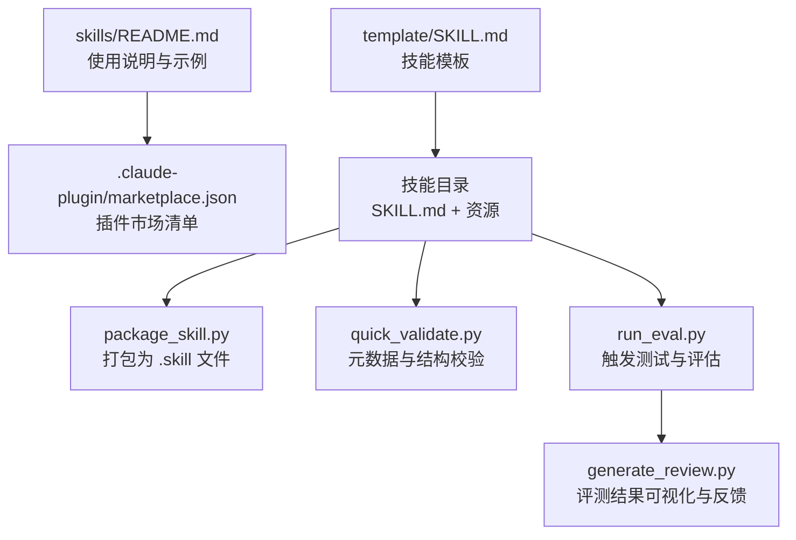
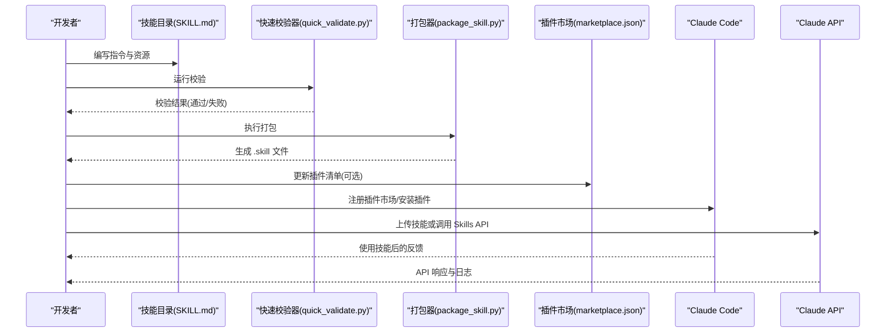
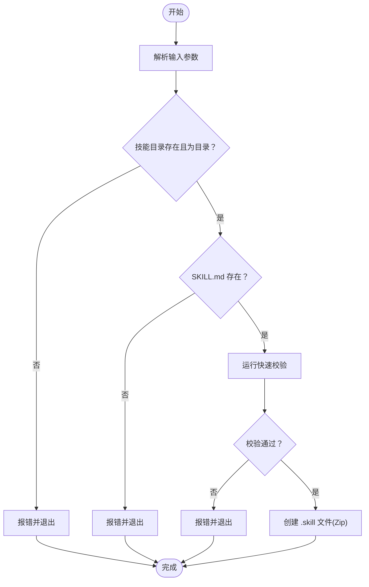
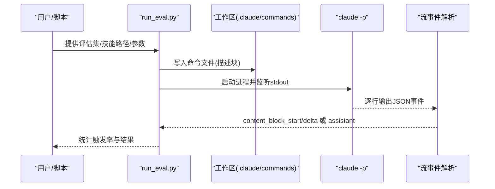
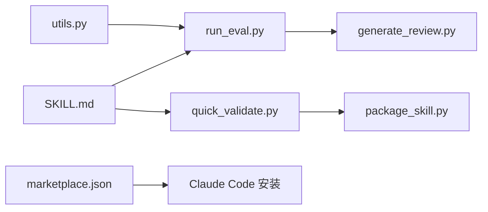

# 部署与分发

<cite>
**本文引用的文件**
- [skills/README.md](file://skills/README.md)
- [.claude-plugin/marketplace.json](file://skills/.claude-plugin/marketplace.json)
- [template/SKILL.md](file://skills/template/SKILL.md)
- [agent-skills-spec.md](file://skills/spec/agent-skills-spec.md)
- [package_skill.py](file://skills/skills/skill-creator/scripts/package_skill.py)
- [quick_validate.py](file://skills/skills/skill-creator/scripts/quick_validate.py)
- [run_eval.py](file://skills/skills/skill-creator/scripts/run_eval.py)
- [utils.py](file://skills/skills/skill-creator/scripts/utils.py)
- [generate_review.py](file://skills/skills/skill-creator/eval-viewer/generate_review.py)
</cite>

## 目录
1. [简介](#简介)
2. [项目结构](#项目结构)
3. [核心组件](#核心组件)
4. [架构总览](#架构总览)
5. [详细组件分析](#详细组件分析)
6. [依赖关系分析](#依赖关系分析)
7. [性能考量](#性能考量)
8. [故障排查指南](#故障排查指南)
9. [结论](#结论)
10. [附录](#附录)

## 简介
本文件面向开发者，系统化阐述“技能”的打包、分发与发布全流程，覆盖以下主题：
- 技能打包标准流程：从目录结构、元数据校验到可分发归档产物生成
- 分发渠道选择策略：Claude Code 插件市场、Claude.ai 平台、Claude API 与自定义部署
- 市场发布的准备：元数据规范、兼容性声明、触发测试与评估
- 技能包结构要求与依赖处理：清单文件、资源组织与排除规则
- 平台适配要点：插件清单、技能入口、工具使用限制
- 版本管理与更新机制：版本号、变更记录与回滚策略
- 用户反馈收集与处理：评测可视化、反馈持久化与迭代
- 安全与性能：最小权限原则、资源压缩与并发控制
- 维护与支持：长期运营、问题追踪与社区协作

## 项目结构
该仓库以“技能”为中心，提供示例技能、模板与自动化工具链，支撑从开发到分发的闭环：
- skills/README.md：总体说明、使用方式与示例技能集合
- .claude-plugin/marketplace.json：插件市场清单，定义插件名称、描述、版本与技能子集
- skills/template/SKILL.md：技能元数据模板（YAML frontmatter + 指令正文）
- skills/spec/agent-skills-spec.md：Agent Skills 规范链接
- skills/skills/skill-creator/scripts：打包、验证、评测与反馈工具
- skills/skills/skill-creator/eval-viewer：评测结果可视化与反馈存储

图表来源
- [skills/README.md:1-95](file://skills/README.md#L1-L95)
- [.claude-plugin/marketplace.json:1-56](file://skills/.claude-plugin/marketplace.json#L1-L56)
- [template/SKILL.md:1-7](file://skills/template/SKILL.md#L1-L7)
- [package_skill.py:1-137](file://skills/skills/skill-creator/scripts/package_skill.py#L1-L137)
- [quick_validate.py:1-103](file://skills/skills/skill-creator/scripts/quick_validate.py#L1-L103)
- [run_eval.py:1-311](file://skills/skills/skill-creator/scripts/run_eval.py#L1-L311)
- [generate_review.py:1-472](file://skills/skills/skill-creator/eval-viewer/generate_review.py#L1-L472)

章节来源
- [skills/README.md:1-95](file://skills/README.md#L1-L95)
- [.claude-plugin/marketplace.json:1-56](file://skills/.claude-plugin/marketplace.json#L1-L56)
- [template/SKILL.md:1-7](file://skills/template/SKILL.md#L1-L7)

## 核心组件
- 插件市场清单（marketplace.json）：定义插件集合、技能子集与相对路径映射，用于在 Claude Code 中注册与安装
- 技能模板（SKILL.md）：标准化的 YAML frontmatter + 指令正文，包含 name、description 等关键元数据
- 打包器（package_skill.py）：将技能目录打包为 .skill 归档，内置排除规则与预检校验
- 快速校验器（quick_validate.py）：对 SKILL.md 的 frontmatter 进行严格校验（键名、类型、长度、命名规范等）
- 触发评测器（run_eval.py）：通过命令文件模拟查询，检测技能是否被正确触发，并统计触发率
- 评测查看器（generate_review.py）：扫描工作区输出，生成内嵌数据的独立 HTML 页面，支持反馈持久化与对比

章节来源
- [.claude-plugin/marketplace.json:11-54](file://skills/.claude-plugin/marketplace.json#L11-L54)
- [template/SKILL.md:1-7](file://skills/template/SKILL.md#L1-L7)
- [package_skill.py:42-108](file://skills/skills/skill-creator/scripts/package_skill.py#L42-L108)
- [quick_validate.py:12-94](file://skills/skills/skill-creator/scripts/quick_validate.py#L12-L94)
- [run_eval.py:35-182](file://skills/skills/skill-creator/scripts/run_eval.py#L35-L182)
- [generate_review.py:60-146](file://skills/skills/skill-creator/eval-viewer/generate_review.py#L60-L146)

## 架构总览
下图展示了从本地开发到多平台分发的关键流程与交互：

图表来源
- [quick_validate.py:12-94](file://skills/skills/skill-creator/scripts/quick_validate.py#L12-L94)
- [package_skill.py:42-108](file://skills/skills/skill-creator/scripts/package_skill.py#L42-L108)
- [.claude-plugin/marketplace.json:11-54](file://skills/.claude-plugin/marketplace.json#L11-L54)
- [skills/README.md:31-59](file://skills/README.md#L31-L59)

## 详细组件分析

### 插件市场清单（marketplace.json）
- 作用：定义插件名称、所有者、版本与技能子集；每个插件可包含多个技能路径
- 关键字段：name、owner、metadata、plugins[]
- 插件项字段：name、description、source、strict、skills[]
- 使用场景：在 Claude Code 中注册为市场源，或作为 API 上传的基础清单

章节来源
- [.claude-plugin/marketplace.json:1-56](file://skills/.claude-plugin/marketplace.json#L1-L56)

### 技能模板（SKILL.md）
- 结构：YAML frontmatter（name、description 等）+ Markdown 正文（指令、示例、指南）
- 元数据要求：name 与 description 为必填；支持 license、allowed-tools、metadata、compatibility 等扩展字段
- 规范约束：name 采用 kebab-case，长度限制；description 不含尖括号且长度限制；compatibility 可选但有长度限制

章节来源
- [template/SKILL.md:1-7](file://skills/template/SKILL.md#L1-L7)
- [quick_validate.py:42-94](file://skills/skills/skill-creator/scripts/quick_validate.py#L42-L94)

### 打包器（package_skill.py）
- 功能：将技能目录打包为 .skill 文件（Zip），内置排除规则（缓存目录、临时文件、根目录特定目录等）
- 流程：参数解析 → 存在性与结构校验 → 预检验证 → 创建 Zip → 输出路径
- 排除策略：目录级（如 __pycache__、node_modules）、通配符（*.pyc）、文件级（.DS_Store）、根目录特定目录（evals）

图表来源
- [package_skill.py:111-137](file://skills/skills/skill-creator/scripts/package_skill.py#L111-L137)
- [package_skill.py:42-108](file://skills/skills/skill-creator/scripts/package_skill.py#L42-L108)
- [quick_validate.py:12-94](file://skills/skills/skill-creator/scripts/quick_validate.py#L12-L94)

章节来源
- [package_skill.py:19-40](file://skills/skills/skill-creator/scripts/package_skill.py#L19-L40)
- [package_skill.py:42-108](file://skills/skills/skill-creator/scripts/package_skill.py#L42-L108)

### 快速校验器（quick_validate.py）
- 校验范围：frontmatter 存在性与格式、键名合法性、必需字段、命名与描述规范、可选兼容性字段
- 返回值：布尔 + 文本消息，便于脚本化集成

章节来源
- [quick_validate.py:12-94](file://skills/skills/skill-creator/scripts/quick_validate.py#L12-L94)

### 触发评测器（run_eval.py）
- 目标：评估技能描述对触发率的影响，支持并发执行与超时控制
- 方法：在项目根目录生成命令文件，调用 claude -p 执行流式事件监听，早期检测 content_block_start/content_block_delta，回退至完整助手消息
- 输出：每条查询的触发次数、触发率与通过/失败标记

图表来源
- [run_eval.py:35-182](file://skills/skills/skill-creator/scripts/run_eval.py#L35-L182)
- [utils.py:7-47](file://skills/skills/skill-creator/scripts/utils.py#L7-L47)

章节来源
- [run_eval.py:184-256](file://skills/skills/skill-creator/scripts/run_eval.py#L184-L256)
- [utils.py:7-47](file://skills/skills/skill-creator/scripts/utils.py#L7-L47)

### 评测查看器（generate_review.py）
- 功能：扫描工作区中的 outputs/ 目录，构建评测运行集，内嵌数据生成独立 HTML 页面，支持反馈自动保存与历史对比
- 支持类型：文本、图片、PDF、XLSX 等；未知类型以二进制下载形式呈现
- 交互：HTTP 服务端口可配置，支持静态导出；反馈持久化为 feedback.json

章节来源
- [generate_review.py:60-146](file://skills/skills/skill-creator/eval-viewer/generate_review.py#L60-L146)
- [generate_review.py:250-282](file://skills/skills/skill-creator/eval-viewer/generate_review.py#L250-L282)
- [generate_review.py:387-472](file://skills/skills/skill-creator/eval-viewer/generate_review.py#L387-L472)

## 依赖关系分析
- 工具链耦合：package_skill.py 依赖 quick_validate.py；run_eval.py 依赖 utils.py 解析 SKILL.md；generate_review.py 依赖工作区输出结构
- 外部依赖：run_eval.py 依赖本地环境中的 claude 命令行工具；generate_review.py 仅使用标准库
- 清单依赖：marketplace.json 决定技能子集与安装路径，影响用户侧的可用技能集合

图表来源
- [package_skill.py:17-77](file://skills/skills/skill-creator/scripts/package_skill.py#L17-L77)
- [quick_validate.py:12-94](file://skills/skills/skill-creator/scripts/quick_validate.py#L12-L94)
- [run_eval.py:19-280](file://skills/skills/skill-creator/scripts/run_eval.py#L19-L280)
- [utils.py:7-47](file://skills/skills/skill-creator/scripts/utils.py#L7-L47)
- [generate_review.py:60-146](file://skills/skills/skill-creator/eval-viewer/generate_review.py#L60-L146)
- [.claude-plugin/marketplace.json:11-54](file://skills/.claude-plugin/marketplace.json#L11-L54)

章节来源
- [package_skill.py:17-77](file://skills/skills/skill-creator/scripts/package_skill.py#L17-L77)
- [run_eval.py:19-280](file://skills/skills/skill-creator/scripts/run_eval.py#L19-L280)
- [generate_review.py:60-146](file://skills/skills/skill-creator/eval-viewer/generate_review.py#L60-L146)

## 性能考量
- 打包体积：通过排除规则减少无关文件进入 .skill，降低传输与加载时间
- 并发评测：run_eval.py 使用进程池并发执行查询，缩短评测周期；合理设置 workers 与 runs-per-query
- 流式事件监听：优先检测 content_block_start/delta，避免等待完整响应，提升评测效率
- 本地服务：generate_review.py 仅使用标准库，零外部依赖，启动与渲染开销低

章节来源
- [package_skill.py:19-40](file://skills/skills/skill-creator/scripts/package_skill.py#L19-L40)
- [run_eval.py:184-256](file://skills/skills/skill-creator/scripts/run_eval.py#L184-L256)
- [generate_review.py:287-385](file://skills/skills/skill-creator/eval-viewer/generate_review.py#L287-L385)

## 故障排查指南
- 打包失败
  - 症状：找不到 SKILL.md 或目录非目录
  - 处理：确认技能根目录包含 SKILL.md；确保传入路径为有效目录
- 校验失败
  - 症状：frontmatter 缺失、键名非法、name/description 不符合规范
  - 处理：对照模板修正；遵循 kebab-case 与长度限制
- 评测无触发
  - 症状：触发率过低或为 0
  - 处理：调整描述关键词与示例；增加 runs-per-query；检查 allowed-tools 与工具可用性
- 本地服务端口占用
  - 症状：无法启动 HTTP 服务器
  - 处理：更换端口或使用静态导出模式；脚本会尝试清理占用进程

章节来源
- [package_skill.py:55-77](file://skills/skills/skill-creator/scripts/package_skill.py#L55-L77)
- [quick_validate.py:16-50](file://skills/skills/skill-creator/scripts/quick_validate.py#L16-L50)
- [run_eval.py:35-182](file://skills/skills/skill-creator/scripts/run_eval.py#L35-L182)
- [generate_review.py:438-472](file://skills/skills/skill-creator/eval-viewer/generate_review.py#L438-L472)

## 结论
本仓库提供了完整的技能开发、验证、打包与评测工具链，配合插件市场清单实现多平台分发。遵循 SKILL.md 元数据规范、执行预检与触发评测、利用打包器生成 .skill 文件，即可高效地将技能交付给 Claude Code、Claude.ai 与 Claude API。通过评测查看器沉淀反馈，形成持续改进的闭环。

## 附录

### 技能包结构与清单字段
- 技能目录必须包含 SKILL.md；可包含脚本、模板、资源与许可证文件
- marketplace.json 的 plugins[] 定义技能子集与相对路径映射
- 插件清单包含 name、owner、metadata、plugins[] 字段

章节来源
- [skills/README.md:29-59](file://skills/README.md#L29-L59)
- [.claude-plugin/marketplace.json:1-56](file://skills/.claude-plugin/marketplace.json#L1-L56)

### 分发渠道与适配要点
- Claude Code 插件市场
  - 通过 marketplace.json 注册与安装；支持按插件名称与技能子集选择
- Claude.ai 平台
  - 已内置示例技能；可通过设置启用或上传自定义技能
- Claude API
  - 支持上传自定义技能并通过 API 使用；参考官方 Skills API 快速入门

章节来源
- [skills/README.md:31-59](file://skills/README.md#L31-L59)

### 版本管理与更新机制
- marketplace.json 的 metadata.version 用于标识插件版本
- 建议：每次重大变更更新版本号；在 SKILL.md 中记录变更摘要；保留历史 .skill 文件以便回滚

章节来源
- [.claude-plugin/marketplace.json:7-10](file://skills/.claude-plugin/marketplace.json#L7-L10)

### 用户反馈与迭代
- 评测查看器生成的 HTML 页面可作为评审材料；feedback.json 记录评审意见
- 建议：建立评审会议流程，定期汇总与复盘；根据反馈优化描述与示例

章节来源
- [generate_review.py:418-436](file://skills/skills/skill-creator/eval-viewer/generate_review.py#L418-L436)

### 安全与合规
- 最小权限原则：在 SKILL.md 中明确 allowed-tools，避免不必要的工具暴露
- 资源保护：敏感信息不放入公开仓库；使用许可证与第三方声明文件
- 兼容性声明：在 SKILL.md 的 compatibility 字段中说明平台与模型兼容情况

章节来源
- [quick_validate.py:42-94](file://skills/skills/skill-creator/scripts/quick_validate.py#L42-L94)