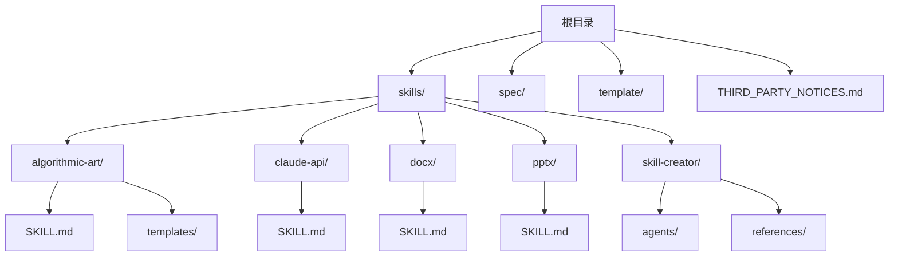
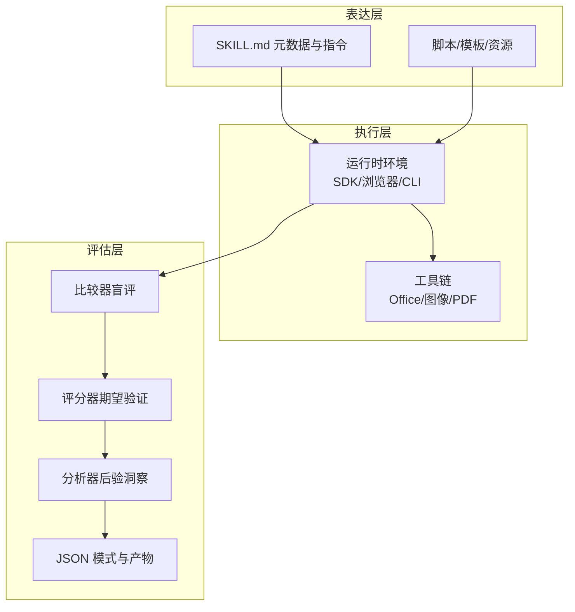
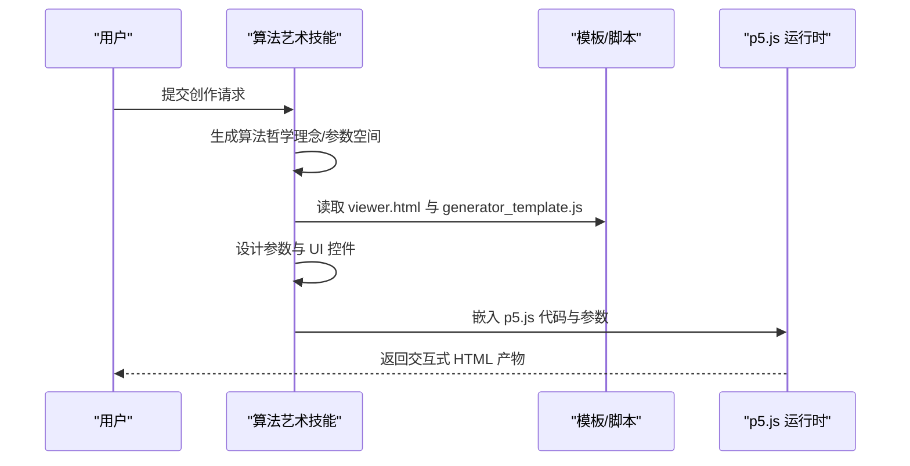
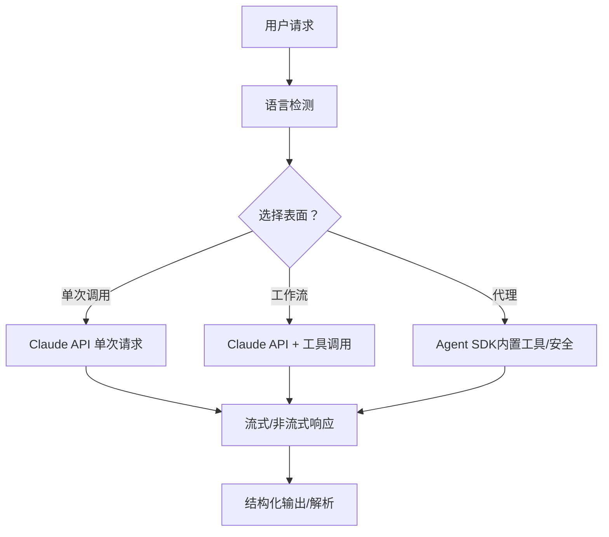
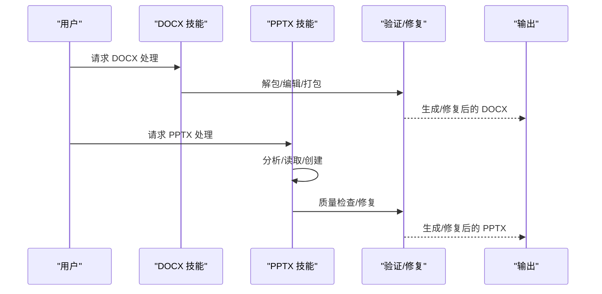
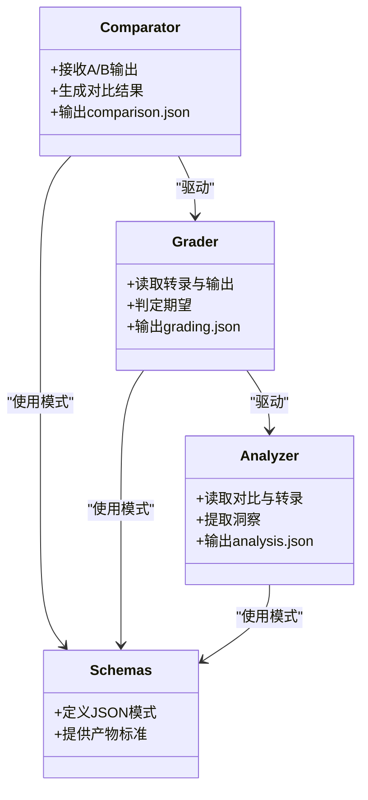
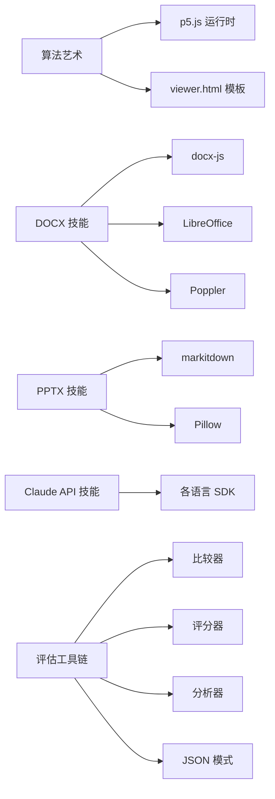

# 技能系统架构

<cite>
**本文档引用的文件**
- [skills/README.md](file://skills/README.md)
- [skills/spec/agent-skills-spec.md](file://skills/spec/agent-skills-spec.md)
- [skills/template/SKILL.md](file://skills/template/SKILL.md)
- [skills/THIRD_PARTY_NOTICES.md](file://skills/THIRD_PARTY_NOTICES.md)
- [skills/skills/algorithmic-art/SKILL.md](file://skills/skills/algorithmic-art/SKILL.md)
- [skills/skills/algorithmic-art/templates/generator_template.js](file://skills/skills/algorithmic-art/templates/generator_template.js)
- [skills/skills/algorithmic-art/templates/viewer.html](file://skills/skills/algorithmic-art/templates/viewer.html)
- [skills/skills/claude-api/SKILL.md](file://skills/skills/claude-api/SKILL.md)
- [skills/skills/docx/SKILL.md](file://skills/skills/docx/SKILL.md)
- [skills/skills/pptx/SKILL.md](file://skills/skills/pptx/SKILL.md)
- [skills/skills/skill-creator/agents/analyzer.md](file://skills/skills/skill-creator/agents/analyzer.md)
- [skills/skills/skill-creator/agents/comparator.md](file://skills/skills/skill-creator/agents/comparator.md)
- [skills/skills/skill-creator/agents/grader.md](file://skills/skills/skill-creator/agents/grader.md)
- [skills/skills/skill-creator/references/schemas.md](file://skills/skills/skill-creator/references/schemas.md)
</cite>

## 目录
1. [引言](#引言)
2. [项目结构](#项目结构)
3. [核心组件](#核心组件)
4. [架构总览](#架构总览)
5. [详细组件分析](#详细组件分析)
6. [依赖关系分析](#依赖关系分析)
7. [性能考量](#性能考量)
8. [故障排查指南](#故障排查指南)
9. [结论](#结论)
10. [附录](#附录)

## 引言
本架构文档面向“技能系统”，目标是为 Anthropic 的 Agent Skills 能力提供清晰、可操作的系统化说明，涵盖高层设计、架构模式与系统边界；记录组件交互、数据流与集成模式；解释技术决策、权衡与约束；并给出基础设施需求、可扩展性考虑与部署拓扑建议。该仓库包含多种技能（算法艺术、文档处理、演示文稿、Claude API 使用等），以及用于评估与改进技能的自动化工具链。

## 项目结构
仓库采用“按技能分目录”的组织方式，每个技能自包含于独立子目录中，并通过统一的元数据文件（SKILL.md）声明其名称、描述与使用场景。此外，还包含规范、模板与第三方许可信息，以及用于技能评估与改进的自动化代理与参考模式。

图表来源
- [skills/README.md:1-95](file://skills/README.md#L1-L95)
- [skills/spec/agent-skills-spec.md:1-4](file://skills/spec/agent-skills-spec.md#L1-L4)
- [skills/template/SKILL.md:1-7](file://skills/template/SKILL.md#L1-L7)

章节来源
- [skills/README.md:1-95](file://skills/README.md#L1-L95)

## 核心组件
- 技能（Skill）
  - 每个技能是一个独立的功能单元，包含元数据（SKILL.md）与可选脚本/资源，Claude 在触发时加载并在会话中使用。
  - 示例：算法艺术、Claude API、DOCX/PPTX 文档处理等。
- 评估与改进工具链（Skill Creator）
  - 包含比较器（盲评）、评分器（Grader）、后验分析器（Analyzer）等代理，配合 JSON 模式定义运行产物与指标。
- 规范与模板
  - 规范文件指向官方 Agent Skills 规范；模板提供标准化的技能编写入口。
- 第三方依赖与许可证
  - 统一的第三方许可清单，覆盖图像处理、字体、办公文档相关工具与库。

章节来源
- [skills/skills/algorithmic-art/SKILL.md:1-405](file://skills/skills/algorithmic-art/SKILL.md#L1-L405)
- [skills/skills/claude-api/SKILL.md:1-244](file://skills/skills/claude-api/SKILL.md#L1-L244)
- [skills/skills/docx/SKILL.md:1-591](file://skills/skills/docx/SKILL.md#L1-L591)
- [skills/skills/pptx/SKILL.md:1-233](file://skills/skills/pptx/SKILL.md#L1-L233)
- [skills/skills/skill-creator/agents/comparator.md:1-203](file://skills/skills/skill-creator/agents/comparator.md#L1-L203)
- [skills/skills/skill-creator/agents/grader.md:1-224](file://skills/skills/skill-creator/agents/grader.md#L1-L224)
- [skills/skills/skill-creator/agents/analyzer.md:1-275](file://skills/skills/skill-creator/agents/analyzer.md#L1-L275)
- [skills/skills/skill-creator/references/schemas.md:1-431](file://skills/skills/skill-creator/references/schemas.md#L1-L431)
- [skills/spec/agent-skills-spec.md:1-4](file://skills/spec/agent-skills-spec.md#L1-L4)
- [skills/template/SKILL.md:1-7](file://skills/template/SKILL.md#L1-L7)
- [skills/THIRD_PARTY_NOTICES.md:1-405](file://skills/THIRD_PARTY_NOTICES.md#L1-L405)

## 架构总览
技能系统采用“声明式技能 + 可执行脚本 + 自动化评估”的三层架构：
- 表达层：每个技能以 SKILL.md 声明意图、规则与资源引用，支持多语言 SDK 与工具调用。
- 执行层：技能内嵌脚本或外部工具（如 Office 工具链、图像处理库、p5.js 运行时等），在受控环境中执行。
- 评估层：通过比较器、评分器与分析器对输出进行客观评价，形成可迭代的改进闭环。

图表来源
- [skills/skills/algorithmic-art/SKILL.md:101-383](file://skills/skills/algorithmic-art/SKILL.md#L101-L383)
- [skills/skills/claude-api/SKILL.md:119-131](file://skills/skills/claude-api/SKILL.md#L119-L131)
- [skills/skills/skill-creator/agents/comparator.md:20-90](file://skills/skills/skill-creator/agents/comparator.md#L20-L90)
- [skills/skills/skill-creator/agents/grader.md:19-84](file://skills/skills/skill-creator/agents/grader.md#L19-L84)
- [skills/skills/skill-creator/agents/analyzer.md:1-90](file://skills/skills/skill-creator/agents/analyzer.md#L1-L90)
- [skills/skills/skill-creator/references/schemas.md:7-160](file://skills/skills/skill-creator/references/schemas.md#L7-L160)

## 详细组件分析

### 算法艺术技能（Algorithmic Art）
- 设计要点
  - 分两阶段：先生成“算法哲学”（理念与参数空间），再实现为 p5.js 可交互作品。
  - 强调可重现性（种子随机）、参数化控制与 UI 一致性（Anthropic 风格）。
- 关键流程
  - 算法哲学生成 → 参数设计 → UI 控件映射 → p5.js 实现 → 交互式 HTML 产物。

图表来源
- [skills/skills/algorithmic-art/SKILL.md:9-383](file://skills/skills/algorithmic-art/SKILL.md#L9-L383)
- [skills/skills/algorithmic-art/templates/viewer.html:1-599](file://skills/skills/algorithmic-art/templates/viewer.html#L1-L599)
- [skills/skills/algorithmic-art/templates/generator_template.js:1-223](file://skills/skills/algorithmic-art/templates/generator_template.js#L1-L223)

章节来源
- [skills/skills/algorithmic-art/SKILL.md:1-405](file://skills/skills/algorithmic-art/SKILL.md#L1-L405)
- [skills/skills/algorithmic-art/templates/generator_template.js:1-223](file://skills/skills/algorithmic-art/templates/generator_template.js#L1-L223)
- [skills/skills/algorithmic-art/templates/viewer.html:1-599](file://skills/skills/algorithmic-art/templates/viewer.html#L1-L599)

### Claude API 技能（Claude API）
- 设计要点
  - 以“表面选择”为主线：单次调用、工作流、代理三种层级，按需选择。
  - 明确模型与思维策略（Opus 4.6 + 自适应思考），避免过时参数。
  - 工具调用、结构化输出、批处理、文件上传等能力通过单一消息端点统一接入。
- 关键流程
  - 语言检测 → 选择表面 → 读取对应语言文档 → 构建请求/循环 → 流式响应/最终消息。

图表来源
- [skills/skills/claude-api/SKILL.md:19-131](file://skills/skills/claude-api/SKILL.md#L19-L131)
- [skills/skills/claude-api/SKILL.md:171-244](file://skills/skills/claude-api/SKILL.md#L171-L244)

章节来源
- [skills/skills/claude-api/SKILL.md:1-244](file://skills/skills/claude-api/SKILL.md#L1-L244)

### 文档处理技能（DOCX/PPTX）
- 设计要点
  - DOCX：基于 docx-js 创建新文档，或通过解包/编辑/打包维护现有文档；强调页面尺寸、样式、列表、表格、图片、页码等细节。
  - PPTX：文本提取、缩略图生成、从模板/从零创建；强调配色、版式、排版与视觉质量。
- 关键流程
  - DOCX：创建/读取 → 验证/修复 → 输出
  - PPTX：分析/读取 → 编辑/创建 → 质量检查 → 图像导出

图表来源
- [skills/skills/docx/SKILL.md:29-591](file://skills/skills/docx/SKILL.md#L29-L591)
- [skills/skills/pptx/SKILL.md:19-233](file://skills/skills/pptx/SKILL.md#L19-L233)

章节来源
- [skills/skills/docx/SKILL.md:1-591](file://skills/skills/docx/SKILL.md#L1-L591)
- [skills/skills/pptx/SKILL.md:1-233](file://skills/skills/pptx/SKILL.md#L1-L233)

### 评估与改进工具链（Skill Creator）
- 比较器（Blind Comparator）
  - 对比两个输出，不透露来源，依据内容与结构评分，生成对比结果。
- 评分器（Grader）
  - 基于预设期望对执行转录与输出进行逐条判定，提取隐含主张并提供改进建议。
- 分析器（Post-hoc Analyzer）
  - 在盲评之后，结合技能与转录，总结赢家优势与输家弱点，提出可操作的改进方案。
- JSON 模式
  - 定义评估产物的标准结构（如 grading.json、benchmark.json、comparison.json 等），确保工具链可解析与可视化。

图表来源
- [skills/skills/skill-creator/agents/comparator.md:1-203](file://skills/skills/skill-creator/agents/comparator.md#L1-L203)
- [skills/skills/skill-creator/agents/grader.md:1-224](file://skills/skills/skill-creator/agents/grader.md#L1-L224)
- [skills/skills/skill-creator/agents/analyzer.md:1-275](file://skills/skills/skill-creator/agents/analyzer.md#L1-L275)
- [skills/skills/skill-creator/references/schemas.md:1-431](file://skills/skills/skill-creator/references/schemas.md#L1-L431)

章节来源
- [skills/skills/skill-creator/agents/comparator.md:1-203](file://skills/skills/skill-creator/agents/comparator.md#L1-L203)
- [skills/skills/skill-creator/agents/grader.md:1-224](file://skills/skills/skill-creator/agents/grader.md#L1-L224)
- [skills/skills/skill-creator/agents/analyzer.md:1-275](file://skills/skills/skill-creator/agents/analyzer.md#L1-L275)
- [skills/skills/skill-creator/references/schemas.md:1-431](file://skills/skills/skill-creator/references/schemas.md#L1-L431)

## 依赖关系分析
- 技能到工具链
  - 算法艺术：p5.js 运行时、HTML 模板、参数化 UI。
  - 文档处理：docx-js、LibreOffice、Poppler、Pillow、pandoc 等。
  - Claude API：各语言 SDK、工具运行器、Agent SDK（可选）。
- 评估工具链内部耦合
  - 比较器 → 评分器 → 分析器，形成顺序依赖；JSON 模式作为契约贯穿全流程。
- 第三方依赖与许可证
  - FFmpeg、Pillow、SIL 字体协议等，均在第三方许可清单中明确标注。

图表来源
- [skills/skills/algorithmic-art/SKILL.md:101-383](file://skills/skills/algorithmic-art/SKILL.md#L101-L383)
- [skills/skills/docx/SKILL.md:585-591](file://skills/skills/docx/SKILL.md#L585-L591)
- [skills/skills/pptx/SKILL.md:226-233](file://skills/skills/pptx/SKILL.md#L226-L233)
- [skills/skills/claude-api/SKILL.md:119-131](file://skills/skills/claude-api/SKILL.md#L119-L131)
- [skills/skills/skill-creator/references/schemas.md:7-160](file://skills/skills/skill-creator/references/schemas.md#L7-L160)

章节来源
- [skills/THIRD_PARTY_NOTICES.md:1-405](file://skills/THIRD_PARTY_NOTICES.md#L1-L405)

## 性能考量
- 交互式生成（算法艺术）
  - 参数化与种子控制有助于缓存与重放；UI 控件应避免频繁重绘。
- 文档处理
  - DOCX/PPTX 处理涉及大文件与复杂结构，建议分步验证与增量修复，减少一次性全量重打包。
- API 调用
  - 合理使用流式响应与结构化输出，避免超长输入截断与重复传输。
- 评估工具链
  - 评分与比较过程可并行化（不同期望/不同运行），但需注意共享状态与产物一致性。

## 故障排查指南
- Claude API 常见问题
  - 不要静默截断输入；Opus 4.6/ Sonnet 4.6 使用自适应思考替代预算令牌；不要在 4.6 上使用旧参数。
  - 结构化输出使用 output_config.format 替代已弃用字段。
- 文档处理常见问题
  - DOCX：替换整段而非注入标记；保留原格式属性；表格宽度需同时设置表宽与单元格宽。
  - PPTX：检查占位符残留；使用图像导出进行二次校验。
- 评估工具链
  - 严格遵循 JSON 模式字段命名与嵌套结构，避免可视化为空值。

章节来源
- [skills/skills/claude-api/SKILL.md:233-244](file://skills/skills/claude-api/SKILL.md#L233-L244)
- [skills/skills/docx/SKILL.md:449-530](file://skills/skills/docx/SKILL.md#L449-L530)
- [skills/skills/pptx/SKILL.md:141-204](file://skills/skills/pptx/SKILL.md#L141-L204)
- [skills/skills/skill-creator/references/schemas.md:308-431](file://skills/skills/skill-creator/references/schemas.md#L308-L431)

## 结论
该技能系统通过“声明式技能 + 可执行脚本 + 自动化评估”的架构实现了高可扩展性与可复用性。技能边界清晰，工具链闭环完善，第三方依赖与许可证管理透明。建议在生产环境中强化以下方面：统一的可观测性与日志采集、灾难恢复与备份策略、安全扫描与权限控制，以及针对大规模评估的并行化与缓存机制。

## 附录
- Agent Skills 规范
  - 规范地址：https://agentskills.io/specification
- 技能模板
  - 提供标准化的 SKILL.md 模板，便于快速创建新技能。
- 第三方许可
  - FFmpeg、Pillow、SIL 字体协议等许可证与版权信息集中管理。

章节来源
- [skills/spec/agent-skills-spec.md:1-4](file://skills/spec/agent-skills-spec.md#L1-L4)
- [skills/template/SKILL.md:1-7](file://skills/template/SKILL.md#L1-L7)
- [skills/THIRD_PARTY_NOTICES.md:1-405](file://skills/THIRD_PARTY_NOTICES.md#L1-L405)