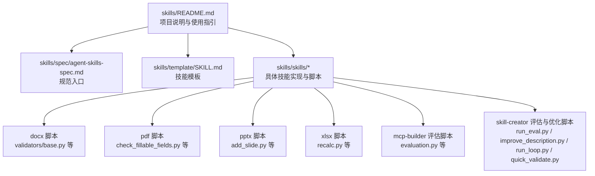
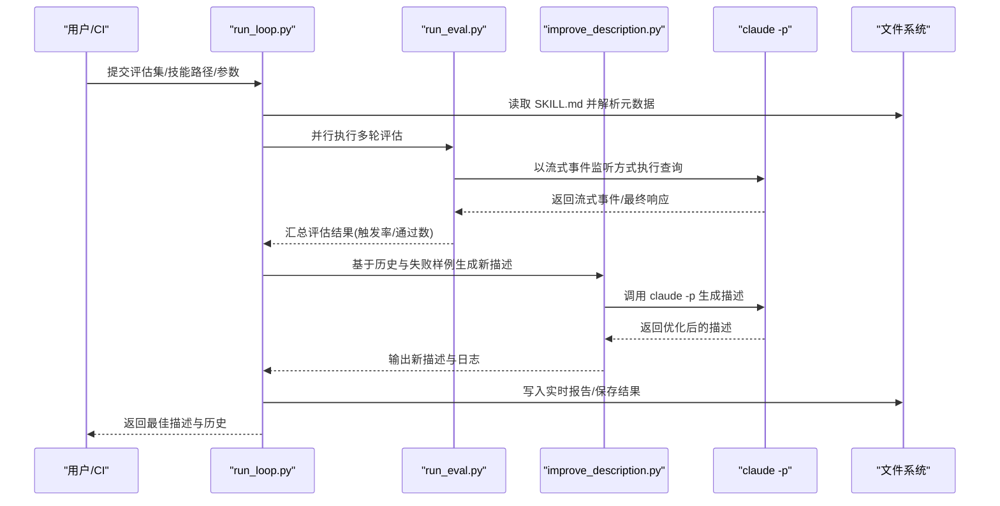
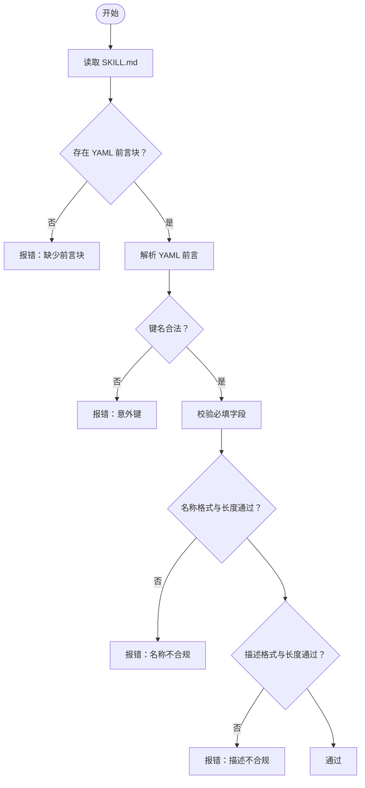
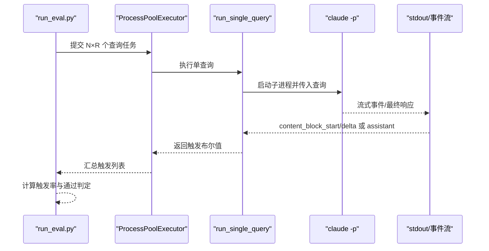
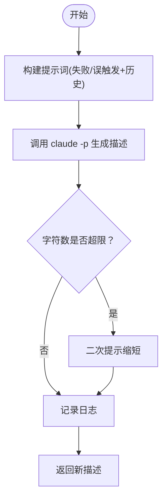
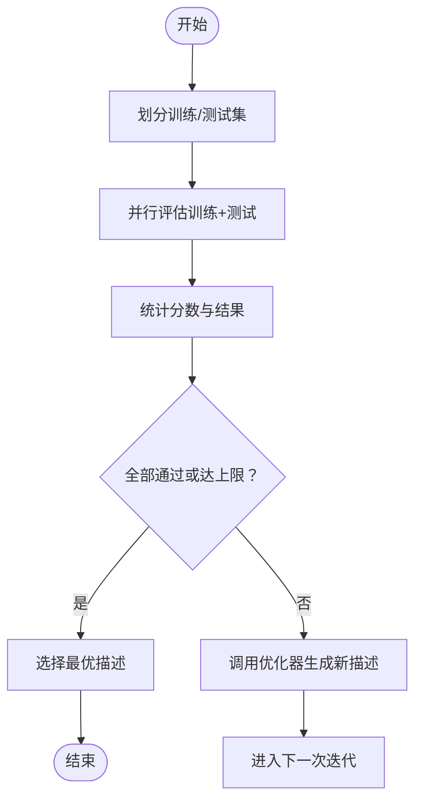
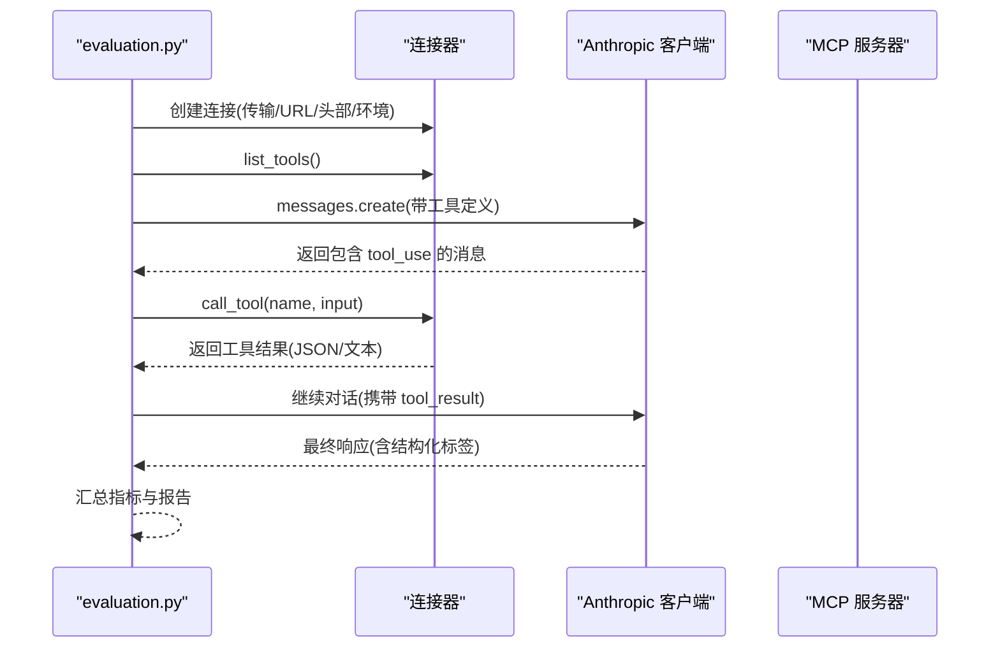
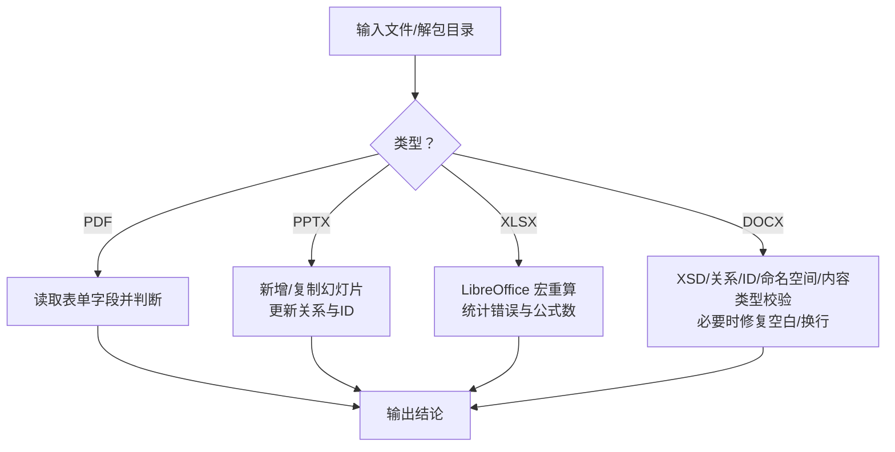
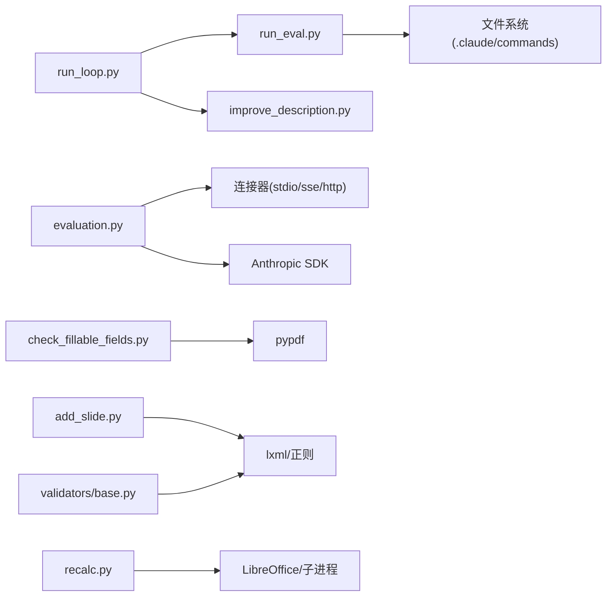
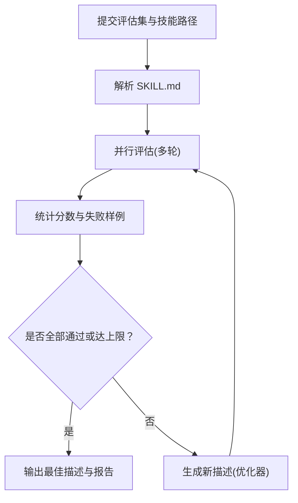

# 数据流与控制流

<cite>
**本文引用的文件**   
- [skills/README.md](file://skills/README.md)
- [skills/spec/agent-skills-spec.md](file://skills/spec/agent-skills-spec.md)
- [skills/template/SKILL.md](file://skills/template/SKILL.md)
- [skills/skills/skill-creator/scripts/quick_validate.py](file://skills/skills/skill-creator/scripts/quick_validate.py)
- [skills/skills/skill-creator/scripts/run_eval.py](file://skills/skills/skill-creator/scripts/run_eval.py)
- [skills/skills/skill-creator/scripts/improve_description.py](file://skills/skills/skill-creator/scripts/improve_description.py)
- [skills/skills/skill-creator/scripts/run_loop.py](file://skills/skills/skill-creator/scripts/run_loop.py)
- [skills/skills/mcp-builder/scripts/evaluation.py](file://skills/skills/mcp-builder/scripts/evaluation.py)
- [skills/skills/pdf/scripts/check_fillable_fields.py](file://skills/skills/pdf/scripts/check_fillable_fields.py)
- [skills/skills/pptx/scripts/add_slide.py](file://skills/skills/pptx/scripts/add_slide.py)
- [skills/skills/xlsx/scripts/recalc.py](file://skills/skills/xlsx/scripts/recalc.py)
- [skills/skills/docx/scripts/office/validators/base.py](file://skills/skills/docx/scripts/office/validators/base.py)
</cite>

## 目录
1. [引言](#引言)
2. [项目结构](#项目结构)
3. [核心组件](#核心组件)
4. [架构总览](#架构总览)
5. [详细组件分析](#详细组件分析)
6. [依赖分析](#依赖分析)
7. [性能考虑](#性能考虑)
8. [故障排查指南](#故障排查指南)
9. [结论](#结论)
10. [附录](#附录)

## 引言
本文件聚焦于技能系统中的“数据流与控制流”，围绕以下目标展开：
- 描述从用户请求到技能执行再到结果返回的完整链路；
- 记录输入参数的验证、处理与转换机制；
- 解释控制流的调度策略、并发处理与异步操作模式；
- 提供数据流图与时序图展示关键操作流程；
- 包含错误传播、异常处理与回滚机制说明。

该仓库以“技能”为最小可执行单元，每个技能由独立目录与元数据文件组成，并通过脚本或工具链完成输入校验、评估、改进与执行。本文将结合技能创建与评估流水线、MCP 服务器评估、以及文档类技能（PDF/PPTX/XLSX/DOCX）的处理脚本进行系统化梳理。

## 项目结构
技能系统采用按功能域分层的组织方式：顶层 skills/ 下包含多种技能示例；skills/spec/ 提供规范链接；skills/template/ 提供模板；各技能内部包含 SKILL.md 元数据与脚本资源。

图表来源
- [skills/README.md:1-95](file://skills/README.md#L1-L95)
- [skills/spec/agent-skills-spec.md:1-4](file://skills/spec/agent-skills-spec.md#L1-L4)
- [skills/template/SKILL.md:1-7](file://skills/template/SKILL.md#L1-L7)
- [skills/skills/docx/scripts/office/validators/base.py:1-848](file://skills/skills/docx/scripts/office/validators/base.py#L1-L848)
- [skills/skills/pdf/scripts/check_fillable_fields.py:1-12](file://skills/skills/pdf/scripts/check_fillable_fields.py#L1-L12)
- [skills/skills/pptx/scripts/add_slide.py:1-196](file://skills/skills/pptx/scripts/add_slide.py#L1-L196)
- [skills/skills/xlsx/scripts/recalc.py:1-185](file://skills/skills/xlsx/scripts/recalc.py#L1-L185)
- [skills/skills/mcp-builder/scripts/evaluation.py:1-374](file://skills/skills/mcp-builder/scripts/evaluation.py#L1-L374)
- [skills/skills/skill-creator/scripts/run_eval.py:1-311](file://skills/skills/skill-creator/scripts/run_eval.py#L1-L311)
- [skills/skills/skill-creator/scripts/improve_description.py:1-248](file://skills/skills/skill-creator/scripts/improve_description.py#L1-L248)
- [skills/skills/skill-creator/scripts/run_loop.py:1-329](file://skills/skills/skill-creator/scripts/run_loop.py#L1-L329)
- [skills/skills/skill-creator/scripts/quick_validate.py:1-103](file://skills/skills/skill-creator/scripts/quick_validate.py#L1-L103)

章节来源
- [skills/README.md:1-95](file://skills/README.md#L1-L95)
- [skills/spec/agent-skills-spec.md:1-4](file://skills/spec/agent-skills-spec.md#L1-L4)
- [skills/template/SKILL.md:1-7](file://skills/template/SKILL.md#L1-L7)

## 核心组件
- 技能元数据与模板：SKILL.md 定义技能名称、描述等元信息，模板提供标准化结构。
- 输入验证器：对技能元数据进行快速校验，确保字段类型、长度与命名规范符合要求。
- 触发评估器：通过调用本地命令行工具模拟用户查询，检测技能是否被正确触发。
- 描述优化器：基于评估结果生成更优的技能描述，迭代提升触发准确率。
- 执行与评估循环：在训练/测试集上运行评估与改进，直至收敛或达到最大迭代次数。
- MCP 服务器评估器：连接并评估外部 MCP 服务器，收集工具调用指标与响应质量。
- 文档类技能处理器：针对 PDF/PPTX/XLSX/DOCX 的特定处理脚本，包括字段检查、幻灯片添加、公式重算与文档校验。

章节来源
- [skills/template/SKILL.md:1-7](file://skills/template/SKILL.md#L1-L7)
- [skills/skills/skill-creator/scripts/quick_validate.py:12-94](file://skills/skills/skill-creator/scripts/quick_validate.py#L12-L94)
- [skills/skills/skill-creator/scripts/run_eval.py:35-182](file://skills/skills/skill-creator/scripts/run_eval.py#L35-L182)
- [skills/skills/skill-creator/scripts/improve_description.py:50-191](file://skills/skills/skill-creator/scripts/improve_description.py#L50-L191)
- [skills/skills/skill-creator/scripts/run_loop.py:47-241](file://skills/skills/skill-creator/scripts/run_loop.py#L47-L241)
- [skills/skills/mcp-builder/scripts/evaluation.py:56-373](file://skills/skills/mcp-builder/scripts/evaluation.py#L56-L373)
- [skills/skills/pdf/scripts/check_fillable_fields.py:7-11](file://skills/skills/pdf/scripts/check_fillable_fields.py#L7-L11)
- [skills/skills/pptx/scripts/add_slide.py:27-162](file://skills/skills/pptx/scripts/add_slide.py#L27-L162)
- [skills/skills/xlsx/scripts/recalc.py:70-161](file://skills/skills/xlsx/scripts/recalc.py#L70-L161)
- [skills/skills/docx/scripts/office/validators/base.py:94-141](file://skills/skills/docx/scripts/office/validators/base.py#L94-L141)

## 架构总览
下图展示了“技能描述优化与评估”的端到端数据流与控制流：

图表来源
- [skills/skills/skill-creator/scripts/run_loop.py:47-241](file://skills/skills/skill-creator/scripts/run_loop.py#L47-L241)
- [skills/skills/skill-creator/scripts/run_eval.py:35-182](file://skills/skills/skill-creator/scripts/run_eval.py#L35-L182)
- [skills/skills/skill-creator/scripts/improve_description.py:20-47](file://skills/skills/skill-creator/scripts/improve_description.py#L20-L47)

## 详细组件分析

### 组件A：技能元数据与输入验证
- 输入参数
  - 技能目录路径
  - SKILL.md 文件内容
- 处理与转换
  - 读取并解析 YAML 前言块
  - 校验键集合、类型与长度限制
  - 对名称进行 kebab-case 校验与长度约束
  - 对描述进行字符集与长度校验
- 错误传播
  - 非法格式、缺失字段、超长或不合规值均直接返回错误信息
- 控制流
  - 快速失败策略：任一校验项失败即终止
  - 无并发与异步操作

图表来源
- [skills/skills/skill-creator/scripts/quick_validate.py:12-94](file://skills/skills/skill-creator/scripts/quick_validate.py#L12-L94)

章节来源
- [skills/skills/skill-creator/scripts/quick_validate.py:12-94](file://skills/skills/skill-creator/scripts/quick_validate.py#L12-L94)

### 组件B：触发评估器（并行）
- 输入参数
  - 评估集（每条包含查询与期望触发标记）
  - 技能名称/描述
  - 并行工作进程数、单查询超时、每查询运行次数、阈值、模型
- 处理与转换
  - 为每次查询动态生成命令文件，注入技能描述
  - 使用流式事件监听提前判断是否触发（content_block_start/delta）
  - 回退到完整助手消息解析
  - 将多次运行结果聚合为触发率并判定通过与否
- 并发与异步
  - 使用进程池并发执行多个查询
  - 使用 select 轮询子进程输出，避免阻塞
- 错误传播
  - 单查询异常记录为未触发，继续其他任务
  - 子进程清理在 finally 中保证
- 控制流
  - 早期退出：达到阈值即判定通过
  - 超时与清理：统一回收资源

图表来源
- [skills/skills/skill-creator/scripts/run_eval.py:184-256](file://skills/skills/skill-creator/scripts/run_eval.py#L184-L256)
- [skills/skills/skill-creator/scripts/run_eval.py:35-182](file://skills/skills/skill-creator/scripts/run_eval.py#L35-L182)

章节来源
- [skills/skills/skill-creator/scripts/run_eval.py:184-256](file://skills/skills/skill-creator/scripts/run_eval.py#L184-L256)
- [skills/skills/skill-creator/scripts/run_eval.py:35-182](file://skills/skills/skill-creator/scripts/run_eval.py#L35-L182)

### 组件C：描述优化器（外部模型调用）
- 输入参数
  - 当前描述、评估结果、历史、模型、迭代号
- 处理与转换
  - 汇总失败触发与误触发样例，构建提示词
  - 调用 claude -p 生成新描述
  - 若超过字符上限，二次提示缩短
  - 记录对话与中间产物到日志
- 并发与异步
  - 作为独立脚本运行，不涉及并发
- 错误传播
  - 子进程非零退出抛出异常，调用方捕获
- 控制流
  - 逐步完善与收敛，支持多次迭代

图表来源
- [skills/skills/skill-creator/scripts/improve_description.py:50-191](file://skills/skills/skill-creator/scripts/improve_description.py#L50-L191)

章节来源
- [skills/skills/skill-creator/scripts/improve_description.py:50-191](file://skills/skills/skill-creator/scripts/improve_description.py#L50-L191)

### 组件D：评估与改进循环
- 输入参数
  - 评估集、技能路径、起始描述、并行度、超时、最大迭代、每查询运行次数、训练/测试拆分比例、阈值、模型、是否输出实时报告
- 处理与转换
  - 划分训练/测试集（按 should_trigger 分层）
  - 运行一轮评估，拆分结果并统计
  - 若未全部通过且未达上限，调用优化器生成新描述
  - 实时生成 HTML 报告并可自动刷新
- 并发与异步
  - 评估阶段使用进程池并行
  - 循环内串行优化，但评估本身并行
- 错误传播
  - 评估异常不影响整体流程，记录为未触发
- 控制流
  - 达到阈值或最大迭代次数后退出
  - 选择测试集最优（若存在）或训练集最优作为最终结果

图表来源
- [skills/skills/skill-creator/scripts/run_loop.py:47-241](file://skills/skills/skill-creator/scripts/run_loop.py#L47-L241)

章节来源
- [skills/skills/skill-creator/scripts/run_loop.py:47-241](file://skills/skills/skill-creator/scripts/run_loop.py#L47-L241)

### 组件E：MCP 服务器评估器（异步）
- 输入参数
  - 评估 XML 文件、传输方式（stdio/sse/http）、模型、远程 URL/头部、输出文件
- 处理与转换
  - 解析评估文件为问答对
  - 通过连接器列出工具并建立会话
  - 异步循环：发送问题、等待工具调用、接收工具结果、累计指标
  - 提取 
/<feedback>/<response> 结构化输出
- 并发与异步
  - 使用 asyncio 并发执行多个问答对
  - 工具调用通过连接器异步调用
- 错误传播
  - 工具调用异常捕获并记录堆栈
  - 连接器初始化失败抛出异常
- 控制流
  - 基于 stop_reason/tool_use 判定继续对话或结束

图表来源
- [skills/skills/mcp-builder/scripts/evaluation.py:86-151](file://skills/skills/mcp-builder/scripts/evaluation.py#L86-L151)
- [skills/skills/mcp-builder/scripts/evaluation.py:220-272](file://skills/skills/mcp-builder/scripts/evaluation.py#L220-L272)

章节来源
- [skills/skills/mcp-builder/scripts/evaluation.py:86-151](file://skills/skills/mcp-builder/scripts/evaluation.py#L86-L151)
- [skills/skills/mcp-builder/scripts/evaluation.py:220-272](file://skills/skills/mcp-builder/scripts/evaluation.py#L220-L272)

### 组件F：文档类技能处理器（示例）
- PDF 字段检查
  - 读取 PDF 表单字段，输出是否存在可填写字段的结论
- PPTX 新增幻灯片
  - 支持从布局复制或重复现有幻灯片
  - 更新 [Content_Types].xml 与 presentation.xml.rels
  - 计算下一个 slideId
- XLSX 公式重算
  - 通过 LibreOffice 宏执行重算
  - 解析工作簿统计错误类型与数量
- DOCX 文档校验
  - 基于 XSD 与关系/ID/命名空间/内容类型等规则进行验证与修复

图表来源
- [skills/skills/pdf/scripts/check_fillable_fields.py:7-11](file://skills/skills/pdf/scripts/check_fillable_fields.py#L7-L11)
- [skills/skills/pptx/scripts/add_slide.py:27-162](file://skills/skills/pptx/scripts/add_slide.py#L27-L162)
- [skills/skills/xlsx/scripts/recalc.py:70-161](file://skills/skills/xlsx/scripts/recalc.py#L70-L161)
- [skills/skills/docx/scripts/office/validators/base.py:94-141](file://skills/skills/docx/scripts/office/validators/base.py#L94-L141)

章节来源
- [skills/skills/pdf/scripts/check_fillable_fields.py:7-11](file://skills/skills/pdf/scripts/check_fillable_fields.py#L7-L11)
- [skills/skills/pptx/scripts/add_slide.py:27-162](file://skills/skills/pptx/scripts/add_slide.py#L27-L162)
- [skills/skills/xlsx/scripts/recalc.py:70-161](file://skills/skills/xlsx/scripts/recalc.py#L70-L161)
- [skills/skills/docx/scripts/office/validators/base.py:94-141](file://skills/skills/docx/scripts/office/validators/base.py#L94-L141)

## 依赖分析
- 组件耦合
  - run_loop 依赖 run_eval 与 improve_description，形成“评估-优化”闭环
  - run_eval 依赖 claude -p 与文件系统（.claude/commands），用于动态注入技能命令
  - evaluation 依赖连接器抽象（stdio/sse/http），与 MCP 服务器交互
  - 文档类处理器依赖第三方库（如 pypdf、lxml、openpyxl）与系统工具（LibreOffice）
- 外部依赖
  - Anthropic SDK（用于 MCP 评估）
  - Python 标准库与第三方库（subprocess、select、concurrent.futures、lxml、openpyxl 等）

图表来源
- [skills/skills/skill-creator/scripts/run_loop.py:47-241](file://skills/skills/skill-creator/scripts/run_loop.py#L47-L241)
- [skills/skills/skill-creator/scripts/run_eval.py:35-182](file://skills/skills/skill-creator/scripts/run_eval.py#L35-L182)
- [skills/skills/mcp-builder/scripts/evaluation.py:17-19](file://skills/skills/mcp-builder/scripts/evaluation.py#L17-L19)
- [skills/skills/pdf/scripts/check_fillable_fields.py:2](file://skills/skills/pdf/scripts/check_fillable_fields.py#L2)
- [skills/skills/pptx/scripts/add_slide.py:21-24](file://skills/skills/pptx/scripts/add_slide.py#L21-L24)
- [skills/skills/xlsx/scripts/recalc.py:6-11](file://skills/skills/xlsx/scripts/recalc.py#L6-L11)
- [skills/skills/docx/scripts/office/validators/base.py:5-9](file://skills/skills/docx/scripts/office/validators/base.py#L5-L9)

章节来源
- [skills/skills/mcp-builder/scripts/evaluation.py:17-19](file://skills/skills/mcp-builder/scripts/evaluation.py#L17-L19)
- [skills/skills/pdf/scripts/check_fillable_fields.py:2](file://skills/skills/pdf/scripts/check_fillable_fields.py#L2)
- [skills/skills/pptx/scripts/add_slide.py:21-24](file://skills/skills/pptx/scripts/add_slide.py#L21-L24)
- [skills/skills/xlsx/scripts/recalc.py:6-11](file://skills/skills/xlsx/scripts/recalc.py#L6-L11)
- [skills/skills/docx/scripts/office/validators/base.py:5-9](file://skills/skills/docx/scripts/office/validators/base.py#L5-L9)

## 性能考虑
- 并行评估
  - 使用进程池并发执行查询，显著降低总体评估时间
  - 建议根据 CPU 核心数与 I/O 特性调整 num_workers
- I/O 与流式处理
  - 通过 select 轮询子进程输出，避免阻塞，提高吞吐
- 外部工具开销
  - LibreOffice 宏重算耗时较长，建议设置合理超时并缓存中间结果
- 日志与报告
  - 实时 HTML 报告可自动刷新，便于观察进度，但需注意磁盘写入频率

## 故障排查指南
- 技能描述过长或包含非法字符
  - 现象：快速校验失败
  - 排查：检查描述长度与字符集
  - 参考
    - [skills/skills/skill-creator/scripts/quick_validate.py:74-84](file://skills/skills/skill-creator/scripts/quick_validate.py#L74-L84)
- 触发评估未命中
  - 现象：触发率低于阈值
  - 排查：检查描述关键词、意图覆盖与历史失败样例
  - 参考
    - [skills/skills/skill-creator/scripts/run_eval.py:227-242](file://skills/skills/skill-creator/scripts/run_eval.py#L227-L242)
    - [skills/skills/skill-creator/scripts/improve_description.py:62-101](file://skills/skills/skill-creator/scripts/improve_description.py#L62-L101)
- MCP 服务器连接失败
  - 现象：连接器初始化或工具列表获取报错
  - 排查：确认传输方式、URL/头部、鉴权与网络连通性
  - 参考
    - [skills/skills/mcp-builder/scripts/evaluation.py:346-357](file://skills/skills/mcp-builder/scripts/evaluation.py#L346-L357)
- LibreOffice 宏未配置
  - 现象：公式重算失败或返回宏未配置错误
  - 排查：确认宏目录存在、宏文件内容正确、平台兼容
  - 参考
    - [skills/skills/xlsx/scripts/recalc.py:42-67](file://skills/skills/xlsx/scripts/recalc.py#L42-L67)
- 文档校验失败
  - 现象：XSD/关系/ID/命名空间/内容类型校验报错
  - 排查：检查 [Content_Types].xml、.rels 文件与唯一 ID
  - 参考
    - [skills/skills/docx/scripts/office/validators/base.py:598-683](file://skills/skills/docx/scripts/office/validators/base.py#L598-L683)

章节来源
- [skills/skills/skill-creator/scripts/quick_validate.py:74-84](file://skills/skills/skill-creator/scripts/quick_validate.py#L74-L84)
- [skills/skills/skill-creator/scripts/run_eval.py:227-242](file://skills/skills/skill-creator/scripts/run_eval.py#L227-L242)
- [skills/skills/mcp-builder/scripts/evaluation.py:346-357](file://skills/skills/mcp-builder/scripts/evaluation.py#L346-L357)
- [skills/skills/xlsx/scripts/recalc.py:42-67](file://skills/skills/xlsx/scripts/recalc.py#L42-L67)
- [skills/skills/docx/scripts/office/validators/base.py:598-683](file://skills/skills/docx/scripts/office/validators/base.py#L598-L683)

## 结论
本技能系统通过“元数据校验—触发评估—描述优化—循环收敛”的闭环，实现了对技能描述质量的持续改进。同时，MCP 评估器与各类文档处理脚本展示了真实工程中数据流与控制流的典型模式：参数验证与转换、并发与异步调度、错误传播与资源清理。建议在生产环境中：
- 明确输入参数的边界与默认值，统一错误码与日志格式
- 在高 I/O 场景下合理配置并行度与超时
- 对外部工具（如 LibreOffice）增加健康检查与降级策略
- 在 MCP 评估中记录工具调用耗时与错误分布，辅助定位问题

## 附录
- 触发评估与优化流程图（概念示意）
