# 整体架构设计

<cite>
**本文引用的文件**
- [skills/README.md](file://skills/README.md)
- [skills/spec/agent-skills-spec.md](file://skills/spec/agent-skills-spec.md)
- [skills/template/SKILL.md](file://skills/template/SKILL.md)
- [skills/.claude-plugin/marketplace.json](file://skills/.claude-plugin/marketplace.json)
- [skills/skills/algorithmic-art/SKILL.md](file://skills/skills/algorithmic-art/SKILL.md)
- [skills/skills/canvas-design/SKILL.md](file://skills/skills/canvas-design/SKILL.md)
- [skills/skills/claude-api/SKILL.md](file://skills/skills/claude-api/SKILL.md)
- [skills/skills/mcp-builder/SKILL.md](file://skills/skills/mcp-builder/SKILL.md)
- [skills/skills/web-artifacts-builder/SKILL.md](file://skills/skills/web-artifacts-builder/SKILL.md)
- [skills/skills/skill-creator/SKILL.md](file://skills/skills/skill-creator/SKILL.md)
- [skills/skills/skill-creator/scripts/package_skill.py](file://skills/skills/skill-creator/scripts/package_skill.py)
- [skills/skills/skill-creator/scripts/quick_validate.py](file://skills/skills/skill-creator/scripts/quick_validate.py)
</cite>

## 目录
1. [引言](#引言)
2. [项目结构](#项目结构)
3. [核心组件](#核心组件)
4. [架构总览](#架构总览)
5. [详细组件分析](#详细组件分析)
6. [依赖分析](#依赖分析)
7. [性能考虑](#性能考虑)
8. [故障排查指南](#故障排查指南)
9. [结论](#结论)
10. [附录](#附录)

## 引言
本架构文档面向“技能系统”的整体设计，聚焦于其高层架构模式、设计理念与系统边界。该系统以“可插拔技能”为核心，通过标准化的元数据与内容组织方式，使 Claude 能够在对话过程中按需加载与调用特定能力（如文档处理、可视化生成、MCP 服务构建等）。系统采用模块化插件架构，强调技能的独立性、可发现性与可分发性，并通过统一的触发机制与资源管理策略支撑跨平台集成。

## 项目结构
仓库采用“技能集合 + 插件市场配置 + 规范与模板”的组织方式：
- 技能集合：skills/skills 下包含多个自包含的技能目录，每个技能以 SKILL.md 作为元数据与指令入口。
- 插件市场：skills/.claude-plugin/marketplace.json 定义了插件名称、所有者、版本以及技能集合的映射关系。
- 规范与模板：skills/spec 提供规范链接；skills/template 提供最小可用模板。
- 工具链：skills/skills/skill-creator 提供技能打包、验证与评测工具，支撑技能的创建、优化与分发。

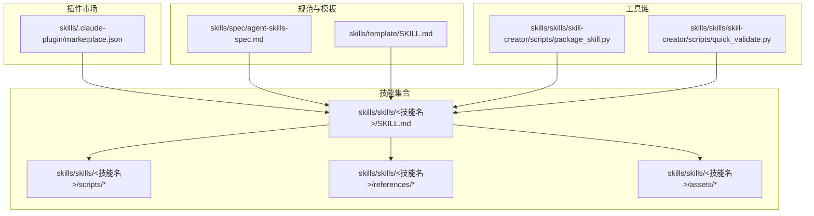

图表来源
- [skills/.claude-plugin/marketplace.json:1-56](file://skills/.claude-plugin/marketplace.json#L1-L56)
- [skills/skills/algorithmic-art/SKILL.md:1-405](file://skills/skills/algorithmic-art/SKILL.md#L1-L405)
- [skills/skills/skill-creator/SKILL.md:75-84](file://skills/skills/skill-creator/SKILL.md#L75-L84)
- [skills/skills/skill-creator/scripts/package_skill.py:1-137](file://skills/skills/skill-creator/scripts/package_skill.py#L1-L137)
- [skills/skills/skill-creator/scripts/quick_validate.py:1-103](file://skills/skills/skill-creator/scripts/quick_validate.py#L1-L103)

章节来源
- [skills/README.md:1-95](file://skills/README.md#L1-L95)
- [skills/spec/agent-skills-spec.md:1-4](file://skills/spec/agent-skills-spec.md#L1-L4)
- [skills/template/SKILL.md:1-7](file://skills/template/SKILL.md#L1-L7)
- [skills/.claude-plugin/marketplace.json:1-56](file://skills/.claude-plugin/marketplace.json#L1-L56)

## 核心组件
- 技能注册中心（基于插件市场配置）
  - 通过 marketplace.json 将技能集合映射到插件，支持多套技能集合（如文档技能、示例技能、API 文档）。
  - 插件定义包含名称、描述、源路径与技能列表，驱动平台侧的技能发现与安装流程。
- 执行引擎（技能触发与上下文加载）
  - 基于 SKILL.md 的元数据（name、description 等）进行触发判定，按需加载技能正文与资源。
  - 支持三段式渐进披露：元数据（约100词）、SKILL.md 正文（触发时加载，建议<500行）、资源（按需加载）。
- 资源管理器（脚本、参考与资产）
  - 技能内 scripts/ 用于可确定性的重复任务；references/ 用于按需加载文档；assets/ 用于输出模板或字体等资源。
- 分发与质量保障（打包与校验）
  - package_skill.py 将技能目录打包为 .skill 文件，排除构建产物与测试目录；quick_validate.py 校验 SKILL.md 元数据格式与字段约束。

章节来源
- [skills/.claude-plugin/marketplace.json:11-54](file://skills/.claude-plugin/marketplace.json#L11-L54)
- [skills/skills/skill-creator/SKILL.md:88-109](file://skills/skills/skill-creator/SKILL.md#L88-L109)
- [skills/skills/skill-creator/scripts/package_skill.py:19-40](file://skills/skills/skill-creator/scripts/package_skill.py#L19-L40)
- [skills/skills/skill-creator/scripts/quick_validate.py:42-94](file://skills/skills/skill-creator/scripts/quick_validate.py#L42-L94)

## 架构总览
技能系统围绕“插件市场配置 + 技能元数据 + 渐进上下文加载 + 资源按需访问 + 打包分发”的闭环展开。系统边界以内核为“触发与加载”，以外部为“平台集成与用户交互”。下图展示了系统与 Claude 平台的集成关系：

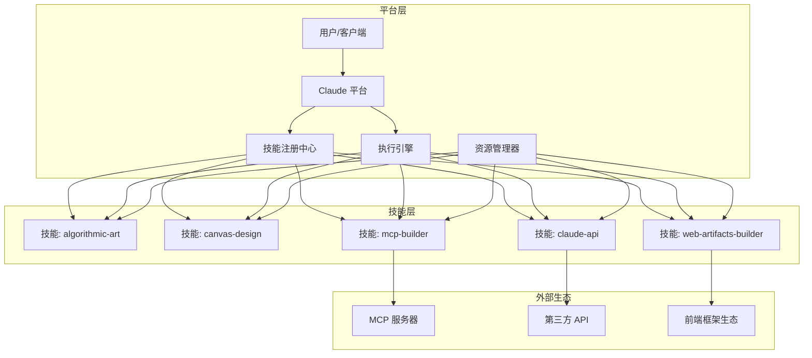

图表来源
- [skills/.claude-plugin/marketplace.json:11-54](file://skills/.claude-plugin/marketplace.json#L11-L54)
- [skills/skills/claude-api/SKILL.md:119-131](file://skills/skills/claude-api/SKILL.md#L119-L131)
- [skills/skills/mcp-builder/SKILL.md:9-11](file://skills/skills/mcp-builder/SKILL.md#L9-L11)
- [skills/skills/web-artifacts-builder/SKILL.md:16-16](file://skills/skills/web-artifacts-builder/SKILL.md#L16-L16)

## 详细组件分析

### 组件一：技能注册中心（插件市场）
- 职责
  - 定义插件清单与技能集合映射，提供平台侧的安装与发现入口。
  - 通过严格字段控制（名称、描述、源路径、技能数组）确保一致性与可维护性。
- 关键点
  - 多个插件集合（文档技能、示例技能、API 文档）并存，便于按场景选择。
  - 源路径与技能相对路径明确，利于平台解析与加载。

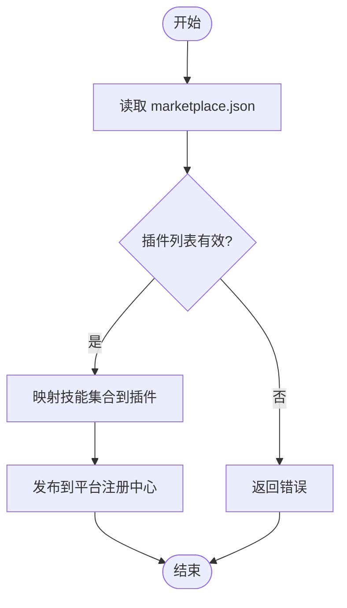

图表来源
- [skills/.claude-plugin/marketplace.json:11-54](file://skills/.claude-plugin/marketplace.json#L11-L54)

章节来源
- [skills/.claude-plugin/marketplace.json:1-56](file://skills/.claude-plugin/marketplace.json#L1-L56)

### 组件二：执行引擎（触发与上下文加载）
- 职责
  - 基于 SKILL.md 元数据进行触发判断；按需加载正文与资源；控制上下文大小与加载顺序。
- 关键点
  - 渐进披露：元数据始终在上下文；正文仅在触发时加载；资源按需加载，避免不必要的 IO。
  - 触发机制：description 字段是主要触发依据；复杂多步任务更易触发技能。

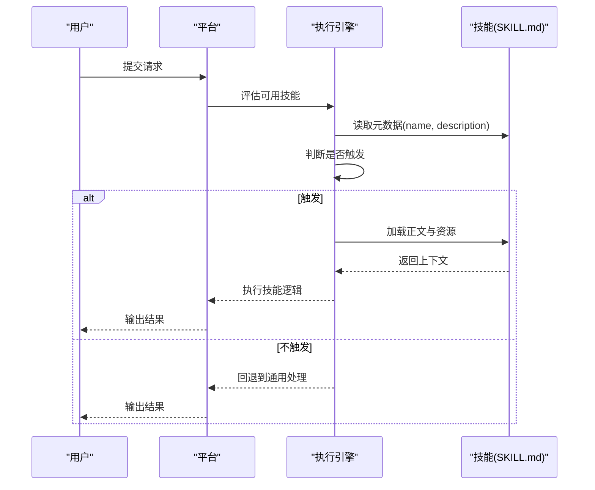

图表来源
- [skills/skills/skill-creator/SKILL.md:88-109](file://skills/skills/skill-creator/SKILL.md#L88-L109)
- [skills/skills/skill-creator/SKILL.md:396-401](file://skills/skills/skill-creator/SKILL.md#L396-L401)

章节来源
- [skills/skills/skill-creator/SKILL.md:88-109](file://skills/skills/skill-creator/SKILL.md#L88-L109)
- [skills/skills/skill-creator/SKILL.md:396-401](file://skills/skills/skill-creator/SKILL.md#L396-L401)

### 组件三：资源管理器（脚本、参考与资产）
- 职责
  - 统一管理技能内的脚本、参考文档与资产，支持按需加载与执行。
- 关键点
  - scripts/ 适合确定性重复任务；references/ 适合按需加载文档；assets/ 适合模板与字体等静态资源。
  - 与渐进披露配合，减少初始上下文体积。

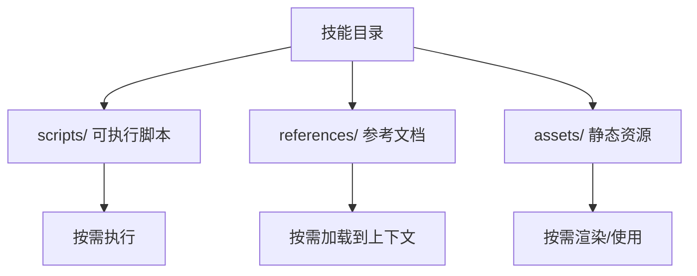

图表来源
- [skills/skills/skill-creator/SKILL.md:75-84](file://skills/skills/skill-creator/SKILL.md#L75-L84)

章节来源
- [skills/skills/skill-creator/SKILL.md:75-84](file://skills/skills/skill-creator/SKILL.md#L75-L84)

### 组件四：分发与质量保障（打包与校验）
- 职责
  - package_skill.py 将技能目录打包为 .skill 文件，排除构建产物与测试目录；quick_validate.py 校验 SKILL.md 元数据格式与字段约束。
- 关键点
  - 排除规则覆盖常见构建产物与测试目录，保证分发包精简；
  - 元数据校验涵盖字段类型、命名规范、长度限制等，降低运行期风险。

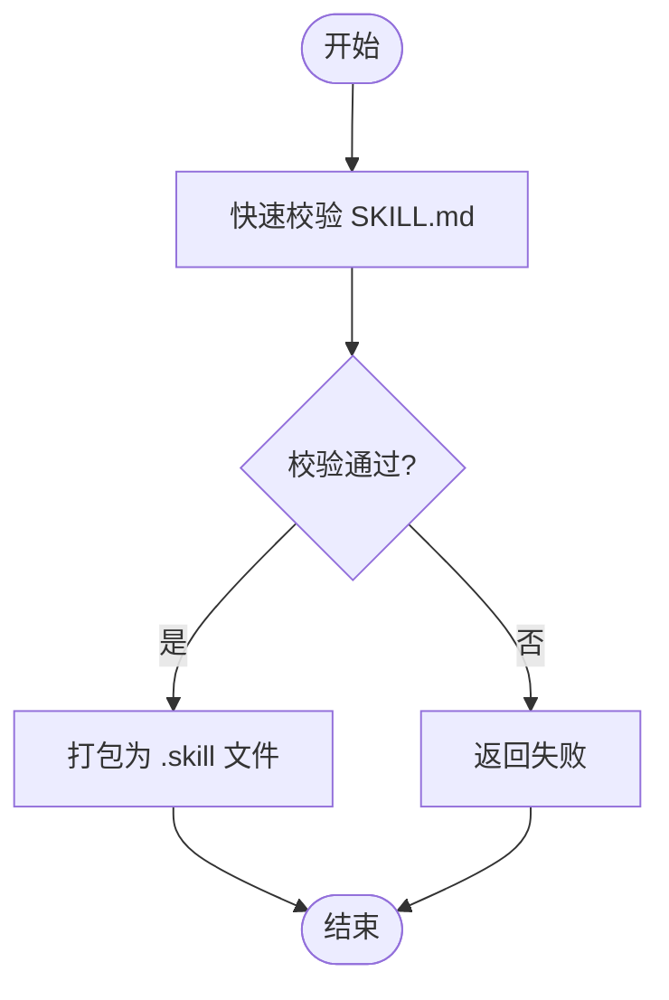

图表来源
- [skills/skills/skill-creator/scripts/quick_validate.py:12-94](file://skills/skills/skill-creator/scripts/quick_validate.py#L12-L94)
- [skills/skills/skill-creator/scripts/package_skill.py:42-108](file://skills/skills/skill-creator/scripts/package_skill.py#L42-L108)

章节来源
- [skills/skills/skill-creator/scripts/quick_validate.py:1-103](file://skills/skills/skill-creator/scripts/quick_validate.py#L1-L103)
- [skills/skills/skill-creator/scripts/package_skill.py:1-137](file://skills/skills/skill-creator/scripts/package_skill.py#L1-L137)

### 技能样例：算法艺术（algorithmic-art）
- 设计理念
  - 以“算法哲学”为起点，强调过程而非静态产物；通过参数化与种子随机性实现可控混沌。
- 关键流程
  - 创建算法哲学 → 实现 p5.js 交互式作品 → 参数与种子控制 → 单文件自包含产物。
- 与系统边界的交互
  - 使用模板与生成器模板，遵循固定 UI 结构与品牌风格，同时允许算法与参数自由度。

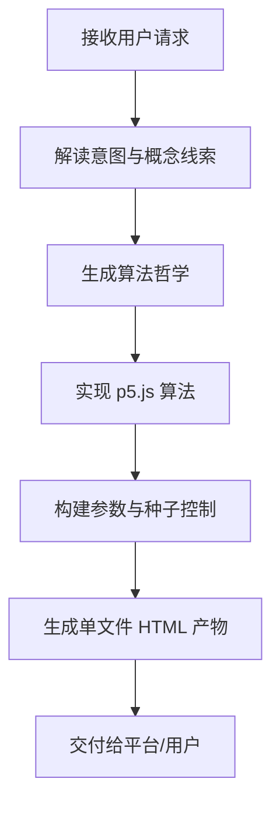

图表来源
- [skills/skills/algorithmic-art/SKILL.md:13-21](file://skills/skills/algorithmic-art/SKILL.md#L13-L21)
- [skills/skills/algorithmic-art/SKILL.md:101-128](file://skills/skills/algorithmic-art/SKILL.md#L101-L128)
- [skills/skills/algorithmic-art/SKILL.md:221-356](file://skills/skills/algorithmic-art/SKILL.md#L221-L356)

章节来源
- [skills/skills/algorithmic-art/SKILL.md:1-405](file://skills/skills/algorithmic-art/SKILL.md#L1-L405)

### 技能样例：画布设计（canvas-design）
- 设计理念
  - 以“视觉哲学”为核心，强调空间、色彩与构成；最终输出为 PDF/PNG。
- 关键流程
  - 创建视觉哲学 → 解析微妙主题 → 在画布上表达 → 最终输出与优化。

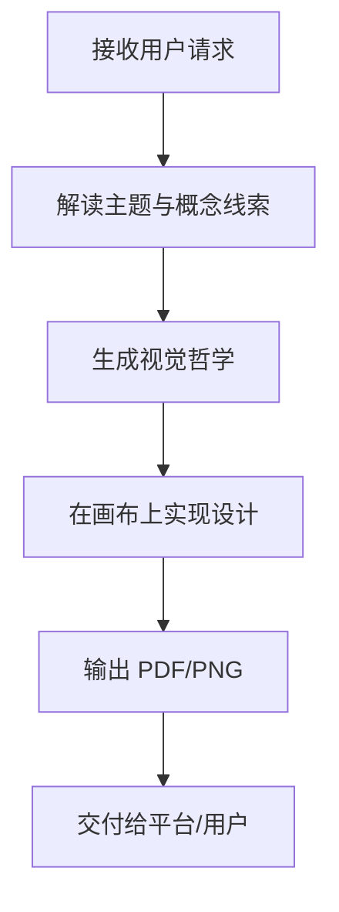

图表来源
- [skills/skills/canvas-design/SKILL.md:13-26](file://skills/skills/canvas-design/SKILL.md#L13-L26)
- [skills/skills/canvas-design/SKILL.md:100-117](file://skills/skills/canvas-design/SKILL.md#L100-L117)

章节来源
- [skills/skills/canvas-design/SKILL.md:1-130](file://skills/skills/canvas-design/SKILL.md#L1-L130)

### 技能样例：Claude API（claude-api）
- 设计理念
  - 提供 Claude API 与 Agent SDK 的使用指导，覆盖语言检测、表面选择、架构说明与最佳实践。
- 关键流程
  - 语言检测 → 表面选择 → 架构说明 → 文档阅读指引 → 常见陷阱与注意事项。

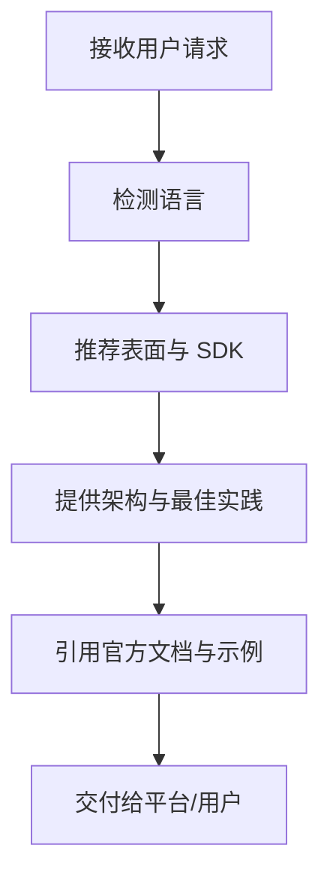

图表来源
- [skills/skills/claude-api/SKILL.md:19-52](file://skills/skills/claude-api/SKILL.md#L19-L52)
- [skills/skills/claude-api/SKILL.md:68-104](file://skills/skills/claude-api/SKILL.md#L68-L104)
- [skills/skills/claude-api/SKILL.md:119-131](file://skills/skills/claude-api/SKILL.md#L119-L131)

章节来源
- [skills/skills/claude-api/SKILL.md:1-244](file://skills/skills/claude-api/SKILL.md#L1-L244)

### 技能样例：MCP 构建器（mcp-builder）
- 设计理念
  - 指导构建高质量 MCP 服务器，强调工具命名、上下文管理与错误消息可操作性。
- 关键流程
  - 深入研究与规划 → 实现基础设施 → 实现工具 → 评审与测试 → 创建评估。

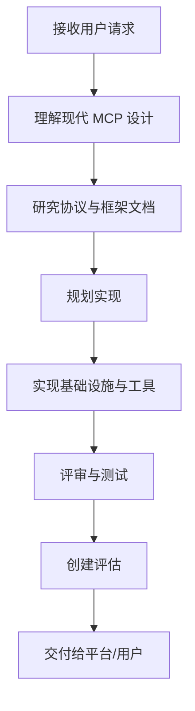

图表来源
- [skills/skills/mcp-builder/SKILL.md:23-36](file://skills/skills/mcp-builder/SKILL.md#L23-L36)
- [skills/skills/mcp-builder/SKILL.md:78-125](file://skills/skills/mcp-builder/SKILL.md#L78-L125)
- [skills/skills/mcp-builder/SKILL.md:151-194](file://skills/skills/mcp-builder/SKILL.md#L151-L194)

章节来源
- [skills/skills/mcp-builder/SKILL.md:1-237](file://skills/skills/mcp-builder/SKILL.md#L1-L237)

### 技能样例：Web 艺术工坊（web-artifacts-builder）
- 设计理念
  - 使用现代前端技术栈（React/Tailwind/shadcn/ui）构建复杂的 Claude 艺术品，支持状态管理与路由。
- 关键流程
  - 初始化项目 → 开发制品 → 打包为单文件 HTML → 分享与可选测试。

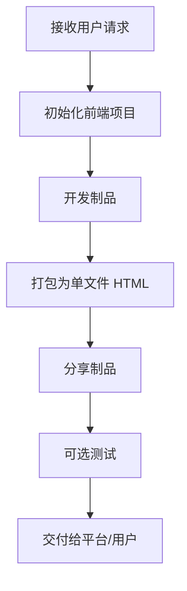

图表来源
- [skills/skills/web-artifacts-builder/SKILL.md:9-16](file://skills/skills/web-artifacts-builder/SKILL.md#L9-L16)
- [skills/skills/web-artifacts-builder/SKILL.md:24-54](file://skills/skills/web-artifacts-builder/SKILL.md#L24-L54)

章节来源
- [skills/skills/web-artifacts-builder/SKILL.md:1-74](file://skills/skills/web-artifacts-builder/SKILL.md#L1-L74)

## 依赖分析
- 内部耦合
  - marketplace.json 与各技能目录强关联，确保平台侧的可发现性与可安装性。
  - 执行引擎依赖 SKILL.md 的元数据与正文结构，资源管理器依赖技能内部的 scripts/references/assets 组织。
- 外部依赖
  - Claude API 与 Agent SDK：为技能提供对外接口与工具调用能力。
  - MCP 生态：为外部服务与工具提供统一协议与传输机制。
  - 前端生态：为复杂制品提供现代化开发与打包能力。

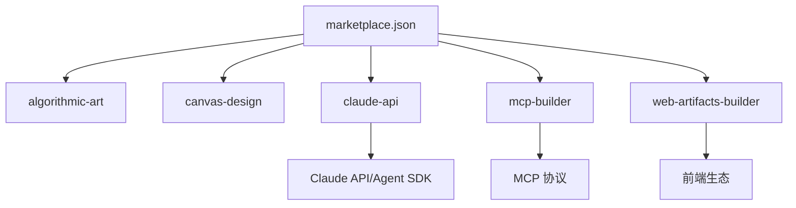

图表来源
- [skills/.claude-plugin/marketplace.json:11-54](file://skills/.claude-plugin/marketplace.json#L11-L54)
- [skills/skills/claude-api/SKILL.md:119-131](file://skills/skills/claude-api/SKILL.md#L119-L131)
- [skills/skills/mcp-builder/SKILL.md:9-11](file://skills/skills/mcp-builder/SKILL.md#L9-L11)
- [skills/skills/web-artifacts-builder/SKILL.md:16-16](file://skills/skills/web-artifacts-builder/SKILL.md#L16-L16)

章节来源
- [skills/.claude-plugin/marketplace.json:1-56](file://skills/.claude-plugin/marketplace.json#L1-L56)
- [skills/skills/claude-api/SKILL.md:1-244](file://skills/skills/claude-api/SKILL.md#L1-L244)
- [skills/skills/mcp-builder/SKILL.md:1-237](file://skills/skills/mcp-builder/SKILL.md#L1-L237)
- [skills/skills/web-artifacts-builder/SKILL.md:1-74](file://skills/skills/web-artifacts-builder/SKILL.md#L1-L74)

## 性能考虑
- 上下文控制
  - 渐进披露减少初始加载量，提升响应速度；仅在触发时加载正文与资源。
- 资源按需
  - scripts/references/assets 按需访问，避免不必要的 IO 与内存占用。
- 打包优化
  - .skill 文件排除构建产物与测试目录，减小分发体积；单文件制品便于直接运行与分享。

## 故障排查指南
- 触发问题
  - 检查 SKILL.md 的 description 是否足够具体且覆盖真实使用场景；复杂多步任务更易触发。
- 元数据校验失败
  - 使用 quick_validate.py 检查 name、description、compatibility 等字段的格式与长度限制。
- 打包失败
  - 确认技能目录存在 SKILL.md；检查排除规则是否误删必要文件；查看打包日志定位异常。

章节来源
- [skills/skills/skill-creator/scripts/quick_validate.py:42-94](file://skills/skills/skill-creator/scripts/quick_validate.py#L42-L94)
- [skills/skills/skill-creator/scripts/package_skill.py:53-108](file://skills/skills/skill-creator/scripts/package_skill.py#L53-L108)
- [skills/skills/skill-creator/SKILL.md:396-401](file://skills/skills/skill-creator/SKILL.md#L396-L401)

## 结论
该技能系统以“标准化元数据 + 渐进上下文加载 + 资源按需访问 + 统一分发”为核心，形成高内聚、低耦合的模块化插件架构。通过 marketplace.json 与 SKILL.md 的协同，系统实现了技能的可发现、可触发与可扩展；借助工具链保障质量与一致性。在与 Claude 平台的集成中，系统边界清晰，职责明确，既满足通用场景，又为复杂任务提供灵活扩展。

## 附录
- Agent Skills 规范
  - 规范地址：https://agentskills.io/specification
- 技能模板
  - 提供最小可用模板，便于快速创建新技能。

章节来源
- [skills/spec/agent-skills-spec.md:1-4](file://skills/spec/agent-skills-spec.md#L1-L4)
- [skills/template/SKILL.md:1-7](file://skills/template/SKILL.md#L1-L7)