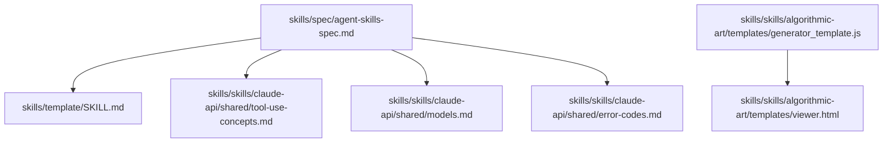
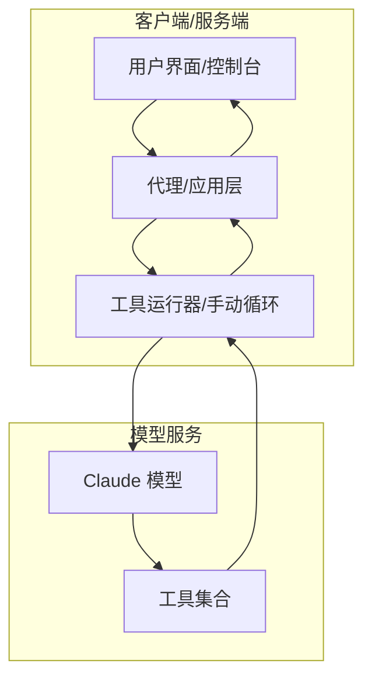
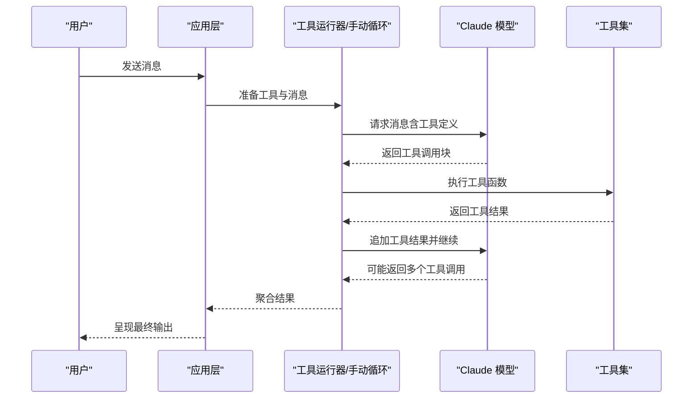
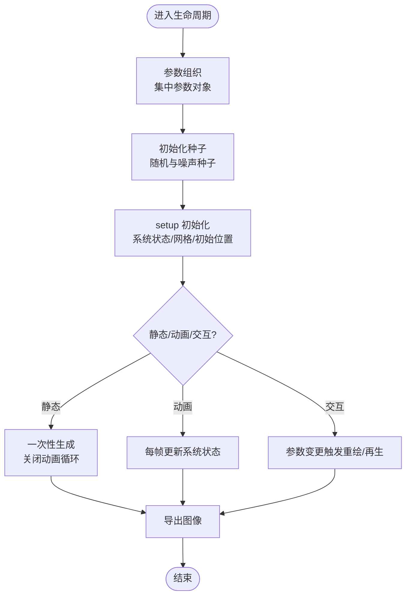
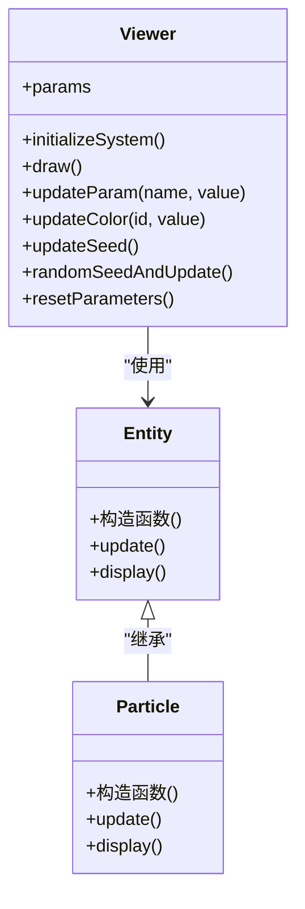
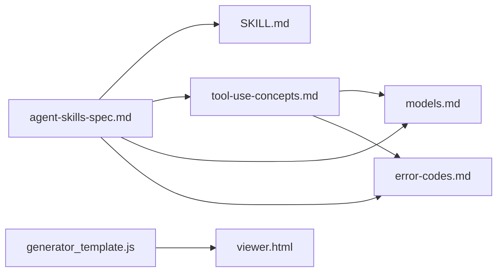
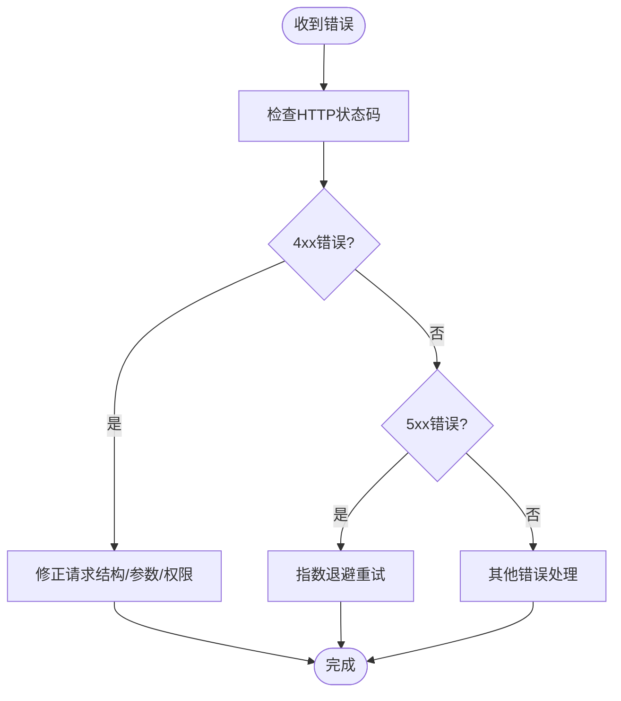

# 组件设计模式

<cite>
**本文引用的文件**
- [skills/spec/agent-skills-spec.md](file://skills/spec/agent-skills-spec.md)
- [skills/template/SKILL.md](file://skills/template/SKILL.md)
- [skills/skills/claude-api/shared/tool-use-concepts.md](file://skills/skills/claude-api/shared/tool-use-concepts.md)
- [skills/skills/claude-api/shared/models.md](file://skills/skills/claude-api/shared/models.md)
- [skills/skills/claude-api/shared/error-codes.md](file://skills/skills/claude-api/shared/error-codes.md)
- [skills/skills/algorithmic-art/templates/generator_template.js](file://skills/skills/algorithmic-art/templates/generator_template.js)
- [skills/skills/algorithmic-art/templates/viewer.html](file://skills/skills/algorithmic-art/templates/viewer.html)
</cite>

## 目录
1. [引言](#引言)
2. [项目结构](#项目结构)
3. [核心组件](#核心组件)
4. [架构总览](#架构总览)
5. [详细组件分析](#详细组件分析)
6. [依赖分析](#依赖分析)
7. [性能考虑](#性能考虑)
8. [故障排查指南](#故障排查指南)
9. [结论](#结论)
10. [附录](#附录)

## 引言
本文件围绕“组件设计模式”对仓库中的技能系统进行系统化梳理与说明，重点覆盖以下方面：
- 抽象基类设计与接口规范：如何通过统一的工具定义与调用协议构建可复用的技能组件。
- 实现模式与生命周期：从参数组织、状态初始化到渲染/执行循环的完整生命周期管理。
- 错误处理机制：基于HTTP错误码与SDK异常类型的统一处理策略。
- 组件间通信协议：工具调用请求/响应、结果回传与多轮对话的协作流程。
- 组件继承体系与依赖关系：以算法艺术模板为例，展示类层次与职责划分。
- 最佳实践与设计原则：参数化、可重现性、性能优化与可维护性。

## 项目结构
仓库采用“技能目录 + 模板/规范”的组织方式，其中：
- skills/spec：技能规范与模板说明
- skills/skills：各类技能实现与参考文档（如Claude API概念、模型与错误码）
- skills/.skills：占位或示例目录
- 算法艺术模板：提供生成式艺术的参数化结构、生命周期与UI交互范式

**图表来源**
- [skills/spec/agent-skills-spec.md:1-4](file://skills/spec/agent-skills-spec.md#L1-L4)
- [skills/template/SKILL.md:1-7](file://skills/template/SKILL.md#L1-L7)
- [skills/skills/claude-api/shared/tool-use-concepts.md:1-306](file://skills/skills/claude-api/shared/tool-use-concepts.md#L1-L306)
- [skills/skills/claude-api/shared/models.md:1-69](file://skills/skills/claude-api/shared/models.md#L1-L69)
- [skills/skills/claude-api/shared/error-codes.md:1-206](file://skills/skills/claude-api/shared/error-codes.md#L1-L206)
- [skills/skills/algorithmic-art/templates/generator_template.js:1-223](file://skills/skills/algorithmic-art/templates/generator_template.js#L1-L223)
- [skills/skills/algorithmic-art/templates/viewer.html:1-599](file://skills/skills/algorithmic-art/templates/viewer.html#L1-L599)

**章节来源**
- [skills/spec/agent-skills-spec.md:1-4](file://skills/spec/agent-skills-spec.md#L1-L4)
- [skills/template/SKILL.md:1-7](file://skills/template/SKILL.md#L1-L7)

## 核心组件
本节聚焦两类核心组件：
- 工具组件（Tool Components）：面向Claude API的工具定义、选择策略、运行时循环与结果处理。
- 生成式艺术组件（Generative Art Components）：参数化系统、生命周期管理、类结构与UI控制。

关键要点：
- 工具组件通过统一的输入Schema与名称描述驱动模型决策；支持自动/任意/指定工具选择与并行工具调用限制。
- 生命周期管理强调“参数组织—种子确定—初始化—渲染/执行—导出”的闭环。
- 错误处理遵循HTTP状态码映射与SDK异常类型，确保可恢复与可观测性。

**章节来源**
- [skills/skills/claude-api/shared/tool-use-concepts.md:5-33](file://skills/skills/claude-api/shared/tool-use-concepts.md#L5-L33)
- [skills/skills/algorithmic-art/templates/generator_template.js:16-84](file://skills/skills/algorithmic-art/templates/generator_template.js#L16-L84)

## 架构总览
下图展示了技能系统在“工具使用”场景下的端到端架构：客户端/服务端组件通过工具定义与调用协议协同工作，模型根据工具描述做出决策，最终返回工具结果或中间步骤。

**图表来源**
- [skills/skills/claude-api/shared/tool-use-concepts.md:60-84](file://skills/skills/claude-api/shared/tool-use-concepts.md#L60-L84)
- [skills/skills/claude-api/shared/tool-use-concepts.md:87-98](file://skills/skills/claude-api/shared/tool-use-concepts.md#L87-L98)

## 详细组件分析

### 工具组件（Tool Components）
- 接口规范
  - 工具定义需包含名称、描述与输入Schema；属性应有明确描述与枚举值；必要参数在required中声明。
  - 工具选择策略：自动、任意、指定工具或禁止使用；可禁用并行工具调用。
  - 结果回传：按顺序追加模型内容，确保每个工具结果包含匹配的工具调用ID。
- 生命周期管理
  - 自动循环：由工具运行器自动处理请求、检测工具调用、执行函数并将结果回传，直至停止条件。
  - 手动循环：自定义日志、条件执行与人工审批；注意暂停/继续逻辑与最大续传次数。
- 错误处理
  - 工具执行失败时设置错误标记并提供信息性消息；429/5xx默认指数退避重试。
  - 使用SDK的类型化异常类进行精确捕获与处理。

**图表来源**
- [skills/skills/claude-api/shared/tool-use-concepts.md:60-84](file://skills/skills/claude-api/shared/tool-use-concepts.md#L60-L84)
- [skills/skills/claude-api/shared/tool-use-concepts.md:87-98](file://skills/skills/claude-api/shared/tool-use-concepts.md#L87-L98)

**章节来源**
- [skills/skills/claude-api/shared/tool-use-concepts.md:5-42](file://skills/skills/claude-api/shared/tool-use-concepts.md#L5-L42)
- [skills/skills/claude-api/shared/tool-use-concepts.md:45-67](file://skills/skills/claude-api/shared/tool-use-concepts.md#L45-L67)
- [skills/skills/claude-api/shared/tool-use-concepts.md:87-98](file://skills/skills/claude-api/shared/tool-use-concepts.md#L87-L98)

### 生成式艺术组件（Generative Art Components）
- 参数组织与可重现性
  - 将所有可调参数集中在一个对象中，便于UI绑定、重置与序列化；使用固定种子保证可重现输出。
- 生命周期管理
  - setup阶段：创建画布、初始化种子、建立系统状态；静态艺术可在此阶段完成后关闭动画循环。
  - draw阶段：根据需求实现静态生成、连续动画或用户触发再生。
- 类结构与职责
  - 使用类封装实体状态与行为；更新与渲染分离，提升可维护性。
- 性能与实用函数
  - 大规模元素时预计算、简化碰撞检测、限制昂贵运算；提供颜色、映射、缓动与边界处理等工具函数。
- 导出与交互
  - 提供导出图像能力；通过UI控件实时调整参数并触发重绘或全量再生。

**图表来源**
- [skills/skills/algorithmic-art/templates/generator_template.js:16-84](file://skills/skills/algorithmic-art/templates/generator_template.js#L16-L84)
- [skills/skills/algorithmic-art/templates/generator_template.js:87-126](file://skills/skills/algorithmic-art/templates/generator_template.js#L87-L126)
- [skills/skills/algorithmic-art/templates/generator_template.js:162-177](file://skills/skills/algorithmic-art/templates/generator_template.js#L162-L177)

**章节来源**
- [skills/skills/algorithmic-art/templates/generator_template.js:16-84](file://skills/skills/algorithmic-art/templates/generator_template.js#L16-L84)
- [skills/skills/algorithmic-art/templates/generator_template.js:87-126](file://skills/skills/algorithmic-art/templates/generator_template.js#L87-L126)
- [skills/skills/algorithmic-art/templates/generator_template.js:162-177](file://skills/skills/algorithmic-art/templates/generator_template.js#L162-L177)

### 组件继承体系与依赖关系
以算法艺术模板为例，展示类层次与职责划分：

**图表来源**
- [skills/skills/algorithmic-art/templates/generator_template.js:92-110](file://skills/skills/algorithmic-art/templates/generator_template.js#L92-L110)
- [skills/skills/algorithmic-art/templates/generator_template.js:511-516](file://skills/skills/algorithmic-art/templates/generator_template.js#L511-L516)
- [skills/skills/algorithmic-art/templates/viewer.html:440-599](file://skills/skills/algorithmic-art/templates/viewer.html#L440-L599)

**章节来源**
- [skills/skills/algorithmic-art/templates/generator_template.js:92-110](file://skills/skills/algorithmic-art/templates/generator_template.js#L92-L110)
- [skills/skills/algorithmic-art/templates/generator_template.js:511-516](file://skills/skills/algorithmic-art/templates/generator_template.js#L511-L516)
- [skills/skills/algorithmic-art/templates/viewer.html:440-599](file://skills/skills/algorithmic-art/templates/viewer.html#L440-L599)

## 依赖分析
- 规范与模板
  - 技能规范文件指向外部规范地址，模板文件提供技能元数据与说明。
- Claude API概念与模型
  - 工具使用概念文档定义了工具选择、运行器与手动循环、结果处理与错误处理。
  - 模型目录提供可用模型ID与别名，确保请求合法性。
- 错误码参考
  - 明确HTTP状态码与常见原因，指导重试与异常处理策略。
- 算法艺术模板
  - 生成器模板与查看器HTML共同构成参数化、生命周期与UI交互的完整依赖链。

**图表来源**
- [skills/spec/agent-skills-spec.md:1-4](file://skills/spec/agent-skills-spec.md#L1-L4)
- [skills/template/SKILL.md:1-7](file://skills/template/SKILL.md#L1-L7)
- [skills/skills/claude-api/shared/tool-use-concepts.md:1-306](file://skills/skills/claude-api/shared/tool-use-concepts.md#L1-L306)
- [skills/skills/claude-api/shared/models.md:1-69](file://skills/skills/claude-api/shared/models.md#L1-L69)
- [skills/skills/claude-api/shared/error-codes.md:1-206](file://skills/skills/claude-api/shared/error-codes.md#L1-L206)
- [skills/skills/algorithmic-art/templates/generator_template.js:1-223](file://skills/skills/algorithmic-art/templates/generator_template.js#L1-L223)
- [skills/skills/algorithmic-art/templates/viewer.html:1-599](file://skills/skills/algorithmic-art/templates/viewer.html#L1-L599)

**章节来源**
- [skills/spec/agent-skills-spec.md:1-4](file://skills/spec/agent-skills-spec.md#L1-L4)
- [skills/template/SKILL.md:1-7](file://skills/template/SKILL.md#L1-L7)
- [skills/skills/claude-api/shared/tool-use-concepts.md:1-306](file://skills/skills/claude-api/shared/tool-use-concepts.md#L1-L306)
- [skills/skills/claude-api/shared/models.md:1-69](file://skills/skills/claude-api/shared/models.md#L1-L69)
- [skills/skills/claude-api/shared/error-codes.md:1-206](file://skills/skills/claude-api/shared/error-codes.md#L1-L206)
- [skills/skills/algorithmic-art/templates/generator_template.js:1-223](file://skills/skills/algorithmic-art/templates/generator_template.js#L1-L223)
- [skills/skills/algorithmic-art/templates/viewer.html:1-599](file://skills/skills/algorithmic-art/templates/viewer.html#L1-L599)

## 性能考虑
- 工具使用
  - 控制工具数量与复杂度，避免模型困惑；合理设置最大续传次数防止无限循环。
  - 在服务器侧工具（如代码执行、网络搜索）达到迭代上限时，遵循暂停/继续协议，避免重复消息。
- 生成式艺术
  - 预计算可复用项、简化碰撞检测、限制昂贵运算；保持60fps目标；必要时降低元素数量或简化计算。
  - 利用p5向量高效计算，减少不必要的开销。

**章节来源**
- [skills/skills/claude-api/shared/tool-use-concepts.md:60-84](file://skills/skills/claude-api/shared/tool-use-concepts.md#L60-L84)
- [skills/skills/algorithmic-art/templates/generator_template.js:113-126](file://skills/skills/algorithmic-art/templates/generator_template.js#L113-L126)

## 故障排查指南
- 常见错误与修复
  - 400：请求格式或参数无效；检查模型ID、令牌数、消息交替与必填字段。
  - 401：缺少或无效API密钥；确认环境变量配置。
  - 403：权限不足或访问受限；检查密钥权限与功能访问。
  - 404：端点或模型ID无效；使用准确的模型ID或别名。
  - 413：请求过大；压缩/裁剪输入或拆分文档。
  - 429/5xx：速率限制或服务异常；使用指数退避重试。
- 异常处理建议
  - 使用SDK类型化异常类进行精确判断；优先检查具体异常类型再降级到通用API异常。

**图表来源**
- [skills/skills/claude-api/shared/error-codes.md:18-134](file://skills/skills/claude-api/shared/error-codes.md#L18-L134)
- [skills/skills/claude-api/shared/error-codes.md:170-206](file://skills/skills/claude-api/shared/error-codes.md#L170-L206)

**章节来源**
- [skills/skills/claude-api/shared/error-codes.md:18-134](file://skills/skills/claude-api/shared/error-codes.md#L18-L134)
- [skills/skills/claude-api/shared/error-codes.md:170-206](file://skills/skills/claude-api/shared/error-codes.md#L170-L206)

## 结论
本仓库提供了两类典型组件设计范式：
- 工具组件：通过标准化的工具定义与调用协议，结合自动/手动循环与严格的错误处理，实现高内聚、低耦合的可复用技能模块。
- 生成式艺术组件：以参数化、可重现性与生命周期管理为核心，配合类结构与UI交互，形成清晰的职责划分与扩展空间。

建议在实际开发中遵循参数化、可重现性、性能与安全等最佳实践，并依据规范与模板快速落地组件设计。

## 附录
- 技能模板元数据：用于描述技能名称与用途，作为技能包的入口说明。
- 模型目录：严格使用官方提供的模型ID与别名，避免拼写错误导致的404。
- 工具使用概念：涵盖工具定义、选择策略、运行器与手动循环、结果处理与错误处理。

**章节来源**
- [skills/template/SKILL.md:1-7](file://skills/template/SKILL.md#L1-L7)
- [skills/skills/claude-api/shared/models.md:48-69](file://skills/skills/claude-api/shared/models.md#L48-L69)
- [skills/skills/claude-api/shared/tool-use-concepts.md:1-306](file://skills/skills/claude-api/shared/tool-use-concepts.md#L1-L306)