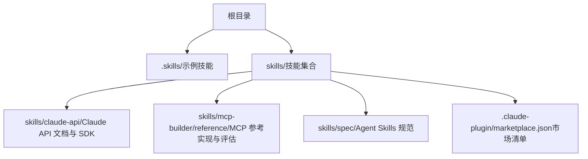
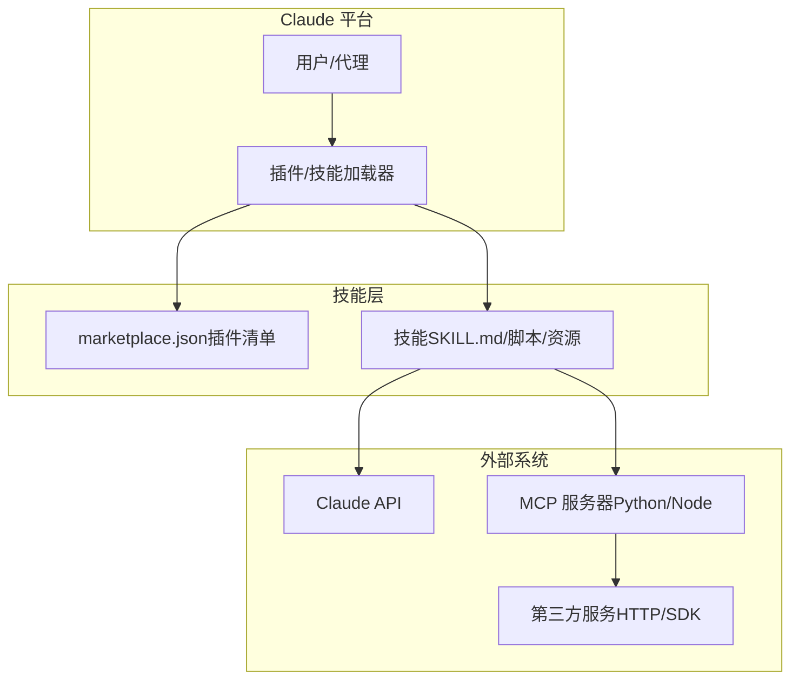
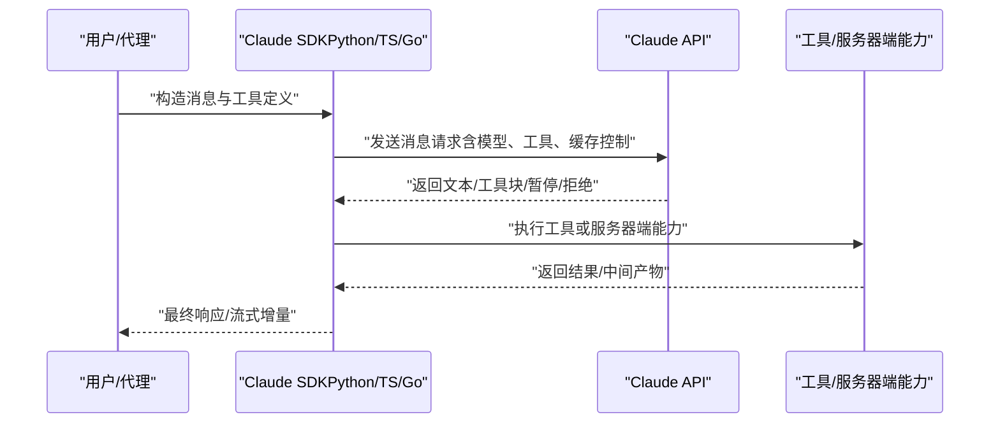
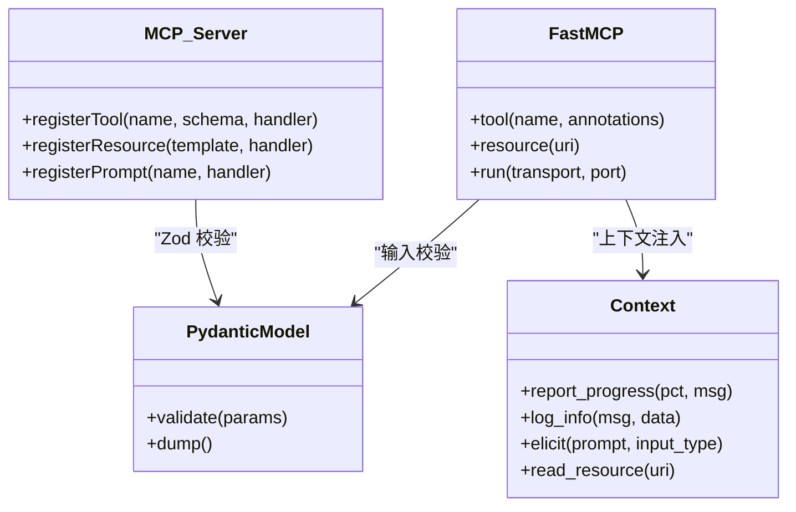
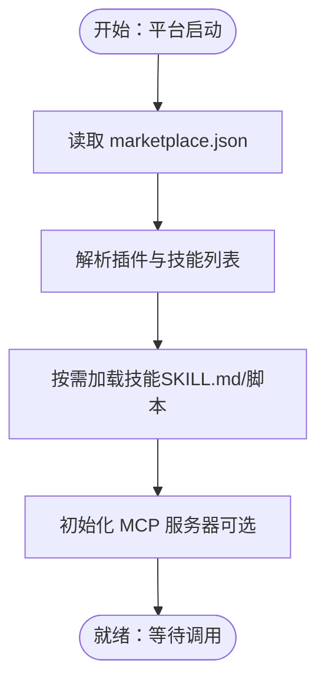
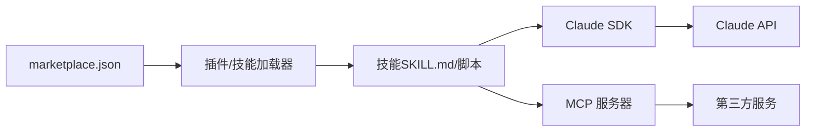

# 集成模式与协议

<cite>
**本文引用的文件**
- [skills/README.md](file://skills/README.md)
- [.skills/](file://.skills/)
- [skills/spec/agent-skills-spec.md](file://skills/spec/agent-skills-spec.md)
- [skills/.claude-plugin/marketplace.json](file://skills/.claude-plugin/marketplace.json)
- [skills/skills/claude-api/shared/models.md](file://skills/skills/claude-api/shared/models.md)
- [skills/skills/claude-api/shared/tool-use-concepts.md](file://skills/skills/claude-api/shared/tool-use-concepts.md)
- [skills/skills/claude-api/typescript/claude-api/tool-use.md](file://skills/skills/claude-api/typescript/claude-api/tool-use.md)
- [skills/skills/claude-api/python/agent-sdk/patterns.md](file://skills/skills/claude-api/python/agent-sdk/patterns.md)
- [skills/skills/claude-api/python/claude-api/README.md](file://skills/skills/claude-api/python/claude-api/README.md)
- [skills/skills/claude-api/go/claude-api.md](file://skills/skills/claude-api/go/claude-api.md)
- [skills/skills/mcp-builder/reference/python_mcp_server.md](file://skills/skills/mcp-builder/reference/python_mcp_server.md)
- [skills/skills/mcp-builder/reference/node_mcp_server.md](file://skills/skills/mcp-builder/reference/node_mcp_server.md)
- [skills/skills/mcp-builder/reference/evaluation.md](file://skills/skills/mcp-builder/reference/evaluation.md)
</cite>

## 目录
1. [简介](#简介)
2. [项目结构](#项目结构)
3. [核心组件](#核心组件)
4. [架构总览](#架构总览)
5. [详细组件分析](#详细组件分析)
6. [依赖关系分析](#依赖关系分析)
7. [性能考量](#性能考量)
8. [故障排查指南](#故障排查指南)
9. [结论](#结论)
10. [附录](#附录)

## 简介
本文件面向希望将技能系统与外部系统进行深度集成的开发者，系统化阐述以下内容：
- 技能系统与外部系统的集成方式：Claude API 集成、MCP（Model Context Protocol）协议支持、第三方服务对接
- 消息格式、传输协议与认证机制
- 插件发现、动态加载与版本兼容性管理
- 集成示例与配置模板
- 安全考虑、性能优化与监控集成建议

该仓库提供了完整的技能生态与多语言 SDK 文档，涵盖 Claude API 的工具使用、消息流、模型选择与成本优化，以及 MCP 服务器的实现规范、资源与提示注册、评估与验证流程等。

章节来源
- [skills/README.md:1-95](file://skills/README.md#L1-L95)

## 项目结构
该项目以“技能”为中心组织内容，每个技能是自包含的指令与资源集合，并通过统一的市场清单与规范进行发现与加载。核心目录与文件如下：
- 根目录下的技能集合：.skills/ 与 skills/ 下的各技能子目录
- 市场清单：skills/.claude-plugin/marketplace.json
- 规范与模板：skills/spec/agent-skills-spec.md、skills/template/SKILL.md
- Claude API 文档与 SDK 使用指南：skills/skills/claude-api/...
- MCP 服务器参考实现与评估：skills/skills/mcp-builder/reference/...

图表来源
- [skills/README.md:24-27](file://skills/README.md#L24-L27)
- [skills/.claude-plugin/marketplace.json:1-56](file://skills/.claude-plugin/marketplace.json#L1-L56)

章节来源
- [skills/README.md:24-27](file://skills/README.md#L24-L27)
- [skills/.claude-plugin/marketplace.json:11-54](file://skills/.claude-plugin/marketplace.json#L11-L54)

## 核心组件
- 市场清单与插件发现
  - marketplace.json 定义了插件名称、所有者、元数据与技能列表，用于在 Claude Code/CLI/平台中进行插件发现与安装。
- Claude API 集成
  - 提供多语言 SDK（Python、TypeScript、Go）的初始化、消息请求、工具使用、流式响应、错误处理与成本优化策略。
- MCP 协议支持
  - 提供 Python 与 Node/TypeScript 的 MCP 服务器实现指南，涵盖工具注册、输入校验、资源与提示注册、传输方式（stdio、HTTP）、上下文注入与生命周期管理。
- 评估与质量保障
  - 提供 MCP 服务器评估指南，定义可复现、只读、非破坏性的评估问题与输出格式，配套评估脚本与报告生成。

章节来源
- [skills/.claude-plugin/marketplace.json:1-56](file://skills/.claude-plugin/marketplace.json#L1-L56)
- [skills/skills/claude-api/shared/tool-use-concepts.md:1-306](file://skills/skills/claude-api/shared/tool-use-concepts.md#L1-L306)
- [skills/skills/mcp-builder/reference/python_mcp_server.md:1-719](file://skills/skills/mcp-builder/reference/python_mcp_server.md#L1-L719)
- [skills/skills/mcp-builder/reference/node_mcp_server.md:1-800](file://skills/skills/mcp-builder/reference/node_mcp_server.md#L1-L800)
- [skills/skills/mcp-builder/reference/evaluation.md:1-602](file://skills/skills/mcp-builder/reference/evaluation.md#L1-L602)

## 架构总览
下图展示了技能系统与外部系统的集成架构：Claude 平台通过市场清单发现插件，加载技能；技能内部可调用 Claude API 或运行 MCP 服务器；MCP 服务器对外暴露工具与资源，供 Claude 调用完成复杂任务。

图表来源
- [skills/.claude-plugin/marketplace.json:11-54](file://skills/.claude-plugin/marketplace.json#L11-L54)
- [skills/skills/claude-api/shared/tool-use-concepts.md:1-306](file://skills/skills/claude-api/shared/tool-use-concepts.md#L1-L306)
- [skills/skills/mcp-builder/reference/python_mcp_server.md:1-719](file://skills/skills/mcp-builder/reference/python_mcp_server.md#L1-L719)
- [skills/skills/mcp-builder/reference/node_mcp_server.md:1-800](file://skills/skills/mcp-builder/reference/node_mcp_server.md#L1-L800)

## 详细组件分析

### 组件一：Claude API 集成
- 模型与工具
  - 模型目录提供当前推荐、历史与已弃用模型的完整清单与别名映射，确保请求时使用准确的模型 ID。
  - 工具使用概念涵盖用户定义工具、服务器端工具（代码执行、网页搜索/抓取、程序化工具调用、工具搜索）、内存工具、结构化输出等。
- 多语言 SDK
  - Python：基础消息请求、系统提示、视觉输入、提示缓存、扩展思考、错误处理、多轮对话、停止原因、成本优化与指数退避重试。
  - TypeScript：工具运行器（推荐）、手动循环、流式循环、代码执行（含文件上传/下载/容器复用）、内存工具、结构化输出。
  - Go：SDK 支持 Claude API 与 Beta 工具运行器，Agent SDK 尚未提供。
- 认证与传输
  - 默认使用环境变量中的 API 密钥；SDK 内置速率限制与服务器错误的指数退避重试逻辑。

图表来源
- [skills/skills/claude-api/shared/tool-use-concepts.md:101-210](file://skills/skills/claude-api/shared/tool-use-concepts.md#L101-L210)
- [skills/skills/claude-api/python/claude-api/README.md:26-251](file://skills/skills/claude-api/python/claude-api/README.md#L26-L251)
- [skills/skills/claude-api/typescript/claude-api/tool-use.md:5-165](file://skills/skills/claude-api/typescript/claude-api/tool-use.md#L5-L165)
- [skills/skills/claude-api/go/claude-api.md:76-147](file://skills/skills/claude-api/go/claude-api.md#L76-L147)

章节来源
- [skills/skills/claude-api/shared/models.md:1-69](file://skills/skills/claude-api/shared/models.md#L1-L69)
- [skills/skills/claude-api/shared/tool-use-concepts.md:1-306](file://skills/skills/claude-api/shared/tool-use-concepts.md#L1-L306)
- [skills/skills/claude-api/python/claude-api/README.md:1-405](file://skills/skills/claude-api/python/claude-api/README.md#L1-L405)
- [skills/skills/claude-api/typescript/claude-api/tool-use.md:1-478](file://skills/skills/claude-api/typescript/claude-api/tool-use.md#L1-L478)
- [skills/skills/claude-api/go/claude-api.md:1-147](file://skills/skills/claude-api/go/claude-api.md#L1-L147)

### 组件二：MCP 协议支持
- 服务器实现（Python）
  - 使用 FastMCP 框架，装饰器式工具注册、Pydantic 输入校验、注解标注工具特性（只读、非破坏、幂等、开放世界）、资源注册、结构化输出类型、生命周期管理、传输选择（stdio/HTTP）。
- 服务器实现（Node/TypeScript）
  - 使用官方 MCP SDK，registerTool/registerResource/registerPrompt 的现代 API，Zod 类型校验，资源模板 URI、分页与字符限制、错误处理、包配置与构建脚本。
- 上下文与资源
  - 支持上下文注入（进度、日志、交互）、资源读取、提示注册，便于跨工具共享数据与模板。
- 评估与质量
  - 评估指南要求只读、独立、非破坏、幂等，强调复杂度与稳定性，输出为可直接比较的单一值，并提供评估脚本与报告生成。

图表来源
- [skills/skills/mcp-builder/reference/python_mcp_server.md:35-120](file://skills/skills/mcp-builder/reference/python_mcp_server.md#L35-L120)
- [skills/skills/mcp-builder/reference/python_mcp_server.md:476-526](file://skills/skills/mcp-builder/reference/python_mcp_server.md#L476-L526)
- [skills/skills/mcp-builder/reference/node_mcp_server.md:50-76](file://skills/skills/mcp-builder/reference/node_mcp_server.md#L50-L76)
- [skills/skills/mcp-builder/reference/node_mcp_server.md:107-274](file://skills/skills/mcp-builder/reference/node_mcp_server.md#L107-L274)

章节来源
- [skills/skills/mcp-builder/reference/python_mcp_server.md:1-719](file://skills/skills/mcp-builder/reference/python_mcp_server.md#L1-L719)
- [skills/skills/mcp-builder/reference/node_mcp_server.md:1-800](file://skills/skills/mcp-builder/reference/node_mcp_server.md#L1-L800)
- [skills/skills/mcp-builder/reference/evaluation.md:1-602](file://skills/skills/mcp-builder/reference/evaluation.md#L1-L602)

### 组件三：插件发现、动态加载与版本兼容
- 插件发现与加载
  - marketplace.json 中的 plugins 列表声明插件名称、描述、源路径与技能集合，平台据此进行发现与安装。
- 版本兼容性
  - 模型目录明确列出当前推荐、历史与已弃用/退休模型，提供别名映射与迁移建议，避免因模型 ID 变更导致的集成失败。
- 动态加载
  - 技能以自包含的 SKILL.md 与脚本形式存在，平台按需加载；MCP 服务器可通过命令行或 HTTP 暴露接口，支持多客户端并发。

图表来源
- [skills/.claude-plugin/marketplace.json:11-54](file://skills/.claude-plugin/marketplace.json#L11-L54)
- [skills/skills/claude-api/shared/models.md:19-47](file://skills/skills/claude-api/shared/models.md#L19-L47)

章节来源
- [skills/.claude-plugin/marketplace.json:1-56](file://skills/.claude-plugin/marketplace.json#L1-L56)
- [skills/skills/claude-api/shared/models.md:1-69](file://skills/skills/claude-api/shared/models.md#L1-L69)

### 组件四：第三方服务对接
- 通过 MCP 工具与资源对接
  - 使用工具注册模式封装第三方 API，输入参数通过 Pydantic/Zod 校验，返回结构化数据；资源注册用于静态/半静态数据访问。
- 通过 Claude API 工具与服务器端能力
  - 用户定义工具用于调用自有后端；服务器端能力（如代码执行、网页搜索/抓取）由平台托管，减少客户端复杂度。
- 文件与容器
  - 代码执行支持文件上传/下载与容器复用，适合数据分析与可视化等场景。

章节来源
- [skills/skills/mcp-builder/reference/python_mcp_server.md:207-245](file://skills/skills/mcp-builder/reference/python_mcp_server.md#L207-L245)
- [skills/skills/claude-api/typescript/claude-api/tool-use.md:217-346](file://skills/skills/claude-api/typescript/claude-api/tool-use.md#L217-L346)
- [skills/skills/claude-api/shared/tool-use-concepts.md:101-158](file://skills/skills/claude-api/shared/tool-use-concepts.md#L101-L158)

## 依赖关系分析
- 技能到平台：marketplace.json 作为入口，驱动插件发现与技能加载
- 技能到 Claude API：通过 SDK 发起消息请求、工具调用与流式处理
- 技能到 MCP：通过工具/资源/提示注册暴露能力，支持本地 stdio 或远程 HTTP 传输
- 第三方服务：通过 MCP 工具或 Claude API 服务器端能力间接访问

图表来源
- [skills/.claude-plugin/marketplace.json:11-54](file://skills/.claude-plugin/marketplace.json#L11-L54)
- [skills/skills/claude-api/shared/tool-use-concepts.md:1-306](file://skills/skills/claude-api/shared/tool-use-concepts.md#L1-L306)
- [skills/skills/mcp-builder/reference/python_mcp_server.md:1-719](file://skills/skills/mcp-builder/reference/python_mcp_server.md#L1-L719)

章节来源
- [skills/.claude-plugin/marketplace.json:1-56](file://skills/.claude-plugin/marketplace.json#L1-L56)

## 性能考量
- 成本优化
  - 使用提示缓存（自动/手动）降低重复上下文成本；选择合适模型（Opus/ Sonnet/Haiku）平衡性能与价格；使用令牌计数预估输入成本；在长对话中采用压缩与分段策略。
- 响应延迟
  - 流式响应提升感知速度；指数退避重试缓解限流与服务器错误；合理设置超时与并发。
- 数据规模
  - MCP 工具实现中使用分页与字符限制，避免一次性返回过多数据；服务器端能力（如代码执行）支持容器复用以保持状态。
- 模型选择
  - 按任务复杂度选择模型，利用自适应思考与高努力输出配置提升质量。

章节来源
- [skills/skills/claude-api/python/claude-api/README.md:108-153](file://skills/skills/claude-api/python/claude-api/README.md#L108-L153)
- [skills/skills/claude-api/python/claude-api/README.md:311-366](file://skills/skills/claude-api/python/claude-api/README.md#L311-L366)
- [skills/skills/claude-api/shared/tool-use-concepts.md:144-158](file://skills/skills/claude-api/shared/tool-use-concepts.md#L144-L158)
- [skills/skills/mcp-builder/reference/node_mcp_server.md:382-406](file://skills/skills/mcp-builder/reference/node_mcp_server.md#L382-L406)

## 故障排查指南
- Claude API
  - 常见异常类型与处理：请求错误、认证错误、权限不足、未找到、速率限制、状态错误、连接错误；建议使用 SDK 内建重试与错误分类。
- MCP 服务器
  - 传输问题：stdio 本地运行与 HTTP 远程连接；检查命令、端口、URL 与鉴权头；确保资源可用与环境变量正确。
- 评估与回归
  - 使用评估脚本对 MCP 服务器进行只读、独立、非破坏、幂等测试；关注准确率、平均耗时与工具调用次数；根据反馈迭代工具描述、输入参数与输出格式。

章节来源
- [skills/skills/claude-api/python/claude-api/README.md:182-207](file://skills/skills/claude-api/python/claude-api/README.md#L182-L207)
- [skills/skills/mcp-builder/reference/evaluation.md:378-501](file://skills/skills/mcp-builder/reference/evaluation.md#L378-L501)

## 结论
本仓库提供了从技能发现、Claude API 集成到 MCP 协议实现与评估验证的完整方案。通过规范化的模型选择、工具定义与传输协议，结合稳健的错误处理与性能优化策略，能够支撑复杂业务场景下的智能体工作流。建议在生产环境中：
- 明确模型与工具策略，严格遵循模型别名与工具 schema
- 优先采用工具运行器与结构化输出，减少歧义
- 使用 MCP 服务器统一暴露能力，配合资源与提示注册提升复用性
- 建立自动化评估与回归流程，持续改进工具质量

## 附录
- 集成示例与配置模板
  - Claude API（Python/TypeScript/Go）：参考对应 README 与工具使用文档，按需启用缓存、流式与工具运行器
  - MCP 服务器（Python/Node）：参考参考实现文档，按命名约定与最佳实践完成工具/资源注册与传输配置
  - 市场清单：参考 marketplace.json，按插件与技能列表进行声明与发布

章节来源
- [skills/skills/claude-api/python/agent-sdk/patterns.md:1-320](file://skills/skills/claude-api/python/agent-sdk/patterns.md#L1-L320)
- [skills/skills/claude-api/typescript/claude-api/tool-use.md:1-478](file://skills/skills/claude-api/typescript/claude-api/tool-use.md#L1-L478)
- [skills/skills/mcp-builder/reference/python_mcp_server.md:1-719](file://skills/skills/mcp-builder/reference/python_mcp_server.md#L1-L719)
- [skills/skills/mcp-builder/reference/node_mcp_server.md:1-800](file://skills/skills/mcp-builder/reference/node_mcp_server.md#L1-L800)
- [skills/.claude-plugin/marketplace.json:1-56](file://skills/.claude-plugin/marketplace.json#L1-L56)