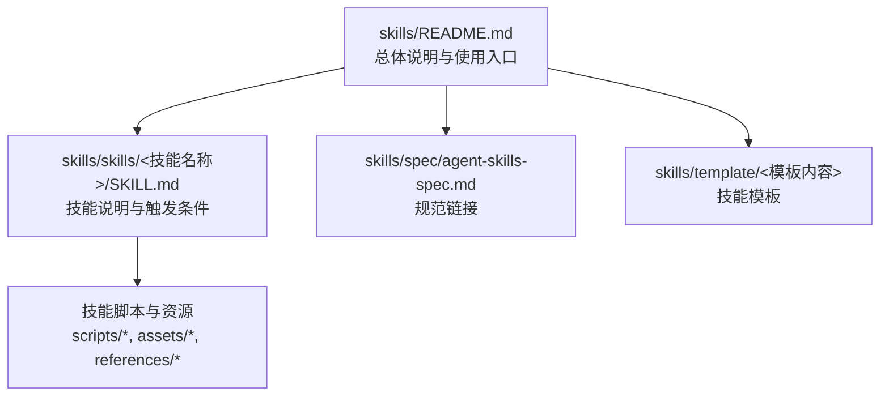
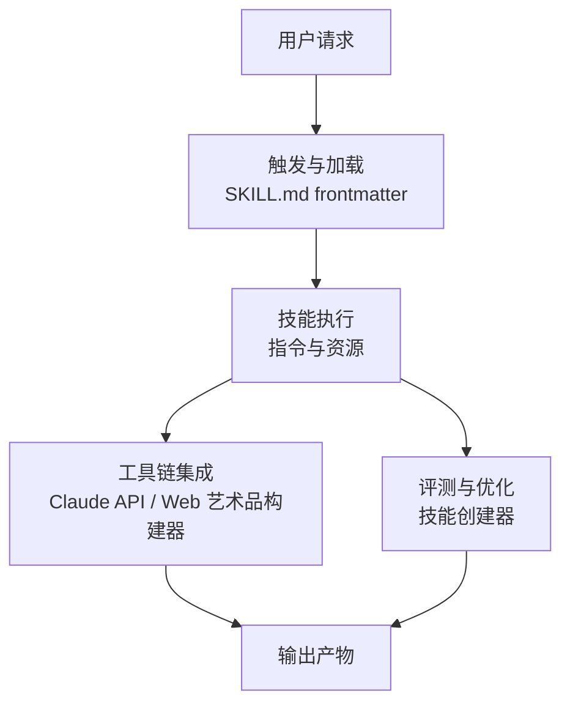
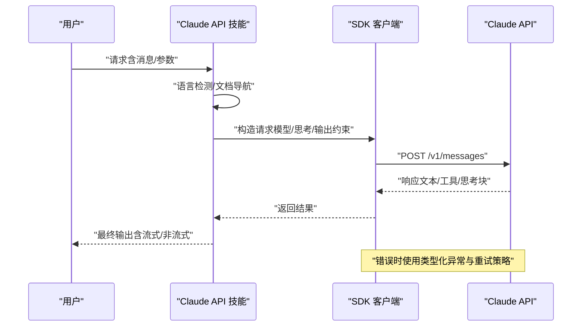
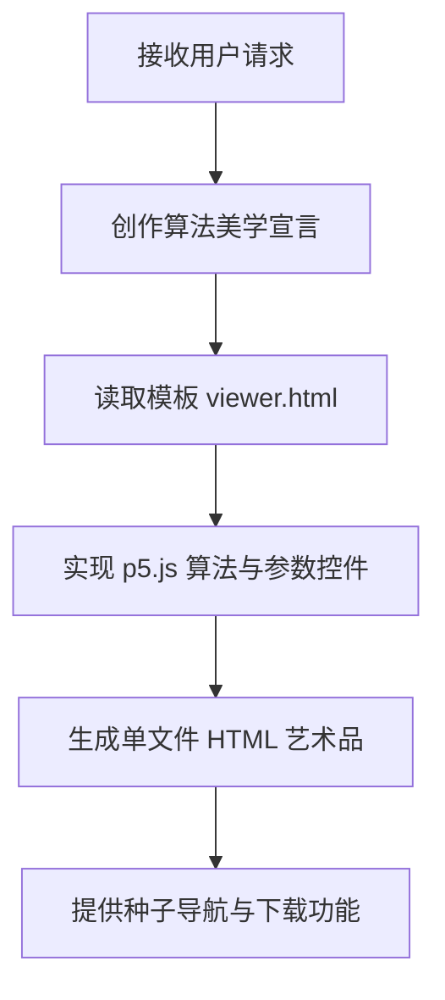
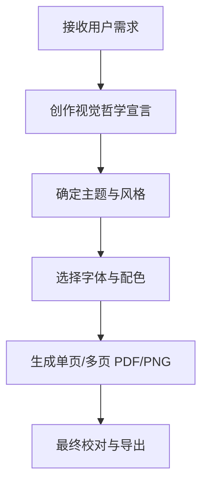
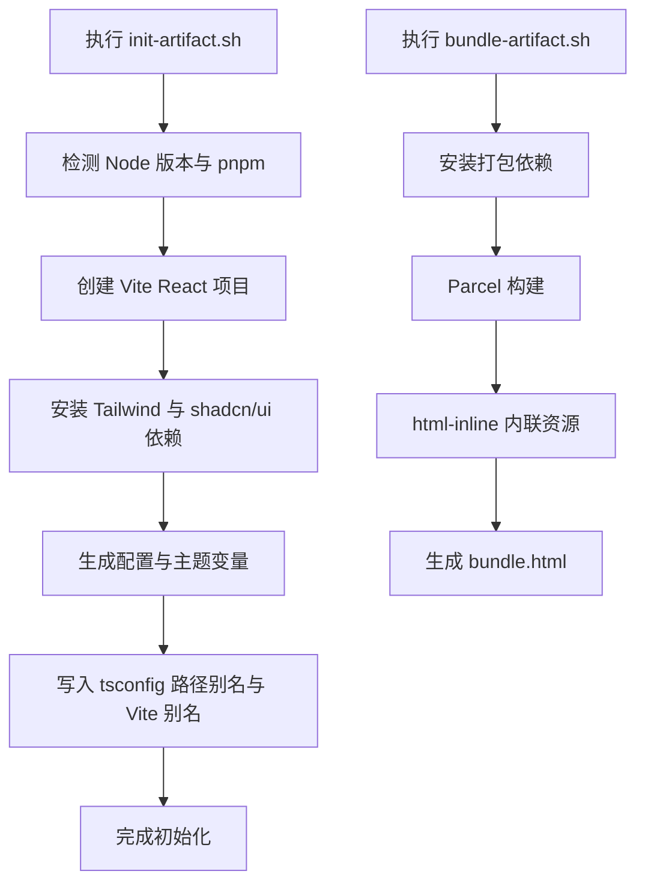
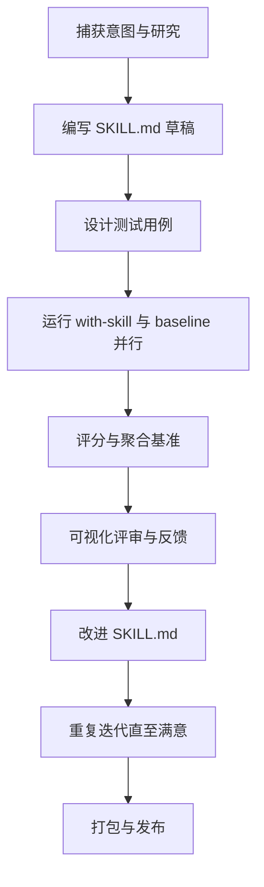
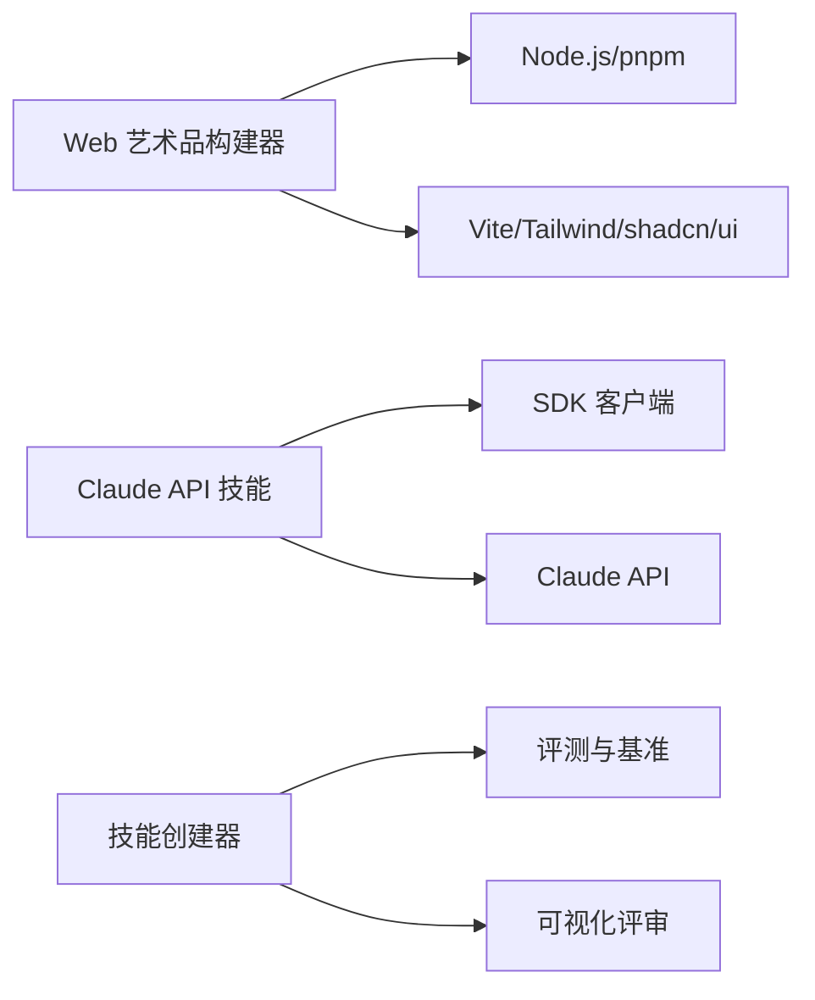
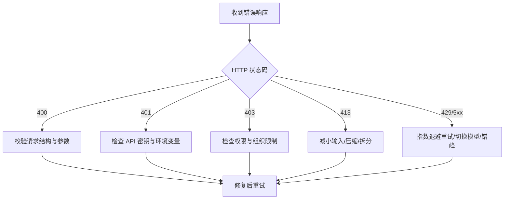

# 故障排除与常见问题

<cite>
**本文引用的文件**
- [skills/README.md](file://skills/README.md)
- [skills/spec/agent-skills-spec.md](file://skills/spec/agent-skills-spec.md)
- [skills/skills/claude-api/SKILL.md](file://skills/skills/claude-api/SKILL.md)
- [skills/skills/claude-api/shared/error-codes.md](file://skills/skills/claude-api/shared/error-codes.md)
- [skills/skills/claude-api/python/claude-api/README.md](file://skills/skills/claude-api/python/claude-api/README.md)
- [skills/skills/claude-api/typescript/claude-api/README.md](file://skills/skills/claude-api/typescript/claude-api/README.md)
- [skills/skills/algorithmic-art/SKILL.md](file://skills/skills/algorithmic-art/SKILL.md)
- [skills/skills/canvas-design/SKILL.md](file://skills/skills/canvas-design/SKILL.md)
- [skills/skills/frontend-design/SKILL.md](file://skills/skills/frontend-design/SKILL.md)
- [skills/skills/web-artifacts-builder/SKILL.md](file://skills/skills/web-artifacts-builder/SKILL.md)
- [skills/skills/web-artifacts-builder/scripts/init-artifact.sh](file://skills/skills/web-artifacts-builder/scripts/init-artifact.sh)
- [skills/skills/web-artifacts-builder/scripts/bundle-artifact.sh](file://skills/skills/web-artifacts-builder/scripts/bundle-artifact.sh)
- [skills/skills/skill-creator/SKILL.md](file://skills/skills/skill-creator/SKILL.md)
</cite>

## 目录
1. [简介](#简介)
2. [项目结构](#项目结构)
3. [核心组件](#核心组件)
4. [架构总览](#架构总览)
5. [详细组件分析](#详细组件分析)
6. [依赖关系分析](#依赖关系分析)
7. [性能考虑](#性能考虑)
8. [故障排除指南](#故障排除指南)
9. [结论](#结论)
10. [附录](#附录)

## 简介
本文件面向“技能系统”的使用者与维护者，提供系统性的故障排除与常见问题解答（FAQ）。内容覆盖安装与环境准备、配置与触发条件、运行时异常与调试、性能优化与成本控制等主题，并针对不同技能模块（如 Claude API 技能、算法艺术、画布设计、前端设计、Web 艺术品构建器、技能创建器）给出具体问题与解决路径。文档力求对初学者友好，同时为高级用户提供深入的技术细节与可操作的排障步骤。

## 项目结构
该仓库以“技能”为中心组织内容，每个技能是一个自包含的目录，包含说明文档（SKILL.md）以及可选的脚本与资源。顶层 README 提供总体介绍与使用入口；spec 目录提供 Agent Skills 规范链接；template 目录提供技能模板。

图表来源
- [skills/README.md:1-95](file://skills/README.md#L1-L95)
- [skills/spec/agent-skills-spec.md:1-4](file://skills/spec/agent-skills-spec.md#L1-L4)

章节来源
- [skills/README.md:1-95](file://skills/README.md#L1-L95)
- [skills/spec/agent-skills-spec.md:1-4](file://skills/spec/agent-skills-spec.md#L1-L4)

## 核心组件
- 技能元数据与触发：每个技能通过 SKILL.md 的 YAML frontmatter 定义 name 与 description，决定何时被触发与如何被调用。
- 语言特定实现：Claude API 技能按语言分目录提供示例与最佳实践（Python、TypeScript 等），并配套共享文档（错误码、模型列表、工具使用概念等）。
- 工具链与脚本：Web 艺术品构建器提供初始化与打包脚本，支持从 React/Tailwind/shadcn/ui 快速生成单文件 HTML 艺术品。
- 评测与迭代：技能创建器提供测试、评估、对比与描述优化的完整流程，支持基准聚合与可视化评审。

章节来源
- [skills/skills/claude-api/SKILL.md:1-244](file://skills/skills/claude-api/SKILL.md#L1-L244)
- [skills/skills/web-artifacts-builder/SKILL.md:1-74](file://skills/skills/web-artifacts-builder/SKILL.md#L1-L74)
- [skills/skills/skill-creator/SKILL.md:1-486](file://skills/skills/skill-creator/SKILL.md#L1-L486)

## 架构总览
技能系统由“触发与加载”“执行与工具链”“评测与优化”三层组成。用户请求经由触发条件进入相应技能，技能根据自身指令与资源完成任务；对于复杂场景，可通过工具链（如 Claude API、Web 艺术品构建器）提升能力；最后通过技能创建器进行测试、评估与持续优化。

（本图为概念性架构示意，不直接映射到具体源文件）

## 详细组件分析

### Claude API 技能
- 触发与默认行为：根据用户代码导入或明确意图触发；默认使用指定模型与思考模式，长输出启用流式响应。
- 语言检测与文档导航：依据项目文件自动识别语言，按需读取对应语言文档与共享概念。
- 错误处理与重试：提供 HTTP 错误码参考与 SDK 类型化异常使用建议；SDK 默认对 429/5xx 自动指数退避重试。
- 成本优化：提示缓存、令牌计数、模型选择策略与停止原因说明。

图表来源
- [skills/skills/claude-api/SKILL.md:171-244](file://skills/skills/claude-api/SKILL.md#L171-L244)
- [skills/skills/claude-api/shared/error-codes.md:170-206](file://skills/skills/claude-api/shared/error-codes.md#L170-L206)
- [skills/skills/claude-api/python/claude-api/README.md:182-208](file://skills/skills/claude-api/python/claude-api/README.md#L182-L208)
- [skills/skills/claude-api/typescript/claude-api/README.md:179-202](file://skills/skills/claude-api/typescript/claude-api/README.md#L179-L202)

章节来源
- [skills/skills/claude-api/SKILL.md:1-244](file://skills/skills/claude-api/SKILL.md#L1-L244)
- [skills/skills/claude-api/shared/error-codes.md:1-206](file://skills/skills/claude-api/shared/error-codes.md#L1-L206)
- [skills/skills/claude-api/python/claude-api/README.md:1-405](file://skills/skills/claude-api/python/claude-api/README.md#L1-L405)
- [skills/skills/claude-api/typescript/claude-api/README.md:1-314](file://skills/skills/claude-api/typescript/claude-api/README.md#L1-L314)

### 算法艺术技能
- 流程：先创作“算法美学宣言”，再以 p5.js 实现交互式生成艺术；强调可重现性（种子）、参数化与专家级工艺感。
- 模板与约束：必须基于模板文件构建，保持品牌风格与布局一致性；参数与颜色控件需实时更新。
- 输出：单文件自包含 HTML，内嵌 p5.js 与全部逻辑，便于在 Claude 或浏览器中直接运行。

图表来源
- [skills/skills/algorithmic-art/SKILL.md:101-405](file://skills/skills/algorithmic-art/SKILL.md#L101-L405)

章节来源
- [skills/skills/algorithmic-art/SKILL.md:1-405](file://skills/skills/algorithmic-art/SKILL.md#L1-L405)

### 画布设计技能
- 流程：先创作“视觉哲学宣言”，再在画布上表达为 PDF/PNG；强调空间传达、极简文字与专家级工艺。
- 字体与排版：鼓励使用指定字体目录中的字体，避免通用 AI 风格；注意留白、层级与对齐。
- 多页选项：可在同一 PDF/PNG 中创建多页，形成类似咖啡书般的连贯体验。

图表来源
- [skills/skills/canvas-design/SKILL.md:100-130](file://skills/skills/canvas-design/SKILL.md#L100-L130)

章节来源
- [skills/skills/canvas-design/SKILL.md:1-130](file://skills/skills/canvas-design/SKILL.md#L1-L130)

### 前端设计技能
- 设计思维：明确目的、风格、约束与差异化；避免通用 AI 风格，追求独特与高完成度。
- 实施要点：强调排版、色彩、动效、空间构成与背景细节；实现复杂度与美学方向匹配。
- 最终交付：生产级、可运行、有记忆点的界面代码与设计。

章节来源
- [skills/skills/frontend-design/SKILL.md:1-43](file://skills/skills/frontend-design/SKILL.md#L1-L43)

### Web 艺术品构建器
- 目标：为复杂前端艺术品提供现代栈（React/Tailwind/shadcn/ui），支持状态管理、路由与组件复用。
- 步骤：初始化项目（脚本）、开发、打包为单文件 HTML、分享与可选测试。
- 初始化脚本：自动检测 Node 版本、安装 pnpm、配置 Vite/Tailwind/shadcn/ui、设置路径别名与主题变量。
- 打包脚本：安装 Parcel 及解析器，构建后将所有资源内联至单一 HTML 文件。

图表来源
- [skills/skills/web-artifacts-builder/scripts/init-artifact.sh:1-323](file://skills/skills/web-artifacts-builder/scripts/init-artifact.sh#L1-L323)
- [skills/skills/web-artifacts-builder/scripts/bundle-artifact.sh:1-54](file://skills/skills/web-artifacts-builder/scripts/bundle-artifact.sh#L1-L54)

章节来源
- [skills/skills/web-artifacts-builder/SKILL.md:1-74](file://skills/skills/web-artifacts-builder/SKILL.md#L1-L74)
- [skills/skills/web-artifacts-builder/scripts/init-artifact.sh:1-323](file://skills/skills/web-artifacts-builder/scripts/init-artifact.sh#L1-L323)
- [skills/skills/web-artifacts-builder/scripts/bundle-artifact.sh:1-54](file://skills/skills/web-artifacts-builder/scripts/bundle-artifact.sh#L1-L54)

### 技能创建器
- 迭代闭环：捕获意图 → 编写草稿 → 设计测试用例 → 评测与对比 → 改进 → 重复 → 扩展测试集 → 打包发布。
- 评测与基准：支持并行子代理运行、量化断言、统计聚合、可视化评审；支持盲对比与描述优化。
- 描述优化：通过触发查询集合评估当前描述触发效果，自动优化以提升触发准确率。

图表来源
- [skills/skills/skill-creator/SKILL.md:163-290](file://skills/skills/skill-creator/SKILL.md#L163-L290)

章节来源
- [skills/skills/skill-creator/SKILL.md:1-486](file://skills/skills/skill-creator/SKILL.md#L1-L486)

## 依赖关系分析
- 技能间耦合：各技能相对独立，通过 SKILL.md frontmatter 与上下文加载；部分技能（如 Claude API）提供共享文档与工具链，降低重复实现。
- 外部依赖：Web 艺术品构建器依赖 Node.js、pnpm、Vite、Tailwind、shadcn/ui；Claude API 技能依赖 SDK 与官方 API。
- 循环依赖：未见显式循环依赖；脚本与技能之间为单向依赖（脚本服务于技能）。

图表来源
- [skills/skills/web-artifacts-builder/scripts/init-artifact.sh:1-323](file://skills/skills/web-artifacts-builder/scripts/init-artifact.sh#L1-L323)
- [skills/skills/claude-api/SKILL.md:171-244](file://skills/skills/claude-api/SKILL.md#L171-L244)
- [skills/skills/skill-creator/SKILL.md:221-252](file://skills/skills/skill-creator/SKILL.md#L221-L252)

章节来源
- [skills/skills/web-artifacts-builder/scripts/init-artifact.sh:1-323](file://skills/skills/web-artifacts-builder/scripts/init-artifact.sh#L1-L323)
- [skills/skills/claude-api/SKILL.md:1-244](file://skills/skills/claude-api/SKILL.md#L1-L244)
- [skills/skills/skill-creator/SKILL.md:1-486](file://skills/skills/skill-creator/SKILL.md#L1-L486)

## 性能考虑
- Claude API
  - 使用提示缓存减少重复上下文成本；在长对话中启用压缩（仅在适用模型上）并保留压缩块。
  - 合理选择模型与输出努力级别；对大输出使用流式响应避免超时。
  - 使用令牌计数估算成本，避免超出预算。
- Web 艺术品构建器
  - 初始化阶段一次性安装依赖，后续开发与打包复用；避免在开发过程中频繁安装大型依赖。
  - 打包前清理旧产物，确保内联资源最小化。
- 技能创建器
  - 并行运行 with-skill 与 baseline 子代理，缩短评测周期；聚合统计与可视化评审前置，提高反馈效率。

章节来源
- [skills/skills/claude-api/python/claude-api/README.md:311-366](file://skills/skills/claude-api/python/claude-api/README.md#L311-L366)
- [skills/skills/claude-api/typescript/claude-api/README.md:284-314](file://skills/skills/claude-api/typescript/claude-api/README.md#L284-L314)
- [skills/skills/web-artifacts-builder/scripts/bundle-artifact.sh:34-54](file://skills/skills/web-artifacts-builder/scripts/bundle-artifact.sh#L34-L54)
- [skills/skills/skill-creator/SKILL.md:169-252](file://skills/skills/skill-creator/SKILL.md#L169-L252)

## 故障排除指南

### 通用安装与环境问题
- Node.js 版本过低
  - 现象：初始化失败或 Vite 版本不兼容。
  - 排查：检查 Node 版本，要求 Node 18+；脚本会自动检测并提示升级。
  - 解决：升级 Node 至 18+，重新执行初始化脚本。
- pnpm 未安装
  - 现象：安装依赖时报错。
  - 排查：确认 pnpm 是否全局安装。
  - 解决：全局安装 pnpm 后重试。
- 项目根缺少入口文件
  - 现象：打包脚本报错缺少 index.html。
  - 排查：确认项目根目录存在 index.html。
  - 解决：添加入口文件或在正确目录执行脚本。

章节来源
- [skills/skills/web-artifacts-builder/scripts/init-artifact.sh:6-24](file://skills/skills/web-artifacts-builder/scripts/init-artifact.sh#L6-L24)
- [skills/skills/web-artifacts-builder/scripts/init-artifact.sh:33-37](file://skills/skills/web-artifacts-builder/scripts/init-artifact.sh#L33-L37)
- [skills/skills/web-artifacts-builder/scripts/bundle-artifact.sh:6-17](file://skills/skills/web-artifacts-builder/scripts/bundle-artifact.sh#L6-L17)

### Claude API 常见问题与调试
- 认证失败（401）
  - 现象：返回 401 未授权。
  - 排查：检查环境变量是否正确设置；确认 API 密钥格式与权限。
  - 解决：设置正确的 ANTHROPIC_API_KEY；必要时更换具备所需权限的密钥。
- 权限不足（403）
  - 现象：返回 403 禁止访问。
  - 排查：确认密钥是否具备访问目标模型或功能的权限。
  - 解决：在控制台检查权限或申请访问。
- 请求过大（413）
  - 现象：返回 413 请求过大。
  - 排查：检查输入大小、图像尺寸或历史长度。
  - 解决：截断历史、压缩/缩小图片或拆分文档。
- 参数验证错误（400）
  - 现象：返回 400 参数无效。
  - 排查：检查必填字段、角色交替、最大令牌数限制等。
  - 解决：修正请求结构与参数范围。
- 速率限制（429）与服务端错误（5xx）
  - 现象：429 需要等待；5xx 服务异常。
  - 排查：查看重试头与限额信息。
  - 解决：使用 SDK 默认重试或自定义指数退避；必要时切换模型或错峰请求。

图表来源
- [skills/skills/claude-api/shared/error-codes.md:18-156](file://skills/skills/claude-api/shared/error-codes.md#L18-L156)
- [skills/skills/claude-api/python/claude-api/README.md:182-208](file://skills/skills/claude-api/python/claude-api/README.md#L182-L208)
- [skills/skills/claude-api/typescript/claude-api/README.md:179-202](file://skills/skills/claude-api/typescript/claude-api/README.md#L179-L202)

章节来源
- [skills/skills/claude-api/shared/error-codes.md:1-206](file://skills/skills/claude-api/shared/error-codes.md#L1-L206)
- [skills/skills/claude-api/python/claude-api/README.md:182-208](file://skills/skills/claude-api/python/claude-api/README.md#L182-L208)
- [skills/skills/claude-api/typescript/claude-api/README.md:179-202](file://skills/skills/claude-api/typescript/claude-api/README.md#L179-L202)

### 技能触发与描述优化
- 触发不足
  - 现象：复杂多步任务未触发技能。
  - 排查：检查 SKILL.md frontmatter 的描述是否足够具体与“强势”。
  - 解决：增强触发关键词与使用场景描述；必要时运行描述优化流程。
- 触发过度或误触
  - 现象：相似领域频繁触发。
  - 排查：检查 should-not-trigger 查询与边界情况。
  - 解决：调整描述与 eval 查询，提升区分度。

章节来源
- [skills/skills/skill-creator/SKILL.md:333-405](file://skills/skills/skill-creator/SKILL.md#L333-L405)

### 算法艺术与画布设计
- 种子不可重现
  - 现象：相同输入产生不同结果。
  - 排查：确认随机种子设置与模板使用。
  - 解决：固定 seed 并使用模板中的 p5.js 结构。
- 参数控件缺失或无效
  - 现象：无法实时调整参数。
  - 排查：检查模板替换区域与控件绑定。
  - 解决：按模板要求实现参数对象与 UI 控件。

章节来源
- [skills/skills/algorithmic-art/SKILL.md:133-160](file://skills/skills/algorithmic-art/SKILL.md#L133-L160)
- [skills/skills/algorithmic-art/SKILL.md:259-337](file://skills/skills/algorithmic-art/SKILL.md#L259-L337)

### 前端设计与 Web 艺术品
- 样式与主题不一致
  - 现象：UI 不符合品牌风格或主题不统一。
  - 排查：检查 Tailwind 配置与 shadcn/ui 主题变量。
  - 解决：遵循主题变量与组件命名约定，避免自定义字体与配色破坏一致性。
- 打包产物过大
  - 现象：bundle.html 体积过大影响加载。
  - 排查：检查内联资源与第三方依赖。
  - 解决：清理冗余资源、按需引入组件、优化图片与静态资源。

章节来源
- [skills/skills/web-artifacts-builder/SKILL.md:18-54](file://skills/skills/web-artifacts-builder/SKILL.md#L18-L54)
- [skills/skills/web-artifacts-builder/scripts/bundle-artifact.sh:38-54](file://skills/skills/web-artifacts-builder/scripts/bundle-artifact.sh#L38-L54)

### 已知问题与临时方案
- 模型 ID 不一致导致 404
  - 现象：使用错误或过期模型 ID。
  - 临时方案：使用技能文档提供的精确模型 ID；避免自行拼接日期后缀。
- 旧版模型的预算令牌参数冲突
  - 现象：使用已弃用的 budget_tokens。
  - 临时方案：对新模型使用自适应思考；对旧模型确保预算小于最大令牌数。
- 长对话上下文溢出
  - 现象：超过上下文窗口。
  - 临时方案：启用压缩（仅适用特定模型）并保留压缩块；或拆分对话。

章节来源
- [skills/skills/claude-api/SKILL.md:133-168](file://skills/skills/claude-api/SKILL.md#L133-L168)
- [skills/skills/claude-api/python/claude-api/README.md:260-293](file://skills/skills/claude-api/python/claude-api/README.md#L260-L293)
- [skills/skills/claude-api/typescript/claude-api/README.md:231-266](file://skills/skills/claude-api/typescript/claude-api/README.md#L231-L266)

## 结论
本指南围绕技能系统的安装、配置、运行与优化提供了系统化的排障路径与最佳实践。针对不同技能模块，建议优先检查环境与依赖、核对触发描述、验证 Claude API 的请求结构与错误码、以及在需要时采用评测与优化流程。通过遵循本文档的步骤，可显著提升稳定性与性能，并降低常见问题带来的风险。

## 附录
- Agent Skills 规范链接：参见顶层规范文件。
- 技能模板：位于 template 目录，可作为新技能起点。

章节来源
- [skills/spec/agent-skills-spec.md:1-4](file://skills/spec/agent-skills-spec.md#L1-L4)
- [skills/README.md:61-95](file://skills/README.md#L61-L95)