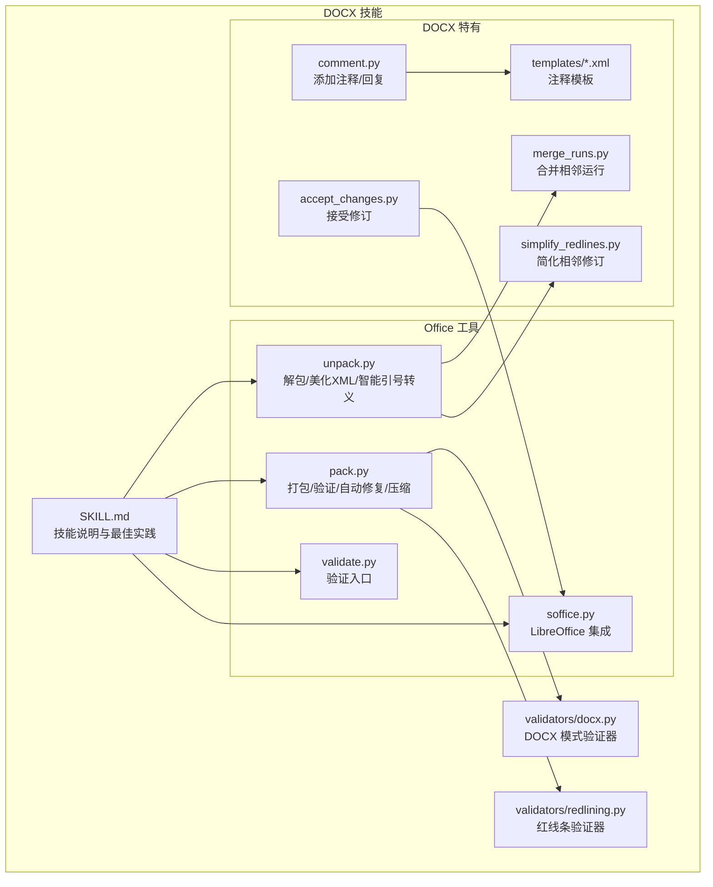
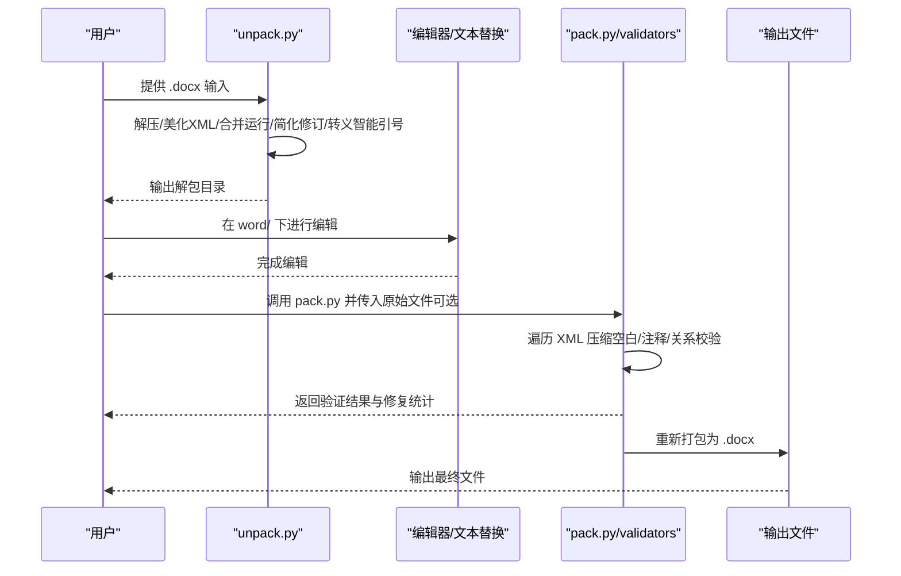
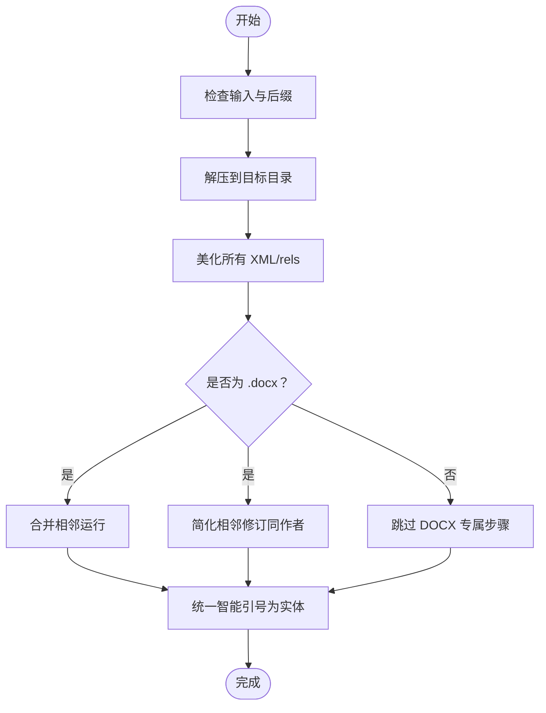
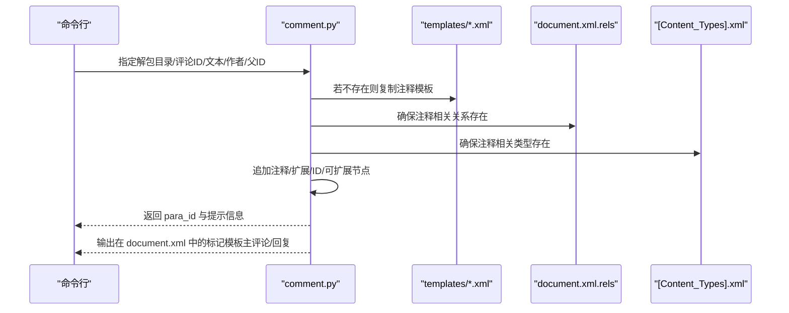
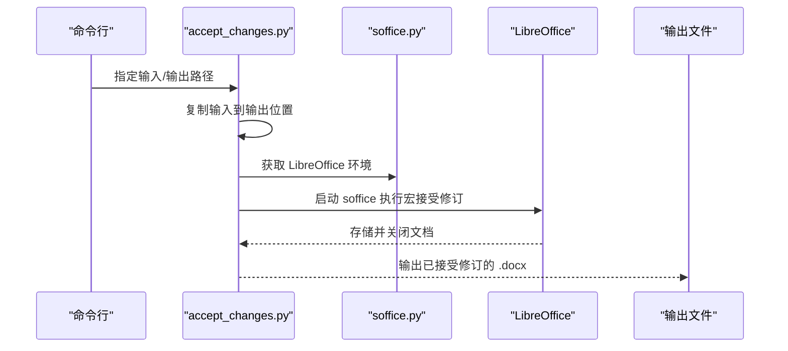
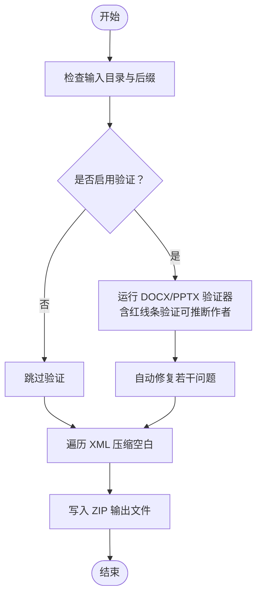
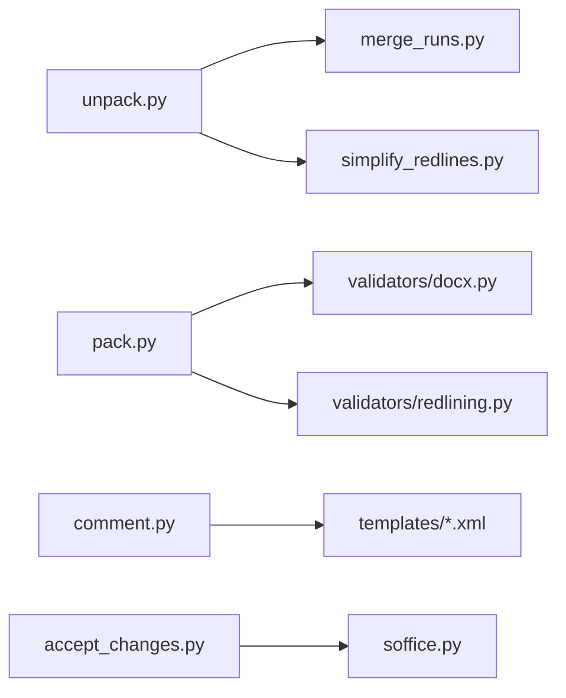

# DOCX 处理技能

<cite>
**本文引用的文件**   
- [SKILL.md](file://skills/skills/docx/SKILL.md)
- [accept_changes.py](file://skills/skills/docx/scripts/accept_changes.py)
- [comment.py](file://skills/skills/docx/scripts/comment.py)
- [unpack.py](file://skills/skills/docx/scripts/office/unpack.py)
- [pack.py](file://skills/skills/docx/scripts/office/pack.py)
- [merge_runs.py](file://skills/skills/docx/scripts/office/helpers/merge_runs.py)
- [simplify_redlines.py](file://skills/skills/docx/scripts/office/helpers/simplify_redlines.py)
- [docx.py](file://skills/skills/docx/scripts/office/validators/docx.py)
- [redlining.py](file://skills/skills/docx/scripts/office/validators/redlining.py)
- [validate.py](file://skills/skills/docx/scripts/office/validate.py)
- [soffice.py](file://skills/skills/docx/scripts/office/soffice.py)
- [comments.xml](file://skills/skills/docx/scripts/templates/comments.xml)
- [commentsExtended.xml](file://skills/skills/docx/scripts/templates/commentsExtended.xml)
- [commentsExtensible.xml](file://skills/skills/docx/scripts/templates/commentsExtensible.xml)
- [commentsIds.xml](file://skills/skills/docx/scripts/templates/commentsIds.xml)
- [people.xml](file://skills/skills/docx/scripts/templates/people.xml)
</cite>

## 目录
1. [简介](#简介)
2. [项目结构](#项目结构)
3. [核心组件](#核心组件)
4. [架构总览](#架构总览)
5. [详细组件分析](#详细组件分析)
6. [依赖分析](#依赖分析)
7. [性能考虑](#性能考虑)
8. [故障排查指南](#故障排查指南)
9. [结论](#结论)
10. [附录](#附录)

## 简介
本技能围绕 DOCX（Word 文档）的完整处理链路，覆盖读取、内容提取、格式化处理、评论与修订管理、文档验证与打包等能力，并深入解释 Office Open XML（OOXML）的结构与关系管理，以及如何基于仓库脚本实现文档合并、简化红线条（修订跟踪）等实用操作。同时给出红线条工作原理、注释与修订的正确处理方式及常见问题定位方法。

## 项目结构
该技能模块位于 skills/skills/docx，包含以下关键目录与文件：
- scripts/office：通用 Office 文档处理工具（解包、打包、验证、LibreOffice 集成）
- scripts/office/helpers：针对 DOCX 的运行合并与红线条简化辅助脚本
- scripts/office/validators：OOXML 验证器（DOCX 模式、红线条模式）
- scripts/office/schemas：OOXML 相关 Schema（ISO-IEC29500、ECMA、Microsoft 扩展）
- scripts/templates：注释相关模板（comments.xml 及扩展）
- scripts/accept_changes.py：使用 LibreOffice 接受所有修订
- scripts/comment.py：在已解包文档中添加注释与回复

图表来源
- [SKILL.md](file://skills/skills/docx/SKILL.md)
- [unpack.py](file://skills/skills/docx/scripts/office/unpack.py)
- [pack.py](file://skills/skills/docx/scripts/office/pack.py)
- [validate.py](file://skills/skills/docx/scripts/office/validate.py)
- [soffice.py](file://skills/skills/docx/scripts/office/soffice.py)
- [merge_runs.py](file://skills/skills/docx/scripts/office/helpers/merge_runs.py)
- [simplify_redlines.py](file://skills/skills/docx/scripts/office/helpers/simplify_redlines.py)
- [comment.py](file://skills/skills/docx/scripts/comment.py)
- [accept_changes.py](file://skills/skills/docx/scripts/accept_changes.py)
- [docx.py](file://skills/skills/docx/scripts/office/validators/docx.py)
- [redlining.py](file://skills/skills/docx/scripts/office/validators/redlining.py)
- [comments.xml](file://skills/skills/docx/scripts/templates/comments.xml)
- [commentsExtended.xml](file://skills/skills/docx/scripts/templates/commentsExtended.xml)
- [commentsExtensible.xml](file://skills/skills/docx/scripts/templates/commentsExtensible.xml)
- [commentsIds.xml](file://skills/skills/docx/scripts/templates/commentsIds.xml)
- [people.xml](file://skills/skills/docx/scripts/templates/people.xml)

章节来源
- [SKILL.md](file://skills/skills/docx/SKILL.md)

## 核心组件
- 解包与美化：将 .docx 解压为可编辑的 XML 结构，美化缩进，必要时合并相邻运行与简化相邻修订，统一智能引号实体，便于后续编辑。
- 注释系统：通过模板生成注释相关 XML 文件，自动维护关系与内容类型，支持添加主评论与回复，并输出在 document.xml 中的标记位置。
- 修订接受：借助 LibreOffice 宏自动化接受所有修订，输出干净文档。
- 打包与验证：将修改后的目录重新打包为 .docx，执行 Schema 与红线条验证，自动修复部分问题，压缩冗余空白。
- 模板与模式：提供注释模板与验证器，确保注释与修订在 OOXML 中合规。

章节来源
- [unpack.py](file://skills/skills/docx/scripts/office/unpack.py)
- [comment.py](file://skills/skills/docx/scripts/comment.py)
- [accept_changes.py](file://skills/skills/docx/scripts/accept_changes.py)
- [pack.py](file://skills/skills/docx/scripts/office/pack.py)
- [docx.py](file://skills/skills/docx/scripts/office/validators/docx.py)
- [redlining.py](file://skills/skills/docx/scripts/office/validators/redlining.py)

## 架构总览
下图展示从输入到输出的关键流程：解包 → 编辑 → 验证 → 打包 → 输出。

图表来源
- [unpack.py](file://skills/skills/docx/scripts/office/unpack.py)
- [pack.py](file://skills/skills/docx/scripts/office/pack.py)
- [docx.py](file://skills/skills/docx/scripts/office/validators/docx.py)
- [redlining.py](file://skills/skills/docx/scripts/office/validators/redlining.py)

## 详细组件分析

### 组件一：解包与预处理（unpack.py）
职责
- 解压 .docx/.pptx/.xlsx
- 美化 XML 缩进
- DOCX 专属：合并相邻运行、简化相邻修订（同作者）
- 统一智能引号为 XML 实体，避免编辑后损坏

关键流程

图表来源
- [unpack.py](file://skills/skills/docx/scripts/office/unpack.py)
- [merge_runs.py](file://skills/skills/docx/scripts/office/helpers/merge_runs.py)
- [simplify_redlines.py](file://skills/skills/docx/scripts/office/helpers/simplify_redlines.py)

章节来源
- [unpack.py](file://skills/skills/docx/scripts/office/unpack.py)

### 组件二：注释与回复（comment.py）
职责
- 自动创建/更新注释相关 XML（comments.xml、commentsExtended.xml、commentsIds.xml、commentsExtensible.xml）
- 维护关系与内容类型，确保引用正确
- 支持添加主评论与回复（通过父评论 ID）

关键流程

图表来源
- [comment.py](file://skills/skills/docx/scripts/comment.py)
- [comments.xml](file://skills/skills/docx/scripts/templates/comments.xml)
- [commentsExtended.xml](file://skills/skills/docx/scripts/templates/commentsExtended.xml)
- [commentsExtensible.xml](file://skills/skills/docx/scripts/templates/commentsExtensible.xml)
- [commentsIds.xml](file://skills/skills/docx/scripts/templates/commentsIds.xml)
- [people.xml](file://skills/skills/docx/scripts/templates/people.xml)

章节来源
- [comment.py](file://skills/skills/docx/scripts/comment.py)

### 组件三：接受修订（accept_changes.py）
职责
- 使用 LibreOffice 宏自动化接受所有修订，输出干净文档
- 通过 soffice.py 获取安全环境变量，避免沙箱限制

关键流程

图表来源
- [accept_changes.py](file://skills/skills/docx/scripts/accept_changes.py)
- [soffice.py](file://skills/skills/docx/scripts/office/soffice.py)

章节来源
- [accept_changes.py](file://skills/skills/docx/scripts/accept_changes.py)

### 组件四：打包与验证（pack.py）
职责
- 将解包目录重新打包为 .docx/.pptx/.xlsx
- 对 .docx 执行 Schema 验证与红线条验证，自动修复部分问题
- 压缩 XML 空白，提升兼容性与体积优化

关键流程

图表来源
- [pack.py](file://skills/skills/docx/scripts/office/pack.py)
- [docx.py](file://skills/skills/docx/scripts/office/validators/docx.py)
- [redlining.py](file://skills/skills/docx/scripts/office/validators/redlining.py)

章节来源
- [pack.py](file://skills/skills/docx/scripts/office/pack.py)

### 组件五：红线条（修订跟踪）处理
- 工作原理：在 OOXML 中，插入与删除分别以 <w:ins> 与 <w:del> 表达；删除内部使用 <w:delText>/<w:delInstrText>，最小化编辑仅标记变更片段。
- 场景应用：审阅批注、版本对比、协作编辑、法律/合同审查等。
- 正确处理要点：
  - 插入/删除必须包裹在独立的 <w:r> 或段落属性中，避免在单个运行内嵌套不一致格式。
  - 删除整段时，需在段落属性中添加 <w:del/>，否则接受变更会留下空段。
  - 接受他人插入时，可在其 <w:ins> 内再嵌套 <w:del> 以拒绝。
  - 恢复他人删除时，在其删除之后追加 <w:ins>，不要修改原删除。

章节来源
- [SKILL.md](file://skills/skills/docx/SKILL.md)

### 组件六：注释与修订的 OOXML 关系管理
- 关系与内容类型：注释需要在 document.xml.rels 中建立关系，并在 [Content_Types].xml 中声明对应内容类型，确保加载正确。
- 标记位置：注释范围标记 <w:commentRangeStart>/<w:commentRangeEnd> 必须作为段落直接子元素，不能放入 <w:r> 内部；引用标记 <w:commentReference> 用于显示“引用注释”的样式文本。

章节来源
- [comment.py](file://skills/skills/docx/scripts/comment.py)
- [SKILL.md](file://skills/skills/docx/SKILL.md)

## 依赖分析
- 外部工具
  - pandoc：文本提取（含跟踪变更）
  - docx（npm）：生成新文档（JS API）
  - LibreOffice：接受修订、PDF 转换
  - Poppler：PDF 转图片
- 内部依赖
  - unpack.py 依赖 helpers/merge_runs.py 与 helpers/simplify_redlines.py
  - pack.py 依赖 validators/docx.py 与 validators/redlining.py
  - comment.py 依赖 templates/*.xml 与 defusedxml.minidom
  - accept_changes.py 依赖 soffice.py

图表来源
- [unpack.py](file://skills/skills/docx/scripts/office/unpack.py)
- [merge_runs.py](file://skills/skills/docx/scripts/office/helpers/merge_runs.py)
- [simplify_redlines.py](file://skills/skills/docx/scripts/office/helpers/simplify_redlines.py)
- [pack.py](file://skills/skills/docx/scripts/office/pack.py)
- [docx.py](file://skills/skills/docx/scripts/office/validators/docx.py)
- [redlining.py](file://skills/skills/docx/scripts/office/validators/redlining.py)
- [comment.py](file://skills/skills/docx/scripts/comment.py)
- [accept_changes.py](file://skills/skills/docx/scripts/accept_changes.py)
- [soffice.py](file://skills/skills/docx/scripts/office/soffice.py)

章节来源
- [SKILL.md](file://skills/skills/docx/SKILL.md)

## 性能考虑
- 解包阶段：对大量 XML 文件进行美化与转义，建议在本地 SSD 上操作，避免网络存储导致的 I/O 延迟。
- 合并运行与简化修订：在大型文档上可能耗时较长，建议在 CI 或离线环境下执行，或分段处理。
- 打包阶段：遍历 XML 压缩空白与重写 ZIP，注意内存占用；对于超大文档，建议分块处理或增加系统可用内存。
- LibreOffice 接受修订：启动开销较大，建议缓存 profile 与宏文件，减少重复初始化时间。

## 故障排查指南
- 解包失败
  - 症状：提示不是有效的 Office 文件或找不到输入
  - 排查：确认后缀为 .docx/.pptx/.xlsx；检查文件完整性与权限
- 美化/转义异常
  - 症状：XML 无法解析或乱码
  - 排查：确认 UTF-8 编码；检查特殊字符是否被正确转义
- 注释未显示
  - 症状：添加注释后打开无效果
  - 排查：确认 relations 与 content types 是否已创建；标记是否放置在段落直接子元素；引用样式是否正确
- 接受修订失败
  - 症状：LibreOffice 报错或超时
  - 排查：确认 soffice 可执行路径与环境变量；检查宏文件是否存在；适当增大超时时间
- 打包后验证失败
  - 症状：Schema 或红线条验证报错
  - 排查：查看自动修复输出；核对段落属性、运行属性、关系与内容类型；必要时回退到解包前状态并逐步修改

章节来源
- [unpack.py](file://skills/skills/docx/scripts/office/unpack.py)
- [comment.py](file://skills/skills/docx/scripts/comment.py)
- [accept_changes.py](file://skills/skills/docx/scripts/accept_changes.py)
- [pack.py](file://skills/skills/docx/scripts/office/pack.py)

## 结论
本技能提供了从解包、编辑、注释与修订管理到打包与验证的完整链路，结合 OOXML 规范与仓库脚本，能够稳定地处理各类 Word 文档场景。遵循文中最佳实践与排错建议，可显著提升文档处理的可靠性与一致性。

## 附录

### 实用操作示例（路径指引）
- 读取与提取
  - 使用 pandoc 提取带修订的文本：[SKILL.md](file://skills/skills/docx/SKILL.md)
  - 直接解包查看原始 XML：[unpack.py](file://skills/skills/docx/scripts/office/unpack.py)
- 创建新文档
  - 使用 JS API 生成并验证：[SKILL.md](file://skills/skills/docx/SKILL.md)
- 编辑现有文档
  - 解包 → 编辑 → 打包：[unpack.py](file://skills/skills/docx/scripts/office/unpack.py)、[pack.py](file://skills/skills/docx/scripts/office/pack.py)
- 添加注释与回复
  - 使用 comment.py：[comment.py](file://skills/skills/docx/scripts/comment.py)
- 接受修订
  - 使用 accept_changes.py：[accept_changes.py](file://skills/skills/docx/scripts/accept_changes.py)
- 红线条处理
  - 参考修订标记与最小化编辑原则：[SKILL.md](file://skills/skills/docx/SKILL.md)