# PDF 处理技能

<cite>
**本文引用的文件**
- [SKILL.md](file://skills/skills/pdf/SKILL.md)
- [forms.md](file://skills/skills/pdf/forms.md)
- [reference.md](file://skills/skills/pdf/reference.md)
- [check_bounding_boxes.py](file://skills/skills/pdf/scripts/check_bounding_boxes.py)
- [check_fillable_fields.py](file://skills/skills/pdf/scripts/check_fillable_fields.py)
- [convert_pdf_to_images.py](file://skills/skills/pdf/scripts/convert_pdf_to_images.py)
- [create_validation_image.py](file://skills/skills/pdf/scripts/create_validation_image.py)
- [extract_form_field_info.py](file://skills/skills/pdf/scripts/extract_form_field_info.py)
- [extract_form_structure.py](file://skills/skills/pdf/scripts/extract_form_structure.py)
- [fill_fillable_fields.py](file://skills/skills/pdf/scripts/fill_fillable_fields.py)
- [fill_pdf_form_with_annotations.py](file://skills/skills/pdf/scripts/fill_pdf_form_with_annotations.py)
</cite>

## 目录
1. [简介](#简介)
2. [项目结构](#项目结构)
3. [核心组件](#核心组件)
4. [架构总览](#架构总览)
5. [详细组件分析](#详细组件分析)
6. [依赖关系分析](#依赖关系分析)
7. [性能考虑](#性能考虑)
8. [故障排查指南](#故障排查指南)
9. [结论](#结论)
10. [附录](#附录)

## 简介
本技能文档系统性介绍 PDF 文件处理的关键能力与最佳实践，覆盖文本提取、表格识别、合并/拆分、页面旋转、水印叠加、表单填写（可填写字段与注释标注）、加密/解密、图像提取、扫描件 OCR 等常见任务。文档同时给出 Python 库（pypdf、pdfplumber、reportlab、pypdfium2）与命令行工具（pdftotext、qpdf、pdftk、pdfimages、pdftoppm 等）的应用场景与示例路径，并提供错误处理与性能优化建议，特别强调 PDF 表单处理的特殊要求与注意事项。

## 项目结构
该技能模块位于 skills/skills/pdf 目录下，包含三类内容：
- 指南与参考：SKILL.md（快速上手与常用操作）、forms.md（表单填写流程与坐标体系）、reference.md（高级用法与扩展）
- 脚本工具：用于表单结构提取、字段信息解析、注释标注填充、边界框校验等自动化流程

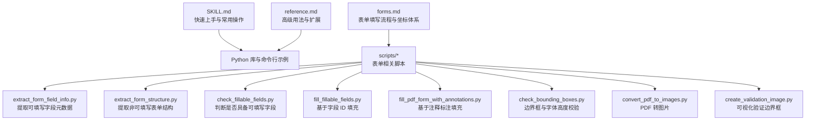

图表来源
- [SKILL.md:1-315](file://skills/skills/pdf/SKILL.md#L1-L315)
- [forms.md:1-295](file://skills/skills/pdf/forms.md#L1-L295)
- [reference.md:1-612](file://skills/skills/pdf/reference.md#L1-L612)
- [extract_form_field_info.py:1-123](file://skills/skills/pdf/scripts/extract_form_field_info.py#L1-L123)
- [extract_form_structure.py:1-116](file://skills/skills/pdf/scripts/extract_form_structure.py#L1-L116)
- [check_fillable_fields.py:1-12](file://skills/skills/pdf/scripts/check_fillable_fields.py#L1-L12)
- [fill_fillable_fields.py:1-99](file://skills/skills/pdf/scripts/fill_fillable_fields.py#L1-L99)
- [fill_pdf_form_with_annotations.py:1-108](file://skills/skills/pdf/scripts/fill_pdf_form_with_annotations.py#L1-L108)
- [check_bounding_boxes.py:1-66](file://skills/skills/pdf/scripts/check_bounding_boxes.py#L1-L66)
- [convert_pdf_to_images.py:1-34](file://skills/skills/pdf/scripts/convert_pdf_to_images.py#L1-L34)
- [create_validation_image.py:1-38](file://skills/skills/pdf/scripts/create_validation_image.py#L1-L38)

章节来源
- [SKILL.md:1-315](file://skills/skills/pdf/SKILL.md#L1-L315)
- [forms.md:1-295](file://skills/skills/pdf/forms.md#L1-L295)
- [reference.md:1-612](file://skills/skills/pdf/reference.md#L1-L612)

## 核心组件
- 文本与表格提取：pdfplumber 提供布局感知的文本与表格抽取；pypdf 可进行基础文本提取与元数据读取；命令行 pdftotext 支持保留版式或仅纯文本提取。
- PDF 合并与拆分：pypdf 的 PdfWriter/PdfReader 实现页级合并与拆分；qpdf 提供更丰富的命令行合并/拆分与页面选择。
- 页面旋转与裁剪：pypdf 支持页面旋转与裁剪（修改 MediaBox）。
- 水印叠加：通过将水印页与目标页合并实现。
- 表单处理：可填写字段（AcroForm）与注释标注两种方式。前者依赖字段 ID 与值校验；后者依赖精确的边界框坐标转换。
- 加密/解密：pypdf 支持加密与解密；qpdf 提供更多权限控制与修复能力。
- 图像提取：pdfimages 快速提取嵌入图像；pdfplumber/pypdfium2 可渲染页面生成图像。
- 扫描件 OCR：pdf2image 将 PDF 转图像，再由 pytesseract 进行 OCR。

章节来源
- [SKILL.md:28-315](file://skills/skills/pdf/SKILL.md#L28-L315)
- [reference.md:5-612](file://skills/skills/pdf/reference.md#L5-L612)

## 架构总览
以下图展示“表单填写”在不同场景下的两条主路径：可填写字段（AcroForm）与注释标注（FreeText）。两条路径均依赖结构/坐标提取与边界框校验，最终通过 pypdf 写出结果。

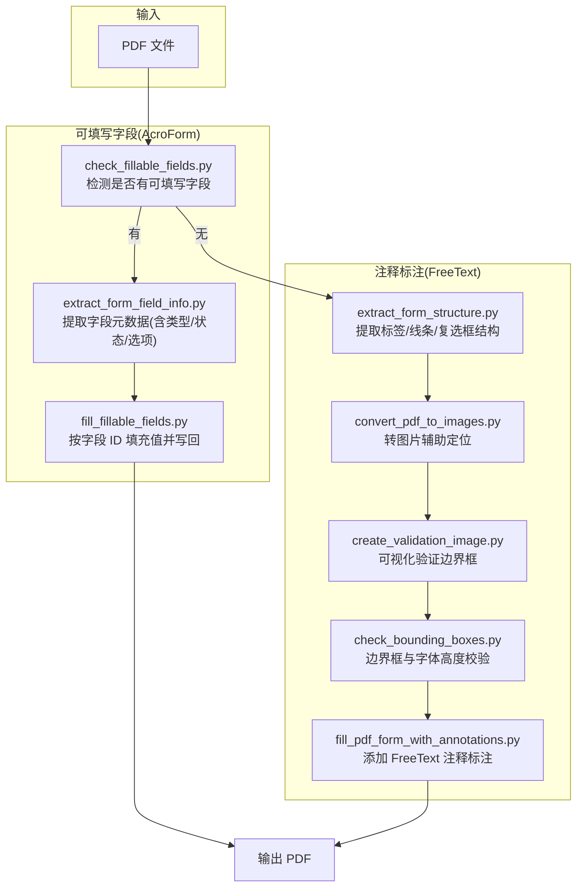

图表来源
- [check_fillable_fields.py:1-12](file://skills/skills/pdf/scripts/check_fillable_fields.py#L1-L12)
- [extract_form_field_info.py:1-123](file://skills/skills/pdf/scripts/extract_form_field_info.py#L1-L123)
- [fill_fillable_fields.py:1-99](file://skills/skills/pdf/scripts/fill_fillable_fields.py#L1-L99)
- [extract_form_structure.py:1-116](file://skills/skills/pdf/scripts/extract_form_structure.py#L1-L116)
- [convert_pdf_to_images.py:1-34](file://skills/skills/pdf/scripts/convert_pdf_to_images.py#L1-L34)
- [create_validation_image.py:1-38](file://skills/skills/pdf/scripts/create_validation_image.py#L1-L38)
- [check_bounding_boxes.py:1-66](file://skills/skills/pdf/scripts/check_bounding_boxes.py#L1-L66)
- [fill_pdf_form_with_annotations.py:1-108](file://skills/skills/pdf/scripts/fill_pdf_form_with_annotations.py#L1-L108)

## 详细组件分析

### 文本与表格提取（pdfplumber 与 pypdf）
- 布局感知文本：pdfplumber 的页面对象支持提取文本与字符级坐标，适合需要结构化输出的场景。
- 表格提取：pdfplumber 提供表格抽取接口，可结合 pandas 导出为电子表格。
- 元数据与基础文本：pypdf 的 PdfReader 支持读取元数据与逐页文本提取。

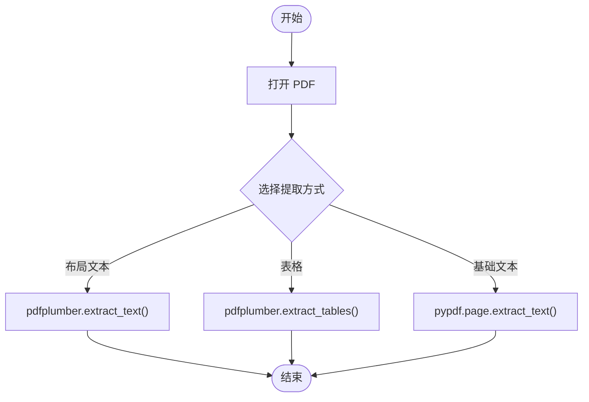

图表来源
- [SKILL.md:79-119](file://skills/skills/pdf/SKILL.md#L79-L119)
- [reference.md:345-383](file://skills/skills/pdf/reference.md#L345-L383)

章节来源
- [SKILL.md:79-119](file://skills/skills/pdf/SKILL.md#L79-L119)
- [reference.md:345-383](file://skills/skills/pdf/reference.md#L345-L383)

### PDF 合并与拆分（pypdf 与 qpdf）
- pypdf：逐页添加到 PdfWriter，实现合并；拆分可对每页单独写出。
- qpdf：命令行支持复杂范围选择、分组拆分、线性化优化等。

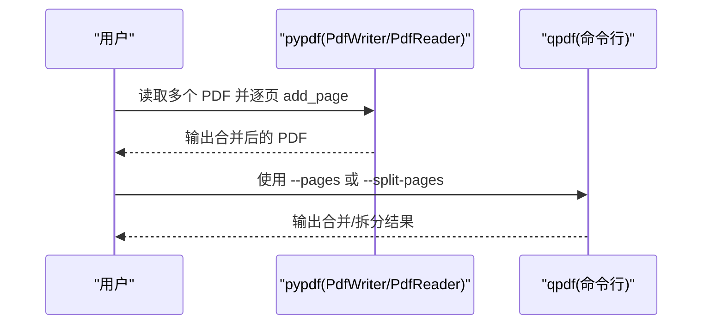

图表来源
- [SKILL.md:30-54](file://skills/skills/pdf/SKILL.md#L30-L54)
- [SKILL.md:203-229](file://skills/skills/pdf/SKILL.md#L203-L229)
- [reference.md:301-342](file://skills/skills/pdf/reference.md#L301-L342)

章节来源
- [SKILL.md:30-54](file://skills/skills/pdf/SKILL.md#L30-L54)
- [SKILL.md:203-229](file://skills/skills/pdf/SKILL.md#L203-L229)
- [reference.md:301-342](file://skills/skills/pdf/reference.md#L301-L342)

### 页面旋转与裁剪
- 旋转：对页面对象调用旋转方法后写回。
- 裁剪：通过修改页面的 MediaBox 实现。

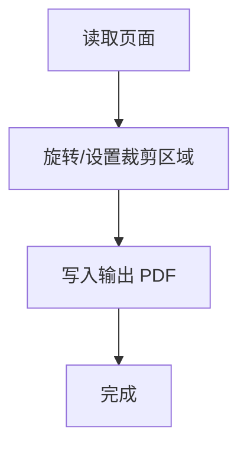

图表来源
- [SKILL.md:66-77](file://skills/skills/pdf/SKILL.md#L66-L77)
- [reference.md:509-526](file://skills/skills/pdf/reference.md#L509-L526)

章节来源
- [SKILL.md:66-77](file://skills/skills/pdf/SKILL.md#L66-L77)
- [reference.md:509-526](file://skills/skills/pdf/reference.md#L509-L526)

### 水印叠加
- 将水印页与目标页逐页合并，实现整页水印。

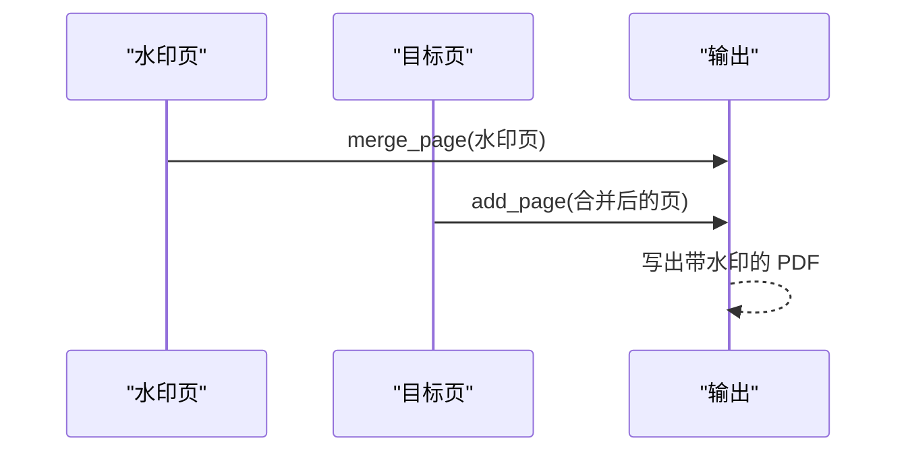

图表来源
- [SKILL.md:252-269](file://skills/skills/pdf/SKILL.md#L252-L269)

章节来源
- [SKILL.md:252-269](file://skills/skills/pdf/SKILL.md#L252-L269)

### 表单填写（可填写字段）
- 流程要点：先检测是否存在可填写字段；若存在，提取字段元数据（类型、状态、选项、页码、矩形等），再按字段 ID 填充值并写回。
- 字段类型校验：复选框、单选组、下拉列表均有特定值集合，需严格校验。

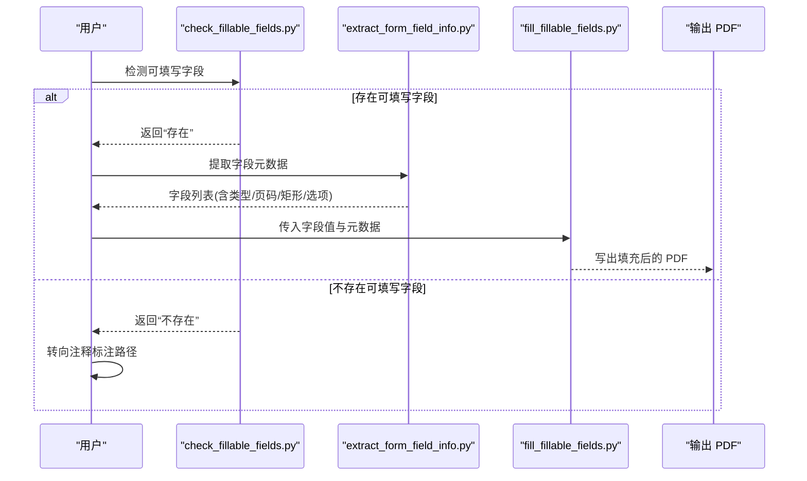

图表来源
- [check_fillable_fields.py:1-12](file://skills/skills/pdf/scripts/check_fillable_fields.py#L1-L12)
- [extract_form_field_info.py:1-123](file://skills/skills/pdf/scripts/extract_form_field_info.py#L1-L123)
- [fill_fillable_fields.py:1-99](file://skills/skills/pdf/scripts/fill_fillable_fields.py#L1-L99)

章节来源
- [forms.md:1-77](file://skills/skills/pdf/forms.md#L1-L77)
- [check_fillable_fields.py:1-12](file://skills/skills/pdf/scripts/check_fillable_fields.py#L1-L12)
- [extract_form_field_info.py:1-123](file://skills/skills/pdf/scripts/extract_form_field_info.py#L1-L123)
- [fill_fillable_fields.py:1-99](file://skills/skills/pdf/scripts/fill_fillable_fields.py#L1-L99)

### 表单填写（注释标注）
- 结构优先：优先使用 pdfplumber 提取标签、线条、复选框等结构，计算字段入口区域。
- 视觉估计：当结构不可用时，转为图片分析，使用 zoom crop 精确测量坐标。
- 坐标转换：支持从图片坐标到 PDF 坐标的转换，统一坐标系。
- 边界框校验：检查交叉与过小的高度，避免文字重叠或截断。
- 注释标注：使用 FreeText 注释将文本写入指定矩形区域。

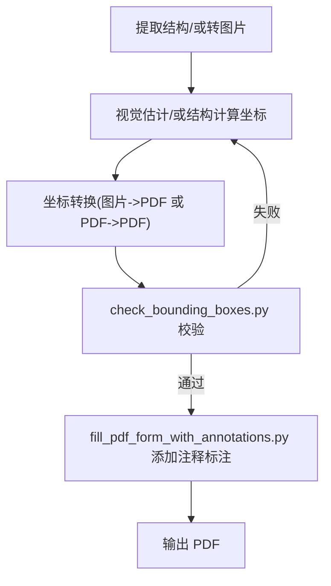

图表来源
- [forms.md:81-295](file://skills/skills/pdf/forms.md#L81-L295)
- [extract_form_structure.py:1-116](file://skills/skills/pdf/scripts/extract_form_structure.py#L1-L116)
- [convert_pdf_to_images.py:1-34](file://skills/skills/pdf/scripts/convert_pdf_to_images.py#L1-L34)
- [create_validation_image.py:1-38](file://skills/skills/pdf/scripts/create_validation_image.py#L1-L38)
- [check_bounding_boxes.py:1-66](file://skills/skills/pdf/scripts/check_bounding_boxes.py#L1-L66)
- [fill_pdf_form_with_annotations.py:1-108](file://skills/skills/pdf/scripts/fill_pdf_form_with_annotations.py#L1-L108)

章节来源
- [forms.md:81-295](file://skills/skills/pdf/forms.md#L81-L295)
- [extract_form_structure.py:1-116](file://skills/skills/pdf/scripts/extract_form_structure.py#L1-L116)
- [convert_pdf_to_images.py:1-34](file://skills/skills/pdf/scripts/convert_pdf_to_images.py#L1-L34)
- [create_validation_image.py:1-38](file://skills/skills/pdf/scripts/create_validation_image.py#L1-L38)
- [check_bounding_boxes.py:1-66](file://skills/skills/pdf/scripts/check_bounding_boxes.py#L1-L66)
- [fill_pdf_form_with_annotations.py:1-108](file://skills/skills/pdf/scripts/fill_pdf_form_with_annotations.py#L1-L108)

### 加密/解密与修复
- pypdf：支持加密与解密；对已加密文档需先尝试解密。
- qpdf：提供权限控制、加密状态查询、修复损坏结构、线性化优化等。

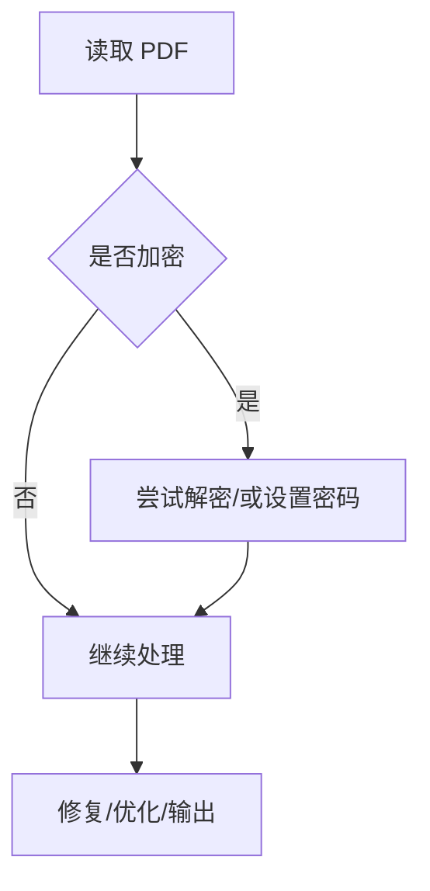

图表来源
- [reference.md:567-601](file://skills/skills/pdf/reference.md#L567-L601)
- [SKILL.md:279-294](file://skills/skills/pdf/SKILL.md#L279-L294)

章节来源
- [reference.md:567-601](file://skills/skills/pdf/reference.md#L567-L601)
- [SKILL.md:279-294](file://skills/skills/pdf/SKILL.md#L279-L294)

### 图像提取与 OCR
- 图像提取：pdfimages 快速提取嵌入图像；pdfplumber/pypdfium2 可渲染页面生成图像。
- OCR：pdf2image 将 PDF 转图像，pytesseract 对图像做 OCR。

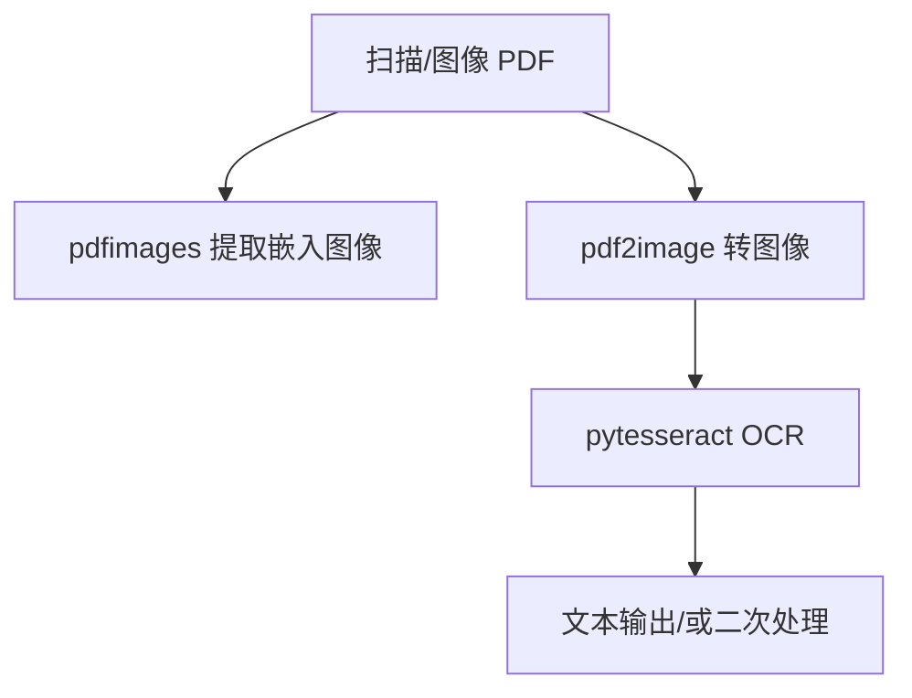

图表来源
- [SKILL.md:271-250](file://skills/skills/pdf/SKILL.md#L271-L250)
- [reference.md:428-462](file://skills/skills/pdf/reference.md#L428-L462)

章节来源
- [SKILL.md:271-250](file://skills/skills/pdf/SKILL.md#L271-L250)
- [reference.md:428-462](file://skills/skills/pdf/reference.md#L428-L462)

## 依赖关系分析
- pypdf 是核心库，负责：读取/写入、表单字段管理、注释标注、加密/解密、页面旋转/裁剪、合并/拆分。
- pdfplumber 用于结构化文本/表格提取与表单结构分析。
- pypdfium2 用于高性能渲染与图像生成（高级场景）。
- 命令行工具：pdftotext/qpdf/pdfimages/pdftoppm 等用于批量、修复、优化与快速提取。
- 表单处理脚本之间存在明确的依赖链：字段检测 → 字段信息提取 → 填充 → 校验 → 输出。

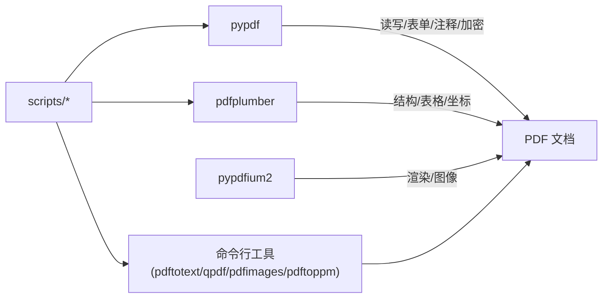

图表来源
- [SKILL.md:28-315](file://skills/skills/pdf/SKILL.md#L28-L315)
- [reference.md:5-612](file://skills/skills/pdf/reference.md#L5-L612)
- [check_fillable_fields.py:1-12](file://skills/skills/pdf/scripts/check_fillable_fields.py#L1-L12)
- [extract_form_field_info.py:1-123](file://skills/skills/pdf/scripts/extract_form_field_info.py#L1-L123)
- [fill_fillable_fields.py:1-99](file://skills/skills/pdf/scripts/fill_fillable_fields.py#L1-L99)
- [extract_form_structure.py:1-116](file://skills/skills/pdf/scripts/extract_form_structure.py#L1-L116)
- [fill_pdf_form_with_annotations.py:1-108](file://skills/skills/pdf/scripts/fill_pdf_form_with_annotations.py#L1-L108)
- [check_bounding_boxes.py:1-66](file://skills/skills/pdf/scripts/check_bounding_boxes.py#L1-L66)

章节来源
- [SKILL.md:28-315](file://skills/skills/pdf/SKILL.md#L28-L315)
- [reference.md:5-612](file://skills/skills/pdf/reference.md#L5-L612)

## 性能考虑
- 大文件处理：优先使用命令行 qpdf 分割或按页流式处理；pypdfium2 渲染高分辨率时注意内存占用。
- 文本提取：pdftotext -bbox-layout 在纯文本场景最快；pdfplumber 更适合结构化数据与表格。
- 图像提取：pdfimages 比渲染页面更快；预览用低分辨率，最终导出用高分辨率。
- 表单填充：pdf-lib 在前端环境保持表单结构更好；后端可用 pypdf，但需严格校验字段类型与值。
- 内存管理：分块处理（按页号范围）减少一次性加载。

章节来源
- [reference.md:528-566](file://skills/skills/pdf/reference.md#L528-L566)
- [SKILL.md:296-308](file://skills/skills/pdf/SKILL.md#L296-L308)

## 故障排查指南
- 加密 PDF：先尝试解密，若失败检查密码；必要时使用 qpdf 修复结构。
- 文本提取问题：扫描件使用 OCR；确认坐标与版式参数；必要时改用 pdfplumber。
- 表单字段无效：核对字段 ID 与页码；复核字段类型与允许值集合。
- 边界框错误：检查交叉与高度过小问题；使用校验脚本与可视化工具。
- 输出异常：确认注释标注坐标系（PDF 坐标系以左下为原点，注释标注需转换）。

章节来源
- [reference.md:567-601](file://skills/skills/pdf/reference.md#L567-L601)
- [check_bounding_boxes.py:1-66](file://skills/skills/pdf/scripts/check_bounding_boxes.py#L1-L66)
- [fill_pdf_form_with_annotations.py:1-108](file://skills/skills/pdf/scripts/fill_pdf_form_with_annotations.py#L1-L108)

## 结论
本技能模块提供了从基础到高级的 PDF 处理能力，涵盖文本/表格提取、合并/拆分、旋转/裁剪、水印、表单填写、加密/解密、图像提取与 OCR。通过 pypdf、pdfplumber、pypdfium2 与命令行工具的组合，可在不同场景下取得最佳效果。表单处理尤其强调字段元数据与坐标体系的准确性，建议遵循“结构优先、坐标转换、严格校验”的流程，确保输出质量与一致性。

## 附录
- 快速参考（任务-工具-示例路径）
  - 合并 PDF：pypdf（示例路径见 SKILL.md 合并示例）
  - 拆分 PDF：pypdf（示例路径见 SKILL.md 拆分示例）
  - 提取文本：pdfplumber（示例路径见 SKILL.md 文本提取）
  - 提取表格：pdfplumber（示例路径见 SKILL.md 表格提取）
  - 创建 PDF：reportlab（示例路径见 SKILL.md 报告生成）
  - 命令行合并：qpdf（示例路径见 SKILL.md qpdf 示例）
  - 扫描件 OCR：pytesseract + pdf2image（示例路径见 SKILL.md OCR 示例）
  - 填写表单：pdf-lib 或 pypdf（详见 forms.md 与 reference.md）

章节来源
- [SKILL.md:296-315](file://skills/skills/pdf/SKILL.md#L296-L315)
- [forms.md:1-295](file://skills/skills/pdf/forms.md#L1-L295)
- [reference.md:46-139](file://skills/skills/pdf/reference.md#L46-L139)