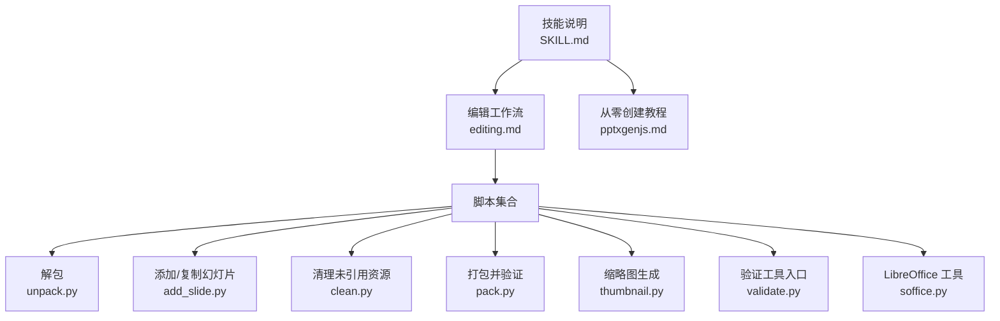
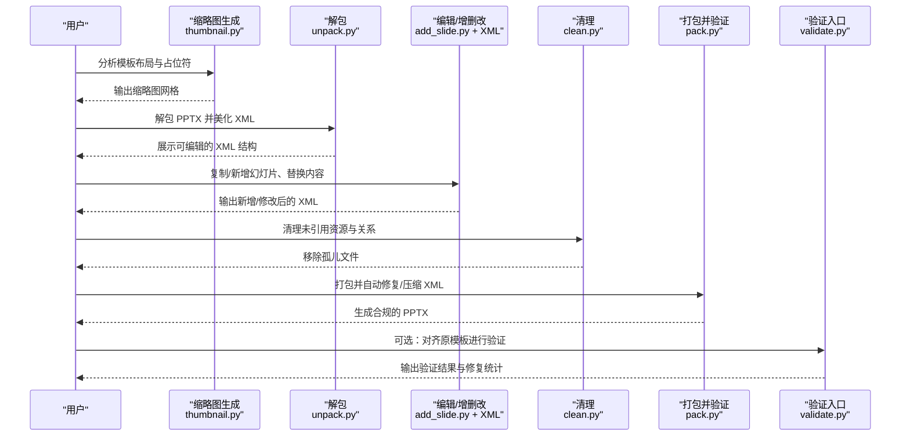
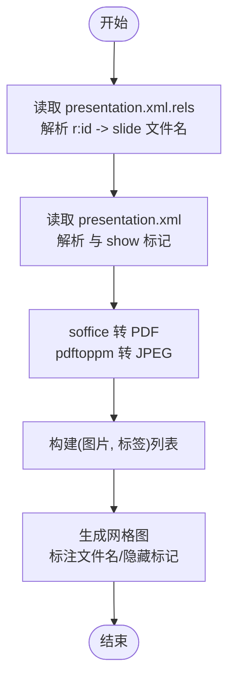
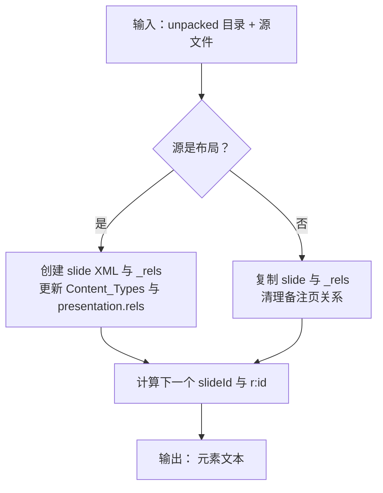
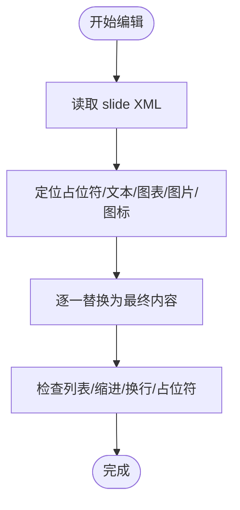
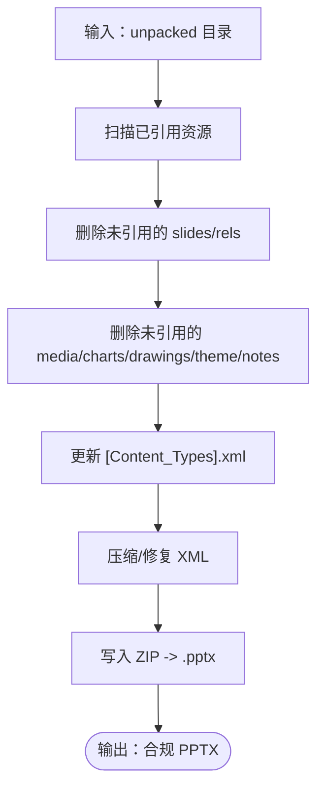
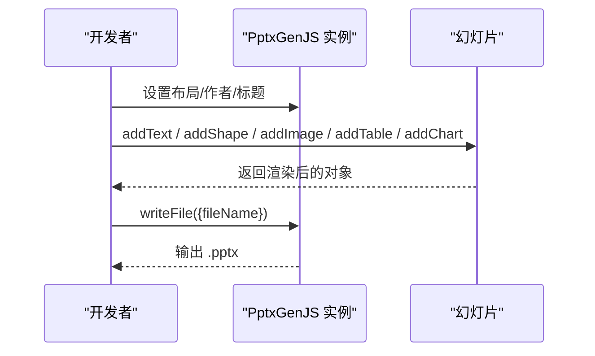
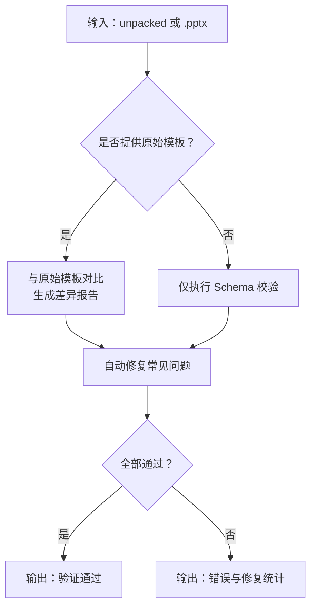
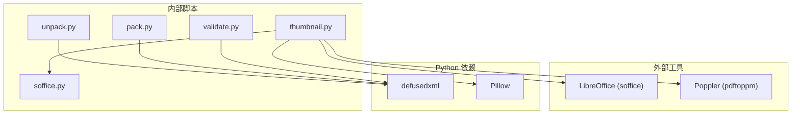

# PPTX 处理技能

<cite>
**本文引用的文件**
- [SKILL.md](file://skills/skills/pptx/SKILL.md)
- [editing.md](file://skills/skills/pptx/editing.md)
- [pptxgenjs.md](file://skills/skills/pptx/pptxgenjs.md)
- [add_slide.py](file://skills/skills/pptx/scripts/add_slide.py)
- [thumbnail.py](file://skills/skills/pptx/scripts/thumbnail.py)
- [clean.py](file://skills/skills/pptx/scripts/clean.py)
- [unpack.py](file://skills/skills/pptx/scripts/office/unpack.py)
- [pack.py](file://skills/skills/pptx/scripts/office/pack.py)
- [validate.py](file://skills/skills/pptx/scripts/office/validate.py)
- [soffice.py](file://skills/skills/pptx/scripts/office/soffice.py)
</cite>

## 目录
1. [简介](#简介)
2. [项目结构](#项目结构)
3. [核心组件](#核心组件)
4. [架构总览](#架构总览)
5. [详细组件分析](#详细组件分析)
6. [依赖分析](#依赖分析)
7. [性能考虑](#性能考虑)
8. [故障排查指南](#故障排查指南)
9. [结论](#结论)
10. [附录](#附录)

## 简介
本技能面向 PowerPoint 演示文稿（.pptx）的全链路处理能力，覆盖从模板分析、幻灯片创建与编辑、内容替换、布局与主题管理、图表与图片处理到缩略图生成与最终打包输出的完整流程。同时，系统性解释 Office Open XML PowerPoint 格式的关键结构（如演示文稿、SlideMaster、SlideLayout、Slide、关系与内容类型等），并提供基于 python-pptx 的模板化编辑工作流与基于 pptxgenjs 的从零创建方案。文档还包含针对 PowerPoint 特有的验证机制、格式要求与常见陷阱的实践建议。

## 项目结构
该技能模块围绕“模板驱动 + 脚本化编辑 + 自动验证”的思路组织，主要分为三部分：
- 技能说明与设计规范：快速参考、读取/分析、编辑流程、创建从零、设计要点、QA 流程、图像转换与依赖
- 编辑工作流脚本：解包、添加/复制幻灯片、清理、打包、缩略图生成
- Office Open XML 验证与工具：unpack/pack/validate、LibreOffice 辅助

**图表来源**
- [SKILL.md:1-233](file://skills/skills/pptx/SKILL.md#L1-L233)
- [editing.md:1-206](file://skills/skills/pptx/editing.md#L1-L206)
- [pptxgenjs.md:1-421](file://skills/skills/pptx/pptxgenjs.md#L1-L421)
- [unpack.py:1-133](file://skills/skills/pptx/scripts/office/unpack.py#L1-L133)
- [add_slide.py:1-196](file://skills/skills/pptx/scripts/add_slide.py#L1-L196)
- [clean.py:1-287](file://skills/skills/pptx/scripts/clean.py#L1-L287)
- [pack.py:1-160](file://skills/skills/pptx/scripts/office/pack.py#L1-L160)
- [thumbnail.py:1-290](file://skills/skills/pptx/scripts/thumbnail.py#L1-L290)
- [validate.py:1-112](file://skills/skills/pptx/scripts/office/validate.py#L1-L112)
- [soffice.py:1-184](file://skills/skills/pptx/scripts/office/soffice.py#L1-L184)

**章节来源**
- [SKILL.md:1-233](file://skills/skills/pptx/SKILL.md#L1-L233)
- [editing.md:1-206](file://skills/skills/pptx/editing.md#L1-L206)
- [pptxgenjs.md:1-421](file://skills/skills/pptx/pptxgenjs.md#L1-L421)

## 核心组件
- 模板分析与缩略图：通过缩略图快速识别布局、隐藏页与占位符分布，辅助选择复用或新建策略
- 幻灯片增删改：支持从布局创建新幻灯片、复制现有幻灯片、在 presentation.xml 中调整顺序与引用
- 内容编辑：逐页 XML 编辑，遵循段落/列表/占位符规范，避免溢出与格式错乱
- 清理与打包：移除未引用资源与关系、修复与压缩 XML、按原模板进行验证
- 从零创建：使用 pptxgenjs 定义布局、主版、图表、表格、形状与图片，实现动态内容生成与样式定制
- 验证与修复：基于 XSD 与 OOXML 规则的自动修复与验证，确保兼容性与稳定性

**章节来源**
- [editing.md:1-206](file://skills/skills/pptx/editing.md#L1-L206)
- [thumbnail.py:1-290](file://skills/skills/pptx/scripts/thumbnail.py#L1-L290)
- [add_slide.py:1-196](file://skills/skills/pptx/scripts/add_slide.py#L1-L196)
- [clean.py:1-287](file://skills/skills/pptx/scripts/clean.py#L1-L287)
- [pack.py:1-160](file://skills/skills/pptx/scripts/office/pack.py#L1-L160)
- [validate.py:1-112](file://skills/skills/pptx/scripts/office/validate.py#L1-L112)
- [pptxgenjs.md:1-421](file://skills/skills/pptx/pptxgenjs.md#L1-L421)

## 架构总览
下图展示从模板到成品的端到端流程：先分析模板，再解包、编辑、清理、打包；同时可随时生成缩略图进行视觉校验；最终通过验证确保合规。

**图表来源**
- [thumbnail.py:1-290](file://skills/skills/pptx/scripts/thumbnail.py#L1-L290)
- [unpack.py:1-133](file://skills/skills/pptx/scripts/office/unpack.py#L1-L133)
- [add_slide.py:1-196](file://skills/skills/pptx/scripts/add_slide.py#L1-L196)
- [clean.py:1-287](file://skills/skills/pptx/scripts/clean.py#L1-L287)
- [pack.py:1-160](file://skills/skills/pptx/scripts/office/pack.py#L1-L160)
- [validate.py:1-112](file://skills/skills/pptx/scripts/office/validate.py#L1-L112)

## 详细组件分析

### 组件一：模板分析与缩略图生成
- 功能要点
  - 通过 LibreOffice 将 PPTX 转 PDF 再转 JPEG，生成每页缩略图
  - 读取 presentation.xml 与 presentation.xml.rels，识别可见/隐藏页及其对应 XML 文件名
  - 支持多页网格拼接，自动标注文件名，便于后续定位与编辑
- 使用场景
  - 快速浏览模板布局、占位符位置与隐藏页
  - 为“按内容类型匹配布局”的策略提供依据
- 注意事项
  - 仅用于模板分析，不替代最终视觉 QA；最终仍需生成高分辨率单页图进行细致检查

**图表来源**
- [thumbnail.py:95-146](file://skills/skills/pptx/scripts/thumbnail.py#L95-L146)
- [thumbnail.py:158-193](file://skills/skills/pptx/scripts/thumbnail.py#L158-L193)
- [thumbnail.py:196-285](file://skills/skills/pptx/scripts/thumbnail.py#L196-L285)

**章节来源**
- [editing.md:7-12](file://skills/skills/pptx/editing.md#L7-L12)
- [thumbnail.py:1-290](file://skills/skills/pptx/scripts/thumbnail.py#L1-L290)

### 组件二：幻灯片增删改（基于模板）
- 功能要点
  - 从布局创建新幻灯片：自动生成 slide XML 与关系，更新 Content_Types 与 presentation.xml.rels
  - 复制现有幻灯片：保留/清理备注页关系，更新引用与内容类型
  - 新增幻灯片后打印可在 presentation.xml 中插入的 <p:sldId>，便于重排
- 关键数据流
  - Slide 增删改依赖于 presentation.xml 中的 <p:sldIdLst> 顺序与 r:id 引用
  - 关系文件（.rels）必须与目标资源一一对应，否则打包会失败

**图表来源**
- [add_slide.py:33-88](file://skills/skills/pptx/scripts/add_slide.py#L33-L88)
- [add_slide.py:90-127](file://skills/skills/pptx/scripts/add_slide.py#L90-L127)
- [add_slide.py:130-162](file://skills/skills/pptx/scripts/add_slide.py#L130-L162)

**章节来源**
- [editing.md:101-110](file://skills/skills/pptx/editing.md#L101-L110)
- [add_slide.py:1-196](file://skills/skills/pptx/scripts/add_slide.py#L1-L196)

### 组件三：内容编辑与格式规范
- 编辑方式
  - 将模板解包后，每个 slide 为独立 XML 文件，可并行编辑
  - 使用“编辑工具”进行精确替换，避免误改
- 格式与排版规范
  - 标题/小节标题/内联标签统一加粗
  - 列表使用标准 OOXML 列表标记，禁止直接使用 Unicode 符号
  - 多项内容拆分为多个段落，保持行距与缩进一致
  - 文本空白保留使用 xml:space="preserve"
- 常见陷阱
  - 模板槽位与源数据数量不一致时，应整体删除多余元素，而非仅清空文本
  - 长文本替换可能导致换行/溢出，需结合视觉 QA 验证

**图表来源**
- [editing.md:113-136](file://skills/skills/pptx/editing.md#L113-L136)
- [editing.md:138-205](file://skills/skills/pptx/editing.md#L138-L205)

**章节来源**
- [editing.md:113-205](file://skills/skills/pptx/editing.md#L113-L205)

### 组件四：清理与打包（含验证）
- 清理逻辑
  - 删除不在 <p:sldIdLst> 中的幻灯片及对应关系
  - 清理 [trash] 目录与未被任何关系引用的媒体/图表/绘图/主题/备注页
  - 更新 [Content_Types].xml 中的 Override 条目
- 打包与验证
  - 压缩 XML（去除空行/注释），修复命名空间与实体
  - 可选：与原始模板对比进行验证与自动修复
- 输出
  - 生成合规的 .pptx，可直接打开与分享

**图表来源**
- [clean.py:27-88](file://skills/skills/pptx/scripts/clean.py#L27-L88)
- [clean.py:106-218](file://skills/skills/pptx/scripts/clean.py#L106-L218)
- [pack.py:24-66](file://skills/skills/pptx/scripts/office/pack.py#L24-L66)
- [pack.py:108-129](file://skills/skills/pptx/scripts/office/pack.py#L108-L129)

**章节来源**
- [editing.md:31-43](file://skills/skills/pptx/editing.md#L31-L43)
- [clean.py:1-287](file://skills/skills/pptx/scripts/clean.py#L1-L287)
- [pack.py:1-160](file://skills/skills/pptx/scripts/office/pack.py#L1-L160)

### 组件五：从零创建（pptxgenjs）
- 基本结构
  - 定义布局尺寸（16x9/16x10/4x3/WIDE）
  - 添加文本、富文本、列表、表格、形状、图片、图标
  - 定义 Slide Master 与标题页
- 图表与样式
  - 支持柱状/折线/饼图等，可配置颜色、网格、数据标签、图例位置
  - 提供阴影、透明度、圆角矩形等样式选项
- 常见陷阱
  - 颜色值不带“#”，透明度用单独属性
  - 不要复用同一选项对象多次调用，避免内部 EMU 转换单元污染
  - 圆角矩形不建议叠加矩形强调条，易露底边

**图表来源**
- [pptxgenjs.md:5-17](file://skills/skills/pptx/pptxgenjs.md#L5-L17)
- [pptxgenjs.md:287-347](file://skills/skills/pptx/pptxgenjs.md#L287-L347)
- [pptxgenjs.md:366-411](file://skills/skills/pptx/pptxgenjs.md#L366-L411)

**章节来源**
- [pptxgenjs.md:1-421](file://skills/skills/pptx/pptxgenjs.md#L1-L421)

### 组件六：Office Open XML 验证与修复
- 验证范围
  - PPTX Schema 校验（OOXML 规范）
  - 可选：与原始模板对比，报告差异与修复建议
- 自动修复
  - 修复 ID/持久化 ID 超限问题
  - 为含空白的文本节点补 xml:space="preserve"
- 工具链
  - 命令行入口 validate.py
  - pack.py 内部集成验证与修复
  - unpack.py 在解包时美化 XML 并转义智能引号

**图表来源**
- [validate.py:25-107](file://skills/skills/pptx/scripts/office/validate.py#L25-L107)
- [pack.py:69-105](file://skills/skills/pptx/scripts/office/pack.py#L69-L105)
- [unpack.py:34-98](file://skills/skills/pptx/scripts/office/unpack.py#L34-L98)

**章节来源**
- [validate.py:1-112](file://skills/skills/pptx/scripts/office/validate.py#L1-L112)
- [pack.py:1-160](file://skills/skills/pptx/scripts/office/pack.py#L1-L160)
- [unpack.py:1-133](file://skills/skills/pptx/scripts/office/unpack.py#L1-L133)

## 依赖分析
- 外部工具
  - LibreOffice（soffice）：PPTX 转 PDF 的核心依赖，提供 headless 转换能力
  - Poppler（pdftoppm）：将 PDF 转为 JPEG，用于缩略图生成
  - Python 依赖：defusedxml（安全解析 XML）、Pillow（图像处理）
- 内部依赖
  - soffice.py 提供环境适配（沙箱/VM 等 AF_UNIX socket 限制场景）
  - unpack.py/pack.py/validate.py 共用 validators 子模块（PPTX Schema 与修复逻辑）

**图表来源**
- [thumbnail.py:158-193](file://skills/skills/pptx/scripts/thumbnail.py#L158-L193)
- [soffice.py:24-37](file://skills/skills/pptx/scripts/office/soffice.py#L24-L37)
- [unpack.py:21-24](file://skills/skills/pptx/scripts/office/unpack.py#L21-L24)
- [pack.py:20-22](file://skills/skills/pptx/scripts/office/pack.py#L20-L22)
- [validate.py:22-22](file://skills/skills/pptx/scripts/office/validate.py#L22-L22)

**章节来源**
- [SKILL.md:226-233](file://skills/skills/pptx/SKILL.md#L226-L233)
- [thumbnail.py:1-290](file://skills/skills/pptx/scripts/thumbnail.py#L1-L290)
- [soffice.py:1-184](file://skills/skills/pptx/scripts/office/soffice.py#L1-L184)

## 性能考虑
- 缩略图生成
  - DPI 与缩略图宽度影响生成速度与质量，建议在分析阶段使用较低 DPI（如 100），最终 QA 使用更高分辨率
  - 多页网格分块输出，避免单图过大导致内存压力
- 解包/打包
  - 解包时仅美化 XML，不进行大文件处理；打包前压缩 XML 可显著减小体积
  - 清理阶段采用两轮扫描（先删 .rels，再删资源），减少重复 IO
- LibreOffice 调用
  - soffice.py 在受限环境中自动注入 LD_PRELOAD shim，避免阻塞；尽量复用进程或减少调用次数

[本节为通用指导，无需特定文件引用]

## 故障排查指南
- 常见问题与对策
  - “找不到 slide 或关系异常”：检查 presentation.xml 中 <p:sldIdLst> 顺序与 r:id 是否与 slides/*.xml 匹配
  - “打包后无法打开”：运行验证入口，查看修复统计；必要时关闭验证以定位具体 XML 错误
  - “缩略图缺失或空白”：确认 soffice 与 pdftoppm 可用；检查临时目录权限
  - “文本溢出/换行异常”：长文本替换后进行视觉 QA；必要时拆分为多段落
- 建议流程
  - 读取内容 → 生成缩略图 → 解包 → 编辑 → 清理 → 打包 → 验证 → 视觉 QA → 循环修复

**章节来源**
- [SKILL.md:141-203](file://skills/skills/pptx/SKILL.md#L141-L203)
- [editing.md:138-205](file://skills/skills/pptx/editing.md#L138-L205)
- [pack.py:69-105](file://skills/skills/pptx/scripts/office/pack.py#L69-L105)
- [validate.py:25-107](file://skills/skills/pptx/scripts/office/validate.py#L25-L107)

## 结论
本技能提供了从模板分析、幻灯片增删改、内容编辑、资源清理到最终打包验证的一体化工作流，既支持基于模板的“所见即所得”式编辑，也支持从零创建的“程序化生成”。通过严格的验证与修复机制，以及缩略图与高分辨率图像的双重 QA，能够有效降低 PowerPoint 文件的格式风险与视觉缺陷，提升交付质量与一致性。

[本节为总结性内容，无需特定文件引用]

## 附录
- 快速参考
  - 读取/分析：命令行工具与缩略图生成
  - 编辑/创建：模板工作流与从零创建教程
  - 设计规范：配色、字体、间距与常见误区
  - 依赖：Python 与外部工具安装与配置

**章节来源**
- [SKILL.md:19-233](file://skills/skills/pptx/SKILL.md#L19-L233)
- [editing.md:46-98](file://skills/skills/pptx/editing.md#L46-L98)
- [pptxgenjs.md:414-421](file://skills/skills/pptx/pptxgenjs.md#L414-L421)